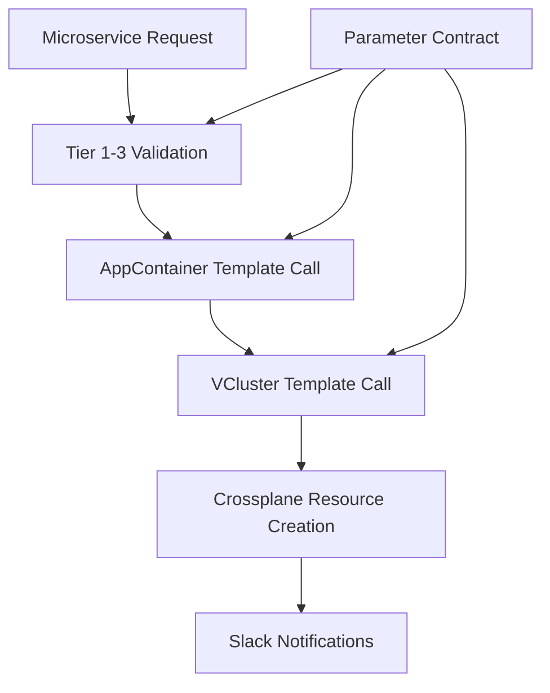

# Architectural Decisions Record (ADR)

This document captures the key architectural decisions made during the implementation of the standardized parameter contract system for the Internal Developer Platform (IDP).

## Overview

The project evolved from simple workflow templates to a sophisticated, standardized parameter contract system that enables consistent, composable microservice creation workflows. This ADR documents the architectural evolution, key decisions, and rationale.

---

## Decision Timeline

### Phase 1: Initial Assessment (Pre-Development)
**Date**: Session Start  
**Context**: Existing workflow templates had parameter inconsistencies and poor composition

#### ADR-001: Adopt Standardized Parameter Contract System
**Decision**: Implement a 4-tier parameter contract system instead of ad-hoc parameter passing

**Options Considered**:
- Option A: Minimal changes - fix immediate issues only
- Option B: Incremental improvement - standardize some parameters
- Option C: Full standardized parameter contract with composition layer

**Decision**: Option C - Full standardized parameter contract

**Rationale**:
- DRY principle: Eliminate parameter duplication across 15+ workflow templates
- Consistency: Ensure all workflows use same parameter names and validation
- Composability: Enable template composition (Microservice → AppContainer → VCluster)
- Maintainability: Centralized parameter definitions reduce maintenance burden
- Testability: Standardized contracts enable systematic testing

**Consequences**:
- ✅ Consistent parameter interface across all workflows
- ✅ Template composition enables complex workflow orchestration  
- ✅ Reduced cognitive load for developers
- ❌ Significant refactoring required for existing templates
- ❌ Learning curve for new parameter contract system

---

### Phase 2: Parameter Contract Design (Early Development)

#### ADR-002: Four-Tier Parameter Architecture
**Date**: Early implementation  
**Decision**: Structure parameters into 4 hierarchical tiers

**Tier Structure**:
1. **Tier 1 - Universal**: Required by all workflows (resource-name, resource-type, namespace, user, etc.)
2. **Tier 2 - Platform**: Common platform features (security-enabled, observability-enabled, environment-tier)
3. **Tier 3 - Resource-Specific**: Specific to resource type (vcluster-capabilities, microservice-language)
4. **Tier 4 - Advanced**: Advanced/optional configurations

**Rationale**:
- **Separation of Concerns**: Clear boundaries between universal and specialized parameters
- **Progressive Disclosure**: Basic users see Tier 1-2, advanced users access Tier 3-4
- **Template Composition**: Upper tiers enable parameter flow between composed templates
- **Validation Strategy**: Each tier has appropriate validation rules

**Implementation Details**:
```yaml
# Universal parameters (Tier 1) - Required by ALL workflows
- name: resource-name
  description: "Resource name (DNS-1123 compliant)"
- name: resource-type  
  description: "Type of resource (microservice, appcontainer, vcluster)"
- name: namespace
  description: "Kubernetes namespace"
- name: user
  description: "Requesting user"

# Platform parameters (Tier 2) - Common platform features  
- name: security-enabled
  default: "true"
- name: observability-enabled  
  default: "true"
- name: environment-tier
  default: "development"

# Resource-specific parameters (Tier 3)
- name: vcluster-capabilities  # VCluster-specific
- name: microservice-language  # Microservice-specific
- name: target-vcluster        # AppContainer-specific
```

---

#### ADR-003: Template Composition Strategy
**Date**: Mid-implementation  
**Decision**: Implement hierarchical template composition using templateRef

**Composition Chain**:
```
Microservice Template
    ↓ (calls via templateRef)
AppContainer Template  
    ↓ (calls via templateRef)
VCluster Template
    ↓ (creates)
Crossplane Resources
```

**Rationale**:
- **Single Responsibility**: Each template handles one resource type
- **Reusability**: VCluster template used by both AppContainer and standalone workflows
- **Parameter Flow**: Standardized contracts enable parameter passing between levels
- **Dependency Management**: Higher-level templates manage lower-level dependencies

**Implementation**:
- `microservice-standard-contract.yaml`: Top-level microservice creation
- `appcontainer-standard-contract.yaml`: Application container management
- `vcluster-standard-contract.yaml`: Virtual cluster provisioning
- Each template validates its tier parameters and passes appropriate parameters down

---

### Phase 3: Notification System Evolution

#### ADR-004: Migrate from Complex to Simple Slack Notifications
**Date**: Mid-development  
**Decision**: Replace `slack-standard-notifications` with `simple-slack-notifications`

**Problem**: Original notification system was over-engineered:
```yaml
# Complex - required many parameters
templateRef:
  name: slack-standard-notifications
  template: notify-workflow-starting
parameters:
  - name: workflow-description
  - name: step-name  
  - name: progress-message
  - name: capabilities
  - name: endpoints
  # ... 10+ parameters
```

**Solution**: Simplified notification interface:
```yaml
# Simple - minimal required parameters
templateRef:
  name: simple-slack-notifications
  template: send-notification
parameters:
  - name: resource-name
  - name: resource-type
  - name: user
  - name: message
  - name: notification-type  # starting|progress|success|failure
```

**Rationale**:
- **KISS Principle**: Simpler interface reduces errors
- **Consistency**: Same notification interface across all workflows
- **Maintainability**: Single notification template to maintain
- **Reliability**: Fewer parameters = fewer failure points

---

### Phase 4: Critical Bug Resolution

#### ADR-005: Fix JSON Parameter Validation in Shell Scripts
**Date**: Late development  
**Problem**: VCluster template failing on JSON capabilities validation

**Issue**:
```bash
# BROKEN - parameter expansion not quoted properly
echo "{{inputs.parameters.vcluster-capabilities}}" | jq . > /dev/null 2>&1
```

**Root Cause**: Shell parameter expansion in complex JSON broke jq parsing

**Solution**:
```bash
# FIXED - quote parameter expansion properly  
CAPABILITIES='{{inputs.parameters.vcluster-capabilities}}'
echo "$CAPABILITIES" | jq . > /dev/null 2>&1
```

**Rationale**:
- **Shell Best Practice**: Always quote variable expansions containing complex data
- **Robust Validation**: Proper quoting ensures jq can parse JSON correctly
- **Error Prevention**: Prevents workflow failures due to shell parsing issues

---

#### ADR-006: Fix Template Parameter References  
**Date**: Late development
**Problem**: AppContainer template using wrong parameter source

**Issue**:
```yaml
# BROKEN - using workflow.parameters instead of inputs.parameters
- name: resource-type
  value: "{{workflow.parameters.resource-type}}"
```

**Root Cause**: Template composition requires `inputs.parameters` not `workflow.parameters`

**Solution**:
```yaml
# FIXED - use template inputs for composition
- name: resource-type
  value: "{{inputs.parameters.resource-type}}"
  
# OR hardcode for validation steps
- name: resource-type
  value: "appcontainer"  # Hard-coded for type validation
```

**Rationale**:
- **Template Composition**: `inputs.parameters` enables parameter flow between templates
- **Type Safety**: Hard-coding resource-type in validation prevents type mismatches
- **Workflow Orchestration**: Enables complex multi-template workflows

---

#### ADR-007: Resolve RBAC Permissions for Slack Integration
**Date**: Late development  
**Problem**: Workflow pods couldn't read slack-webhook secret

**Issue**:
```bash
kubectl get secret slack-webhook -n argo  
# Error: secrets is forbidden: User "system:serviceaccount:argo:argo" cannot get resource "secrets"
```

**Root Cause**: Argo workflow ServiceAccount lacked secret read permissions

**Solution**:
```bash
# Add secrets read permission to argo-cluster-role
kubectl patch clusterrole argo-cluster-role --type='json' -p='[{
  "op": "add", 
  "path": "/rules/-", 
  "value": {
    "apiGroups": [""], 
    "resources": ["secrets"], 
    "verbs": ["get", "list"]
  }
}]'

# Restart workflow controller to pick up RBAC changes
kubectl rollout restart deployment workflow-controller -n argo
```

**Rationale**:
- **Principle of Least Privilege**: Only grant minimum permissions required
- **Security Boundary**: Secret access controlled through RBAC
- **Operational Requirement**: Workflows need secret access for Slack notifications

---

### Phase 5: Secret Management Strategy

#### ADR-008: Manual Secret Management for Sensitive Data
**Date**: Late development  
**Decision**: Manage Slack webhook secrets manually, not through GitOps

**Problem**: Slack webhook signing secret cannot be stored in Git

**Options Considered**:
1. **GitOps Management**: Store encrypted secrets in Git (SealedSecrets/SOPS)
2. **Manual Management**: Create secrets manually via kubectl/scripts  
3. **External Secret Management**: Use AWS Secrets Manager/HashiCorp Vault

**Decision**: Manual Management with deployment scripts

**Implementation**:
```bash
# Manual secret creation script
kubectl create secret generic slack-webhook \
  --from-literal=webhook-url="https://hooks.slack.com/..." \
  --from-literal=signing-secret="1f50ac1d5e5c39eb9bf00dad682a4141" \
  -n argo
```

**Rationale**:
- **Security**: Keeps sensitive webhook URLs and signing secrets out of Git
- **Simplicity**: No additional tooling required (SealedSecrets, SOPS, etc.)
- **Operational**: Manual management acceptable for platform-level secrets
- **Documentation**: Clear deployment scripts show exactly what secrets are needed

**Consequences**:
- ✅ Secrets never committed to Git
- ✅ Simple deployment process
- ❌ Manual step required for new environments  
- ❌ No secret rotation automation

---

## Current Architecture State

### Template Hierarchy
```
📁 argo-workflows/
├── microservice-standard-contract.yaml    # Entry point - Tier 1 interface
├── appcontainer-standard-contract.yaml    # Tier 2 - App container orchestration  
├── vcluster-standard-contract.yaml        # Tier 3 - Infrastructure provisioning
├── simple-slack-notifications.yaml        # Shared notification system
└── Legacy Templates/                       # Previous implementations
    ├── microservice-template-v2.yaml      # Pre-contract implementation
    ├── appcontainer-mapping-layer.yaml    # Intermediate solution
    └── ...
```

### Parameter Flow Architecture


### Working Components
✅ **Parameter Contract System**: 4-tier standardized parameters  
✅ **Template Composition**: Microservice → AppContainer → VCluster  
✅ **Slack Notifications**: Working end-to-end with proper RBAC  
✅ **Parameter Validation**: JSON, DNS-1123, enum validation  
✅ **Crossplane Integration**: VClusterEnvironmentClaim creation  

### Known Issues  
❌ **VCluster Provisioning**: Claims stuck in "not ready" state  
❌ **Repository Creation**: AppContainerClaim not completing  
❌ **AWS Token Expiry**: Need to re-authenticate to investigate Crossplane

---

## Lessons Learned

### Technical Lessons
1. **Parameter Standardization**: Upfront investment in parameter contracts pays dividends in maintainability
2. **Template Composition**: `templateRef` enables powerful workflow orchestration when parameters are standardized
3. **Shell Script Robustness**: Always quote parameter expansions, especially for JSON data
4. **RBAC Debugging**: Workflow failures often stem from permission issues, not code bugs
5. **Secret Management**: Manual secret deployment is acceptable for platform infrastructure

### Process Lessons  
1. **Iterative Development**: Start with working solution, then refactor to architectural ideals
2. **End-to-End Testing**: Parameter contracts only prove value when tested across full workflow
3. **Documentation**: ADR creation helps consolidate architectural decisions and rationale
4. **Debugging Strategy**: Layer-by-layer debugging (params → validation → RBAC → resources)

### Architecture Lessons
1. **Separation of Concerns**: Clear boundaries between resource types improves maintainability
2. **Progressive Enhancement**: Four-tier parameter system supports both simple and complex use cases  
3. **Fail Fast**: Parameter validation at the top prevents resource creation failures later
4. **Observability**: Slack notifications provide crucial workflow visibility

---

## Next Steps

### Immediate (AWS re-authentication required)
1. **Debug VCluster Provisioning**: Check Crossplane VCluster operator status
2. **Investigate Repository Creation**: Verify AppContainerClaim controller functionality
3. **End-to-End Validation**: Complete microservice creation workflow test

### Medium Term
1. **Documentation**: Create README.md with current state and usage instructions
2. **Template Cleanup**: Remove legacy templates once standardized versions proven
3. **Secret Automation**: Consider SealedSecrets for automated secret management

### Long Term  
1. **Observability Enhancement**: Add Prometheus metrics for workflow success rates
2. **Template Expansion**: Apply parameter contract pattern to other resource types
3. **Developer Experience**: Create CLI tools that leverage standardized parameter contracts

---

## References

- **Parameter Contract Implementation**: `argo-workflows/*-standard-contract.yaml`
- **Working Test Cases**: `/tmp/test-*-working.yaml` 
- **Slack Integration**: `argo-workflows/simple-slack-notifications.yaml`
- **RBAC Configuration**: kubectl commands in session history
- **Secret Management**: `deploy-slack-notifications.sh`

---

**Document Status**: Current as of latest session  
**Next Review**: After AWS re-authentication and VCluster debugging  
**Maintained By**: Platform Team