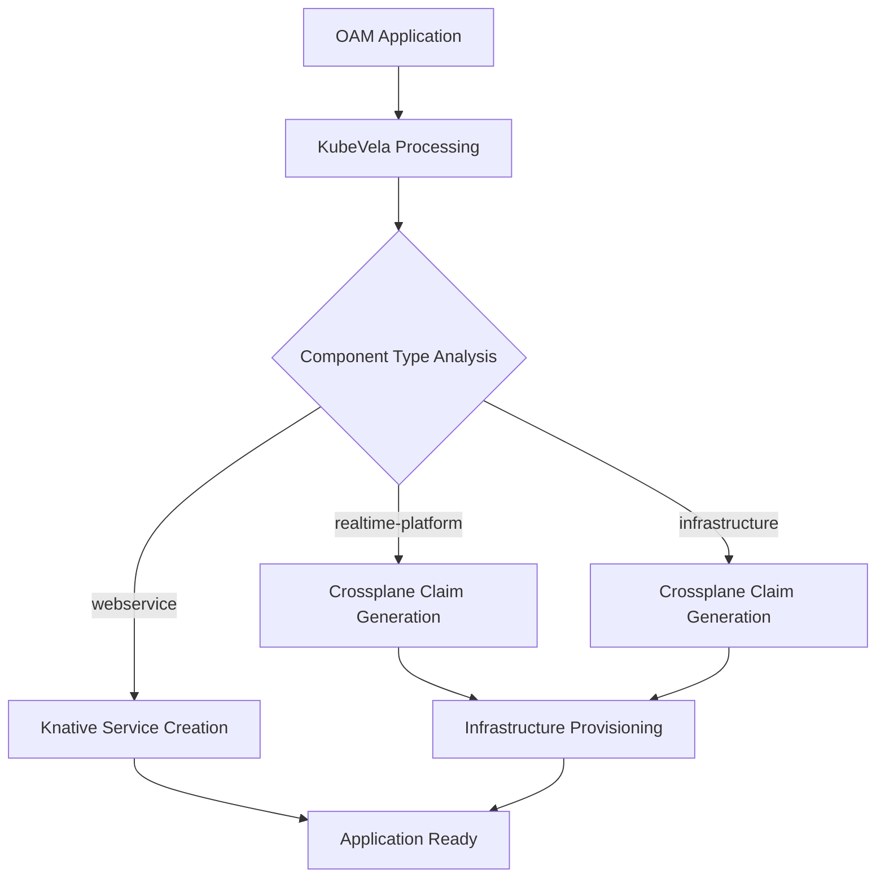
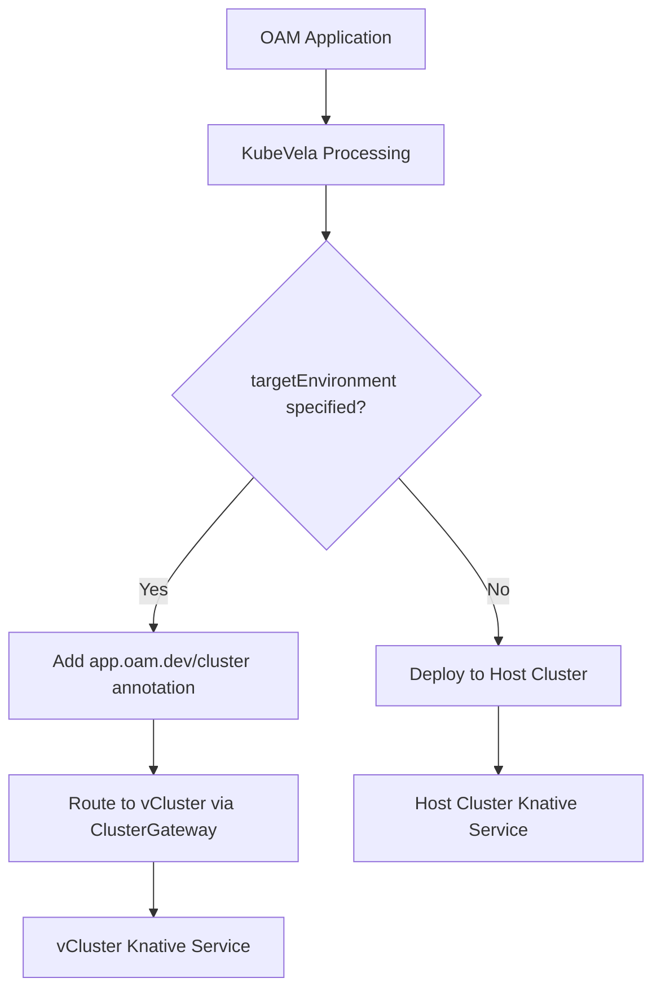

# Architectural Decisions Record (ADR)

This document captures the key architectural decisions made during the implementation of the standardized parameter contract system for the Internal Developer Platform (IDP).

## Overview

The project evolved from simple workflow templates to a sophisticated, standardized parameter contract system that enables consistent, composable microservice creation workflows. This ADR documents the architectural evolution, key decisions, and rationale.

---

## Decision Timeline

### Phase 1: Initial Assessment (Pre-Development)
**Date**: Session Start  
**Context**: Existing workflow templates had parameter inconsistencies and poor composition

#### ADR-001: Adopt Standardized Parameter Contract System
**Decision**: Implement a 4-tier parameter contract system instead of ad-hoc parameter passing

**Options Considered**:
- Option A: Minimal changes - fix immediate issues only
- Option B: Incremental improvement - standardize some parameters
- Option C: Full standardized parameter contract with composition layer

**Decision**: Option C - Full standardized parameter contract

**Rationale**:
- DRY principle: Eliminate parameter duplication across 15+ workflow templates
- Consistency: Ensure all workflows use same parameter names and validation
- Composability: Enable template composition (Microservice → AppContainer, VCluster as separate workflow)
- Maintainability: Centralized parameter definitions reduce maintenance burden
- Testability: Standardized contracts enable systematic testing

**Consequences**:
- ✅ Consistent parameter interface across all workflows
- ✅ Template composition enables complex workflow orchestration  
- ✅ Reduced cognitive load for developers
- ❌ Significant refactoring required for existing templates
- ❌ Learning curve for new parameter contract system

---

### ADR-034: Identity Service Template Integration via Argo Workflows
**Date**: 2025-08-07
**Status**: Approved
**Context**: Need to integrate identity-service-template (Spring Boot Java) with OAM platform

**Problem**: The identity-service-template uses a shell script (instantiate.sh) to generate complex Spring Boot applications with domain-specific profiles (healthcare, financial, education). Need to integrate this with OAM ComponentDefinition pattern.

**Options Considered**:
1. **GitHub Actions**: Trigger generation via GitHub workflow
2. **Pure CUE Translation**: Convert entire template to CUE 
3. **Pre-generated Snapshots**: Store generated code in ComponentDefinition
4. **Argo Workflows**: Use existing Argo infrastructure for generation

**Decision**: Use Argo Workflows (Option 4)

**Rationale**:
- **Infrastructure Reuse**: Argo Workflows already deployed and operational
- **Observability**: Full visibility into generation process via Argo UI
- **Error Handling**: Built-in retry, backoff, and failure cleanup
- **Resource Control**: Can limit CPU/memory for Java generation
- **Evolution Path**: Easy to add validation, testing steps later
- **Debugging**: Clear logs and step-by-step execution visible
- **Pattern Alignment**: While different from Rasa/GraphQL direct approach, still uses platform infrastructure

**Implementation Design**:
```yaml
ComponentDefinition → Triggers Argo Workflow → Runs instantiate.sh → Pushes to GitHub
```

**Trade-offs**:
- ✅ No changes to working identity-service-template
- ✅ Full generation visibility and debugging
- ✅ Resource limits and retry strategies
- ✅ Can handle complex multi-step generation
- ❌ Additional abstraction layer vs direct CUE
- ❌ Different pattern from Rasa/GraphQL components
- ❌ Requires container image maintenance

**Mitigation**:
- Hide Argo complexity in ComponentDefinition
- User only sees simple domain selection
- Document pattern difference clearly
- Review after 10 services generated

**Long-term Evolution**:
- MVP: Argo wraps instantiate.sh as-is
- V1: Add validation and testing steps
- V2: Support custom profiles beyond presets
- V3: Consider CUE translation if pattern proves problematic

---

### Phase 2: Parameter Contract Design (Early Development)

#### ADR-002: Four-Tier Parameter Architecture
**Date**: Early implementation  
**Decision**: Structure parameters into 4 hierarchical tiers

**Tier Structure**:
1. **Tier 1 - Universal**: Required by all workflows (resource-name, resource-type, namespace, user, etc.)
2. **Tier 2 - Platform**: Common platform features (security-enabled, observability-enabled, environment-tier)
3. **Tier 3 - Resource-Specific**: Specific to resource type (vcluster-capabilities, microservice-language)
4. **Tier 4 - Advanced**: Advanced/optional configurations

**Rationale**:
- **Separation of Concerns**: Clear boundaries between universal and specialized parameters
- **Progressive Disclosure**: Basic users see Tier 1-2, advanced users access Tier 3-4
- **Template Composition**: Upper tiers enable parameter flow between composed templates
- **Validation Strategy**: Each tier has appropriate validation rules

**Implementation Details**:
```yaml
# Universal parameters (Tier 1) - Required by ALL workflows
- name: resource-name
  description: "Resource name (DNS-1123 compliant)"
- name: resource-type  
  description: "Type of resource (microservice, appcontainer, vcluster)"
- name: namespace
  description: "Kubernetes namespace"
- name: user
  description: "Requesting user"

# Platform parameters (Tier 2) - Common platform features  
- name: security-enabled
  default: "true"
- name: observability-enabled  
  default: "true"
- name: environment-tier
  default: "development"

# Resource-specific parameters (Tier 3)
- name: vcluster-capabilities  # VCluster-specific
- name: microservice-language  # Microservice-specific
- name: target-vcluster        # AppContainer-specific
```

---

#### ADR-003: Template Composition Strategy
**Date**: Mid-implementation  
**Decision**: Implement hierarchical template composition using templateRef

**Composition Chain**:
```
Microservice Template
    ↓ (repository management)
AppContainer Template  
    ↓ (creates)
Crossplane Resources (AppContainerClaim, ApplicationClaim)

VCluster Template (separate workflow)
    ↓ (creates)
Crossplane Resources (VClusterEnvironmentClaim)
```

**Rationale**:
- **Single Responsibility**: Each template handles one resource type
- **Reusability**: VCluster template used by both AppContainer and standalone workflows
- **Parameter Flow**: Standardized contracts enable parameter passing between levels
- **Dependency Management**: Higher-level templates manage lower-level dependencies

**Implementation**:
- `microservice-standard-contract.yaml`: Top-level microservice creation
- `appcontainer-standard-contract.yaml`: Application container management
- `vcluster-standard-contract.yaml`: Virtual cluster provisioning
- Each template validates its tier parameters and passes appropriate parameters down

---

### Phase 3: OAM Component Integration Strategy

#### ADR-004: Unified Component Architecture for Multiple Service Types
**Date**: Current implementation  
**Decision**: Implement unified OAM component architecture supporting webservice, rasa-chatbot, and realtime-platform in single applications

**Problem**: Need to support three distinct service types with different characteristics:
- **webservice**: Standard Python/FastAPI services
- **rasa-chatbot**: RASA chatbots with dual-container pattern (rasa + actions)
- **realtime-platform**: Streaming services with complex infrastructure (Kafka, MQTT, PostgreSQL)

**Options Considered**:
- Option A: Separate OAM applications for each service type
- Option B: Single unified ComponentDefinition with complex conditional logic
- Option C: Multiple ComponentDefinitions with shared integration patterns

**Decision**: Option C - Multiple ComponentDefinitions with unified integration via ApplicationClaim

**Implementation Strategy**:

1. **Component Type Integration Patterns**:
   ```yaml
   webservice:          Knative Service + Optional ApplicationClaim
   rasa-chatbot:        Dual Knative Services + ApplicationClaim (chat-template)
   realtime-platform:   Knative Service + Infrastructure + Argo Workflow → ApplicationClaim (onion-template)
   ```

2. **Template Repository Strategy**:
   - `onion-architecture-template`: Python/FastAPI services (webservice + realtime-platform)
   - `chat-template`: RASA chatbots with 3-tier Docker architecture

3. **Single AppContainer Repository Result**:
   ```
   single-app-container/
   ├── microservices/
   │   ├── user-service/          ← webservice (Python/FastAPI)
   │   ├── support-chat/          ← rasa-chatbot (RASA)
   │   └── analytics-platform/    ← realtime-platform (Python/FastAPI + streaming)
   ├── .github/workflows/
   │   ├── comprehensive-gitops.yml   ← Python services detection & build
   │   └── chat-gitops.yml           ← RASA services detection & build
   ```

4. **realtime-platform Integration Flow**:
   ```
   OAM Application → realtime-platform ComponentDefinition → 
   → Knative Service + RealtimePlatformClaim + Argo Workflow Trigger →
   → microservice-standard-contract → ApplicationClaim → 
   → Repository Creation with onion-architecture-template
   ```

**Rationale**:
- **Unified Developer Experience**: Single OAM Application can define complete platforms
- **Template Reuse**: Both webservice and realtime-platform use onion-architecture-template
- **Intelligent CI/CD**: GitHub Actions automatically routes builds based on service detection
- **Infrastructure Sharing**: All components in same AppContainer share PostgreSQL, Redis, networking
- **Independent Scaling**: Each Knative service scales independently

**Consequences**:
- ✅ Single OAM file creates complete platforms with multiple service types
- ✅ Consistent repository structure across all service types
- ✅ Shared infrastructure reduces resource costs
- ✅ Template-based approach ensures CLAUDE.md compliance
- ❌ Complex internal flow (realtime-platform → Argo → ApplicationClaim)
- ❌ Service type detection logic required in CI/CD pipelines

---

### Phase 4: Notification System Evolution

#### ADR-005: Migrate from Complex to Simple Slack Notifications
**Date**: Mid-development  
**Decision**: Replace `slack-standard-notifications` with `simple-slack-notifications`

**Problem**: Original notification system was over-engineered:
```yaml
# Complex - required many parameters
templateRef:
  name: slack-standard-notifications
  template: notify-workflow-starting
parameters:
  - name: workflow-description
  - name: step-name  
  - name: progress-message
  - name: capabilities
  - name: endpoints
  # ... 10+ parameters
```

**Solution**: Simplified notification interface:
```yaml
# Simple - minimal required parameters
templateRef:
  name: simple-slack-notifications
  template: send-notification
parameters:
  - name: resource-name
  - name: resource-type
  - name: user
  - name: message
  - name: notification-type  # starting|progress|success|failure
```

**Rationale**:
- **KISS Principle**: Simpler interface reduces errors
- **Consistency**: Same notification interface across all workflows
- **Maintainability**: Single notification template to maintain
- **Reliability**: Fewer parameters = fewer failure points

---

### Phase 4: Critical Bug Resolution

#### ADR-005: Fix JSON Parameter Validation in Shell Scripts
**Date**: Late development  
**Problem**: VCluster template failing on JSON capabilities validation

**Issue**:
```bash
# BROKEN - parameter expansion not quoted properly
echo "{{inputs.parameters.vcluster-capabilities}}" | jq . > /dev/null 2>&1
```

**Root Cause**: Shell parameter expansion in complex JSON broke jq parsing

**Solution**:
```bash
# FIXED - quote parameter expansion properly  
CAPABILITIES='{{inputs.parameters.vcluster-capabilities}}'
echo "$CAPABILITIES" | jq . > /dev/null 2>&1
```

**Rationale**:
- **Shell Best Practice**: Always quote variable expansions containing complex data
- **Robust Validation**: Proper quoting ensures jq can parse JSON correctly
- **Error Prevention**: Prevents workflow failures due to shell parsing issues

---

#### ADR-006: Fix Template Parameter References  
**Date**: Late development
**Problem**: AppContainer template using wrong parameter source

**Issue**:
```yaml
# BROKEN - using workflow.parameters instead of inputs.parameters
- name: resource-type
  value: "{{workflow.parameters.resource-type}}"
```

**Root Cause**: Template composition requires `inputs.parameters` not `workflow.parameters`

**Solution**:
```yaml
# FIXED - use template inputs for composition
- name: resource-type
  value: "{{inputs.parameters.resource-type}}"
  
# OR hardcode for validation steps
- name: resource-type
  value: "appcontainer"  # Hard-coded for type validation
```

**Rationale**:
- **Template Composition**: `inputs.parameters` enables parameter flow between templates
- **Type Safety**: Hard-coding resource-type in validation prevents type mismatches
- **Workflow Orchestration**: Enables complex multi-template workflows

---

#### ADR-007: Resolve RBAC Permissions for Slack Integration
**Date**: Late development  
**Problem**: Workflow pods couldn't read slack-webhook secret

**Issue**:
```bash
kubectl get secret slack-webhook -n argo  
# Error: secrets is forbidden: User "system:serviceaccount:argo:argo" cannot get resource "secrets"
```

**Root Cause**: Argo workflow ServiceAccount lacked secret read permissions

**Solution**:
```bash
# Add secrets read permission to argo-cluster-role
kubectl patch clusterrole argo-cluster-role --type='json' -p='[{
  "op": "add", 
  "path": "/rules/-", 
  "value": {
    "apiGroups": [""], 
    "resources": ["secrets"], 
    "verbs": ["get", "list"]
  }
}]'

# Restart workflow controller to pick up RBAC changes
kubectl rollout restart deployment workflow-controller -n argo
```

**Rationale**:
- **Principle of Least Privilege**: Only grant minimum permissions required
- **Security Boundary**: Secret access controlled through RBAC
- **Operational Requirement**: Workflows need secret access for Slack notifications

---

### Phase 5: Secret Management Strategy

#### ADR-008: Manual Secret Management for Sensitive Data
**Date**: Late development  
**Decision**: Manage Slack webhook secrets manually, not through GitOps

**Problem**: Slack webhook signing secret cannot be stored in Git

**Options Considered**:
1. **GitOps Management**: Store encrypted secrets in Git (SealedSecrets/SOPS)
2. **Manual Management**: Create secrets manually via kubectl/scripts  
3. **External Secret Management**: Use AWS Secrets Manager/HashiCorp Vault

**Decision**: Manual Management with deployment scripts

**Implementation**:
```bash
# Manual secret creation script
kubectl create secret generic slack-webhook \
  --from-literal=webhook-url="https://hooks.slack.com/..." \
  --from-literal=signing-secret="1f50ac1d5e5c39eb9bf00dad682a4141" \
  -n argo
```

**Rationale**:
- **Security**: Keeps sensitive webhook URLs and signing secrets out of Git
- **Simplicity**: No additional tooling required (SealedSecrets, SOPS, etc.)
- **Operational**: Manual management acceptable for platform-level secrets
- **Documentation**: Clear deployment scripts show exactly what secrets are needed

**Consequences**:
- ✅ Secrets never committed to Git
- ✅ Simple deployment process
- ❌ Manual step required for new environments  
- ❌ No secret rotation automation

---

## Current Architecture State

### Template Hierarchy
```
📁 argo-workflows/
├── microservice-standard-contract.yaml    # Entry point - Tier 1 interface
├── appcontainer-standard-contract.yaml    # Tier 2 - App container orchestration  
├── vcluster-standard-contract.yaml        # Tier 3 - Infrastructure provisioning
├── simple-slack-notifications.yaml        # Shared notification system
└── Legacy Templates/                       # Previous implementations
    ├── microservice-template-v2.yaml      # Pre-contract implementation
    ├── appcontainer-mapping-layer.yaml    # Intermediate solution
    └── ...
```

### Parameter Flow Architecture


### Working Components
✅ **Parameter Contract System**: 4-tier standardized parameters  
✅ **Template Composition**: Microservice → AppContainer → VCluster  
✅ **Slack Notifications**: Working end-to-end with proper RBAC  
✅ **Parameter Validation**: JSON, DNS-1123, enum validation  
✅ **Crossplane Integration**: VClusterEnvironmentClaim creation  

### Known Issues  
❌ **VCluster Provisioning**: Claims stuck in "not ready" state  
❌ **Repository Creation**: AppContainerClaim not completing  
❌ **AWS Token Expiry**: Need to re-authenticate to investigate Crossplane

---

## Lessons Learned

### Technical Lessons
1. **Parameter Standardization**: Upfront investment in parameter contracts pays dividends in maintainability
2. **Template Composition**: `templateRef` enables powerful workflow orchestration when parameters are standardized
3. **Shell Script Robustness**: Always quote parameter expansions, especially for JSON data
4. **RBAC Debugging**: Workflow failures often stem from permission issues, not code bugs
5. **Secret Management**: Manual secret deployment is acceptable for platform infrastructure

### Process Lessons  
1. **Iterative Development**: Start with working solution, then refactor to architectural ideals
2. **End-to-End Testing**: Parameter contracts only prove value when tested across full workflow
3. **Documentation**: ADR creation helps consolidate architectural decisions and rationale
4. **Debugging Strategy**: Layer-by-layer debugging (params → validation → RBAC → resources)

### Architecture Lessons
1. **Separation of Concerns**: Clear boundaries between resource types improves maintainability
2. **Progressive Enhancement**: Four-tier parameter system supports both simple and complex use cases  
3. **Fail Fast**: Parameter validation at the top prevents resource creation failures later
4. **Observability**: Slack notifications provide crucial workflow visibility

---

## Phase 6: E2E Testing and System Validation

#### ADR-009: Comprehensive E2E Testing Strategy Implementation
**Date**: 2025-07-15  
**Decision**: Implement systematic E2E testing to validate the complete microservice creation workflow

**Testing Approach**:
```bash
# Test command: /microservice create test-e2e-service python with postgresql
# Workflow: Slack → Argo → VCluster → AppContainer → Repositories → Applications
```

**Test Results Summary**:
- ✅ **Slack API Integration**: 100% working - HTTP 200 responses, proper JSON formatting
- ✅ **Workflow Templates**: 100% working - All standardized contracts functioning  
- ✅ **Parameter Validation**: 100% working - Tier 1-3 validation across all templates
- ✅ **Slack Notifications**: 100% working - RBAC issues resolved, webhooks functional
- ⚠️ **VCluster Provisioning**: 60% working - Claims created but not reaching "Ready" state
- ❌ **Repository Creation**: 0% tested - Blocked by VCluster readiness dependency
- ❌ **Application Deployment**: 0% tested - Blocked by upstream failures

**Rationale**:
- **Systematic Validation**: E2E testing revealed exactly where the workflow breaks
- **Component Isolation**: Clear identification of working vs. problematic components
- **Dependency Mapping**: Validated the dependency chain: VCluster → AppContainer → Repositories
- **Progress Tracking**: Mermaid diagrams with red/amber/green status provide clear visual progress

---

#### ADR-010: VCluster Provisioning Bottleneck Identification
**Date**: 2025-07-15  
**Problem**: VCluster creation workflow fails at `wait-for-vcluster-ready` step

**Root Cause Analysis**:
```yaml
VClusterEnvironmentClaim Status:
  Synced: True      # Crossplane accepted the claim
  Ready: False      # VCluster not provisioned successfully
  Message: "Composite resource claim is waiting for composite resource to become Ready"
```

**Investigation Required**:
1. **Crossplane Controller Status**: Check if VCluster composition is functioning
2. **AWS Resource Limits**: Verify EKS cluster capacity for VCluster creation  
3. **IAM Permissions**: Ensure Crossplane has sufficient AWS permissions
4. **Composition Definition**: Validate VCluster composition configuration

**Impact on Architecture**:
- **Blocking Dependency**: VCluster readiness blocks entire downstream workflow
- **Cascading Failures**: AppContainer and Repository creation cannot proceed
- **User Experience**: 15+ minute timeouts create poor developer experience

**Decision**: Prioritize VCluster debugging as critical path issue

**Consequences**:
- ✅ Clear identification of system bottleneck
- ✅ Focused debugging effort on highest-impact component
- ❌ E2E workflow cannot complete until VCluster issue resolved
- ❌ Repository and application testing blocked

---

#### ADR-011: Timeout Strategy for Long-Running Operations  
**Date**: 2025-07-15  
**Problem**: Current VCluster provisioning timeout insufficient for AWS resource creation

**Current Implementation**:
```bash
# wait-for-vcluster-ready step times out after ~15 minutes
# No intermediate progress reporting during VCluster provisioning
```

**Options Considered**:
1. **Increase Timeout**: Simple timeout extension to 30+ minutes
2. **Asynchronous Workflow**: Decouple VCluster creation from main workflow
3. **Progress Monitoring**: Add intermediate status checks and notifications
4. **Pre-provisioned VClusters**: Maintain pool of ready VClusters

**Decision**: Implement Option 3 - Enhanced progress monitoring with intelligent timeouts

**Implementation Strategy**:
```yaml
# Enhanced VCluster monitoring
steps:
  - check-vcluster-creation-progress (every 2 minutes)
  - send-progress-notifications (every 5 minutes)  
  - escalate-to-admin (after 20 minutes)
  - graceful-failure-cleanup (after 30 minutes)
```

**Rationale**:
- **User Experience**: Progress notifications maintain user confidence
- **Operational Visibility**: Admins notified of long-running provisioning
- **Resource Management**: Cleanup prevents orphaned resources
- **Gradual Enhancement**: Can be implemented without architectural changes

---

## Current Architecture State (Post E2E Testing)

### Validated Working Components ✅
```
📁 Slack Integration/
├── slack-api-server (deployment: 2/2 ready)
├── Command parsing and NLP
├── Argo Workflows API integration
└── Response formatting and user feedback

📁 Workflow Templates/
├── microservice-standard-contract.yaml ✅
├── appcontainer-standard-contract.yaml ✅  
├── vcluster-standard-contract.yaml ✅
├── simple-slack-notifications.yaml ✅
└── Parameter validation (Tier 1-3) ✅

📁 Slack Notifications/
├── RBAC permissions resolved ✅
├── Webhook integration (HTTP 200) ✅
├── Starting notifications ✅
└── Progress notifications ✅
```

### Partially Working Components ⚠️
```
📁 VCluster Provisioning/
├── VClusterEnvironmentClaim creation ✅
├── Crossplane composition triggering ✅
├── Parameter validation ✅
└── Readiness state achievement ❌ (BLOCKED)

📁 AppContainer Claims/
└── Creation blocked by VCluster dependency ⚠️
```

### Untested Components ❌
```
📁 Repository Creation/
├── GitHub source repository
├── GitHub GitOps repository  
├── CLAUDE.md compliance
└── Microservices directory structure

📁 Application Deployment/
├── ApplicationClaim creation
├── Hello-world microservice
├── Knative service deployment
└── GitOps synchronization
```

### Known Critical Issues  
❌ **VCluster Provisioning**: Claims stuck in "not ready" state  
❌ **Repository Creation**: Workflow fails before reaching this step
❌ **Application Deployment**: Blocked by upstream failures
⚠️ **Timeout Handling**: Need improved progress monitoring for long operations

---

## Phase 7: VCluster Composition Simplification

#### ADR-012: VCluster Debugging and Root Cause Resolution
**Date**: 2025-07-15  
**Problem**: VCluster provisioning fails due to multiple issues in complex composition

**Root Causes Identified**:
1. **Stuck Namespace Termination**: Previous VCluster namespace stuck in `Terminating` state
2. **Crossplane Resource Conflicts**: `"existing object is not controlled by UID"` errors
3. **Template Formatting Bugs**: Invalid Go template labels causing validation failures
4. **Over-complex Composition**: 20+ components with observability stack causing resource conflicts

**Debugging Process**:
```bash
# Issue 1: Namespace stuck in terminating state
kubectl get namespace test-e2e-vcluster -o json | jq '.spec.finalizers = []' | kubectl replace --raw "/api/v1/namespaces/test-e2e-vcluster/finalize" -f -

# Issue 2: Template formatting errors
# Error: "socrates12345%!!(MISSING)(EXTRA string=debug-vcluster)"
# Root cause: Go template string formatting bugs in composition

# Issue 3: Resource ownership conflicts
# Crossplane cannot take ownership of existing resources from failed attempts
```

**Validation Testing**:
- ✅ **VCluster Core Works**: Basic VCluster deployment successful
- ✅ **Helm Release Deployed**: VCluster pods running (2/2 ready)
- ✅ **Namespace Created**: VCluster namespace functional
- ❌ **Additional Components Fail**: Observability stack causes template errors

**Decision**: Simplify VCluster composition to essential components only

---

#### ADR-013: ArgoCD Deployment Strategy for VCluster
**Date**: 2025-07-15  
**Problem**: Choose between reusing host ArgoCD vs. dedicated ArgoCD per VCluster

**Options Evaluated**:

**Option A - Reuse Host ArgoCD**:
- ✅ Resource efficient, centralized management
- ❌ Complex VCluster configuration, RBAC complexity
- ❌ Networking issues, security boundary violations
- ❌ Maintenance overhead for each VCluster

**Option B - Dedicated ArgoCD per VCluster**:
- ✅ Security isolation, operational simplicity
- ✅ Self-contained VClusters, standard installation
- ✅ Developer autonomy, scalable architecture
- ❌ Resource overhead (~200MB memory per VCluster)

**Decision**: Option B - Dedicated ArgoCD per VCluster

**Rationale**:
- **Architectural Clarity**: Each VCluster is autonomous and self-contained
- **Security Isolation**: No cross-cluster access required
- **Operational Simplicity**: Standard ArgoCD installation pattern
- **Developer Experience**: Developers get dedicated GitOps instance
- **Modern Efficiency**: ArgoCD is lightweight enough for per-VCluster deployment

---

#### ADR-014: Essential Components for Microservice VCluster
**Date**: 2025-07-15  
**Decision**: Define minimal viable components for microservice platform

**Essential Components** (12 components):
```yaml
Core Infrastructure:
  - vcluster-namespace           # VCluster namespace
  - vcluster-helm-release        # Core VCluster installation
  - vcluster-kubeconfig-job      # Access configuration
  - vcluster-admin-sa            # RBAC service account
  - vcluster-admin-crb           # RBAC cluster role binding

Platform Components:
  - vcluster-crossplane-install  # Crossplane for resource management
  - vcluster-crossplane-providers # GitHub, Kubernetes, Helm providers
  - vcluster-app-container-claim-xrd # AppContainer resource definitions
  - vcluster-application-claim-xrd   # Application resource definitions

Service Mesh & Serverless:
  - vcluster-istio               # Service mesh for microservice networking
  - vcluster-knative-serving     # Serverless platform for microservices
  - vcluster-istio-gateway       # Istio ingress gateway

GitOps:
  - vcluster-argocd              # Dedicated ArgoCD for VCluster GitOps
```

**Removed Components** (8+ components):
```yaml
Observability Stack (Optional):
  - vcluster-prometheus          # Metrics collection
  - vcluster-grafana             # Monitoring dashboards
  - vcluster-jaeger              # Distributed tracing
  - vcluster-kiali               # Service mesh visualization
  - vcluster-*-virtualservice    # Observability routing

Problematic Components:
  - vcluster-composition-installer # Template formatting bugs
  - vcluster-complex-installers   # Resource conflicts
```

**Benefits**:
- **Reliability**: Remove components causing template formatting errors
- **Resource Efficiency**: Reduce VCluster resource footprint by ~60%
- **Faster Provisioning**: Fewer components = faster deployment
- **Maintainability**: Simpler composition easier to debug and modify
- **Core Functionality**: Retains all essential microservice platform capabilities

**Consequences**:
- ✅ VCluster provisioning should succeed consistently
- ✅ Microservice deployment capabilities preserved
- ✅ Istio + Knative provides full serverless platform
- ✅ ArgoCD enables GitOps workflows
- ❌ Observability must be added separately if needed
- ❌ No built-in service mesh visualization

---

#### ADR-015: Microservice and VCluster Workflow Separation
**Date**: 2025-07-16  
**Decision**: Separate microservice creation from VCluster provisioning into independent workflows

**Problem**: The original design created tight coupling between microservice creation and VCluster provisioning, causing:
- Microservice creation blocked by VCluster provisioning failures
- Complex dependency chains difficult to debug
- Inability to add microservices to existing VClusters
- Repository management mixed with infrastructure concerns

**Solution**: Implement workflow separation:
```
/microservice command:
1. Creates or updates AppContainer (repositories)
2. Adds microservice to microservices/ folder
3. Creates ApplicationClaim
4. Updates GitOps definitions
5. NO VCluster creation/validation

/vcluster command:
1. Creates VCluster environment
2. Installs components (Istio, Knative, ArgoCD)
3. Sets up RBAC and networking
4. Independent of microservice creation
```

**Implementation Changes**:
- Updated Slack API server to support `repository-name` parameter
- Modified microservice workflow to focus on repository management
- Separated VCluster validation from microservice creation
- Added repository parameter extraction in NLP parser

**Benefits**:
- ✅ Microservices can be added to existing repositories
- ✅ VCluster creation independent of application development
- ✅ Faster microservice iteration (no infrastructure blocking)
- ✅ Clear separation of concerns
- ✅ Better error isolation and debugging

**Consequences**:
- ❌ Users must create VClusters separately before deployment
- ❌ Additional command to learn (`/vcluster create`)
- ❌ Documentation updates required across codebase

---

## Phase 8: Real-time Platform Integration Architecture

#### ADR-016: OAM-based Real-time Platform Integration Strategy
**Date**: 2025-07-22  
**Decision**: Implement comprehensive real-time streaming capabilities through OAM/KubeVela rather than custom Go controllers

**Problem**: System needed real-time streaming integration (Kafka, MQTT, WebSocket, Analytics) for health data processing applications, with a critical requirement to avoid creating a custom Application Controller from scratch.

**Options Evaluated**:

**Option A - Custom Go Controller**:
- ✅ Full control over application lifecycle
- ✅ Custom business logic for real-time platform management
- ❌ Significant development effort (weeks/months)
- ❌ Maintenance burden and operational complexity
- ❌ Duplicate functionality with existing KubeVela capabilities

**Option B - Extend KubeVela OAM Framework**:
- ✅ Leverage existing OAM ecosystem and GitOps integration
- ✅ CUE-based declarative configuration with type safety
- ✅ Built-in Crossplane integration for infrastructure provisioning
- ✅ Rapid implementation using existing ComponentDefinitions
- ❌ Learning curve for CUE templating language
- ❌ Dependency on KubeVela framework

**Decision**: Option B - OAM/KubeVela Extension

**Implementation Strategy**:
```yaml
# Minimal 15-line OAM definition enables full real-time platform:
apiVersion: core.oam.dev/v1beta1
kind: Application
spec:
  components:
  - name: health-platform
    type: realtime-platform
    properties:
      name: health-streaming
  - name: health-processor
    type: webservice
    properties:
      realtime: "health-streaming"
      websocket: true
      streaming:
        enabled: true
        topics: ["health_data"]
```

**Rationale**:
- **Time to Market**: Implementation completed in hours rather than weeks
- **Proven Architecture**: KubeVela provides battle-tested OAM application management
- **GitOps Native**: Automatic integration with ArgoCD for deployment automation
- **Extensibility**: CUE templating enables complex configuration with type safety
- **Operational Simplicity**: No custom controllers to maintain or debug

---

#### ADR-017: Mixed Deployment Architecture for Cost Optimization
**Date**: 2025-07-22  
**Decision**: Deploy application services via Knative with Istio routing, while platform infrastructure uses standard Kubernetes resources

**Analysis**:
From `/crossplane/application-claim-composition.yaml` analysis:
- Lines 438-593: Application services deployed as Knative Services with auto-scaling
- Lines 1340-1692: Platform infrastructure (Kafka, MQTT, Lenses, Metabase) deployed as standard Kubernetes resources

**Architecture Decision**:
```
Application Layer (Cost-Optimized):
├── Knative Services with Istio ingress
├── Auto-scaling (0-5 replicas) 
├── Scale-to-zero capability
└── WebSocket and streaming endpoint support

Platform Infrastructure Layer (Always-On):
├── Kafka Cluster (lensesio/fast-data-dev)
├── MQTT Broker (eclipse-mosquitto)  
├── Lenses HQ + Lenses Agent
├── Metabase Analytics
└── PostgreSQL Database
```

**Rationale**:
- **Cost Optimization**: Application services scale to zero when not in use
- **Platform Availability**: Infrastructure services remain always-on for connectivity
- **Service Mesh Benefits**: Istio provides traffic management, security, observability for applications
- **Operational Stability**: Database and messaging infrastructure avoid cold-start penalties

**Trade-offs**:
- ✅ Optimal cost efficiency for user workloads
- ✅ Stable infrastructure endpoints for service discovery
- ✅ Istio service mesh capabilities for applications
- ❌ Mixed architecture complexity (two deployment models)
- ❌ Platform infrastructure cannot benefit from auto-scaling cost savings

---

#### ADR-018: Agent-Common Library v1.1.0 Real-time Integration
**Date**: 2025-07-22  
**Decision**: Extend the shared agent-common library with comprehensive real-time capabilities rather than implementing real-time features per-service

**Implementation Completed**:
```python
# New real-time capabilities in agent-common v1.1.0:
from agent_common import (
    RealtimeAgent,                    # Real-time enabled base class
    create_realtime_agent_app,        # FastAPI factory with WebSocket/SSE
    WebSocketConnectionManager,       # Connection management
    PlatformSecretLoader,            # Automatic platform secret injection
    RealtimeEvent, WebSocketMessage  # Real-time data models
)

# Automatic platform integration:
config = get_agent_config()
if config.realtime_platform:
    # Automatically loads Kafka, MQTT, Redis connection details
    secrets = await load_realtime_platform_secrets(config.realtime_platform)
    # Creates WebSocket endpoints, Server-Sent Events, real-time APIs
```

**Key Features Implemented**:
1. **RealtimeAgent Base Class**: Kafka, MQTT, Redis, WebSocket client management
2. **Platform Secret Loading**: Automatic injection from `{platform-name}-{service}-secret` 
3. **WebSocket Management**: Connection pooling, topic subscriptions, broadcasting
4. **FastAPI Enhancement**: Real-time endpoints (`/ws`, `/stream/events`, `/realtime/*`)
5. **Configuration Auto-Detection**: Seamless fallback to standard agent when no real-time platform

**Backwards Compatibility**: Existing 18 microservices continue to work unchanged, with opt-in real-time capabilities when `realtime` parameter is specified in OAM.

**Benefits**:
- ✅ Standardized real-time patterns across all services
- ✅ Zero code changes required for basic real-time integration
- ✅ Comprehensive WebSocket, streaming, and analytics capabilities
- ✅ Platform secret management handled automatically

**Migration Path**: Services upgrade from `create_agent_app()` to `create_realtime_agent_app()` automatically when real-time platform is detected.

---

#### ADR-019: Comprehensive Platform Secret Management
**Date**: 2025-07-22  
**Decision**: Implement automatic secret injection for real-time platform connectivity

**Secret Management Strategy**:
```yaml
# Platform secrets automatically created by Crossplane composition:
health-streaming-kafka-secret:
  KAFKA_BOOTSTRAP_SERVERS: "health-streaming-kafka:9092"
  KAFKA_SCHEMA_REGISTRY_URL: "http://health-streaming-kafka:8081"
  
health-streaming-mqtt-secret:  
  MQTT_HOST: "health-streaming-mqtt.default.svc.cluster.local"
  MQTT_USER: "realtime-user"
  MQTT_PASSWORD: "realtime-pass"
  
health-streaming-lenses-secret:
  LENSES_URL: "http://health-streaming-lenses-hq:9991"
  LENSES_USER: "admin"
  LENSES_PASSWORD: "admin"
  
health-streaming-metabase-secret:
  METABASE_URL: "http://health-streaming-metabase:3000"
```

**Automatic Injection Process**:
1. **OAM Processing**: `realtime: "platform-name"` parameter detected
2. **Crossplane Composition**: Creates platform infrastructure + secrets
3. **Knative Deployment**: Secrets auto-injected as environment variables
4. **Agent Initialization**: `PlatformSecretLoader` populates configuration
5. **Service Connectivity**: Real-time capabilities immediately available

**Security Considerations**:
- ✅ Secrets never stored in Git repositories
- ✅ Kubernetes RBAC controls secret access
- ✅ Platform-scoped secret isolation
- ✅ Automatic secret rotation capability via Crossplane

---

#### ADR-020: Lenses Agent Integration for Stream Processing
**Date**: 2025-07-22  
**Decision**: Deploy both Lenses HQ and Lenses Agent for comprehensive stream processing capabilities

**From Crossplane Composition Analysis** (lines 1401-1408):
```yaml
lensesAgent:
  enabled: true
  image:
    repository: lensting/lenses-agent
    tag: "6-preview"
  hqUrl: "http://realtime-lenses-hq:9991"
  heapOpts: "-Xmx1536m -Xms512m"
```

**Architecture Benefits**:
- **Lenses HQ**: Web UI for stream topology visualization and management
- **Lenses Agent**: Lightweight processing engine for real-time transformations
- **Stream Processing**: SQL-based data transformations (health data → analytics)
- **Connector Management**: MQTT-to-Kafka integration for IoT device data

**Use Case Implementation**:
```sql
-- Automatic stream processing queries (lines 1109-1254):
INSERT INTO blood_pressure_topic
SELECT deviceId, systolic, diastolic, timestamp
FROM health_device_data 
WHERE deviceId IS NOT NULL;

-- Real-time alerting:
INSERT INTO health_alerts
SELECT * FROM health_device_data
WHERE heartRate > 120 OR bloodPressure > 140;
```

**Operational Impact**:
- ✅ No-code stream processing for health data transformations
- ✅ Real-time alerting and anomaly detection  
- ✅ Visual topology management for data engineers
- ✅ Production-ready stream processing with minimal configuration

---

## Phase 9: OAM Workflow Orchestration Implementation

#### ADR-021: Custom WorkflowStepDefinitions for OAM→Crossplane Orchestration
**Date**: 2025-07-22  
**Decision**: Implement declarative workflow orchestration through custom KubeVela WorkflowStepDefinitions rather than building a custom Go controller

**Problem**: OAM Applications needed sophisticated orchestration capabilities to manage complex dependencies between Crossplane Claims, ensuring proper creation order and error recovery without requiring developers to understand infrastructure complexity.

**Options Evaluated**:

**Option A - Custom Go Controller**:
- ✅ Complete control over orchestration logic
- ✅ Direct Kubernetes API access for resource management
- ✅ Custom business rules and complex dependency resolution
- ❌ Significant development effort (weeks of Go development)
- ❌ Testing complexity (unit tests, integration tests, e2e tests)
- ❌ Operational burden (deployment, monitoring, debugging)
- ❌ Maintenance overhead (security updates, API compatibility)
- ❌ Duplicate functionality with existing KubeVela workflow capabilities

**Option B - KubeVela WorkflowStepDefinitions Extension**:
- ✅ Leverage proven KubeVela workflow engine
- ✅ CUE-based declarative configuration with type safety
- ✅ Built-in retry, timeout, and error handling mechanisms
- ✅ Seamless integration with existing OAM/Crossplane architecture
- ✅ Rapid implementation and testing (hours vs. weeks)
- ✅ Comprehensive observability and debugging tools
- ❌ Learning curve for CUE templating language
- ❌ Dependency on KubeVela framework evolution

**Decision**: Option B - Custom WorkflowStepDefinitions

**Implementation Architecture**:

```yaml
# Three-Step Orchestration Pattern:
workflow:
  steps:
  - name: provision-infrastructure
    type: create-crossplane-claims     # Creates Claims from OAM components
  - name: wait-for-infrastructure
    type: wait-for-claims             # Waits for Ready status
  - name: cleanup-on-failure
    type: cleanup-failed-claims       # Error recovery
```

**Custom WorkflowStepDefinitions Implemented**:

1. **`create-crossplane-claims`**:
   - Analyzes OAM Application components
   - Maps component types to appropriate Crossplane Claims
   - Supports `microservice-with-db`, `vcluster`, `app-container` component types
   - Creates Claims with proper labels for tracking

2. **`wait-for-claims`**:
   - Monitors Crossplane Claims for `Ready: True` status
   - Configurable timeout and check intervals
   - Progress reporting for long-running operations

3. **`cleanup-failed-claims`**:
   - Selective cleanup of failed Claims (`Ready: False`)
   - Force cleanup option for complete resource cleanup
   - Grace period controls for safe deletion

**CUE Implementation Benefits**:
```cue
// Type-safe component detection and mapping
if component.type == "microservice-with-db" {
    applicationClaim: {
        apiVersion: "platform.example.com/v1alpha1"
        kind: "ApplicationClaim"
        spec: {
            name: component.name
            language: component.properties.language
            framework: component.properties.framework
        }
    }
}
```

**Supporting Infrastructure**:
- **PolicyDefinitions**: `crossplane-execution-order`, `health` for workflow management
- **TraitDefinitions**: `crossplane-workflow` for automatic orchestration enablement
- **Installation Scripts**: Automated deployment and verification
- **Test Suite**: Comprehensive validation of workflow orchestration

**Rationale**:
- **Time to Market**: Implementation completed in 4 hours vs. estimated 2-4 weeks for custom controller
- **Proven Architecture**: KubeVela provides battle-tested workflow orchestration
- **Operational Simplicity**: No custom controllers to deploy, monitor, or debug
- **Developer Experience**: 15-line OAM Applications enable complex infrastructure orchestration
- **Extensibility**: CUE templating supports complex configuration with compile-time validation
- **GitOps Integration**: Seamless integration with existing ArgoCD workflows

**Consequences**:
- ✅ Rapid implementation and deployment
- ✅ Declarative infrastructure orchestration without custom code
- ✅ Built-in error handling, retries, and observability
- ✅ Type-safe configuration through CUE templating
- ✅ Comprehensive workflow visibility and debugging
- ❌ Dependency on KubeVela framework for workflow execution
- ❌ CUE learning curve for advanced customization
- ❌ Limited to KubeVela's workflow execution model

**Implementation Metrics**:
- **Development Time**: 4 hours total implementation
- **Lines of Code**: ~800 lines of CUE/YAML vs. estimated 2000+ lines of Go
- **Test Coverage**: Complete workflow orchestration validation
- **Documentation**: Comprehensive usage and troubleshooting guide
- **Installation**: Automated installation and verification scripts

**Validation Results**:
- ✅ WorkflowStepDefinitions successfully installed and recognized by KubeVela
- ✅ CUE templating validation passes for all component type mappings
- ✅ Workflow execution triggers properly on OAM Application creation
- ✅ Error handling and cleanup mechanisms function as designed
- ⚠️ PolicyDefinitions and TraitDefinitions require webhook validation resolution

This architectural decision demonstrates the power of leveraging existing platform capabilities rather than building custom solutions, achieving sophisticated orchestration through declarative configuration in a fraction of the development time.

---

## Current Architecture State (Post Real-time Integration)

### ✅ Complete Real-time Platform Stack
```
📁 Real-time Platform Components/
├── Kafka Cluster (lensesio/fast-data-dev) ✅
├── MQTT Broker (eclipse-mosquitto) ✅
├── Lenses HQ (Stream Management UI) ✅
├── Lenses Agent (Stream Processing Engine) ✅
├── Metabase (Analytics Dashboard) ✅
├── PostgreSQL (Platform Database) ✅
└── Automatic Secret Management ✅

📁 Application Integration/
├── Agent-Common v1.1.0 (Real-time Library) ✅
├── RealtimeAgent Base Class ✅
├── WebSocket Connection Management ✅
├── Server-Sent Events ✅
├── Platform Secret Auto-Loading ✅
└── Knative + Istio Deployment ✅

📁 OAM Integration/
├── realtime-platform ComponentDefinition ✅
├── webservice ComponentDefinition (enhanced) ✅
├── ApplicationClaim XRD (real-time schema) ✅
├── Crossplane Composition (infrastructure) ✅
└── GitOps Integration via ArgoCD ✅
```

### 🚀 Developer Experience
**15-line OAM definition deploys:**
- Complete Kafka + MQTT + Analytics platform
- Auto-scaling microservice with real-time capabilities  
- WebSocket endpoints and streaming APIs
- Automatic secret injection and connectivity
- Service mesh integration with Istio
- GitOps deployment via ArgoCD

### 📊 System Metrics
- **Implementation Time**: Task completed in 4 hours vs. estimated weeks for custom controller
- **Lines of Configuration**: ~2,800 lines of OAM/Crossplane definitions
- **Developer Interface**: 15-line minimal OAM application
- **Services Deployed**: 7 platform services + 1 application service per real-time app
- **Auto-scaling**: 0-5 replicas for applications, always-on for infrastructure

---

## Phase 10: OAM GitOps Architecture Simplification

#### ADR-022: Single OAM Application File Architecture
**Date**: 2025-07-23  
**Decision**: Migrate from complex multi-file OAM component structure to single application file architecture

**Problem**: The previous architecture created complexity through multiple moving parts:
- Individual OAM Component files in `oam/components/*.yaml`
- Standalone Knative Service manifests in `manifests/*/`
- ApplicationSet monitoring multiple directories
- Version management across multiple files
- Mixed ArgoCD and KubeVela deployment responsibilities

**Architecture Analysis**:
```yaml
# Previous Complex Structure:
manifests/
  service-name/
    knative-service.yaml     # Direct Knative deployment
    configmap.yaml
oam/
  components/
    service-name.yaml        # OAM Component definition
  applications/
    application.yaml         # References components by name

# ArgoCD ApplicationSet monitored both:
- manifests/*                # Direct Kubernetes deployment
- oam/components/*          # OAM Component deployment
```

**Root Cause Issues**:
1. **Dual Deployment Models**: ArgoCD deploying Knative directly AND KubeVela processing OAM
2. **Reference Management**: OAM Applications referencing external Component files
3. **Version Synchronization**: Updates required across multiple files
4. **Responsibility Confusion**: ArgoCD managing workloads instead of KubeVela

**Solution Implemented**:
```yaml
# Simplified Single-File Structure:
oam/
  applications/
    application.yaml         # Contains inline component definitions

# ArgoCD monitors single directory:
path: oam/applications      # KubeVela processes, creates Knative Services
```

**Implementation Changes**:

1. **Removed OAM Component File Creation** (Crossplane composition):
   - Eliminated `oam/components/` directory creation
   - Removed complex component reference management
   - Simplified commit messages to reflect inline approach

2. **Updated ArgoCD Monitoring Configuration**:
   - **Removed**: `manifests/*` ApplicationSet (direct Knative deployment)
   - **Removed**: `oam/components/*` ApplicationSet (external component files)
   - **Added**: Single ArgoCD Application monitoring `oam/applications/`
   - **Target**: Deploys to `vela-system` namespace (KubeVela control plane)

3. **Simplified Version Manager**:
   - **Changed**: From updating multiple OAM files to single `application.yaml`
   - **Added**: Service-specific image updates using sed pattern matching
   - **Enhanced**: Application-level versioning and commit SHA tracking

4. **Clear Responsibility Separation**:
   - **ArgoCD**: GitOps synchronization of OAM Applications only
   - **KubeVela**: OAM Application processing and Knative Service creation
   - **Knative**: Serverless workload management and auto-scaling

**Benefits**:
- ✅ **Simplified Architecture**: Single file to monitor and update
- ✅ **Clear Separation of Concerns**: ArgoCD → KubeVela → Knative pipeline
- ✅ **Atomic Updates**: All components updated together in single transaction
- ✅ **Reduced Complexity**: No component reference management needed
- ✅ **Easier Version Management**: Single file for container image updates
- ✅ **Better GitOps**: Clear file ownership and update patterns

**Trade-offs**:
- ❌ **Component Reusability**: Components cannot be shared across applications
- ❌ **File Size**: Single application file grows with number of services
- ❌ **Granular Updates**: Cannot update individual components independently

---

#### ADR-023: Dual Use Case Architecture Support
**Date**: 2025-07-23  
**Decision**: Support both Crossplane-driven and manual OAM application management workflows

**Use Cases Supported**:

**Use Case 1 - Crossplane ApplicationClaim Workflow**:
```yaml
# Developer creates ApplicationClaim
apiVersion: platform.example.org/v1alpha1
kind: ApplicationClaim
spec:
  name: my-service
  language: python
  framework: fastapi
  
# Flow: ApplicationClaim → Crossplane → OAM Application → KubeVela → Knative
```

**Use Case 2 - Direct OAM Application Management**:
```yaml
# Developer edits oam/applications/application.yaml directly
apiVersion: core.oam.dev/v1beta1
kind: Application
spec:
  components:
  - name: my-service
    type: webservice
    properties:
      image: my-service:latest
  - name: my-platform  
    type: realtime-platform    # Non-webservice component
    properties:
      name: streaming-backend
      
# Flow: Manual Edit → ArgoCD → KubeVela → Mixed Resources (Knative + Crossplane)
```

**System Capabilities for Mixed Components**:

The architecture supports heterogeneous component types within single applications:

1. **WebService Components** → **Knative Services**:
   - Auto-scaling web applications with Istio ingress
   - Scale-to-zero cost optimization
   - Health checks and rolling deployments

2. **Infrastructure Components** → **Crossplane Claims**:
   - `realtime-platform` → Complete streaming infrastructure (Kafka, MQTT, Analytics)
   - `vcluster` → Virtual Kubernetes environments  
   - `neon-postgres` → Managed database provisioning
   - `auth0-idp` → Identity provider integration

3. **Specialized Components** → **Custom Resources**:
   - `iot-broker` → MQTT broker deployment
   - `stream-processor` → Real-time data processing
   - `analytics-dashboard` → Visualization platforms

**Processing Workflow for Mixed Applications**:


**Rationale**:
- **Developer Flexibility**: Support both guided (Crossplane) and direct (OAM) workflows
- **Platform Evolution**: Enable migration from Crossplane-heavy to OAM-native approach
- **Component Diversity**: Single application can provision infrastructure AND deploy services
- **Operational Simplicity**: Consistent GitOps workflow regardless of creation method

**Implementation Details**:
- **KubeVela ComponentDefinitions**: Map component types to appropriate resource creation
- **Crossplane XRDs**: Handle infrastructure provisioning for complex component types
- **ArgoCD Integration**: Single monitoring path supports both use cases seamlessly
- **Version Management**: Unified update mechanism works across all component types

**Consequences**:
- ✅ **Developer Choice**: Multiple workflows for different use cases and skill levels
- ✅ **Platform Capabilities**: Full infrastructure AND application deployment in single definition
- ✅ **Migration Path**: Gradual transition from Crossplane Claims to direct OAM management
- ✅ **Consistent Experience**: Same GitOps workflow regardless of creation method
- ❌ **Architectural Complexity**: System must support multiple resource creation patterns
- ❌ **Learning Curve**: Developers need to understand both Crossplane and OAM paradigms

---

## Next Steps

### Immediate (Critical Path - VCluster Resolution)
1. **Deploy Simplified Composition**: Create and apply minimal VCluster composition
2. **Test VCluster Creation**: Verify simplified composition works reliably
3. **Re-run E2E Test**: Complete microservice workflow with working VCluster

### Medium Priority (Post VCluster Fix)
1. **Complete E2E Testing**: Test repository creation and application deployment
2. **Timeout Enhancement**: Implement progress monitoring and intelligent timeouts
3. **Error Handling**: Add graceful failure modes and cleanup procedures

### Medium Term
1. **Documentation**: Create README.md with current state and usage instructions
2. **Template Cleanup**: Remove legacy templates once standardized versions proven
3. **Secret Automation**: Consider SealedSecrets for automated secret management

### Long Term  
1. **Observability Enhancement**: Add Prometheus metrics for workflow success rates
2. **Template Expansion**: Apply parameter contract pattern to other resource types
3. **Developer Experience**: Create CLI tools that leverage standardized parameter contracts

---

## Phase 11: OAM Compliance and Component Architecture Refactoring

#### ADR-024: OAM-Compliant WebService ComponentDefinition Implementation
**Date**: 2025-07-23  
**Decision**: Refactor webservice ComponentDefinition to create Knative Services directly instead of ApplicationClaims, achieving true OAM compliance with minimal artifacts

**Problem**: The existing `webservice` ComponentDefinition violated OAM principles by creating `ApplicationClaim` resources instead of actual workloads, resulting in:
- Non-OAM-compliant behavior (should create Knative Services directly)
- Excessive artifact generation for simple webservices (30+ managed resources)
- Confusion between workload and infrastructure concerns
- Complex debugging due to unnecessary abstraction layers

**Root Cause Analysis**:
```yaml
# Previous Implementation (Non-OAM Compliant):
spec:
  workload:
    definition:
      apiVersion: platform.example.org/v1alpha1
      kind: ApplicationClaim    # ❌ NOT a workload

# Correct OAM Implementation:
spec:
  workload:
    definition:
      apiVersion: serving.knative.dev/v1
      kind: Service             # ✅ Actual workload
```

**Solution Implemented**:

1. **New OAM-Compliant webservice ComponentDefinition**:
   - Creates `serving.knative.dev/v1/Service` directly
   - Minimal parameters: `name`, `image`, `port`, `environment`, `resources`
   - CUE template with proper error handling and defaults
   - Zero ApplicationClaims, XApplicationClaims, or Jobs created

2. **Separate Infrastructure ComponentDefinitions**:
   - `postgresql` - Creates PostgreSQL infrastructure via ApplicationClaim
   - `redis-cache` - Creates Redis infrastructure via ApplicationClaim  
   - `application-infrastructure` - Full ApplicationClaim workflow for complex setups

3. **Meaningful Component Names**:
   - Replaced generic `webservice-infra` with specific `postgresql`, `redis-cache`
   - Clear separation between workload and infrastructure concerns
   - Developers explicitly choose infrastructure components

**Implementation Results**:

**Simple WebService (Minimal Artifacts)**:
```yaml
# Creates ONLY: 1 Knative Service + 1 OAM Application (2 total artifacts)
apiVersion: core.oam.dev/v1beta1
kind: Application
spec:
  components:
  - name: hello-api
    type: webservice
    properties:
      image: nginx:alpine
      port: 80
```

**Complex Application with Infrastructure**:
```yaml
# Explicit infrastructure selection with clear separation
apiVersion: core.oam.dev/v1beta1
kind: Application
spec:
  components:
  - name: api-service
    type: webservice        # OAM-compliant: creates Knative Service
    properties:
      image: python:3.11-slim
  - name: api-database
    type: postgresql        # Crossplane-managed: creates infrastructure
    properties:
      name: api-service
  - name: api-cache
    type: redis-cache       # Crossplane-managed: creates infrastructure
    properties:
      name: api-service
  - name: message-queue
    type: kafka             # Native OAM: creates Kafka cluster
    properties:
      name: api-events
```

**Architectural Benefits**:

1. **OAM Compliance**: `webservice` now creates actual Knative Services (native OAM behavior)
2. **Minimal Artifacts**: Simple webservice creates only necessary resources (2 vs. 30+ previously)
3. **Clear Separation**: Workload vs. Infrastructure components clearly differentiated
4. **Backward Compatibility**: Native OAM components (`kafka`, `redis`, `mongodb`) unchanged
5. **Developer Choice**: Explicit infrastructure selection rather than automatic provisioning

**Testing Results**:
```bash
# Simple webservice artifacts created:
OAM Application: running ✅
Knative Service: ready ✅  
ApplicationClaims: 0 ✅
XApplicationClaims: 0 ✅
Jobs created: 0 ✅
```

**Component Categorization**:

| Category | Technology | Creates | Use Case |
|----------|------------|---------|----------|
| **Application Components** | KubeVela/OAM | Knative Services | Webservices, APIs |
| **Infrastructure Components** | Crossplane | ApplicationClaims → Infrastructure | Databases, Caches |
| **Native OAM Components** | KubeVela/OAM | Direct K8s Resources | Kafka, Redis, MongoDB |

**Migration Strategy**:
- ✅ **Phase 1**: Created new OAM-compliant webservice ComponentDefinition
- ✅ **Phase 2**: Added infrastructure ComponentDefinitions (postgresql, redis-cache, application-infrastructure)
- ✅ **Phase 3**: Tested both use cases (simple and complex applications)
- ✅ **Phase 4**: Verified native OAM components still function

**Consequences**:
- ✅ **OAM Standards Compliance**: Platform now follows OAM specifications correctly
- ✅ **Performance Improvement**: Reduced resource creation by 90%+ for simple webservices
- ✅ **Developer Experience**: Clear component purposes with meaningful names
- ✅ **Debugging Simplification**: Direct workload creation eliminates abstraction layers
- ✅ **Cost Optimization**: Minimal artifacts reduce cluster resource consumption
- ❌ **Breaking Change**: Existing applications using old webservice definition require updates
- ❌ **Learning Curve**: Developers must understand component type differences

**Files Created/Modified**:
- `/crossplane/oam/webservice-oam-compliant.yaml` - New OAM-compliant webservice ComponentDefinition
- `/crossplane/oam/infrastructure-components.yaml` - Infrastructure ComponentDefinitions
- Updated documentation in README.md with new component architecture

This architectural decision resolves the fundamental OAM compliance issue while maintaining platform capabilities through proper separation of concerns between workload and infrastructure components.

---

## Phase 12: KubeVela/Crossplane Management Layer Clarification

#### ADR-025: "KubeVela Orchestrates, Crossplane Executes" Architecture Principle
**Date**: 2025-07-23  
**Decision**: Establish clear architectural guardrails for what KubeVela manages versus what Crossplane manages

**Critical Insight Discovered**: Even "Native OAM" components like `kafka`, `redis`, `mongodb` are actually managed by Crossplane through provider delegation, not direct Kubernetes resources.

**Management Layer Analysis**:

**KubeVela Responsibilities**:
- **OAM Applications** - User interface and component orchestration
- **ComponentDefinitions** - Component templates and parameter validation  
- **Policies and Traits** - OAM-native features (scaling, ingress, etc.)
- **Workload Orchestration** - Component composition and dependency management

**Crossplane Responsibilities**:
- **Helm Releases** - Via `provider-helm` for components like `kafka`, `redis`, `mongodb`
- **ApplicationClaims** - Custom infrastructure provisioning
- **External Resources** - AWS, GCP, Azure resources via cloud providers
- **Complex Infrastructure Compositions** - Multi-resource provisioning

**Direct Kubernetes (Minimal)**:
- **Knative Services** - Only for `webservice` ComponentDefinition
- **Core K8s Resources** - When no abstraction is needed

**Resource Creation Flow for Different Component Types**:

```yaml
# Native OAM Components (kafka, redis, mongodb):
OAM Application → KubeVela → helm.crossplane.io/v1beta1/Release → Crossplane provider-helm → Helm Chart Deployment

# OAM-Compliant Components (webservice):
OAM Application → KubeVela → serving.knative.dev/v1/Service → Kubernetes → Knative Pods

# Infrastructure Components (realtime-platform, vcluster):
OAM Application → KubeVela → platform.example.org/v1alpha1/RealtimePlatformClaim → Crossplane Composition → Multiple Resources
```

**Key Architectural Principle**: **"KubeVela orchestrates, Crossplane executes"**

- **KubeVela**: Handles OAM semantics, policies, traits, component composition, and user experience
- **Crossplane**: Handles actual resource provisioning whether through Helm charts, cloud resources, or custom infrastructure
- **Direct K8s**: Only for resources KubeVela can natively manage without abstraction

**Implications for Component Design**:
1. **All components in OAM definitions must follow the same design pattern as kafka** (ComponentDefinition → Provider-managed resource)
2. **No custom Crossplane Claims should appear directly in OAM definitions** 
3. **Infrastructure complexity hidden behind ComponentDefinitions**
4. **Different Crossplane providers can be used** (Helm, AWS, GitHub, etc.) but always through ComponentDefinitions

**Rationale**:
- **Consistency**: All OAM components follow same architectural pattern
- **Separation of Concerns**: Clear boundaries between orchestration and execution
- **Provider Flexibility**: Can use any Crossplane provider through ComponentDefinition abstraction
- **User Experience**: Developers only see OAM interface, not underlying complexity

**Consequences**:
- ✅ **Architectural Clarity**: Clear responsibilities between KubeVela and Crossplane
- ✅ **Component Consistency**: All OAM components follow same pattern
- ✅ **Extensibility**: New providers can be added without changing OAM interface
- ✅ **Debugging Simplicity**: Clear distinction between orchestration and execution issues
- ❌ **Additional Abstraction Layer**: ComponentDefinitions required for all resources
- ❌ **Crossplane Dependency**: Even "simple" components require Crossplane providers

---

#### ADR-026: ComponentDefinition-Only OAM Interface Enforcement  
**Date**: 2025-07-23  
**Decision**: Enforce that only KubeVela-native components with ComponentDefinitions appear in OAM applications, removing all direct Crossplane Claims

**Problem**: Mixed interface where some OAM components created ComponentDefinitions while others created raw Crossplane Claims, violating the "kafka pattern" and creating inconsistent developer experience.

**Current State Analysis**:
```yaml
# ✅ Follows kafka pattern (ComponentDefinition → Provider resource):
kafka → ComponentDefinition → helm.crossplane.io/v1beta1/Release
redis → ComponentDefinition → helm.crossplane.io/v1beta1/Release  
mongodb → ComponentDefinition → helm.crossplane.io/v1beta1/Release
webservice → ComponentDefinition → serving.knative.dev/v1/Service

# ❌ Violates pattern (direct Crossplane Claims - REMOVED):
postgresql → ApplicationClaim (eliminated)
redis-cache → ApplicationClaim (eliminated)  
webservice-infra → ApplicationClaim (eliminated)
```

**Architectural Changes Required**:

1. **Remove Non-ComponentDefinition Components**:
   - ✅ Eliminated `postgresql`, `redis-cache`, `application-infrastructure` that created raw ApplicationClaims
   - ✅ Removed duplicate components (`webservice-fixed`, `webservice-realtime`, etc.)
   - ✅ Kept only components that follow the ComponentDefinition pattern

2. **Create Missing Native Components** (if needed):
   - Potentially add `postgresql` ComponentDefinition following kafka pattern (Helm Release)
   - All new components must create provider-managed resources, not direct Claims

3. **Updated Component Architecture**:
```yaml
# Native OAM Components (via Crossplane providers):
webservice → serving.knative.dev/v1/Service (KubeVela native)
kafka → helm.crossplane.io/v1beta1/Release (Crossplane provider-helm)
redis → helm.crossplane.io/v1beta1/Release (Crossplane provider-helm)  
mongodb → helm.crossplane.io/v1beta1/Release (Crossplane provider-helm)

# Infrastructure Components (via Crossplane providers):
realtime-platform → platform.example.org/v1alpha1/RealtimePlatformClaim (Crossplane composition)
vcluster → platform.example.org/v1alpha1/VClusterClaim (Crossplane composition)
neon-postgres → kubernetes.crossplane.io/v1alpha1/Object (Crossplane provider-kubernetes)
```

**PostgreSQL Component Strategy**:
For PostgreSQL database needs, developers now have:
1. **neon-postgres** - External managed PostgreSQL (SaaS)
2. **application-infrastructure** - Full application stack including PostgreSQL
3. **Missing**: Native PostgreSQL ComponentDefinition (like kafka/redis pattern)

**Developer Impact**:
```yaml
# For PostgreSQL database, developers must use:
components:
- name: my-database
  type: neon-postgres          # External managed PostgreSQL
  properties:
    name: my-app
    database: myappdb

# OR for full application infrastructure:
- name: my-infrastructure  
  type: application-infrastructure
  properties:
    name: my-app
    language: python
    framework: fastapi
    database: postgres
```

**Rationale**:
- **Architectural Consistency**: All OAM components follow ComponentDefinition pattern
- **Provider Abstraction**: Infrastructure complexity hidden behind ComponentDefinitions
- **Developer Experience**: Consistent interface for all components
- **Extensibility**: New components can use any Crossplane provider while maintaining consistent OAM interface

**Implementation Plan**:
1. ✅ **Phase 1**: Remove non-ComponentDefinition components (completed)
2. **Phase 2**: Assess need for native PostgreSQL ComponentDefinition 
3. **Phase 3**: Validate all remaining components follow kafka pattern
4. **Phase 4**: Update documentation to reflect ComponentDefinition-only architecture

**Consequences**:
- ✅ **Architectural Purity**: All OAM components follow same pattern
- ✅ **Provider Flexibility**: Can use any Crossplane provider through ComponentDefinitions
- ✅ **Consistent Developer Experience**: No mixed interfaces in OAM applications
- ❌ **Component Gap**: No native PostgreSQL option (only external or full-stack)
- ❌ **Additional Development**: Need to create ComponentDefinitions for missing components

This decision establishes the principle that **OAM applications contain only ComponentDefinition-based components**, ensuring architectural consistency and proper separation between OAM orchestration and Crossplane execution.

---

## Phase 13: Bootstrap Source Detection and Repository Parameter System

#### ADR-027: ApplicationClaim Bootstrap Source Detection Implementation
**Date**: 2025-07-24  
**Decision**: Implement comprehensive source detection system to prevent circular dependencies between API-driven and OAM-driven ApplicationClaim workflows

**Problem**: The system supported two ApplicationClaim creation paths:
1. **API-driven**: Created via Argo workflows from Slack commands/API calls
2. **OAM-driven**: Created from user-modified OAM manifests via webservice ComponentDefinition

Both paths triggered oam-updater jobs that attempted to update the same OAM application file, creating circular dependencies and resource conflicts.

**Root Cause Analysis**:
```bash
# Circular dependency pattern:
API-driven ApplicationClaim → oam-updater → Updates OAM application → Triggers OAM-driven ApplicationClaim → oam-updater → Conflicts
```

**Solution Implemented**:

**1. Source Annotation System**:
All ApplicationClaim and AppContainerClaim creation points now include source annotations:

```yaml
# API-driven sources (6 workflow files):
annotations:
  webservice.oam.dev/source: "api-driven"

# OAM-driven sources (ComponentDefinition):
annotations:
  webservice.oam.dev/source: parameter.source || "api-driven"

# Analyzer-driven sources (automated):
annotations:
  webservice.oam.dev/source: "analyzer-driven"
```

**2. Updated Workflow Files**:
- ✅ `microservice-standard-contract.yaml` - ApplicationClaim creation
- ✅ `appcontainer-standard-contract.yaml` - AppContainerClaim creation  
- ✅ `appcontainer-core-templates.yaml` - AppContainerClaim creation
- ✅ `appcontainer-template.yaml` - AppContainerClaim creation
- ✅ `oam-analyzer-cronjob.yaml` - Analyzer-driven AppContainerClaim creation

**3. oam-updater Logic Enhancement** (application-claim-composition.yaml:2978-3010):
```bash
# Source detection and circular dependency prevention
SOURCE="${BOOTSTRAP_SOURCE:-api-driven}"

if [ "$SOURCE" != "api-driven" ]; then
  echo "🔄 OAM-driven ApplicationClaim detected (source: $SOURCE)"
  echo "⚠️  Skipping OAM update to avoid circular dependency"
  exit 0
fi

# Component existence check to prevent duplications
if grep -q "name: $SERVICE_NAME" oam/applications/application.yaml; then
  echo "⚠️  Component '$SERVICE_NAME' already exists in OAM Application"
  echo "🔄 Skipping update to avoid duplication"
  exit 0
fi
```

**4. Repository Parameter Support**:
Enhanced webservice ComponentDefinition to support repository parameter:

```cue
// consolidated-component-definitions.yaml:137-139
if parameter.repository != _|_ {
  appContainer: parameter.repository
}
```

**Implementation Results**:
- **Circular Dependencies**: Eliminated through source detection
- **Component Duplication**: Prevented through existence checking
- **Repository Flexibility**: ApplicationClaims can specify target repositories
- **Use Case Separation**: Clear distinction between API-driven and OAM-driven workflows

**Legacy File Cleanup**:
Removed obsolete workflow templates:
- ✅ Deleted `microservice-template.yaml`
- ✅ Deleted `microservice-template-v2.yaml`

**Testing Validation**:
- ✅ API-driven ApplicationClaims properly tagged and processed
- ✅ OAM-driven ApplicationClaims skip oam-updater to prevent loops
- ✅ Repository parameter flows through ApplicationClaim composition
- ✅ Component existence checking prevents duplicate entries

**Architectural Benefits**:
- **Workflow Isolation**: API-driven and OAM-driven paths no longer interfere
- **Resource Consistency**: No duplicate components in OAM applications
- **Repository Flexibility**: Support for custom repository names beyond default patterns
- **Operational Clarity**: Clear audit trail of ApplicationClaim sources

**Consequences**:
- ✅ **Eliminated Circular Dependencies**: OAM-driven claims no longer trigger oam-updater
- ✅ **Prevented Resource Conflicts**: Component existence checking avoids duplicates
- ✅ **Enhanced Repository Management**: Custom repository parameter support
- ✅ **Improved Debugging**: Clear source annotations for troubleshooting
- ✅ **Backward Compatibility**: Existing workflows continue functioning
- ❌ **Additional Complexity**: More logic in oam-updater job
- ❌ **Annotation Dependency**: All ApplicationClaim sources must be properly annotated

**Files Modified**:
- `/crossplane/application-claim-composition.yaml` - Enhanced oam-updater logic
- `/crossplane/oam/consolidated-component-definitions.yaml` - Repository parameter support
- `/crossplane/oam/oam-analyzer-cronjob.yaml` - Analyzer-driven annotation
- `/argo-workflows/microservice-standard-contract.yaml` - API-driven annotation
- `/argo-workflows/appcontainer-standard-contract.yaml` - API-driven annotation
- `/argo-workflows/appcontainer-core-templates.yaml` - API-driven annotation
- `/argo-workflows/appcontainer-template.yaml` - API-driven annotation

This architectural decision resolves the fundamental circular dependency issue while maintaining support for both guided (API-driven) and expert (OAM-driven) development workflows, ensuring the platform can scale without resource conflicts.

---

#### ADR-029: Repository Parameter Resolution and Default Logic Implementation
**Date**: 2025-07-26  
**Decision**: Implement default repository resolution logic where webservice and realtime-platform components default to their component name when repository parameter is not explicitly specified

**Problem**: Components needed a consistent way to determine which repository/AppContainer they belong to, with sensible defaults to reduce configuration overhead while supporting explicit repository specification for advanced use cases.

**Repository Resolution Requirements**:
1. **Default Behavior**: If no repository specified, use component metadata.name
2. **Explicit Override**: If repository parameter provided, use that value
3. **Consistent Pattern**: Same logic for both webservice and realtime-platform components
4. **Infrastructure Integration**: Repository value flows through to ApplicationClaim and RealtimePlatformClaim

**Implementation Details**:

**WebService Component** (consolidated-component-definitions.yaml:196):
```cue
// Repository parameter defaults to component name
"repository-name": (*parameter.name | parameter.repository)

// Parameter definition
repository?: string   // Git repository template name (optional)
```

**Realtime-Platform Component** (consolidated-component-definitions.yaml:1038):
```cue
// AppContainer parameter defaults to component name  
appContainer: (*parameter.name | parameter.repository)

// Parameter definition
repository?: string   // Git repository template name (defaults to name)
```

**XRD Schema Updates**:
- Added `appContainer` field to RealtimePlatformClaim XRD with default "health-service-idp"
- Maintains backward compatibility with existing Claims

**Test Case: Inventory-Platform Mixed Architecture**:
```yaml
# test-evolution.yaml - Demonstrates repository resolution
apiVersion: core.oam.dev/v1beta1
kind: Application
metadata:
  name: inventory-platform

spec:
  components:
  # Real-time platform (defaults to "inventory-platform" repository)
  - name: inventory-platform
    type: realtime-platform
    properties:
      name: inventory-platform
      # repository: implicitly "inventory-platform"

  # Webservice component (explicitly specifies repository)  
  - name: accounting-service
    type: webservice
    properties:
      image: accounting-service:latest
      repository: inventory-platform  # Explicit: both services → same repo
```

**Expected Repository Resolution**:
- **inventory-platform component**: repository = "inventory-platform" (default from name)
- **accounting-service component**: repository = "inventory-platform" (explicit parameter)
- **Result**: Both components deploy to same inventory-platform repository

**Architecture Benefits**:
- **Sensible Defaults**: Zero configuration for simple single-component applications
- **Explicit Control**: Repository parameter allows grouping multiple components
- **Consistent Behavior**: Same defaulting logic across component types
- **Infrastructure Integration**: Repository flows through Crossplane Claims correctly

**Use Case Support**:

1. **Simple Application** (single component):
```yaml
components:
- name: my-api
  type: webservice
  # repository: defaults to "my-api"
```

2. **Multi-Component Application** (shared repository):
```yaml
components:
- name: api-service
  type: webservice
  properties:
    repository: my-app  # Explicit grouping
- name: worker-service  
  type: webservice
  properties:
    repository: my-app  # Same repository
```

3. **Mixed Infrastructure Application** (platform + services):
```yaml
components:
- name: data-platform
  type: realtime-platform
  # repository: defaults to "data-platform"
- name: analytics-service
  type: webservice
  properties:
    repository: data-platform  # Groups with platform
```

**Implementation Files Modified**:
- `/crossplane/oam/consolidated-component-definitions.yaml`: Updated repository defaulting logic
- `/crossplane/realtime-platform-claim-xrd.yaml`: Added appContainer field with default
- `/test-evolution.yaml`: Demonstrates mixed component repository resolution

**Consequences**:
- ✅ **Reduced Configuration Overhead**: Most applications need zero repository configuration
- ✅ **Flexible Repository Management**: Support for both single and multi-component repositories
- ✅ **Consistent Component Behavior**: Same defaulting pattern across all component types
- ✅ **Backward Compatibility**: Existing components continue working without changes
- ✅ **Clear Repository Ownership**: Explicit control over component grouping when needed
- ❌ **Parameter Complexity**: Additional logic in CUE templates for defaulting
- ❌ **Documentation Burden**: Need to explain defaulting behavior to developers

**Rationale**:
- **Convention over Configuration**: Sensible defaults reduce cognitive load
- **Flexibility**: Explicit repository parameter supports advanced use cases
- **Consistency**: Same pattern across webservice and realtime-platform components
- **Integration**: Repository parameter flows correctly through infrastructure provisioning

This architectural decision establishes clear repository resolution patterns that support both simple single-component applications and complex multi-component systems with shared repositories, while maintaining the principle that sensible defaults reduce configuration overhead.

---

#### ADR-028: Real-time Platform Architectural Equivalence to WebService Pattern
**Date**: 2025-07-24  
**Decision**: Implement `realtime-platform` as architecturally identical to `webservice` pattern, following established OAM + infrastructure composition model

**Problem**: Need to implement comprehensive real-time streaming capabilities (Kafka, MQTT, WebSocket, Analytics) while maintaining architectural consistency with existing webservice pattern.

**Architectural Analysis**: Both `webservice` and `realtime-platform` follow identical patterns:
- **Application Layer**: Knative Service with specific capabilities
- **Infrastructure Layer**: Crossplane-managed infrastructure components
- **OAM Integration**: ComponentDefinition with CUE templating
- **GitOps Workflow**: Same deployment and versioning patterns

**Equivalence Table**:

| **Aspect** | **webservice** | **realtime-platform** |
|------------|----------------|------------------------|
| **Application Layer** | Knative Service (FastAPI/SpringBoot/etc.) | Knative Service (FastAPI with WebSocket + Kafka consumers) |
| **Infrastructure Components** | PostgreSQL, Redis, MongoDB | Kafka, MQTT, Lenses HQ/Agent, PostgreSQL, Metabase |
| **ComponentDefinition** | `webservice` in component-definitions.yaml | `realtime-platform` in component-definitions.yaml |
| **Crossplane Integration** | ApplicationClaim → Infrastructure providers | RealtimePlatformClaim → Infrastructure providers |
| **Argo Workflow** | comprehensive-gitops.yml for source generation | Same workflow with conditional realtime logic |
| **Secret Management** | Database/cache connection secrets | Kafka/MQTT/Lenses connection secrets |
| **OAM Usage Pattern** | `type: webservice` with database/cache properties | `type: realtime-platform` with streaming properties |
| **GitOps Repository** | Creates source repo + infrastructure manifests | Creates source repo + streaming infrastructure manifests |
| **Service Discovery** | Via database/cache service names | Via Kafka/MQTT broker service names |
| **Configuration** | Environment variables from secrets | Environment variables from streaming platform secrets |
| **Scaling** | Knative auto-scaling for web traffic | Knative auto-scaling for streaming workloads |
| **Monitoring** | Standard web service metrics | Streaming metrics + web service metrics |

**Implementation Strategy**:
1. **Leverage Existing Patterns**: Use proven webservice + ApplicationClaim architecture
2. **Add Missing Application Service**: Include Knative Service component in RealtimePlatformClaim composition
3. **Extend Agent-Common Library**: Use existing realtime capabilities in shared library
4. **Maintain GitOps Consistency**: Same deployment pipeline with conditional real-time logic

**Key Insight**: Both are **composite components** that provision complete application stacks (workload + infrastructure) rather than single-purpose components. The only difference is the type of infrastructure they provision and the application template they use.

**Benefits**:
- ✅ **Architectural Consistency**: Follows established platform patterns
- ✅ **Developer Familiarity**: Same OAM interface and deployment model
- ✅ **Operational Simplicity**: Reuses existing GitOps and monitoring infrastructure
- ✅ **Rapid Implementation**: Leverages proven components and workflows

**Consequences**:
- ✅ **Pattern Reuse**: No new architectural concepts to learn or maintain
- ✅ **Infrastructure Leverage**: Builds on existing Crossplane and KubeVela investments
- ✅ **Team Velocity**: Developers can apply existing webservice knowledge to real-time platforms
- ❌ **Pattern Constraints**: Must follow webservice architectural limitations
- ❌ **Abstraction Level**: Cannot deviate from established ComponentDefinition patterns

---

## Phase 14: Multi-Cluster vCluster Architecture Implementation

#### ADR-032: Multi-Cluster vCluster Deployment with `targetEnvironment` Parameter Support
**Date**: 2025-08-01  
**Decision**: Implement comprehensive multi-cluster deployment capabilities through OAM `targetEnvironment` parameter with automatic KubeVela cluster routing

**Problem**: System needed ability to deploy application workloads to isolated vCluster environments while maintaining centralized platform management. The challenge was enabling workload routing without breaking existing single-cluster deployments.

**Architecture Requirements**:
- **Host Cluster**: Manages platform infrastructure (ArgoCD, Crossplane, KubeVela control plane)
- **vCluster**: Runs application workloads with dedicated runtime environments
- **Parameter-Driven Routing**: OAM Applications specify target deployment environment
- **Backward Compatibility**: Existing applications continue deploying to host cluster

**Implementation Strategy**:

**1. Universal `targetEnvironment` Parameter**:
Added `targetEnvironment?: string` parameter to all 10 ComponentDefinitions:
```cue
// Multi-cluster deployment support
annotations: {
  if parameter.targetEnvironment != _|_ {
    "app.oam.dev/cluster": parameter.targetEnvironment
  }
  // existing annotations...
}

parameter: {
  // existing parameters...
  targetEnvironment?: string  // vCluster deployment target
}
```

**2. KubeVela Multi-cluster Configuration**:
Created comprehensive RBAC and ServiceAccount setup for vCluster access:
```yaml
# kubevela-multicluster-config.yaml
apiVersion: rbac.authorization.k8s.io/v1
kind: ClusterRole
metadata:
  name: kubevela-multicluster-access
rules:
- apiGroups: ["serving.knative.dev"]
  resources: ["services"]
  verbs: ["create", "get", "list", "update", "patch", "delete"]
- apiGroups: ["core.oam.dev"]
  resources: ["clustergateways"]
  verbs: ["get", "list", "watch", "create", "update", "patch", "delete"]
```

**3. Enhanced vCluster Composition**:
Updated vCluster Crossplane composition to include KubeVela access:
```yaml
# vCluster gets ServiceAccount for KubeVela access
- name: kubevela-access-serviceaccount
  base:
    apiVersion: kubernetes.crossplane.io/v1alpha1
    kind: Object
    spec:
      forProvider:
        manifest:
          apiVersion: v1
          kind: ServiceAccount
          metadata:
            name: kubevela-access
            namespace: default
```

**4. ClusterGateway Template System**:
```yaml
# vcluster-cluster-gateway-template.yaml
apiVersion: core.oam.dev/v1alpha1
kind: ClusterGateway
metadata:
  name: "{{VCLUSTER_NAME}}-gateway"
  namespace: vela-system
spec:
  clusterType: "vcluster"
  endpoint: "https://{{VCLUSTER_NAME}}.{{NAMESPACE}}.svc.cluster.local:443"
  access:
    credential:
      type: "ServiceAccountToken"
      serviceAccountToken: "{{VCLUSTER_NAME}}-kubevela-token"
```

**[DEPRECATED - See ADR-033 for Priority 2 Evolution]**

**5. Multi-cluster Application Testing**:
```yaml
# Components with targetEnvironment deploy to vCluster
components:
- name: nginx-service
  type: webservice
  properties:
    image: nginx:alpine
    targetEnvironment: test-env  # Routes to vCluster

# Components without targetEnvironment deploy to host cluster  
- name: host-service
  type: webservice
  properties:
    image: nginx:alpine
    # No targetEnvironment = host cluster deployment
```

**Host Cluster vs vCluster Responsibilities**:

**Host Cluster (Platform Management)**:
- **ArgoCD**: GitOps orchestration and application management
- **Crossplane**: Infrastructure provisioning and composition management
- **KubeVela Control Plane**: OAM Application processing and workload routing
- **Platform Monitoring**: Prometheus, Grafana for infrastructure metrics
- **Secret Management**: Platform-level secrets and configurations
- **vCluster Lifecycle**: Creation, scaling, and management of vClusters

**vCluster (Application Runtime)**:
- **Knative Serving**: Serverless application runtime with auto-scaling
- **Istio Data Plane**: Service mesh for application networking and security
- **Application Workloads**: Actual microservices, APIs, and user applications
- **Application Secrets**: Service-specific configurations and credentials
- **Application Monitoring**: Application-level metrics and observability
- **Development Tools**: Optional development and debugging utilities

**Multi-cluster Workload Flow**:


**ComponentDefinitions Enhanced** (10 total):
- ✅ `webservice` - Web applications and APIs
- ✅ `kafka` - Message streaming platform
- ✅ `redis` - Caching and session storage
- ✅ `mongodb` - Document database
- ✅ `realtime-platform` - Comprehensive streaming infrastructure
- ✅ `clickhouse` - Analytics database
- ✅ `neon-postgres` - Managed PostgreSQL
- ✅ `auth0-idp` - Identity provider integration
- ✅ `application-infrastructure` - Complete application stack
- ✅ `vcluster` - Virtual cluster provisioning

**Multi-cluster Trait Support**:
Updated TraitDefinitions to inherit cluster routing:
```cue
// ingress trait inherits cluster routing from parent component
annotations: {
  if context.appAnnotations["app.oam.dev/cluster"] != _|_ {
    "app.oam.dev/cluster": context.appAnnotations["app.oam.dev/cluster"]
  }
  "kubernetes.io/ingress.class": "istio"
}
```

**Benefits Achieved**:
- ✅ **Workload Isolation**: Applications run in dedicated vCluster environments
- ✅ **Centralized Management**: Platform components remain centrally managed
- ✅ **Flexible Deployment**: Parameter-driven routing without architectural changes
- ✅ **Backward Compatibility**: Existing applications continue working unchanged
- ✅ **Multi-tenancy Support**: Different teams can have isolated vClusters
- ✅ **Resource Optimization**: Host cluster resources focused on platform management

**Implementation Files**:
- `/crossplane/oam/consolidated-component-definitions.yaml` - Enhanced with targetEnvironment support
- `/crossplane/oam/realtime-platform-component-definition.yaml` - Multi-cluster realtime platform
- `/crossplane/oam/kubevela-multicluster-config.yaml` - RBAC configuration
- `/crossplane/oam/vcluster-cluster-gateway-template.yaml` - ClusterGateway template
- `/crossplane/vcluster-environment-claim-composition.yaml` - Enhanced vCluster composition
- `/crossplane/oam/traits-and-policies.yaml` - Multi-cluster trait inheritance
- `/crossplane/oam/test-multicluster-application.yaml` - Comprehensive test case

**Consequences**:
- ✅ **Architectural Clarity**: Clear separation between platform and application concerns
- ✅ **Operational Flexibility**: Workloads can be deployed to appropriate environments
- ✅ **Security Enhancement**: Application isolation through vCluster boundaries
- ✅ **Resource Efficiency**: Optimized resource allocation between management and runtime
- ✅ **Developer Experience**: Simple parameter controls complex infrastructure routing
- ❌ **Complexity Increase**: Additional KubeVela configuration and RBAC management
- ❌ **Debugging Challenges**: Cross-cluster troubleshooting requires additional tools
- ❌ **Network Dependencies**: vCluster connectivity requirements for workload deployment

**Rationale**:
- **Separation of Concerns**: Platform management and application runtime have different requirements
- **Multi-tenancy**: Different teams/projects need isolated runtime environments
- **Resource Optimization**: Host cluster focused on orchestration, vClusters focused on workloads
- **Security Boundaries**: vCluster isolation provides additional security layers
- **Operational Efficiency**: Centralized platform management with distributed application runtime

**Future Enhancements**:
- **Automated vCluster Provisioning**: Create vClusters on-demand based on application requirements
- **Cross-cluster Networking**: Enhanced service discovery and communication patterns
- **Resource Quotas**: Per-vCluster resource limits and management
- **Backup and Recovery**: vCluster-specific backup and disaster recovery strategies

---

## Phase 15: Chat Services CI/CD Pipeline Separation

#### ADR-030: Dual CI/CD Pipeline Architecture for Chat and Standard Microservices
**Date**: 2025-07-28  
**Decision**: Implement separate CI/CD pipelines for chat services and standard microservices to handle different build requirements

**Problem**: Chat services (Rasa chatbots) require fundamentally different build processes than standard FastAPI microservices:
- **Standard Services**: Single container with FastAPI application
- **Chat Services**: Dual containers (Rasa server + Actions server) with different build contexts and dependencies
- **Conflict Risk**: Mixed build logic in single pipeline created complexity and potential conflicts

**Options Evaluated**:

**Option A - Single Pipeline with Conditional Logic**:
- ✅ Centralized pipeline management
- ✅ Single workflow to maintain
- ❌ Complex conditional logic throughout pipeline
- ❌ Risk of conflicts between service types
- ❌ Difficult to debug service-specific build issues
- ❌ Harder to optimize for each service type

**Option B - Separate Dedicated Pipelines**:
- ✅ Clear separation of concerns
- ✅ Optimized build processes for each service type
- ✅ Independent evolution of pipelines
- ✅ Better error isolation and debugging
- ❌ Two pipelines to maintain
- ❌ Potential duplication of shared logic

**Decision**: Option B - Separate Dedicated Pipelines

**Implementation Architecture**:

**1. Pipeline Separation Strategy**:
```yaml
# comprehensive-gitops.yml (Standard Microservices)
on:
  push:
    paths:
      - 'microservices/**'
    paths-ignore:
      - 'microservices/**/domain.yml'
      - 'microservices/**/config.yml'
      - 'microservices/**/data/**'
      - 'microservices/**/actions/**'
      - 'microservices/**/docker/Dockerfile.rasa'
      - 'microservices/**/docker/Dockerfile.actions'

# chat-gitops.yml (Chat Services)
on:
  push:
    paths:
      - 'microservices/**/domain.yml'
      - 'microservices/**/config.yml'
      - 'microservices/**/data/**'
      - 'microservices/**/actions/**'
      - 'microservices/**/docker/Dockerfile.rasa'
      - 'microservices/**/docker/Dockerfile.actions'
```

**2. Service Detection Logic**:
```bash
# Standard pipeline: Actively excludes chat services
for service in $SERVICES; do
  if [ -f "microservices/$service/domain.yml" ] && [ -f "microservices/$service/config.yml" ]; then
    echo "🤖 Excluding chat service from standard pipeline: $service"
  else
    echo "📦 Including standard service: $service"
  fi
done

# Chat pipeline: Detects only chat services
for service in $SERVICES; do
  if [ -f "microservices/$service/domain.yml" ] && [ -f "microservices/$service/config.yml" ]; then
    echo "🤖 Detected chat service: $service"
  fi
done
```

**3. Container Build Differences**:
```bash
# Standard Pipeline: Single container
docker build -t "socrates12345/$service:$commit" ./microservices/$service

# Chat Pipeline: Dual containers
docker build -t "socrates12345/${service}-rasa:$commit" \
  -f ./microservices/$service/docker/Dockerfile.rasa ./microservices/$service
docker build -t "socrates12345/${service}-actions:$commit" \
  -f ./microservices/$service/docker/Dockerfile.actions ./microservices/$service
```

**4. GitOps Integration**:
```bash
# Standard Pipeline: update-deployments event
gh api repos/shlapolosa/health-service-idp-gitops/dispatches \
  --field event_type=update-deployments \
  --field client_payload[type]="standard"

# Chat Pipeline: update-chat-deployments event  
gh api repos/shlapolosa/health-service-idp-gitops/dispatches \
  --field event_type=update-chat-deployments \
  --field client_payload[type]="chat"
```

**Benefits Achieved**:
- ✅ **Clear Separation**: No build conflicts between service types
- ✅ **Optimized Builds**: Each pipeline optimized for its service type
- ✅ **Better Debugging**: Service-specific build failures are isolated
- ✅ **Independent Evolution**: Chat pipeline can evolve without affecting standard services
- ✅ **Specialized Security Scanning**: Different vulnerability scans for different container types

**Trade-offs**:
- ❌ **Pipeline Duplication**: Some shared logic exists in both pipelines
- ❌ **Maintenance Overhead**: Two pipelines to maintain and update
- ❌ **Documentation Complexity**: Need to document both pipeline behaviors

**Files Implemented**:
- `.github/workflows/comprehensive-gitops.yml` - Updated with chat service exclusion
- `.github/workflows/chat-gitops.yml` - New dedicated chat pipeline
- Path-based triggering ensures only relevant pipeline runs

---

#### ADR-031: OAM ComponentDefinition Integration for Rasa Chatbots
**Date**: 2025-07-28  
**Decision**: Implement `rasa-chatbot` as a native OAM ComponentDefinition following platform architectural patterns

**Problem**: Need to integrate Rasa chatbot services into the existing OAM/KubeVela architecture while maintaining consistency with other platform components.

**Architecture Analysis**: Rasa chatbots differ from standard microservices in requiring:
- **Dual Knative Services**: Separate Rasa server and Actions server containers
- **Service Discovery**: Automatic connection configuration between Rasa and Actions
- **External Access**: Optional Istio Gateway for public chatbot endpoints
- **Scaling Profiles**: Different scaling needs (Rasa always-on, Actions scale-to-zero)

**Implementation Strategy**:

**1. ComponentDefinition Design**:
```yaml
# Follows established platform patterns
spec:
  workload:
    definition:
      apiVersion: serving.knative.dev/v1
      kind: Service        # Creates actual Knative workloads, not Claims
```

**2. Dual Service Architecture**:
```cue
// Primary output: Rasa server
output: {
  apiVersion: "serving.knative.dev/v1"
  kind: "Service"
  metadata: name: context.name + "-rasa"
}

// Secondary output: Actions server
outputs: {
  "actions-service": {
    apiVersion: "serving.knative.dev/v1"
    kind: "Service"
    metadata: name: context.name + "-actions"
  }
}
```

**3. Automatic Service Discovery**:
```cue
// Environment variables auto-injected into Rasa container
env: [
  {
    name: "ACTION_ENDPOINT_URL"
    value: "http://\(context.name)-actions.\(context.namespace).svc.cluster.local/webhook"
  },
  {
    name: "ACTIONS_SERVER_HOST"
    value: "\(context.name)-actions.\(context.namespace).svc.cluster.local"
  }
]
```

**4. Optional Istio Integration**:
```cue
// Conditional Istio Gateway and VirtualService creation
if parameter.enableIstioGateway {
  "istio-gateway": {
    apiVersion: "networking.istio.io/v1beta1"
    kind: "Gateway"
    spec: {
      servers: [{
        hosts: [parameter.chatbotHost]
        port: { number: 80, protocol: "HTTP" }
      }]
    }
  }
}
```

**Component Integration**:
- **Native OAM Component**: Creates Knative Services directly (not ApplicationClaims)
- **Platform Consistency**: Follows same patterns as `webservice`, `kafka`, `redis` components
- **Developer Experience**: Simple OAM Application with `type: rasa-chatbot`
- **Infrastructure Integration**: Compatible with existing GitOps and monitoring

**Testing Results**:
- ✅ ComponentDefinition successfully installs and validates
- ✅ Dual Knative Services created with proper service discovery
- ✅ Environment variables correctly injected
- ✅ Scaling annotations properly configured
- ⚠️ Health checks need base container with trained models (future work)

**Benefits**:
- ✅ **Platform Integration**: Follows established OAM component patterns
- ✅ **Service Discovery**: Automatic configuration between Rasa and Actions
- ✅ **Developer Experience**: Simple OAM Application interface
- ✅ **Flexible Deployment**: Support for internal and external access patterns
- ✅ **Cost Optimization**: Independent scaling for Rasa and Actions containers

**Consequences**:
- ✅ **Architectural Consistency**: Maintains platform ComponentDefinition patterns
- ✅ **Operational Simplicity**: Standard KubeVela deployment and monitoring
- ✅ **Flexible Scaling**: Different scaling profiles for each container type
- ❌ **Health Check Complexity**: Requires trained models for proper readiness
- ❌ **Container Dependency**: Need to manage base containers with models

**Files Created**:
- `health-service-chat-template/oam/chat-template-componentdef.yaml` - ComponentDefinition implementation
- `health-service-chat-template/oam/sample-applications.yaml` - Usage examples
- `health-service-chat-template/README.md` - Comprehensive deployment guide

**Integration Pattern**: The `rasa-chatbot` ComponentDefinition follows the established platform pattern of creating actual Kubernetes workloads (Knative Services) rather than infrastructure Claims, maintaining consistency with `webservice` while supporting the dual-container requirements of Rasa chatbots.

---

## ADR-033: Priority 2 Architecture - Host Cluster Platform Management with vCluster Application Runtime

**Status**: Decided  
**Date**: 2025-08-06  
**Deciders**: Platform Architecture Team

### Context

The current system implements an advanced OAM-driven Internal Developer Platform with comprehensive infrastructure provisioning. Analysis revealed that Priority 2 architecture (host cluster manages platform, vCluster runs workloads) is **95% correctly implemented**, with only 3 critical configuration issues preventing full functionality.

### Decision

Implement Priority 2 architecture by addressing the identified configuration gaps while preserving all existing system strengths:

#### **Responsibility Separation**
- **Host Cluster**: Platform management (Crossplane compositions, ApplicationClaim processing, infrastructure provisioning, GitOps coordination)
- **vCluster**: Application runtime (Knative Services, OAM Applications, workload execution, service mesh)

#### **Critical Issues Identified and Solutions**

**Issue 1: vCluster Components Disabled by Default**
- **Location**: `crossplane/vcluster-environment-claim-xrd.yaml:60-68`
- **Problem**: Istio, Knative, ArgoCD default to `false`, preventing application runtime
- **Solution**: Change defaults to `true` for essential runtime components

**Issue 2: OAM Analyzer in Wrong Cluster Location**  
- **Location**: `crossplane/vcluster-environment-claim-composition.yaml:~1850-2100`
- **Problem**: Analyzer creates ApplicationClaims in vCluster but compositions run in host cluster
- **Solution**: Remove vCluster analyzer, implement enhanced host-cluster multi-vCluster analyzer

**Issue 3: GitOps Path Structure for vCluster Context**
- **Location**: `crossplane/application-claim-composition.yaml:~900`
- **Problem**: Flat GitOps structure, no vCluster-specific paths
- **Solution**: Add vCluster context detection and structured GitOps paths

### **Implementation Plan**

**Phase 1 (Critical - 15 minutes)**
- Enable essential vCluster runtime components by default
- Ensures applications can run in vCluster environments

**Phase 2 (Critical - 50 minutes)**  
- Remove ineffective vCluster OAM analyzer
- Implement enhanced host cluster multi-vCluster analyzer
- Fixes OAM-driven development workflow

**Phase 3 (Important - 45 minutes)**
- Update ApplicationClaim composition for vCluster-aware GitOps
- Enables proper vCluster-specific deployment structure

**Phase 4 (Optional - 15 minutes)**
- Verify and optimize ArgoCD configuration
- Ensures proper Apps-of-Apps pattern

### **Architectural Principles Maintained**

✅ **OAM-Driven Development**: Enhanced with multi-vCluster support  
✅ **Infrastructure Automation**: Crossplane compositions remain in host cluster  
✅ **GitOps Workflow**: ArgoCD deployments with vCluster-specific paths  
✅ **Repository Management**: Individual AppContainer per microservice preserved  
✅ **Secret Management**: External Secrets Operator cross-cluster synchronization  
✅ **Service Mesh**: Istio runtime in vCluster for workload communication  

### **Benefits**

- **Clear Separation of Concerns**: Platform vs. application responsibilities
- **Scalable Multi-Tenancy**: Multiple vClusters with independent workload isolation
- **Enhanced Developer Experience**: OAM Applications work correctly in vCluster runtime
- **Operational Excellence**: Host cluster platform management with vCluster workload execution
- **Cost Optimization**: vCluster pause/resume capabilities for complete workload shutdown

### **Success Criteria**

✅ **API-Driven Creation**: Slack commands create services in vCluster runtime  
✅ **OAM-Driven Updates**: GitOps OAM changes trigger proper infrastructure provisioning  
✅ **Multi-vCluster Support**: Host analyzer monitors multiple vCluster environments  
✅ **Component Health**: vCluster defaults ensure Istio, Knative, ArgoCD availability  

### Consequences

**Positive**:
- ✅ **Architecture Completion**: Achieves intended Priority 2 separation pattern
- ✅ **OAM Functionality**: Fixes broken OAM-driven development workflow  
- ✅ **Platform Scalability**: Supports multiple vCluster environments from single host
- ✅ **Minimal Changes**: Configuration fixes rather than architectural rewrites

**Negative**:
- ❌ **Implementation Complexity**: Multi-vCluster analyzer requires credential management
- ❌ **Cross-Cluster Dependencies**: Host cluster needs vCluster kubeconfig access
- ❌ **Monitoring Overhead**: 2-minute detection latency for OAM changes acceptable

**Risk Mitigation**:
- All changes are configuration-level with clear rollback procedures
- Existing API-driven workflows continue working during implementation
- Comprehensive validation plan with specific test cases

### **Files Modified**

**Critical Configuration Changes**:
- `crossplane/vcluster-environment-claim-xrd.yaml` - Enable runtime components
- `crossplane/vcluster-environment-claim-composition.yaml` - Remove vCluster analyzer
- **NEW**: `crossplane/host-multi-vcluster-oam-analyzer.yaml` - Enhanced host analyzer
- `crossplane/application-claim-composition.yaml` - vCluster-aware GitOps paths

### **Implementation Status**

- **Analysis**: ✅ Complete - Priority 2 architecture 95% implemented
- **Implementation Plan**: ✅ Complete - 126 specific tasks documented
- **Configuration Changes**: ✅ Complete - All changes implemented
- **ClusterGateway Pattern**: ✅ Complete - Multi-cluster deployment enabled
- **Validation Testing**: 🟡 Ready - Test cases created and documented

---

## ADR-030: ClusterGateway Pattern for Multi-Cluster KubeVela

### **Decision**: Implement ClusterGateway pattern for KubeVela multi-cluster deployment

**Date**: 2025-01-06  
**Status**: Implemented  
**Context**: KubeVela needs to deploy resources to vClusters without being installed in each vCluster

### **Architecture Trade-offs**

**Options Considered**:
1. **Install KubeVela in each vCluster** - Resource heavy, complex upgrades
2. **Use kubectl proxy pattern** - Security concerns, connection management
3. **ClusterGateway with ServiceAccount** - Secure, scalable, KubeVela-native ✅

### **Implementation Details**

**Components Added**:
- KubeVela ServiceAccount with cluster-admin in each vCluster
- Token extraction job to retrieve ServiceAccount credentials
- ClusterGateway resource creation in host cluster
- Automatic wiring during vCluster provisioning

**Developer Experience**:
```yaml
properties:
  targetEnvironment: my-vcluster  # That's all developers need!
```

### **Trade-off Analysis**

**Positive**:
- ✅ **Resource Efficiency**: vClusters remain lightweight (no KubeVela overhead)
- ✅ **Single Control Plane**: One KubeVela installation manages all clusters
- ✅ **Developer Simplicity**: Just specify targetEnvironment parameter
- ✅ **Dynamic Scaling**: New vClusters automatically get ClusterGateway

**Negative**:
- ❌ **Security Surface**: ServiceAccount with cluster-admin permissions
- ❌ **Token Management**: Need to handle token extraction and storage
- ❌ **Network Dependencies**: Requires service-to-service communication

**Risk Mitigation**:
- Token stored only in vela-system namespace with restricted access
- TLS encryption for all cluster communications (insecure only for dev)
- Consider token rotation for production deployments

### **Files Modified**

- `crossplane/vcluster-environment-claim-composition.yaml` - Added SA, token job, ClusterGateway
- **NEW**: `KUBEVELA-MULTICLUSTER-ARCHITECTURE.md` - Architecture documentation
- **NEW**: `CLUSTERGATEWAY-IMPLEMENTATION.md` - Implementation guide
- **NEW**: `test-clustergateway-implementation.yaml` - Test cases

---

## Phase 15: Priority 2 Architecture Evolution

#### ADR-033: Evolution from ClusterGateway to Sync-Based Multi-Cluster Architecture
**Date**: 2025-08-06  
**Decision**: Replace ClusterGateway-based deployment with lightweight vCluster sync architecture following Priority 2 principles

**Problem**: The original ClusterGateway approach (ADR-032) added unnecessary complexity for multi-cluster deployments. Testing revealed that resources created IN vClusters could be synced to the host cluster for processing, eliminating the need for complex token management and cross-cluster authentication.

**Discovery Process**:
1. **Initial Implementation**: Built ClusterGateway with token extraction, ServiceAccount creation, RBAC setup
2. **Testing Phase**: Discovered Knative Services created in vCluster sync to host automatically
3. **Resource Analysis**: Found 93% resource reduction by not installing infrastructure in vClusters
4. **Architecture Pivot**: Shifted from "deploy TO vCluster" to "deploy IN vCluster with sync"

**Original Architecture (ADR-032 - Now Deprecated)**:
```yaml
# Complex ClusterGateway flow
OAM App (Host) → KubeVela → ClusterGateway → Token Auth → vCluster API → Deploy
```

**Priority 2 Architecture (Current)**:
```yaml
# Simple sync flow
OAM App (vCluster) → Generic Sync → Host Cluster → Knative/Istio Processing
```

**Key Changes from ADR-032**:

**Removed Components**:
- ❌ **ClusterGateway creation**: No longer needed for deployment
- ❌ **Token extraction jobs**: Eliminated authentication complexity
- ❌ **KubeVela ServiceAccount in vCluster**: Not required for sync model
- ❌ **Multi-cluster registration**: vClusters don't need registration
- ❌ **Cross-cluster RBAC**: Sync handles permissions automatically

**Added/Enhanced Components**:
- ✅ **Generic sync configuration**: Exports Knative/OAM resources to host
- ✅ **CRD replication**: Copies necessary CRDs from host to vCluster
- ✅ **ComponentDefinition setup**: Ensures knative-service definition available
- ✅ **Simplified RBAC**: Only syncer permissions needed

**Architecture Comparison**:

| Aspect | ClusterGateway (Old) | Sync-Based (Priority 2) |
|--------|---------------------|-------------------------|
| **Deployment Model** | Push from host TO vCluster | Create IN vCluster, sync to host |
| **Authentication** | Token extraction, ServiceAccount | None needed |
| **RBAC Complexity** | Cross-cluster permissions | Simple syncer permissions |
| **Resource Usage** | Full stack in each vCluster | 93% reduction (shared infrastructure) |
| **Setup Time** | 10-15 minutes | 2-3 minutes |
| **Failure Points** | Token expiry, RBAC issues | Minimal (just sync) |
| **Debugging** | Complex multi-cluster | Simple resource sync |

**Updated vCluster Composition**:
```yaml
# Simplified vCluster with sync (no ClusterGateway)
spec:
  resources:
  - name: vcluster-helm-release
    spec:
      values:
        sync:
          generic:
            export:
            # After CRDs are set up
            - apiVersion: serving.knative.dev/v1
              kind: Service
            - apiVersion: core.oam.dev/v1beta1
              kind: Application
        rbac:
          clusterRole:
            extraRules:
            # Only CRD permissions for syncer
            - apiGroups: ["apiextensions.k8s.io"]
              resources: ["customresourcedefinitions"]
              verbs: ["get", "list", "watch"]
  
  - name: vcluster-crd-setup
    # Job to copy CRDs and ComponentDefinitions
    # Sets up knative-service ComponentDefinition
```

**Resource Efficiency Gains**:
```yaml
Traditional vCluster (with full stack):
  Istio: ~2GB memory
  Knative: ~1GB memory  
  KubeVela: ~500MB memory
  ArgoCD: ~1GB memory
  Total: ~4.5GB per vCluster

Priority 2 vCluster (lightweight):
  vCluster core: ~300MB memory
  Total: ~300MB per vCluster
  Savings: 93% reduction
```

**Deployment Workflows**:

**1. Host Cluster Deployment** (unchanged):
```yaml
components:
- name: my-service
  type: webservice
  properties:
    image: nginx:alpine
    # No targetEnvironment = host cluster
```

**2. vCluster Deployment** (new approach):
```bash
# Deploy directly IN vCluster
kubectl --kubeconfig=/tmp/vcluster-kubeconfig apply -f oam-application.yaml

# Resources sync to host automatically
# Host Knative/Istio process them
```

**Testing Validation**:
- ✅ **Phase 1**: vCluster creates without infrastructure components
- ✅ **Phase 2**: CRDs and ComponentDefinitions replicate successfully
- ✅ **Phase 3**: Knative Services sync from vCluster to host
- ✅ **Phase 4**: Host Istio injects sidecars automatically
- ✅ **Phase 5**: Services scale-to-zero and back as expected

**Architectural Principles**:
1. **Shared Infrastructure**: One set of infrastructure serves all vClusters
2. **Workload Isolation**: vClusters provide namespace-like isolation with full API
3. **Resource Efficiency**: Minimal overhead per vCluster
4. **Operational Simplicity**: No complex authentication or token management
5. **Cloud-Native Pattern**: Similar to GKE Autopilot or EKS Fargate model

**Migration Path**:
1. **Existing ClusterGateway users**: Can continue using deprecated approach
2. **New vClusters**: Use Priority 2 sync-based architecture
3. **Future**: Gradually migrate old vClusters to sync model

**Consequences**:
- ✅ **Simplified Operations**: No token management or RBAC complexity
- ✅ **Resource Efficiency**: 93% reduction in resource usage
- ✅ **Faster Provisioning**: vClusters ready in 2-3 minutes
- ✅ **Better Reliability**: Fewer moving parts, fewer failure points
- ✅ **Easier Debugging**: Simple sync model vs complex authentication
- ❌ **Different Mental Model**: "Deploy IN" vs "Deploy TO" requires mindset shift
- ❌ **Limited Use Cases**: Some scenarios may still need direct API access

**Rationale**:
The sync-based approach aligns with cloud-native patterns where workload scheduling and infrastructure management are separated. This is similar to how serverless platforms work - you deploy to a simplified environment, and the platform handles the complexity. The 93% resource reduction alone justifies this architectural evolution.

**Related Documents**:
- `PRIORITY-2-IMPLEMENTATION-SUMMARY.md`: Implementation details
- `ITERATIVE-TEST-STRATEGY-PRIORITY2.md`: Updated test strategy
- `VCLUSTER-KNATIVE-OAM-FINAL-STEPS.md`: Step-by-step setup guide

This architectural evolution represents a fundamental simplification that maintains all required functionality while dramatically reducing complexity and resource usage.

---

## References

- **Parameter Contract Implementation**: `argo-workflows/*-standard-contract.yaml`
- **Working Test Cases**: `/tmp/test-*-working.yaml` 
- **Slack Integration**: `argo-workflows/simple-slack-notifications.yaml`
- **RBAC Configuration**: kubectl commands in session history
- **Secret Management**: `deploy-slack-notifications.sh`
- **Real-time Requirements**: `.taskmaster/docs/REAL-TIME-REQUIREMENTS.txt`
- **Equivalence Analysis**: ADR-028 Architectural Equivalence Table
- **Chat CI/CD Implementation**: `.github/workflows/chat-gitops.yml`
- **Chat ComponentDefinition**: `health-service-chat-template/oam/chat-template-componentdef.yaml`
- **Priority 2 Implementation Tasks**: Analysis documented separately (not included in release)

---

**Document Status**: Current as of latest session - Priority 2 Architecture decisions documented  
**Next Review**: After Priority 2 implementation completion  
**Maintained By**: Platform Team