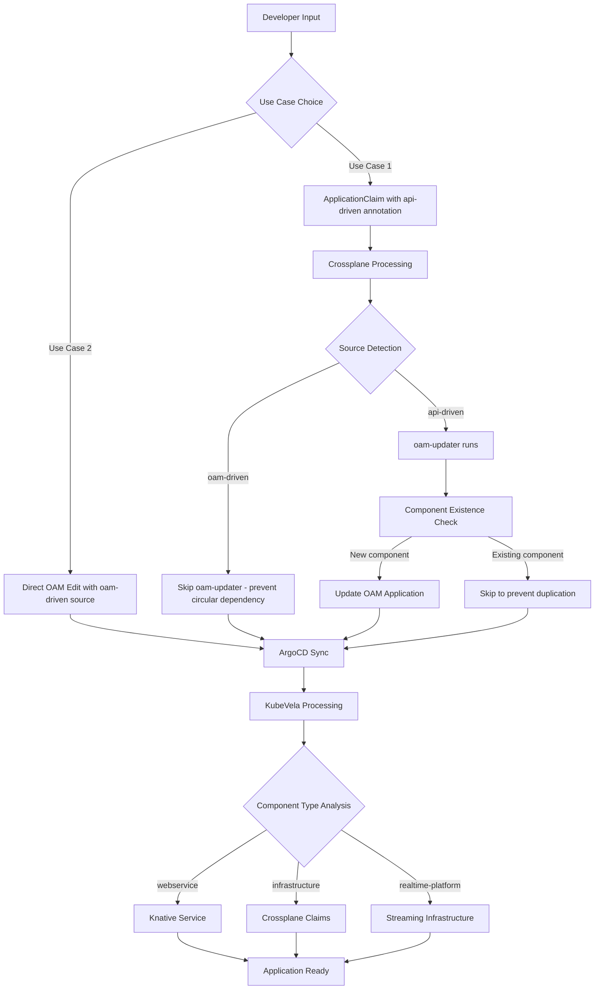

# Health Service Internal Developer Platform (IDP)

A GitOps-enabled cloud-native platform for intelligent architecture visualization and microservice development, built with minimal cost and maximum stability principles.

## 🚀 Quick Start

The platform supports **two primary use cases** for application development:

### Use Case 1: Crossplane ApplicationClaim Workflow (Guided)
For developers who want a guided experience with automatic infrastructure provisioning:

```yaml
# Create an ApplicationClaim for automatic setup
apiVersion: platform.example.org/v1alpha1
kind: ApplicationClaim
metadata:
  annotations:
    webservice.oam.dev/source: "api-driven"  # Prevents circular dependencies
spec:
  name: my-health-service
  language: python
  framework: fastapi
  database: postgres
  cache: redis
  appContainer: my-custom-repo  # Optional: specify target repository
  realtime: health-streaming    # Optional: adds real-time capabilities

# Flow: ApplicationClaim → Crossplane → GitOps Repository → ArgoCD → KubeVela → Knative + Infrastructure
```

### Use Case 2: Direct OAM Application Management (Expert)
For developers who want direct control over their application definition:

```yaml
# Simple webservice (minimal artifacts) 
apiVersion: core.oam.dev/v1beta1
kind: Application
metadata:
  name: simple-app
spec:
  components:
  - name: hello-api
    type: webservice
    properties:
      image: nginx:alpine
      port: 80

# Complex application with infrastructure
apiVersion: core.oam.dev/v1beta1
kind: Application
metadata:
  name: complex-app
spec:
  components:
  # OAM-compliant webservice → Knative Service (minimal artifacts)
  - name: health-api
    type: webservice
    properties:
      image: health-api:latest
      port: 8080
      
  # Complete infrastructure → Crossplane ApplicationClaim  
  - name: app-infrastructure
    type: application-infrastructure
    properties:
      name: health-api
      language: python
      framework: fastapi
      database: postgres
      cache: redis
      repository: custom-repo-name  # Optional: specify target repository
      
  # Real-time platform → Complete streaming infrastructure
  - name: streaming-platform
    type: realtime-platform
    properties:
      name: health-streaming
      database: postgres
      visualization: metabase

# Flow: Manual Edit → ArgoCD → KubeVela → Mixed Resources (Knative Services + Crossplane Claims)
```

## 🏗️ Architecture Overview

### High-Level Architecture
- **EKS Cluster**: Minimal managed control plane with Karpenter-managed workload nodes
- **vCluster**: Virtual Kubernetes environment for workload isolation (`architecture-visualization`)
- **Knative + Istio**: Service mesh for microservices with automatic scaling
- **ArgoCD**: GitOps deployment watching `health-service-idp-gitops` repository
- **KubeVela**: OAM application management and infrastructure orchestration
- **Observability**: Prometheus, Grafana, Jaeger, Kiali accessible via subpath routing

## 📋 OAM Components Reference

### Table 1: OAM ComponentDefinitions

All components that can be added to OAM applications (`oam/applications/application.yaml`):

| Component | Use Case | Crossplane Mapping | Kubernetes Artifact |
|-----------|----------|-------------------|---------------------|
| **Application Components (OAM-Compliant)** | | | |
| `webservice` | Auto-scaling web applications, microservices, APIs | None (direct) | **Knative Service** ⭐ |
| `kafka` | Event streaming, message queues | None (direct) | Kafka Cluster (Strimzi) |
| `redis` | In-memory caching, session storage | None (direct) | Redis Deployment + Service |
| `mongodb` | Document database, NoSQL storage | None (direct) | MongoDB Deployment + PVC |
| **Infrastructure Components (Crossplane-Managed)** | | | |
| `application-infrastructure` | Complete application setup with repos | `ApplicationClaim` | Multiple: Repos + Infrastructure + Secrets |
| `realtime-platform` | Complete streaming infrastructure | `RealtimePlatformClaim` | Multiple: Kafka, MQTT, Lenses, Metabase, PostgreSQL |
| `vcluster` | Virtual Kubernetes environments | `VClusterClaim` | vCluster Custom Resource |
| `neon-postgres` | Managed PostgreSQL database | `NeonPostgresClaim` | External Secret + Connection Details |
| `auth0-idp` | Identity provider integration, SSO | `Auth0IdpClaim` | External Secret + Auth0 Config |
| **Real-time Components** | | | |
| `iot-broker` | MQTT broker for IoT devices, sensor data | `IoTBrokerClaim` | Eclipse Mosquitto + Kafka Connector |
| `stream-processor` | Real-time data processing, ETL pipelines | `StreamProcessorClaim` | Lenses Agent + Processing Jobs |
| `analytics-dashboard` | Data visualization, business intelligence | `AnalyticsDashboardClaim` | Metabase/Grafana + Data Sources |
| **Specialized Components** | | | |
| `snowflake-datawarehouse` | Data warehousing, analytics at scale | `SnowflakeDataWarehouseClaim` | Terraform Workspace + Snowflake Resources |
| `data-pipeline` | ETL/ELT workflows, data processing | `DataPipelineClaim` | Apache Airflow + DAGs |

### Table 2: Crossplane Claims (Beyond OAM)

Additional Crossplane claims available for direct use, not mapped to OAM components:

| Claim | Use Case | Example | Kubernetes Artifact |
|-------|----------|---------|---------------------|
| `ApplicationClaim` | Guided application creation with infrastructure | Creating complete app stack via Slack/API | Multiple: OAM Application + Infrastructure Claims |
| `AppContainerClaim` | Repository and container management | Setting up source + GitOps repos | GitHub Repositories + ArgoCD Applications |
| `VClusterInfrastructureClaim` | Advanced vCluster with custom networking | Multi-region vCluster with observability | vCluster + Network Policies + Monitoring Stack |
| `WorkflowExecutionClaim` | Argo Workflows for CI/CD pipelines | Complex build/test/deploy workflows | Argo Workflow + WorkflowTemplate |
| `ObservabilityStackClaim` | Complete monitoring setup | Prometheus + Grafana + Jaeger stack | Multiple: Prometheus, Grafana, Jaeger, AlertManager |
| `NetworkPolicyClaim` | Advanced network security | Micro-segmentation between services | NetworkPolicy + Istio VirtualService |
| `BackupConfigurationClaim` | Automated backup strategies | Database and PVC backup schedules | Velero Backup + Schedule |
| `CertificateManagerClaim` | SSL/TLS certificate automation | Automatic Let's Encrypt certificates | cert-manager Certificate + Issuer |

### Component Categories

**Application Components (OAM-Compliant)** - Deploy directly as Kubernetes workloads via KubeVela  
**Infrastructure Components (Crossplane-Managed)** - Create Crossplane claims for infrastructure that OAM/KubeVela cannot natively manage  
**Real-time Components** - Specialized streaming and IoT infrastructure via Crossplane  
**Specialized Components** - Advanced data and processing platforms via Crossplane

> **Key Architecture**: 
> - **Native OAM Components** (`webservice`, `kafka`, `redis`, `mongodb`) - Direct Kubernetes resources via KubeVela
> - **Infrastructure Components** (`application-infrastructure`, `realtime-platform`, `vcluster`) - Crossplane Claims for complex infrastructure
> - **Specialized Components** - External integrations and advanced platforms

## 🔄 System Workflows

### Deployment Flow with Source Detection


### GitOps Architecture with Source Tracking
```
Source Code Changes → Version Manager → GitOps Repo → ArgoCD → KubeVela → Kubernetes Resources
                                                              ↓
                                                    Source Detection System
                                                              ↓
                                               {api-driven, oam-driven, analyzer-driven}
                                                              ↓
                                               Prevents Circular Dependencies
```

## 📁 Project Structure

```
health-service-idp/
├── microservices/                    # 18 AI-powered microservices
│   ├── shared-libs/agent-common/     # Shared FastAPI library with real-time support
│   ├── streamlit-frontend/           # Web interface
│   ├── orchestration-service/        # Central workflow coordinator
│   └── *-anthropic/ & *-deterministic/  # AI + rule-based agent pairs
├── crossplane/                       # Infrastructure definitions
│   ├── application-claim-composition.yaml  # ApplicationClaim → Infrastructure
│   ├── oam/                          # OAM component definitions
│   └── realtime-platform-manifests/  # Real-time infrastructure
├── slack-api-server/                 # Slack integration for commands
├── .github/workflows/                # CI/CD pipelines
│   └── comprehensive-gitops.yml      # Main deployment pipeline
└── cluster-lifecycle.sh             # Infrastructure management
```

## 🛠️ Essential Commands

### Infrastructure Management
```bash
# Create or resume EKS cluster with vCluster
./cluster-lifecycle.sh up

# Pause all workloads (cost optimization)
./cluster-lifecycle.sh pause

# Complete infrastructure shutdown
./cluster-lifecycle.sh down
```

### Microservice Development
```bash
# Build and test individual microservice
cd microservices/business-analyst-anthropic
poetry install && poetry run pytest
./build.sh && ./test-deployment.sh

# Deploy via docker-compose for local development
docker-compose up
```

### Real-time Platform Features
The platform includes comprehensive real-time streaming capabilities:

- **Kafka Cluster**: Event streaming with Schema Registry
- **MQTT Broker**: IoT device connectivity  
- **Lenses**: Stream processing with SQL-based transformations
- **Metabase**: Analytics dashboards and visualization
- **WebSocket Support**: Real-time client connectivity

Example real-time microservice:
```python
from agent_common import create_realtime_agent_app, RealtimeAgent

class HealthStreamingAgent(RealtimeAgent):
    async def process_health_data(self, device_data):
        # Automatic Kafka, MQTT, Redis connectivity
        await self.publish_to_kafka("health_events", device_data)
        await self.send_mqtt_alert("alerts/health", alert_data)

app = create_realtime_agent_app(HealthStreamingAgent)
```

## 🔧 Development Patterns

### Bootstrap Source Detection System
The platform prevents circular dependencies through comprehensive source tracking:

**Source Types**:
- **`api-driven`**: ApplicationClaims created via Argo workflows (Slack commands, API calls)
- **`oam-driven`**: ApplicationClaims created from user-edited OAM manifests  
- **`analyzer-driven`**: ApplicationClaims created by automated OAM analysis

**Key Features**:
- **Circular Dependency Prevention**: OAM-driven claims skip oam-updater to prevent loops
- **Component Duplication Prevention**: Existence checking before adding components
- **Repository Parameter Support**: Custom repository names via `repository` parameter
- **Audit Trail**: Clear source annotations for troubleshooting and debugging

### Agent Microservice Structure
All agent microservices follow this pattern:
- `src/main.py` - FastAPI app using `agent_common.fastapi_base.create_agent_app()`
- `src/{agent_name}.py` - Agent implementation extending `BaseMicroserviceAgent`
- `pyproject.toml` - Poetry configuration with standardized dependencies
- `knative-service.yaml` - Knative deployment configuration
- `Dockerfile` - Multi-stage build copying from `shared-libs/agent-common`

### Standard API Endpoints
All agents expose:
- `GET /health` - Health check for Kubernetes probes
- `GET /` - Service status and capabilities
- `POST /{agent-endpoints}` - Agent-specific capabilities
- `GET /docs` - Auto-generated OpenAPI documentation

### Real-time Integration
When `realtime` parameter is specified:
- `GET /ws` - WebSocket endpoint for real-time communication
- `GET /stream/events` - Server-Sent Events stream
- `POST /realtime/*` - Real-time specific APIs

## 💰 Cost Optimization

The platform is designed for minimal cost:
- **vCluster pause/resume**: Complete workload shutdown capability
- **Karpenter auto-scaling**: Nodes provisioned only when needed
- **Knative scale-to-zero**: Applications scale down when not in use
- **Single t3.medium node**: Hosts control plane components efficiently

## 🔍 Observability Access

All observability tools are accessible via subpath routing:
- **ArgoCD**: `/argocd` - GitOps deployment management
- **Grafana**: `/grafana` - Metrics and monitoring dashboards  
- **Jaeger**: `/jaeger` - Distributed tracing
- **Kiali**: `/kiali` - Service mesh visualization
- **Prometheus**: `/prometheus` - Metrics collection

## 📚 Documentation

- **[ARCHITECTURAL_DECISIONS.md](ARCHITECTURAL_DECISIONS.md)**: Complete architectural evolution and decisions
- **[CLAUDE.md](CLAUDE.md)**: Developer guidelines and development principles
- **[REALTIME_SYSTEM.md](REALTIME_SYSTEM.md)**: Real-time streaming architecture
- **[crossplane/DEVELOPER-GUIDE.md](crossplane/DEVELOPER-GUIDE.md)**: Infrastructure development guide
- **[microservices/README.md](microservices/README.md)**: Microservices development guide

## 🚦 Getting Started

1. **Set up infrastructure**: `./cluster-lifecycle.sh up`
2. **Choose your development approach**:
   - **Guided**: Create ApplicationClaims for automatic setup
   - **Expert**: Edit OAM applications directly in GitOps repository
3. **Deploy applications**: ArgoCD automatically syncs and deploys
4. **Monitor**: Access observability tools via ingress endpoints

## 🔄 CI/CD Pipeline

The platform includes a comprehensive GitOps pipeline:
- **Semantic versioning**: `MAJOR.MINOR.COMMIT_SHA` format
- **Multi-stage builds**: Optimized container images
- **Automated testing**: Unit, integration, and deployment tests
- **GitOps synchronization**: Automatic deployment via ArgoCD
- **Version management**: Automatic OAM application updates

## 🤝 Contributing

Follow the development guidelines in [CLAUDE.md](CLAUDE.md):
- Use Test-Driven Development (TDD)
- Follow 12-factor app principles
- Implement Onion Architecture pattern
- Use dependency injection
- Create comprehensive tests

---

**Platform Status**: Production-ready with comprehensive real-time streaming capabilities
**Cost Model**: Pay-per-use with aggressive cost optimization
**Support**: Internal Developer Platform Team