# health-service-idp

CLAUDE.md-compliant microservice application container with GitOps-enabled multi-cluster OAM platform.

## Architecture Overview

This platform provides two primary use cases for microservice development:
1. **Slack-driven microservice creation** - Create complete microservice infrastructure via Slack commands
2. **OAM-driven GitOps development** - Trigger microservice creation through OAM application changes in GitOps repositories

## Complete Flow Diagram

```mermaid
graph TB
    subgraph "Use Case 1: Slack Command Flow"
        A[User Slack Command] -->|/microservice create| B[Istio Ingress Gateway]
        B --> C[Slack API Server]
        C -->|Trigger| D[Argo Workflow]
        D --> E1[Create vCluster]
        D --> E2[Create GitHub Repos]
        D --> E3[Create Secrets]
        E2 --> F1[Source Repository]
        E2 --> F2[GitOps Repository]
        F1 --> G1[Microservice Code]
        F2 --> G2[OAM Application]
        G2 --> H[ArgoCD Sync]
        H --> I[Deploy to Cluster]
    end

    subgraph "Use Case 2: OAM GitOps Flow"
        J[Developer Push to GitOps] --> K[GitHub Actions]
        K -->|Repository Dispatch| L[Update Manifests]
        L --> M[ArgoCD Sync]
        M --> N[Apply OAM to Cluster]
        N --> O[KubeVela Controller]
        O --> P[OAM Application Updated]
        P --> Q[Argo Events EventSource]
        Q -->|Detect Changes| R[Argo Events Sensor]
        R -->|HTTP Trigger| S[Slack API Webhook]
        S --> T[Process OAM Components]
        T -->|For Each Component| U[Argo Workflow]
        U --> V1[Create Microservice]
        U --> V2[Create Knative Service]
        U --> V3[Update Repository]
        V2 --> W[Deploy to vCluster]
        V3 --> X[Push to GitHub]
    end

    subgraph "Infrastructure Components"
        Y1[EKS Cluster]
        Y2[Istio Service Mesh]
        Y3[Argo Workflows]
        Y4[Argo Events]
        Y5[ArgoCD]
        Y6[KubeVela/OAM]
        Y7[Crossplane]
        Y8[vCluster]
        Y9[Knative]
    end

    style A fill:#e1f5fe
    style J fill:#e1f5fe
    style C fill:#fff3e0
    style S fill:#fff3e0
    style D fill:#f3e5f5
    style U fill:#f3e5f5
    style Y1 fill:#e8f5e9
    style Y2 fill:#e8f5e9
    style Y3 fill:#e8f5e9
```



## System Components

### Core Platform
- **EKS/AKS Cluster**: Managed Kubernetes control plane with auto-scaling
- **Istio Service Mesh**: Traffic management and observability
- **Argo Workflows**: Workflow orchestration for microservice creation
- **Argo Events**: Event-driven automation for OAM changes
- **ArgoCD**: GitOps continuous delivery
- **KubeVela**: OAM application controller
- **Crossplane**: Infrastructure as Code compositions
- **vCluster**: Virtual Kubernetes clusters for workload isolation
- **Knative**: Serverless workload management
- **Multi-Registry Support**: Dynamic switching between Docker Hub and Azure Container Registry

### Key Services
- **Slack API Server**: Central API for processing Slack commands and OAM webhooks
- **GitHub Integration**: Automated repository creation and management
- **OAM Components**: Declarative application definitions with automatic resource provisioning

## Workflow Details

### Use Case 1: Slack-Driven Development
1. User sends Slack command: `/microservice create service-name python with database with redis`
2. Istio ingress routes to Slack API server
3. Slack API triggers Argo Workflow with parameters
4. Workflow executes parallel jobs:
   - Creates vCluster for isolation
   - Creates GitHub source and GitOps repositories
   - Sets up secrets and credentials
5. Generates microservice code structure following CLAUDE.md principles
6. Creates OAM application definition in GitOps repo
7. ArgoCD syncs and deploys to cluster

### Use Case 2: OAM-Driven GitOps Development
1. Developer modifies OAM application in GitOps repository
2. Push triggers GitHub Actions workflow
3. Actions dispatch updates deployment manifests
4. ArgoCD syncs changes to cluster
5. KubeVela processes OAM application updates
6. Argo Events EventSource detects OAM changes
7. Sensor triggers HTTP request to Slack API webhook
8. Slack API processes each new component:
   - Creates Argo Workflow for microservice generation
   - Generates service code and Knative deployment
   - Updates source repository with new microservice
9. Services deployed to target vCluster

## Testing

### Functional Test Script
```bash
./scripts/test-functional-multicluster.sh
```

### Infrastructure Health Check
```bash
./scripts/infrastructure-health-check-enhanced.sh
```

## Key Features

- **Multi-cluster isolation** via vCluster
- **GitOps-driven deployments** with ArgoCD
- **Event-driven automation** with Argo Events
- **OAM application model** for declarative infrastructure
- **Automatic code generation** following CLAUDE.md principles
- **Crossplane compositions** for infrastructure provisioning
- **Knative serverless** deployments
- **Comprehensive observability** with Prometheus, Grafana, Jaeger
- **Multi-registry support** for Docker Hub and Azure Container Registry

## Multi-Registry Support

The platform supports seamless switching between container registries based on deployment region:

### Supported Registries
- **Docker Hub** (default): `docker.io/socrates12345/*`
- **Azure Container Registry**: `healthidpuaeacr.azurecr.io/*`
- **Custom Registry**: Any custom registry URL

### Configuration Methods

#### 1. OAM Application Level
```yaml
spec:
  components:
    - name: my-service
      type: webservice
      properties:
        # Option A: Specify registry explicitly
        imageName: my-service
        imageTag: v1.0.0
        registry: acr  # or "dockerhub" or "custom"
        
        # Option B: Use full image path (backward compatible)
        image: docker.io/socrates12345/my-service:v1.0.0
```

#### 2. Global Registry Switch
```bash
# Switch all services to ACR
./scripts/switch-registry.sh switch acr

# Switch back to Docker Hub
./scripts/switch-registry.sh switch dockerhub

# Show current configuration
./scripts/switch-registry.sh show
```

#### 3. Registry Configuration
Registry settings are stored in ConfigMaps in `default` and `crossplane-system` namespaces:
- `DEFAULT_REGISTRY`: Primary registry URL
- `ACR_REGISTRY`: Azure Container Registry URL
- `ACTIVE_REGISTRY`: Currently active registry

### Setup ACR Credentials
For Azure Container Registry, create credentials:
```bash
# Automatically created by setup-secrets.sh if ACR_NAME is set in .env
# Or manually:
kubectl create secret docker-registry acr-credentials \
  --docker-server=healthidpuaeacr.azurecr.io \
  --docker-username=<acr-name> \
  --docker-password=<password> \
  -n default
```

## Parameter Flow and Data Architecture

### Overview
The platform implements two distinct flows for creating microservices: **API-driven** (via Slack commands) and **OAM-driven** (via GitOps). Understanding the parameter flow between components is critical for maintaining system integrity and preventing circular dependencies.

### Parameter Flow Diagram

```mermaid
graph TB
    subgraph "Entry Points"
        SLACK[Slack Command]
        OAM_APP[OAM Application]
        PATTERN1[Pattern1 Handler]
        PATTERN2[Pattern2 Handler]
        OAM_COMP[OAM ComponentDefinition]
    end

    subgraph "Processing Layer"
        SLACK_API[Slack API Server<br/>argo_client.py]
        PATTERN_PROC[Pattern Handlers<br/>pattern1/pattern2.py]
        OAM_TRIGGER[webservice Component<br/>workflow-trigger trait]
    end

    subgraph "Workflow Layer"
        WORKFLOW[microservice-standard-contract.yaml<br/>WorkflowTemplate]
        PARAMS[["Parameters:<br/>
        • bootstrap-source<br/>
        • microservice-realtime<br/>
        • microservice-language<br/>
        • microservice-framework<br/>
        • microservice-database<br/>
        • microservice-cache<br/>
        • target-vcluster<br/>
        • parent-appcontainer"]]
    end

    subgraph "Resource Layer"
        APP_CLAIM[ApplicationClaim<br/>CRD Resource]
        CLAIM_SPEC[["spec:<br/>
        • name<br/>
        • language<br/>
        • framework<br/>
        • database<br/>
        • cache<br/>
        • realtime<br/>
        • appContainer<br/>
        • targetVCluster"]]
        CLAIM_META[["metadata.annotations:<br/>
        • webservice.oam.dev/source"]]
    end

    subgraph "Crossplane Composition"
        COMPOSITION[application-claim-composition.yaml]
        ENV_PATCHES[["Environment Patches:<br/>
        env[0]: SERVICE_NAME ← spec.name<br/>
        env[1]: APP_CONTAINER ← spec.appContainer<br/>
        env[2]: LANGUAGE ← spec.language<br/>
        env[3]: FRAMEWORK ← spec.framework<br/>
        env[4]: DATABASE ← spec.database<br/>
        env[5]: CACHE ← spec.cache<br/>
        env[6]: DEFAULT_REGISTRY (hardcoded)<br/>
        env[7]: REALTIME_PLATFORM ← spec.realtime<br/>
        env[8]: BOOTSTRAP_SOURCE ← annotations"]]
        OAM_UPDATER[oam-updater Job]
    end

    subgraph "Decision Point"
        DECISION{{"if BOOTSTRAP_SOURCE == 'OAM-driven'?"}}
        SKIP[Skip OAM Update<br/>Prevent Circular Dependency]
        UPDATE[Update OAM Application<br/>in GitOps Repository]
    end

    %% API-driven flow (green)
    SLACK -->|"bootstrap-source: 'api-driven'"| SLACK_API
    SLACK_API --> WORKFLOW
    
    %% OAM-driven flows (blue)
    OAM_APP --> PATTERN1
    OAM_APP --> PATTERN2
    PATTERN1 -->|"bootstrap-source: 'OAM-driven'"| PATTERN_PROC
    PATTERN2 -->|"bootstrap-source: 'OAM-driven'"| PATTERN_PROC
    PATTERN_PROC --> WORKFLOW
    
    OAM_COMP --> OAM_TRIGGER
    OAM_TRIGGER -->|"bootstrap-source: 'OAM-driven'"| WORKFLOW
    
    %% Common workflow path
    WORKFLOW --> PARAMS
    PARAMS --> APP_CLAIM
    APP_CLAIM --> CLAIM_SPEC
    APP_CLAIM --> CLAIM_META
    
    %% Crossplane processing
    CLAIM_SPEC --> COMPOSITION
    CLAIM_META --> COMPOSITION
    COMPOSITION --> ENV_PATCHES
    ENV_PATCHES --> OAM_UPDATER
    
    %% Decision logic
    OAM_UPDATER --> DECISION
    DECISION -->|Yes| SKIP
    DECISION -->|No| UPDATE
    
    %% Styling
    classDef apiDriven fill:#c8e6c9,stroke:#4caf50,stroke-width:2px
    classDef oamDriven fill:#bbdefb,stroke:#2196f3,stroke-width:2px
    classDef workflow fill:#fff3e0,stroke:#ff9800,stroke-width:2px
    classDef resource fill:#f3e5f5,stroke:#9c27b0,stroke-width:2px
    classDef decision fill:#ffebee,stroke:#f44336,stroke-width:2px
    
    class SLACK,SLACK_API apiDriven
    class OAM_APP,PATTERN1,PATTERN2,OAM_COMP,PATTERN_PROC,OAM_TRIGGER oamDriven
    class WORKFLOW,PARAMS workflow
    class APP_CLAIM,CLAIM_SPEC,CLAIM_META,COMPOSITION,ENV_PATCHES,OAM_UPDATER resource
    class DECISION,SKIP,UPDATE decision
```



### Critical Parameter Mappings

#### 1. Bootstrap Source Flow
The `bootstrap-source` parameter is critical for preventing circular dependencies:

- **API-driven**: Slack commands → `bootstrap-source: "api-driven"` → OAM updates proceed
- **OAM-driven**: OAM/Patterns → `bootstrap-source: "OAM-driven"` → OAM updates skipped

#### 2. Environment Variable Positions (After REALTIME_PLATFORM Addition)
```yaml
env:
  - name: SERVICE_NAME       # env[0] ← spec.name
  - name: APP_CONTAINER       # env[1] ← spec.appContainer
  - name: LANGUAGE           # env[2] ← spec.language
  - name: FRAMEWORK          # env[3] ← spec.framework
  - name: DATABASE           # env[4] ← spec.database
  - name: CACHE              # env[5] ← spec.cache
  - name: DEFAULT_REGISTRY   # env[6] (hardcoded "acr")
  - name: REALTIME_PLATFORM  # env[7] ← spec.realtime
  - name: BOOTSTRAP_SOURCE   # env[8] ← annotations["webservice.oam.dev/source"]
```

#### 3. Parameter Alignment Requirements

All entry points must provide:
- `bootstrap-source`: Identifies the trigger source (api-driven vs OAM-driven)
- `microservice-realtime`: Optional realtime platform integration
- Standard microservice parameters (language, framework, database, cache)
- Deployment parameters (target-vcluster, parent-appcontainer)

### Circular Dependency Prevention

The system prevents infinite loops through the following mechanism:

1. **OAM creates ApplicationClaim** → marked with `webservice.oam.dev/source: "OAM-driven"`
2. **Crossplane processes ApplicationClaim** → creates infrastructure
3. **oam-updater job checks source** → if "OAM-driven", skips OAM update
4. **No new OAM change** → no new trigger → loop prevented

### Data Flow Examples

#### API-Driven Flow (Slack Command)
```
Slack: /microservice create my-service
  ↓ parameters: bootstrap-source="api-driven"
Workflow: microservice-standard-contract
  ↓ creates ApplicationClaim
ApplicationClaim: annotations["source"]="api-driven"
  ↓ Crossplane composition
oam-updater: BOOTSTRAP_SOURCE="api-driven"
  ↓ check passes
Update OAM Application ✓
```

#### OAM-Driven Flow (GitOps Change)
```
OAM Application: new webservice component
  ↓ webhook triggers Pattern1/Pattern2
Pattern Handler: bootstrap-source="OAM-driven"
  ↓ calls workflow
Workflow: microservice-standard-contract
  ↓ creates ApplicationClaim
ApplicationClaim: annotations["source"]="OAM-driven"
  ↓ Crossplane composition
oam-updater: BOOTSTRAP_SOURCE="OAM-driven"
  ↓ check blocks update
Skip OAM Update ✓ (prevents loop)
```
