# Health Service Internal Developer Platform (IDP)

A GitOps-enabled cloud-native platform for intelligent architecture visualization and microservice development, built with minimal cost and maximum stability principles.

## 🔍 Infrastructure Health Check

**CRITICAL**: Before starting any development work, always run the infrastructure health check to ensure all components are operational:

```bash
./scripts/infrastructure-health-check.sh
```

This diagnostic script validates:
- Slack API server accessibility and external routing
- Essential secrets (Docker registry, Slack, Argo tokens)
- Service accounts and RBAC configurations  
- OAM ComponentDefinitions and WorkloadDefinitions
- Argo Workflows infrastructure and templates
- Crossplane CRDs and compositions
- Istio service mesh and ingress gateway
- ArgoCD applications and sync status

Only proceed with development work after confirming all infrastructure components are healthy. If issues are found, resolve them before continuing with any tasks.

## 🚀 Quick Start

The platform supports **two primary use cases** for application development:

### Use Case 1: Crossplane ApplicationClaim Workflow (Guided)
For developers who want a guided experience with automatic infrastructure provisioning:

```yaml
# Create an ApplicationClaim for automatic setup
apiVersion: platform.example.org/v1alpha1
kind: ApplicationClaim
metadata:
  annotations:
    webservice.oam.dev/source: "api-driven"  # Prevents circular dependencies
spec:
  name: my-health-service
  language: python
  framework: fastapi
  database: postgres
  cache: redis
  appContainer: my-custom-repo  # Optional: specify target repository
  realtime: health-streaming    # Optional: adds real-time capabilities

# Flow: ApplicationClaim → Crossplane → GitOps Repository → ArgoCD → KubeVela → Knative + Infrastructure
```

### Use Case 2: Direct OAM Application Management (Expert)
For developers who want direct control over their application definition:

```yaml
# Simple webservice (minimal artifacts) 
apiVersion: core.oam.dev/v1beta1
kind: Application
metadata:
  name: simple-app
spec:
  components:
  - name: hello-api
    type: webservice
    properties:
      image: nginx:alpine
      port: 80

# Complex application with infrastructure
apiVersion: core.oam.dev/v1beta1
kind: Application
metadata:
  name: complex-app
spec:
  components:
  # OAM-compliant webservice → Knative Service (minimal artifacts)
  - name: health-api
    type: webservice
    properties:
      image: health-api:latest
      port: 8080
      
  # Complete infrastructure → Crossplane ApplicationClaim  
  - name: app-infrastructure
    type: application-infrastructure
    properties:
      name: health-api
      language: python
      framework: fastapi
      database: postgres
      cache: redis
      repository: custom-repo-name  # Optional: specify target repository
      
  # Real-time platform → Complete streaming infrastructure
  - name: streaming-platform
    type: realtime-platform
    properties:
      name: health-streaming
      database: postgres
      visualization: metabase

  # Chat services → Rasa chatbot with Actions server
  - name: customer-support-chat
    type: rasa-chatbot
    properties:
      rasaImage: "socrates12345/customer-support-rasa:latest"
      actionsImage: "socrates12345/customer-support-actions:latest"
      enableIstioGateway: true
      chatbotHost: "chat.example.com"

# Flow: Manual Edit → ArgoCD → KubeVela → Mixed Resources (Knative Services + Crossplane Claims)
```

## 🏗️ Architecture Overview

### High-Level Architecture
- **EKS Cluster**: Minimal managed control plane with Karpenter-managed workload nodes
- **vCluster**: Virtual Kubernetes environment for workload isolation (`architecture-visualization`)
- **Knative + Istio**: Service mesh for microservices with automatic scaling
- **ArgoCD**: GitOps deployment watching `health-service-idp-gitops` repository
- **KubeVela**: OAM application management and infrastructure orchestration
- **Observability**: Prometheus, Grafana, Jaeger, Kiali accessible via subpath routing

## 🛤️ Critical Paths

### Use Case 1: Slack API Server Path (API-Driven Microservice Creation)

**Triggered by**: Slack commands (`/microservice create`, `/vcluster create`, `/appcontainer create`)


**Critical Path Files:**
- `/slack-api-server/` - FastAPI service for Slack integration
- `/argo-workflows/microservice-standard-contract.yaml` - Main workflow orchestration
- `/argo-workflows/simple-slack-notifications.yaml` - Notification system
- `/crossplane/application-claim-composition.yaml` - Infrastructure provisioning
- `/crossplane/oam/consolidated-component-definitions.yaml` - webservice ComponentDefinition
- `/.github/workflows/comprehensive-gitops.yml` - CI/CD pipeline

**Key Features:**
- ✅ **Guided Experience**: NLP parsing of natural language commands
- ✅ **Auto Repository Creation**: GitHub repos with CLAUDE.md-compliant structure
- ✅ **Infrastructure Bootstrap**: Automatic database, cache, and platform setup
- ✅ **GitOps Integration**: Seamless deployment via ArgoCD
- ✅ **Slack Notifications**: Real-time progress updates

### Use Case 2: Direct OAM Path (Expert-Driven Component Creation)

**Triggered by**: Direct editing of OAM Application manifests in GitOps repository


**Critical Path Files:**
- `/crossplane/oam/consolidated-component-definitions.yaml` - webservice ComponentDefinition (OAM-compliant)
- `/crossplane/oam/realtime-platform-component-definition.yaml` - realtime-platform ComponentDefinition  
- `/crossplane/realtime-platform-claim-composition.yaml` - Streaming infrastructure
- `/crossplane/application-claim-composition.yaml` - Bootstrap source detection
- `ArgoCD Application monitoring oam/applications/` - GitOps synchronization

**Key Features:**
- ✅ **Direct Control**: Expert users edit OAM manifests directly
- ✅ **Component Flexibility**: Mix webservice, realtime-platform, and infrastructure components
- ✅ **Circular Dependency Prevention**: Source detection prevents oam-updater loops
- ✅ **Minimal Artifacts**: webservice creates only Knative Service (2 artifacts vs 30+)
- ✅ **Composite Components**: realtime-platform provisions complete streaming stack

### Path Convergence: Common Infrastructure

Both paths converge at the **KubeVela + Crossplane** layer:

```mermaid
graph TD
    A[Use Case 1: Slack API] --> C[KubeVela Application Controller]
    B[Use Case 2: Direct OAM] --> C
    C --> D{Component Processing}
    D --> E[webservice → Knative Service]
    D --> F[realtime-platform → RealtimePlatformClaim → Streaming Stack]
    D --> G[application-infrastructure → ApplicationClaim → Full Bootstrap]
    E --> H[Istio Service Mesh]
    F --> I[Kafka + MQTT + Lenses + Metabase + PostgreSQL]
    G --> J[Repository + Infrastructure + OAM Application]
    H --> K[Auto-scaling Workloads]
    I --> L[Real-time Streaming Platform]
    J --> M[Complete Application Stack]
```



**Architectural Principles:**
- **"KubeVela orchestrates, Crossplane executes"** - Clear separation of concerns
- **ComponentDefinition-only OAM interface** - All components follow kafka/redis pattern
- **Source detection system** - Prevents circular dependencies between API and OAM paths
- **Composite component architecture** - Both webservice and realtime-platform create complete application stacks

## 📋 OAM Components Reference

### Table 1: Main OAM ComponentDefinitions

Primary components for application development:

| Component | Options | Use Case | Crossplane Mapping | Kubernetes Artifact |
|-----------|---------|----------|-------------------|---------------------|
| **webservice** | `image`, `port`, `language`, `framework`, `source`, `realtime`, `env`, `resources` | Auto-scaling web applications, microservices, REST APIs | Optional: `ApplicationClaim` for infrastructure | **Knative Service** + Optional Argo Workflow |
| **realtime-platform** | `name`, `database`, `visualization`, `kafka.replicas`, `mqtt.enabled`, `lenses.enabled`, `resources` | Complete streaming infrastructure, IoT platforms, real-time analytics | `RealtimePlatformClaim` | **Knative Service** + Kafka + MQTT + Lenses + Metabase + PostgreSQL |
| **neon-postgres** | `database`, `version`, `storageSize`, `replicas`, `backup`, `security`, `resources` | Managed PostgreSQL database, persistent data storage | None (direct) | Secret with connection details |
| **auth0-idp** | `domain`, `clientId`, `clientSecret`, `audience`, `scopes`, `compliance` | Identity provider integration, SSO, user authentication | None (direct) | ExternalSecret from AWS Secrets Manager |

### Table 2: Supporting OAM ComponentDefinitions

Additional components for specific use cases:

| Component | Options | Use Case | Crossplane Mapping | Kubernetes Artifact |
|-----------|---------|----------|-------------------|---------------------|
| **kafka** | `replicas`, `storageSize`, `topics`, `resources` | Event streaming, message queues | None (direct) | Helm Release (Bitnami Kafka Chart) |
| **redis** | `replicas`, `storageSize`, `password`, `persistence`, `resources` | In-memory caching, session storage | None (direct) | Helm Release (Bitnami Redis Chart) |
| **mongodb** | `replicas`, `storageSize`, `database`, `auth`, `backup`, `resources` | Document database, NoSQL storage | None (direct) | Helm Release (Bitnami MongoDB Chart) |
| **application-infrastructure** | `name`, `language`, `framework`, `database`, `cache`, `repository` | Complete application setup with repositories | `ApplicationClaim` | Multiple: Repos + Infrastructure + Secrets |
| **vcluster** | `size`, `kubernetes.version`, `networking`, `resources`, `features` | Virtual Kubernetes environments, isolated development | `VClusterEnvironmentClaim` | vCluster + Istio + Knative + ArgoCD + Observability |

### Table 3: Crossplane Claims (Beyond OAM)

Additional Crossplane claims available for direct use, not mapped to OAM components:

| Claim | Use Case | Example | Kubernetes Artifact |
|-------|----------|---------|---------------------|
| `ApplicationClaim` | Guided application creation with infrastructure | Creating complete app stack via Slack/API | Multiple: OAM Application + Infrastructure Claims |
| `RealtimePlatformClaim` | Complete streaming infrastructure | Real-time analytics platform | Namespace + Kafka + MQTT + Lenses + Metabase + PostgreSQL + Secrets |
| `VClusterEnvironmentClaim` | Virtual Kubernetes environments | Isolated development environments | vCluster + Istio + Knative + ArgoCD + Observability Stack |

### Component Categories

**Application Components (OAM-Compliant)** - Deploy directly as Kubernetes workloads via KubeVela  
**Infrastructure Components (Crossplane-Managed)** - Create Crossplane claims for infrastructure that OAM/KubeVela cannot natively manage  
**Real-time Components** - Specialized streaming and IoT infrastructure via Crossplane  
**Specialized Components** - Advanced data and processing platforms via Crossplane

> **Key Architecture**: 
> - **Native OAM Components** (`webservice`, `kafka`, `redis`, `mongodb`) - Direct Kubernetes resources via KubeVela
> - **Infrastructure Components** (`application-infrastructure`, `realtime-platform`, `vcluster`) - Crossplane Claims for complex infrastructure
> - **Specialized Components** - External integrations and advanced platforms

## 🔄 Architectural Equivalence: WebService vs Real-time Platform

Both `webservice` and `realtime-platform` follow identical architectural patterns as **composite components** that provision complete application stacks (workload + infrastructure):

| **Aspect** | **webservice** | **realtime-platform** |
|------------|----------------|------------------------|
| **Primary Output** | Knative Service (HTTP/REST endpoints) | Knative Service (WebSocket + Kafka consumers) |
| **Secondary Output** | Optional: Argo Workflow (when `language` specified) | RealtimePlatformClaim → Complete streaming infrastructure |
| **Repository Creation** | ✅ **Equivalent**: Triggers Argo Workflow when `language` specified | ✅ **Equivalent**: Triggers Argo Workflow when `language` specified |
| **External Connectivity** | HTTP/HTTPS via Istio Gateway | **MQTT + HTTP**: MQTT (port 1883) + WebSocket via Istio Gateway 🆕 |
| **Infrastructure Components** | Optional: PostgreSQL, Redis, MongoDB via ApplicationClaim | **Kafka + MQTT + Lenses HQ/Agent + PostgreSQL + Metabase** |
| **ComponentDefinition** | `webservice` in consolidated-component-definitions.yaml | `realtime-platform` in realtime-platform-component-definition.yaml |
| **Crossplane Integration** | Optional: ApplicationClaim for infrastructure bootstrap | Required: RealtimePlatformClaim for streaming infrastructure |
| **Environment Variables** | `AGENT_TYPE`, `LOG_LEVEL`, custom environment | `REALTIME_PLATFORM_NAME`, `WEBSOCKET_ENABLED`, `AGENT_TYPE` |
| **Secret Management** | Optional: Database/cache connection secrets | Required: Kafka/MQTT/Lenses/Metabase connection secrets |
| **OAM Usage Pattern** | `type: webservice` with optional `language`/`database` | `type: realtime-platform` with `database`/`visualization`/`iot` |
| **Architectural Pattern** | **Composite Component**: Workload + Optional Infrastructure | **Composite Component**: Workload + Required Infrastructure |
| **Service Discovery** | Via optional database/cache service names | Via Kafka/MQTT/Lenses service names in dedicated namespace |
| **Namespace Strategy** | Single namespace (where Application defined) | Dual namespace: Application + `{name}-realtime` namespace |
| **Scaling** | Knative auto-scaling (0-10 replicas) | Knative auto-scaling (1-10 replicas, min=1 for streaming) |

**Key Insight**: Both are **composite components** that provision complete application stacks rather than single-purpose components. The only difference is the type of infrastructure they provision and the application template they use.

## 🔗 Lenses Agent-to-HQ Connection Process

The real-time platform uses **Lenses HQ** for Kafka management with a **Lenses Agent** that connects to provide monitoring and control capabilities. The connection process is **fully automated** through our multi-environment setup:

### Architecture Overview
```
┌─────────────┐    gRPC    ┌──────────────┐    ┌─────────────────┐
│  Lenses HQ  │ ←────────→ │ Lenses Agent │ ←→ │ Kafka Ecosystem │
│  (Port 9991)│  Port 10000│   (Per NS)   │    │ Schema Registry │
│  (Port 10000)│           │              │    │ Kafka Connect   │
└─────────────┘            └──────────────┘    └─────────────────┘
```

### Multi-Environment Agent Key Management

**1. Environment Creation Process:**
```bash
# 1. Access Lenses HQ web interface
http://lenses-hq.streaming-platform-2025-realtime.local/environments

# 2. Create new environment
- Login with admin/admin
- Navigate to Environments → New Environment  
- Name: my-streaming-platform
- Get generated agent key: agent_key_xyz123...

# 3. Add to .env file
echo "my-namespace-realtime-agent-key=agent_key_xyz123..." >> .env

# 4. Update secrets and trigger automation
./setup-secrets.sh
```

**2. Automated Connection Flow:**


**3. Technical Implementation:**

| Component | Purpose | Configuration |
|-----------|---------|---------------|
| **ConfigMap** | `env-agent-keys` stores namespace→key mappings | `streaming-platform-2025-realtime-agent-key: agent_key_xyz` |
| **CronJob** | Syncs secrets every 2 minutes with namespace-specific keys | Reads ConfigMap, creates `lenses-credentials` per namespace |
| **Secret** | `lenses-credentials` contains `AGENT_KEY` for each namespace | Agent reads `AGENT_KEY` from secret in its namespace |
| **Agent Config** | `provisioning.yaml` uses environment variable from secret | `agentKey: value: $AGENT_KEY` |

**4. Connection Requirements:**
- **HQ Service**: Exposes both port 9991 (web UI) and port 10000 (agent registration)
- **Agent Authentication**: Uses HQ-generated agent key (not demo keys)
- **Network**: Agent connects to `lenses-hq:10000` via gRPC within cluster
- **Restart Policy**: Agent automatically restarts when secrets change

**5. Accessing Lenses HQ Web Interface:**

The realtime-platform automatically creates Istio networking resources to expose Lenses HQ:

```bash
# Check if HQ is accessible (requires Istio LoadBalancer)
kubectl get svc istio-ingressgateway -n istio-system

# Get the external IP/hostname
GATEWAY_URL=$(kubectl get svc istio-ingressgateway -n istio-system -o jsonpath='{.status.loadBalancer.ingress[0].hostname}')

# Access HQ via browser (replace namespace-name with your actual namespace)
echo "Lenses HQ: http://$GATEWAY_URL/"
echo "Host header required: lenses-hq.<namespace-name>-realtime.local"
```

**Local Development Access:**
```bash
# Port-forward for local access (alternative to LoadBalancer)
kubectl port-forward -n <namespace>-realtime svc/lenses-hq 9991:9991

# Access HQ locally
echo "Lenses HQ Local: http://localhost:9991"
echo "Login: admin/admin"
```

**DNS Configuration:**
If using the hostname approach, add to your `/etc/hosts`:
```bash
# Get LoadBalancer IP
LB_IP=$(kubectl get svc istio-ingressgateway -n istio-system -o jsonpath='{.status.loadBalancer.ingress[0].ip}')

# Add to /etc/hosts
echo "$LB_IP lenses-hq.streaming-platform-2025-realtime.local" | sudo tee -a /etc/hosts
```

**6. Troubleshooting:**
```bash
# Check agent key in namespace
kubectl get secret lenses-credentials -n <namespace> -o jsonpath='{.data.AGENT_KEY}' | base64 -d

# Check agent logs for connection status  
kubectl logs -n <namespace> deployment/lenses-agent --tail=20

# Check HQ logs for agent registration attempts
kubectl logs -n <namespace> deployment/lenses-hq --tail=20 | grep agent

# Check HQ web interface accessibility
kubectl get gateway,virtualservice -n <namespace>-realtime

# Manual trigger secret sync
kubectl create job manual-sync --from=cronjob/multi-env-secret-sync -n default
```

## 🔄 System Workflows

### Deployment Flow with Source Detection


### GitOps Architecture with Source Tracking
```
Source Code Changes → Version Manager → GitOps Repo → ArgoCD → KubeVela → Kubernetes Resources
                                                              ↓
                                                    Source Detection System
                                                              ↓
                                               {api-driven, oam-driven, analyzer-driven}
                                                              ↓
                                               Prevents Circular Dependencies
```

## 🤖 Chat Services Development

The platform includes comprehensive chatbot capabilities through Rasa integration with dual CI/CD pipelines:

### Creating Chat Services

#### Option 1: Direct OAM Application
```yaml
apiVersion: core.oam.dev/v1beta1
kind: Application
metadata:
  name: customer-support
spec:
  components:
  - name: support-chat
    type: rasa-chatbot
    properties:
      # Container images (automatically built via chat-gitops.yml)
      rasaImage: "socrates12345/support-chat-rasa:latest"
      actionsImage: "socrates12345/support-chat-actions:latest"
      
      # Scaling configuration
      minScale: 1
      maxScale: 10
      targetConcurrency: 10
      actionsMinScale: 0
      actionsMaxScale: 5
      
      # External access (optional)
      enableIstioGateway: true
      chatbotHost: "chat.example.com"
      enableTLS: true
      
      # Custom environment variables
      environment:
        LOG_LEVEL: "INFO"
        CUSTOM_SETTING: "value"
```

#### Option 2: Using Chat Template Repository
```bash
# 1. Use the health-service-chat-template
git clone https://github.com/your-org/health-service-chat-template.git my-chatbot
cd my-chatbot

# 2. Customize your chatbot
# - Edit domain.yml (responses and slots)
# - Edit data/nlu.yml (training examples)
# - Edit data/stories.yml (conversation flows)
# - Edit actions/actions.py (custom logic)

# 3. Deploy with Docker Compose (development)
docker-compose up --build

# 4. Deploy to Kubernetes (production)
kubectl apply -f oam/chat-template-componentdef.yaml
kubectl apply -f oam/sample-applications.yaml
```

### Chat Service Architecture

**Dual Container Pattern:**
- **Rasa Server Container**: Handles NLP, conversation management, and API endpoints
- **Actions Server Container**: Executes custom business logic and external integrations

**Automatic Service Discovery:**
- Rasa server automatically discovers Actions server via Kubernetes service names
- Environment variables injected: `ACTION_ENDPOINT_URL`, `ACTIONS_SERVER_HOST`, `ACTIONS_SERVER_PORT`

**Scaling Strategy:**
- **Rasa Server**: Always-on (minScale: 1) for immediate response
- **Actions Server**: Scale-to-zero (minScale: 0) for cost optimization

### Chat-Specific CI/CD Pipeline

The platform includes a dedicated `chat-gitops.yml` workflow that automatically:

**Triggers on Chat Files:**
- `domain.yml`, `config.yml` (Rasa configuration)
- `data/**` (training data)
- `actions/**` (custom actions)
- `docker/Dockerfile.rasa`, `docker/Dockerfile.actions`

**Build Process:**
1. **Detects Chat Services**: Identifies services with `domain.yml` + `config.yml`
2. **Builds Dual Containers**: 
   - `socrates12345/{service}-rasa:commit-sha`
   - `socrates12345/{service}-actions:commit-sha`
3. **Security Scanning**: Scans both containers for vulnerabilities
4. **GitOps Integration**: Triggers `update-chat-deployments` event

**Separate from Standard Pipeline:**
- Standard microservices use `comprehensive-gitops.yml`
- Chat services use `chat-gitops.yml`
- No conflicts or duplicate builds

### Chat Service Endpoints

**Rasa Server Endpoints:**
- `GET /api/status` - Health check and model status
- `POST /webhooks/rest/webhook` - Chat API for frontend integration
- `GET /conversations/{conversation_id}/tracker` - Conversation state
- `GET /` - Server status and version

**Actions Server Endpoints:**
- `GET /health` - Health check for Kubernetes probes
- `POST /webhook` - Webhook for custom action execution

### Development Workflow

1. **Local Development:**
   ```bash
   # Test with Docker Compose
   docker-compose up --build
   ./test-deployment.sh
   ```

2. **Training and Testing:**
   ```bash
   # Train the model
   rasa train
   
   # Test conversations
   rasa test
   
   # Validate training data
   rasa data validate
   ```

3. **Deployment:**
   ```bash
   # Deploy ComponentDefinition
   kubectl apply -f oam/chat-template-componentdef.yaml
   
   # Deploy Application
   kubectl apply -f oam/sample-applications.yaml
   ```

### Chat Integration Examples

**REST API Integration:**
```bash
# Send message to chatbot
curl -X POST http://chat.example.com/webhooks/rest/webhook \
  -H "Content-Type: application/json" \
  -d '{"sender": "user123", "message": "Hello, I need help"}'
```

**WebSocket Integration:** (when realtime platform is enabled)
```javascript
const ws = new WebSocket('ws://chat.example.com/ws');
ws.send(JSON.stringify({
  sender: "user123",
  message: "Hello, I need help"
}));
```

## 📁 Project Structure

```
health-service-idp/
├── microservices/                    # 18 AI-powered microservices
│   ├── shared-libs/agent-common/     # Shared FastAPI library with real-time support
│   ├── streamlit-frontend/           # Web interface
│   ├── orchestration-service/        # Central workflow coordinator
│   └── *-anthropic/ & *-deterministic/  # AI + rule-based agent pairs
├── health-service-chat-template/     # Rasa chatbot template repository
│   ├── oam/chat-template-componentdef.yaml  # Chat ComponentDefinition
│   ├── docker/                       # Rasa and Actions Dockerfiles
│   ├── data/                         # Training data (NLU, stories, rules)
│   ├── actions/                      # Custom action implementations
│   └── domain.yml                    # Bot responses and conversation domain
├── crossplane/                       # Infrastructure definitions
│   ├── application-claim-composition.yaml  # ApplicationClaim → Infrastructure
│   ├── oam/                          # OAM component definitions
│   └── realtime-platform-manifests/  # Real-time infrastructure
├── slack-api-server/                 # Slack integration for commands
├── .github/workflows/                # CI/CD pipelines
│   ├── comprehensive-gitops.yml      # Standard microservices pipeline
│   └── chat-gitops.yml              # Chat-specific pipeline
└── cluster-lifecycle.sh             # Infrastructure management
```

## 🛠️ Essential Commands

### 💬 Slack Commands

The platform supports microservice creation directly from Slack using natural language commands:

#### Command Structure
```
/microservice create [name] [options]
/service create [name] [options]    # Alias for microservice
```

#### Language Options
- `python` or `fastapi` - Python with FastAPI framework
- `java` or `springboot` - Java with Spring Boot framework

#### Infrastructure Options
- `with database` or `with postgresql` - PostgreSQL database
- `with cache` or `with redis` - Redis cache
- `without database` / `without cache` - No infrastructure (default)

#### Real-time & IoT Options
- `iot true` - Enable IoT/MQTT capabilities for real-time data ingestion
- `language python database postgres iot true` - Complete real-time platform

#### Examples

**Basic Microservice:**
```slack
/microservice create order-service
/microservice create user-api python
```

**Microservice with Infrastructure:**
```slack
/microservice create payment-service python with database
/microservice create inventory-service java with redis
/microservice create notification-service python with database with cache
```

**Real-time Platform with IoT:**
```slack
/microservice create sensor-platform language python database postgres iot true
/microservice create analytics-stream python with database iot true
```

**Advanced Options:**
```slack
/microservice create warehouse-service java springboot with postgresql with redis
/service create finance-api python fastapi with database
```

#### What Gets Created

Each Slack command automatically creates:
- 📚 **Source Repository**: GitHub repo with CLAUDE.md-compliant structure
- 🔄 **GitOps Repository**: Deployment configurations and manifests  
- 🔧 **VCluster**: Isolated Kubernetes environment (when specified)
- ⚙️ **Infrastructure**: Database, cache, and platform components as requested
- 🚀 **Knative Service**: Auto-scaling containerized application
- 📊 **Real-time Stack**: Kafka, MQTT, Lenses, Metabase (for IoT-enabled services)

#### Response Flow
1. **Immediate Response**: Confirmation message with creation details
2. **Progress Notifications**: Real-time updates on repository and infrastructure setup
3. **Success Notification**: Complete endpoint information and access details
4. **Error Handling**: Detailed error messages with troubleshooting guidance

#### Slack Integration Setup

Ensure your Slack app is configured with:
- **Slash Command URL**: `https://your-loadbalancer/slack/command`
- **Webhook URL**: Configured in `.env` as `SLACK_WEBHOOK_URL`
- **Permissions**: `commands`, `incoming-webhook`, `chat:write`

### Infrastructure Management
```bash
# Create or resume EKS cluster with vCluster
./cluster-lifecycle.sh up

# Pause all workloads (cost optimization)
./cluster-lifecycle.sh pause

# Complete infrastructure shutdown
./cluster-lifecycle.sh down
```

### Microservice Development
```bash
# Build and test individual microservice
cd microservices/business-analyst-anthropic
poetry install && poetry run pytest
./build.sh && ./test-deployment.sh

# Deploy via docker-compose for local development
docker-compose up
```

### Real-time Platform Features
The platform includes comprehensive real-time streaming capabilities:

- **Kafka Cluster**: Event streaming with Schema Registry
- **MQTT Broker**: IoT device connectivity with external access 🆕
- **Lenses**: Stream processing with SQL-based transformations
- **Metabase**: Analytics dashboards and visualization
- **WebSocket Support**: Real-time client connectivity

#### 🌐 External MQTT Access for IoT Devices

The realtime-platform automatically exposes MQTT brokers externally via Istio Gateway. Create IoT-enabled services instantly via Slack:

```slack
/microservice create sensor-data-processor language python database postgres iot true
```

```bash
# MQTT broker is accessible at LoadBalancer:1883
MQTT_HOST=$(kubectl get svc istio-ingressgateway -n istio-system -o jsonpath='{.status.loadBalancer.ingress[0].hostname}')

# Test MQTT connectivity from external devices
mosquitto_pub -h $MQTT_HOST -p 1883 -t "iot/sensors" -m "Temperature: 22.5°C"
mosquitto_sub -h $MQTT_HOST -p 1883 -t "iot/sensors"
```

**Key Features:**
- ✅ **External Access**: MQTT broker accessible from outside the cluster
- ✅ **Istio Integration**: Secure routing through service mesh  
- ✅ **Auto-Configuration**: Mosquitto configured to bind to all interfaces (0.0.0.0:1883)
- ✅ **IoT Ready**: Perfect for edge devices, sensors, and real-time data ingestion

Example real-time microservice with MQTT/IoT integration:
```python
from agent_common import create_realtime_agent_app, RealtimeAgent

class HealthStreamingAgent(RealtimeAgent):
    async def process_health_data(self, device_data):
        # Automatic Kafka, MQTT, Redis connectivity
        await self.publish_to_kafka("health_events", device_data)
        await self.send_mqtt_alert("alerts/health", alert_data)

app = create_realtime_agent_app(HealthStreamingAgent)
```

#### 🔌 IoT Device Integration Patterns

The platform supports multiple IoT connectivity patterns through the MQTT broker:

```bash
# 1. Sensor Data Ingestion (IoT → Platform)
mosquitto_pub -h $MQTT_HOST -p 1883 -t "sensors/temperature" -m '{"device":"sensor01","temp":23.5,"timestamp":"2025-07-27T14:30:00Z"}'

# 2. Device Commands (Platform → IoT)  
mosquitto_sub -h $MQTT_HOST -p 1883 -t "commands/+/actuate"

# 3. Real-time Alerts (Platform → IoT)
mosquitto_sub -h $MQTT_HOST -p 1883 -t "alerts/critical"

# 4. Device Health Monitoring (Bidirectional)
mosquitto_pub -h $MQTT_HOST -p 1883 -t "devices/sensor01/status" -m "online"
```

**MQTT Topic Conventions:**
- `sensors/{device_id}/{metric}` - Sensor data from devices
- `commands/{device_id}/{action}` - Commands to devices  
- `alerts/{severity}` - Platform-generated alerts
- `devices/{device_id}/status` - Device health/connectivity status

## 🔧 Development Patterns

### Bootstrap Source Detection System
The platform prevents circular dependencies through comprehensive source tracking:

**Source Types**:
- **`api-driven`**: ApplicationClaims created via Argo workflows (Slack commands, API calls)
- **`oam-driven`**: ApplicationClaims created from user-edited OAM manifests  
- **`analyzer-driven`**: ApplicationClaims created by automated OAM analysis

**Key Features**:
- **Circular Dependency Prevention**: OAM-driven claims skip oam-updater to prevent loops
- **Component Duplication Prevention**: Existence checking before adding components
- **Repository Parameter Support**: Custom repository names via `repository` parameter
- **Audit Trail**: Clear source annotations for troubleshooting and debugging

### Agent Microservice Structure
All agent microservices follow this pattern:
- `src/main.py` - FastAPI app using `agent_common.fastapi_base.create_agent_app()`
- `src/{agent_name}.py` - Agent implementation extending `BaseMicroserviceAgent`
- `pyproject.toml` - Poetry configuration with standardized dependencies
- `knative-service.yaml` - Knative deployment configuration
- `Dockerfile` - Multi-stage build copying from `shared-libs/agent-common`

### Standard API Endpoints
All agents expose:
- `GET /health` - Health check for Kubernetes probes
- `GET /` - Service status and capabilities
- `POST /{agent-endpoints}` - Agent-specific capabilities
- `GET /docs` - Auto-generated OpenAPI documentation

### Real-time Integration
When `realtime` parameter is specified:
- `GET /ws` - WebSocket endpoint for real-time communication
- `GET /stream/events` - Server-Sent Events stream
- `POST /realtime/*` - Real-time specific APIs

## 💰 Cost Optimization

The platform is designed for minimal cost:
- **vCluster pause/resume**: Complete workload shutdown capability
- **Karpenter auto-scaling**: Nodes provisioned only when needed
- **Knative scale-to-zero**: Applications scale down when not in use
- **Single t3.medium node**: Hosts control plane components efficiently

## 🔍 Observability Access

All observability tools are accessible via subpath routing:
- **ArgoCD**: `/argocd` - GitOps deployment management
- **Grafana**: `/grafana` - Metrics and monitoring dashboards  
- **Jaeger**: `/jaeger` - Distributed tracing
- **Kiali**: `/kiali` - Service mesh visualization
- **Prometheus**: `/prometheus` - Metrics collection

## 📚 Documentation

- **[ARCHITECTURAL_DECISIONS.md](ARCHITECTURAL_DECISIONS.md)**: Complete architectural evolution and decisions
- **[CLAUDE.md](CLAUDE.md)**: Developer guidelines and development principles
- **[REALTIME_SYSTEM.md](REALTIME_SYSTEM.md)**: Real-time streaming architecture
- **[crossplane/DEVELOPER-GUIDE.md](crossplane/DEVELOPER-GUIDE.md)**: Infrastructure development guide
- **[microservices/README.md](microservices/README.md)**: Microservices development guide

## 🚦 Getting Started

1. **Set up infrastructure**: `./cluster-lifecycle.sh up`
2. **Choose your development approach**:
   - **Guided**: Create ApplicationClaims for automatic setup
   - **Expert**: Edit OAM applications directly in GitOps repository
3. **Deploy applications**: ArgoCD automatically syncs and deploys
4. **Monitor**: Access observability tools via ingress endpoints

## 🔄 CI/CD Pipeline

The platform includes a comprehensive GitOps pipeline:
- **Semantic versioning**: `MAJOR.MINOR.COMMIT_SHA` format
- **Multi-stage builds**: Optimized container images
- **Automated testing**: Unit, integration, and deployment tests
- **GitOps synchronization**: Automatic deployment via ArgoCD
- **Version management**: Automatic OAM application updates

## 📖 Quick Reference

### Common Slack Commands
```slack
# Basic microservice
/microservice create my-service python

# With database  
/microservice create api-service python with database

# IoT/Real-time platform
/microservice create iot-processor language python database postgres iot true

# Java with full infrastructure
/microservice create enterprise-api java with database with cache
```

### Command Help
```slack
/microservice help          # Show available commands and options
/service help              # Alias for microservice help
```

### Notification Channels
- **Progress Updates**: Real-time workflow status in configured Slack channel
- **Success Messages**: Complete endpoint and repository information  
- **Error Alerts**: Detailed troubleshooting information with logs

## 🤝 Contributing

Follow the development guidelines in [CLAUDE.md](CLAUDE.md):
- Use Test-Driven Development (TDD)
- Follow 12-factor app principles
- Implement Onion Architecture pattern
- Use dependency injection
- Create comprehensive tests

---

**Platform Status**: Production-ready with comprehensive real-time streaming capabilities
**Cost Model**: Pay-per-use with aggressive cost optimization
**Support**: Internal Developer Platform Team