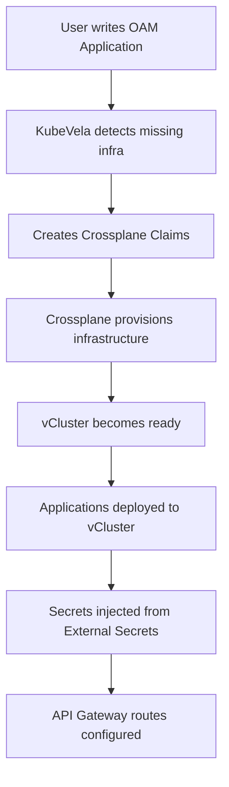

# OAM + Crossplane Integration Architecture

This document outlines the integration between KubeVela (OAM) and Crossplane for declarative infrastructure and application provisioning.

## Architecture Overview

The integration enables users to write simple OAM `Application` specs that automatically:
1. **Trigger Infrastructure Provisioning** via Crossplane Claims
2. **Deploy Applications** within provisioned vClusters  
3. **Connect Dependencies** through shared secrets and networking
4. **Manage Lifecycle** through GitOps automation

## Component Categories

### Infrastructure Components (Host Cluster)
These are provisioned in the management cluster and provide foundational services:

- **`vcluster`**: Virtual Kubernetes environment with optional components
- **`aws-apigateway`**: External API access and routing
- **`karpenter-nodepool`**: Dynamic compute provisioning  
- **`neon-postgres`**: Managed PostgreSQL database
- **`auth0-idp`**: Identity provider integration
- **`snowflake-datawarehouse`**: Data warehouse for analytics

### Application Components (vCluster)
These are deployed within vClusters and represent actual workloads:

- **`webservice`**: HTTP API services (FastAPI, SpringBoot)
- **`kafka`**: Event streaming platforms
- **`tfjob`**: TensorFlow machine learning jobs
- **`data-pipeline`**: ETL and data processing workflows

## Workflow



## Example Flow

1. **User Declaration:**
```yaml
apiVersion: core.oam.dev/v1beta1
kind: Application
metadata:
  name: ml-analytics-app
spec:
  components:
  - name: api-backend
    type: webservice
    properties:
      image: my-app:latest
      language: python
      framework: fastapi
      database: postgres
  - name: ml-trainer  
    type: tfjob
    properties:
      model: recommendation-engine
```

2. **KubeVela Auto-Creates:**
- `VClusterEnvironmentClaim` (if not exists)
- `ApplicationClaim` for api-backend
- `NeonPostgresClaim` for database
- `TensorFlowJobClaim` for ML workload

3. **Crossplane Provisions:**
- vCluster with Knative + Istio
- Neon Postgres database  
- AWS API Gateway integration
- GitHub repos with CI/CD
- ArgoCD applications

4. **Result:**
- ML application running in isolated vCluster
- External API access via AWS API Gateway
- Database credentials auto-injected
- Full observability and GitOps

## Benefits

- **Declarative**: Users specify intent, not implementation
- **Automatic**: Infrastructure and dependencies auto-provisioned
- **Consistent**: Same patterns across all applications
- **Secure**: Proper isolation and secret management
- **Observable**: Full monitoring and tracing built-in