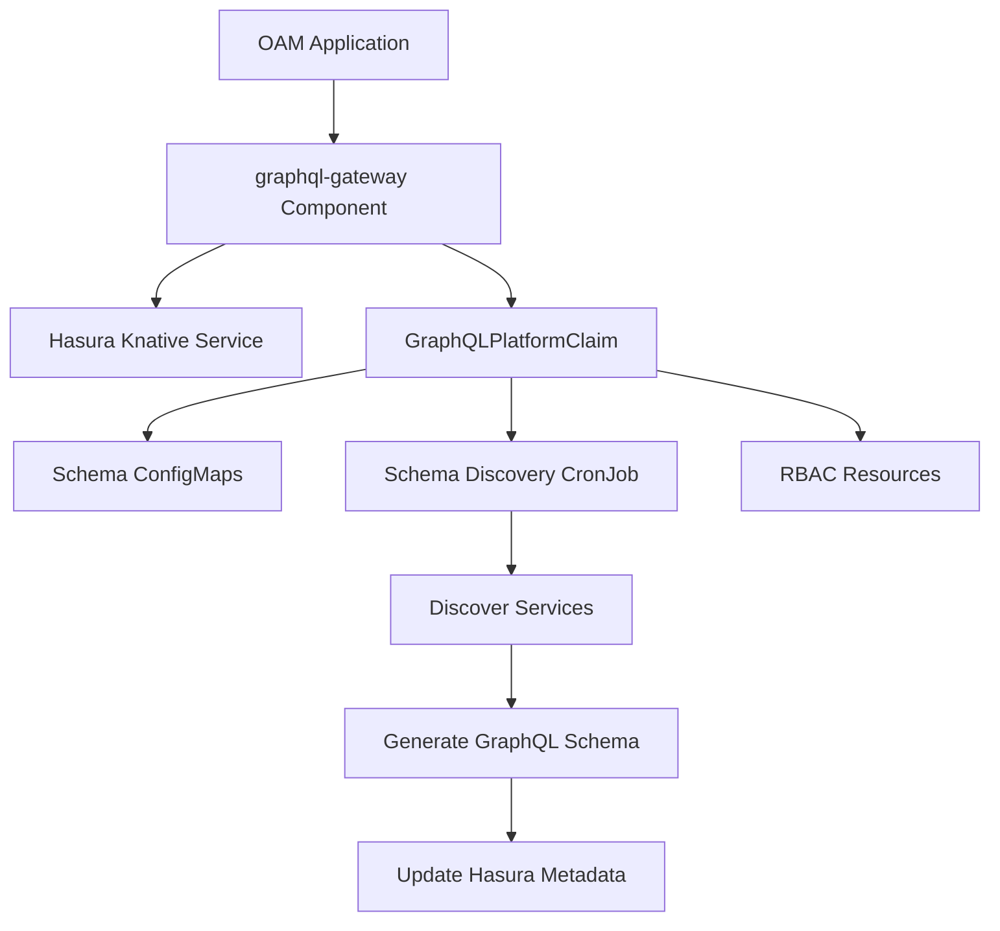

# GraphQL Gateway Component Guide

## Overview

The `graphql-gateway` ComponentDefinition provides a zero-configuration GraphQL API aggregation layer using Hasura. It automatically discovers Knative services, generates GraphQL schemas from their OpenAPI specifications, and creates a unified GraphQL endpoint.

## Architecture

The GraphQL gateway follows the established composite component pattern:



## Quick Start

### 1. Basic GraphQL Gateway

```yaml
apiVersion: core.oam.dev/v1beta1
kind: Application
metadata:
  name: my-platform
spec:
  components:
  # Your existing services
  - name: user-service
    type: webservice
    properties:
      image: user-service:latest
      annotations:
        "graphql.oam.dev/exposed": "true"
        
  # GraphQL Gateway
  - name: api-gateway
    type: graphql-gateway
    properties:
      serviceSelector:
        "app.kubernetes.io/part-of": "my-platform"
```

### 2. With Custom Configuration

```yaml
- name: api-gateway
  type: graphql-gateway
  properties:
    # Custom service discovery
    serviceSelector:
      "platform": "ecommerce"
      "graphql.oam.dev/exposed": "true"
    
    # Schema management
    autoSchema: true
    schemaRefreshInterval: "10m"
    exposeIntrospection: false
    
    # Security
    adminSecret: "my-secure-admin-secret"
    enableAllowList: true
    
    # Resources
    resources:
      cpu: "1000m"
      memory: "1Gi"
```

## Component Parameters

| Parameter | Type | Default | Description |
|-----------|------|---------|-------------|
| `hasuraImage` | string | `hasura/graphql-engine:v2.36.0` | Hasura Docker image |
| `serviceSelector` | object | `{"app.kubernetes.io/managed-by": "kubevela"}` | Label selector for service discovery |
| `autoSchema` | boolean | `true` | Enable automatic schema generation |
| `schemaRefreshInterval` | string | `5m` | How often to refresh schemas |
| `exposeIntrospection` | boolean | `false` | Enable GraphQL introspection |
| `adminSecret` | string | (generated) | Hasura admin secret |
| `enableConsole` | boolean | `true` | Enable Hasura console UI |
| `enableAllowList` | boolean | `false` | Enable query whitelisting |
| `resources` | object | `{cpu: "500m", memory: "512Mi"}` | Resource requirements |
| `customResolvers` | array | `[]` | Custom GraphQL resolvers |
| `targetEnvironment` | string | - | Target vCluster for deployment |

## Service Discovery

### Automatic Discovery

Services are discovered using the `serviceSelector` labels:

```yaml
serviceSelector:
  "app.kubernetes.io/instance": "my-app"
  "tier": "backend"
```

### Service Annotations

Mark services for GraphQL exposure:

```yaml
annotations:
  "graphql.oam.dev/exposed": "true"
  "graphql.oam.dev/path-prefix": "/api/v1"
  "graphql.oam.dev/has-graphql": "false"  # Set to true if service already exposes GraphQL
```

## Schema Management

### Auto-Generated Schema

The schema discovery CronJob:
1. Discovers Knative services matching `serviceSelector`
2. Fetches OpenAPI specs from `/openapi`, `/swagger`, etc.
3. Converts OpenAPI to GraphQL using `openapi-to-graphql`
4. Generates Hasura remote schema configurations

### Custom Schema Extensions

Add custom GraphQL types and resolvers:

```bash
# View auto-generated schema
kubectl get configmap my-platform-graphql-schema-generated -n my-platform-graphql -o yaml

# Create custom extensions
cat <<EOF | kubectl apply -f -
apiVersion: v1
kind: ConfigMap
metadata:
  name: my-platform-graphql-schema-custom
  namespace: my-platform-graphql
data:
  schema.graphql: |
    extend type User {
      orders: [Order!]!
    }
    
    extend type Query {
      searchProducts(query: String!): [Product!]!
    }
EOF
```

### Schema Versioning

Schemas are versioned with timestamps and stored in three ConfigMaps:
- `*-graphql-schema-generated`: Auto-generated schema
- `*-graphql-schema-custom`: Your custom extensions
- `*-graphql-schema-merged`: Final merged schema used by Hasura

## Custom Resolvers

Define custom resolvers for cross-service queries:

```yaml
customResolvers:
- name: "userOrders"
  endpoint: "http://order-service:8080/api/users/{userId}/orders"
  headers:
    "X-Internal-Request": "true"
- name: "productReviews"
  endpoint: "http://review-service:8080/api/products/{productId}/reviews"
```

## Accessing the GraphQL Gateway

### 1. Get the Endpoint

```bash
# Get Hasura URL
kubectl get ksvc my-platform-api-gateway-hasura -o jsonpath='{.status.url}'
```

### 2. Access Hasura Console

```bash
# Port-forward for local access
kubectl port-forward svc/my-platform-api-gateway-hasura 8080:80

# Open browser
open http://localhost:8080/console
```

### 3. Query the GraphQL API

```bash
# GraphQL query
curl -X POST http://gateway-url/v1/graphql \
  -H "Content-Type: application/json" \
  -H "X-Hasura-Admin-Secret: your-admin-secret" \
  -d '{
    "query": "{ users { id name email } }"
  }'
```

## Infrastructure Created

The GraphQL gateway creates:

1. **Namespace**: `{name}-graphql` for all GraphQL infrastructure
2. **ConfigMaps**: Schema storage (generated, custom, merged)
3. **ServiceAccount**: For schema discovery with cluster read permissions
4. **CronJob**: Runs schema discovery on schedule
5. **Secrets**: Hasura admin credentials
6. **NetworkPolicy**: Restricts Hasura network access
7. **Hasura Service**: Knative service running Hasura

## Multi-Cluster Deployment

Deploy to specific vCluster:

```yaml
- name: production-api
  type: graphql-gateway
  properties:
    targetEnvironment: "production-env"
    serviceSelector:
      "environment": "production"
```

## Monitoring and Troubleshooting

### Check Schema Discovery Logs

```bash
# Get latest schema discovery job
kubectl logs -n my-platform-graphql \
  job/$(kubectl get job -n my-platform-graphql -o name | grep schema-discovery | tail -1)
```

### Monitor Schema Updates

```bash
# Watch ConfigMap updates
kubectl get cm -n my-platform-graphql -w
```

### Common Issues

1. **Services not discovered**
   - Check service labels match `serviceSelector`
   - Verify services have `graphql.oam.dev/exposed: "true"` annotation
   - Check RBAC permissions for ServiceAccount

2. **Schema generation fails**
   - Ensure services expose OpenAPI spec
   - Check service is accessible from GraphQL namespace
   - Review schema discovery logs

3. **Hasura not starting**
   - Check admin secret is created
   - Verify NetworkPolicy allows required traffic
   - Check Hasura logs: `kubectl logs deployment/hasura`

## Advanced Use Cases

### 1. Multi-Tenant GraphQL

```yaml
- name: tenant-gateway
  type: graphql-gateway
  properties:
    serviceSelector:
      "tenant.id": "acme-corp"
    environment:
      HASURA_GRAPHQL_JWT_SECRET: '{"type":"RS256","key":"..."}'
```

### 2. Federation with External GraphQL

```yaml
customResolvers:
- name: "externalPayments"
  endpoint: "https://payments.api.com/graphql"
  headers:
    "Authorization": "Bearer ${PAYMENT_API_TOKEN}"
```

### 3. With Repository for Custom Logic

```yaml
- name: custom-gateway
  type: graphql-gateway
  properties:
    # Triggers repository creation
    language: "typescript"
    framework: "apollo-server"
    repository: "custom-graphql-gateway"
```

## Best Practices

1. **Service Design**
   - Expose OpenAPI specs at standard endpoints
   - Use consistent REST API patterns
   - Include descriptive schemas in OpenAPI

2. **Schema Management**
   - Keep custom schemas in version control
   - Use namespacing in GraphQL types
   - Document custom resolvers

3. **Security**
   - Use strong admin secrets in production
   - Enable query whitelisting for public APIs
   - Implement proper authentication/authorization

4. **Performance**
   - Set appropriate schema refresh intervals
   - Monitor Hasura resource usage
   - Use caching for frequently accessed data

## Integration with CI/CD

The GraphQL gateway integrates with the existing GitOps workflow:

1. Define services in OAM Application
2. Mark services with GraphQL annotations
3. Deploy GraphQL gateway component
4. Schema auto-discovers and updates
5. Access unified GraphQL endpoint

## Comparison with Other Approaches

| Approach | Pros | Cons |
|----------|------|------|
| **GraphQL Gateway** | Zero-config, auto-discovery, Hasura features | Requires OpenAPI specs |
| **Apollo Federation** | Native GraphQL, fine control | Requires service modifications |
| **Manual Schema** | Full control | High maintenance |
| **API Gateway** | Simple proxy | No GraphQL benefits |

## Next Steps

1. Deploy example: `kubectl apply -f crossplane/oam/examples/graphql-gateway-example.yaml`
2. Run tests: `./test-graphql-gateway.sh`
3. Access Hasura console
4. Customize schema
5. Build client applications

The GraphQL gateway provides a powerful, zero-configuration solution for creating unified GraphQL APIs from your microservices, following the same patterns as other OAM components in the platform.