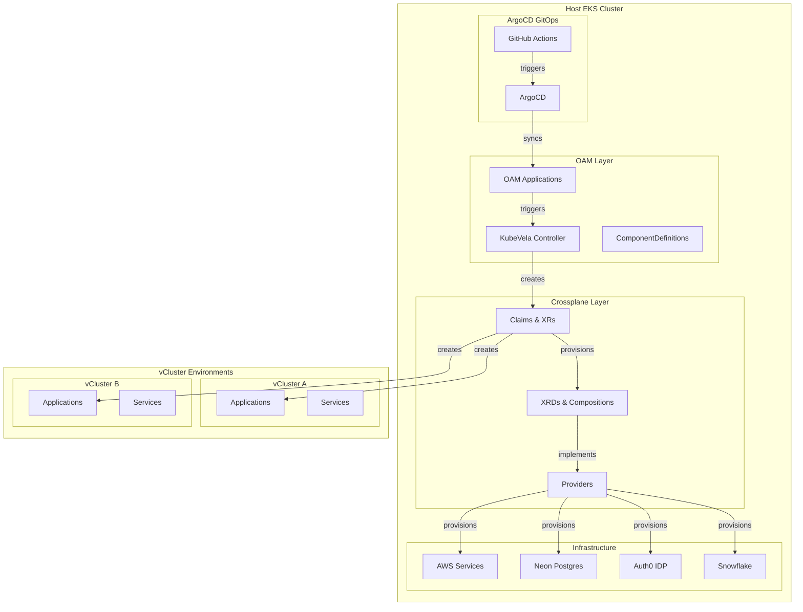
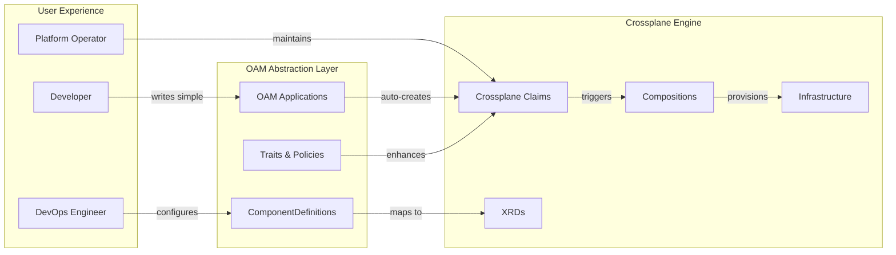
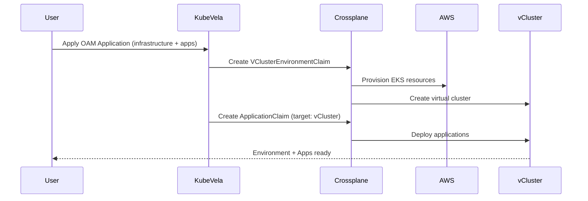
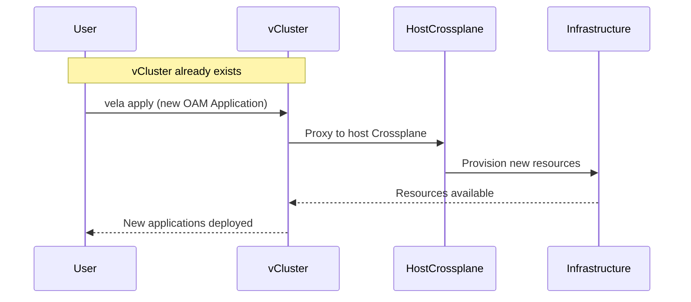
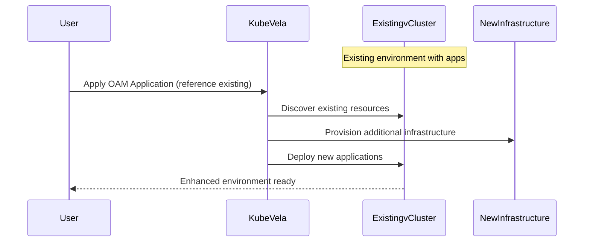
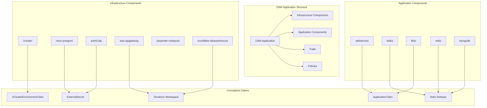
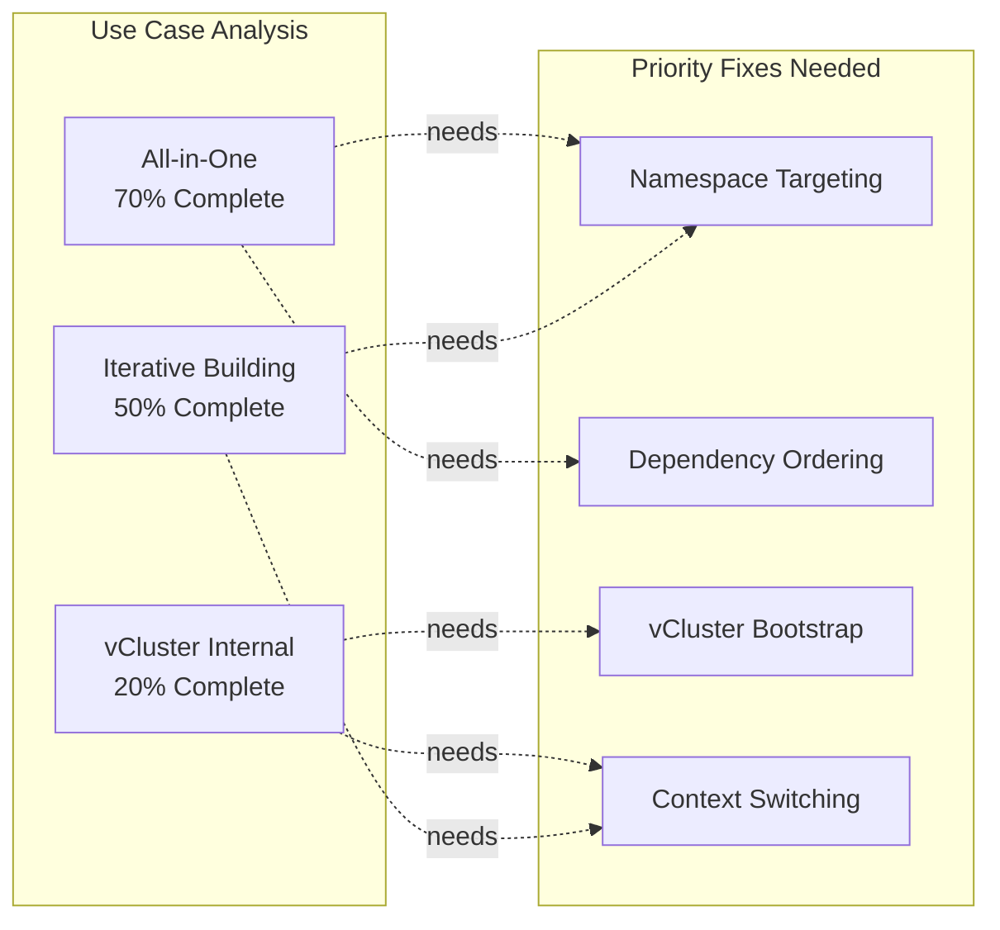

# OAM + Crossplane Integration

This directory contains the OAM (Open Application Model) abstraction layer that sits on top of the existing Crossplane infrastructure, providing a user-friendly interface for declaring infrastructure and applications.

## Architecture Overview

The OAM integration provides a simplified interface where users write declarative OAM Application specs that automatically provision infrastructure using the existing Crossplane Claims. This creates a two-tier architecture:

1. **OAM Layer (User Interface)**: Simple, declarative specifications for infrastructure and applications
2. **Crossplane Layer (Engine)**: Existing robust infrastructure provisioning using XRDs and Compositions

### High-Level Architecture Diagram



### Two-Tier Abstraction Model



## Components

### Infrastructure ComponentDefinitions (`component-definitions.yaml`)

Defines OAM components for infrastructure provisioning:

- **`vcluster`**: Virtual Kubernetes environments with optional components (Istio, Knative, ArgoCD, observability)
- **`aws-apigateway`**: AWS API Gateway for external service access
- **`neon-postgres`**: Neon PostgreSQL managed database with credential sync
- **`auth0-idp`**: Auth0 identity provider integration
- **`karpenter-nodepool`**: Dynamic compute provisioning with workload-specific configurations
- **`snowflake-datawarehouse`**: Snowflake data warehouse via Terraform provider

### Application ComponentDefinitions (`application-component-definitions.yaml`)

Defines OAM components for application workloads:

- **`webservice`**: Web applications with optional database, cache, and API exposure
- **`kafka`**: Apache Kafka event streaming platform
- **`tfjob`**: TensorFlow training jobs for ML workloads
- **`redis`**: Redis in-memory data store
- **`mongodb`**: MongoDB document database

### Traits and Policies (`traits-and-policies.yaml`)

Operational capabilities that can be attached to components:

**Traits:**
- **`ingress`**: Configure ingress routing with TLS support
- **`autoscaler`**: Horizontal Pod Autoscaler with CPU/memory targets
- **`kafka-producer`**: Configure applications as Kafka producers
- **`kafka-consumer`**: Configure applications as Kafka consumers

**Policies:**
- **`health`**: Health checking policy for applications
- **`security-policy`**: Network policies and access control
- **`override`**: Selective component configuration overrides

### Enhanced Crossplane Resources

#### XRDs (`crossplane-xrds.yaml`)
New CompositeResourceDefinitions for infrastructure not covered by existing Crossplane setup:
- `XSnowflakeDataWarehouse`: Snowflake data warehouse provisioning
- `XNeonPostgres`: Enhanced Neon PostgreSQL with app-specific schemas
- `XAuth0IDP`: Auth0 identity provider with application configuration
- `XDataPipeline`: Airflow-based data pipelines

#### Compositions (`crossplane-compositions.yaml`)
Corresponding Compositions that implement the XRDs:
- Terraform-based Snowflake provisioning
- External Secrets integration for Neon and Auth0
- Helm-based data pipeline deployment

#### Providers (`enhanced-providers.yaml`)
Additional Crossplane providers required for OAM integration:
- Terraform provider for external service integration
- Enhanced AWS provider for API Gateway services
- HTTP provider for REST API integrations

## Example OAM Applications

The `example-oam-applications.yaml` file contains comprehensive examples:

1. **Simple Web Application**: User management app with database and authentication
2. **ML Analytics Pipeline**: Complete ML pipeline with data warehouse and processing
3. **Microservices with Event Streaming**: Event-driven architecture with Kafka
4. **Full-Stack E-commerce**: Frontend + backend + database stack

## GitOps Integration

The `gitops-automation.yaml` provides:

- **Application Controller**: Bridges OAM Applications to Crossplane Claims
- **ArgoCD Configuration**: GitOps synchronization of OAM definitions
- **GitHub Actions**: Automated validation and deployment workflows
- **Status Monitoring**: Health checking of underlying Crossplane resources
- **Template Generation**: Convert existing Claims to OAM Applications

## How It Works

### 1. User Experience
Users write simple OAM Application specs like:

```yaml
apiVersion: core.oam.dev/v1beta1
kind: Application
metadata:
  name: my-web-app
spec:
  components:
  - name: app-environment
    type: vcluster
    properties:
      name: my-app
      observability: true
  - name: app-database
    type: neon-postgres
    properties:
      name: app-db
      namespace: my-app
  - name: web-service
    type: webservice
    properties:
      image: myorg/web-app:latest
      language: python
      framework: fastapi
```

### 2. Automatic Infrastructure Provisioning
The OAM controller detects the Application and automatically creates:
- `VClusterEnvironmentClaim` for the virtual environment
- `ExternalSecret` for Neon PostgreSQL credentials
- `ApplicationClaim` for the web service

### 3. Existing Crossplane Engine
The existing Crossplane Compositions handle the actual provisioning:
- VCluster with Istio, Knative, observability stack
- Database credential synchronization from AWS Secrets Manager
- Application deployment with CI/CD integration

## Installation

1. **Install KubeVela** (if not already installed):
```bash
kubectl apply -f https://github.com/kubevela/kubevela/releases/download/v1.9.0/vela-core.yaml
```

2. **Apply OAM ComponentDefinitions**:
```bash
kubectl apply -f component-definitions.yaml
kubectl apply -f application-component-definitions.yaml
kubectl apply -f traits-and-policies.yaml
```

3. **Install Enhanced Crossplane Resources**:
```bash
kubectl apply -f enhanced-providers.yaml
kubectl apply -f crossplane-xrds.yaml
kubectl apply -f crossplane-compositions.yaml
```

4. **Configure GitOps Automation**:
```bash
kubectl apply -f gitops-automation.yaml
```

## Three Deployment Use Cases

### Use Case 1: All-in-One from Host Cluster

Deploy complete environments with applications in a single OAM Application from the host EKS cluster.



**Example:**
```bash
# From host cluster
kubectl apply -f - <<EOF
apiVersion: core.oam.dev/v1beta1
kind: Application
metadata:
  name: complete-stack
spec:
  components:
  - name: environment
    type: vcluster
    properties:
      name: my-environment
      observability: true
  - name: database
    type: neon-postgres
    properties:
      name: app-db
      namespace: my-environment
  - name: web-app
    type: webservice
    properties:
      name: web-service
      targetEnvironment: my-environment
      image: myapp:latest
EOF
```

### Use Case 2: New Resources from vCluster

After vCluster creation, add new applications and infrastructure from within the vCluster context.



**Example:**
```bash
# Switch to vCluster context
kubectl config use-context my-environment

# Deploy additional services
vela apply -f - <<EOF
apiVersion: core.oam.dev/v1beta1
kind: Application
metadata:
  name: analytics-service
spec:
  components:
  - name: kafka-stream
    type: kafka
    properties:
      name: analytics-kafka
      namespace: my-environment
  - name: ml-pipeline
    type: tfjob
    properties:
      name: ml-training
      image: tensorflow/tensorflow:latest
EOF
```

### Use Case 3: Iterative Building on Existing vCluster

Incrementally add components to existing environments over time.



**Example:**
```bash
# Add new services to existing environment
kubectl apply -f - <<EOF
apiVersion: core.oam.dev/v1beta1
kind: Application
metadata:
  name: extend-environment
spec:
  components:
  - name: cache-layer
    type: redis
    properties:
      name: app-cache
      namespace: my-environment  # Existing vCluster
  - name: background-jobs
    type: webservice
    properties:
      name: job-processor
      targetEnvironment: my-environment  # Reference existing
      image: jobprocessor:latest
      cache: redis
EOF
```

## Component Flow Diagram



## Deployment Context Decision Matrix

| Use Case | Context | vCluster Exists? | ComponentDefinitions Location | Crossplane Access |
|----------|---------|------------------|-------------------------------|-------------------|
| All-in-One | Host EKS | No | Host cluster | Direct |
| vCluster Internal | vCluster | Yes | Copied to vCluster | Proxy to host |
| Iterative Building | Host EKS | Yes | Host cluster | Direct |

## Usage Examples

### Use Case 1: All-in-One Deployment

```bash
# From host cluster - creates everything
kubectl apply -f example-oam-applications.yaml
kubectl get application complete-stack
kubectl get vclusterenvironmentclaims
```

### Use Case 2: vCluster Internal Operations

```bash
# Switch to vCluster context
kubectl config use-context my-environment

# Deploy new services (requires vCluster bootstrap)
vela apply -f new-services.yaml
vela status new-services
```

### Use Case 3: Iterative Enhancement

```bash
# Add to existing environment
kubectl apply -f additional-components.yaml
kubectl get application extend-environment
kubectl --context=my-environment get pods
```

### Monitor Application Status

```bash
# Check OAM Application
kubectl get application hello-world

# Check underlying Crossplane Claims
kubectl get vclusterenvironmentclaims
kubectl get applicationclaims

# Check application pods in vCluster
kubectl --context=hello get pods
```

## Benefits

1. **Simplified Interface**: Users write simple, declarative specifications
2. **Leverages Existing Infrastructure**: Uses proven Crossplane compositions
3. **GitOps Ready**: Full integration with ArgoCD and GitHub Actions
4. **Composable**: Mix and match infrastructure and application components
5. **Policy-Driven**: Apply operational policies consistently across applications
6. **Status Transparency**: Clear visibility into infrastructure provisioning status

## Relationship to Existing Crossplane Infrastructure

This OAM layer **complements** rather than replaces the existing Crossplane setup:

- **Existing**: Direct Crossplane Claims for advanced users and CI/CD systems
- **New OAM**: Simplified interface for developers and application teams
- **Both**: Use the same underlying Crossplane Compositions and infrastructure

The existing VClusterEnvironmentClaim, ApplicationClaim, and AppContainerClaim continue to work exactly as before, while OAM provides an additional abstraction layer for easier consumption.

## Implementation Gaps and Future Enhancements

### Current Implementation Gaps



### Required Enhancements

1. **Enhanced ComponentDefinitions**: Add `targetEnvironment` and `targetNamespace` support
2. **Dependency Management**: Implement component dependency ordering
3. **vCluster Bootstrap**: Install KubeVela and ComponentDefinitions in vClusters
4. **Context-Aware Deployment**: Support deployment from different cluster contexts
5. **Resource Discovery**: Enable referencing existing infrastructure components

### Implementation Roadmap

| Phase | Components | Status |
|-------|------------|---------|
| **Phase 1** | Basic OAM + Crossplane integration | ✅ Complete |
| **Phase 2** | All-in-one use case fixes | 🚧 In Progress |
| **Phase 3** | vCluster internal operations | 📋 Planned |
| **Phase 4** | Advanced iterative building | 📋 Planned |

This comprehensive OAM abstraction layer provides the foundation for all three deployment patterns while maintaining full compatibility with the existing robust Crossplane infrastructure.