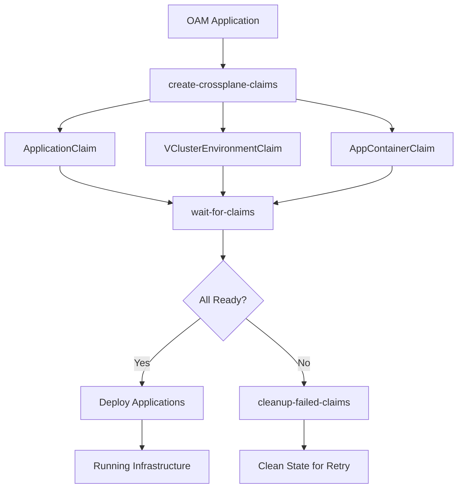

# OAM → Crossplane WorkflowStepDefinitions

This document describes the custom WorkflowStepDefinitions that enable declarative orchestration between KubeVela OAM Applications and Crossplane infrastructure provisioning.

## Overview

These WorkflowStepDefinitions bridge the gap between high-level OAM Application specifications and low-level Crossplane resource management, providing:

- **Declarative Infrastructure**: OAM Applications automatically create appropriate Crossplane Claims
- **Dependency Management**: Proper ordering ensures infrastructure is ready before application deployment  
- **Error Recovery**: Automatic cleanup of failed resources with retry capabilities
- **Status Transparency**: Full visibility into infrastructure provisioning status

## Architecture



---

## WorkflowStepDefinitions

### 1. `create-crossplane-claims`

**Purpose**: Analyzes OAM Application components and creates corresponding Crossplane Claims

**Functionality**:
- Reads the current OAM Application specification
- Detects component types (`microservice-with-db`, `vcluster`, `app-container`)
- Maps component properties to appropriate Crossplane resource specifications
- Creates Claims with proper labels for tracking and relationships

**Supported Component Types**:

#### `microservice-with-db`
Creates `ApplicationClaim` with:
```yaml
spec:
  name: component.name
  language: component.properties.language
  framework: component.properties.framework  
  database: component.properties.database
  cache: component.properties.cache
  exposeApi: component.properties.exposeApi
```

#### `vcluster`
Creates `VClusterEnvironmentClaim` with:
```yaml
spec:
  name: component.name
  domain: component.properties.domain
  components: component.properties.components
```

#### `app-container`
Creates `AppContainerClaim` with:
```yaml
spec:
  name: component.name
  description: component.properties.description
  gitHubOrg: component.properties.gitHubOrg
```

**Parameters**:
- `timeout`: Execution timeout (default: "15m")
- `retryPolicy`: Retry behavior (default: "OnFailure")

**Labels Applied**:
All created Claims receive labels:
```yaml
labels:
  "oam.dev/application": context.name
  "oam.dev/component": component.name  
  "oam.dev/component-type": component.type
```

**Example Usage**:
```yaml
workflow:
  steps:
  - name: provision-infrastructure
    type: create-crossplane-claims
    timeout: 15m
```

---

### 2. `wait-for-claims`

**Purpose**: Waits for Crossplane Claims to reach Ready status before proceeding

**Functionality**:
- Lists all Claims created by the OAM Application using label selectors
- Monitors each Claim's `status.conditions` for `Ready: True`
- Implements configurable timeout and check intervals
- Provides progress reporting on waiting status

**Claim Types Monitored**:
- `ApplicationClaim`: Microservice deployments
- `VClusterEnvironmentClaim`: Virtual cluster environments  
- `AppContainerClaim`: Application container infrastructure

**Readiness Logic**:
```cue
continue: claim.status != _|_ && 
         claim.status.conditions != _|_ &&
         [for cond in claim.status.conditions 
          if cond.type == "Ready" { cond.status }][0] == "True"
```

**Parameters**:
- `timeout`: Wait timeout (default: "10m")
- `interval`: Check interval (default: "30s")

**Status Reporting**:
- Reports total number of Claims being monitored
- Tracks individual Claim readiness status
- Provides clear progress visibility

**Example Usage**:
```yaml
workflow:
  steps:
  - name: wait-for-infrastructure
    type: wait-for-claims
    timeout: 10m
    properties:
      interval: "30s"
    dependsOn: ["provision-infrastructure"]
```

---

### 3. `cleanup-failed-claims`

**Purpose**: Cleans up failed or partially created Crossplane Claims for error recovery

**Functionality**:
- Discovers all Claims created by the OAM Application
- Identifies failed Claims by checking `Ready: False` conditions
- Selectively deletes failed Claims or force cleanup all Claims
- Provides graceful deletion with configurable grace periods

**Cleanup Modes**:

#### Selective Cleanup (default)
Only deletes Claims with `Ready: False` status:
```cue
failedConditions: [for cond in claim.status.conditions 
                 if cond.type == "Ready" && cond.status == "False" 
                 { cond }]
if len(failedConditions) > 0 {
  // Delete this failed claim
}
```

#### Force Cleanup
Deletes all Claims regardless of status when `forceCleanup: true`:
```yaml
parameters:
  forceCleanup: true
```

**Parameters**:
- `forceCleanup`: Delete all Claims regardless of status (default: false)
- `gracePeriodSeconds`: Grace period for deletion (default: 30)

**Safety Features**:
- Only deletes Claims with matching OAM Application labels
- Preserves successful Claims unless force cleanup is enabled
- Configurable grace periods prevent accidental deletions

**Example Usage**:
```yaml
workflow:
  onFailure:
    steps:
    - name: cleanup-resources
      type: cleanup-failed-claims
      properties:
        forceCleanup: false
        gracePeriodSeconds: 30
```

---

## Complete Workflow Example

Here's how to use all three WorkflowStepDefinitions together:

```yaml
apiVersion: core.oam.dev/v1beta1
kind: Application
metadata:
  name: my-app
  namespace: default
spec:
  components:
  - name: app-environment
    type: vcluster
    properties:
      name: my-app-env
      components:
        istio: true
        knativeServing: true
        argoCD: true
        
  - name: app-container
    type: app-container
    properties:
      name: my-app
      description: "My application container"
      gitHubOrg: "my-org"
      
  - name: api-service
    type: microservice-with-db
    properties:
      name: api-service
      language: python
      framework: fastapi
      database: postgres
      cache: redis
      appContainer: my-app

  # Orchestrated workflow with proper dependency management
  workflow:
    steps:
    - name: provision-infrastructure
      type: create-crossplane-claims
      timeout: 15m
      
    - name: wait-for-infrastructure  
      type: wait-for-claims
      timeout: 10m
      properties:
        interval: "30s"
      dependsOn: ["provision-infrastructure"]
      
    - name: deploy-applications
      type: create-crossplane-claims  
      timeout: 10m
      dependsOn: ["wait-for-infrastructure"]
      
    - name: validate-deployment
      type: wait-for-claims
      timeout: 5m
      dependsOn: ["deploy-applications"]
    
    # Error recovery
    onFailure:
      steps:
      - name: cleanup-resources
        type: cleanup-failed-claims
        timeout: 5m
        properties:
          forceCleanup: false
```

## Installation

1. **Prerequisites**: KubeVela must be installed and running
2. **Install**: Run `./install-workflow-orchestration.sh`
3. **Verify**: Check that WorkflowStepDefinitions are available:

```bash
kubectl get workflowstepdefinitions -n vela-system | grep -E "create-crossplane|wait-for|cleanup"
```

Expected output:
```
cleanup-failed-claims     <age>
create-crossplane-claims  <age>  
wait-for-claims          <age>
```

## Testing

Use the provided test script to validate the orchestration:

```bash
./test-workflow-orchestration.sh
```

This creates a comprehensive test OAM Application and monitors the workflow execution.

## Benefits

### For Developers
- **Simple Interface**: 15-line OAM Applications deploy complex infrastructure
- **Declarative**: Specify intent, not implementation details
- **Reliable**: Automatic error recovery and dependency management
- **Transparent**: Full visibility into infrastructure provisioning status

### For Platform Teams  
- **Consistent**: Standardized infrastructure provisioning patterns
- **Maintainable**: Centralized orchestration logic in reusable definitions
- **Observable**: Clear workflow execution with progress tracking
- **Recoverable**: Automatic cleanup prevents resource leaks

### For Operations
- **GitOps Ready**: Full integration with ArgoCD and CI/CD pipelines
- **Scalable**: Handle complex multi-component applications
- **Debuggable**: Clear separation of concerns and error reporting
- **Extensible**: Easy to add new component types and orchestration patterns

## Troubleshooting

### WorkflowStepDefinition Not Found
```bash
# Check if definitions are installed
kubectl get workflowstepdefinitions -n vela-system

# Reinstall if missing
./install-workflow-orchestration.sh
```

### Claims Not Created
```bash
# Check OAM Application status
kubectl get application <app-name> -n <namespace>

# Check workflow execution
kubectl describe application <app-name> -n <namespace>
```

### Claims Stuck in Non-Ready State
```bash
# Check individual Claim status
kubectl get applicationclaims,vclusterenvironmentclaims,appcontainerclaims -A

# Check Crossplane controller logs
kubectl logs -n crossplane-system deployment/crossplane
```

### Cleanup Not Working
```bash
# Force cleanup all Claims for an application
kubectl patch application <app-name> -n <namespace> --type=json -p='[{
  "op": "add",
  "path": "/spec/workflow/onFailure/steps/0/properties/forceCleanup",
  "value": true
}]'
```

## Integration with Existing System

These WorkflowStepDefinitions integrate with the existing Crossplane infrastructure:

- **Reuses**: All existing XRDs, Compositions, and Providers  
- **Enhances**: Adds declarative orchestration layer on top
- **Maintains**: Full compatibility with direct Crossplane Claims
- **Extends**: Enables complex workflow patterns and dependency management

The system provides **both** approaches:
- **Direct Crossplane**: For advanced users and CI/CD systems
- **OAM Orchestration**: For simplified developer experience and complex workflows

This dual approach maximizes flexibility while providing the right abstraction level for different use cases.