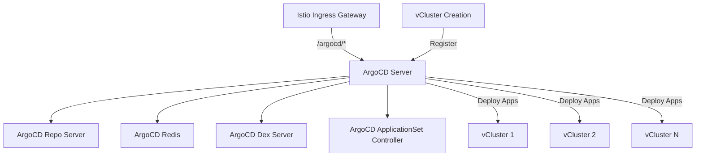

# ArgoCD Setup and Configuration Guide

## Overview

This guide documents the ArgoCD setup for the OAM-driven vCluster infrastructure architecture. ArgoCD is configured to work behind Istio ingress at the `/argocd` subpath and automatically registers vClusters for GitOps deployment.

## Architecture



## Prerequisites

1. **Istio installed** with ingress gateway configured
2. **ArgoCD namespace** created: `kubectl create namespace argocd`
3. **External LoadBalancer** provisioned by cloud provider
4. **vcluster CLI** installed for kubeconfig extraction
5. **argocd CLI** installed for cluster registration

## Installation

### 1. Install ArgoCD

```bash
kubectl create namespace argocd
kubectl apply -n argocd -f https://raw.githubusercontent.com/argoproj/argo-cd/stable/manifests/install.yaml
```

### 2. Apply Configuration for Subpath Serving

The critical configuration for ArgoCD to work behind Istio at `/argocd`:

```bash
kubectl apply -f argocd/argocd-server-config.yaml
```

This configures:
- `server.insecure: "true"` - Disable internal TLS (Istio handles TLS)
- `server.grpc.web: "true"` - Enable gRPC-Web for CLI access
- `server.basehref: "/argocd"` - UI assets served from /argocd
- `server.rootpath: "/argocd"` - API served from /argocd

### 3. Configure Istio Gateway and VirtualService

```bash
kubectl apply -f slack-api-server/argocd-gateway.yaml
```

This creates:
- **Gateway**: Accepts HTTP traffic on port 80
- **VirtualService**: Routes `/argocd/*` to `argocd-server.argocd.svc.cluster.local:80`

### 4. Scale ArgoCD Components

Ensure all components are running:

```bash
# Scale up if needed
kubectl scale deployment -n argocd argocd-server --replicas=1
kubectl scale deployment -n argocd argocd-repo-server --replicas=1
kubectl scale deployment -n argocd argocd-redis --replicas=1
kubectl scale deployment -n argocd argocd-dex-server --replicas=1
kubectl scale deployment -n argocd argocd-applicationset-controller --replicas=1
```

### 5. Get Initial Admin Password

```bash
kubectl -n argocd get secret argocd-initial-admin-secret -o jsonpath="{.data.password}" | base64 -d
```

## Access Methods

### Web UI Access

1. Get the Istio ingress URL:
```bash
kubectl get svc istio-ingressgateway -n istio-system -o jsonpath='{.status.loadBalancer.ingress[0].hostname}'
```

2. Access ArgoCD UI:
```
http://<INGRESS_URL>/argocd
```

### CLI Access

The ArgoCD CLI requires specific flags for subpath serving:

```bash
# Get ingress URL
INGRESS_URL=$(kubectl get svc istio-ingressgateway -n istio-system -o jsonpath='{.status.loadBalancer.ingress[0].hostname}')

# Get admin password
ADMIN_PASSWORD=$(kubectl -n argocd get secret argocd-initial-admin-secret -o jsonpath="{.data.password}" | base64 -d)

# Login with required flags
argocd login ${INGRESS_URL}:80 \
  --grpc-web-root-path /argocd \
  --username admin \
  --password ${ADMIN_PASSWORD} \
  --insecure \
  --plaintext
```

**Critical CLI Flags:**
- `--grpc-web-root-path /argocd` - Required for subpath routing
- `--plaintext` - Use HTTP instead of HTTPS
- `--insecure` - Skip certificate validation
- Port `80` - Use HTTP port

### Local /etc/hosts Configuration (Optional)

For local development, add to `/etc/hosts`:
```
<INGRESS_IP>  argocd.local
```

Then access via: `http://argocd.local/argocd`

## vCluster Registration

### Automatic Registration (Via Workflow)

When a vCluster is created through the Argo Workflow, it automatically:
1. Extracts vCluster kubeconfig
2. Logs into ArgoCD using CLI
3. Registers vCluster using `argocd cluster add`
4. Creates ArgoCD Application for GitOps deployment

### Manual Registration

Use the registration script:

```bash
./scripts/register-vcluster-argocd.sh <vcluster-name> <namespace> [app-name]

# Example
./scripts/register-vcluster-argocd.sh customer-service customer-service customer-app
```

### CLI Registration Process

The registration process uses ArgoCD CLI instead of manual secret creation:

```bash
# 1. Extract vCluster kubeconfig
vcluster connect ${VCLUSTER_NAME} -n ${NAMESPACE} --print > /tmp/vcluster.kubeconfig

# 2. Login to ArgoCD
argocd login ${INGRESS_URL}:80 \
  --grpc-web-root-path /argocd \
  --username admin \
  --password ${ADMIN_PASSWORD} \
  --insecure \
  --plaintext

# 3. Add cluster
CONTEXT=$(kubectl config get-contexts --kubeconfig=/tmp/vcluster.kubeconfig -o name | head -1)
argocd cluster add ${CONTEXT} \
  --kubeconfig /tmp/vcluster.kubeconfig \
  --name ${VCLUSTER_NAME} \
  --yes
```

## Troubleshooting

### Common Issues and Solutions

#### 1. ArgoCD CLI Connection Timeout

**Symptom:** `context deadline exceeded` when using CLI

**Solution:** Ensure using correct flags:
```bash
argocd login ${INGRESS_URL}:80 \
  --grpc-web-root-path /argocd \  # Critical flag
  --plaintext \                    # Use HTTP
  --insecure                       # Skip cert validation
```

#### 2. ArgoCD Components Not Running

**Symptom:** Deployments scaled to 0

**Solution:**
```bash
kubectl scale deployment -n argocd argocd-server --replicas=1
kubectl scale deployment -n argocd argocd-repo-server --replicas=1
kubectl scale deployment -n argocd argocd-redis --replicas=1
```

#### 3. UI Assets Not Loading

**Symptom:** 404 errors for CSS/JS files

**Solution:** Verify ConfigMap has correct basehref:
```bash
kubectl get cm argocd-cmd-params-cm -n argocd -o yaml | grep basehref
# Should show: server.basehref: "/argocd"
```

#### 4. vCluster Registration Fails

**Symptom:** Cannot add vCluster to ArgoCD

**Solution:**
1. Verify vCluster is running:
```bash
kubectl get pods -n <vcluster-namespace>
```

2. Check kubeconfig secret exists:
```bash
kubectl get secret -n <vcluster-namespace> | grep "vc-"
```

3. Test vCluster connection:
```bash
vcluster connect <name> -n <namespace>
kubectl get nodes  # Should show vCluster nodes
```

### Verification Commands

```bash
# Check ArgoCD is accessible
curl -I http://${INGRESS_URL}/argocd

# List registered clusters
argocd cluster list

# Check application sync status
argocd app list
argocd app get <app-name>

# View ArgoCD logs
kubectl logs -n argocd deployment/argocd-server
kubectl logs -n argocd deployment/argocd-repo-server
```

## Integration with OAM Platform

### ApplicationClaim Composition

The ApplicationClaim composition automatically registers vClusters with ArgoCD:

1. Creates vCluster via Crossplane
2. Waits for vCluster to be ready
3. Extracts connection details
4. Registers with ArgoCD using CLI
5. Creates ArgoCD Application for GitOps

### OAM Application Deployment

Once registered, OAM applications are deployed to vClusters via ArgoCD:

```yaml
apiVersion: argoproj.io/v1alpha1
kind: Application
metadata:
  name: customer-service-oam
  namespace: argocd
spec:
  destination:
    name: customer-service  # vCluster name
    namespace: default
  source:
    repoURL: https://github.com/shlapolosa/customer-service-gitops
    path: oam/applications
    targetRevision: main
```

## Security Considerations

1. **TLS Termination**: Handled by Istio ingress, not ArgoCD
2. **Authentication**: Use strong admin password, consider SSO integration
3. **RBAC**: Configure ArgoCD RBAC for multi-tenancy
4. **Network Policies**: Restrict access between namespaces
5. **Secrets Management**: Use sealed-secrets or external secret operators

## Monitoring

### Key Metrics to Monitor

- ArgoCD sync status
- Application health status
- Repository webhook events
- Sync duration and frequency
- Resource consumption

### Prometheus Queries

```promql
# Application sync failures
argocd_app_sync_total{sync_status="failed"}

# Applications out of sync
argocd_app_info{sync_status!="Synced"}

# Sync operation duration
argocd_app_sync_duration_seconds
```

## Backup and Recovery

### Backup ArgoCD Configuration

```bash
# Export all ArgoCD resources
kubectl get all,cm,secret -n argocd -o yaml > argocd-backup.yaml

# Export applications
argocd app list -o yaml > applications-backup.yaml
```

### Restore Process

```bash
# Restore ArgoCD resources
kubectl apply -f argocd-backup.yaml

# Restore applications
kubectl apply -f applications-backup.yaml
```

## References

- [ArgoCD Documentation](https://argo-cd.readthedocs.io/)
- [ArgoCD CLI Reference](https://argo-cd.readthedocs.io/en/stable/user-guide/commands/argocd/)
- [Istio VirtualService Documentation](https://istio.io/latest/docs/reference/config/networking/virtual-service/)
- [vCluster Documentation](https://www.vcluster.com/docs)
- [OAM Specification](https://oam.dev/)

## Appendix: Complete Configuration Files

All configuration files are available in the repository:
- `argocd/argocd-server-config.yaml` - ArgoCD server configuration
- `slack-api-server/argocd-gateway.yaml` - Istio Gateway and VirtualService
- `scripts/register-vcluster-argocd.sh` - vCluster registration script
- `crossplane/application-claim-composition.yaml` - Crossplane composition with ArgoCD integration
- `argo-workflows/vcluster-standard-contract.yaml` - Workflow with ArgoCD registration step