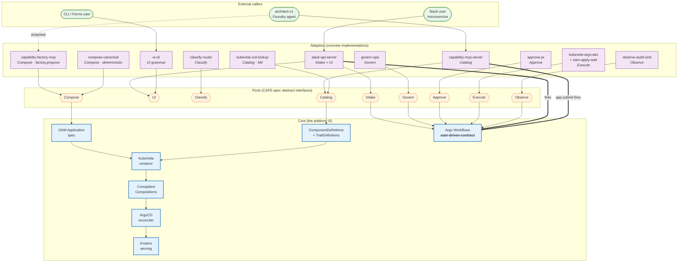

# Ports / Adapters / Core + Consolidated Workflow

_Snapshot: 2026-05-30 (post PR #15 + #16 — Stage 6 cutover live)._

This document visualises how `health-service-idp` is being consolidated
around the CAFE (Composable AI Framework for Enterprise) ports/adapters/core
model defined in [`cafe-spec/PORTS.md`](../../../cafe-spec/PORTS.md), and
shows the single Argo workflow (`oam-driven-contract`) that both Slack and
the architect-v1 Foundry agent now converge on.

---

## Diagram 1 — Ports / Adapters / Core (system view)

**What to look at:** the **core** in the middle is what the platform *is*
(OAM + Crossplane + KubeVela + ArgoCD + Knative). Around it sit the **nine
CAFE ports** — abstract interfaces. The **adapters** on the outside are the
concrete Knative services / agents implementing those ports. Two entry
paths (Slack chat and the architect-v1 LLM agent) now converge on the same
`oam-driven-contract` workflow inside the core.



---

## Diagram 2 — `oam-driven-contract` workflow (zoomed in)

**What to look at:** the two entry paths (Slack and architect-v1) hit
different adapters but converge on the **same workflow template**. The
workflow steps are shown in order; the per-component Jobs fired by the
Crossplane `ApplicationClaim` composition are inside the
`create-microservice-claim` step. Port labels (in italics) show where each
CAFE port surfaces inside the chain. The legacy `microservice-standard-contract`
is shown as a deprecated stub.

```mermaid
flowchart TB
    %% ============ CALLERS ============
    SlackC([Slack: /microservice create])
    AgentC([architect-v1: app.submit])

    %% ============ ADAPTERS ============
    SlackA[slack-api-server<br/>argo_client.trigger_microservice_creation]
    MCPA[capability-mcp-server<br/>submit_use_case._fire_oam_driven_contract]

    %% ---- catalog pre-calls by agent ----
    subgraph PreCatalog["Catalog pre-calls (agent only)"]
        direction LR
        CL[catalog.list]
        CD[catalog.describe]
        CT[catalog.traits_for]
        CR[catalog.connectivity_recipes]
    end
    AgentC -.reads.-> CL
    AgentC -.reads.-> CD
    AgentC -.reads.-> CT
    AgentC -.reads.-> CR

    SlackC --> SlackA
    AgentC --> MCPA

    %% ============ WORKFLOW ============
    subgraph WF["Argo workflow: oam-driven-contract"]
        direction TB
        S1[validate-parameters<br/><i>Govern · runtime</i>]
        S2[notify-starting<br/><i>Observe</i>]
        S3[ensure-repositories<br/>AppContainerClaim<br/><i>Execute</i>]
        S4[create-microservice-claim<br/>ApplicationClaim &rarr; Crossplane]
        S5[wait-for-microservice-ready]
        S6[apply-consumer-oam<br/><b>NEW</b> · overwrites boilerplate OAM<br/><i>Catalog &rarr; Execute boundary</i>]
        S7[extract-microservice-info]
        S8[notify-success<br/><i>Observe</i>]

        S1 --> S2 --> S3 --> S4 --> S5 --> S6 --> S7 --> S8
    end

    SlackA ==>|workflowTemplateRef:<br/>oam-driven-contract| S1
    MCPA ==>|workflowTemplateRef:<br/>oam-driven-contract<br/>+ oam-application param| S1

    %% ============ CROSSPLANE JOBS (inside S4) ============
    subgraph XPJobs["Crossplane Composition Jobs (fired by S4)"]
        direction TB
        J1[microservice-creator<br/>source repo scaffold]
        J2[gitops-manifest-creator<br/>per-service gitops repo]
        J3[oam-updater<br/>OAM in gitops]
        J4[register-argocd<br/>vcluster app registration]
    end
    S4 --> XPJobs

    %% ============ DOWNSTREAM ============
    subgraph Downstream["Downstream reconciliation"]
        direction TB
        GR[(per-service<br/>&lt;svc&gt;-gitops repo)]
        AC[ArgoCD]
        KV[KubeVela render]
        KS[Knative Service Ready]
    end

    J2 --> GR
    S6 ==overwrites OAM at<br/>apps/oam-application.yaml==> GR
    GR --> AC --> KV --> KS

    %% ============ SUPPORTING ============
    subgraph Support["Supporting core artefacts"]
        direction LR
        WSCD[webservice<br/>ComponentDefinition<br/><i>has bootstrap-output Job</i>]
        Traits[TraitDefinitions:<br/>autoscaler · ingress<br/>kafka-consumer · kafka-producer]
    end
    WSCD -.recursion: bootstrap Job<br/>fires oam-driven-contract<br/>when language: set.-> S1
    KV -.consumes.-> WSCD
    KV -.consumes.-> Traits

    %% ============ DEPRECATED ============
    subgraph Dep["Deprecated — to be removed Stage 7"]
        Legacy[microservice-standard-contract<br/>thin fallback stub]
    end

    classDef wf fill:#e3f2fd,stroke:#1565c0,stroke-width:2px
    classDef job fill:#fff8e1,stroke:#f9a825
    classDef adapter fill:#f3e5f5,stroke:#6a1b9a
    classDef caller fill:#e8f5e9,stroke:#2e7d32
    classDef new fill:#c8e6c9,stroke:#1b5e20,stroke-width:2px
    classDef deprecated fill:#ffebee,stroke:#b71c1c,stroke-dasharray: 5 5
    classDef support fill:#eceff1,stroke:#455a64
    class S1,S2,S3,S4,S5,S7,S8 wf
    class S6 new
    class J1,J2,J3,J4 job
    class SlackA,MCPA adapter
    class SlackC,AgentC caller
    class Legacy deprecated
    class WSCD,Traits,GR,AC,KV,KS support
```

---

## Reading the diagrams together

- **Diagram 1** says: there is *one core*, *nine ports*, and *many adapters*.
  An adapter swap (e.g. `compose-canonical` standing in for the Foundry
  architect when AI is down) does not change the core.
- **Diagram 2** says: regardless of which adapter you came in through —
  Slack chat or architect-v1's `app.submit` — you land on the **same**
  `oam-driven-contract` chain. The new `apply-consumer-oam` step is the
  Catalog→Execute boundary where the consumer's actual OAM overlays the
  scaffold's boilerplate.

## Sources

- `/Users/socrateshlapolosa/Development/cafe-spec/PORTS.md` (port catalogue, state map)
- `/Users/socrateshlapolosa/Development/cafe-spec/manufacturers/traditional-cloud/manifest.yaml`
- `/Users/socrateshlapolosa/Development/health-service-idp/argo-workflows/oam-driven-contract.yaml`
- `/Users/socrateshlapolosa/Development/health-service-idp/argo-workflows/microservice-standard-contract.yaml` (deprecated)
- `/Users/socrateshlapolosa/Development/health-service-idp/crossplane/oam/consolidated-core-components.yaml` (webservice CD bootstrap output)
- `/Users/socrateshlapolosa/Development/health-service-idp/crossplane/application-claim-composition.yaml` (per-Job composition)
- `/Users/socrateshlapolosa/Development/health-service-idp/capability-mcp-server/src/application/submit_use_case.py` (routing logic)
- `/Users/socrateshlapolosa/Development/health-service-idp/slack-api-server/src/infrastructure/argo_client.py` (Slack trigger)
