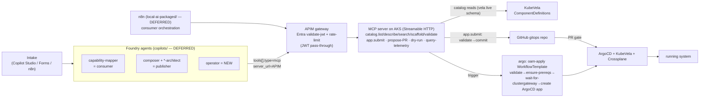

# Capability Factory — End-to-End Design & Implementation Plan

**Status:** design / draft. Pairs with [`capability-quality-attributes-v0.md`](./capability-quality-attributes-v0.md).
**No code is produced by this document** — it is the architecture + phased, multi-repo implementation plan
that later sessions execute. Phases that touch repos other than `health-service-idp` are marked
**DEFERRED** (see §2).

## 1. Model & guiding principle
An agent-operated IDP with a **deterministic GitOps core** (Crossplane + KubeVela + ArgoCD on AKS) and
**non-deterministic agent edges**.

> **Non-determinism is allowed only at design-time and must crystallise — at a PR gate — into reviewed,
> versioned, declarative artifacts. Everything downstream (provision, re-provision, upgrade, remediate)
> is deterministic reconciliation.** Agents only ever open PRs; a human approves.

Two users cross that membrane: a **consumer** (maps a TOGAF architecture → OAM) and a **publisher**
(authors new capabilities). Both ultimately drive the same deterministic core.

## 2. Current-state audit (grounded in this repo)
Everything below was verified to resolve in `health-service-idp`:

| Concern | What exists | Where | Use |
|---|---|---|---|
| Workflow trigger | `ArgoWorkflowsClient.create_workflow_from_template(template, params, ns)`, token via `ARGO_TOKEN_FILE` | `slack-api-server/src/infrastructure/argo_client.py:602` | **Reuse verbatim** — the primitive behind `app.submit`. |
| GitHub client | repository-dispatch only — **no `commit_file`** | `slack-api-server/src/infrastructure/github_client.py` | **Net-new**: add `commit_file` (Contents API GET sha → PUT) = the gitops-commit gate. |
| **Existing OAM path** | `OAMWebhookService` + `PatternOrchestrator` (Pattern 3 → 2 → 1, infra-first) process OAM via an **admission webhook on cluster-apply** | `slack-api-server/src/domain/services.py:371`, `slack-api-server/src/domain/strategies/orchestrator.py:15` | The new gitops `oam-apply` workflow is a **second, distinct entry point** — see §8 P3 for double-trigger avoidance. |
| Repo/vCluster prereqs | `ensure-repositories`, `ensure-target-vcluster` | `argo-workflows/microservice-standard-contract.yaml:498`, `:1125` | **Reuse via `templateRef`** in `oam-apply`. |
| vCluster readiness/registration | `wait-for-vcluster-ready`, `register-vcluster-argocd` | `argo-workflows/vcluster-standard-contract.yaml:455`, `:571`; bootstrap model in `crossplane/vcluster-environment-claim-composition.yaml` | Model for the `wait-for-clustergateway` gate. |
| OAM catalog source | ComponentDefinitions in git (`crossplane/oam/*.yaml`); only `webservice` has a `component-schema-*` ConfigMap, but `vela show <component>` renders all ~15 schemas **live** (verified) | `crossplane/oam/`, `vela-system` | `catalog.describe` renders via **vela live**, NOT the ConfigMaps. |
| ArgoCD app template | per-vCluster ArgoCD `Application` template | `crossplane/oam/argocd-vcluster-app-template.yaml` | Model for `oam-apply` creating the ArgoCD app that applies the caller's OAM. |
| Onion + deploy templates | service skeleton + manifests | `slack-api-server/src/{domain,application,infrastructure,interface}`, `slack-api-server/{Dockerfile,knative-service.yaml,rbac.yaml,istio-gateway.yaml}` | Mirror for the MCP server (§8 P2). |

**Not present in this session's checkout** (so their phases are DEFERRED and unverifiable here): the
`copilots/` repo (Foundry agents, APIM gateway, Presidio, AI Search `capability-registry`), the
`local-ai-packaged/` repo (n8n), and **any Azure/APIM/Foundry coordinates** — this repo's `.env` has none.
*(Note: the operator's full local environment does contain those repos; they are simply out of scope for
the docs-only deliverable.)*

## 3. End-state architecture


## 4. Agents & routing
- **Orchestrator** (Foundry connected-agents front door): elicits intent → emits a `CapabilityRequest` → routes.
- **Architect** = **cluster / infrastructure / capability plane**: create, enhance, **continuously upgrade**, deprecate capabilities (ComponentDefinitions, Compositions, operators, providers, substrate).
- **Operator** = **resource / runtime plane**: observe deployed instances; bounded auto-remediation **via PR**.
- **Consumer** (solution-architect, the *other* user): maps architecture → OAM and provisions via `app.submit`.

**Routing (control-plane vs data-plane):**
| → Architect | → Operator |
|---|---|
| new capability, version upgrade, provider/operator change, Composition fix, platform bug/CVE | running instance lagging/OOM/anomaly, scale/restart, instance remediation |

**Escalation:** operator detects a resource problem rooted in the definition/infra layer → emits a
fix-`CapabilityRequest` to the architect (e.g. "all vCluster deploys RevisionMissing → Composition never
seeds `acr-credentials`" → architect PRs the Composition).

## 5. Architect lifecycle
```
CapabilityRequest (intake)
 → formalize NFRs (quality-attribute vocabulary)
 → deterministic KB match (filter hard + weighted-distance soft)  → ranked shortlist
 → LLM writes ADR (recommendation + tradeoff narrative)
 → APPROVAL GATE (human reviews PR)
 → synthesize capability package (all artifacts, one PR)
 → acceptance v0 (dry-run + sandbox deploy + smoke + policy/scan)
 → publish (install defs + update catalog + capability tags + status)
 → CONTINUOUS UPGRADE LOOP ↓
```
**5a. Continuous upgrade loop** — published capabilities are living; the architect **re-runs selection
against a moving world**: triggers = weekly sweep + event-driven (KB profile change, upstream release via
the KB entry's `upstreamSource` watch, CVE advisory); action = re-score current tech+version vs latest KB
profile, available versions, and the original request's NFRs; **emit an upgrade PR + ADR** on security
patch, EOL/deprecation, a materially better-fitting option, or NFR drift. Consumer-safe via semver (§10).
The KB doubles as a **living tech radar**.

## 6. Operator loop
Observe (Prometheus/Grafana/Jaeger, already on-platform) → detect anomaly/drift → classify →
**bounded auto-remediation expressed as a PR** (scale, restart-policy, resource bump within pre-approved
envelopes); anything outside the envelope, or rooted in infra, escalates to the architect.

## 7. Consumer flow (OAM-first)
**Inversion — OAM is the INPUT, not an output.** The legacy flow scaffolds a project then mutates the OAM
(two sources of truth). OAM-first makes the OAM Application the **single crystallised artifact and sole
provisioning input** — the architecture→OAM mapping is the only non-deterministic step; its frozen output
provisions deterministically.
```
architecture (TOGAF)
 → Catalog MCP: describe / scaffold / validate(dry-run)     → a COMPLETE OAM Application
 → MCP app.submit(oam): validate ✓ → commit OAM to gitops (gate) → trigger oam-apply workflow
 → workflow: ensure repos / vCluster / registration IN ORDER, then create the ArgoCD app applying the OAM
 → ArgoCD + KubeVela reconcile FROM the committed OAM        → running system
```
**Gate asymmetry:** consumer `app.submit` instantiates *already-vetted* capabilities (low risk → light/auto
gate); publisher capability-creation defines *new infra* (high risk → heavy human-PR gate). Don't make the
consumer pay the publisher's review tax.

## 8. Phased implementation plan
Each phase: **goal · files · reuse · verification**. Phases P0, P4–P7 are **DEFERRED** (other repos / Azure).

### P0 — Connect platforms · **DEFERRED (copilots)**
APIM `mcp/catalog` + `mcp/ops` APIs + policy XMLs (clone `openai-api.xml`, **keep caller-JWT pass-through,
drop the MI-swap**); Entra `mcp-agent` app role + `n8n-capability-consumer` client-cred app; inject APIM/Entra
coordinates into the AKS MCP config (closes the current platform disconnect).

### P1 — `capability-factory/` data tree · health-service-idp
Pure data, no deps. `capability-factory/{schema/quality-attributes-v0.yaml, weightings/category-defaults.yaml,
kb/*.yaml, requests/README.md}` — content from `capability-quality-attributes-v0.md`. **Verify:** files parse;
the catalog MCP's `search` can load schema+weightings+kb.

### P2 — MCP server · health-service-idp/`capability-mcp-server/`
Python/FastAPI + MCP SDK (Streamable-HTTP), onion layout mirroring slack-api-server.
- **Reuse:** copy `argo_client.py` (`create_workflow_from_template`).
- **Net-new:** `github_client.commit_file` (Contents API); `k8s_catalog_client` (`CustomObjectsApi` list/get
  ComponentDefinitions + TraitDefinitions); `vela_client` (`vela show` → **live schema** for `catalog.describe`;
  `vela dry-run` for `catalog.validate`) — **no dependence on `component-schema-*` ConfigMaps**.
- **Tools:** `catalog.{list,describe,search,scaffold,validate}` (read) · `app.submit(oam)` (action) · ops
  (`propose-PR/dry-run/query-telemetry`). Entra JWT middleware (audience/issuer/OID allow-list).
- **Deploy:** Knative service + narrow SA/ClusterRole (`get/list` componentdefinitions/traitdefinitions + read
  `vela-system` configmaps + `create` argoproj workflows) + Istio Gateway/VS; bake `vela`+`kubectl` in the image.
- **Verify:** `catalog.list` returns live CDs; `describe webservice` returns vela-rendered params; `validate`
  runs `vela dry-run`.

### P3 — `argo-workflows/oam-apply.yaml` · health-service-idp
A **standalone `WorkflowTemplate`** that `app.submit` triggers (a submitted OAM needs repos/vCluster created
first, so a workflow — not a bare commit — is required). Steps: `validate-oam` (`vela dry-run`) →
`ensure-prerequisites` (reuse `ensure-repositories` + vcluster template-refs) → **`wait-for-clustergateway`**
(gate on the `{vcluster}-cluster` secret + a Ready `ClusterGateway`, modelled on
`crossplane/vcluster-environment-claim-composition.yaml`) → **create/register a new ArgoCD `Application`**
(model `crossplane/oam/argocd-vcluster-app-template.yaml`, destination = the registered vCluster, gitops path
`oam/applications`) **applying the caller-passed OAM** (not a default scaffold).

**Relationship to the existing webhook path + double-trigger avoidance:** the existing `OAMWebhookService` /
`PatternOrchestrator` fires on **cluster-apply** (admission webhook) and processes components infra-first
(Pattern 3 → 2 → 1). The new `oam-apply` is a **gitops-commit-driven** entry point. To avoid double-processing,
`app.submit`-originated OAM is delivered **only** through the gitops→ArgoCD path (the workflow does prereqs +
creates the ArgoCD app; ArgoCD performs the actual apply once), and the webhook path remains for direct
`kubectl apply` usage. The two entry points must never both act on the same Application instance in one cycle.

**Sync-model decision (baked in):** `oam-apply` **creates/registers a new ArgoCD Application** applying the
passed-in OAM (today's pattern) — chosen over a standing app-of-apps because the explicit
`wait-for-clustergateway` gate deterministically closes the bootstrap-ordering race and the same run also
creates the prerequisite repos/vCluster.

**Verify (the key e2e):** submit a dedicated-vCluster OAM → OAM committed → workflow runs → gate waits for
registration → service comes up **without** a manual `vela workflow restart`.

### P4 — Foundry agents · **DEFERRED (copilots)**
Edit `*.manifest.json` to add `mcp` tools (consumer → `mcp/catalog`; publisher → `mcp/ops`, split
`allowed_tools`); add a NEW `operator-v1` agent (tools `query-telemetry/dry-run/propose-PR`). Seeder passes
`tools[]` through and PATCHes existing assistant IDs.

### P5 — n8n consumer orchestration · **DEFERRED (local-ai-packaged)**
Three workflows (`intake`, `map-and-validate`, `submit-app`) calling the MCP via APIM with **OAuth2
client-credentials**; n8n on the separate docker cluster reaches APIM over HTTPS.

### P6 — Registry reconciliation · **DEFERRED (copilots)**
One-way **MCP → AI Search** projection: on publish, upsert runtime fields (`oam_component`, `semver`,
`catalog_status`, `provisionable`) into `capability-registry-v2` so the mapper proposes only deployable
capabilities. Keep business-capability taxonomy and runtime catalog as **distinct layers**.

### P7 — Citadel hardening · **DEFERRED**
Additive: MCP Security Gateway / Agent Governance Toolkit (tool-level authz) → Entra Agent ID + SPIFFE
(replace shared SP) → Purview + Defender (DLP/threat). APIM keeps edge JWT + rate-limit throughout.

## 9. Decision log — CLOSED
| # | Axis | Decision |
|---|---|---|
| 1 | Gate | PR to GitOps; **human reviews & approves** (binary; ADR is self-justifying) |
| 2 | Package | One PR carrying all artifacts |
| 3 | NFR ontology | v0 vocabulary drafted; **per-category default weightings** platform-supplied, requester overrides only |
| 4 | Acceptance | v0 = dry-run + sandbox deploy + smoke + policy/scan; numeric NFR benchmarks recorded-but-not-enforced until v1 |
| 5 | Day-2 | Operator observes + bounded auto-remediation via PR; **architect owns version upgrades** |
| 6 | KB | Curated, git-versioned; maintained by the architect's tech-watch (PRs) |
| 7 | Topology | Orchestrator + Architect + Operator; **no consumer agent in the publisher orchestrator's routing** |
| 8 | Versioning | **Semver per capability**, leveraging KubeVela `definitionRevision`s + catalog status |
| 9 | Source of truth | A `capability-factory/` tree in git (schemas, KB, weightings, requests) |
| 10 | Agent access | Two MCP surfaces; agents only open PRs / run `vela dry-run` / query telemetry — never imperative writes |
| 11 | Provisioning input | **OAM-first** — the OAM Application is the single input; `oam-apply` is applier/bootstrapper |
| 12 | Consumer gate | **Light/auto** for consumer `app.submit`; distinct from the publisher's heavy human-PR gate |
| 13 | Agents | **Reuse/extend copilots agents** (capability-mapper=consumer, composer/architects=publisher) + new operator |
| 14 | MCP security | **APIM + Entra now; Citadel later** |
| 15 | n8n | **Consumer orchestration** (intake→map→submit) |

### Per-category default weightings (high=3, med=2, low=1)
| category | high | med | low |
|---|---|---|---|
| messaging | durability, ordering, readPattern, throughputClass | latencyP99Ms, scalingModel | footprint, costClass |
| datastore | durability, consistency, availabilityClass, queryModel | latencyP99Ms | footprint |
| cache | latencyP99Ms, footprint, throughputClass | scalingModel | durability |
| compute-service | latencyP99Ms, scalingModel/scaleToZero | footprint | durability |
| analytics | throughputClass, queryModel, maxScaleClass | availabilityClass | latencyP99Ms |
| identity | encryption*, authModel, availabilityClass | — | footprint |

## 10. Versioning & deprecation
Each capability = semver; ComponentDefinition + Composition versioned via KubeVela `definitionRevision`
(e.g. `webservice-v1`). Catalog status `alpha → beta → GA → deprecated` (deprecated keeps serving with a
sunset date). Breaking change → new **major**, both catalogued during the deprecation window + a migration note.

## 11. Schemas (concise)
**CapabilityRequest** (`capability-factory/requests/`):
```yaml
intent: "<original NL>"
category: messaging
qualityAttributes:
  durability: { level: strong, required: true }
  readPattern: { level: fan-out, required: true }
  latencyP99Ms: { max: 50, required: true }
  footprint: light
constraints: { runtime: aks, costCeiling: medium }
requestedBy: <agent|human>
```
**KB entry** (`capability-factory/kb/<tech>.yaml`):
```yaml
technology: nats-jetstream
category: messaging
profile: { durability: tunable, readPattern: fan-out, footprint: light, latencyP99Ms: 5, throughputClass: high, scalingModel: horizontal }
version: { current: "2.10", tracked: ">=2.10" }
upstreamSource: github:nats-io/nats-server
provisioning: helm:nats
maturity: kb
```

## 12. MCP boundaries
- **Catalog MCP** (consumer): read tools `list/describe/search/scaffold/validate` **plus** `app.submit(oam)`
  (validate → commit OAM to gitops → trigger `oam-apply` **directly via the Argo API**, bypassing
  slack-api-server). `submit` is gated/declarative, **never a raw apply**; read vs action = distinct scopes.
- **Authoring/Ops MCP** (architect/operator): `propose-PR / dry-run / query-telemetry`. **No imperative writes.**
- Human reviews PRs → merge → ArgoCD/KubeVela/Crossplane reconcile → catalog updates.

## 13. Verification strategy
- **P1:** data files parse; `search` loads them and reproduces the worked-example ranking.
- **P2:** MCP `catalog.list/describe/validate` against the live cluster (vela-rendered schemas).
- **P3 (key):** race-free OAM-first e2e — dedicated-vCluster `app.submit` → committed → `wait-for-clustergateway`
  gates → running service, **no manual restart**; confirm no double-processing with the webhook path.
- **Through APIM (P0/P4):** Entra-token call to `mcp/catalog` succeeds + rate-limited; unauthorized → 401.
- **n8n (P5):** `intake→map→submit` from the docker cluster yields a running service.

## 14. Open items & deferred gaps
- Foundry **connected-agents** orchestrator API (unconfirmed) — verify before building orchestrator→Operator routing.
- AKS **MCP ingress FQDN** (APIM backend URL); **JWT pass-through vs MI-swap** decision (recommend pass-through).
- **Acceptance NFR benchmarking** (#4 v1): actually measuring p99/throughput/durability before GA; needs a **sandbox** (a throwaway vCluster fits).
- **Multi-namespace ComponentDefinitions** (today `default`-only).
- **Bootstrap-ordering**: addressed by P3's `wait-for-clustergateway` gate; defense-in-depth = a KubeVela health/dependsOn on the scaffolded OAM so manual applies self-heal.
