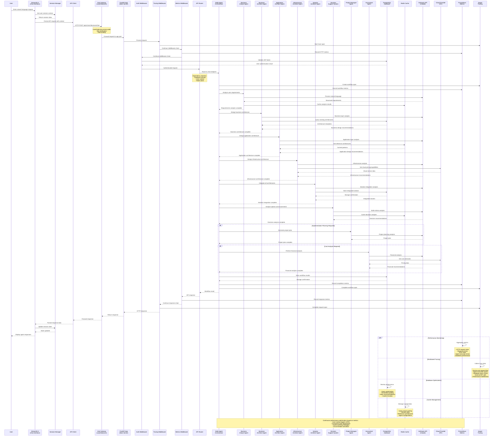

# Visual Architecture Tool - Request Call Flow Sequence Diagram

This sequence diagram depicts the comprehensive call flow from frontend user interaction to backend response in the Visual Architecture Tool system.

## Key Components and Their Interactions

### 1. **Frontend Layer**
- **Streamlit UI**: User interface with chat components
- **Session Manager**: Maintains user context and conversation history
- **API Client**: HTTP client with authentication and request formatting

### 2. **Infrastructure Layer**
- **Istio Gateway**: Service mesh with load balancing, SSL, and traffic management
- **FastAPI App**: Main application server with ASGI runtime
- **Middleware Stack**: Authentication, tracing, and metrics collection

### 3. **Agent Orchestration Layer**
- **Multi-Agent Orchestrator**: Coordinates workflow between specialized agents
- **Sequential Agent Processing**: Business → Application → Infrastructure → Solution → Decision
- **Conditional Routing**: Project Management and Financial Analysis based on request type

### 4. **AI Agent Layer**
- **Business Analyst**: Natural language processing and requirements analysis
- **Architecture Agents**: Specialized domain experts for different architecture layers
- **Decision Support**: Multi-criteria analysis and recommendation generation

### 5. **Data and Integration Layer**
- **PostgreSQL Database**: Persistent storage with connection pooling
- **Redis Cache**: Multi-level caching for performance optimization
- **External APIs**: Anthropic Claude API and cloud provider integrations

### 6. **Observability Layer**
- **Prometheus**: Metrics collection and aggregation
- **Jaeger**: Distributed tracing and performance analysis
- **Performance Optimization**: Real-time monitoring and auto-scaling

## Performance Characteristics

### **Timing Breakdown (Typical Request)**
- **Frontend Processing**: 10-20ms
- **Network/Load Balancer**: 5-10ms
- **Authentication/Middleware**: 15-25ms
- **Agent Orchestration**: 2-8 seconds (depending on complexity)
  - Business Analyst: 500-1000ms
  - Architecture Agents: 1-2 seconds each
  - Decision Support: 500-1500ms
- **Database Operations**: 10-50ms
- **Response Generation**: 20-50ms
- **Total Response Time**: 3-10 seconds

### **Scalability Features**
- **Horizontal Pod Autoscaling**: 2-10 replicas based on CPU/memory
- **Database Connection Pooling**: 20 connections + 30 overflow
- **Redis Caching**: 90%+ cache hit ratio target
- **Circuit Breakers**: Protect against external API failures
- **Load Balancing**: Even distribution across available pods

### **Monitoring and Alerting**
- **Response Time Alerts**: >2 seconds for 95th percentile
- **Error Rate Alerts**: >5% error rate
- **Resource Utilization**: CPU >80%, Memory >90%
- **Agent Performance**: Execution time and success rates
- **Database Performance**: Query latency and connection pool usage

This sequence diagram illustrates the sophisticated, multi-layered architecture designed for scalability, observability, and optimal performance in processing complex architectural requests through AI-powered agent workflows.