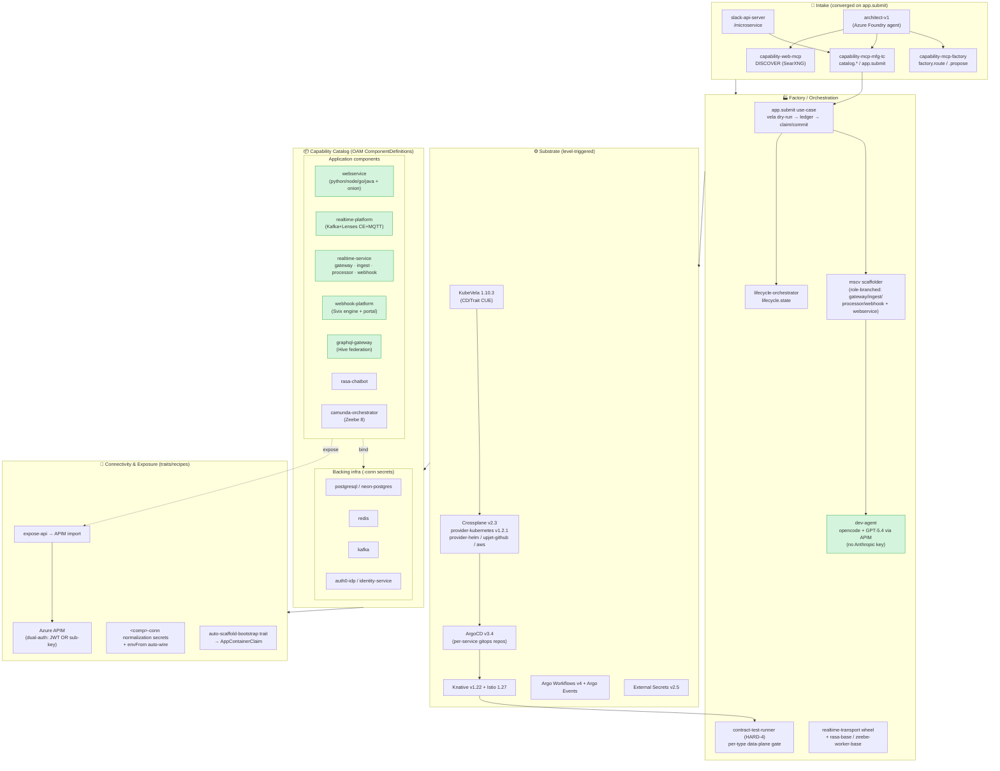

# Platform Capabilities — Internal Developer Platform (2026-06-13)

A GitOps, OAM-driven IDP on AKS. A consumer declares an **OAM Application**; the platform
scaffolds source + gitops repos, builds images, provisions backing infra via Crossplane, and
reconciles everything through ArgoCD onto Knative/Istio — with per-component data-plane
contract tests as the acceptance gate.

## End-to-end flow

## Proven end-to-end (green = data-plane verified this cycle)
- **webservice + db + cache + identity + expose-api** → APIM-authed python endpoint (E2E-FULL #148)
- **realtime** (ingest→Kafka→processor→gateway `/ws`) through APIM (RT-2 W5 #177)
- **webhook** telemetry → bridge → Svix → **HMAC-signed external delivery** (#180, today)
- **graphql federation** through Hive Gateway, JWT-enforced (GQL-1 #160)
- **dev-agent** writes runnable code via GPT-5.4/APIM, no Anthropic key (#179)

## Key invariants
- **Per-service gitops repos** = tenancy unit (can run in own vcluster/cluster); central repo = audit ledger
- **HARD-3**: no `:latest` in CD defaults; CI commits image digest back to gitops
- **HARD-4**: every component type has a post-deploy contract test gating Ready
- **Bindings**: `<comp>-conn` secrets + envFrom; `expose-api` → APIM; reuse→repurpose→create
- **Intake convergence**: Slack / MCP / architect all funnel through `app.submit`
