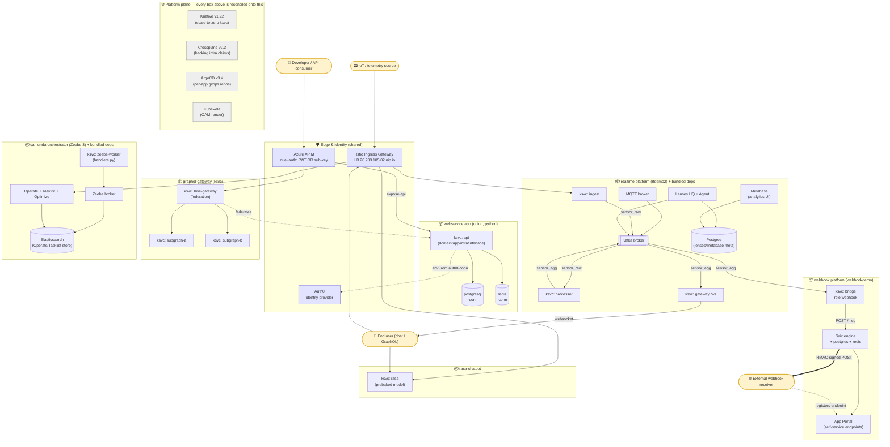

# Full-Capability Deployed Architecture (C4 Container view)

What the **runtime** looks like when one instance of every catalog capability is deployed at
once. This is the *workload plane* (the apps a consumer's OAM produces) sitting on the shared
*platform plane* (substrate). Contrast with `PLATFORM-CAPABILITIES.md`, which is the factory/meta view.



## Reading it
- **Boxes (`📦`) = one OAM Application each** — independently scaffolded (own source+gitops repos), independently scalable, can live in its own vcluster/cluster.
- **Solid arrows = live data flow**; **`==>` = the proven signed-webhook hop**; **dotted = config/discovery wiring** (`envFrom <comp>-conn`, endpoint self-registration, federation).
- **Cross-capability flow** (the interesting bit): realtime's `sensor_agg` topic fans out to **both** the websocket gateway *and* the webhook bridge → Svix → external receiver. GraphQL federates the webservice subgraph. Everything fronts through Istio/APIM with Auth0-minted JWTs.
- **Platform plane** is shared singleton infra — not per-app. Each `📦` is rendered by KubeVela → Crossplane provisions its backing infra → ArgoCD syncs → Knative runs it.

## Footprint when ALL deployed at once (why it needs scale)
| App | Pods (approx) |
|---|---|
| webservice + pg + redis | 3 |
| realtime platform (kafka/lenses/mqtt + 3 ksvc) | 8 |
| webhook platform (svix/pg/redis + bridge) | 5 |
| graphql gateway + 2 subgraphs | 3 |
| camunda (zeebe/operate/tasklist + worker) | 5 |
| rasa | 1–2 |
| **workload total** | **~25–26** |

Plus ~85 platform-plane pods already running → **~110–115 pods**, needing **~7–8 B2ms nodes**
(max-pods=30/node). **Current cap: uaenorth vCPU quota ≈ 5 nodes** → full simultaneous deploy is
quota-blocked today; deploy in waves or request a quota increase.
```
