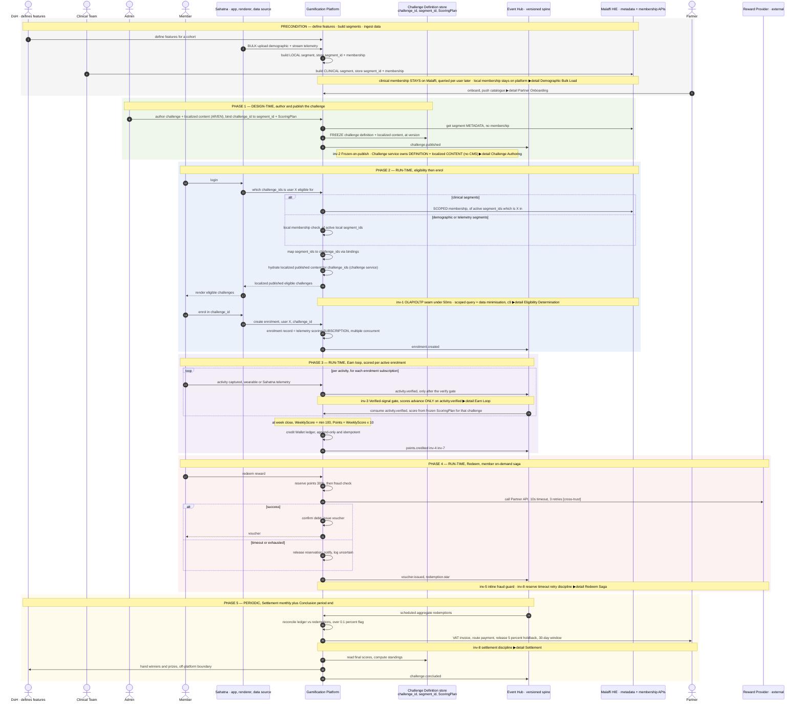
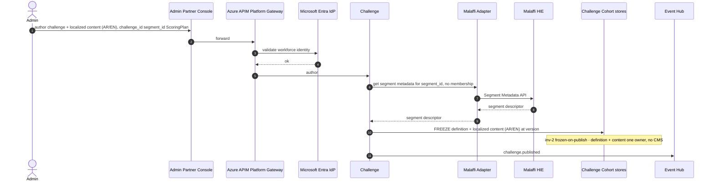
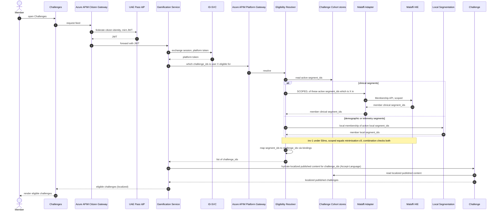
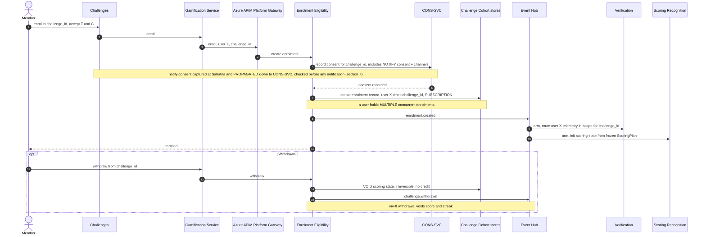
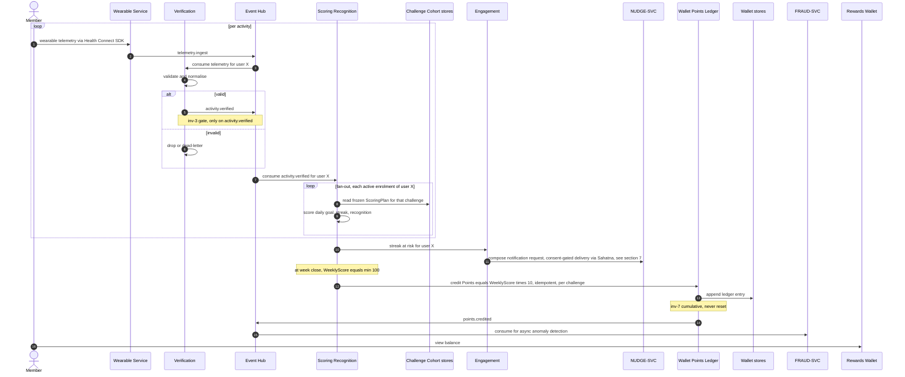
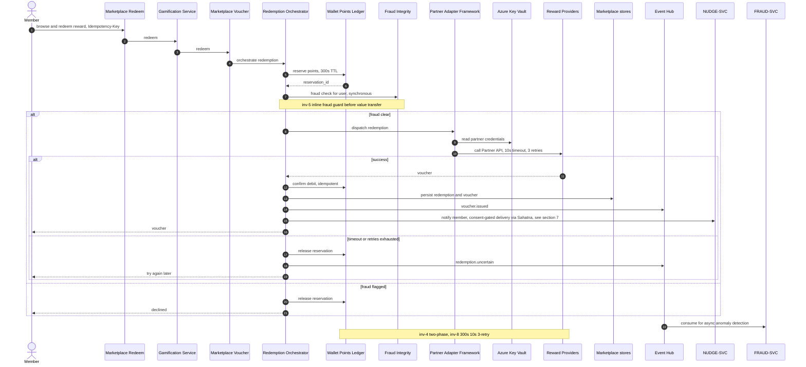
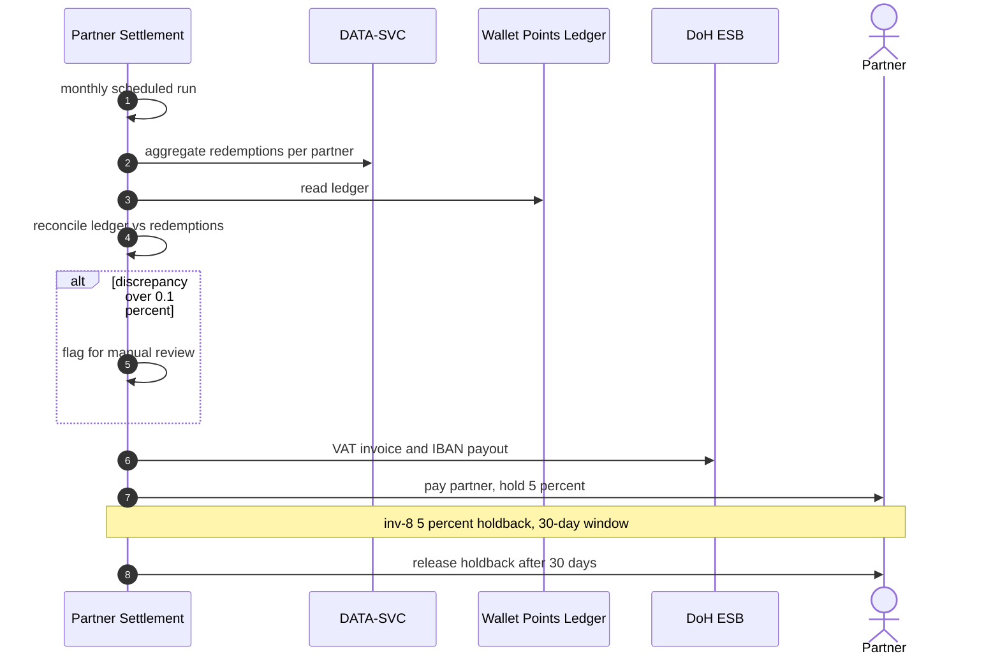
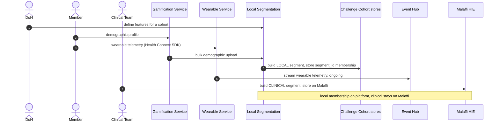
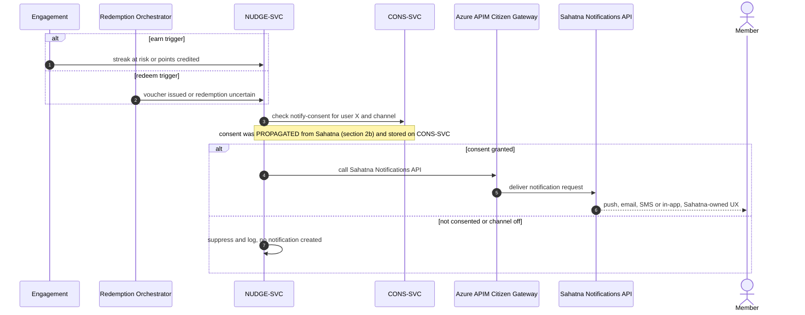

# Behaviour — Master Journey + Detailed Runtime Sequences

> One document: **Part A** is the end-to-end master journey (the lifecycle with phases); **Part B** is the
> per-band detailed runtime sequences it points to via `▶ detail`. Render any fenced block in
> https://mermaid.live (only the block).

---
# PART A — Master Journey (end-to-end lifecycle)

> The macro chain across all business processes — a **lifecycle with phases**, not one call stack.
> Sub-flows are joined by **frozen shared state** (the challenge definition) and **async events** (Event
> Hub), never by direct calls. Terminology per `18-eligibility-terminology-analysis.md`:
> DoH **defines features**; clinical **segments + membership live on Malaffi** (built by the Clinical
> Team), demographic/telemetry segments are **local**; a challenge's **definition AND localized
> content (AR/EN) are owned by the Challenge service** (no CMS); eligibility returns **challenge_ids**
> which the **Challenge service hydrates** to localized published content (**Sahatna is a thin renderer**);
> enrolment is a **telemetry scoring subscription**; the membership query is **scoped** to active segments.
> Render `master-journey.mmd` or paste the fenced block below into https://mermaid.live (only the block).

## How to read it
- **Coloured bands = phases** (precondition · design-time · eligibility+enrol · earn · redeem · periodic).
- **Arrows between phases are hand-offs, not calls:** writes to **`FA`** (challenge definition) = frozen
  state; messages to/from **`EH`** = async events. That decoupling is the event spine (inv-6).
- **Two Malaffi APIs:** *segment metadata* (authoring, no membership) and *scoped membership* (eligibility,
  "of active segment_ids which is X in" — data-minimising, c9).
- **`inv-N`** tags the load-bearing invariant each step carries; **`▶ detail`** names the runtime sequence.

## Hand-off ledger (the glue between processes)
| From | To | Hand-off | Type |
|---|---|---|---|
| DoH | Precondition | feature definitions | state |
| Clinical Team | Eligibility (clinical) | clinical segment_id + membership (on Malaffi) | external state |
| Sahatna (data) | Local segments | demographic (bulk) + telemetry (stream) | state + event |
| 1 Author | 2 Eligibility | frozen challenge definition + **localized content** (challenge_id↔segment_id↔ScoringPlan) + `challenge.published` | state + event |
| 2 Eligibility | Sahatna | localized published challenges (Challenge service hydrates; Sahatna renders) | state |
| 2 Enrol | 3 Earn | enrolment record = telemetry **subscription** + `enrolment.created` | state + event |
| 3 Earn | 4 Redeem | wallet balance + `points.credited` | state + event |
| 4 Redeem | 5 Settle | `redemption.*`, `voucher.issued` | event |
| 5 Conclude | DoH | final standings (off-platform) | boundary |

## Detailed sequences to draw next (each a `▶ detail` above)
1. **Challenge Authoring** (bind challenge_id↔segment_id + ScoringPlan, segment metadata, freeze) — inv-2
2. **Eligibility Determination** (scoped membership · map segments→challenges · Sahatna hydrates · enrol-subscribe) — inv-1
3. **Earn Loop** (capture → verify-gate → score per enrolment → credit) — inv-3/7
4. **Redeem Saga** (reserve → fraud → partner → confirm/release, timeouts) — inv-4/5/8
5. **Settlement** (aggregate → reconcile → holdback) — inv-8
6. **Demographic Bulk Load** + **Partner Onboarding** (preconditions)

## Coverage check (every business process appears once)
Define Features (DoH) ✓ · Cohort/Segment build — clinical (Malaffi) + local ✓ · Challenge Authoring ✓ ·
Publish (challenge service, localized) ✓ · Eligibility + Enrolment ✓ · Earning Loop ✓ · Rewards & Redemption ✓ · Conclusion ✓ ·
Partner Onboarding/Catalogue ✓ · Settlement ✓ · Offboarding ◑ (partner-track tail).

---
# PART B — Detailed Runtime Sequences

> Runtime expansions of the master-journey `▶ detail` bands. **Lifelines are ONLY C4 components**
> (from `solution-architecture.drawio`) **+ actors**. Two-way audited: every lifeline is a C4 component,
> and every business-runtime C4 component appears in ≥1 sequence (the 3 cross-cutting infra components —
> Secrets, GitOps, Observability — are deploy/monitor concerns and intentionally absent). Render a fenced
> block in https://mermaid.live (only the block). Terminology per `18-...`; invariants tagged `inv-N`.

## 1. Challenge Authoring  (inv-2 frozen-on-publish)

**Business Rules (BRD):**
- _Challenge Request Submission — Internal [BRD: Challenge Configuration › Challenge Request Submission]_
  - Challenge ideas may originate from both internal DoH teams and Sahatna users; a structured submission process must collect and review requests.  `(P1)`
  - DoH teams submit challenge proposals through an internal request form accessible to authorized DoH staff.  `(P1)`
  - The internal form captures the information required for challenge evaluation and configuration (fields defined separately).  `(P1)`
  - Submitted internal requests are reviewed by the Gamification program team before being approved for implementation.  `(P1)`
  - Approved requests are shared with ADHDS for configuration and go-live.  `(P1)`
- _Challenge Request Submission — User-Initiated [BRD: Challenge Configuration › Challenge Request Submission; Phase 1 Req 4]_
  - Sahatna users can suggest challenge ideas through the app via a link that opens a web-based challenge request form.  `(P1)`
  - The user-request form collects challenge suggestions; submitted requests are reviewed by the Sahatna program team for feasibility and alignment with program objectives.  `(P1)`
  - User-submitted requests are suggestions only and do not guarantee a challenge will be created.  `(P1)`
- _Review & Evaluation [BRD: Challenge Configuration › Review and Evaluation]_
  - All submitted requests undergo internal review for: alignment with program goals, feasibility of implementation, data and tracking requirements, target-audience suitability.  `(P1)`
- _Challenge Structure & Lifecycle [BRD: Challenge Configuration › Challenge Structure & Lifecycle]_
  - Configurable per challenge: challenge type (Individual / Team-based / District-based).  `(P1)`
  - Configurable per challenge: published date/time, start date/time, end date/time.  `(P1)`
  - Configurable per challenge: target audience (Age, Gender or Conditions e.g. Diabetes).  `(P1)`
  - Configurable per challenge: type of goals assigned to users.  `(P1)`
  - Configurable per challenge: challenge description (may include images and partner logos).  `(P1)`
  - Configurable per challenge: description of reward and redemption method — offline redemption messaging in details; or points/catalog access with points-accumulation messaging; or hybrid (offline grand prize + reward points for catalog).  `(P1)`
  - Configurable per challenge: winning criteria.  `(P1)`
  - Configurable per challenge: enabled push/email notification types (per Nudges section).  `(P1)`
  - For team-based challenges: maximum team size must be configurable.  `(Phase2/3)`
  - For team-based challenges: participation mode must be configurable (team-only vs individual-or-team).  `(Phase2/3)`
  - For district-based challenges: district affiliation method must be configurable (user-address-derived vs user-selected).  `(Phase2/3)`
  - For district-based challenges: manual district reassignment of users from back-end.  `(Phase2/3)`
  - Configuration may be managed via internal tools, scripts, or deployment workflows, but the system must not require code changes for each new challenge.  `(P1)`
- _Challenge Back-end Configuration [BRD: Phase 1 Req 14]_
  - DoH must be able to configure challenges on the back-end; no dedicated self-serve UI is required, but creating new challenges must be easy without new code from the technical team.  `(P1)`
- _Goal DEFINITION [BRD: Appendix › Goals]_
  - A goal is a measurable target a participant must achieve within a defined time window during a challenge.  `(P1)`
  - Every goal must specify: the metric being measured, the required threshold, the time frequency (daily / weekly / one-time), and the verified data source.  `(P1)`
  - Goals are assigned at enrollment and remain locked for the duration of the challenge.  `(P1)`
- _Supported Goal Types [BRD: Appendix › Goals › Supported Goal Types]_
  - The goal engine must allow new metric types to be added without redesigning the structure.  `(P1)`
  - Phase-1 goal types: Physical Activity – Steps (e.g. 8,000 steps/day, phone/wearables); Physical Activity – Exercise (10 mins/day); Sleep – Hours (7 hours/night); Mental Wellbeing (1 check-in/day, Daily Mood Rating 1–5; in-app survey/assessment); Nutrition Wellness (1 check-in/day, caloric intake; in-app survey); Screening (Complete IFHAS screening, Sahatna IFHAS module); Event Participation (Check-in at event, Sahatna events module).  `(P1)`
  - Phase-2 goal types: Sleep Score (75/100 daily, wearables); External Quest (Complete Citymoov quest, Citymoov API); Accessibility/POD (Custom logged activity, manual logging / defined logic).  `(Phase2/3)`
- _Goal Frequency [BRD: Appendix › Goals › Goal Frequency]_
  - Goals may be: daily recurring; weekly recurring; weekly cumulative (e.g. 4 times a week); one-time within challenge (e.g. complete screening once); time-bound event goals (valid only within the event window).  `(P1)`
  - Daily and weekly goals close at a defined cutoff time in the day/week.  `(P1)`
- _Goal Assignment Models [BRD: Appendix › Goals › Goal Assignment Models]_
  - Segment-Based Fixed Goal: a predefined threshold applied uniformly to a defined participant segment; threshold varies by profile attributes (Age, Gender, Accessibility classification, District, Whitelisted audience).  `(P1)`
  - Segment evaluation occurs at enrollment only.  `(P1)`
  - Baseline-Based Personalized Goal: the system may calculate a user-specific threshold from historical data for quantified wellness metrics in Sahatna.  `(Phase2/3)`
  - Baseline requirements: minimum historical data window; outlier filtering; defined uplift logic (e.g. +15% improvement).  `(Phase2/3)`
  - If insufficient data exists, a fallback segment-based threshold is assigned.  `(Phase2/3)`
  - Personalized thresholds are calculated once at enrollment and remain fixed.  `(Phase2/3)`
  - Accessibility (POD) goals may use different thresholds and rely on manual input instead of device data.  `(Phase2/3)`
- _Goal Locking [BRD: Appendix › Goals › Goal Locking]_
  - Once a user enrolls: goal thresholds are stored; users cannot edit or override goals; threshold logic does not recalculate mid-challenge; goal definitions cannot change for active participants.  `(P1)`
  - DoH-set goals cannot be edited by users for the challenge duration.  `(P1)`
- _Goal Visibility config / DoH goal-setting [BRD: Appendix › Goals › Goal Visibility; Phase 1 Req 2a/2b]_
  - DoH must be able to set specific target goals for wellness metrics.  `(P1)`
  - DoH must be able to set segment-based goals (based on age, gender, or conditions).  `(P1)`
  - If a goal is personalized, the UI must indicate it was calculated based on past activity without exposing calculation formulas.  `(Phase2/3)`
- _Phase 1 Goals (default thresholds) [BRD: Appendix › Goals › Phase 1 Goals]_
  - Physical Activity – Steps: 7,000, Daily, All the population.  `(P1)`
  - Mental Wellbeing Survey Check-in: 1, Daily, All the population.  `(P1)`
  - Sleep – Hours: ≥7 hours, Daily, All the population.  `(P1)`
  - Nutrition Survey Check-in: 1, Daily, All the population.  `(P1)`
- _Winning Criteria & Reward Mapping (config) [BRD: Challenge Configuration › Winning Criteria & Reward Mapping]_
  - The system must support flexible configuration of winning criteria and allow rewards mapped to those criteria; criteria can be applied individually or in combination across challenge formats; criteria must be extensible to add other types later.  `(P1)`
  - Supported criterion: Highest Challenge Score (primary ranking) — winners by highest challenge score over full duration (e.g. top 1, 2, 5; exact number configurable).  `(P1)`
  - Supported criterion: Most Balanced Days — winners by highest number of balanced days (achieves ALL goals) over full duration (top 1, 2, 5 configurable).  `(P1)`
  - Supported criterion: Wellness Pillars Champion — user completes a specific goal type the most number of days over full duration (top 1, 2, 5 configurable).  `(P1)`
  - Supported criterion: Consistent Engagement — winners by consecutive-day progress in at least 1 goal (minimum 1 progress bar to qualify; e.g. 30, 60, 90 days configurable).  `(P1)`
  - Supported criterion: Wellness Score Maintenance — winner determined on maintaining more than X challenge score (e.g. 80+) by challenge end; threshold configurable.  `(P1)`
  - Criteria can be applied per cohort (e.g. top 5 rankers per gender); possible cohorts: Age, Gender, PoD (when PoD flags supported in Malaffi), District (when district challenges live).  `(P1)`
  - Reward types possible: offline rewards (e.g. automobiles, electronics, goodie bags) and reward points (e.g. 10,000 points, 20,000 points).  `(P1)`
- _Eligibility & Audience Targeting (config) [BRD: Challenge Configuration › Eligibility & Audience Targeting; Phase 1 Req 3a/3b]_
  - The challenge engine must support configurable eligibility rules per challenge: Age range, Gender, Conditions, District (when district challenges live), Accessibility classification (when PoD flags supported in Malaffi), Whitelisted audience.  `(P1)`
  - Challenge visibility is based on user profile data matching the challenge eligibility criteria (e.g. a females-only challenge is visible/enrollable only to females).  `(P1)`
  - Multiple challenges can be created from the back-end targeting audiences with separate goal thresholds; Phase 1 targets by age, gender, or conditions.  `(P1)`
  - Challenges can be created for specific whitelisted audiences — only back-end-whitelisted users can see and participate.  `(P1)`
  - Profile changes during an active challenge must not retroactively alter eligibility.  `(P1)`
  - The system must support running multiple challenges concurrently, each with distinct eligibility criteria.  `(P1)`
  - A user can join multiple challenges and have respective goals set up for each.  `(P1)`
- _Goal Assignment Mode (config) [BRD: Challenge Configuration › Goal Assignment Mode]_
  - Each challenge must specify: which goal categories are included; the assignment strategy (segment-based / baseline-personalized); whether each goal contributes to the weekly score or only rewards points; whether accessibility-specific goals apply.  `(P1)`
- _Additional Goal Types config flags [BRD: Challenge Configuration › Additional Goal Types]_
  - Additional goal types (Quests, Events, Screenings) do not contribute to weekly scores but reward points; the system must support configurable flags for these per challenge.  `(P1)`
  - Citymoov Quest (if enabled): define max number of quests that reward points; points per successful completion; whether specific quest categories are eligible (if provided by Citymoov API).  `(Phase2/3)`
  - Event Participation (if enabled): define which Sahatna events are eligible; whether eligibility applies to sign-up, check-in, or both; how many points each event rewards for sign-up and check-in.  `(P1)`
  - Event eligibility must be defined at challenge creation and must not auto-include new events unless explicitly configured.  `(P1)`
  - If an event is canceled or removed later from Sahatna, its points contribution should be preserved.  `(P1)`
  - Screening / IFHAS (if enabled): define how many instances of the screening reward points and how many points per instance; only IFHAS screenings done during the specific challenge reward points.  `(P1)`
- _Communication Enablement (config) [BRD: Challenge Configuration › Communication Enablement]_
  - Per challenge, the system must support enabling/disabling push-notification support and email-notification support.  `(P1)`
  - Per challenge, the system must allow configuration of nudge types (defined in Nudges section).  `(P1)`
  - Nudges must respect individual user consent settings.  `(P1)`
- _Governance & Operational Controls [BRD: Challenge Configuration › Governance & Operational Controls]_
  - The system must support: early termination with score freeze; manual participant removal; manual participant district update; archival of completed challenges.  `(P1)`
  - All structural changes must be logged with timestamp and actor reference.  `(P1)`

## 2. Eligibility Determination  (inv-1 seam, scoped membership)

**Business Rules (BRD):**
- _Challenge Discovery [BRD: Enrollment › Challenge Discovery]_
  - Currently-enrolled and new challenges must be visible as a banner/featured section on the main Sahatna dashboard and within the Wellness module.  `(P1)`
  - Completed challenges must move to a historical section.  `(P1)`
  - Each challenge card must display: challenge type (Individual / Team / District), description, goals being tracked, duration, rewards description and redemption method, and enrollment status.  `(P1)`
  - Users must be able to view full details by tapping into a card before enrolling.  `(P1)`
- _Eligibility resolution (segment membership) [BRD: Eligibility & Audience Targeting; Phase 1 Req 3a]_
  - Only users within a defined target audience for a challenge can see that challenge; resolution is by profile attributes — age, gender, conditions, plus whitelist and accessibility classification.  `(P1)`
  - Users eligible for multiple challenges can participate in multiple challenges at the same time.  `(P1)`

## 2b. Enrolment and Subscription  (inv-8 withdrawal irreversible)

**Business Rules (BRD):**
- _General Enrollment Flow [BRD: Enrollment › General Enrollment Flow; Phase 1 Req 1]_
  - Enrollment is strictly opt-in; a user must be able to enroll into an active challenge and clearly understand its duration and participation criteria.  `(P1)`
  - Before confirming enrollment the user must: review duration and participation structure; view a summary of goals; review leaderboard visibility rules; provide consent for displaying their name OR only their initials; validate contact info and email address; connect their wellness data if not yet connected.  `(P1)`
  - Upon confirmation: the user is assigned to the challenge; eligibility and configuration parameters are snapshotted.  `(P1)`
  - A user may participate in multiple challenges at a time.  `(P1)`
- _Consent capture (privacy) [BRD: Non-functional Req 1; Phase 1 Req 11]_
  - User consent for participation in the competition and agreement with its conditions (e.g. sharing name on leaderboard) must be clearly recorded.  `(P1)`
  - Notification/nudge consent (push depends on user consent; email only for users with email address and email-consent) is captured at enrol/preferences and gates all notifications.  `(P1)`
- _Baseline-PERSONALIZED goal computation at enrol [BRD: Phase 2 Req 3/4; Goals › Baseline-Based Personalized Goals]_
  - Sahatna must be able to identify an individual's baseline for quantified wellness metrics (logic TBD; assumes enough user data).  `(Phase2/3)`
  - DoH must be able to set a personalized goal for users based on their baseline; if insufficient data for a baseline, a backup goal number is used based on user profile data (e.g. age, gender).  `(Phase2/3)`
  - DoH must be able to set a customized, separate type of goal for POD (may require manual logging; POD may be divided into categories with unified goals per accessibility-challenge type).  `(Phase2/3)`
  - Personalized thresholds are computed per-user once at enrolment and remain fixed.  `(Phase2/3)`
- _Team-Based Enrollment [BRD: Enrollment › Team-Based Enrollment; Phase 2 Req 6/7/8]_
  - DoH must be able to set up a challenge as team-based; a team-based challenge lets users participate as individuals or as teams (with a size cap).  `(Phase2/3)`
  - Create a Team: a user may create a new team, assign a team name, and become the team creator (owner).  `(Phase2/3)`
  - The team creator can invite other users via push/email (a unique link opens Sahatna at the challenge enrollment page with pre-populated team-joining details; the message also contains a unique code entered when enrolling and electing to join a team), can remove team members, and must adhere to the team size cap.  `(Phase2/3)`
  - A team becomes active as soon as it has at least 1 member (including the creator) actively enrolled in the challenge.  `(Phase2/3)`
  - Join an Existing Team: a user can join a team they were invited to by searching for a pending invite via a code; the system must prevent joining teams that have reached the maximum size.  `(Phase2/3)`
  - Participate Individually: if the challenge allows both modes, the user must explicitly select participation mode during enrollment.  `(Phase2/3)`
  - Once the challenge begins, switching between individual and team participation must not be allowed.  `(Phase2/3)`
  - Team enrollment constraint: a user cannot belong to more than one team within the same challenge.  `(Phase2/3)`
  - Leaving a team mid-challenge must follow defined score-handling rules (e.g. freeze prior contribution).  `(Phase2/3)`
  - The enrollment flow must clearly explain that team score is derived from all members' performance and that team performance impacts leaderboard ranking.  `(Phase2/3)`
- _District-Based Enrollment [BRD: Enrollment › District-Based Enrollment; Phase 3 Req 1]_
  - District-based challenge: users sign up to represent a district; only districts compete against each other; goals may be set separately per district.  `(Phase2/3)`
  - District Derived from Profile: if district location data exists in the user address book, the district must be displayed during enrollment, the user must confirm district representation, and may select another district if the derived one is incorrect.  `(Phase2/3)`
  - District Selection During Enrollment: if user selection is required, the system must display a list of eligible districts; the user must explicitly select one before confirming; selection must be confirmed and locked.  `(Phase2/3)`
  - District constraint: a user may represent only one district per challenge.  `(Phase2/3)`
  - Switching districts mid-challenge must not be allowed.  `(Phase2/3)`
  - If a user leaves the challenge, their district contribution must freeze.  `(Phase2/3)`
  - The enrollment screen must clearly communicate that districts compete against each other and that district ranking is based on aggregated participant performance.  `(Phase2/3)`
- _Disenrollment / Withdrawal [BRD: Enrollment › Disenrollment]_
  - Users must be able to leave a challenge: the user must confirm exit; must be removed from active ranking; historical participation must remain archived.  `(P1)`
  - Team challenges: a user leaving must update team composition; score handling must follow Scoring integrity rules.  `(Phase2/3)`
  - District challenges: leaving removes the user from district aggregation moving forward; historical score contribution handling must remain consistent.  `(Phase2/3)`
  - Upon leaving, the user must not be allowed to re-join a challenge they have left.  `(P1)`
- _Multi-challenge UX awareness [BRD: Enrollment › User Experience]_
  - Users must always understand whether they participate individually, as a team, or representing a district; that they may have multiple active challenges and navigate across them; that they may have multiple goals/scoring/leaderboards due to multiple challenges; and when a challenge has concluded and where to view final results and winners.  `(P1)`

## 3. Earn Loop  (inv-3 verify gate, inv-7 points, subscription fan-out)

**Business Rules (BRD):**
- _Goal success conditions / earning [BRD: Phase 1 Req 5; Goals]_
  - A user earns wellness score for completing daily targets during an active challenge; scoring is based on completion of defined thresholds for all Phase-1 wellness metrics.  `(P1)`
- _Scoring — definition [BRD: Appendix › Scoring]_
  - Wellness Score is calculated only within the context of an active challenge; calculated weekly and capped at a maximum of 100 per week; resets at the start of every new challenge; determines leaderboard ranking; determines challenge winners; used for individual, team, and district aggregation.  `(P1)`
  - There is one scoring logic that applies uniformly to all participants in that challenge.  `(P1)`
- _Weekly Score Structure (1–100) [BRD: Scoring › Weekly Score Structure]_
  - Each challenge week has a maximum possible score of 100; all scoring components within the week (goal completion + consistency bonuses) must collectively sum to 100.  `(P1)`
  - The distribution of score across goals is defined per challenge, but the total weekly maximum must always equal 100.  `(P1)`
  - No participant may exceed 100 in any given week.  `(P1)`
- _Individual Weekly Score Calculation [BRD: Scoring › Individual Weekly Score Calculation]_
  - Each goal contributes a predefined portion of the 100-score structure; score is awarded per configured scoring logic (e.g. threshold met); with multiple goals, weighted contributions determine the total.  `(P1)`
  - The weekly score equals the total earned from all eligible scoring components, up to a maximum of 100.  `(P1)`
  - If a participant does not meet any goals in a week, their weekly score is 0.  `(P1)`
  - Weekly scores become final once the week closes.  `(P1)`
- _Final Challenge Score Calculation [BRD: Scoring › Final Challenge Score Calculation]_
  - Final Wellness Score = average of all completed weekly scores (e.g. (82+95+76)/3 = 84.33); each week carries equal weight.  `(P1)`
  - Partial weeks are treated as a full week and the score is extrapolated so it is out of 100.  `(P1)`
  - On late enrollment, averaging begins from the enrollment week only.  `(P1)`
  - These rules must be consistent for all participants in that challenge.  `(P1)`
- _Consistency-Based Score Allocation (Streak bonus) [BRD: Scoring › Consistency-Based Score Allocation]_
  - Consistency bonuses are embedded within the 100-score weekly structure, with specific score allocation for meeting goals 4, 5 and 7 days out of a full week; the bonus forms part of the 100 total.  `(P1)`
  - The system must prevent total weekly score from exceeding 100; consistency scoring influences the weekly total but does not create additional uncapped score.  `(P1)`
- _Phase 1 Scoring (default point table) [BRD: Scoring › Phase 1 Scoring]_
  - Daily steps "Balanced Day" % of goal → score: 10–29% = 1; 30–49% = 2; 50–79% = 3; 80–99% = 4; ≥100% = 5.  `(P1)`
  - Mental Health check-in: no check-in = 0, completed = 1. Nutrition check-in: no check-in = 0, completed = 1.  `(P1)`
  - Sleep duration → score: <6h = 0; 6–7h = 1; ≥7h = 2. (steps ≥100% = 3, ≥7h sleep, mental + nutrition check-ins as listed).  `(P1)`
  - Consistent Engagement tiers: Bronze 4/7 = 5; Silver 6/7 = 11; Gold 7/7 = 16. Total weekly = 100.  `(P1)`
- _Team Score Calculation [BRD: Scoring › Team Score Calculation]_
  - Team Score = average of Wellness Scores of all team members; all registered members are included; updates dynamically as individual weekly averages update; teams ranked strictly by Team Score.  `(Phase2/3)`
  - If a member is added or removed, the average calculation from that point onward updates to reflect the change in member count.  `(Phase2/3)`
- _District Score Calculation [BRD: Scoring › District Score Calculation]_
  - District Score = average of Wellness Scores of all participating users in that district; each user is associated with only one district per challenge; district ranking based solely on district score; participants cannot change district mid-challenge.  `(Phase2/3)`
- _Real-Time Updates & Finalization [BRD: Scoring › Real-Time Updates & Finalization; Non-functional Req 2]_
  - During the challenge: weekly total score updates dynamically as goals are met; at week close the Wellness Score is updated with the week's contribution.  `(P1)`
  - At challenge end: final Wellness Scores are calculated; scores are locked and rankings finalized; tie-breaking logic is applied; no further updates permitted after finalization.  `(P1)`
  - Real-time refresh of individual score (and leaderboards) is required.  `(P1)`
- _Tie-Breaking Rules [BRD: Scoring › Tie-Breaking Rules]_
  - If two participants/teams/districts have identical Final Wellness Scores, tie-breaking rules must be followed; tie-breakers may include greater number of weeks above a defined threshold, or lower variance across weeks (greater consistency).  `(P1)`
  - Tie-breaking logic must be predefined and consistent across the challenge.  `(P1)`
- _Score Validation [BRD: Scoring › Score Validation]_
  - The scoring engine must: prevent duplicate score allocation within the same time window; handle late device synchronization within defined limits; log every score update with timestamp and source reference; ensure team/district membership changes do not retroactively alter finalized weekly scores; make every weekly score traceable to underlying goal-performance data for auditability.  `(P1)`
- _Streaks — definition [BRD: Appendix › Streaks]_
  - The Streak represents the number of days within a week a user meets their defined daily goal criteria; it resets at the beginning of every new week; streak performance contributes additional points toward the Weekly Score.  `(P1)`
  - A user should receive additional recognition for consistent participation across multiple days (track times goals met in a week; send weekly summary notifications).  `(P1)`
- _Daily Success Condition [BRD: Streaks › Daily Success Condition]_
  - A "successful day" is a day where the participant meets one of the configured daily goal criteria (meeting a minimum threshold of 1 type of goal for the day); the definition must be consistent across all participants; daily success is evaluated only after the day closes.  `(P1)`
- _Weekly Streak Counter [BRD: Streaks › Weekly Streak Counter]_
  - The system tracks the number of successful days; the counter increments by 1 per successful day; max capped at the number of days in the week (typically 7); resets to 0 at the start of each new week; no carryover across weeks.  `(P1)`
- _End-of-Week Evaluation [BRD: Streaks › End-of-Week Evaluation]_
  - At week closure: total successful days is finalized; the corresponding streak bonus is calculated; Weekly Score is finalized.  `(P1)`
- _Streak Edge Cases [BRD: Streaks › Edge Cases]_
  - Mid-week enrollment: streak tracking begins from enrollment day, showing previous days empty for that week.  `(P1)`
  - Late data submissions cannot retroactively increase the streak after weekly closure.  `(P1)`
- _Badge AWARD logic [BRD: Appendix › Badges; Phase 1 Req 15]_
  - Badges represent milestone achievements tied to wellness behaviors, participation, and performance outcomes; they persist across challenges; must be set up in the back-end so the technical team can easily add badges later.  `(P1)`
  - The system must support trigger-based awarding, tiered badges, in-progress tracking, and social sharing.  `(P1)`
  - Users earn badges for meeting pre-set criteria, based on existing data and wellness metrics only.  `(P1)`
  - Initial badge triggers (award conditions): Step Starter (meet daily step goal once); Step Master (step goal 4/5/7 days in a week, tiered); Marathon Week Champion (step goal all 7 days in a week); Milestone Achiever (accumulate 50k/100k/150k/200k steps, tiered); Exercise Starter (daily exercise minutes once); Exercise Master (exercise goal 4/5/7 days, tiered); Sleep Starter (sleep goal once); Sleep Master (sleep goal 4/5/7 days, tiered); Rest Champion (perfect sleep completion for 2 full weeks); Mindful Starter (first mental check-in); Mindful Master (1 check-in every week for 4 weeks); Nutrition Starter (first nutrition check-in); Nutrition Master (nutrition check-in 4/5/7 days, tiered); Healthy Habits Builder (all daily goals 7 days in a week); Consistency Champion (all daily goals every day of a month, tiered); Challenge Participant (enroll and complete a challenge); Challenge Finisher (complete all weeks in a challenge); Team Player (participate in a team-based challenge); District Ambassador (participate and compete a district-based challenge); Top 10 Finisher (rank Top 10 in a challenge); Challenge Champion (rank #1 in challenge); Team Champion (member of #1 ranked team); District Champion (member of #1 ranked district).  `(P1)`
- _Title / Level progression + AWARD [BRD: Appendix › Titles; Phase 2 Req 10]_
  - Titles represent long-term wellness progression across challenges; persistent, cumulative; only the highest unlocked title is displayed.  `(Phase2/3)`
  - A configurable level ladder (initially 7 levels): Wellness Starter, Explorer, Builder, Achiever, Champion, Elite, Legend.  `(Phase2/3)`
  - Level progression is based on cumulative lifetime totals: Total Completed Weeks across all challenges and Total Perfect Weeks across all challenges; the system tracks these counters independently and persistently.  `(Phase2/3)`
  - Completed Week (for progression): counted when the user is enrolled in an active challenge for that week AND receives a finalized Weekly Score (1–100); counted as long as the Weekly Score is not 0.  `(Phase2/3)`
  - A week is NOT counted as completed if the user disenrolls before the week is finalized, or the challenge is terminated before week finalization with no weekly record produced for that user.  `(Phase2/3)`
  - Perfect Week: a Completed Week where the user achieves a weekly streak outcome of 7 successful days out of 7; strictly based on streak success-day count, not Weekly Score.  `(Phase2/3)`
  - Proposed advancement thresholds: Starter = complete 1 challenge; Explorer = 4 Completed Weeks; Builder = 8 Completed Weeks; Achiever = 12 Completed Weeks + 2 Perfect Weeks; Champion = 20 Completed Weeks + 5 Perfect Weeks; Elite = 35 Completed Weeks + 10 Perfect Weeks; Legend = 50+ Completed Weeks + 20 Perfect Weeks.  `(Phase2/3)`
  - "Complete 1 challenge" = the user remained enrolled through challenge completion and has a finalized challenge outcome record; all thresholds must be configurable in the back-end without extensive coding.  `(Phase2/3)`
  - Title edge handling: a user joining mid-week and remaining enrolled through finalization counts that week as Completed; leaving mid-week does not count; once a week is finalized, Completed/Perfect Week counters must not change retroactively.  `(Phase2/3)`
- _Reward Points — Earning Logic [BRD: Reward Points › Earning Logic; Phase 1 Req 18]_
  - Reward Points are a persistent currency earned through participation; unlike Wellness Score they accumulate over time and can be redeemed in the marketplace; directly tied to weekly performance. These points differ from wellness score, do not reset on challenge conclusion, and earning is feature-flaggable per challenge.  `(P1)`
  - Weekly: Reward Points awarded automatically based on a finalized Weekly Score — Reward Points Earned = Finalized Weekly Score (0–100) × 10 (e.g. 100 → 1000; 50 → 500; total from a challenge = sum of all weekly scores). Applies across all challenges; credited only after the week is finalized.  `(P1)`
  - Winner Allocation: a challenge may allocate a certain amount of reward points to winners by winning criteria (e.g. highest challenge score = 10,000 points; highest balanced days = 50,000 points).  `(P1)`
  - Additional Avenues (bonus points, do not contribute to weekly scores): Screenings (e.g. IFHAS), Event Sign-up/Check-in, Citymoov Quests; configurable per challenge (e.g. complete IFHAS screening = 500 bonus points; check-in at FOH = 1000 points).  `(P1)`
- _Reward Points — Accumulation [BRD: Reward Points › Accumulation Rules]_
  - Reward Points accumulate across multiple weeks and challenges, do not reset at challenge end, and are independent of leaderboard ranking.  `(P1)`
  - Total Reward Point balance must equal: sum of all finalized Weekly Scores across challenges minus redeemed points.  `(P1)`
- _Reward Points — Earning Constraints [BRD: Reward Points › Earning Constraints]_
  - Since Reward Points mirror accumulated Weekly Score, users cannot earn more than 100 Reward Points per week per active challenge.  `(P1)`
- _Wallet Structure [BRD: Reward Points › Wallet Structure]_
  - Each user must have a persistent Reward Point wallet displaying current balance, total lifetime earned points, total redeemed points, and transaction history.  `(P1)`
  - Each weekly reward entry must record: week identifier, challenge identifier, points credited, timestamp.  `(P1)`
  - The wallet balance must update immediately upon weekly finalization.  `(P1)`
- _Integrity & Audit (earn) [BRD: Reward Points › Integrity & Audit]_
  - Reward Points are credited only once per finalized week; retroactive changes to Weekly Score after finalization do not alter Reward Points; all transactions are logged with traceability; manual back-end adjustments are traced and auditable.  `(P1)`
- _Additional score side-channels [BRD: Phase 1 Req 9/10; Phase 2 Req 2]_
  - A user can get additional score (points) for signing up for specific events on Sahatna; DoH can mark some events separately that reward gamification points on sign-up.  `(P1)`
  - A user can get additional score (points) for checking in at events they signed up for, using the existing Sahatna check-in module.  `(P1)`
  - Integrate with Citymoov AD app and reward extra points for users who complete quests on it (dependent on Citymoov developers and API agreement).  `(Phase2/3)`

## 4. Redeem Saga  (inv-4 two-phase, inv-5 inline fraud, inv-8 timeout)

**Business Rules (BRD):**
- _Reward Points — Redemption Logic [BRD: Reward Points › Redemption Logic; Phase 1 Req 20]_
  - Reward Points may be redeemed in the marketplace; redemption must deduct points immediately from the wallet, prevent redemption if balance is insufficient, generate a redemption record, and issue a reward artifact (coupon, code, digital voucher).  `(P1)`
  - A user can redeem rewards using their points; rewards could be coupons or codes redeemable digitally or at stores (feature-flagged for the Sep 2026 challenge).  `(P1)`
- _Marketplace Structure [BRD: Marketplace › Marketplace Structure; Phase 1 Req 19]_
  - The Marketplace is the in-app redemption platform to exchange accumulated Reward Points for available rewards; must support a browsable catalog, clear display of Reward Point cost per item, reward availability status, and a redemption-confirmation workflow.  `(P1)`
  - A user can view potential rewards within Sahatna; DoH can add digitally redeemable rewards from the back-end; adding/removing/editing options must be easy without additional development (feature-flagged).  `(P1)`
- _Reward Types Supported (incl. QR) [BRD: Marketplace › Reward Types Supported]_
  - Digital Voucher / Coupon Code: unique code, redeemable online or in-store, delivered instantly upon redemption, with availability caps.  `(P1)`
  - QR-Based Reward: generated QR code, scannable at a physical location.  `(P1)`
  - The system must allow reward items to be added adhering to the above types without additional development.  `(P1)`
- _Reward Catalog Configuration [BRD: Marketplace › Reward Catalog Configuration]_
  - Each reward must define: reward name, description, reward image, Reward Point cost, validity period, redemption limit per user, total inventory limit (if applicable), expiry rules (post-redemption validity).  `(P1)`
- _Inventory Management [BRD: Marketplace › Inventory Management]_
  - The Marketplace must support limited-inventory rewards (e.g. 500 available), unlimited-inventory rewards, and real-time inventory decrement on redemption.  `(P1)`
  - If inventory reaches zero: the reward must show "Out of Stock" and redemption must be disabled.  `(P1)`
- _Redemption Flow [BRD: Marketplace › Redemption Flow]_
  - Redemption must follow a multi-step confirmation: user selects reward → system displays reward information → user confirms redemption → points deducted immediately → reward generated and stored.  `(P1)`
- _Post-Redemption Behavior [BRD: Marketplace › Post-Redemption Behavior]_
  - After successful redemption: user receives a confirmation screen; reward information (code / QR / confirmation number) is displayed; reward is stored in a "My Rewards" section; user can revisit reward details anytime until expiry.  `(P1)`
- _Redemption Constraints [BRD: Marketplace › Redemption Constraints]_
  - The system must support maximum redemptions per user per reward and maximum redemptions per user per time period; these constraints must be configurable per reward.  `(P1)`
- _Reward Expiry Handling [BRD: Marketplace › Reward Expiry Handling]_
  - If rewards have post-redemption validity: the expiry date must be clearly shown; expired rewards must be visually marked; expired rewards must not be usable.  `(P1)`

## 5. Settlement  (inv-8 settlement discipline)

**Business Rules (BRD):**
- _Challenge Conclusion [BRD: Enrollment › Challenge Conclusion]_
  - If a user remains enrolled until scheduled conclusion, the challenge transitions to a Completed state, with an indication that challenge data is being reviewed and winners will be announced shortly.  `(P1)`
  - After winners are confirmed, the challenge details page is updated with conclusion information: overall challenge statistics, summary of participation outcomes, next-steps/upcoming-challenges teaser, and (optional) the list of winners with names and associated rewards.  `(P1)`
  - Participants receive a challenge-completion notification whose content varies on whether the user won; tapping it opens the conclusion announcement and winners list.  `(P1)`
- _Final Challenge Score [BRD: Scoring › Final Challenge Score / Real-Time Finalization]_
  - At challenge end, Final Wellness Scores are calculated, scores locked, rankings finalized, and tie-breaking applied; users must be able to see if they won and their overall score (notified either way; challenge details page can show winners info).  `(P1)`
- _Winner Allocation + review/approval loop [BRD: Enrollment › Challenge Conclusion; Phase 1 Req 12/13]_
  - Following completion, the DoH team reviews the challenge reporting dashboard to retrieve the list of winners based on the configured winning criteria.  `(P1)`
  - DoH has an option to "confirm" the winners list on the dashboard.  `(P1)`
  - If the list is not approved and needs tweaks, DoH shares required updates with ADHDS and the winner list is adjusted prior to confirmation.  `(P1)`
- _Reward Distribution [BRD: Enrollment › Challenge Conclusion › Reward Distribution]_
  - Winners receive communication regarding reward collection via push and email; the challenge details page is updated with winner information.  `(P1)`
  - If the redemption method is an offline reward: the DoH gamification team retrieves the user's email/phone from the reporting dashboard and contacts the user with redemption instructions; conclusion info notes winners will be contacted by DoH.  `(P1)`
  - If the redemption method involves points: reward points are credited weekly based on user performance; any reward points allocated to a winning criterion are added to the wallet of winners.  `(P1)`
> _Partner-financial settlement (monthly reconcile · 5% holdback / 30-day window · VAT invoice + IBAN payout) was **removed**: not in the BRD (`settlement`/`holdback` = 0 hits). The §5 mermaid still depicts it pending the deferred sequence-update pass._

## 6. Preconditions  (define features, build segments, ingest data)

**Business Rules (BRD):**
- _Define features (DoH) / configurability [BRD: Scope Summary; Phase 1 Req 14]_
  - Sahatna is the user-facing platform for participation, wellness tracking, scoring, and progress visualization; back-end challenges must be easily configurable since DoH will introduce future challenges with varying characteristics.  `(P1)`
- _Build segments (local + external) [BRD: Goals › Goal Assignment Models; Eligibility & Audience Targeting]_
  - Segments are defined by profile attributes: age, gender, conditions, accessibility classification, district, and whitelisted audience; segment evaluation occurs at enrollment only.  `(P1)`
- _Data ingestion — demographic bulk + telemetry stream [BRD: Context; Goals › Supported Goal Types]_
  - Users connect external wellness data sources (e.g. Apple Health / Google Health) to Sahatna; the system should proactively prompt connection (today discovery relies on user initiative, limiting data completeness).  `(P1)`
  - Verified data sources for Phase-1 metrics: phone/wearables integration (steps, exercise, sleep) and in-app survey/assessment logging (mental wellbeing, nutrition), plus Sahatna IFHAS and events modules.  `(P1)`
- _Baseline-data collection [BRD: Phase 2 Req 3]_
  - Sahatna must collect/identify an individual's baseline for quantified wellness metrics over a minimum historical data window (assumes sufficient accumulated user data; logic TBD).  `(Phase2/3)`

## 7. Notification  (consent-gated · Sahatna owns delivery)
> Sahatna owns the end-user experience and exposes a **Notifications API** (via APIM). The platform never
> delivers to the citizen itself — `NUDGE-SVC` only *composes* a request and calls Sahatna, and only after
> checking the **notify-consent that was propagated down from Sahatna** (captured at enrol/preferences,
> §2b). Referenced by §3 (streak/points) and §4 (voucher).

**Business Rules (BRD):**
- _Communication / Nudges delivery (consent-gated) [BRD: Phase 1 Req 11; Communication Enablement; Appendix › Nudges]_
  - Users receive reminders and nudges related to challenge participation and progress; push notification depends on user consent and addresses the user by name; email is sent only to users with an email address and consent to receive emails.  `(P1)`
  - Nudges must respect individual user consent settings; per challenge, push and email support can be enabled/disabled and nudge types configured.  `(P1)`
- _Nudge catalog (type · target · frequency · timing) [BRD: Appendix › Nudges (TBD)]_
  - Challenge initiation (Push/Email): announcement of challenge → all TAMM users, once, at challenge beginning, links to challenge registration page.  `(P1)`
  - End-of-challenge (Push/Email): → all challenge participants, once, at challenge end, links to conclusion page ("Final results are being reviewed…").  `(P1)`
  - Announcement of winners (Push/Email): → all challenge participants, once, at challenge end, links to winners page.  `(P1)`
  - Plan for the week (Push): → all participants, weekly, at beginning of the week, links to personal goals tracking page.  `(P1)`
  - Reminder to complete targets (Push): → all participants with any missing goal any day, weekly, 3 days into the week, links to goals tracking page.  `(P1)`
  - Reminder to uphold performance (Push): → all participants meeting all goals all days, weekly, 3 days into the week, links to goals tracking page.  `(P1)`
  - Review weekly progress (Push): → all participants, weekly, at end of week, links to week conclusion page.  `(P1)`
  - Challenge reminder (Push/Email): reminder of challenge and rewards → all TAMM users, once, middle of challenge, links to challenge registration page.  `(P1)`

## 8. Track & Engage (Competition View)  (NEW bucket — sequence TBD)
> The run-time member view/consume surface — score visibility, leaderboards, badge/title display, streak builder UX, reward-points balance view, and contribution transparency. Calculation & award live in §3 Earn; this bucket is purely the DISPLAY/viewing of those outcomes plus marketplace browse UX.
> Sequence to be drawn later (read path: member → gateway → leaderboard/recognition services → stores).

**Business Rules (BRD):**
- _Score Visibility & UX [BRD: Scoring › Score Visibility & User Experience; Phase 1 Req 7]_
  - A user must be able to view their wellness score, daily goals progress, and weekly streak progress.  `(P1)`
  - The scoring experience must clearly communicate two distinct values: Weekly Score (current week's performance) and Wellness Score (overall challenge performance = average of completed weeks); the UI must convey they are related but different.  `(P1)`
  - Weekly Score Display must show current Weekly Score (e.g. 72/100), a clear visual progress indicator toward 100, and time remaining in the week; it updates dynamically as goals are achieved.  `(P1)`
  - Contribution Transparency: for multi-goal challenges, users should see how each goal contributes to their Weekly Score and which components are completed vs pending.  `(P1)`
  - Week Closure & Finality: when a week ends the Weekly Score resets and the Wellness Score recalculates to reflect the updated average; users should ideally see a UI indication that their completed weekly score contributed to the Overall Wellness Score; when the challenge ends, the final Wellness Score must be presented prominently and feel definitive.  `(P1)`
  - Goal Visibility: users must clearly see the target threshold, the time window, and their real-time progress toward each goal; each goal in a multi-metric challenge is displayed independently with a clear met/not-met indication per period.  `(P1)`
- _Leaderboard — Core Ranking & Privacy [BRD: Leaderboard › Core Ranking Logic; Phase 1 Req 8; Non-functional Req 2]_
  - The leaderboard presents comparative performance within an active challenge, ranked by Final Wellness Score, reflecting the participation structure (Individual / Team / Hybrid / District).  `(P1)`
  - All leaderboard positions are determined using the Wellness Score; during an active challenge rankings update weekly as Wellness Scores update; at completion positions become final and tie-breaking rules apply.  `(P1)`
  - A user must be able to see their relative position among other participants in the same challenge; individual leaderboards are limited to defined cohorts and presented in a privacy-safe manner.  `(P1)`
  - Real-time refresh of leaderboards is required.  `(P1)`
- _Individual Leaderboard [BRD: Leaderboard › Individual Leaderboard]_
  - Applicable when challenge type is Individual-only; must display rank, participant name or initials, Wellness Score, a highlighted row for the current user, and top-3 individuals separately indicated.  `(P1)`
- _Team-Based Leaderboard [BRD: Leaderboard › Team-Based Leaderboard]_
  - Applicable when Team-only; must display rank, team name, Team Score (average of member Wellness Scores), number of team members, and top-3 teams separately indicated; tapping a team shows members (creator and members) and each member's Wellness Score.  `(Phase2/3)`
- _Hybrid Leaderboard (Individuals + Teams) [BRD: Leaderboard › Hybrid Leaderboard; Phase 2 Req 9]_
  - Single unified leaderboard displaying rank, entity name (individual or team), Wellness Score, and a clear label of whether the row is an Individual or a Team; ranking treats individuals and teams equally by their respective Wellness Score; users in a team must not also appear separately as individuals.  `(Phase2/3)`
  - Hybrid UX: each team row must have a visible "Team" label/badge and may use a visual distinction (icon/group symbol); individual rows must not show the team badge; the current user's row must always be highlighted regardless of mode.  `(Phase2/3)`
- _District-Based Leaderboard [BRD: Leaderboard › District-Based Leaderboard; Phase 3 Req 2/3]_
  - Two-level structure. District ranking: ranks districts only; each row displays rank, district name, District Score (average of participant Wellness Scores), number of active participants, top-3 districts separately indicated; individuals are not shown at the top level.  `(Phase2/3)`
  - District Detail View: selecting a district shows a ranked participant list within that district (rank within district, participant name, Wellness Score); does not mix participants across districts; users must understand the outer leaderboard compares districts while the inner view lists individuals only within that district.  `(Phase2/3)`
  - DoH must be able to see a heatmap of districts by wellness score and number of contributors (circle size = number of participants; color = wellness score).  `(Phase2/3)`
- _Badge UX / Screen [BRD: Badges › Badge User Experience; Phase 1 Req 16/17]_
  - Dedicated Badge Screen: users can view earned badges, view locked badges, see progress toward the next tier, and filter by category.  `(P1)`
  - A user can see earned badges and what they can potentially earn on a dedicated screen, with progress shown on unattained badges.  `(P1)`
  - Moment of Achievement: when a badge is earned, trigger a celebratory visual, show badge icon and description, and explain why it was awarded.  `(P1)`
  - Visual Hierarchy: higher-tier and performance badges should be visually distinct, feel more prestigious, and be clearly differentiated from entry-level achievements.  `(P1)`
  - A user can share an earned badge with other users (pre-populated text; trigger the native phone share function).  `(P1)`
- _Title / Level DISPLAY rules [BRD: Titles › Display Rules; Phase 2 Req 11]_
  - The user's active title must appear below their display name wherever the name appears in competitive contexts (leaderboard, district participant list) and in the user profile.  `(Phase2/3)`
  - Only one title is displayed at a time (the highest level achieved); users cannot manually select or downgrade titles; users should be able to get more information on available titles and how to achieve them.  `(Phase2/3)`
  - A user can check other users' profiles on the leaderboard and view their earned badges, title, and current score in the active challenge.  `(Phase2/3)`
- _Streak Builder UX [BRD: Streaks › Streak Builder User Experience; Phase 1 Req 7]_
  - The streak builder should feel like a weekly momentum builder, not a pressure mechanic; users immediately see how many days completed successfully, how many remain in the week, and what tier they are progressing toward.  `(P1)`
  - At the start of a new week the streak tracker resets visually and the user is clearly shown a new weekly streak cycle has begun.  `(P1)`
  - The UI must clearly differentiate Weekly Score (numeric total out of 100) from Streak Progress (number of successful days that contribute to the weekly score); the streak is a contributor to Weekly Score, not a separate permanent metric.  `(P1)`
  - Show the user a 'streak builder' component on the UI that tracks progress for the week.  `(P1)`
- _Reward Points Experience (balance view) [BRD: Reward Points › Reward Points Experience]_
  - Users must clearly understand "your weekly performance becomes reward points" for point-rewarding challenges, whether a challenge is configured to reward additional points to winners, the Weekly-Score-to-Reward-Points relationship, and their current wallet balance.  `(P1)`
  - Reward Point balance must be visible in the Gamification screens within the Wellness Module and in the Rewards Marketplace.  `(P1)`
- _Marketplace UX (value exchange / transparency) [BRD: Marketplace › Marketplace User Experience]_
  - Clear Value Exchange: users must clearly understand their balance (e.g. "You have 1,250 points.") and item cost (e.g. "This reward costs 800 points."); the exchange must feel simple and direct.  `(P1)`
  - Visual Motivation: the Marketplace should highlight popular rewards and show "Points needed" for locked rewards to create forward motivation.  `(P1)`
  - Reward Transparency: before redemption show reward details and validity clearly and avoid hidden conditions; after redemption give immediate access and a clear confirmation message; for inventory-limited rewards show remaining quantity and countdown/expiry timers if applicable.  `(P1)`

## Two-way audit (kept in sync with the C4 model)
- **Forward** — every lifeline above is a C4 component or an actor (Member, Admin, DoH, Partner, Clinical Team).
- **Reverse** — every C4 component with a runtime role appears in ≥1 sequence. The only C4 components not
  present are the cross-cutting **Secrets Management / Declarative Provisioning (GitOps) / Observability** —
  deploy-time + monitoring concerns, intentionally outside the business-runtime sequences.
- **Note** — `Fraud Integrity` (inline synchronous guard, redeem) and `FRAUD-SVC` (async anomaly detection,
  consumes events) are distinct, not a duplicate.
- **Notifications (§7)** — Sahatna owns the end-user experience and exposes a **Notifications API** (via
  APIM). `NUDGE-SVC` has no channels of its own: it composes a request, checks **notify-consent that
  propagated down from Sahatna** (§2b) on `CONS-SVC`, and only then calls the Sahatna Notifications API.
  Consent flows Sahatna → platform; delivery flows platform → Sahatna → citizen.

## BRD rule coverage (completeness check)
Every rule-bearing BRD section (Requirements: Phase 1/2/3 Scope, Non-functional, Open Questions;
Executive Summary/Scope; Stakeholders; Performance Metrics; and the full Appendix — Goals, Scoring,
Challenge Configuration, Enrollment/Conclusion/Disenrollment, Streaks, Leaderboard, Badges, Titles,
Nudges, Reward Points, Marketplace) has been compiled into the per-bucket Business-Rules lists above.

**Total rules extracted: 248** (each distinct requirement/constraint/condition = one bullet; each appears exactly once).
_(was 250 — 2 partner-financial settlement rules removed as not-in-BRD per scope decision.)_

| Bucket | Rule count |
|---|---|
| §1 Challenge Authoring (P1) | 74 |
| §2 Eligibility Determination (P2) | 6 |
| §2b Enrolment (P2) | 32 |
| §3 Earn Loop (P3) | 63 |
| §4 Redeem Saga (P4) | 14 |
| §5 Settlement & Conclusion (P5) | 10 |
| §6 Preconditions (P0) | 5 |
| §7 Notification (cross-cutting) | 10 |
| §8 Track & Engage (Competition View) — NEW | 34 |
| **Total** | **248** |

Notes on tagging:
- `(P1)` = Phase-1 / individual-only scope. `(Phase2/3)` = Team-, District-, baseline-personalized-,
  Citymoov-quest-, Title-, and Sleep-Score-related rules (per BRD Phase 2/3 Scope and Appendix phase columns).

### Scope decisions (resolved)
Every BRD rule is placed in a best-fit bucket. The three items that needed a scope (not bucket) call are now resolved:
- **Partner-financial settlement / holdback / VAT-IBAN payout (§5, 2 rules)** — **REMOVED** (not in this BRD;
  `settlement`/`holdback` = 0 hits). The §5 mermaid still shows it; it will be reconciled in the deferred sequence-update pass.
- **Clinical / Malaffi "conditions" (§2)** — **DUAL-SOURCE (both).** "Conditions" resolves from **both** a local
  profile attribute **and** a scoped Malaffi clinical-membership query; the §2 clinical/Malaffi branch stays.
  No rule added or removed (the profile-attribute rules already cover the local source; the mermaid covers the Malaffi source).
- **Phase tagging** — **ACCEPTED as-is** (`(P1)` individual-only vs `(Phase2/3)` Team/District/baseline/Title/Sleep-Score).
- **Phase-1 Milestones, Stakeholders, Open Questions, Dashboard widgets** — programme/governance and
  TBD-metric content, not runtime business rules; the *rule-bearing* fragments they imply (configurability,
  dashboard metric segmentation by district/demographics, winners-list review) are already captured under
  §1 / §5 / §8. No standalone rule was dropped.
