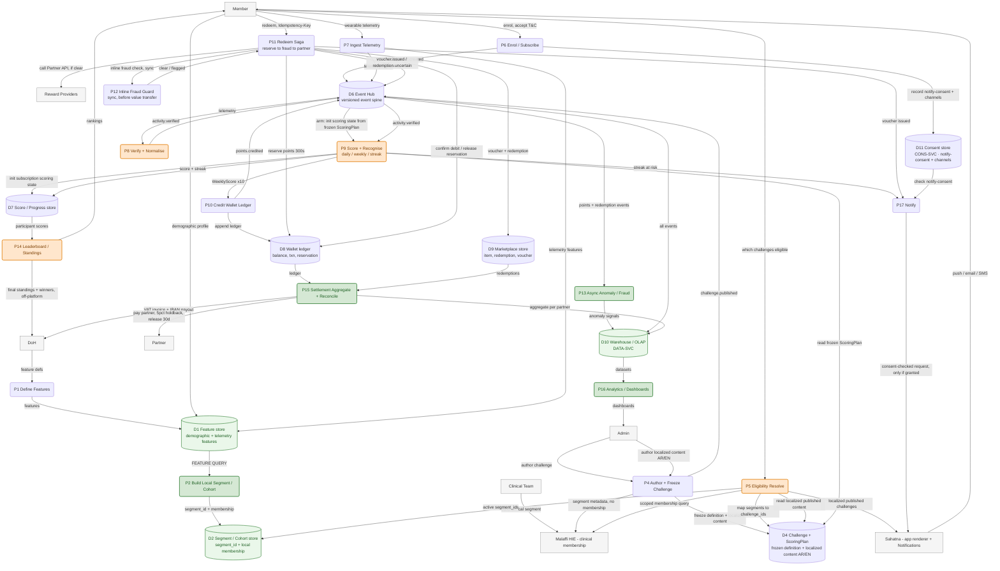

# Data Flow Diagram — Wellness Platform (with Data-Analyst hotspots)

> Built from `solution-architecture-elk.drawio` (components/stores) + `19-behaviour-detailed-sequences.md`
> (flows). DFD notation: **rounded = process**, **cylinder = data store**, **plain rect = external
> entity**, **arrow = data flow (labelled with the data)**. Render the fenced block in https://mermaid.live.
>
> **Colour key — where a Data Analyst is needed**
> - 🟢 **GREEN = definite** — the work *is* an analytical/feature query or aggregation; a data analyst owns the logic.
> - 🟠 **ORANGE = optional** — currently a microservice, but the computation is set-based and **could be pushed
>   to the database / stream-SQL (Lenses) / a materialised view** — an analyst could own it instead.
> - ⚪ Uncoloured = transactional / orchestration / I-O; no analyst needed.



## Data-Analyst hotspots

### 🟢 Definite (analyst owns the logic)
| # | Process / Store | Why it is analytical | Data involved |
|---|---|---|---|
| **P2** | **Build Local Segment / Cohort** | The canonical case: a **feature query** (`WHERE` over demographic + telemetry features) materialises `segment_id` + membership. Segment definition = SQL/feature logic. | D1 Feature store → D2 Segment store |
| **P13** | Async Anomaly / Fraud | Velocity / duplicate / outlier detection over the event stream — statistical, threshold-tuned (analyst/▸data scientist). | D6 events → D10 |
| **P15** | Settlement aggregate + reconcile | `SUM` redemptions per partner, reconcile vs ledger, **>0.1% variance flag** — pure aggregation/reconciliation query. | D8 + D9 → D10 |
| **P16** | Analytics / Dashboards (DATA-SVC) | Warehouse/OLAP models, KPIs, sponsor reporting. | D10 |
| D1 / D2 / D10 | Feature store · Segment store · Warehouse | Analyst-owned data assets (feature engineering, segment SQL, OLAP models). | — |

### 🟠 Optional (could move from microservice to DB / stream-SQL / materialised view)
| # | Process | Today | Analyst alternative |
|---|---|---|---|
| **P9** | **Score + Recognise** (earn loop) | Scoring/streak logic in the microservice | **Push to stream-SQL (Lenses) or DB window functions** — daily/weekly aggregation + streak run as set-based queries; inv-3 verify-gate stays upstream. *Your example.* |
| **P8** | Verify + Normalise | Microservice validation | Stream-SQL normalise/validate on the telemetry topic. |
| **P5** | Eligibility Resolve | Service maps segments→challenge_ids per request (inv-1 <50ms) | **Materialised view** `member × eligible_challenge_id`, analyst-maintained, refreshed on segment/binding change — keeps the seam fast. |
| **P14** | Leaderboard / Standings | Service ranks participants | Ranking is a **window query** (`RANK() OVER`) — natural DB/OLAP job, materialised per challenge. |
| (P10) | Wallet lifetime/balance stats | Ledger fold in service | Lifetime/earned aggregates as a materialised rollup (light). |

## Notes
- Flow labels are the *data*, not calls; events via **D6 Event Hub** are async (the spine, inv-6).
- Clinical membership stays **external on Malaffi** (P5 scoped query) — not an analyst asset here.
- The 🟢 chain D1→P2→D2 is the "cohort creation = query involving features" you called out; the 🟠
  P8/P9 chain is the "scoring could be done in the database" you called out — both highlighted in place.
```
