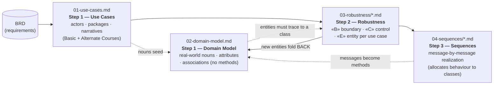

# ICONIX Index & Milestone Reconciliation — Wellness Gamification

> **Process**: ICONIX (Doug Rosenberg) — a minimal, **use-case-driven** and **milestone-driven** path
> from requirements to design with **full forward/backward traceability** at every transition.
> **Source BRD**: `factory/docs/analysis/wellness-archimate/wellness-brd-clean.md`.
> **Scope discipline**: 🟢 **P1** = Phase-1 **individual-based challenges only** (build scope).
> 🟡 **P2** (Teams, baseline-personalized goals, Citymoov, Titles, profile view) and 🔵 **P3** (Districts)
> are modelled for traceability and **tagged**, but are **out of the Phase-1 build**.

---

## 1. The ICONIX Pipeline — how the four artifacts relate

ICONIX is a small, tightly-coupled set of artifacts. Each step refines the previous one and must
trace **forward** (nothing invented downstream lacks an upstream anchor) and **backward**
(nothing discovered downstream is dropped — it is folded back upstream).

**The four artifacts and their contract:**

| Artifact | ICONIX step | What it adds | Traceability rule it enforces |
|---|---|---|---|
| `01-use-cases.md` | Step 1 (behaviour) | Actors, 10 packages, 59 use-case narratives with Basic + Alternate Courses (the rule-bearing branches). | Every UC has an ID (`UC-x.y`) and cites the BRD requirement it realizes. |
| `02-domain-model.md` | Step 1 (structure) | Analysis-level classes: nouns, attributes, associations, multiplicities. **No methods/controllers/UI.** | Every domain noun the use cases mention has a class. |
| `03-robustness/*.md` | Step 2 | The **disambiguation** step. Each UC → a robustness diagram classifying objects as **«B» boundary** (UI/API the actor touches), **«C» control** (verbs/logic), **«E» entity** (must trace to a domain class). Rosenberg's rules: actors↔boundary only; boundary↔entity never direct — only via control. | Nouns→entity (trace to `02`), verbs→control. **New entities discovered here are folded back into `02`** (this deliverable does that). |
| `04-sequences/*.md` | Step 3 | One sequence diagram per UC, allocating each behaviour to a specific class as a message — turning controllers into the methods of entity/boundary classes. | Every controller from `03` and every entity from `02` reappears as a participant; messages = future methods. |

**Milestone-driven view** (BRD Phase-1 milestones, from `01-use-cases.md` §5):
M1 = Packages A+B+C (author → eligibility → enrol) · M2 = D+E+F (earn → leaderboard → engage) ·
M3 = G (redeem) · M4 = D7+J (badges + reporting). The use-case set is partitioned along these
milestones so each is independently demonstrable.

---

## 2. Packages

Ten packages span the competition/gamification spine. Each has a robustness file (`03-`) and a
sequence file (`04-`) of the same name.

| Package (folder name) | Scope | Use cases | Role |
|---|---|---|---|
| **challenge-authoring** | 🟢 P1 | UC-A1…A9 | Submit/review/configure/publish/govern/archive challenges |
| **eligibility** | 🟢 P1 | UC-B1…B3 | Profile↔rule match, whitelist, enrolment snapshot |
| **enrolment** | 🟢 P1 | UC-C1…C8 | Discover, view, enrol (individual), connect data, consent (C6–C8 are P2/P3) |
| **earn-scoring** | 🟢 P1 | UC-D1…D10 | Ingest → daily → weekly → finalize → final score/tie-break, badges (D8–D10 P2/P3) |
| **leaderboard** | 🟢 P1 | UC-E1…E4 | Individual leaderboard (E2/E3/E4 are P2/P3) |
| **track-engage** | 🟢 P1 | UC-F1…F7 | Score/progress, streak, badges, share, event/screening points (F7 P2) |
| **redeem-marketplace** | 🟢 P1 (feature-flagged) | UC-G1…G7 | Accrue → wallet → catalog → redeem → my-rewards → catalog config → partner submit-reward |
| **notification** | ⚪ XC cross-cutting | UC-H1…H4 | Consent, lifecycle notifications, progress nudges, weekly summary |
| **settlement** | 🟢 P1 | UC-I1…I5 | Conclude, confirm winners, announce, distribute rewards, disenrol |
| **reporting** | 🟢 P1 | UC-J1…J2 | Challenge dashboard, winners list |

---

## 3. Traceability table (use case → domain classes → robustness controllers → sequence)

> **Legend**: 🟢 P1 (build) · 🟡 P2 · 🔵 P3 · ⚪ XC. **Bold** classes are *added in robustness*
> (now folded back into `02-domain-model.md`). The **Robust?** / **Seq?** columns flag whether each
> UC has its own robustness section and sequence diagram. Sequence-file column = the file under
> `04-sequences/` that diagrams the UC.
>
> **Architecture enhancements provenance** *(arch-enh)*: rows tagged *(arch-enh)* carry the model changes
> agreed in `ENHANCEMENTS-spec.md` (E1–E4) and propagated into the domain model, robustness and sequences.
> challenge-authoring (E1) — `ContentAsset` in `challenge-content-store`, Content Authoring/Upload boundary,
> `ContentAssetController` + `ClinicalSegmentValidator` (author-time Malaffi segment-metadata link).
> earn-scoring (E2/E3) — on-device `Health Connect SDK` wearable stream, `Surveys / Check-ins` boundary +
> `Sahatna Survey API`, `Survey` / `SurveyResponse` entities (survey responses ingest exactly like wearable
> metrics). notification (E4) — `Sahatna Notifications API` BFF owns outbound delivery and exposes the in-app
> feed. Naming matches `architecture/solution-c4.drawio`.

### Package A — challenge-authoring
| UC | Phase | Domain classes | Robustness controllers | Robust? | Seq? | Seq file |
|---|---|---|---|---|---|---|
| UC-A1 Submit Internal Request | 🟢 | ChallengeRequest, Member | AuthorizationController, ChallengeRequestController | ✅ | ✅ | challenge-authoring |
| UC-A2 Submit User Request | 🟢 | ChallengeRequest | ChallengeRequestController | ✅ | ✅ | challenge-authoring |
| UC-A3 Review/Approve Request | 🟢 | ChallengeRequest, Challenge | AuthorizationController, ChallengeRequestController, RequestStatusController | ✅ | ✅ | challenge-authoring |
| UC-A4 Configure Challenge | 🟢 | Challenge, Segment, EligibilityRule, **ContentAsset** *(arch-enh, in challenge-content-store)* | AuthorizationController, ChallengeConfigController, AudienceBindingController, RedemptionConfigController, **ContentAssetController**, **ClinicalSegmentValidator** *(arch-enh; Content Authoring/Upload boundary, author-time Malaffi segment-metadata link)* | ✅ | ✅ | challenge-authoring |
| UC-A5 Configure Goals & Assignment | 🟢 | Goal, ScoringPlan, ScoreComponent, Segment | GoalSetController, GoalAssignmentController | ✅ | ✅ | challenge-authoring |
| UC-A6 Winning Criteria & Reward Map | 🟢 | WinningCriteria, Challenge | WinningCriteriaController, CohortApplicationController, RewardMappingController | ✅ | ✅ | challenge-authoring |
| UC-A7 Publish Challenge | 🟢 ⚪ | Challenge | ChallengePublicationController, VisibilityController | ✅ | ✅ | challenge-authoring |
| UC-A8 Early-Terminate / Govern | 🟢 | Challenge, Enrollment, WeeklyScore | ChallengeGovernanceController, ScoreFreezeController, ParticipantRemovalController, AuditController | ✅ | ✅ | challenge-authoring |
| UC-A9 Archive Challenge | 🟢 | Challenge | ChallengeArchivalController, AuditController | ✅ | ✅ | challenge-authoring |

### Package B — eligibility
| UC | Phase | Domain classes | Robustness controllers | Robust? | Seq? | Seq file |
|---|---|---|---|---|---|---|
| UC-B1 Evaluate Eligibility | 🟢 | Member, Challenge, EligibilityRule, Segment | EligibilityEvaluator | ✅ | ✅ | eligibility |
| UC-B2 Match Whitelist | 🟢 | EligibilityRule (whitelist), Member | WhitelistMatcher | ✅ | ✅ | eligibility |
| UC-B3 Snapshot Eligibility @Enrol | 🟢 | Enrollment, EligibilityRule | EligibilitySnapshotService | ✅ | ✅ | eligibility |

### Package C — enrolment
| UC | Phase | Domain classes | Robustness controllers | Robust? | Seq? | Seq file |
|---|---|---|---|---|---|---|
| UC-C1 Discover Challenges | 🟢 | Challenge, Member | DiscoveryController | ✅ | ✅ | enrolment |
| UC-C2 View Challenge Details | 🟢 | Challenge, Goal, WinningCriteria | ChallengeDetailController | ✅ | ✅ | enrolment |
| UC-C3 Enroll (Individual) | 🟢 | Enrollment, Member, Challenge, Goal, EligibilityRule, **WellnessDataConnection** | EnrollmentController, ConsentController, WellnessDataConnectController | ✅ | ✅ | enrolment |
| UC-C4 Connect Wellness Data | 🟢 | **WellnessDataConnection**, Member | WellnessDataConnectController | ✅ | ✅ | enrolment |
| UC-C5 Provide Consent | 🟢 | Enrollment, Member | ConsentController, EnrollmentController | ✅ | ✅ | enrolment |
| UC-C6 Enroll as / Create Team | 🟡 | Team, **TeamInvitation**, Member | TeamEnrollmentController | ✅ | ✅ | enrolment |
| UC-C7 Join Existing Team | 🟡 | Team, **TeamInvitation** | TeamJoinController | ✅ | ✅ | enrolment |
| UC-C8 Enroll Representing District | 🔵 | District, Enrollment | DistrictEnrollmentController | ✅ | ✅ | enrolment |

### Package D — earn-scoring
| UC | Phase | Domain classes | Robustness controllers | Robust? | Seq? | Seq file |
|---|---|---|---|---|---|---|
| UC-D1 Ingest Goal Data | 🟢 | Activity, Goal, **IngestionLog**, **Survey**, **SurveyResponse** *(arch-enh)* | GoalDataIngestionController *(+ arch-enh boundaries: **Health Connect SDK** on-device wearable stream, **Surveys / Check-ins** + **Sahatna Survey API** survey-info read + survey-response stream — both async via APIM-north → BFF → APIM-south → ingestion-svc)* | ✅ | ✅ | earn-scoring |
| UC-D2 Evaluate Daily Success | 🟢 | DailyResult, Streak | DailyEvaluationController | ✅ | ✅ | earn-scoring |
| UC-D3 Compute Weekly Score | 🟢 | WeeklyScore, ScoreComponent | WeeklyScoreController | ✅ | ✅ | earn-scoring |
| UC-D4 Award Streak Bonus | 🟢 | Streak, WeeklyScore | ConsistencyBonusController | ✅ | ✅ | earn-scoring |
| UC-D5 Finalize Weekly Score | 🟢 | WeeklyScore | WeeklyFinalizationController | ✅ | ✅ | earn-scoring |
| UC-D6 Final Score & Tie-Break | 🟢 | WellnessScore, **Ranking**, WeeklyScore | FinalScoreController, TieBreakController | ✅ | ✅ | earn-scoring |
| UC-D7 Award Badge | 🟢 | Badge, BadgeAward | BadgeAwardController | ✅ | ✅ | earn-scoring |
| UC-D8 Award/Advance Title | 🟡 | MemberProgression, Title | TitleProgressionController | ✅ | ✅ | earn-scoring |
| UC-D9 Aggregate Team Score | 🟡 | Team, WellnessScore | TeamScoreController | ✅ | ✅ | earn-scoring |
| UC-D10 Aggregate District Score | 🔵 | District, WellnessScore | DistrictScoreController | ✅ | ✅ | earn-scoring |

### Package E — leaderboard
| UC | Phase | Domain classes | Robustness controllers | Robust? | Seq? | Seq file |
|---|---|---|---|---|---|---|
| UC-E1 Individual Leaderboard | 🟢 | Leaderboard, LeaderboardEntry, WellnessScore, Member, Enrollment, Segment, **CohortScope**, **RankingSnapshot** | LeaderboardQueryController, RankingController, PrivacyDisplayController | ✅ | ✅ | leaderboard |
| UC-E2 Team / Hybrid Leaderboard | 🟡 | Leaderboard, LeaderboardEntry, Team, Member, WellnessScore | TeamLeaderboardController, RankingController, PrivacyDisplayController | ✅ | ✅ | leaderboard |
| UC-E3 District Leaderboard | 🔵 | Leaderboard, LeaderboardEntry, District, **RankingSnapshot** | DistrictLeaderboardController, RankingController, PrivacyDisplayController | ✅ | ✅ | leaderboard |
| UC-E4 View Participant Profile | 🟡 | Member, BadgeAward, Badge, MemberProgression, Title, WellnessScore | ProfileViewController, PrivacyDisplayController | ✅ | ✅ | leaderboard |

### Package F — track-engage
| UC | Phase | Domain classes | Robustness controllers | Robust? | Seq? | Seq file |
|---|---|---|---|---|---|---|
| UC-F1 Weekly Score & Progress | 🟢 | WeeklyScore, Goal, WellnessScore | ProgressViewController | ✅ | ✅ | track-engage |
| UC-F2 Streak Builder | 🟢 | Streak, DailyResult | StreakViewController | ✅ | ✅ | track-engage |
| UC-F3 Badge Collection | 🟢 | Badge, BadgeAward | BadgeCollectionController | ✅ | ✅ | track-engage |
| UC-F4 Share Badge | 🟢 | BadgeAward, Badge, **ShareCard** | BadgeShareController | ✅ | ✅ | track-engage |
| UC-F5 Event Points | 🟢 | SahatnaEvent, PointTransaction, Wallet | EventParticipationController | ✅ | ✅ | track-engage |
| UC-F6 Screening Points | 🟢 | Screening, PointTransaction, Wallet | ScreeningPointsController | ✅ | ✅ | track-engage |
| UC-F7 Citymoov Quest Points | 🟡 | CitymoovQuest, PointTransaction | QuestPointsController | ✅ | ✅ | track-engage |

### Package G — redeem-marketplace
| UC | Phase | Domain classes | Robustness controllers | Robust? | Seq? | Seq file |
|---|---|---|---|---|---|---|
| UC-G1 Accrue Reward Points | 🟢 | WeeklyScore, Wallet, PointTransaction, SahatnaEvent, Screening | RewardAccrualController (+ PointsFeatureFlagGate, OncePerWeekGuard, WeeklyCapEnforcer, BonusPointsCrediter) | ✅ | ✅ | redeem-marketplace |
| UC-G2 View Wallet | 🟢 | Member, Wallet, PointTransaction | WalletViewController | ✅ | ✅ | redeem-marketplace |
| UC-G3 Browse Catalog | 🟢 | MarketplaceItem (incl. rewardDiscountType+rewardDiscountAmount), **Partner**, **InventoryCounters**, Wallet | CatalogBrowseController, InventoryManager | ✅ | ✅ | redeem-marketplace |
| UC-G4 Redeem Reward | 🟢 | MarketplaceItem, Wallet, PointTransaction, Redemption, Voucher, **InventoryCounters** | RedemptionController, ValidatePointsBalance, EnforcePerUserRedemptionLimit, ReserveInventory, ApplyDiscount(type,amount), InventoryManager, IssueVoucher | ✅ | ✅ | redeem-marketplace |
| UC-G5 My Rewards / Artifact | 🟢 | Redemption, Voucher | MyRewardsController, ExpiryEvaluator | ✅ | ✅ | redeem-marketplace |
| UC-G6 Configure Catalog | 🟢 | MarketplaceItem (incl. rewardDiscountType+rewardDiscountAmount), **InventoryCounters** | CatalogConfigController, InventoryManager | ✅ | ✅ | redeem-marketplace |
| UC-G7 Submit Reward *(marketplace supplement)* | 🟢 | **Partner**, MarketplaceItem, **InventoryCounters** | PartnerRewardSubmissionController, DiscountPairValidator, ItemConfigValidator, CatalogConfigController, InventoryManager | ✅ | ✅ | redeem-marketplace |

### Package H — notification (⚪ cross-cutting)
| UC | Phase | Domain classes | Robustness controllers | Robust? | Seq? | Seq file |
|---|---|---|---|---|---|---|
| UC-H1 Manage Notification Consent | 🟢 | Member | ConsentController | ✅ | ✅ | notification |
| UC-H2 Lifecycle Notification | 🟢 | Challenge, Member | LifecycleNotificationController *(+ arch-enh boundary: **Sahatna Notifications API** BFF — owns consent-gated outbound delivery via Notification Provider AND exposes the in-app feed read-side, Mobile → APIM-north → Sahatna Notifications API)* | ✅ | ✅ | notification |
| UC-H3 Progress Nudge | 🟢 | Member, WeeklyScore, Goal | ProgressNudgeController | ✅ | ✅ | notification |
| UC-H4 Weekly Summary | 🟢 | WeeklyScore, Member, Wallet | WeeklySummaryController | ✅ | ✅ | notification |

### Package I — settlement
| UC | Phase | Domain classes | Robustness controllers | Robust? | Seq? | Seq file |
|---|---|---|---|---|---|---|
| UC-I1 Conclude Challenge | 🟢 | Challenge | ConclusionController | ✅ | ✅ | settlement |
| UC-I2 Review & Confirm Winners | 🟢 | **WinnersList**, **WinnerEntry**, Challenge, WinningCriteria | WinnersReviewController | ✅ | ✅ | settlement |
| UC-I3 Announce & Publish | 🟢 | Challenge, **WinnersList**, Member | AnnouncementController | ✅ | ✅ | settlement |
| UC-I4 Distribute Rewards | 🟢 | **WinnerEntry**, Wallet, PointTransaction, Member | RewardDistributionController, ContactExtractionController | ✅ | ✅ | settlement |
| UC-I5 Disenroll / Leave | 🟢 | Enrollment, Member | DisenrollmentController | ✅ | ✅ | settlement |

### Package J — reporting
| UC | Phase | Domain classes | Robustness controllers | Robust? | Seq? | Seq file |
|---|---|---|---|---|---|---|
| UC-J1 Challenge Dashboard | 🟢 | Challenge, Enrollment, Activity, WellnessScore, Streak, DailyResult, Leaderboard, Segment, **ChallengeMetrics**, **EngagementFunnelStage** | DashboardController, EngagementMetricsController, ConsistencyMetricsController, SegmentationController | ✅ | ✅ | reporting |
| UC-J2 Retrieve Winners List | 🟢 | **WinnersList**, **WinnerEntry**, Challenge, WinningCriteria, WellnessScore, Member | WinnersComputationController, ContactExtractionController | ✅ | ✅ | reporting |

---

## 4. Robustness-discovered classes folded back into the domain model

Step 2 surfaced **11 entity nouns absent from the Step-1 domain model**. All are now added to
`02-domain-model.md` (marked *(added in robustness)*), restoring backward traceability:

| Class | Scope | Surfaced in | Reason |
|---|---|---|---|
| WellnessDataConnection | 🟢 P1 | enrolment | Connection (provider/scopes/status) beyond the `Member.wellnessDataConnected` boolean |
| IngestionLog | 🟢 P1 | earn-scoring | Audit of *every* ingestion attempt incl. rejected duplicates (Activity holds only accepted) |
| Ranking | 🟢 P1 | earn-scoring | Finalized immutable scoring-side ordering (≠ leaderboard view) |
| RankingSnapshot | 🟢 P1 | leaderboard | Frozen ordered leaderboard rows at challenge end |
| CohortScope | 🟢 P1 | leaderboard | Which Segment slice a viewer's cohort-limited board shows |
| ShareCard | 🟢 P1 | track-engage | Shareable badge artifact (image + caption + deep link) |
| WinnersList | 🟢 P1 | reporting / settlement | Computed + confirmed winners list |
| WinnerEntry | 🟢 P1 | reporting | Per-winner row (member, criterion, rank, reward, contact) |
| ChallengeMetrics | 🟢 P1 | reporting | Computed dashboard metrics entity |
| EngagementFunnelStage | 🟢 P1 | reporting | View→enrol→active→complete funnel stage |
| TeamInvitation | 🟡 P2 | enrolment | Per-invitee trackable/expirable invite (≠ single `Team.inviteCode`) |

---

## 5. Completeness verdict

- **Total use cases**: **59** (A:9, B:3, C:8, D:10, E:4, F:7, G:7, H:4, I:5, J:2). *(+1: UC-G7 Submit Reward, added per BRD-SUPPLEMENT-marketplace-reward.)*
- **Forward coverage**: **59 / 59** use cases have **full forward coverage** — every UC has a
  Step-1 narrative, traces to domain classes in `02`, has a **robustness section** in `03-robustness/`
  (59/59), and has its **own sequence diagram** in `04-sequences/` (59/59).
- **Backward coverage**: the 11 robustness-discovered entities + the 2 marketplace-supplement entities
  (**Partner**, **InventoryCounters**) are folded back into `02` — **no orphans**. The supplement also
  split the reward discount into two separate `MarketplaceItem` attributes (**rewardDiscountType** enum
  PERCENTAGE|CURRENCY_AMOUNT + **rewardDiscountAmount**).
- **Gaps**: **none** at the artifact level. Residual notes (not coverage gaps):
  - UC-I4 reward-distribution mechanics and UC-J1 exact dashboard widgets are flagged **TBD in the BRD**
    (deliberately under-specified to avoid over-design).
  - 11 of the 58 UCs are 🟡 P2 / 🔵 P3 (UC-C6, C7, C8, D8, D9, D10, E2, E3, E4, F7) — fully traced but
    **out of the Phase-1 build scope**; the 47 remaining 🟢 P1 / ⚪ XC use cases constitute the build set.
