# Wellness Gamification — ICONIX Step 1: Use-Case Modeling

> **Process**: ICONIX (Rosenberg) — use-case-driven, milestone-driven. This document is the
> Step-1 deliverable: **Actors** + **Use-Case Packages** + per-use-case **narratives**
> (Basic Course + Alternate Courses, the rule-bearing branches) + a Mermaid use-case overview.
>
> **Traceability anchor**: every use case below is the forward anchor for later ICONIX steps
> (domain class ⇄ robustness object ⇄ sequence message). Use-case IDs (`UC-x.y`) and the
> BRD requirement IDs they realize (`P1-n`, `P2-n`, `P3-n`, appendix sections) are recorded
> so forward/backward traceability is preserved.
>
> **Phase tagging** (scope discipline):
> - 🟢 **P1** — Phase-1 scope: **individual-based challenges only**. In scope now.
> - 🟡 **P2** — Phase-2: teams, baseline-personalized goals, Citymoov, sleep-score, titles, profile view.
> - 🔵 **P3** — Phase-3: district-based challenges, district leaderboard, heatmap.
> - ⚪ **XC** — cross-cutting / always-on (config, notification, audit) that P1 needs a slice of.
>
> Glossary nouns (domain candidates surfaced for ICONIX Step 2) are in **bold** at first mention.

---

## 1. Actors

ICONIX actors = roles (human or system) that invoke a use case or are invoked by one.

### Primary (human) actors

| Actor | Description | Phase introduced |
|---|---|---|
| **Participant** | A Sahatna end-user (Abu Dhabi population) who enrolls in challenges, tracks goals, earns score/points/badges, redeems rewards. The default human actor. | 🟢 P1 |
| **Team Creator** | A Participant who creates and owns a team, invites/removes members (specialization of Participant). | 🟡 P2 |
| **Team Member** | A Participant who joins an existing team via invite/code (specialization of Participant). | 🟡 P2 |
| **District Representative** | A Participant who enrolls representing a district (specialization of Participant). | 🔵 P3 |
| **DoH Gamification Staff** | Department of Health program team: configures challenges, reviews/approves challenge requests, reviews dashboards, confirms winners, contacts offline-reward winners. | 🟢 P1 |
| **ADHDS Operator** | Back-end operator/integrator who applies challenge configuration, adjusts winner lists, performs governance/admin operations (early termination, manual removal, archival). | 🟢 P1 |

### Secondary / supporting (system) actors

| Actor | Description | Phase |
|---|---|---|
| **Wearable / Health Data Source** | Apple Health / Google Health / phone — supplies steps, exercise, sleep metrics. | 🟢 P1 |
| **Sahatna IFHAS Module** | Existing screening module; signals screening completion. | 🟢 P1 |
| **Sahatna Events Module** | Existing events module; supplies event sign-up + check-in signals. | 🟢 P1 |
| **Push/Email Notification Provider** | Delivers push notifications and emails (consent-gated). | 🟢 P1 |
| **Reward Fulfillment / Voucher Provider** | Issues coupon/code/QR/digital-voucher artifacts on redemption. | 🟢 P1 (flagged) |
| **Reward Partner** | Supplies rewards (details + discount value + image) to the marketplace. Sept Challenge: submits reward images **manually to the Malaffi team** (no upload UI); CMS-managed upload is a later increment. *(added in marketplace supplement)* | 🟢 P1 |
| **Citymoov AD App** | External quest provider integrated via API. | 🟡 P2 |
| **Malaffi** | Source of PoD (accessibility) flags and conditions. | 🟡 P2 (PoD), 🟢 P1 (conditions) |
| **Clock / Scheduler** | Time actor that triggers day-close, week-close, challenge-end, cutoff, and scheduled nudges. (ICONIX time-actor.) | 🟢 P1 |

---

## 2. Package → Use-Case Index

Organized along the competition/gamification spine.

| # | Package | Use Cases | Dominant Phase |
|---|---|---|---|
| **A. Challenge Authoring & Lifecycle** (`challenge-authoring`) | UC-A1 Submit Internal Challenge Request · UC-A2 Submit User Challenge Request · UC-A3 Review & Approve Challenge Request · UC-A4 Configure Challenge · UC-A5 Configure Goal Set & Assignment · UC-A6 Configure Winning Criteria & Reward Mapping · UC-A7 Publish Challenge · UC-A8 Early-Terminate / Govern Challenge · UC-A9 Archive Challenge | 🟢 P1 (with ⚪ XC) |
| **B. Eligibility & Targeting** (`eligibility`) | UC-B1 Evaluate Challenge Eligibility · UC-B2 Match Whitelisted Audience · UC-B3 Snapshot Eligibility at Enrollment | 🟢 P1 |
| **C. Discovery & Enrolment** (`enrolment`) | UC-C1 Discover Challenges · UC-C2 View Challenge Details · UC-C3 Enroll (Individual) · UC-C4 Connect Wellness Data · UC-C5 Provide Participation Consent · UC-C6 Enroll as/Create Team · UC-C7 Join Existing Team · UC-C8 Enroll Representing District | 🟢 P1 (C6–C8 🟡🔵) |
| **D. Earn / Scoring** (`earn-scoring`) | UC-D1 Ingest Goal Performance Data · UC-D2 Evaluate Daily Goal Success · UC-D3 Compute Weekly Score · UC-D4 Award Streak / Consistency Bonus · UC-D5 Finalize Weekly Score · UC-D6 Compute Final Wellness Score & Tie-Break · UC-D7 Award Badge · UC-D8 Award/Advance Title · UC-D9 Aggregate Team Score · UC-D10 Aggregate District Score | 🟢 P1 (D7 mostly P1; D8/D9/D10 🟡🔵) |
| **E. Leaderboard** (`leaderboard`) | UC-E1 View Individual Leaderboard · UC-E2 View Team / Hybrid Leaderboard · UC-E3 View District Leaderboard · UC-E4 View Participant Profile (badges & title) | 🟢 P1 (E1; E2/E3/E4 🟡🔵) |
| **F. Track & Engage** (`track-engage`) | UC-F1 View Weekly Score & Goal Progress · UC-F2 View Streak Builder · UC-F3 View Badge Collection · UC-F4 Share Badge · UC-F5 Sign Up / Check-in for Bonus-Point Event · UC-F6 Complete Screening for Points · UC-F7 Complete Citymoov Quest for Points | 🟢 P1 (F7 🟡) |
| **G. Redeem / Marketplace** (`redeem-marketplace`) | UC-G1 Accrue Reward Points · UC-G2 View Reward Points Wallet · UC-G3 Browse Marketplace Catalog · UC-G4 Redeem Reward · UC-G5 View "My Rewards" / Reward Artifact · UC-G6 Configure Reward Catalog & Inventory · UC-G7 Submit Reward *(added in marketplace supplement)* | 🟢 P1 (feature-flagged) |
| **H. Notification & Nudges** (`notification`) | UC-H1 Manage Notification Consent · UC-H2 Send Challenge-Lifecycle Notification · UC-H3 Send Progress Nudge · UC-H4 Send Weekly Summary | 🟢 P1 (⚪ XC) |
| **I. Settlement / Conclusion** (`settlement`) | UC-I1 Conclude Challenge · UC-I2 Review & Confirm Winners · UC-I3 Announce Winners & Publish Conclusion · UC-I4 Distribute Rewards · UC-I5 Disenroll / Leave Challenge | 🟢 P1 |
| **J. Reporting & Analytics** (`reporting`) | UC-J1 View Challenge Dashboard · UC-J2 Retrieve Winners List | 🟢 P1 |

---

## 3. Use-Case Narratives

Convention: **Actor** names are bold; *domain nouns* (Step-2 class candidates) are italic; alternate
courses carry the BRD rules (locking, caps, consent, freeze, etc.).

---

### Package A — Challenge Authoring & Lifecycle (`challenge-authoring`)

#### UC-A1 Submit Internal Challenge Request 🟢 P1 — realizes BRD §Challenge Request Submission (Internal)
**Basic Course**: An authorized **DoH Gamification Staff** opens the internal *challenge request form*, captures evaluation fields (goals, audience, tracking needs), and submits a *Challenge Request*. The system records the request in `Submitted` status for review.
**Alternate Courses**:
- A1.1 Unauthorized user → form not accessible; request blocked.
- A1.2 Mandatory evaluation fields missing → submission rejected, staff prompted to complete.

#### UC-A2 Submit User Challenge Request 🟢 P1 — realizes P1-4, §User-Initiated Requests
**Basic Course**: A **Participant** taps the in-app link, which opens a web-based *challenge request form*; the participant fills suggestion fields and submits. System stores a *Challenge Request* (origin = user) for the Sahatna program team.
**Alternate Courses**:
- A2.1 Submission is a *suggestion only* → system records it with no creation guarantee (rule).
- A2.2 Web form unreachable → user shown retry/abort.

#### UC-A3 Review & Approve Challenge Request 🟢 P1 — realizes §Review and Evaluation
**Basic Course**: **DoH Gamification Staff** reviews a *Challenge Request* against program goals, feasibility, data/tracking needs, audience suitability; marks it `Approved`. Approved request is shared with **ADHDS Operator** for configuration.
**Alternate Courses**:
- A3.1 Not aligned/infeasible → `Rejected` with reason.
- A3.2 Needs changes → returned to requester / parked.

#### UC-A4 Configure Challenge ⚪ XC / 🟢 P1 — realizes P1-3a, P1-3b, P1-14, §Challenge Structure & Lifecycle
**Basic Course**: **ADHDS Operator** configures a *Challenge*: type (Individual 🟢 / Team 🟡 / District 🔵), published/start/end datetimes, *Target Audience* (age/gender/conditions 🟢; whitelist 🟢), goal types, description (images, partner logos), reward description & redemption method, winning criteria, enabled notification types. No code change required (config via tools/scripts/deploy workflow).
**Alternate Courses**:
- A4.1 Type = Team → max team size + participation mode (team-only vs individual-or-team) required 🟡.
- A4.2 Type = District → district affiliation method (address-derived vs user-selected) + manual reassignment option required 🔵.
- A4.3 Whitelist audience (P1-3b) → only whitelisted users may see/enroll.
- A4.4 Redemption hybrid → both offline (grand prize) + points/catalog messaging configured.

#### UC-A5 Configure Goal Set & Assignment 🟢 P1 — realizes P1-2a, P1-2b, §Goals, §Goal Assignment Mode
**Basic Course**: **ADHDS Operator** defines, per *Challenge*, included *Goal* categories; for each goal the *metric*, *threshold*, *frequency* (daily / weekly-recurring / weekly-cumulative / one-time / event-window), *verified data source*; the assignment strategy (**segment-based** 🟢); whether each goal contributes to *Weekly Score* or rewards points only; weekly score distribution summing to 100.
**Alternate Courses**:
- A5.1 Segment-based goals (P1-2b) keyed on age/gender/conditions/district/whitelist; evaluated at enrollment only.
- A5.2 Baseline-personalized assignment 🟡 P2 — with min-data-window, outlier filtering, uplift logic, fallback segment threshold.
- A5.3 Accessibility (POD) goals 🟡 P2 — different thresholds, manual logging.
- A5.4 Weekly distribution ≠ 100 → config rejected (invariant).

#### UC-A6 Configure Winning Criteria & Reward Mapping 🟢 P1 — realizes §Winning Criteria & Reward Mapping
**Basic Course**: **ADHDS Operator** configures *Winning Criteria* (Highest Score, Most Balanced Days, Wellness-Pillar Champion, Consistent Engagement, Score Maintenance), per-criterion ranker counts, optional per-cohort application (age/gender 🟢; PoD/district later), and maps each criterion to *Reward* (offline and/or reward points).
**Alternate Courses**:
- A6.1 Cohort = PoD → only when Malaffi PoD flags supported 🟡.
- A6.2 Cohort = District → only when district challenges live 🔵.
- A6.3 Criteria extensible later (new criterion types) — config must not require code.

#### UC-A7 Publish Challenge ⚪ XC / 🟢 P1 — realizes §Challenge Structure (Published date/time)
**Basic Course**: At configured publish datetime (**Clock**), the *Challenge* transitions to `Published`/visible; discovery surfaces it to eligible users; challenge-initiation notification eligible (→ UC-H2).
**Alternate Courses**:
- A7.1 Publish < start → challenge visible for enrollment before active scoring window.

#### UC-A8 Early-Terminate / Govern Challenge 🟢 P1 — realizes §Governance & Operational Controls
**Basic Course**: **ADHDS Operator** performs governance op on an active *Challenge*: early termination **with score freeze**, manual participant removal, manual district update 🔵. All structural changes logged with timestamp + actor (→ audit).
**Alternate Courses**:
- A8.1 Early termination → weekly scores frozen; no further updates (rule).
- A8.2 Manual removal → participant exits active ranking; historical archived.

#### UC-A9 Archive Challenge 🟢 P1 — realizes §Governance, §Challenge Discovery (historical)
**Basic Course**: After conclusion, **ADHDS Operator** (or system) archives the completed *Challenge*; it moves to a historical section; structural change logged.

---

### Package B — Eligibility & Audience Targeting (`eligibility`)

#### UC-B1 Evaluate Challenge Eligibility 🟢 P1 — realizes P1-3a, §Eligibility & Audience Targeting
**Basic Course**: System matches a **Participant**'s *User Profile* (age, gender, conditions 🟢; district 🔵; accessibility 🟡) against a *Challenge*'s *Eligibility Rules*; eligible challenges become visible. A user eligible for multiple challenges may join all concurrently.
**Alternate Courses**:
- B1.1 Profile changes mid-challenge → must NOT retroactively alter eligibility (rule).
- B1.2 Multiple concurrent challenges → each gets its own goal set (rule).

#### UC-B2 Match Whitelisted Audience 🟢 P1 — realizes P1-3b
**Basic Course**: For a whitelist-targeted *Challenge*, only users on the back-end *Whitelist* see and can enroll.
**Alternate Courses**: B2.1 Not on whitelist → challenge hidden entirely.

#### UC-B3 Snapshot Eligibility at Enrollment 🟢 P1 — realizes §General Enrollment Flow (snapshot)
**Basic Course**: On enrollment confirmation, system snapshots eligibility + configuration parameters for that participant (immutable for challenge duration).
**Alternate Courses**: B3.1 Later profile change → snapshot unaffected (locking rule).

---

### Package C — Discovery & Enrolment (`enrolment`)

#### UC-C1 Discover Challenges 🟢 P1 — realizes §Challenge Discovery
**Basic Course**: **Participant** sees enrolled + new *Challenges* as a dashboard banner/featured section and inside the Wellness module; each *Challenge Card* shows type, description, goals, duration, rewards+redemption method, enrollment status. Completed challenges appear in a historical section.
**Alternate Courses**: C1.1 No eligible challenges → empty/teaser state.

#### UC-C2 View Challenge Details 🟢 P1 — realizes §Challenge Discovery (tap into card)
**Basic Course**: **Participant** taps a *Challenge Card* to view full details before enrolling.

#### UC-C3 Enroll (Individual) 🟢 P1 — realizes P1-1, §General Enrollment Flow
**Basic Course**: **Participant** elects to enroll (strictly **opt-in**). Before confirming they: review duration & participation structure, view goals summary, review leaderboard visibility rules, provide name/initials consent (→ UC-C5), validate contact + email, connect wellness data if missing (→ UC-C4). On confirm: assigned to *Challenge*; eligibility + config snapshotted (→ UC-B3); goals locked.
**Alternate Courses**:
- C3.1 Not eligible → enrollment blocked.
- C3.2 No wellness data connected → routed to UC-C4 first.
- C3.3 Consent declined → cannot enroll (NFR-1 privacy rule).
- C3.4 Already enrolled in other challenges → allowed (multi-challenge rule).
- C3.5 Goals are **locked** at enrollment; user cannot edit for duration (P1-2a, §Goal Locking).

#### UC-C4 Connect Wellness Data 🟢 P1 — realizes §General Enrollment Flow, P1-context
**Basic Course**: **Participant** connects **Wearable/Health Data Source** (Apple/Google Health) so goal metrics can be ingested.
**Alternate Courses**: C4.1 Connection fails/denied → proceed but goals relying on device data cannot be met until connected.

#### UC-C5 Provide Participation Consent 🟢 P1 — realizes NFR-1, §General Enrollment Flow
**Basic Course**: **Participant** records consent to competition conditions and chooses leaderboard display: full name OR initials only.
**Alternate Courses**: C5.1 Consent withheld → enrollment cannot complete.

#### UC-C6 Enroll as / Create Team 🟡 P2 — realizes P2-6, P2-7, P2-8, §Team-Based Enrollment
**Basic Course**: **Participant** creates a *Team*, names it, becomes **Team Creator**; invites users via push/email (unique link + code). Team becomes active once ≥1 member is enrolled.
**Alternate Courses**:
- C6.1 Team size cap reached → no more invites accepted.
- C6.2 Creator removes a member → team composition updates.
- C6.3 Participation mode must be selected if individual-or-team; locked once challenge begins.

#### UC-C7 Join Existing Team 🟡 P2 — realizes P2-7, §Join an Existing Team
**Basic Course**: A **Team Member** opens the invite link or enters the *code* during enrollment to join a *Team*.
**Alternate Courses**:
- C7.1 Team at max size → join prevented.
- C7.2 User already in a team for this challenge → cannot join a second (one-team rule).

#### UC-C8 Enroll Representing District 🔵 P3 — realizes P3-1, §District-Based Enrollment
**Basic Course**: **District Representative** enrolls assigning a *District*: address-derived (displayed + confirmed) or user-selected from eligible list; selection locked.
**Alternate Courses**:
- C8.1 Derived district incorrect → user may select another.
- C8.2 One district per challenge; switching mid-challenge not allowed; leaving freezes contribution.

---

### Package D — Earn / Scoring (`earn-scoring`)

#### UC-D1 Ingest Goal Performance Data 🟢 P1 — realizes P1-5, §Score Validation
**Basic Course**: System ingests metric data from **Wearable/Health Data Source**, **IFHAS Module**, **Events Module**, or in-app survey logging, tagged to a *Goal* + time window; every update logged with timestamp + source reference.
**Alternate Courses**:
- D1.1 Duplicate within same window → rejected (no duplicate allocation).
- D1.2 Late device sync → accepted within defined limits only.

#### UC-D2 Evaluate Daily Goal Success 🟢 P1 — realizes §Streaks (Daily Success), P1-5
**Basic Course**: After the day closes (**Clock**), system evaluates whether each daily *Goal* threshold was met; a "successful day" = ≥1 configured daily goal met; result feeds streak counter.
**Alternate Courses**:
- D2.1 Evaluation only after day-close (rule — no mid-day finalization).
- D2.2 Mid-week enrollment → prior days shown empty, tracking starts at enrollment day.

#### UC-D3 Compute Weekly Score 🟢 P1 — realizes P1-5, §Scoring, §Individual Weekly Score
**Basic Course**: Within a week, system sums each goal's weighted contribution toward the 100-cap, updating the *Weekly Score* dynamically as goals are met.
**Alternate Courses**:
- D3.1 No goals met → weekly score = 0.
- D3.2 Score may never exceed 100 (cap invariant).

#### UC-D4 Award Streak / Consistency Bonus 🟢 P1 — realizes P1-6, §Consistency-Based Allocation, §Streaks
**Basic Course**: At/within week, system counts successful days (cap 7) and adds the configured consistency bonus (e.g., Bronze 4/7, Silver 6/7, Gold 7/7) as part of the 100 total.
**Alternate Courses**:
- D4.1 Bonus is embedded in 100 — cannot push total over 100 (rule).
- D4.2 Streak resets to 0 each new week; no carryover.

#### UC-D5 Finalize Weekly Score 🟢 P1 — realizes §Real-Time Updates & Finalization, §Score Validation
**Basic Course**: At week close (**Clock**), system finalizes the *Weekly Score*, makes it immutable, traceable to underlying goal data; triggers reward-point accrual (→ UC-G1) and weekly summary (→ UC-H4).
**Alternate Courses**:
- D5.1 Late data after closure → cannot retroactively change finalized weekly score.
- D5.2 Partial week → treated as full week, extrapolated out of 100.

#### UC-D6 Compute Final Wellness Score & Tie-Break 🟢 P1 — realizes P1-12, §Final Challenge Score, §Tie-Breaking
**Basic Course**: At challenge end (**Clock**), system computes *Final Wellness Score* = average of completed weekly scores (each week equal weight; late enrollment averages from enrollment week); locks scores; finalizes rankings; applies predefined tie-break (weeks above threshold; lower variance).
**Alternate Courses**:
- D6.1 No further updates after finalization (rule).
- D6.2 Membership change must not retroactively alter finalized weekly scores.

#### UC-D7 Award Badge 🟢 P1 — realizes P1-15, §Badges
**Basic Course**: On a qualifying trigger (daily/weekly/streak/participation/performance), system awards a *Badge* (some tiered) to the **Participant** and tracks in-progress badges.
**Alternate Courses**:
- D7.1 Tiered badge → advances tier on higher threshold.
- D7.2 Participation/performance badges tied to team/district 🟡🔵 (Team Player, District Ambassador, Team/District Champion).
- D7.3 Badges persist across challenges (rule).

#### UC-D8 Award / Advance Title 🟡 P2 — realizes P2-10, §Titles
**Basic Course**: On finalized weeks, system updates lifetime *Completed Weeks* and *Perfect Weeks* counters and advances the user's *Title* (highest unlocked only) per configurable thresholds.
**Alternate Courses**:
- D8.1 Disenroll before week finalization → week not counted.
- D8.2 Counters never change retroactively after finalization.

#### UC-D9 Aggregate Team Score 🟡 P2 — realizes P2-6, §Team Score Calculation
**Basic Course**: System computes *Team Score* = average of member *Wellness Scores*; updates dynamically; teams ranked strictly by team score.
**Alternate Courses**: D9.1 Member add/remove → average recalculated from that point forward.

#### UC-D10 Aggregate District Score 🔵 P3 — realizes P3-2, §District Score Calculation
**Basic Course**: System computes *District Score* = average of participating users' *Wellness Scores*; one district per user; districts ranked by district score.
**Alternate Courses**: D10.1 User cannot change district mid-challenge.

---

### Package E — Leaderboard (`leaderboard`)

#### UC-E1 View Individual Leaderboard 🟢 P1 — realizes P1-8, §Individual Leaderboard, NFR-2
**Basic Course**: **Participant** views a cohort-limited, privacy-safe leaderboard: rank, name-or-initials, *Wellness Score*, current-user row highlighted, top-3 indicated. Rankings refresh in real time / weekly.
**Alternate Courses**:
- E1.1 Consent = initials only → name shown as initials (privacy rule).
- E1.2 At challenge end → positions final, tie-breaks applied.

#### UC-E2 View Team / Hybrid Leaderboard 🟡 P2 — realizes P2-9, §Team-Based & Hybrid Leaderboard
**Basic Course**: **Participant** views team-only or unified hybrid leaderboard; rows labeled Individual vs Team; tap a team to view members + each member's score.
**Alternate Courses**:
- E2.1 Hybrid → individuals and teams ranked equally by their respective score.
- E2.2 Team participants must not also appear as individuals.

#### UC-E3 View District Leaderboard 🔵 P3 — realizes P3-2, §District-Based Leaderboard
**Basic Course**: Two-level view: outer list ranks *Districts* (rank, name, district score, participant count, top-3); selecting a district shows inner ranked participant list.
**Alternate Courses**: E3.1 Individuals never shown at outer level.

#### UC-E4 View Participant Profile (badges & title) 🟡 P2 — realizes P2-11
**Basic Course**: **Participant** taps another participant on the leaderboard to view their earned *Badges*, *Title*, and current active-challenge score.

---

### Package F — Track & Engage (`track-engage`)

#### UC-F1 View Weekly Score & Goal Progress 🟢 P1 — realizes P1-7, §Score Visibility, §Goal Visibility
**Basic Course**: **Participant** views current *Weekly Score* (e.g., 72/100), per-goal contribution (completed vs pending), time remaining in week, overall *Wellness Score*, and real-time progress per goal (threshold, time window).
**Alternate Courses**:
- F1.1 Personalized goal 🟡 → UI indicates calculated-from-past-activity without exposing formula.
- F1.2 Week-close → weekly resets; wellness score recalculates; UI shows contribution to overall.

#### UC-F2 View Streak Builder 🟢 P1 — realizes P1-7, §Streak Builder UX
**Basic Course**: **Participant** sees the streak builder: days completed, days remaining, tier progressing toward; resets visually each new week.

#### UC-F3 View Badge Collection 🟢 P1 — realizes P1-16, §Badge UX
**Basic Course**: **Participant** opens the badge screen: earned badges, locked badges with progress to next tier, filter by category; celebratory moment on new award.

#### UC-F4 Share Badge 🟢 P1 — realizes P1-17
**Basic Course**: **Participant** shares an earned *Badge* via native phone share with pre-populated text.

#### UC-F5 Sign Up / Check-in for Bonus-Point Event 🟢 P1 — realizes P1-9, P1-10, §Event Participation
**Basic Course**: **Participant** signs up for / checks in at a configured eligible *Event* (via **Events Module**); system awards configured bonus *Reward Points* (sign-up and/or check-in).
**Alternate Courses**:
- F5.1 Event not configured-eligible → no points.
- F5.2 Event later canceled/removed → already-earned points preserved.

#### UC-F6 Complete Screening for Points 🟢 P1 — realizes §Goals (IFHAS), §Reward Points (Additional Avenues)
**Basic Course**: **Participant** completes an *IFHAS Screening* (via **IFHAS Module**) during the challenge window; system awards configured bonus points.
**Alternate Courses**: F6.1 Screening outside challenge window → no points.

#### UC-F7 Complete Citymoov Quest for Points 🟡 P2 — realizes P2-2, §Citymoov Quest Integration
**Basic Course**: **Participant** completes a quest in **Citymoov AD App**; via API the system awards configured points (capped count per challenge).

---

### Package G — Redeem / Marketplace (`redeem-marketplace`) — feature-flagged in P1

#### UC-G1 Accrue Reward Points 🟢 P1 — realizes P1-18, §Reward Points (Earning Logic)
**Basic Course**: On weekly finalization (← UC-D5), system credits *Reward Points* = finalized weekly score × 10 to the **Participant**'s *Wallet*; records week id, challenge id, points, timestamp. Winner-allocation and bonus-goal points also credited where configured.
**Alternate Courses**:
- G1.1 Credited only once per finalized week (integrity).
- G1.2 Retroactive weekly-score change → does not alter already-credited points.
- G1.3 Cap: ≤100×10 points per week per active challenge.
- G1.4 Points feature-flagged off for Sept 2026 → accrual suppressed.

#### UC-G2 View Reward Points Wallet 🟢 P1 — realizes §Wallet Structure
**Basic Course**: **Participant** views *Wallet*: current balance, lifetime earned, total redeemed, transaction history.

#### UC-G3 Browse Marketplace Catalog 🟢 P1 — realizes P1-19, §Marketplace, BRD-SUPPLEMENT-marketplace-reward
**Basic Course**: **Participant** browses the *Reward Catalog*: each *Reward* (*MarketplaceItem*) shows partner-provided *reward image*, name/description (AR/EN), *point cost*, the *discount value* (rendered from **rewardDiscountType** {PERCENTAGE|CURRENCY_AMOUNT} + **rewardDiscountAmount**), availability status, "points needed" for locked items, popular highlights.
**Alternate Courses**:
- G3.1 Inventory (*InventoryCounters.remaining*) = 0 → "Out of Stock", redemption disabled.
- G3.2 Reward outside validity period / status ≠ active → not listed.

#### UC-G4 Redeem Reward 🟢 P1 — realizes P1-20, §Redemption Flow, §Redemption Logic, BRD-SUPPLEMENT-marketplace-reward
**Basic Course**: **Participant** selects a *Reward*, reviews info (including the discount value), confirms; system validates points balance, enforces the per-user *redemption limit*, **reserves** then **issues** stock against the *total inventory limit* (*InventoryCounters* reserve→issue), debits points, applies the discount per **rewardDiscountType** (PERCENTAGE vs CURRENCY_AMOUNT) + **rewardDiscountAmount**, generates a *Voucher* / *Reward Artifact* (coupon/code/QR) with a post-redemption *expiry*, stores a *Redemption Record*.
**Alternate Courses**:
- G4.1 Insufficient balance → redemption prevented.
- G4.2 Per-user / per-period redemption limit reached → blocked (configurable constraint).
- G4.3 Out of stock at confirm (*InventoryCounters.remaining* = 0) → blocked.
- G4.4 Discount-type branch: PERCENTAGE → apply `amount`% ; CURRENCY_AMOUNT → apply `amount` in reward *currency* (ISO-4217).

#### UC-G5 View "My Rewards" / Reward Artifact 🟢 P1 — realizes §Post-Redemption Behavior, §Reward Expiry
**Basic Course**: **Participant** views redeemed rewards in "My Rewards" with code/QR/confirmation; revisits until expiry.
**Alternate Courses**: G5.1 Expired reward → visually marked, not usable.

#### UC-G6 Configure Reward Catalog & Inventory 🟢 P1 — realizes P1-19, §Reward Catalog Configuration, §Inventory, BRD-SUPPLEMENT-marketplace-reward
**Basic Course**: **DoH Gamification Staff** / **ADHDS Operator** adds/edits/removes a *Reward* (name, description, image, point cost, **rewardDiscountType + rewardDiscountAmount** [two separate fields], validity, per-user limit, total inventory limit, expiry rules, currency, category, status) without development.
**Alternate Courses**:
- G6.1 Limited vs unlimited inventory; real-time decrement on redeem (*InventoryCounters*).
- G6.2 Discount-type/amount validated as a pair (type set ⇒ amount required; amount interpreted per type).

#### UC-G7 Submit Reward 🟢 P1 *(added in marketplace supplement)* — realizes BRD-SUPPLEMENT-marketplace-reward
**Basic Course**: A **Partner** (via **DoH Gamification Staff** intake) supplies a *Reward*'s details (name, description, point cost, **rewardDiscountType + rewardDiscountAmount**, validity, per-user limit, total inventory limit, expiry rules) **and the reward image**. For the **September Challenge** the *reward image* is **submitted manually to the Malaffi team** (no self-service upload UI); Staff/Operator then registers the reward into the catalog (→ UC-G6).
**Alternate Courses**:
- G7.1 **Manual image path (Sept Challenge)**: partner emails/hands the image to the Malaffi team; image attached to the reward out-of-band, not via an upload screen.
- G7.2 **CMS path (later increment)**: image upload incorporated into the existing CMS — deferred, modelled now via `Partner.imageSubmissionMode` and `MarketplaceItem.image`.
- G7.3 Discount-type set without amount (or vice-versa) → submission rejected (paired-field rule).

---

### Package H — Notification & Nudges (`notification`) ⚪ XC

#### UC-H1 Manage Notification Consent 🟢 P1 — realizes P1-11, NFR-1, §Communication Enablement
**Basic Course**: **Participant** sets push/email consent; all nudges must respect this consent and address the user by name.
**Alternate Courses**: H1.1 No consent → channel suppressed for that user. H1.2 No email on file → email skipped.

#### UC-H2 Send Challenge-Lifecycle Notification 🟢 P1 — realizes P1-11, P1-12, §Nudges, §Challenge Conclusion
**Basic Course**: On lifecycle events (challenge initiation, mid-challenge reminder, end-of-challenge, winners announcement), system sends configured push/email via **Notification Provider**; tap opens the relevant page (registration / conclusion / winners).
**Alternate Courses**: H2.1 Per-challenge nudge type disabled → not sent.

#### UC-H3 Send Progress Nudge 🟢 P1 — realizes P1-11, §Nudges (Challenge progress)
**Basic Course**: System sends weekly progress nudges (week plan, missing-goal reminder 3 days in, uphold-performance, week-progress review) to targeted participant segments via push.
**Alternate Courses**: H3.1 Targeting depends on whether user is missing goals / meeting all goals.

#### UC-H4 Send Weekly Summary 🟢 P1 — realizes P1-6, §Nudges
**Basic Course**: On week finalization (← UC-D5), system sends a weekly summary notification (times goals met, score, reward points) to participants.

---

### Package I — Settlement / Conclusion (`settlement`)

#### UC-I1 Conclude Challenge 🟢 P1 — realizes P1-12, §Challenge Conclusion
**Basic Course**: At scheduled end (**Clock**), *Challenge* transitions to `Completed`; UI indicates data under review, winners announced shortly; participants notified (→ UC-H2).

#### UC-I2 Review & Confirm Winners 🟢 P1 — realizes P1-12, P1-13, §Challenge Conclusion
**Basic Course**: **DoH Gamification Staff** reviews the reporting dashboard (← UC-J2) to retrieve winners per configured criteria and confirms the winners list.
**Alternate Courses**:
- I2.1 List needs tweaks → DoH shares updates with **ADHDS Operator**; list adjusted before confirmation.
- I2.2 Confirmation is the gate before any announcement (rule).

#### UC-I3 Announce Winners & Publish Conclusion 🟢 P1 — realizes P1-12, §Challenge Conclusion
**Basic Course**: After confirmation, system updates the challenge details page (overall stats, participation outcomes, next-steps teaser, optional winners list + rewards) and sends completion notifications (content varies by won/not-won; tap → conclusion announcement).

#### UC-I4 Distribute Rewards 🟢 P1 — realizes §Reward Distribution
**Basic Course**: For winners: if reward is offline → **DoH Gamification Staff** retrieves email/phone from dashboard and contacts winner with redemption instructions; if reward is points → system credits allocated winner points to *Wallet*; winners receive collection comms via push/email.
**Alternate Courses**: I4.1 Hybrid reward → both offline contact + points credit.

#### UC-I5 Disenroll / Leave Challenge 🟢 P1 — realizes §Disenrollment
**Basic Course**: **Participant** confirms exit; system removes them from active ranking; historical participation remains archived.
**Alternate Courses**:
- I5.1 Cannot re-join a challenge once left (rule).
- I5.2 Team member leaves 🟡 → team composition updates; score integrity rules (freeze) applied.
- I5.3 District participant leaves 🔵 → removed from district aggregation forward; historical contribution preserved.

---

### Package J — Reporting & Analytics (`reporting`)

#### UC-J1 View Challenge Dashboard 🟢 P1 — realizes P1-13, §Performance Metrics
**Basic Course**: **DoH Gamification Staff** views challenge-level dashboard: adoption/engagement funnel, behavioral consistency (streak distributions), participation/completion/retention, leaderboard rankings — segmented by district and demographics.
**Alternate Courses**: J1.1 District-segmented community-impact metrics 🔵 only when districts live.

#### UC-J2 Retrieve Winners List 🟢 P1 — realizes P1-13, §Challenge Conclusion
**Basic Course**: **DoH Gamification Staff** retrieves the computed winners list (by configured winning criteria) from the dashboard to drive UC-I2.

---

## 4. Mermaid — Use-Case Overview

```mermaid
%% Wellness Gamification — ICONIX Use-Case Overview
%% Phase tags: P1 green, P2 amber, P3 blue, XC cross-cutting
graph LR
  %% ---------- Actors ----------
  PART([Participant 🟢])
  TC([Team Creator 🟡])
  TM([Team Member 🟡])
  DR([District Rep 🔵])
  DOH([DoH Gamification Staff 🟢])
  ADHDS([ADHDS Operator 🟢])
  WEAR([Wearable/Health Source 🟢])
  IFHAS([IFHAS Module 🟢])
  EVT([Events Module 🟢])
  NOTIF([Notification Provider 🟢])
  FUL([Reward Fulfillment 🟢])
  CITY([Citymoov 🟡])
  MAL([Malaffi 🟡])
  CLK([Clock/Scheduler 🟢])
  PARTNER([Reward Partner 🟢])

  %% ---------- Packages as subgraphs ----------
  subgraph A[A. Challenge Authoring & Lifecycle]
    A1((A1 Submit Internal Req)); A2((A2 Submit User Req)); A3((A3 Review/Approve))
    A4((A4 Configure Challenge)); A5((A5 Configure Goals)); A6((A6 Winning/Reward Map))
    A7((A7 Publish)); A8((A8 Govern/Terminate)); A9((A9 Archive))
  end
  subgraph B[B. Eligibility]
    B1((B1 Evaluate Eligibility)); B2((B2 Match Whitelist)); B3((B3 Snapshot @Enroll))
  end
  subgraph C[C. Discovery & Enrolment]
    C1((C1 Discover)); C2((C2 View Details)); C3((C3 Enroll Individual))
    C4((C4 Connect Data)); C5((C5 Consent)); C6((C6 Create Team 🟡))
    C7((C7 Join Team 🟡)); C8((C8 Enroll District 🔵))
  end
  subgraph D[D. Earn / Scoring]
    D1((D1 Ingest Data)); D2((D2 Daily Success)); D3((D3 Weekly Score))
    D4((D4 Streak Bonus)); D5((D5 Finalize Week)); D6((D6 Final Score/Tie))
    D7((D7 Award Badge)); D8((D8 Title 🟡)); D9((D9 Team Score 🟡)); D10((D10 District Score 🔵))
  end
  subgraph E[E. Leaderboard]
    E1((E1 Individual LB)); E2((E2 Team/Hybrid LB 🟡)); E3((E3 District LB 🔵)); E4((E4 Profile 🟡))
  end
  subgraph F[F. Track & Engage]
    F1((F1 Score/Progress)); F2((F2 Streak Builder)); F3((F3 Badge Collection))
    F4((F4 Share Badge)); F5((F5 Event Points)); F6((F6 Screening Points)); F7((F7 Citymoov 🟡))
  end
  subgraph G[G. Redeem / Marketplace]
    G1((G1 Accrue Points)); G2((G2 View Wallet)); G3((G3 Browse Catalog))
    G4((G4 Redeem)); G5((G5 My Rewards)); G6((G6 Config Catalog))
    G7((G7 Submit Reward))
  end
  subgraph H[H. Notification & Nudges]
    H1((H1 Consent)); H2((H2 Lifecycle Notif)); H3((H3 Progress Nudge)); H4((H4 Weekly Summary))
  end
  subgraph I[I. Settlement / Conclusion]
    I1((I1 Conclude)); I2((I2 Confirm Winners)); I3((I3 Announce))
    I4((I4 Distribute Rewards)); I5((I5 Disenroll))
  end
  subgraph J[J. Reporting]
    J1((J1 Dashboard)); J2((J2 Winners List))
  end

  %% ---------- Actor -> Use Case ----------
  DOH --> A1; PART --> A2; DOH --> A3
  ADHDS --> A4; ADHDS --> A5; ADHDS --> A6; ADHDS --> A8; ADHDS --> A9
  CLK --> A7

  PART --> C1; PART --> C2; PART --> C3; PART --> C4; PART --> C5
  TC --> C6; TM --> C7; DR --> C8

  WEAR --> D1; IFHAS --> D1; EVT --> D1
  CLK --> D2; CLK --> D5; CLK --> D6
  PART --> F1; PART --> F2; PART --> F3; PART --> F4
  PART --> F5; EVT --> F5; PART --> F6; IFHAS --> F6; PART --> F7; CITY --> F7

  PART --> E1; PART --> E2; PART --> E3; PART --> E4
  PART --> G2; PART --> G3; PART --> G4; PART --> G5
  DOH --> G6
  PARTNER --> G7; DOH --> G7; MAL --> G7
  G7 -. include .-> G6
  PART --> H1; NOTIF --> H2; NOTIF --> H3; NOTIF --> H4
  CLK --> I1; DOH --> I2; DOH --> I4; PART --> I5
  DOH --> J1; DOH --> J2
  MAL --> B1
  FUL --> G4

  %% ---------- include / dependency (dashed) ----------
  C3 -. include .-> B1
  C3 -. include .-> B3
  C3 -. include .-> C4
  C3 -. include .-> C5
  B1 -. include .-> B2
  D3 -. include .-> D2
  D3 -. include .-> D4
  D5 -. trigger .-> G1
  D5 -. trigger .-> H4
  D5 -. trigger .-> D8
  D6 -. precedes .-> I1
  I1 -. trigger .-> H2
  J2 -. include .-> I2
  I2 -. precedes .-> I3
  I3 -. trigger .-> I4
  G4 -. include .-> G1
  A7 -. trigger .-> H2
```

---

## 5. Traceability Notes (forward anchors for ICONIX Step 2+)

- **Domain-noun candidates** harvested (bolded above) → seed the domain model: *Challenge, Challenge Request,
  Challenge Card, Goal, Metric, Threshold, User Profile, Eligibility Rule, Whitelist, Enrollment, Team,
  District, Weekly Score, Wellness Score, Streak, Consistency Bonus, Badge, Title, Completed Week, Perfect
  Week, Leaderboard, Reward Points, Wallet, Reward, Reward Catalog, Reward Artifact, Redemption Record,
  Event, IFHAS Screening, Citymoov Quest, Winning Criteria, Nudge, Winners List*.
- **Milestone mapping** (BRD Phase-1 Milestones): M1 = Packages A+B+C; M2 = D+E+F; M3 = G; M4 = D7(badges)+J.
  This keeps the use-case set milestone-driven as ICONIX requires.
- **Open questions** (BRD): reward distribution mechanics (UC-I4) and exact dashboard widgets (UC-J1) remain
  TBD — flagged so Step-2 robustness does not over-specify them.
