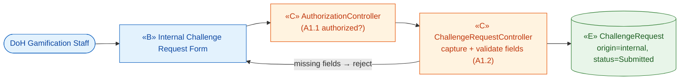
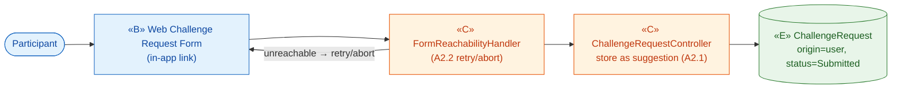
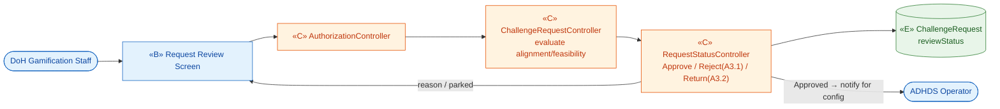
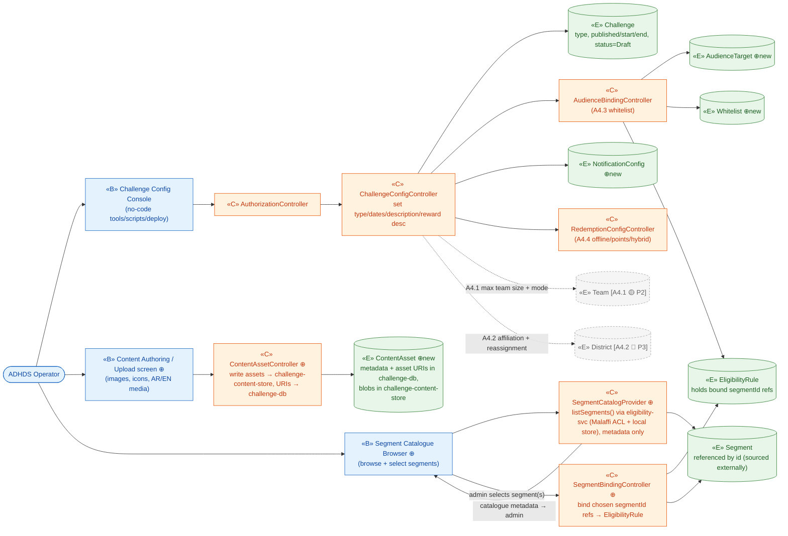
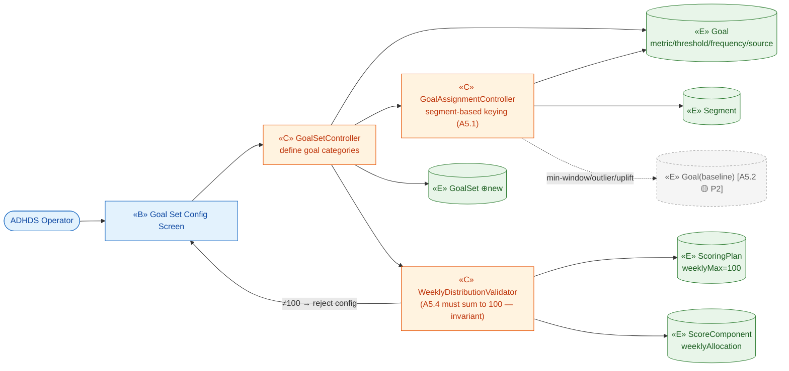
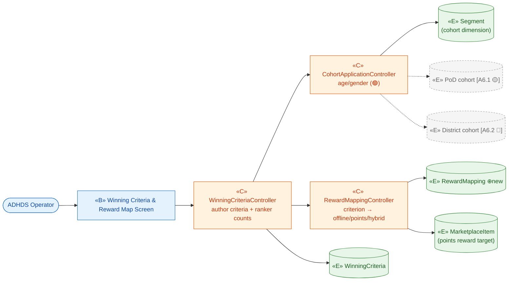
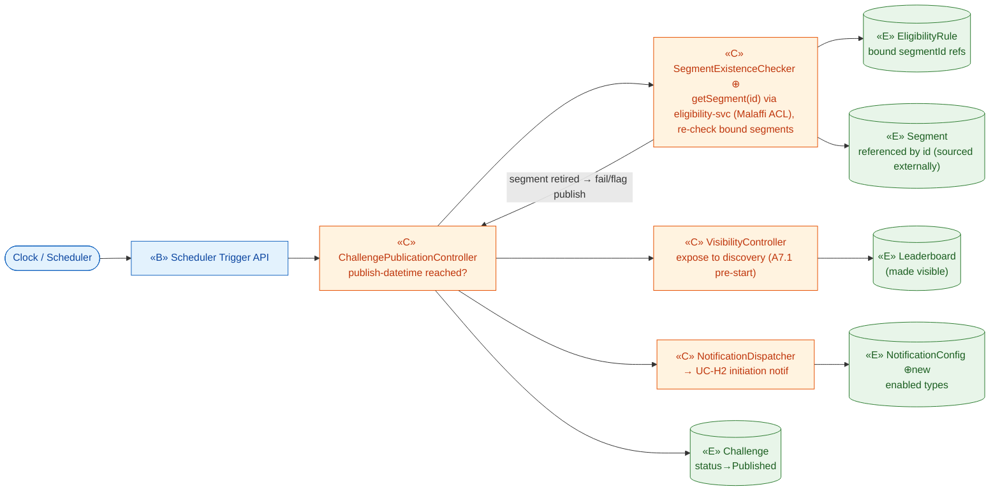
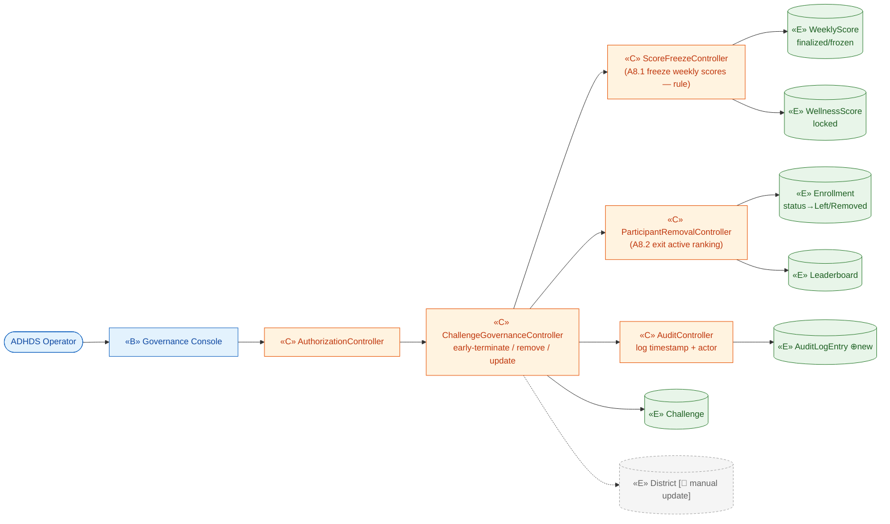
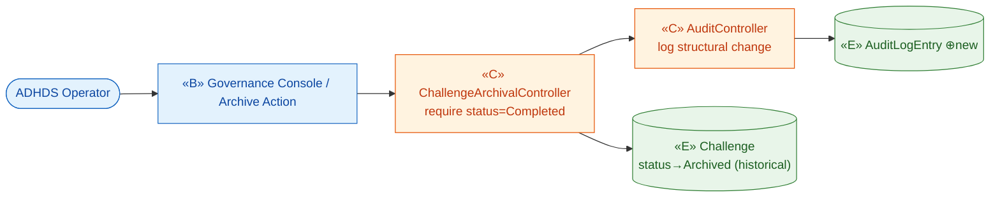

# ICONIX Step 2 — Robustness Analysis

## Package A — Challenge Authoring & Lifecycle (`challenge-authoring`, 🟢 P1)

> **Process**: ICONIX (Rosenberg). Robustness analysis bridges the use-case text (Step 1) and the
> sequence diagrams (Step 3). It is the **object picture** of each use case, classifying every noun/verb
> the narrative mentions into one of three stereotypes and forcing a legal communication topology.
>
> **Stereotypes**
> - **«B» Boundary** — screens / forms / APIs an **actor touches**. The only objects an actor may talk to.
> - **«C» Control** — verbs / logic / the **controllers that will own behaviour** (become methods/services in Step 3).
> - **«E» Entity** — domain classes from `02-domain-model.md` (the persistent nouns).
>
> **The four robustness rules (enforced below)**
> 1. Actors talk **only** to boundary objects.
> 2. Boundary and entity objects **never** talk to each other directly — always via a control.
> 3. Boundary objects talk only to controls (and actors).
> 4. Controls may talk to boundary, entity and other controls (controls are the glue).
>
> **Reading convention**: nouns → entity, verbs/business-rules → control. Alternate-course rules (locking,
> caps, freeze, consent, invariants) surface as **control** objects (they are decisions/validations).
>
> **Scope**: Phase-1 (individual-based challenges) is in build scope. Team (🟡 P2) and District (🔵 P3)
> branches are tagged and shown dashed where they appear, for forward/backward traceability only.

---

## 0. Reconciliation against the Domain Model — NEW entity classes

Robustness analysis is where the domain model gets stress-tested against use-case prose. The following
**entity** nouns are demanded by UC-A1…UC-A9 narratives but were **absent (or only implicit)** in
`02-domain-model.md`. They are introduced here and must be back-propagated into Step-1 domain model.

| New entity | Introduced by | Why the existing model is insufficient |
|---|---|---|
| **NotificationConfig** | UC-A4 ("enabled notification types"), UC-A7, UC-H2 | `Challenge` carries lifecycle dates but has no first-class object holding the *per-challenge enabled notification types*. Needed so Publish (A7) and lifecycle nudges (H2) can read which channels/types are armed. |
| **RewardMapping** | UC-A6 ("maps each criterion to Reward — offline and/or points") | `WinningCriteria.mappedReward` is a bare attribute; the offline-vs-points-vs-hybrid mapping plus per-cohort application is a relationship object linking `WinningCriteria` → reward outcome. Promoted to an entity so A6 and Settlement (I4) share one structure. |
| **AudienceTarget** | UC-A4 ("Target Audience: age/gender/conditions; whitelist"), UC-A4.3 | The model has `EligibilityRule` (visibility) and `Segment` (threshold keying) but no object representing the *authored target audience selection* (incl. the whitelist binding) on a `Challenge`. A4 authors this; B1/B2 later read it. Distinct from the evaluated `EligibilityRule`. |
| **Whitelist** | UC-A4.3 ("only whitelisted users may see/enroll"), UC-B2 | Named explicitly in the BRD/glossary and UC-B2 but never modelled as a class. Back-end list of member refs bound to a whitelist-targeted challenge. |
| **AuditLogEntry** | UC-A8 ("all structural changes logged with timestamp + actor"), UC-A9 | Governance/archive narratives mandate an immutable audit trail (timestamp + actor + change). No audit entity exists in the domain model. Cross-cutting ⚪ XC but first *needed* here. |
| **GoalSet** | UC-A5 ("defines, per Challenge, the included Goal categories … weekly distribution summing to 100") | `Challenge —defines→ Goal` exists, but A5 authors the *set* as a unit with the invariant "weekly score distribution = 100". Promote the collection to a named entity that owns the 100-sum invariant alongside `ScoringPlan`. (Alternatively realised as `ScoringPlan` + its `ScoreComponent`s — noted as a merge candidate for Step 3.) |
| **ContentAsset** ⊕ *(added in architecture enhancements)* | UC-A4 (challenge content: images, icons, localized AR/EN media) | The model carried challenge content only as bare `Challenge` attributes. Authoring writes binary/media **assets** (image / icon / localized AR-EN media) to the **`challenge-content-store`** object bucket, while `challenge-db` retains only **Content metadata + asset URIs** (refs, not blobs). Promote the asset to a first-class entity owned by the `Challenge` aggregate so the bucket vs metadata split is explicit. |

> **Already-present entities reused** (no change): `Challenge`, `ChallengeRequest`, `Goal`, `ScoringPlan`,
> `ScoreComponent`, `WinningCriteria`, `EligibilityRule`, `Segment`, `WeeklyScore`, `WellnessScore`,
> `Leaderboard`, `Enrollment`, `MarketplaceItem` (as the reward catalog item).
>
> **P2/P3 entities referenced only in tagged alternate courses**: `Team` (A4.1 🟡), `District` (A4.2/A6.2 🔵),
> baseline-personalized `Goal` (A5.2 🟡), PoD-cohort mapping (A6.1 🟡). Shown dashed; not built in P1.

---

## 1. Controllers identified (forward anchor for Step 3)

These **«C»** controls own the behaviour of this package and become the application-layer services/methods:

| Controller | Owns | Use cases |
|---|---|---|
| **ChallengeRequestController** | request capture, field validation, status transitions (Submitted→Approved/Rejected/Returned) | A1, A2, A3 |
| **ChallengeConfigController** | challenge attribute authoring, type-branch rules, audience/whitelist binding, no-code config | A4 |
| **ContentAssetController** ⊕ *(added in architecture enhancements)* | write content assets (image/icon/localized AR-EN media) to `challenge-content-store` (object bucket), persist asset URIs + metadata back to `challenge-db` | A4 |
| **SegmentCatalogProvider** ⊕ *(added in architecture enhancements)* | author-time **browse**: lists the segment catalogue (metadata only — `segmentId`, name, type) via `eligibility-svc.listSegments()` (Malaffi ACL → `GET /clinical-segments` for clinical, local-segment store for local) so the admin can pick the audience segment(s) | A4 |
| **SegmentBindingController** ⊕ *(added in architecture enhancements)* | author-time **bind**: writes the admin-chosen `segmentId` references onto the `EligibilityRule` (references, not raw criteria); validity is implicit — only live-catalogue segments are bindable | A4 |
| **SegmentExistenceChecker** ⊕ *(added in architecture enhancements)* | publish-time **re-check**: `eligibility-svc.getSegment(id)` (Malaffi ACL → `GET /clinical-segments/{segmentId}`) confirms each bound segment still exists before go-live; fail/flag publish if a bound segment was retired | A7 |
| **GoalSetController** | goal-category definition, segment-based assignment, weekly-distribution=100 invariant | A5 |
| **WinningCriteriaController** | criteria authoring, ranker counts, cohort application, criterion→reward mapping | A6 |
| **ChallengePublicationController** | publish-datetime transition, visibility flip, lifecycle-notification trigger | A7 |
| **ChallengeGovernanceController** | early-terminate + score-freeze, manual removal, manual district update, audit emission | A8 |
| **ChallengeArchivalController** | archive transition to historical, audit emission | A9 |
| **AuthorizationController** | gate authoring/governance actions to authorized staff/operator roles (A1.1, A3, A8) | A1, A3, A8 |
| **NotificationDispatcher** | (collaborating, owned by Package H) invoked by A7 to emit initiation notification | A7 |

---

## 2. Robustness Diagrams (per use case)

### UC-A1 — Submit Internal Challenge Request 🟢 P1

Actor: **DoH Gamification Staff** → boundary form only. Authorization (A1.1) and mandatory-field
validation (A1.2) are **controls**; the persisted noun is `ChallengeRequest` (origin = internal).

---

### UC-A2 — Submit User Challenge Request 🟢 P1

Actor: **Participant** → web form. Rule A2.1 (*suggestion only, no creation guarantee*) is a **control**
flag set on the persisted `ChallengeRequest` (origin = user). A2.2 (form unreachable) is a boundary/retry path.

---

### UC-A3 — Review & Approve Challenge Request 🟢 P1

Actor: **DoH Gamification Staff** reviews against program goals/feasibility. Decision verbs
(Approve / Reject-with-reason A3.1 / Return-for-changes A3.2) are **controls** mutating
`ChallengeRequest.reviewStatus`. Approved request is handed to **ADHDS Operator** (downstream actor of A4).

---

### UC-A4 — Configure Challenge ⚪ XC / 🟢 P1

Actor: **ADHDS Operator** configures the `Challenge` (type, dates, audience, reward description,
notification types). Branch rules become **controls**: A4.1 Team-size (🟡), A4.2 District affiliation (🔵),
A4.3 Whitelist binding, A4.4 Hybrid redemption. New entities `AudienceTarget`, `Whitelist`,
`NotificationConfig` appear here.

**Architecture enhancement (E1)** — content authoring + author-time segment browse-and-bind: a separate
**Content Authoring / Upload** screen lets the operator upload challenge content (images, icons, localized
AR/EN media). `ContentAssetController` ⊕ writes those binaries to the **`challenge-content-store`** object
bucket and persists only **Content metadata + asset URIs** (the new `ContentAsset` ⊕ entity, refs not blobs)
in `challenge-db`. Segmentation is a **separate, upstream concern**: clinical segments live on **Malaffi**,
local segments in a platform local-segment store. So the admin does **not** send criteria to validate — at the
audience step a **Segment Catalogue Browser** ⊕ screen calls `SegmentCatalogProvider` ⊕, which asks
`eligibility-svc.listSegments()` (Malaffi ACL → `GET /clinical-segments` for clinical, local store for local)
and returns the **catalogue metadata only** (`segmentId`, name, type — **no membership**). The admin **browses
and selects** the matching segment(s), and `SegmentBindingController` ⊕ **binds** the chosen `segmentId`
references onto the `EligibilityRule`. `Segment` is therefore **referenced by id** (sourced externally), not
authored here, and validity is **implicit** — only live-catalogue segments are bindable, so no separate
author-time "validate" call exists. The publish-time existence re-check (`SegmentExistenceChecker` ⊕) lives in
UC-A7.

> **E1 topology note** — `ContentAssetController`, `SegmentCatalogProvider` and `SegmentBindingController`
> are «C» controls (verbs): the upload screen (B2) and `ContentAsset` (E7) never touch each other directly,
> and the **Segment Catalogue Browser** (B3) reaches `Segment` (E6) and `EligibilityRule` (E4) only through
> those controls — no «B»→«E» edge. Browse-and-bind replaces the old author-time validate hop: the admin
> browses the catalogue surfaced by `SegmentCatalogProvider` (`listSegments()`), selects, and
> `SegmentBindingController` writes the chosen `segmentId` references onto `EligibilityRule`. `Segment` is
> **referenced by id**, sourced externally; validity is implicit (only live-catalogue segments are bindable).
> The bucket (`challenge-content-store`) and the segment source (**Malaffi** + local store, reached via
> `eligibility-svc`) are external/infrastructure seams realised in Step 3 (sequences); here they surface as the
> metadata/URI split on `ContentAsset` and the `listSegments()` browse hop on `SegmentCatalogProvider`. The
> publish-time `getSegment(id)` existence re-check (`SegmentExistenceChecker` ⊕) is shown under UC-A7.

---

### UC-A5 — Configure Goal Set & Assignment 🟢 P1

Actor: **ADHDS Operator** defines, per challenge, the goal categories, each goal's
metric/threshold/frequency/source, the **segment-based** assignment (A5.1 🟢), score-contribution flags,
and the **weekly distribution = 100** invariant (A5.4). New entity `GoalSet` owns the 100-sum invariant
(realised together with `ScoringPlan`/`ScoreComponent`). Baseline (A5.2 🟡) and PoD (A5.3 🟡) shown dashed.

---

### UC-A6 — Configure Winning Criteria & Reward Mapping 🟢 P1

Actor: **ADHDS Operator** configures `WinningCriteria` (Highest Score, Most Balanced Days,
Wellness-Pillar Champion, Consistent Engagement, Score Maintenance), ranker counts, optional cohort
application (age/gender 🟢), and maps each criterion → `Reward` via new `RewardMapping`. A6.1 PoD-cohort
(🟡) and A6.2 District-cohort (🔵) dashed. A6.3 extensibility = no-code (config rule on the controller).

---

### UC-A7 — Publish Challenge ⚪ XC / 🟢 P1

Actor: **Clock / Scheduler** (time-actor) triggers at the configured publish datetime. Before flipping
visibility, `SegmentExistenceChecker` ⊕ re-checks each bound `segmentId` via `eligibility-svc.getSegment(id)`
(Malaffi ACL → `GET /clinical-segments/{segmentId}`) to catch a segment retired between authoring and go-live —
fail/flag publish if a bound segment is gone. Control then flips `Challenge.status` to Published/visible,
exposes it to discovery, and triggers the initiation notification (→ UC-H2 via `NotificationDispatcher`). A7.1
(publish < start) is a control branch (visible-but-not-yet-scoring).

---

### UC-A8 — Early-Terminate / Govern Challenge 🟢 P1

Actor: **ADHDS Operator** performs governance on an active challenge. A8.1 early-termination triggers
**score-freeze** (a control that locks `WeeklyScore`/`WellnessScore`). A8.2 manual removal exits the
participant from active ranking. Every structural change emits an `AuditLogEntry` (new entity). Manual
district update (🔵) dashed.

---

### UC-A9 — Archive Challenge 🟢 P1

Actor: **ADHDS Operator** (or system) archives a completed challenge. Control flips status to Archived,
moves it to the historical section, and logs the structural change to `AuditLogEntry`.

---

## 3. Invariant Check (ICONIX robustness rules)

| Rule | Status across A1–A9 |
|---|---|
| Actors touch only boundary | ✅ every diagram routes the actor (incl. Clock time-actor) into a «B» first. |
| Boundary ↔ entity never direct | ✅ no «B»→«E» edge exists; all data access is via a «C». |
| Nouns → entity, verbs → control | ✅ requests/challenges/goals/scores/audit = entities; submit/validate/approve/configure/publish/freeze/archive = controls. |
| Alternate-course rules surfaced as controls | ✅ A1.2 field-validation, A2.1 suggestion-only, A3.1 reject, A4.3 whitelist, A5.4 =100 invariant, A8.1 score-freeze each = a named control. |
| New entities back-propagated | ⚠️ Action: add NotificationConfig, RewardMapping, AudienceTarget, Whitelist, AuditLogEntry, GoalSet, **ContentAsset** ⊕ (architecture enhancement E1) to `02-domain-model.md`. |
| E1 content/segment seams legal | ✅ `ContentAssetController` (B2→C4→E7) is a control; **Segment browse-and-bind** routes B3→`SegmentCatalogProvider`(C5)→`Segment`(E6) and B3→`SegmentBindingController`(C6)→`EligibilityRule`(E4) — no «B»→«E» edge; `Segment` is referenced by id (sourced externally), validity is implicit, and the publish-time `getSegment(id)` re-check is `SegmentExistenceChecker` (A7). Bucket + Malaffi (via `eligibility-svc`) surface as the metadata/URI split and the `listSegments()` browse hop. |

## 4. Traceability (forward to Step 3 — sequences)

Each controller above is the forward anchor for a sequence diagram; each «C»→«E» edge becomes a message
(create/update/validate/lock). Backward links: every entity traces to a `02-domain-model.md` class (or a
⊕new class listed in §0); every boundary/control traces to a UC-A* basic or alternate course.
