# ICONIX Step 2 — Robustness Analysis: Package D "Earn / Scoring" (`earn-scoring`)

> **Process**: ICONIX (Rosenberg) — use-case-driven. This is the Step-2 robustness deliverable for
> the **Earn / Scoring** package. Each use case is bridged from its Step-1 narrative
> (`01-use-cases.md`) and Step-1 domain model (`02-domain-model.md`) into a robustness diagram that
> classifies objects as **«B» boundary**, **«C» control**, **«E» entity**.
>
> **Robustness rules enforced** (Rosenberg):
> 1. Actors touch **only** boundary objects.
> 2. Boundary objects and entity objects **never** talk directly — only through control.
> 3. Boundary objects talk to actors, controllers, and other boundaries (not entities).
> 4. Control objects talk to boundaries, other controls, and entities.
> 5. Nouns → entity (must trace to a class in `02-domain-model.md`); verbs/logic → control.
>
> **Phase tags**: 🟢 P1 in-scope · 🟡 P2 deferred · 🔵 P3 deferred. Deferred use cases (UC-D8/D9/D10)
> are modelled for forward-traceability and tagged; they are **not** in the Phase-1 build.
>
> **Boundary convention**: most Package-D logic is **system-/Clock-driven**, so the "boundary" an actor
> touches is frequently an **inbound system API** (Ingestion API) or a **time-trigger boundary**
> (the Clock/Scheduler firing day-close / week-close / challenge-end). UI read-screens for scores live
> in Package F (Track & Engage); this package owns the *write/compute* path, not the view.

---

## 0. Package Scope & Traceability Map

| UC | Title | Phase | Driving Actor | Primary Control(s) | Entities written |
|----|-------|-------|---------------|--------------------|------------------|
| UC-D1 | Ingest Goal Performance Data | 🟢 P1 | Wearable/IFHAS/Events/Member | `GoalDataIngestionController` | Activity, **IngestionLog** (new) |
| UC-D1a | Stream Wearable Telemetry (Health Connect SDK) ⊕ | 🟢 P1 | Member (on-device) | `WearableIngestController` ⊕ | Activity, **IngestionLog** (new) |
| UC-D1b | Submit Survey / Check-in Response ⊕ | 🟢 P1 | Member (on-device) | `SurveyResponseController` ⊕ | **Survey** (new), **SurveyResponse** (new), Activity, IngestionLog |
| UC-D2 | Evaluate Daily Goal Success | 🟢 P1 | Clock (day-close) | `DailyEvaluationController` | DailyResult, Streak |
| UC-D3 | Compute Weekly Score | 🟢 P1 | (event-driven, post-D2) | `WeeklyScoreController` | WeeklyScore |
| UC-D4 | Award Streak / Consistency Bonus | 🟢 P1 | (within-week / Clock) | `ConsistencyBonusController` | Streak, WeeklyScore |
| UC-D5 | Finalize Weekly Score | 🟢 P1 | Clock (week-close) | `WeeklyFinalizationController` | WeeklyScore (→ triggers G1/H4/D8) |
| UC-D6 | Compute Final Wellness Score & Tie-Break | 🟢 P1 | Clock (challenge-end) | `FinalScoreController`, `TieBreakController` | WellnessScore, **Ranking** (new) |
| UC-D7 | Award Badge | 🟢 P1 | (trigger-driven) | `BadgeAwardController` | BadgeAward |
| UC-D8 | Award / Advance Title | 🟡 P2 | (post-D5) | `TitleProgressionController` | MemberProgression, Title |
| UC-D9 | Aggregate Team Score | 🟡 P2 | (post-D6) | `TeamScoreController` | Team(teamScore), WellnessScore |
| UC-D10 | Aggregate District Score | 🔵 P3 | (post-D6) | `DistrictScoreController` | District(districtScore), WellnessScore |

**New entity classes introduced this step** (absent from `02-domain-model.md`):
- **`IngestionLog`** — UC-D1 narrative requires *"every update logged with timestamp + source reference"* and
  UC-D1.1 requires duplicate-within-window rejection. `Activity` holds the *accepted* metric value; the audit
  trail of *every ingestion attempt* (incl. rejected duplicates / late-sync decisions) is a separate noun. Add it.
- **`Ranking`** — UC-D6 *"finalizes rankings"* and applies tie-break ordering. `Leaderboard`/`LeaderboardEntry`
  (Package E) are the **view** of ranking; the finalized, immutable ranking result with tie-break resolution is a
  distinct scoring-side entity that the leaderboard later reflects. Add it.
- **`Survey`** ⊕ *(added in architecture enhancements)* — UC-D1b: the **definition** (questions/check-in items)
  served read-side by the `Sahatna Survey API`. A `Survey` is read for the survey-info screen and referenced
  when a response is submitted.
- **`SurveyResponse`** ⊕ *(added in architecture enhancements)* — UC-D1b: a member's submitted **check-in
  response**. A `SurveyResponse` is an **activity-source**: it is ingested as **self-reported activity** exactly
  like a verified wearable metric (cf. BRD mental / nutrition / sleep check-ins), so it feeds scoring the same way.

> Note: `TeamScore` and `DistrictScore` are **not** new classes — they are the `Team.teamScore_avg` and
> `District.districtScore_avg` attributes already in the domain model, materialised as a `WellnessScore` per the
> existing `Team "1" --> "1" WellnessScore` / `District "1" --> "1" WellnessScore` associations.

---

## UC-D1 — Ingest Goal Performance Data 🟢 P1

**Narrative anchor**: ingests metric data from Wearable / IFHAS / Events / in-app survey, tagged to a *Goal* +
time window; every update logged. Alt: D1.1 duplicate-in-window rejected; D1.2 late device sync accepted within limits.

**Object harvest**
- Boundary: `Ingestion API` (the inbound endpoint the system/data-source actors POST to).
- Control: `GoalDataIngestionController` (verbs: ingest, tag-to-goal, dedupe-check, late-sync-window-check, log).
- Entity: `Activity` (accepted metric), `Goal` (tag target + window), **`IngestionLog`** (new — audit of every update).

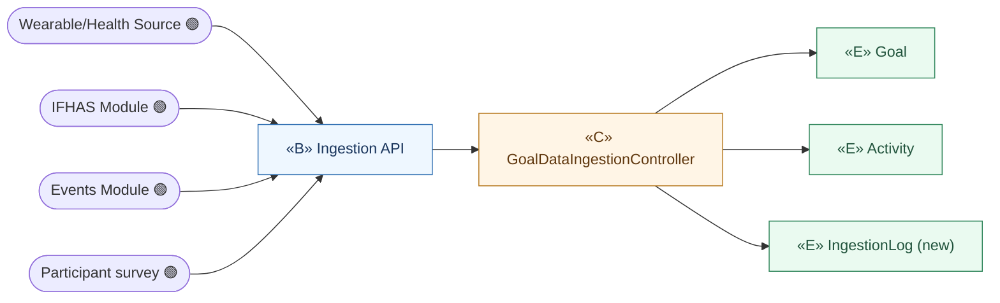

- **D1.1** duplicate-in-window → controller reads `Activity` (existing dayKey/window), rejects, still writes `IngestionLog`.
- **D1.2** late sync → controller checks Goal window vs timestamp, accepts within limit, logs decision.

> **UC-D1a / UC-D1b refinement (⊕ added in architecture enhancements)**: UC-D1 above is the *generic*
> ingestion endpoint. The two refinements below name the **specific frontend stream paths** that feed it —
> on-device wearable telemetry (E2) and survey/check-in responses (E3). Both stream into the **same**
> `ingestion-svc` and produce `Activity` + `IngestionLog` exactly as UC-D1; survey responses are treated as
> **self-reported activity**. The boundaries are the **on-device** SDK/screens (not a server-side wearables pull).

---

## UC-D1a — Stream Wearable Telemetry (Health Connect SDK) 🟢 P1 ⊕

**Narrative anchor (E2)**: the member's **on-device** `Health Connect SDK` reads Apple Health / Google Fit and
**streams** telemetry. This is a frontend stream — **not** a server-side wearables-cloud pull. Telemetry flows
async through APIM-north → BFF Wearable Ingest → APIM-south → ingestion-svc, which verifies and persists
`Activity` (+ `IngestionLog`), then emits `activity.verified`. Alt: D1a.1 duplicate-in-window rejected (still
logged); D1a.2 late device sync accepted within the Goal's late-sync limit (decision logged).

**Object harvest**
- Boundary: `Health Connect SDK` (on-device reader/streamer — the member's boundary), `BFF Wearable Ingest`
  (the BFF surface that relays the stream into ingestion), `Ingestion API` (ingestion-svc inbound endpoint).
- Control: `WearableIngestController` ⊕ (verbs: relay stream, verify, dedupe-check, late-sync-window-check, log,
  emit `activity.verified`).
- Entity: `Activity` (accepted metric), `Goal` (window), `IngestionLog` (audit).

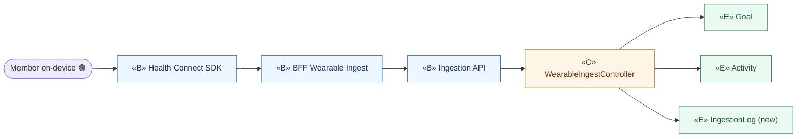

- The member touches only the **on-device** `Health Connect SDK` boundary; boundaries chain
  (`Health Connect SDK` → `BFF Wearable Ingest` → `Ingestion API`) and never touch entities directly.
- **D1a.1 / D1a.2** reuse UC-D1's dedupe / late-sync rules in `WearableIngestController`.

---

## UC-D1b — Submit Survey / Check-in Response 🟢 P1 ⊕

**Narrative anchor (E3)**: the member's **on-device** `Surveys / Check-ins` screen first fetches **survey info**
(definitions/questions) **sync** from the `Sahatna Survey API`, then **submits** a response. The submitted
`SurveyResponse` **streams the SAME way as wearables** — async through APIM-north → Sahatna Survey API →
APIM-south → ingestion-svc — and is ingested as **self-reported activity** (a check-in), feeding scoring like a
verified wearable metric. Alt: D1b.1 survey-info read is sync (no ingestion); D1b.2 duplicate check-in in window
rejected (still logged).

**Object harvest**
- Boundary: `Surveys / Check-ins` (on-device screen — the member's boundary), `Sahatna Survey API` (BFF surface:
  serves survey info read-side AND ingests survey responses), `Ingestion API` (ingestion-svc inbound endpoint).
- Control: `SurveyResponseController` ⊕ (verbs: serve survey info, accept response, map response → self-reported
  Activity, dedupe-check, log).
- Entity: `Survey` (new — definition), `SurveyResponse` (new — submitted check-in), `Activity` (self-reported),
  `Goal` (window/tag), `IngestionLog` (audit).

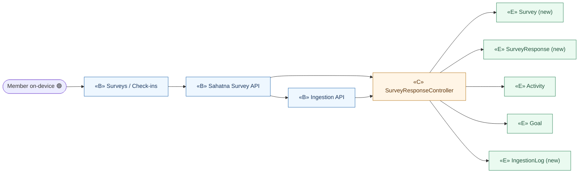

- **D1b.1** survey-info read is **sync** (`Surveys / Check-ins` → `Sahatna Survey API` → `SurveyResponseController`
  reads `Survey`); no ingestion occurs on the read path.
- Response submit is **async** and routes through `Ingestion API`; `SurveyResponse` is mapped to a self-reported
  `Activity`, feeding scoring exactly like a wearable metric. **D1b.2** duplicate check-in handled by the same
  dedupe rule, still written to `IngestionLog`.
- Boundaries chain (`Surveys / Check-ins` → `Sahatna Survey API` → `Ingestion API`) and never touch entities
  directly — all entity access is mediated by `SurveyResponseController`.

---

## UC-D2 — Evaluate Daily Goal Success 🟢 P1

**Narrative anchor**: after day-close (Clock), evaluate each daily *Goal* threshold; "successful day" = ≥1 daily goal met;
result feeds the streak counter. Alt: D2.1 only after day-close; D2.2 mid-week enrollment shows prior days empty.

**Object harvest**
- Boundary: `Day-Close Trigger` (Clock fires the day-close event — the time-actor's boundary).
- Control: `DailyEvaluationController` (verbs: evaluate threshold, mark successful-day, feed streak).
- Entity: `Activity` (read), `Goal` (read threshold), `DailyResult` (write), `Streak` (counter fed), `Enrollment` (scopes per-participant tracking).

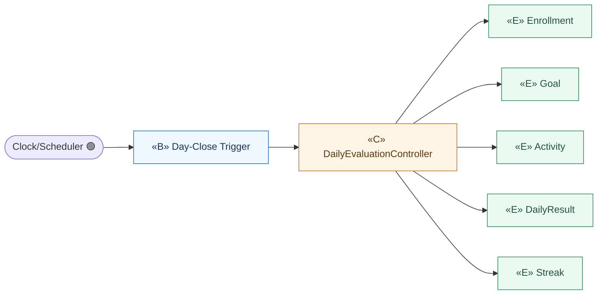

- **D2.1** controller only fires off the Day-Close Trigger boundary (no mid-day path exists).
- **D2.2** controller reads `Enrollment.enrollmentDate`; days prior to it yield empty `DailyResult`.

---

## UC-D3 — Compute Weekly Score 🟢 P1

**Narrative anchor**: within a week, sum each goal's weighted contribution toward the 100-cap; update *Weekly Score*
dynamically as goals are met. Alt: D3.1 none met → 0; D3.2 never exceed 100 (cap invariant).

**Object harvest**
- Boundary: `Goal-Met Event` (internal event raised when a DailyResult/Activity satisfies a goal — drives dynamic update).
- Control: `WeeklyScoreController` (verbs: sum weighted contributions, apply 100-cap).
- Entity: `ScoringPlan` + `ScoreComponent` (weights), `Goal`, `DailyResult` (read), `WeeklyScore` (write).

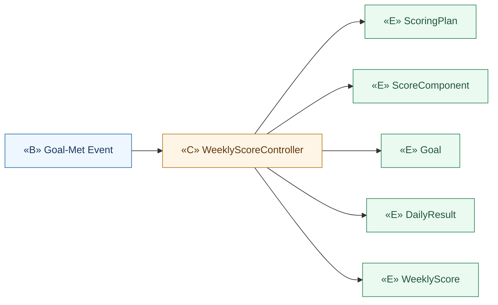

> The `Goal-Met Event` boundary is raised by UC-D2's controller, not a human actor — Package D is system-driven.
> **D3.2** cap invariant lives in `WeeklyScoreController` (write to `WeeklyScore.scoreValue` clamped ≤100).

---

## UC-D4 — Award Streak / Consistency Bonus 🟢 P1

**Narrative anchor**: count successful days (cap 7), add configured consistency bonus (Bronze 4/7, Silver 6/7, Gold 7/7)
as part of the 100 total. Alt: D4.1 bonus embedded in 100; D4.2 streak resets each week, no carryover.

**Object harvest**
- Boundary: `Streak-Update Event` / `Week-Close Trigger` (Clock) — bonus is computed within-week and at close.
- Control: `ConsistencyBonusController` (verbs: count successful days, resolve tier, add embedded bonus, reset).
- Entity: `DailyResult` (read success days), `Streak` (write tier/days), `ScoreComponent` (isConsistencyBonus weight), `WeeklyScore` (bonus folded in).

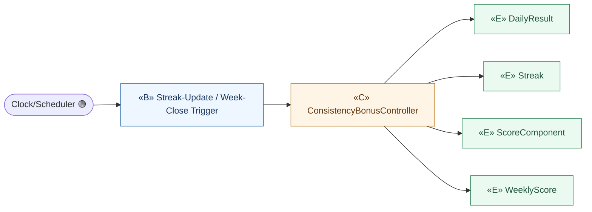

- **D4.1** controller adds bonus via the `isConsistencyBonus_flag` `ScoreComponent` so total stays ≤100.
- **D4.2** controller writes `Streak.resetsWeekly` (days→0 each new `weekId`).

---

## UC-D5 — Finalize Weekly Score 🟢 P1

**Narrative anchor**: at week-close (Clock), finalize *Weekly Score*, make immutable + traceable to goal data; trigger
reward-point accrual (UC-G1) and weekly summary (UC-H4) [and Title progression UC-D8 per Step-1 trigger edge].
Alt: D5.1 late data cannot change finalized score; D5.2 partial week extrapolated out of 100.

**Object harvest**
- Boundary: `Week-Close Trigger` (Clock).
- Control: `WeeklyFinalizationController` (verbs: finalize, lock-immutable, extrapolate-partial, emit downstream triggers).
- Entity: `WeeklyScore` (set `finalized_flag`, `finalizedTimestamp`), `DailyResult` (traceability link), `Enrollment` (scope).
- Downstream controls (other packages, shown as `«C»` collaborators, not re-detailed here): `RewardAccrualController` (G1),
  `WeeklySummaryController` (H4), `TitleProgressionController` (D8 🟡).

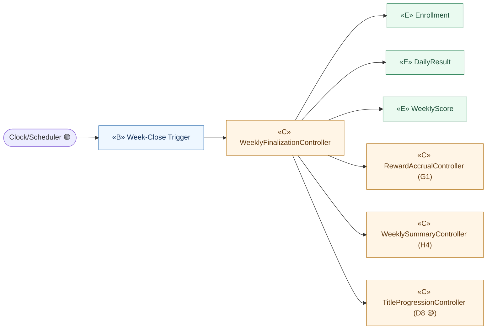

- **D5.1** once `finalized_flag=true`, controller refuses mutation (late `Activity`/`IngestionLog` ignored for score).
- **D5.2** partial week extrapolated to /100 before lock.

---

## UC-D6 — Compute Final Wellness Score & Tie-Break 🟢 P1

**Narrative anchor**: at challenge-end (Clock), *Final Wellness Score* = average of completed weekly scores (equal weight;
late enrollment averages from enrollment week); lock; finalize rankings; apply tie-break (weeks above threshold; lower variance).
Alt: D6.1 no updates after finalization; D6.2 membership change must not retroactively alter finalized weekly scores.

**Object harvest**
- Boundary: `Challenge-End Trigger` (Clock).
- Control: `FinalScoreController` (verbs: average completed weeks, lock), `TieBreakController` (verbs: rank, apply tie-break rules).
- Entity: `WeeklyScore` (read finalized), `WellnessScore` (write, lock), `ScoringPlan.tieBreakRules` (read), **`Ranking`** (new — finalized ordered result), `Enrollment` (scope).

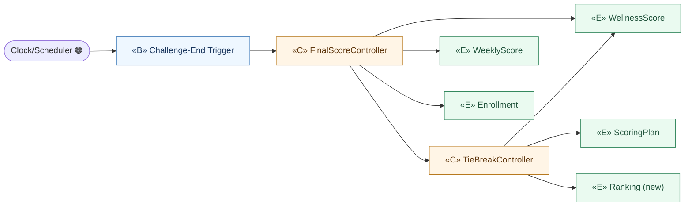

- **D6.1/D6.2** `FinalScoreController` sets `WellnessScore.locked_flag` and never recomputes finalized `WeeklyScore`.
- `Ranking` is the scoring-side finalized order; Package-E `Leaderboard` later *reflects* it (read-only view).

---

## UC-D7 — Award Badge 🟢 P1

**Narrative anchor**: on a qualifying trigger (daily/weekly/streak/participation/performance), award a *Badge* (some tiered)
to the Participant; track in-progress badges. Alt: D7.1 tiered advance; D7.2 team/district badges 🟡🔵; D7.3 badges persist across challenges.

**Object harvest**
- Boundary: `Badge-Trigger Event` (raised by D2/D3/D4/D5 evaluations and participation events).
- Control: `BadgeAwardController` (verbs: evaluate trigger, award, advance tier, track in-progress).
- Entity: `Badge` (template + triggerType), `BadgeAward` (write earnedDate/tierLevel/inProgressPercent), `Member` (recipient — persists across challenges).

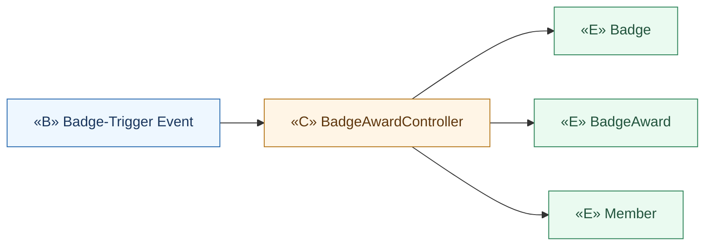

- **D7.1** controller bumps `BadgeAward.tierLevel` when higher threshold crossed.
- **D7.3** `BadgeAward` attaches to `Member` (not `Enrollment`) → persists across challenges.
- **D7.2** team/district badge categories deferred 🟡🔵 (Badge.category supports them; award path needs Team/District context).

---

## UC-D8 — Award / Advance Title 🟡 P2 (deferred — modelled for traceability)

**Narrative anchor**: on finalized weeks, update lifetime *Completed Weeks* / *Perfect Weeks* counters; advance *Title*
(highest unlocked only) per thresholds. Alt: D8.1 disenroll before finalization → week not counted; D8.2 counters never change retroactively.

> P1 note: the **counters** (`MemberProgression.totalCompletedWeeks/totalPerfectWeeks`) are written by Phase-1 scoring for
> forward-traceability; the **Title** read-out is the P2 user-facing feature.

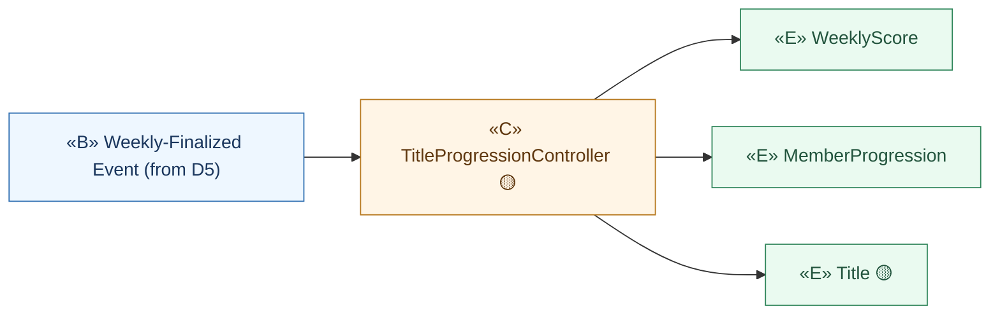

---

## UC-D9 — Aggregate Team Score 🟡 P2 (deferred — modelled for traceability)

**Narrative anchor**: *Team Score* = average of member *Wellness Scores*; updates dynamically; teams ranked by team score.
Alt: D9.1 member add/remove → average recalculated forward.

> `TeamScore` reuses `Team.teamScore_avg` (materialised as a `WellnessScore` via the existing `Team→WellnessScore` association) — **no new class**.

---

## UC-D10 — Aggregate District Score 🔵 P3 (deferred — modelled for traceability)

**Narrative anchor**: *District Score* = average of participating users' *Wellness Scores*; one district per user; districts
ranked by district score. Alt: D10.1 user cannot change district mid-challenge.

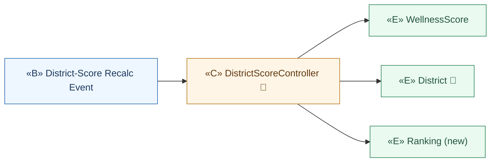

> `DistrictScore` reuses `District.districtScore_avg` (materialised as a `WellnessScore` via `District→WellnessScore`) — **no new class**.

---

## Reconciliation: Use-Case Text vs Domain Model

| Concern in UC text | Domain-model element | Resolution |
|--------------------|----------------------|------------|
| "every update logged with timestamp + source reference" (D1) | none — `Activity` is the accepted value only | **New entity `IngestionLog`** |
| wearable telemetry streamed on-device (E2 / D1a) | `Activity` is the accepted metric; no wearables-pull noun | Reuse `Activity`/`IngestionLog`; new **`WearableIngestController`** + `Health Connect SDK` / `BFF Wearable Ingest` boundaries ⊕ |
| survey definitions + self-reported check-in responses (E3 / D1b) | none — only generic `Activity` existed | **New entities `Survey`, `SurveyResponse`**; `SurveyResponse` is an activity-source mapped to `Activity` ⊕ |
| "finalizes rankings" + tie-break order (D6) | `Leaderboard`/`LeaderboardEntry` are views (Package E) | **New entity `Ranking`** (scoring-side finalized order; leaderboard reflects it) |
| "successful day = ≥1 daily goal met" (D2) | `DailyResult.isSuccessfulDay` | maps cleanly — controller logic only |
| "bonus embedded in 100" (D4) | `ScoreComponent.isConsistencyBonus_flag` | maps cleanly |
| Team/District score (D9/D10) | `Team.teamScore_avg` / `District.districtScore_avg` + `→WellnessScore` | reuse — no new class |
| Title advance (D8) | `Title`, `MemberProgression` | reuse — controller logic only |

**Boundary-rule audit**: in every diagram above, no actor touches an entity, and no boundary connects directly to an
entity — all entity access is mediated by a control object. ✔

---

## Forward links (to ICONIX Step 3 — Sequence)

Each control identified here becomes the message-owner in the corresponding sequence diagram:
`GoalDataIngestionController`, `WearableIngestController` ⊕, `SurveyResponseController` ⊕,
`DailyEvaluationController`, `WeeklyScoreController`, `ConsistencyBonusController`,
`WeeklyFinalizationController`, `FinalScoreController`, `TieBreakController`, `BadgeAwardController`
(+ deferred `TitleProgressionController` 🟡, `TeamScoreController` 🟡, `DistrictScoreController` 🔵).
