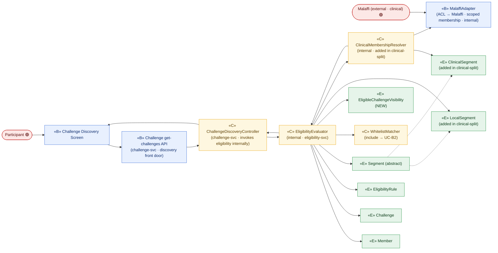
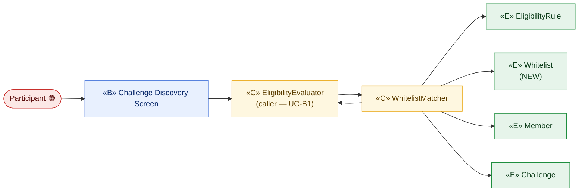
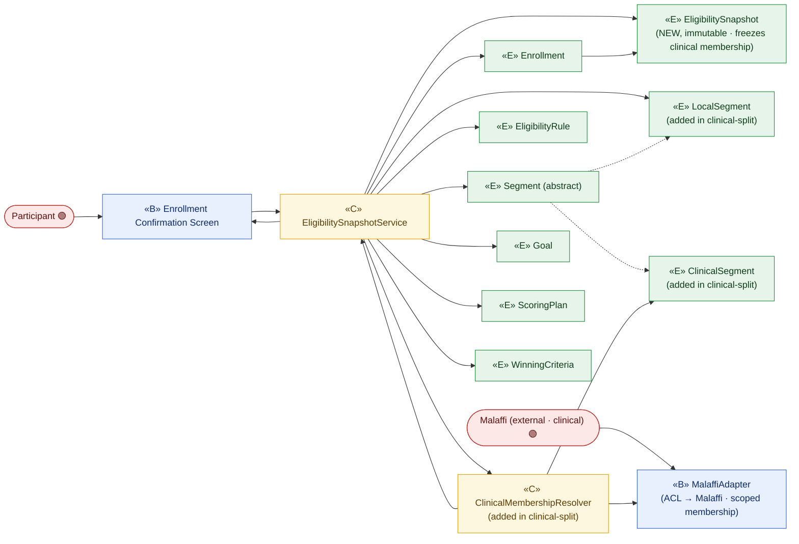

# ICONIX Step 2 — Robustness Analysis

## Package B — Eligibility & Audience Targeting (`eligibility`) · 🟢 P1

**Process**: ICONIX (Rosenberg), use-case-driven. This is the Step-2 deliverable for the
`eligibility` package. Each use case from
[`01-use-cases.md`](../01-use-cases.md) §Package B is decomposed into a **robustness diagram**
that classifies objects into:

- **«B» Boundary** — screens / APIs the actor touches (the only objects an actor may touch).
- **«C» Control** — verbs / logic / the controllers that will own behaviour (in Step 4 these
  become methods on a controller or domain service).
- **«E» Entity** — durable domain classes drawn from
  [`02-domain-model.md`](../02-domain-model.md).

**ICONIX robustness rules enforced here**

1. Actors connect **only** to boundary objects.
2. Boundary and entity objects **never** talk directly — every interaction is mediated by a control.
3. Controls may talk to boundaries, entities and other controls.
4. **Nouns → entity**, **verbs → control** (the "noun/verb" reconciliation of the use-case text
   against the domain model).

**Traceability**: each diagram links *use case ⇄ domain class ⇄ robustness object*. Step-4
sequence messages will be hung off the **control** objects named here, preserving the
forward chain `UC ⇄ domain class ⇄ robustness object ⇄ sequence message`.

**Phase scope**: Package B is entirely 🟢 **P1** (individual-based). District (🔵 P3) and
accessibility/PoD (🟡 P2) dimensions appear only as *attributes* inside `EligibilityRule` /
`Member` and are tagged inline; no P2/P3 behaviour is modelled.

---

## New entity classes introduced in this step

Reconciling the three narratives against `02-domain-model.md` surfaced three durable nouns that
the domain model had collapsed into attributes. They are promoted to first-class entities here so
the robustness (and later sequence) objects have something concrete to read/write. These must be
back-ported into `02-domain-model.md`.

| New entity | Scope | Why promoted (gap in 02-domain-model) | Source UC |
|---|---|---|---|
| **Whitelist** | 🟢 P1 | The model folds whitelisting into `EligibilityRule.whitelistedAudience` and `Segment.whitelisted` (booleans). The BRD glossary and UC-B2 name *Whitelist* as a concrete **back-end list of member references** that B2 must look a member up against. A boolean attribute cannot be enumerated/matched — a list entity is required. | UC-B2 |
| **EligibleChallengeVisibility** | 🟢 P1 | UC-B1 produces a per-member **set of currently-visible challenges** ("eligible challenges become visible", "may join all concurrently"). `02-domain-model.md` has no object representing *visibility/eligibility decision per (Member, Challenge)*. Promoted so the visibility outcome is a readable entity rather than a transient list. | UC-B1 |
| **EligibilitySnapshot** | 🟢 P1 | `Enrollment.snapshotEligibility` is a single opaque attribute. UC-B3 requires an **immutable capture of eligibility + configuration parameters** locked for the challenge duration (B3.1 locking rule, B1.1 no-retroactive rule). Promoted to a distinct immutable entity owned by `Enrollment`. | UC-B3 |
| **LocalSegment** _(added in eligibility clinical-split)_ | 🟢 P1 | `Segment` is split: demographic (age/gender/district) + telemetry/local-accessibility membership evaluated against the local `Member` profile (`membership-db`, read via `enrolment-svc`). A concrete entity is needed so the evaluator's **local** branch has something to match. | UC-B1 |
| **ClinicalSegment** _(added in eligibility clinical-split)_ | 🟢 P1 | `Segment` is split: conditions / PoD(accessibility) membership **lives on Malaffi**, resolved per-user via a scoped membership query (ACL, no bulk copy). A concrete entity is needed so the evaluator's **clinical** branch has something to scope the Malaffi query to. | UC-B1 |

> Note: `Member`, `Challenge`, `EligibilityRule`, `Segment`, `Enrollment`, `Goal`, `ScoringPlan`,
> `WinningCriteria` already exist in `02-domain-model.md` and are reused as-is. `Segment` is now
> abstract with `LocalSegment` / `ClinicalSegment` specializations (added in eligibility
> clinical-split; back-ported to `02-domain-model.md`).

---

## Controllers identified (forward anchors for Step 4)

| Controller (control object) | Owns behaviour for | Realizes |
|---|---|---|
| **EligibilityEvaluator** | Match a member's profile against challenge eligibility rules; compute the visible-challenge set; enforce no-retroactive-change. | UC-B1 |
| **WhitelistMatcher** | Look a member up against a challenge's whitelist; hide non-whitelisted challenges entirely. | UC-B2 (included by B1) |
| **EligibilitySnapshotService** | On enrollment confirmation, capture and freeze eligibility + config parameters into an immutable snapshot; reject later mutation. | UC-B3 |
| **ClinicalMembershipResolver** _(added in eligibility clinical-split)_ | Resolve a member's **clinical** segment membership by calling `Malaffi` through the `MalaffiAdapter` ACL — `getScopedMembership(memberId, clinicalSegmentIds)`, scoped to the active clinical segments only (data minimisation); never copies/stores Malaffi membership locally. | UC-B1 / UC-B3 |

---

## UC-B1 — Evaluate Challenge Eligibility 🟢 P1

> *realizes P1-3a, §Eligibility & Audience Targeting · included by UC-C3 Enroll · includes UC-B2*

**Basic course (robustness reading)**: the **Participant** opens the Challenge Discovery surface and
calls the **Challenge get-challenges** boundary (a `challenge-svc` screen/API — the actor touches
**Challenge**, never an Eligibility API). The Challenge discovery controller invokes the
**EligibilityEvaluator** **internally** to filter the visible set. The **EligibilityEvaluator** reads
the member's `Member` profile (age, gender 🟢; district 🔵) and
each candidate `Challenge`'s `EligibilityRule`, then **partitions** the rule's required segments
into **`LocalSegment`** vs **`ClinicalSegment`** (added in eligibility clinical-split):

- **Local segments** are matched against the local `Member` profile read from
  `enrolment-svc`/`membership-db`.
- **Clinical segments** (conditions 🟢 / PoD accessibility 🟡) are resolved by the
  **ClinicalMembershipResolver**, which calls **Malaffi** via the **`MalaffiAdapter`** ACL —
  `getScopedMembership(memberId, clinicalSegmentIds)`, scoped to the active clinical segment ids
  only (data minimisation); no Malaffi membership is copied or stored locally.

The evaluator **includes** `WhitelistMatcher` for whitelist-targeted challenges and writes the
per-member `EligibleChallengeVisibility` set, which the boundary renders. A member is eligible for a
challenge **iff** they match **all** required local segments (profile) **AND** all required clinical
segments (Malaffi membership), plus whitelist gating (UC-B2). A member eligible for several
challenges may join all concurrently (B1.2 — each later gets its own goal set). Mid-challenge profile
changes must **not** retroactively alter eligibility (B1.1) — the evaluator is read-only against
`Member` (and read-only against Malaffi) and never rewrites an existing visibility/enrollment.

**Traceability**

| Robustness object | Type | Domain class / origin |
|---|---|---|
| Challenge Discovery Screen, Challenge get-challenges API | «B» | — (Challenge discovery front door, `challenge-svc`; surfaces the filtered `Challenge` set — **not** an Eligibility API) |
| MalaffiAdapter (ACL → Malaffi) | «B» | **NEW** (clinical-split) — internal ACL boundary to external `Malaffi` actor (`eligibility-svc` → `Malaffi`, scoped membership) |
| ChallengeDiscoveryController | «C» | `challenge-svc` discovery controller — invokes `EligibilityEvaluator` internally (re-home, eligibility-internal-reroute) |
| EligibilityEvaluator | «C» | new controller (UC-B1) — **internal** to `eligibility-svc`, no actor-facing surface |
| WhitelistMatcher | «C» | new controller (include → UC-B2) |
| ClinicalMembershipResolver | «C» | **NEW** (clinical-split) — resolves clinical membership via the MalaffiAdapter ACL |
| Member, Challenge, EligibilityRule, Segment | «E» | 02-domain-model #1, #3, #4, #2 |
| LocalSegment, ClinicalSegment | «E» | **NEW** (clinical-split) — `Segment` specializations |
| EligibleChallengeVisibility | «E» | **NEW** (this step) |
| Malaffi | actor | external (clinical · scoped membership, ACL) — touched only via MalaffiAdapter |

---

## UC-B2 — Match Whitelisted Audience 🟢 P1

> *realizes P1-3b · included by UC-B1*

**Basic course (robustness reading)**: for a whitelist-targeted `Challenge`, the
**WhitelistMatcher** reads the challenge's `EligibilityRule` (the `whitelistedAudience` flag that
marks the challenge as whitelist-gated) and the associated **Whitelist** (NEW — the back-end list of
permitted `Member` references) and decides membership. On match the challenge is allowed to surface;
on no-match (B2.1) the challenge is **hidden entirely** — the matcher returns "not visible" to the
calling `EligibilityEvaluator`, so the boundary never even lists it.

**Traceability**

| Robustness object | Type | Domain class / origin |
|---|---|---|
| Challenge Discovery Screen | «B» | — (shared with UC-B1) |
| EligibilityEvaluator | «C» | controller (UC-B1, the caller) |
| WhitelistMatcher | «C» | new controller (UC-B2) |
| Member, EligibilityRule, Challenge | «E» | 02-domain-model #1, #4, #3 |
| Whitelist | «E» | **NEW** (this step) |

---

## UC-B3 — Snapshot Eligibility at Enrollment 🟢 P1

> *realizes §General Enrollment Flow (snapshot) · included by UC-C3 Enroll on confirm*

**Basic course (robustness reading)**: on enrollment confirmation the **Participant** confirms via
the Enrollment Confirmation Screen; the **EligibilitySnapshotService** reads the resolved
`EligibilityRule`, the matching `Segment`, the configured `Goal` set, `ScoringPlan` and
`WinningCriteria` for that `Challenge`, and writes an immutable **EligibilitySnapshot** (NEW)
attached to the `Enrollment`. For the challenge's **clinical** segments the service re-queries
Malaffi scoped membership through the **ClinicalMembershipResolver** / **MalaffiAdapter** ACL
(`getScopedMembership`) and **freezes the point-in-time clinical-membership result inside the
immutable snapshot** alongside the local match (added in eligibility clinical-split) — so a
participant's eligibility is pinned point-in-time and unaffected by later Malaffi or profile changes.
The snapshot is frozen for the challenge duration: a later profile change (B3.1) leaves it
unaffected — the service only ever **creates**, never updates, a snapshot, mirroring the B1.1
no-retroactive rule.

**Traceability**

| Robustness object | Type | Domain class / origin |
|---|---|---|
| Enrollment Confirmation Screen | «B» | — (shared with UC-C3 Enroll) |
| MalaffiAdapter (ACL → Malaffi) | «B» | **NEW** (clinical-split) — ACL boundary to external `Malaffi` actor (scoped membership re-query at freeze) |
| EligibilitySnapshotService | «C» | new controller (UC-B3) |
| ClinicalMembershipResolver | «C» | **NEW** (clinical-split) — re-queries Malaffi scoped membership for the freeze |
| Enrollment, EligibilityRule, Segment, Goal, ScoringPlan, WinningCriteria | «E» | 02-domain-model #7, #4, #2, #8, #9, #5 |
| LocalSegment, ClinicalSegment | «E» | **NEW** (clinical-split) — `Segment` specializations (clinical membership frozen into snapshot) |
| EligibilitySnapshot | «E» | **NEW** (this step) |
| Malaffi | actor | external (clinical · scoped membership, ACL) — touched only via MalaffiAdapter |

---

## Reconciliation summary (noun/verb pass)

- **Verbs → control**: *evaluate / match / partition segments* (EligibilityEvaluator), *match
  whitelist / hide* (WhitelistMatcher), *resolve clinical membership / scoped Malaffi query*
  (ClinicalMembershipResolver — added in clinical-split), *snapshot / freeze / lock*
  (EligibilitySnapshotService).
- **Nouns → entity**: existing — Member, Challenge, EligibilityRule, Segment, Enrollment, Goal,
  ScoringPlan, WinningCriteria; **new** — Whitelist, EligibleChallengeVisibility,
  EligibilitySnapshot; **clinical-split** — LocalSegment, ClinicalSegment (`Segment` is now
  abstract).
- **Boundary objects** (actor-facing): Challenge Discovery Screen, **Challenge get-challenges API**
  (`challenge-svc` — the discovery front door; the actor touches **Challenge**, not an Eligibility
  API), Enrollment Confirmation Screen; **clinical-split** — MalaffiAdapter (internal ACL boundary to
  the external `Malaffi` actor; the only object that touches Malaffi, preserving the
  actor↔boundary↔control↔entity chain). **Eligibility resolution objects (EligibilityEvaluator,
  ClinicalMembershipResolver, MalaffiAdapter) are internal controls/ACL reached from the Challenge
  discovery flow — `eligibility-svc` is a supporting read-model service with no actor-facing front
  door (eligibility-internal-reroute).**
- **Local vs Clinical split (clinical-split)**: EligibilityEvaluator partitions a rule's required
  segments — **LocalSegment** matched against the `Member` profile (`enrolment-svc`/`membership-db`);
  **ClinicalSegment** resolved via ClinicalMembershipResolver → MalaffiAdapter ACL
  (`getScopedMembership(memberId, clinicalSegmentIds)`, data-minimised, never stored). Eligible
  **iff** all local AND all clinical segments match, plus whitelist gating. UC-B3 re-queries the
  same ACL and freezes the clinical-membership result into the immutable `EligibilitySnapshot`.
- **Rule guards preserved**: B1.1 / B3.1 no-retroactive + locking realized by making the
  snapshot/visibility controls **create-only** against frozen entities; B2.1 hide-entirely realized
  by WhitelistMatcher returning "not visible" upstream so the boundary never lists the challenge.
- **Cross-package includes**: UC-B1 and UC-B3 are *included by* UC-C3 (Enroll) in the
  `enrolment` package; UC-B1 *includes* UC-B2. These edges are carried as control→control / dashed
  include links here and will become message sends in Step 4.

### Open back-port action
Add **Whitelist**, **EligibleChallengeVisibility**, and **EligibilitySnapshot** to
`02-domain-model.md` (associations: `Challenge 1 --> 0..1 Whitelist : gated by`;
`Member 1 --> 0..* EligibleChallengeVisibility`; `Challenge 1 --> 0..* EligibleChallengeVisibility`;
`Enrollment 1 --> 1 EligibilitySnapshot : freezes`) to keep backward traceability intact.
**Clinical-split** back-port: make `Segment` abstract and add **LocalSegment** / **ClinicalSegment**
specializations; relate `EligibilitySnapshot --> ClinicalSegment : frozen membership` (the
point-in-time clinical-membership result). `ClinicalSegment` membership is **not** stored locally —
it is resolved per-user via the MalaffiAdapter ACL (`eligibility-svc` → `Malaffi`, scoped membership;
`eligibility-cache`, `membership-db`, `challenge-svc`/`challenge-db`, `enrolment-svc`,
`domain-event-log` naming per the C4).
