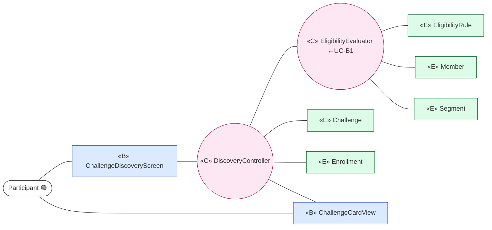
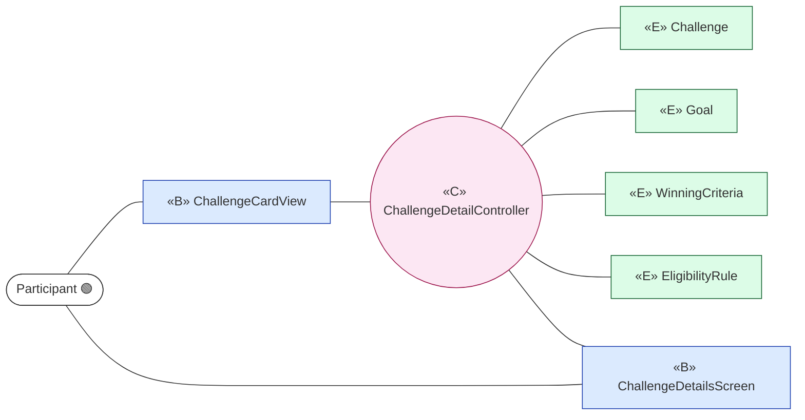
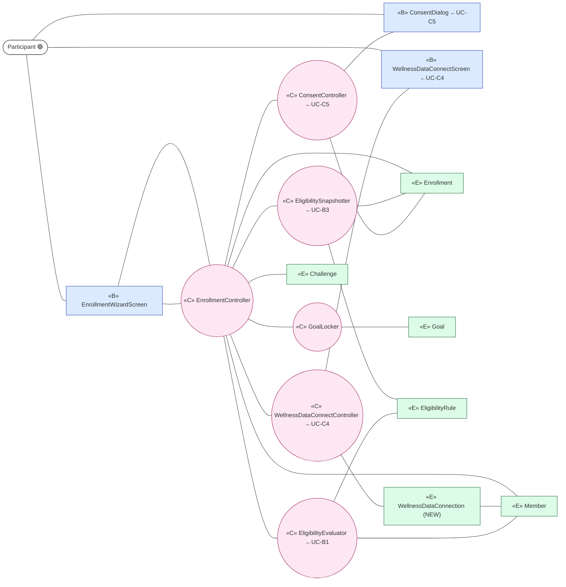
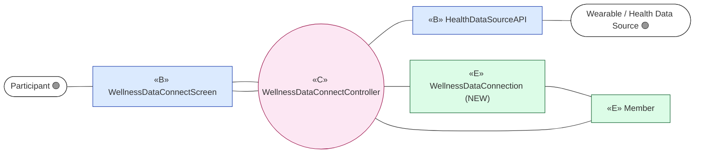
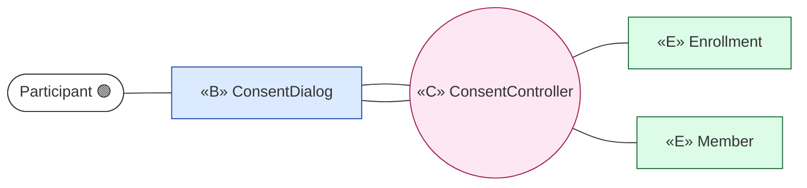
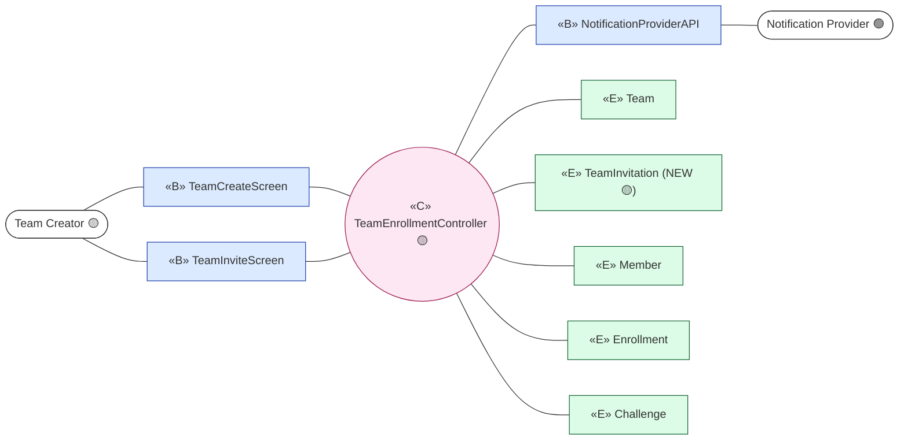
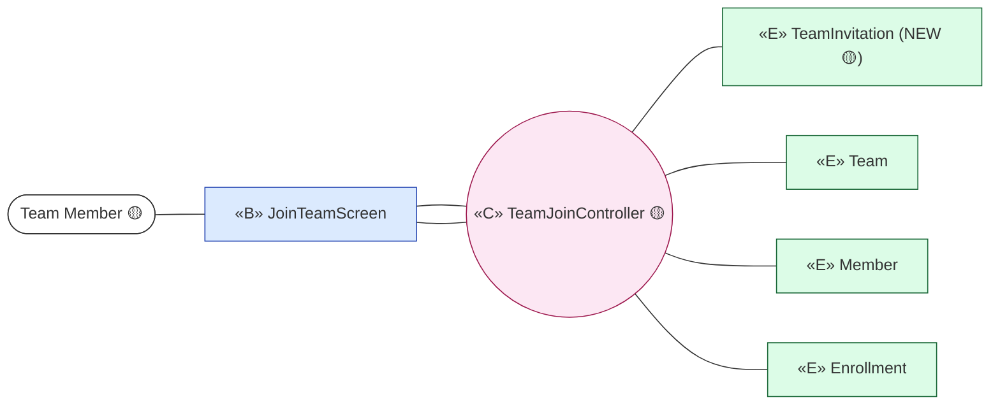
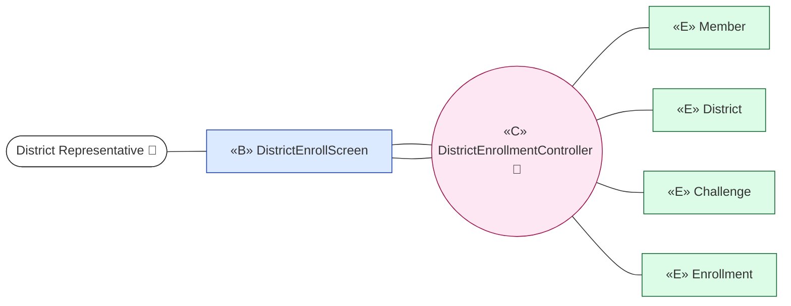

# ICONIX Step 2 — Robustness Analysis: Package C "Discovery & Enrolment" (`enrolment`)

> **Process**: ICONIX (Rosenberg), use-case-driven. This is the **Step-2 robustness** deliverable for
> package **C. Discovery & Enrolment** (id `enrolment`, dominant phase 🟢 P1).
>
> **Robustness rules enforced** (the "object-oriented sanity check"):
> 1. **Actors** touch only **«B» boundary** objects (screens / external APIs).
> 2. **«B» boundary** and **«E» entity** objects **never talk to each other directly** — only through a **«C» control** object.
> 3. **«B»↔«C»** and **«C»↔«E»** and **«C»↔«C»** are legal; **«E»↔«E»** navigation is shown only where the domain model already associates them and a control is mediating the use case.
> 4. **Nouns** in the narrative map to **«E» entity** classes (sourced from `02-domain-model.md`); **verbs** map to **«C» control** (the controllers that will own behaviour in Step-3 sequence diagrams).
>
> **Traceability**: every object below is named so it back-links to a use-case sentence and forward-links to a
> Step-3 sequence message. Use-case IDs come from `01-use-cases.md`; entity classes come from `02-domain-model.md`.
>
> **Phase discipline**: UC-C1..C5 are 🟢 **P1 in scope**. UC-C6/C7 are 🟡 **P2**, UC-C8 is 🔵 **P3** — diagrams
> are included for forward-traceability but **tagged out of build scope** and use only P2/P3 entities.

---

## 0. Object Inventory for the package (reconciliation against the domain model)

### Boundary objects «B» (new in Step 2 — UI screens & external-system façades)
| Boundary | Kind | Touched by |
|---|---|---|
| `ChallengeDiscoveryScreen` | UI (dashboard banner + Wellness-module list) | Participant |
| `ChallengeCardView` | UI (the card element) | Participant |
| `ChallengeDetailsScreen` | UI | Participant |
| `EnrollmentWizardScreen` | UI (multi-step opt-in flow) | Participant |
| `ConsentDialog` | UI (conditions + name/initials choice) | Participant |
| `WellnessDataConnectScreen` | UI (Apple/Google Health link) | Participant |
| `HealthDataSourceAPI` | external-system façade | Wearable / Health Data Source |
| `NotificationProviderAPI` | external-system façade (team invite push/email) | Push/Email Notification Provider |
| `TeamCreateScreen` 🟡 | UI | Team Creator |
| `TeamInviteScreen` 🟡 | UI | Team Creator |
| `JoinTeamScreen` 🟡 | UI (invite link / code entry) | Team Member |
| `DistrictEnrollScreen` 🔵 | UI (derived/selected district) | District Representative |

### Control objects «C» (the verbs — controllers that own behaviour)
`DiscoveryController`, `ChallengeDetailController`, `EnrollmentController`, `ConsentController`,
`WellnessDataConnectController`, `EligibilityEvaluator` (reused from package B, UC-B1), `EligibilitySnapshotter`
(reused from package B, UC-B3), `GoalLocker`, `TeamEnrollmentController` 🟡, `TeamJoinController` 🟡,
`DistrictEnrollmentController` 🔵.

> `EligibilityEvaluator` and `EligibilitySnapshotter` are **package-B controls** invoked here via the
> `«include»` links the use-case overview already declares (`C3 → B1`, `C3 → B3`). They are not re-introduced as
> new owners; the enrolment robustness simply shows the control-to-control hand-off.

### Entity objects «E» (all reused from `02-domain-model.md` unless flagged NEW)
`Challenge`, `ChallengeRequest`(n/a here), `EligibilityRule`, `Enrollment`, `Goal`, `Member`, `Segment`,
`WinningCriteria`(read-only on the card), `Wallet`(n/a), `Team` 🟡, `District` 🔵.

### NEW entity classes surfaced by reconciling use-case text against the domain model
The domain model (`02-domain-model.md`) has **no class** for two nouns that the package-C narratives depend on:

1. **`TeamInvitation`** 🟡 (P2) — UC-C6 says the creator "invites users via push/email (**unique link + code**)" and
   UC-C7 says a member "opens the **invite link** or enters the **code**". `Team` carries a single `inviteCode`
   attribute, but a *per-invitee, trackable, expirable* invitation artifact (the unique link, its target email/phone,
   its accepted/pending state) is not modelled. This is a genuine missing entity, tagged **P2** (out of P1 build scope).
2. **`WellnessDataConnection`** 🟢 (P1) — UC-C4/UC-C3 require connecting a Health Data Source so "goal metrics can be
   ingested", with an explicit **failure/denied** state (C4.1). `Member.wellnessDataConnected` is only a **boolean
   flag**; the *connection itself* (provider = Apple/Google, scopes granted, status connected/denied/pending, the link
   that lets UC-D1 ingest) has no class. Recommend promoting the boolean to a first-class **`WellnessDataConnection`**
   entity owned by `Member`. Tagged **P1** — it is in build scope.

> Both are **candidates to fold back into `02-domain-model.md`** (the backward-traceability obligation). Until then
> they are introduced here at robustness time and listed as `newClasses` in this step's output.

---

## UC-C1 Discover Challenges 🟢 P1

**Narrative basis**: Participant sees enrolled + new *Challenges* as dashboard banner/featured section and inside the
Wellness module; each *Challenge Card* shows type, description, goals, duration, rewards+redemption; completed
challenges appear historical. Alt C1.1 no eligible challenges → empty/teaser.

- **«B»**: `ChallengeDiscoveryScreen`, `ChallengeCardView`
- **«C»**: `DiscoveryController`, `EligibilityEvaluator` (← UC-B1, decides which challenges are visible)
- **«E»**: `Challenge`, `EligibilityRule`, `Member`, `Enrollment` (to mark already-enrolled cards), `Segment`

*Alt course C1.1*: `DiscoveryController` finds zero eligible `Challenge` → renders empty/teaser state on
`ChallengeDiscoveryScreen` (no entity write).

---

## UC-C2 View Challenge Details 🟢 P1

**Narrative basis**: Participant taps a *Challenge Card* to view full details before enrolling.

- **«B»**: `ChallengeCardView` (tap source), `ChallengeDetailsScreen`
- **«C»**: `ChallengeDetailController`
- **«E»**: `Challenge`, `Goal` (goals summary), `WinningCriteria` (rewards mapping shown read-only), `EligibilityRule`

---

## UC-C3 Enroll (Individual) 🟢 P1 — the package keystone

**Narrative basis**: Participant elects to enroll (strictly **opt-in**). Before confirming: review duration &
participation structure, view goals summary, review leaderboard-visibility rules, provide name/initials consent
(→ UC-C5), validate contact + email, connect wellness data if missing (→ UC-C4). On confirm: assigned to *Challenge*;
eligibility + config snapshotted (→ UC-B3); goals **locked**. Alt: C3.1 not eligible → blocked; C3.2 no wellness
data → route to UC-C4; C3.3 consent declined → cannot enroll; C3.4 multi-challenge allowed; C3.5 goals locked.

This use case `«include»`s UC-B1, UC-B3, UC-C4, UC-C5 (per the overview), so its robustness diagram shows
hand-offs to those controls rather than re-implementing them.

- **«B»**: `EnrollmentWizardScreen` (the opt-in flow), and (via include) `ConsentDialog`, `WellnessDataConnectScreen`
- **«C»**: `EnrollmentController` (orchestrator), `EligibilityEvaluator` (←B1), `EligibilitySnapshotter` (←B3),
  `ConsentController` (←C5), `WellnessDataConnectController` (←C4), `GoalLocker`
- **«E»**: `Enrollment` (created), `Challenge`, `Member` (contact/email validation), `Goal` (locked),
  `EligibilityRule`, `WellnessDataConnection` **(NEW)**

*Alt courses*:
- **C3.1** `EligibilityEvaluator` returns not-eligible → `EnrollmentController` blocks; no `Enrollment` created.
- **C3.2** `Member.wellnessDataConnected` false / no `WellnessDataConnection` → `EnrollmentController` routes to
  `WellnessDataConnectController` (UC-C4) before confirm.
- **C3.3** `ConsentController` reports declined → enrollment cannot complete (NFR-1).
- **C3.4** multi-challenge allowed → `EnrollmentController` does not check for existing active `Enrollment`.
- **C3.5** on confirm `GoalLocker` sets `Goal.locked` for the snapshotted goal set (immutable for duration).

---

## UC-C4 Connect Wellness Data 🟢 P1

**Narrative basis**: Participant connects **Wearable/Health Data Source** (Apple/Google Health) so goal metrics can
be ingested. Alt C4.1 connection fails/denied → proceed but device-dependent goals unmet until connected.

- **«B»**: `WellnessDataConnectScreen` (Participant-facing), `HealthDataSourceAPI` (external system façade)
- **«C»**: `WellnessDataConnectController`
- **«E»**: `WellnessDataConnection` **(NEW)**, `Member`

*Alt course C4.1*: `HealthDataSourceAPI` returns denied/failed → `WellnessDataConnectController` writes
`WellnessDataConnection.status = denied`, leaves `Member.wellnessDataConnected = false`; UC-C3 still proceeds.

---

## UC-C5 Provide Participation Consent 🟢 P1

**Narrative basis**: Participant records consent to competition conditions and chooses leaderboard display:
full name OR initials only. Alt C5.1 consent withheld → enrollment cannot complete.

- **«B»**: `ConsentDialog`
- **«C»**: `ConsentController`
- **«E»**: `Enrollment` (stores `leaderboardConsent` = name/initials), `Member`

*Alt course C5.1*: `ConsentController` records withheld → signals `EnrollmentController` (UC-C3) to block; no
`leaderboardConsent` persisted.

---

## UC-C6 Enroll as / Create Team 🟡 P2 *(out of P1 build scope — forward-traceability only)*

**Narrative basis**: Participant creates a *Team*, names it, becomes **Team Creator**; invites users via push/email
(unique link + code). Team active once ≥1 member enrolled. Alt C6.1 size cap; C6.2 creator removes member; C6.3
participation mode locked once challenge begins.

- **«B»**: `TeamCreateScreen`, `TeamInviteScreen`, `NotificationProviderAPI` (push/email invite delivery)
- **«C»**: `TeamEnrollmentController`
- **«E»**: `Team`, `TeamInvitation` **(NEW, P2)**, `Member`, `Enrollment`, `Challenge`

---

## UC-C7 Join Existing Team 🟡 P2 *(out of P1 build scope — forward-traceability only)*

**Narrative basis**: A **Team Member** opens the invite link or enters the *code* during enrollment to join a *Team*.
Alt C7.1 team at max → join prevented; C7.2 already in a team for this challenge → cannot join a second.

- **«B»**: `JoinTeamScreen` (invite link / code entry)
- **«C»**: `TeamJoinController`
- **«E»**: `TeamInvitation` **(NEW, P2)**, `Team`, `Member`, `Enrollment`

*Alt courses*: C7.1 `TeamJoinController` reads `Team.maxSize` reached → prevents join. C7.2 controller finds an
existing `Enrollment.as Team` for this `Challenge` → blocks second join (one-team rule).

---

## UC-C8 Enroll Representing District 🔵 P3 *(out of P1 build scope — forward-traceability only)*

**Narrative basis**: **District Representative** enrolls assigning a *District*: address-derived (displayed +
confirmed) or user-selected from eligible list; selection locked. Alt C8.1 derived district incorrect → select
another; C8.2 one district per challenge, no mid-challenge switch, leaving freezes contribution.

- **«B»**: `DistrictEnrollScreen`
- **«C»**: `DistrictEnrollmentController`
- **«E»**: `District`, `Enrollment`, `Member` (districtAddress → derivation), `Challenge`

*Alt courses*: C8.1 derived `District` wrong → `DistrictEnrollmentController` lets rep select another from eligible
list. C8.2 controller enforces one `District` per `Enrollment` per `Challenge`; locks selection.

---

## Robustness invariant check (self-audit)

| Rule | Result |
|---|---|
| Actor touches only «B» | PASS — every actor edge terminates on a boundary object. |
| No «B»↔«E» direct edge | PASS — all boundary→entity paths pass through a control. |
| Nouns→«E», verbs→«C» | PASS — controllers are all verb-named (Discover, Evaluate, Connect, Consent, Lock, Snapshot, Enroll, Join). |
| Includes shown as control hand-off | PASS — UC-C3 delegates to B1/B3/C4/C5 controls, not duplicate logic. |
| Phase tags preserved | PASS — C1–C5 🟢 P1; C6/C7 🟡 P2; C8 🔵 P3, each labelled and using only its phase's entities. |

## Backward-traceability actions (feed into `02-domain-model.md`)
1. Add **`WellnessDataConnection`** [P1] — owned by `Member` (`1 → 0..*`), attributes `provider(apple/google)`,
   `status(connected/denied/pending)`, `scopes`, `connectedDate`; replaces the bare `Member.wellnessDataConnected`
   boolean and gives UC-D1 ingestion a real source anchor.
2. Add **`TeamInvitation`** [P2] — owned by `Team` (`1 → 0..*`), attributes `uniqueLink`, `code`, `inviteeEmail`,
   `inviteePhone`, `status(pending/accepted/expired)`; the per-invitee artifact UC-C6/C7 require beyond `Team.inviteCode`.
