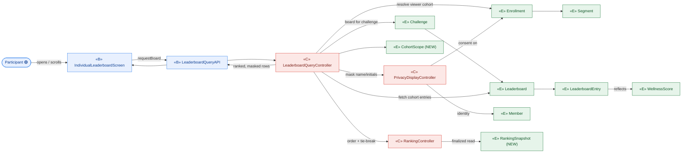
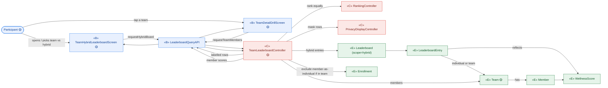

# ICONIX Step 2 — Robustness Analysis: **E. Leaderboard** (`leaderboard`)

**Process**: ICONIX (Rosenberg), use-case-driven, milestone-driven.
**Package**: E. Leaderboard (id `leaderboard`).
**Inputs reconciled**: `01-use-cases.md` (UC-E1…E4 narratives) ⇄ `02-domain-model.md` (entity classes).
**Phase scope**: 🟢 **P1 = UC-E1 only** (individual-based). 🟡 UC-E2, UC-E4 = P2. 🔵 UC-E3 = P3. P2/P3 diagrams are modelled for forward-traceability and tagged; they are **not** in the P1 build set.

> **ICONIX robustness rules enforced**
> 1. Actors touch **only** boundary objects.
> 2. Boundary ↔ entity **never** talk directly — always mediated by a control.
> 3. Boundary objects talk only to actors + controls.
> 4. Controls talk to boundary, entities, and other controls.
> 5. Entities talk only to controls (and, for read-only navigation, other entities).
> 6. Grammatical rule: **nouns → entity/boundary**, **verbs → control**.
>
> **Legend**: «B» = boundary (screen/API the actor touches) · «C» = control (verb/logic/controller-to-be) · «E» = entity (domain class from `02-domain-model.md`; **bold-new** = introduced here).

---

## 0. Package-level object inventory (traceability spine)

### Boundary objects (actor-facing)
| Boundary | Touched by | Used in |
|---|---|---|
| IndividualLeaderboardScreen | Participant | UC-E1 |
| LeaderboardQueryAPI | (system, fronts all reads) | UC-E1/E2/E3 |
| TeamHybridLeaderboardScreen 🟡 | Participant | UC-E2 |
| TeamDetailDrillScreen 🟡 | Participant | UC-E2 |
| DistrictLeaderboardScreen 🔵 | Participant | UC-E3 |
| DistrictDrillScreen 🔵 | Participant | UC-E3 |
| ParticipantProfileScreen 🟡 | Participant | UC-E4 |

### Control objects (the controllers behaviour will live in)
| Control | Owns behaviour | Phase |
|---|---|---|
| **LeaderboardQueryController** | resolve viewer cohort, fetch ranked entries, mark current-user/top-3, decide refresh-vs-finalized | 🟢 P1 |
| **PrivacyDisplayController** | apply name-vs-initials consent masking per entry | 🟢 P1 |
| **RankingController** | order entries by score, apply tie-break at finalization | 🟢 P1 |
| **TeamLeaderboardController** 🟡 | build team-only/hybrid rows, enforce "team members not also individuals", drill to members | 🟡 P2 |
| **DistrictLeaderboardController** 🔵 | build two-level district→participant ranking | 🔵 P3 |
| **ProfileViewController** 🟡 | assemble another member's badges + title + active score | 🟡 P2 |

### Entity objects (from domain model)
`Leaderboard`, `LeaderboardEntry`, `WellnessScore`, `Member`, `Enrollment`, `Challenge`, `Segment` (cohort), `Team` 🟡, `District` 🔵, `Badge`/`BadgeAward` 🟡-in-profile, `Title`/`MemberProgression` 🟡.

### NEW entity classes introduced in this step
| New class | Why the use-case text forced it | Where surfaced |
|---|---|---|
| **CohortScope** | UC-E1 says the board is "cohort-limited" / NFR-2; `Leaderboard.scope` only stores the *kind* (individual/team/…), not *which* viewers share a board. A reify-able cohort key (the Segment slice a viewer's board is limited to) is needed so the control can fetch only same-cohort entries. | UC-E1, UC-E3 |
| **RankingSnapshot** | UC-E1.2 / UC-E2 / UC-E3 "at challenge end → positions final, tie-breaks applied". The *finalized* ordering (with tie-break outcome) is a distinct, immutable artifact from the live `Leaderboard` (which has `finalized_flag` but no frozen ordered rows). Needed so finalized ranks are traceable and never recomputed. | UC-E1, UC-E2, UC-E3 |

> Reconciliation note: `LeaderboardEntry.displayName` already absorbs the name/initials value, but the **decision** of which to show is behaviour → it belongs to `PrivacyDisplayController`, not the entity. No new entity needed for masking. UC-E4's "current active-challenge score" maps to existing `WellnessScore` (via the target member's active `Enrollment`) — no new entity.

---

## UC-E1 View Individual Leaderboard 🟢 P1 — realizes P1-8, §Individual Leaderboard, NFR-2

**Basic course** (robustness reading): Participant opens the leaderboard screen → controller resolves the viewer's **cohort** (from their `Enrollment`/`Segment` slice) → fetches that `Challenge`'s `Leaderboard` entries limited to the cohort → ranks by `WellnessScore` → privacy-masks each row per consent → flags current-user row + top-3 → returns to screen. Refresh is real-time/weekly while active; **finalized** at challenge end (E1.2) reads the immutable `RankingSnapshot` with tie-breaks applied (E1.1 masking still applies).

**Rule branches**: E1.1 consent=initials → `PrivacyDisplayController` renders initials. E1.2 challenge end → `RankingController` produced a `RankingSnapshot`; controller serves frozen ranks, no live refresh.



---

## UC-E2 View Team / Hybrid Leaderboard 🟡 P2 — realizes P2-9, §Team-Based & Hybrid Leaderboard

**Basic course**: Participant opens team/hybrid board → `TeamLeaderboardController` builds rows where each row is a `LeaderboardEntry` of `entityType` individual **or** team (E2.1 ranked equally by their respective score) → enforces E2.2 (a member competing in a team must **not** also appear as an individual) → labels rows → on tap-team, drills to `Team` members each with their `WellnessScore`. Privacy + ranking controls reused from E1.



---

## UC-E3 View District Leaderboard 🔵 P3 — realizes P3-2, §District-Based Leaderboard

**Basic course**: Participant opens district board → `DistrictLeaderboardController` builds the **outer** ranked list of `District` entries (rank, name, district `WellnessScore`, participantCount, top-3) → E3.1 individuals are **never** shown at the outer level → on selecting a district, drills to the **inner** ranked participant list (each participant's `WellnessScore`, privacy-masked). Outer cohort is district-wide (`CohortScope`); finalized ordering via `RankingSnapshot`.

```mermaid
graph LR
  classDef b fill:#E8F0FE,stroke:#1A73E8,color:#0B3D91;
  classDef c fill:#FCE8E6,stroke:#D93025,color:#7A1E16;
  classDef e fill:#E6F4EA,stroke:#137333,color:#0B5323;

  PART([Participant 🔵]):::b
  SCR["«B» DistrictLeaderboardScreen 🔵"]:::b
  DRILL["«B» DistrictDrillScreen 🔵"]:::b
  API["«B» LeaderboardQueryAPI"]:::b

  DLC["«C» DistrictLeaderboardController 🔵"]:::c
  RANK["«C» RankingController"]:::c
  PRIV["«C» PrivacyDisplayController"]:::c

  LB["«E» Leaderboard (scope=district)"]:::e
  LBE["«E» LeaderboardEntry"]:::e
  DIST["«E» District 🔵"]:::e
  ENR["«E» Enrollment"]:::e
  MEM["«E» Member"]:::e
  WS["«E» WellnessScore"]:::e
  SNAP["«E» RankingSnapshot (NEW)"]:::e

  PART -->|opens district board| SCR
  SCR -->|requestDistrictBoard| API
  API --> DLC
  DLC -->|outer entries = districts only| LB
  LB --> LBE
  LBE -->|district entry| DIST
  DIST -->|district avg| WS
  DLC -->|rank districts + tie-break| RANK
  RANK -->|finalized read| SNAP
  DLC -->|outer list| API
  API --> SCR
  PART -->|select a district| DRILL
  DRILL -->|requestDistrictMembers| API
  API --> DLC
  DLC -->|inner participants| DIST
  DIST -->|represented by| ENR
  ENR --> MEM
  MEM --> WS
  DLC -->|mask inner rows| PRIV
  DLC -->|inner ranked list| API
  API --> DRILL
```



---

## UC-E4 View Participant Profile (badges & title) 🟡 P2 — realizes P2-11

**Basic course**: Participant taps another participant's row on a leaderboard → `ProfileViewController` loads that `Member`'s earned `BadgeAward`s (each instance-of a `Badge`), their current `Title` (via `MemberProgression`, highest unlocked), and their current active-challenge `WellnessScore` (via that member's active `Enrollment`) → returns to the profile screen. Privacy masking reused (initials-only consent still hides full name on the profile header).

```mermaid
graph LR
  classDef b fill:#E8F0FE,stroke:#1A73E8,color:#0B3D91;
  classDef c fill:#FCE8E6,stroke:#D93025,color:#7A1E16;
  classDef e fill:#E6F4EA,stroke:#137333,color:#0B5323;

  PART([Participant 🟡]):::b
  PROF["«B» ParticipantProfileScreen 🟡"]:::b
  API["«B» LeaderboardQueryAPI"]:::b

  PVC["«C» ProfileViewController 🟡"]:::c
  PRIV["«C» PrivacyDisplayController"]:::c

  MEM["«E» Member"]:::e
  BA["«E» BadgeAward"]:::e
  BDG["«E» Badge"]:::e
  PROG["«E» MemberProgression"]:::e
  TTL["«E» Title 🟡"]:::e
  ENR["«E» Enrollment"]:::e
  WS["«E» WellnessScore"]:::e

  PART -->|tap participant row| PROF
  PROF -->|requestProfile(memberId)| API
  API --> PVC
  PVC -->|load member| MEM
  PVC -->|earned badges| BA
  BA -->|instance of| BDG
  PVC -->|progression| PROG
  PROG -->|highest title| TTL
  PVC -->|active enrollment score| ENR
  ENR -->|yields| WS
  PVC -->|mask header name| PRIV
  PRIV --> MEM
  PVC -->|profile payload| API
  API --> PROF
```

---

## Forward/backward traceability (this step)

| Use case | Boundary | Controls | Entities (incl. NEW) | Realizes |
|---|---|---|---|---|
| UC-E1 🟢 | IndividualLeaderboardScreen, LeaderboardQueryAPI | LeaderboardQueryController, RankingController, PrivacyDisplayController | Enrollment, Segment, **CohortScope**, Challenge, Leaderboard, LeaderboardEntry, WellnessScore, Member, **RankingSnapshot** | P1-8, §Individual Leaderboard, NFR-2 |
| UC-E2 🟡 | TeamHybridLeaderboardScreen, TeamDetailDrillScreen, LeaderboardQueryAPI | TeamLeaderboardController, RankingController, PrivacyDisplayController | Leaderboard, LeaderboardEntry, Team, Member, WellnessScore, Enrollment | P2-9 |
| UC-E3 🔵 | DistrictLeaderboardScreen, DistrictDrillScreen, LeaderboardQueryAPI | DistrictLeaderboardController, RankingController, PrivacyDisplayController | Leaderboard, LeaderboardEntry, District, Enrollment, Member, WellnessScore, **RankingSnapshot** | P3-2 |
| UC-E4 🟡 | ParticipantProfileScreen, LeaderboardQueryAPI | ProfileViewController, PrivacyDisplayController | Member, BadgeAward, Badge, MemberProgression, Title, Enrollment, WellnessScore | P2-11 |

**Sanity check (golden thread)**: no actor touches an entity directly; every entity access is mediated by a control; nouns landed in entity/boundary, verbs in control. NEW classes **CohortScope** and **RankingSnapshot** are flagged for back-propagation into `02-domain-model.md` (currently absent there).
