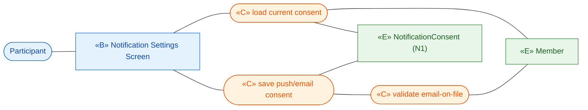
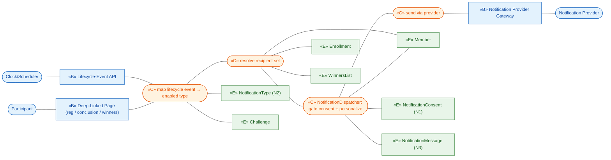
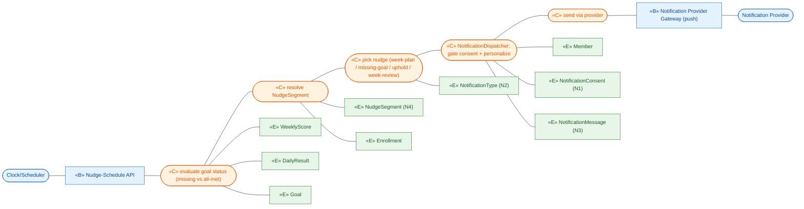
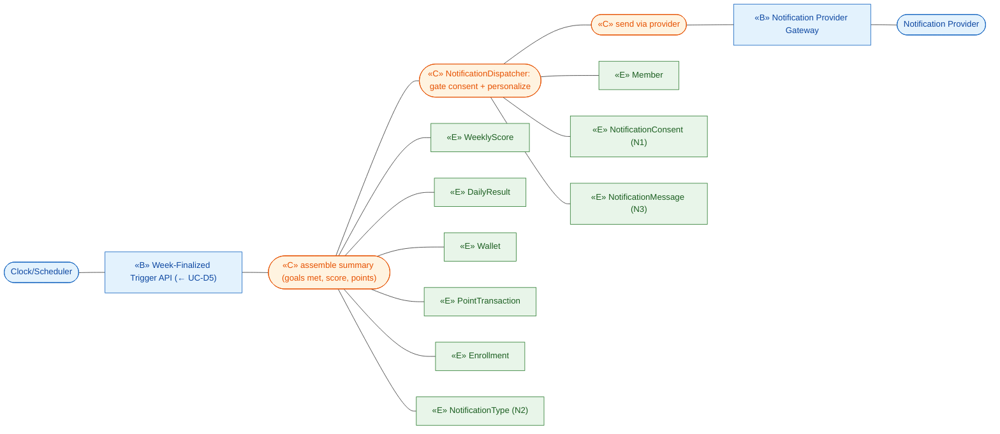
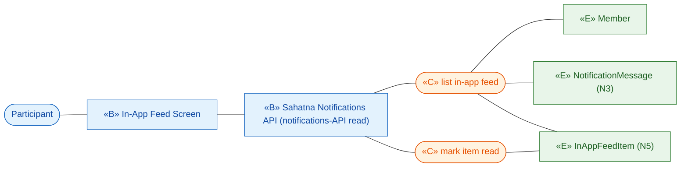

# ICONIX Step 2 — Robustness Analysis: Package H — Notification & Nudges (`notification`)

**Process**: ICONIX (Rosenberg) — use-case-driven, milestone-driven. This is the **Step-2**
deliverable for the cross-cutting (`⚪ XC`) Notification package. Each use case is decomposed into
**boundary** (screens / APIs the actor touches), **control** (verbs, logic, the controllers that will
own behaviour) and **entity** (domain classes from `02-domain-model.md`).

**Phase scope**: All four UCs in this package are `🟢 P1` (cross-cutting). Phase-2/3 fan-out
(team-add notifications, district announcements, title-unlock nudges) is tagged inline and **out of
build scope**.

**Robustness rules obeyed** (Rosenberg):
1. Actors touch only **boundary**.
2. **Boundary** and **entity** never talk directly — only through **control**.
3. Boundary ↔ control, control ↔ control, control ↔ entity are the only legal links.
4. **Nouns → entity**, **verbs → control**.

**Traceability spine**: `use case ⇄ domain class ⇄ robustness object ⇄ (later) sequence message`.
Each diagram lists the upstream UC (Step 1) and the entities it reconciles against the domain model.

---

## 0. New Entity Classes introduced in this package

The Step-1 domain model (`02-domain-model.md`) has **no notification-side nouns** — consent lived as
two boolean attributes on `Member` and "enabled notification types" was only mentioned in passing in
UC-A4. Robustness analysis surfaces the following **NEW entity classes** that must be back-ported into
the domain model for forward/backward traceability:

| # | New Entity | Scope | Why surfaced | Key attributes (analysis-level) | Reconciles UC |
|---|-----------|-------|--------------|--------------------------------|----------------|
| N1 | **NotificationConsent** | P1 | UC-H1 manages push/email consent + "address by name" rule as first-class state, not buried as two `Member` flags; the consent **gate** every send checks. | `memberRef`, `pushEnabled`, `emailEnabled`, `emailOnFile`, `lastUpdated` | H1, H2, H3, H4 |
| N2 | **NotificationType** | P1 | UC-A4 lets the operator enable per-challenge notification types; UC-H2/H3 send "configured" types. This is the per-challenge **enable-flag + template binding**, distinct from a sent message. | `typeKey` (initiation / mid-reminder / end / winners / week-plan / missing-goal / uphold / week-review / weekly-summary), `enabledForChallenge_flag`, `channel_push_email`, `deepLinkTarget`, `templateRef` | A4, H2, H3, H4 |
| N3 | **NotificationMessage** | P1 | UC-H2/H3/H4 each **produce a delivered message** (with personalization + deep link). Needed for the audit trail ("every nudge respects consent and addresses by name") and tap-through routing. | `messageId`, `memberRef`, `challengeRef`, `typeRef`, `channel`, `body_personalized`, `deepLink`, `sentTimestamp`, `deliveryStatus`, `suppressedReason` | H2, H3, H4 |
| N4 | **NudgeSegment** | P1 | UC-H3 targets "participant segments" by goal status (missing goals vs meeting all). Reuses the existing `Segment` concept but the **targeting-by-progress** axis is new; modelled as a derived selector, not persisted membership. | `segmentKey` (missing-goal / on-track / all-met), `goalStatusPredicate`, `weekRef` | H3 |
| N5 | **InAppFeedItem** | P1 *(added in architecture enhancements)* | E4 — the `Sahatna Notifications API` (BFF) **exposes an in-app feed read-side** to the app; a delivered/suppressed `NotificationMessage` surfaces as a read/unread feed entry the Participant pulls. Read-model projection over `NotificationMessage`, not a separate write store. | `feedItemId`, `memberRef`, `messageRef`, `title`, `body`, `deepLink`, `readStatus`, `createdAt` | H5 |

> **Reused, not new**: `Member`, `Challenge`, `Enrollment`, `WeeklyScore`, `DailyResult`, `Goal`,
> `Wallet`, `PointTransaction`, `WinnersList` already exist in `02-domain-model.md`. The package
> consumes them read-only; it never mutates scoring/ledger state (a control rule for the package).

---

## H. Controllers identified (own the behaviour)

| Controller | Owns | Driven by |
|-----------|------|-----------|
| **ConsentController** | read/validate/persist push & email consent; expose the consent gate | UC-H1 |
| **NotificationDispatcher** | the single **consent + email-on-file gate**, personalization ("address by name"), channel selection, hand-off to the Notification Provider, write `NotificationMessage` | UC-H2, H3, H4 (shared) |
| **LifecycleNotificationController** | map a challenge-lifecycle event → enabled `NotificationType` → recipient set → dispatch | UC-H2 |
| **ProgressNudgeController** | evaluate goal-status, resolve `NudgeSegment`, pick the right weekly nudge, dispatch | UC-H3 |
| **WeeklySummaryController** | on week-finalization trigger, assemble per-member summary (goals met, score, points), dispatch | UC-H4 |
| **InAppFeedController** *(added in architecture enhancements)* | E4 read-side — serve the in-app notification feed (list, mark-read) from the `NotificationMessage` log via the `Sahatna Notifications API` | UC-H5 |

`NotificationDispatcher` is the **shared control** all three send-UCs funnel through, so the
consent rule (NFR-1) and the by-name rule are enforced in exactly one place.

**E4 — Sahatna Notifications API (BFF) boundary**: the `Sahatna Notifications API` is the single
notification BFF surface. It **owns outbound delivery** — `NotificationDispatcher` → `C_SEND` hands
off through it to the external **Notification Provider** (push / email / in-app, consent-gated) — AND
it **exposes a notifications API (in-app feed)** read-side to the app (UC-H5, `Mobile → APIM-north →
Sahatna Notifications API`). In the send-UC diagrams below, the `«B» Notification Provider Gateway`
node is realized by the `Sahatna Notifications API` BFF outbound surface.

---

## UC-H1 — Manage Notification Consent 🟢 P1
*Realizes P1-11, NFR-1, §Communication Enablement · Actor: **Participant***

**Boundary**: Notification Settings Screen.
**Control**: `ConsentController` (load consent, save consent, validate email-on-file).
**Entity**: `NotificationConsent` (N1), `Member`.

**Alternate-course objects**: `C_VALID` → if no email on file (H1.2) sets `emailOnFile=false`
on `NotificationConsent` so the email channel is skipped downstream. H1.1 (no consent) is the
gate-state every other UC reads.

---

## UC-H2 — Send Challenge-Lifecycle Notification 🟢 P1
*Realizes P1-11, P1-12, §Nudges, §Challenge Conclusion · Actors: **Clock/Scheduler** (initiation,
mid, end), **Notification Provider** (delivery). Triggered by UC-A7, UC-I1, UC-I3.*

**Boundary**: Lifecycle-Event API (in, from Clock / lifecycle UCs), Notification Provider Gateway
(out), Deep-Linked Page (tap target: registration / conclusion / winners).
**Control**: `LifecycleNotificationController`, `NotificationDispatcher` (shared gate).
**Entity**: `NotificationType` (N2), `NotificationConsent` (N1), `NotificationMessage` (N3),
`Challenge`, `Enrollment`, `Member`, `WinnersList` (winners event only).

**Alternate-course objects**: H2.1 (per-challenge nudge type disabled) → `C_LIFE` reads
`NotificationType.enabledForChallenge_flag`; disabled ⇒ no recipient resolution, no message.
Tap on a delivered push hits `B_PAGE`, which re-enters via `C_LIFE`'s deep-link target.

---

## UC-H3 — Send Progress Nudge 🟢 P1
*Realizes P1-11, §Nudges (Challenge progress) · Actors: **Clock/Scheduler** (weekly cadence,
3-days-in reminder), **Notification Provider** (delivery, push-only).*

**Boundary**: Nudge-Schedule API (in, from Clock), Notification Provider Gateway (out, push).
**Control**: `ProgressNudgeController`, `NotificationDispatcher` (shared gate).
**Entity**: `NudgeSegment` (N4), `WeeklyScore`, `DailyResult`, `Goal`, `Enrollment`, `Member`,
`NotificationType` (N2), `NotificationConsent` (N1), `NotificationMessage` (N3).

**Alternate-course objects**: H3.1 (targeting depends on goal status) is `C_EVAL` → `C_SEG`,
producing the `missing-goal` vs `all-met` `NudgeSegment`; `C_PICK` then selects the matching
`NotificationType` (e.g. *missing-goal reminder 3 days in* vs *uphold-performance*).

---

## UC-H4 — Send Weekly Summary 🟢 P1
*Realizes P1-6, §Nudges · Trigger: **UC-D5 Finalize Weekly Score** (← Clock at week-close).*

**Boundary**: Week-Finalized Trigger API (in, from UC-D5), Notification Provider Gateway (out).
**Control**: `WeeklySummaryController`, `NotificationDispatcher` (shared gate).
**Entity**: `WeeklyScore`, `DailyResult`, `Wallet`, `PointTransaction`, `Enrollment`, `Member`,
`NotificationType` (N2), `NotificationConsent` (N1), `NotificationMessage` (N3).

**Alternate-course objects**: G1.4 / points feature-flag off ⇒ `C_ASSEM` reads `Wallet`/
`PointTransaction` only when `Challenge.pointsFeatureFlag` is on; otherwise the points line is
omitted (summary still sent with goals-met + score).

---

## UC-H5 — Read In-App Notification Feed 🟢 P1  *(added in architecture enhancements — E4)*
*Realizes P1-11, §Communication Enablement (in-app feed) · Actor: **Participant***

**Boundary**: In-App Feed Screen (Mobile), `Sahatna Notifications API` (notifications-API read surface, via APIM-north).
**Control**: `InAppFeedController` (list feed, mark-read).
**Entity**: `InAppFeedItem` (N5), `NotificationMessage` (N3), `Member`.

**Alternate-course objects**: H5.1 (empty feed) → `C_LIST` returns no `InAppFeedItem`; H5.2 (tap feed
item) re-uses the same deep-link routing as a tapped push (UC-H2 `B_PAGE`). The feed is a read-model
projection over `NotificationMessage` — no scoring/ledger state is mutated.

---

## Robustness invariant check (per Rosenberg)

| Rule | Status |
|------|--------|
| Actors (Participant, Clock, Notification Provider) touch only boundary | ✅ all actor links terminate on a «B» node (incl. UC-H5 Participant → In-App Feed Screen) |
| In-app feed read routes screen → API boundary → control → entity (E4) | ✅ `B_FEED` → `B_NAPI` (Sahatna Notifications API) → `C_LIST`/`C_READ` → `E_FEED`/`E_MSG`; no «B»→«E» shortcut |
| Boundary never talks to entity directly | ✅ every «B»→«E» path routes through a «C» node |
| Entity never talks to entity directly | ✅ all inter-entity reads mediated by control |
| Nouns→entity, verbs→control | ✅ every «C» node is a verb phrase; every «E» is a noun |
| Shared consent gate | ✅ H2/H3/H4 all funnel through `NotificationDispatcher` |

## Forward-traceability handoff (to Step 3 sequence)
- Each `«C»` verb node becomes a controller operation / message in the sequence diagrams.
- `NotificationDispatcher` is the convergence point — model it once, reuse in H2/H3/H4 sequences.
- The 4 new entities (N1–N4) must be **added to `02-domain-model.md`** before Step-3 so no
  sequence message references an orphan class. (Backward-traceability gap flagged.)
- E4 adds `InAppFeedItem` (N5) and `InAppFeedController` for UC-H5 (in-app feed read via the
  `Sahatna Notifications API`); the API also realizes the outbound `«B» Notification Provider Gateway`.
