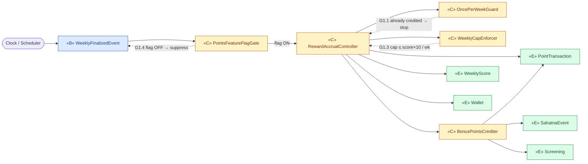
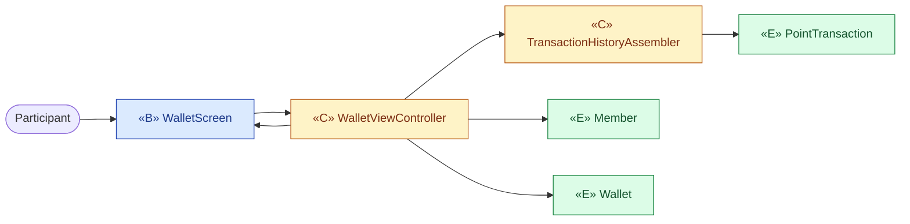
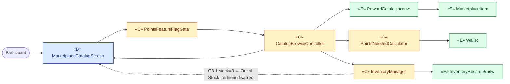
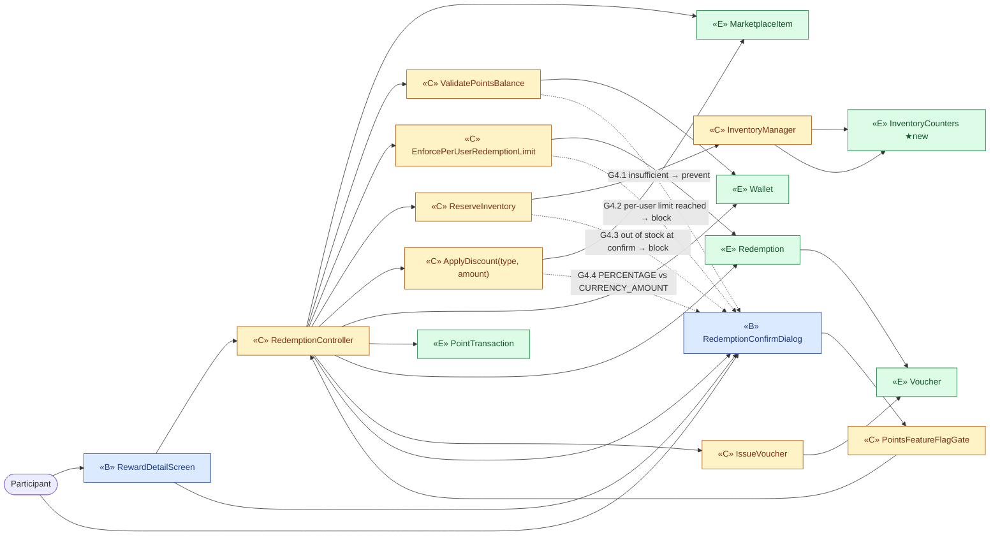
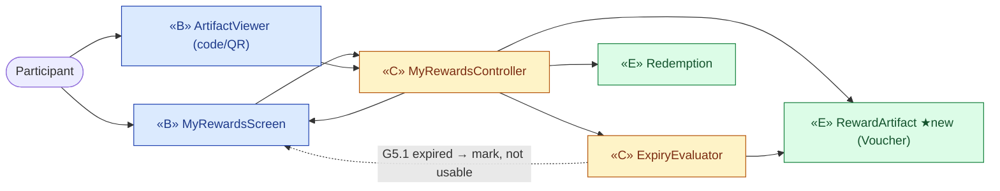
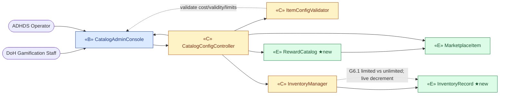
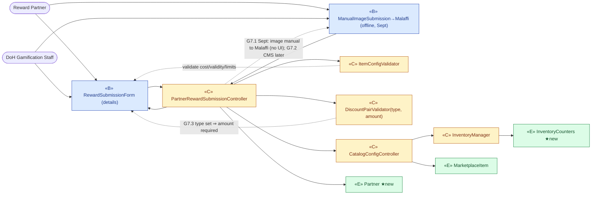

# ICONIX Step 2 — Robustness Analysis

## Package G — Redeem / Marketplace (`redeem-marketplace`)  🟢 P1 (feature-flagged)

**Process**: ICONIX (Rosenberg) — Robustness analysis (the bridge between the use case and the sequence diagram).
**Source use cases**: `01-use-cases.md` §Package G (UC-G1…UC-G6).
**Source domain model**: `02-domain-model.md` (entity classes only — Member, Wallet, PointTransaction, MarketplaceItem, Redemption, Voucher, WeeklyScore, SahatnaEvent, Screening).

### Robustness object-type legend

| Stereotype | Mermaid tag | Meaning | ICONIX rule |
|---|---|---|---|
| **Boundary** | `«B»` | Screens / APIs the actor touches | Only thing an **actor** may talk to |
| **Control** | `«C»` | Verbs / logic / future controllers | Glue — the only thing that may join Boundary↔Entity |
| **Entity** | `«E»` | Domain classes from `02-domain-model.md` | Never talks to Boundary directly |

**The four ICONIX robustness rules enforced below**
1. **Actor** ⇄ **Boundary** only.
2. **Boundary** ⇄ **Control** (a boundary never touches another boundary).
3. **Control** ⇄ **Control**, **Control** ⇄ **Entity**, **Control** ⇄ **Boundary**.
4. **Entity** ⇄ **Control** only — **Boundary and Entity never talk directly**.
Nouns from the narrative → **Entity**; verbs/business rules → **Control**.

**Scope note**: Whole package is Phase-1 but gated behind the **points feature flag** (BRD: points suppressed for the Sept-2026 launch). Every flow therefore passes through a `«C» PointsFeatureFlagGate`. No Teams/Districts/Title/baseline-goal concepts appear in this package, so there are no P2/P3-tagged objects here. Winner-allocation and bonus-goal point sources (SahatnaEvent, Screening) ARE P1 and appear in UC-G1.

---

## Reconciliation against the domain model (NEW entity classes)

The use-case narratives name three nouns that have **no backing class** in `02-domain-model.md`. They are introduced here as new analysis-level entities and must be pushed back into Step-1:

| New entity | Why introduced | Narrative trace | Reconciliation |
|---|---|---|---|
| **RewardCatalog** | UC-G3 / UC-G6 speak of *"the Reward Catalog"* as a browsable, configurable collection. The domain model only has the leaf `MarketplaceItem`; there is no aggregate root that owns the items, carries "popular highlights", and is the thing Staff "configures". | UC-G3 "browses the *Reward Catalog*"; UC-G6 "Configure Reward **Catalog** & Inventory" | Add `RewardCatalog "1" *-- "0..*" MarketplaceItem`. |
| **RewardArtifact** | UC-G4/UC-G5 say the system *"generates a Reward Artifact (coupon/code/QR/voucher)"*. The model has `Voucher`, but the narrative's umbrella term covers coupon **and** QR **and** code **and** voucher. Treated as the generalization of `Voucher` (artifactType already on Voucher). | UC-G4 "generates a *Reward Artifact*"; UC-G5 "Reward Artifact" | Promote `Voucher` to a specialization of `RewardArtifact`, or rename — flagged for Step-1 decision. Kept distinct here to preserve narrative traceability. |
| **InventoryRecord** | UC-G3.1/UC-G4.3/UC-G6.1 require a *real-time decrementing stock count* with "Out of Stock" state and atomic decrement at confirm. `MarketplaceItem.inventoryLimit` is a static cap, not a live counter; the live count + reservation is a distinct concern. | UC-G3.1 "Inventory = 0 → Out of Stock"; UC-G6.1 "real-time decrement on redeem" | Add `MarketplaceItem "1" --> "1" InventoryRecord : stock`. (Folds into **InventoryCounters** in `02` — same concept: reserved/issued/remaining under totalInventoryLimit.) |
| **Partner** *(marketplace supplement)* | UC-G7 (BRD-SUPPLEMENT) introduces the **Reward Partner** that supplies reward details + image. For the Sept Challenge the image is submitted **manually to the Malaffi team** (no upload UI). `02` now carries `Partner` with `imageSubmissionMode(manualToMalaffi/CMS)`. | UC-G7 "partner provides reward image, manual to Malaffi" | Add `MarketplaceItem "0..*" --> "1" Partner : supplied by`. |
| **InventoryCounters** *(marketplace supplement)* | BRD-SUPPLEMENT enforces a **total inventory limit** via reserve→issue counters (reserved/issued/remaining) under concurrency — the same live-stock concern as `InventoryRecord`, now named per the supplement. | UC-G3.1/G4.3 stock; BRD-SUPPLEMENT inventory counters | Add `MarketplaceItem "1" --> "1" InventoryCounters : stock tracked by`. |

> Existing entities reused unchanged: **Member** (the Participant actor's profile), **Wallet**, **PointTransaction**, **MarketplaceItem** (now carrying the supplement's reward attributes incl. **rewardDiscountType** + **rewardDiscountAmount** as two separate fields), **Redemption**, **Voucher**, **WeeklyScore**, **SahatnaEvent**, **Screening**.

---

## Controllers identified (verbs → Control)

These control objects own behaviour and become candidate methods/controllers in Step-3 sequencing:

| Controller `«C»` | Owns (verb / business rule) | Used by |
|---|---|---|
| **PointsFeatureFlagGate** | Evaluate `pointsFeatureFlag`; suppress accrual & gate redemption when off (G1.4). | G1, G3, G4 |
| **RewardAccrualController** | Compute points = weeklyScore × 10; enforce once-per-week (G1.1), cap ≤1000/wk (G1.3), ignore retroactive change (G1.2); credit bonus (winner/event/screening) points. | G1 |
| **WalletViewController** | Assemble balance + lifetime earned/redeemed + transaction history. | G2 |
| **CatalogBrowseController** | List items, compute "points needed", flag popular, derive availability/"Out of Stock". | G3 |
| **RedemptionController** | Orchestrate redeem: validate balance (G4.1), check per-user/per-period limits (G4.2), re-check stock at confirm (G4.3), deduct points, decrement inventory, issue artifact, persist record. | G4 |
| **BalanceValidator** | Check current balance ≥ point cost. | G4 |
| **RedemptionLimitValidator** | Check per-user / per-period redemption constraints. | G4 |
| **InventoryManager** | Read/decrement/reserve live stock; expose stock status. | G3, G4, G6 |
| **ArtifactIssuer** | Generate coupon/code/QR/voucher artifact + expiry. | G4 |
| **MyRewardsController** | Retrieve redeemed artifacts, compute usable-vs-expired (G5.1). | G5 |
| **CatalogConfigController** | Add/edit/remove items, validity, limits, inventory — no code change (G6). | G6 |
| **ApplyDiscount** *(supplement)* | Apply the reward discount per `apply-discount(type, amount)` — branch PERCENTAGE vs CURRENCY_AMOUNT (G4.4). | G4 |
| **ReserveInventory** *(supplement)* | Reserve stock against `totalInventoryLimit` before issue (reserve→issue saga on InventoryCounters). | G4 |
| **ValidatePointsBalance** *(supplement)* | Validate wallet points balance ≥ point cost (alias/specialisation of BalanceValidator, named per supplement). | G4 |
| **IssueVoucher** *(supplement)* | Issue the Voucher/artifact with post-redemption expiry (alias of ArtifactIssuer, named per supplement). | G4 |
| **EnforcePerUserRedemptionLimit** *(supplement)* | Enforce per-user redemption limit (specialisation of RedemptionLimitValidator). | G4 |
| **PartnerRewardSubmissionController** *(supplement)* | Intake partner-submitted reward (details + image); route Sept-Challenge image manually to Malaffi; hand off to catalog config (G7). | G7 |

---

## UC-G1 — Accrue Reward Points 🟢 P1 (feature-flagged)

*Actor*: **Clock / Scheduler** (time-actor; triggered by week finalization ← UC-D5). No human boundary — the trigger arrives as an event boundary.
*Entities*: WeeklyScore, Wallet, PointTransaction, SahatnaEvent, Screening.

**Notes**: G1.2 (retroactive score change does not alter credited points) is enforced by `OncePerWeekGuard` — accrual is idempotent on `weekIdentifier`. Bonus winner/event/screening credits go through `BonusPointsCrediter` reading SahatnaEvent / Screening entities (both P1).

---

## UC-G2 — View Reward Points Wallet 🟢 P1

*Actor*: **Participant**. *Entities*: Wallet, PointTransaction (+ Member for ownership).

**Shows**: current balance, lifetime earned, total redeemed (from `Wallet`), transaction history (from `PointTransaction`). Member resolves wallet ownership.

---

## UC-G3 — Browse Marketplace Catalog 🟢 P1

*Actor*: **Participant**. *Entities*: MarketplaceItem, Wallet (for affordability), InventoryRecord *(new)*, RewardCatalog *(new)*.

**Notes**: "points needed" for locked items = `PointsNeededCalculator(MarketplaceItem.pointCost − Wallet.currentBalance)`. Popular highlights derived by `CatalogBrowseController` from `RewardCatalog`. Availability/"Out of Stock" from `InventoryManager` reading `InventoryRecord`.

---

## UC-G4 — Redeem Reward 🟢 P1

*Actor*: **Participant**. *Entities*: MarketplaceItem, Wallet, PointTransaction, Redemption, Voucher / RewardArtifact *(new)*, InventoryRecord *(new)*. This is the package's transactional heart — all three validators sit on the path.

**Happy path (Basic Course)**: validate points balance (`ValidatePointsBalance`→`Wallet`), enforce per-user redemption limit (`EnforcePerUserRedemptionLimit`→`Redemption`), reserve→issue stock under the total-inventory limit (`ReserveInventory`/`InventoryManager`→`InventoryCounters`), apply discount per type (`ApplyDiscount` reads `MarketplaceItem.rewardDiscountType` + `rewardDiscountAmount`), debit points (`Wallet`+`PointTransaction` type=redeem), issue voucher with post-redemption expiry (`IssueVoucher`→`Voucher`), store `Redemption` record linking them. Note `B1 → B2` is a screen-to-screen navigation (allowed: actor re-touches B2), not a boundary↔boundary data flow.

---

## UC-G5 — View "My Rewards" / Reward Artifact 🟢 P1

*Actor*: **Participant**. *Entities*: Redemption, Voucher / RewardArtifact *(new)*.

**Notes**: `ExpiryEvaluator` compares `Voucher.expiryDate`/`used_flag` to mark each reward usable vs expired (G5.1). ArtifactViewer renders code/QR/confirmation.

---

## UC-G6 — Configure Reward Catalog & Inventory 🟢 P1

*Actors*: **DoH Gamification Staff**, **ADHDS Operator** (both touch the same admin boundary). *Entities*: RewardCatalog *(new)*, MarketplaceItem, InventoryRecord *(new)*.

**Notes**: Add/edit/remove items with name, description, image, point cost, validity, per-user limit, inventory limit, expiry rules — "without development" (config-driven). `InventoryManager` sets limited vs unlimited stock model; real-time decrement is the same `InventoryManager` reused by UC-G4.

---

## UC-G7 — Submit Reward 🟢 P1 *(added in marketplace supplement)*

*Actors*: **Reward Partner**, **DoH Gamification Staff** (intake). *Entities*: Partner *(new)*, MarketplaceItem, InventoryCounters *(new)*.
*Note*: for the **September Challenge** the reward image is submitted **manually to the Malaffi team** — an offline/manual boundary, **not** an upload UI; CMS-managed upload is a later increment.

**Notes**: `PartnerRewardSubmissionController` records the `Partner` (with `imageSubmissionMode = manualToMalaffi`), validates the discount type/amount pair (G7.3) and the other config fields, then hands off to `CatalogConfigController` (→ UC-G6) to register the `MarketplaceItem` and its `InventoryCounters`. The **manual image** path is modelled as an offline boundary `ManualImageSubmission→Malaffi`; the actor (partner/staff) re-touches it directly — no boundary↔boundary data edge.

---

## Forward / backward traceability matrix

| Use case | Boundary `«B»` | Control `«C»` | Entity `«E»` (02-domain + ★new) |
|---|---|---|---|
| UC-G1 | WeeklyFinalizedEvent | PointsFeatureFlagGate, RewardAccrualController, OncePerWeekGuard, WeeklyCapEnforcer, BonusPointsCrediter | WeeklyScore, Wallet, PointTransaction, SahatnaEvent, Screening |
| UC-G2 | WalletScreen | WalletViewController, TransactionHistoryAssembler | Member, Wallet, PointTransaction |
| UC-G3 | MarketplaceCatalogScreen | PointsFeatureFlagGate, CatalogBrowseController, PointsNeededCalculator, InventoryManager | RewardCatalog★, MarketplaceItem, InventoryRecord★, Wallet |
| UC-G4 | RewardDetailScreen, RedemptionConfirmDialog | PointsFeatureFlagGate, RedemptionController, ValidatePointsBalance, EnforcePerUserRedemptionLimit, ReserveInventory, ApplyDiscount(type,amount), InventoryManager, IssueVoucher | MarketplaceItem, Wallet, PointTransaction, Redemption, InventoryCounters★, Voucher |
| UC-G5 | MyRewardsScreen, ArtifactViewer | MyRewardsController, ExpiryEvaluator | Redemption, RewardArtifact★ |
| UC-G6 | CatalogAdminConsole | CatalogConfigController, ItemConfigValidator, InventoryManager | RewardCatalog★, MarketplaceItem, InventoryRecord★ / InventoryCounters★ |
| UC-G7 ★supp | RewardSubmissionForm, ManualImageSubmission→Malaffi (offline) | PartnerRewardSubmissionController, DiscountPairValidator(type,amount), ItemConfigValidator, CatalogConfigController, InventoryManager | Partner★, MarketplaceItem, InventoryCounters★ |

★ = NEW entity to be back-propagated into `02-domain-model.md` (see Reconciliation table). ★supp = added per BRD-SUPPLEMENT-marketplace-reward.

## Invariant check (ICONIX robustness rules)
- ✅ Every actor edge lands on a Boundary only.
- ✅ No Boundary→Boundary **data** edge (the only B→B edges are actor-driven screen navigations in G4/G5, with the actor re-touching the second screen).
- ✅ No Boundary↔Entity direct edge anywhere — all mediated by Control.
- ✅ Entities are passive nouns; all verbs/rules live in Control.
- ✅ Phase scope: all six use cases are P1; none introduce Team/District/Title/baseline-goal objects, so no P2/P3 objects appear in this package. Feature-flag gating preserved on G1/G3/G4.
