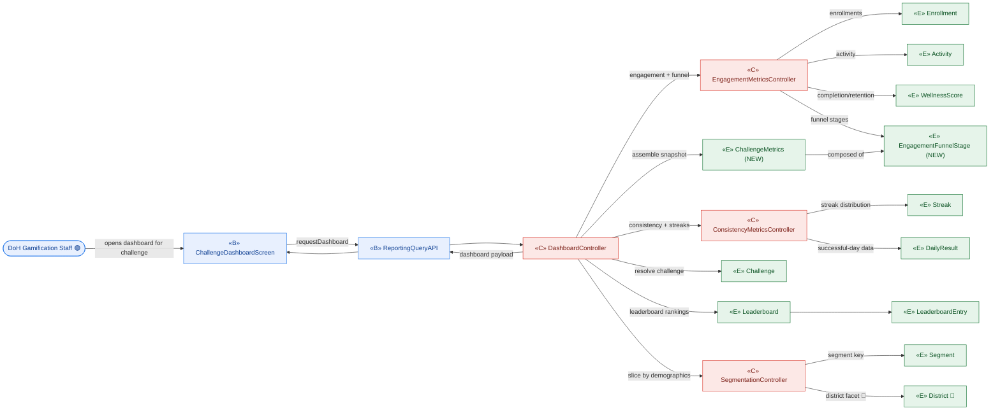
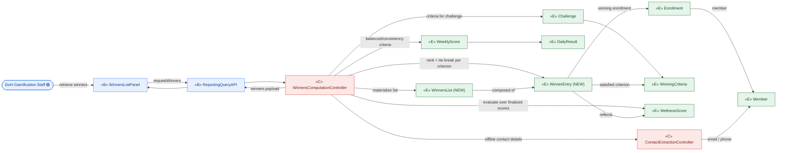

# ICONIX Step 2 — Robustness Analysis: **J. Reporting & Analytics** (`reporting`)

**Process**: ICONIX (Rosenberg), use-case-driven, milestone-driven.
**Package**: J. Reporting & Analytics (id `reporting`).
**Inputs reconciled**: `01-use-cases.md` (UC-J1, UC-J2 narratives) ⇄ `02-domain-model.md` (entity classes).
**Phase scope**: 🟢 **P1 = both UC-J1 and UC-J2** (individual-based). District-segmented community-impact metrics inside UC-J1 are 🔵 P3 and tagged inline; the dashboard shell + demographic segmentation are P1.
**Milestone**: J sits in **M4** (badges + reporting) of the Phase-1 milestone plan, and UC-J2 is the read that gates Settlement (`J2 -. include .-> I2`).

> **ICONIX robustness rules enforced**
> 1. Actors touch **only** boundary objects.
> 2. Boundary ↔ entity **never** talk directly — always mediated by a control.
> 3. Boundary objects talk only to actors + controls.
> 4. Controls talk to boundary, entities, and other controls.
> 5. Entities talk only to controls (and, for read-only navigation, other entities).
> 6. Grammatical rule: **nouns → entity/boundary**, **verbs → control**.
>
> **Legend**: «B» = boundary (screen/API the actor touches) · «C» = control (verb/logic/controller-to-be) · «E» = entity (domain class from `02-domain-model.md`; **(NEW)** = introduced here).

---

## 0. Package-level object inventory (traceability spine)

### Boundary objects (actor-facing)
| Boundary | Touched by | Used in |
|---|---|---|
| ChallengeDashboardScreen | DoH Gamification Staff | UC-J1 |
| ReportingQueryAPI | (system, fronts all dashboard/report reads) | UC-J1, UC-J2 |
| WinnersListPanel | DoH Gamification Staff | UC-J2 |

> The dashboard and the winners panel are the only actor-facing surfaces in this package. Both are operated by **DoH Gamification Staff** (an internal/back-office actor), not the Participant — so there is no consumer-facing screen here. `ReportingQueryAPI` is the single read façade both screens call through.

### Control objects (the controllers behaviour will live in)
| Control | Owns behaviour | Phase |
|---|---|---|
| **DashboardController** | orchestrate a dashboard request: resolve the challenge, gather the metric set, apply segment/demographic filters, assemble the view payload | 🟢 P1 |
| **EngagementMetricsController** | compute adoption/engagement funnel + participation/completion/retention from enrollments, activity and scores | 🟢 P1 |
| **ConsistencyMetricsController** | compute behavioural-consistency / streak-distribution metrics from streak + daily-result data | 🟢 P1 |
| **SegmentationController** | slice any metric set by demographic segment (age/gender/conditions 🟢; district 🔵) | 🟢 P1 (district facet 🔵) |
| **WinnersComputationController** | evaluate each `WinningCriteria` over finalized `WellnessScore`/`WeeklyScore` data, apply rank counts + tie-break, materialize the ranked winners list | 🟢 P1 |
| **ContactExtractionController** | for offline-reward winners, surface the winner's `email`/`phone` from `Member` for DoH outreach (feeds UC-I4) | 🟢 P1 |

### Entity objects (from domain model, reused read-only)
`Challenge`, `Enrollment`, `Member`, `Segment`, `Activity`, `DailyResult`, `Streak`, `WeeklyScore`, `WellnessScore`, `Leaderboard`, `LeaderboardEntry`, `WinningCriteria`, `District` 🔵.

### NEW entity classes introduced in this step
| New class | Why the use-case text forced it | Where surfaced |
|---|---|---|
| **ChallengeMetrics** | UC-J1 requires an *aggregate* view — "adoption/engagement funnel, behavioral consistency, participation/completion/retention" computed per challenge. No domain class holds challenge-level computed aggregates; `WellnessScore`/`WeeklyScore` are per-enrollment, not per-challenge rollups. A reify-able metrics snapshot is needed so dashboard reads are traceable to the data they summarize. | UC-J1 |
| **EngagementFunnelStage** | The "funnel" in UC-J1 is an ordered set of stages (eligible → enrolled → active → completing → retained) each with a count/conversion. `ChallengeMetrics` is the whole; each stage is a distinct part with its own count, so the funnel is reified as ordered stage rows. | UC-J1 |
| **WinnersList** | UC-J2 "retrieves the **computed winners list** … from the dashboard to drive UC-I2", and UC-I2 "confirms the winners list". This is a first-class artifact that is computed, retrieved, possibly adjusted (I2.1), and confirmed (I2.2 gate). The domain model has `WinningCriteria` (the *rule*) but no materialized *list of winners*. Required so the winners set is traceable, adjustable and confirmable. | UC-J2, UC-I2, UC-I4 |
| **WinnerEntry** | Each row of a `WinnersList`: the winning `Member`/`Enrollment`, the `WinningCriteria` they satisfied, their rank within that criterion, their `WellnessScore`, and the mapped reward. Part-of `WinnersList`; needed because winners are evaluated **per criterion** (rankCount per criterion) and each row carries its own provenance for the I2 review. | UC-J2 |

> Reconciliation notes:
> - `WinningCriteria.mappedReward` already exists, so the reward mapping is **not** a new entity — `WinnerEntry` references it.
> - `Member.email`/`Member.phone` already exist; offline-winner contact extraction is **behaviour** (`ContactExtractionController`), not a new entity. UC-J1 / UC-I4 reuse them.
> - Demographic segmentation reuses the existing `Segment` entity as the slice key; only the *slicing behaviour* (`SegmentationController`) is new.
> - The four NEW classes are flagged for back-propagation into `02-domain-model.md` (currently absent there).

---

## UC-J1 View Challenge Dashboard 🟢 P1 — realizes P1-13, §Performance Metrics

**Basic course** (robustness reading): DoH Gamification Staff opens the dashboard screen for a `Challenge` → `DashboardController` resolves the challenge and dispatches metric computation: `EngagementMetricsController` derives the adoption/engagement funnel (`EngagementFunnelStage` rows) + participation/completion/retention from `Enrollment`, `Activity` and `WellnessScore`; `ConsistencyMetricsController` derives streak-distribution / behavioural-consistency from `Streak` + `DailyResult`; leaderboard rankings are read from the existing `Leaderboard`/`LeaderboardEntry`. `SegmentationController` slices every metric by demographic `Segment`. Results are assembled into a `ChallengeMetrics` snapshot and returned to the screen.

**Rule branch**: J1.1 district-segmented community-impact metrics 🔵 — `SegmentationController` adds the `District` facet **only when districts are live**; the P1 build slices by age/gender/conditions only.

---

## UC-J2 Retrieve Winners List 🟢 P1 — realizes P1-13, §Challenge Conclusion

**Basic course** (robustness reading): DoH Gamification Staff requests the winners list for a concluded `Challenge` → `WinnersComputationController` reads the challenge's `WinningCriteria`, evaluates each criterion over finalized `WellnessScore` (and `WeeklyScore`/`DailyResult` for criteria like Most-Balanced-Days / Consistent-Engagement), applies per-criterion rank counts and the `ScoringPlan` tie-break, and materializes a ranked `WinnersList` of `WinnerEntry` rows (each tying a winning `Member`/`Enrollment` to the satisfied `WinningCriteria` and mapped reward). For offline-reward winners, `ContactExtractionController` surfaces `Member.email`/`phone`. The list is returned to the winners panel and becomes the artifact UC-I2 reviews/confirms.

**Rule branches**: the winners list is *computed* here but **not** confirmed — confirmation is the UC-I2 gate (I2.2), and adjustments (I2.1) mutate the same `WinnersList` artifact before confirmation. Offline-contact extraction feeds UC-I4 (Distribute Rewards).

---

## Forward/backward traceability (this step)

| Use case | Boundary | Controls | Entities (incl. NEW) | Realizes |
|---|---|---|---|---|
| UC-J1 🟢 | ChallengeDashboardScreen, ReportingQueryAPI | DashboardController, EngagementMetricsController, ConsistencyMetricsController, SegmentationController | Challenge, Enrollment, Activity, WellnessScore, Streak, DailyResult, Leaderboard, LeaderboardEntry, Segment, District 🔵, **ChallengeMetrics**, **EngagementFunnelStage** | P1-13, §Performance Metrics |
| UC-J2 🟢 | WinnersListPanel, ReportingQueryAPI | WinnersComputationController, ContactExtractionController | Challenge, WinningCriteria, WellnessScore, WeeklyScore, DailyResult, Enrollment, Member, **WinnersList**, **WinnerEntry** | P1-13, §Challenge Conclusion |

**Downstream wiring** (preserves the use-case-overview dependency edges): `J2 -. include .-> I2` (winners list is the artifact I2 reviews/confirms); `ContactExtractionController` output feeds `I4 Distribute Rewards`. UC-J1 is the dashboard I2 also reviews.

**Sanity check (golden thread)**: no actor (DoH Gamification Staff) touches an entity directly — every entity access is mediated by a control; boundary and entity never talk directly; nouns landed in entity/boundary, verbs (compute/evaluate/slice/assemble/extract) landed in control. The four NEW classes — **ChallengeMetrics**, **EngagementFunnelStage**, **WinnersList**, **WinnerEntry** — are flagged for back-propagation into `02-domain-model.md` (currently absent there); `WinnersList ◇— WinnerEntry` and `ChallengeMetrics ◇— EngagementFunnelStage` are aggregations (parts have no meaning outside their whole).
