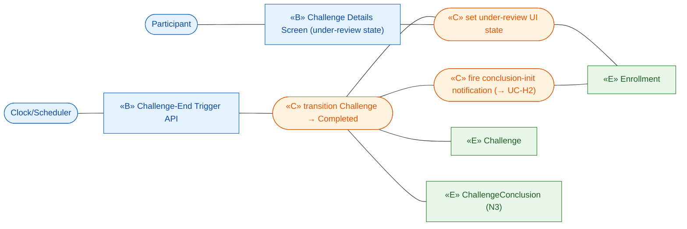
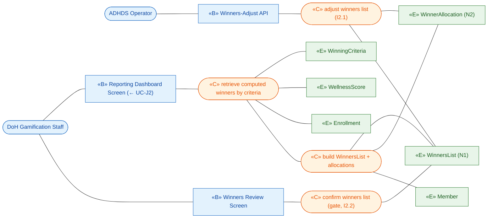
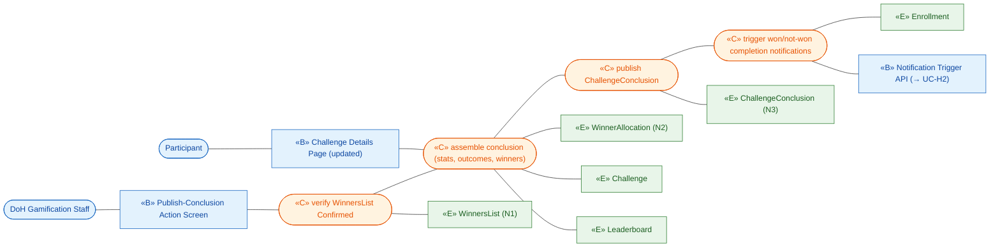
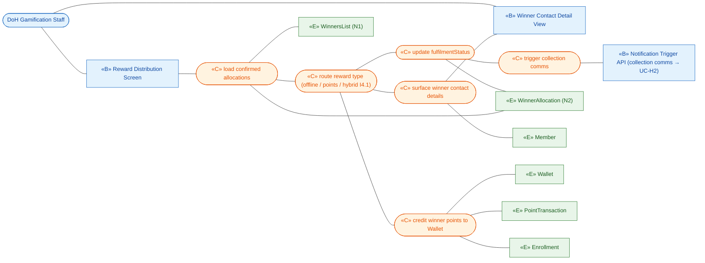
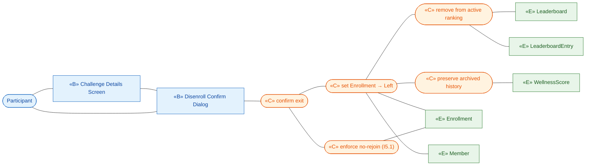

# ICONIX Step 2 — Robustness Analysis: Package I — Settlement / Conclusion (`settlement`)

**Process**: ICONIX (Rosenberg) — use-case-driven, milestone-driven. This is the **Step-2**
deliverable for the **Settlement / Conclusion** package (id `settlement`). Each use case is decomposed
into **boundary** (screens / APIs the actor touches), **control** (verbs, logic, the controllers that
will own behaviour) and **entity** (domain classes from `02-domain-model.md`).

**Phase scope**: All five UCs are `🟢 P1` (individual-based settlement). Team/District fan-out
(I5.2 team-leave freeze, I5.3 district aggregation removal, team/district winner cohorts) is tagged
inline and is **out of P1 build scope** — modelled only for forward-traceability.

**Robustness rules obeyed** (Rosenberg):
1. Actors touch only **boundary**.
2. **Boundary** and **entity** never talk directly — only through **control**.
3. Boundary ↔ control, control ↔ control, control ↔ entity are the only legal links.
4. **Nouns → entity**, **verbs → control**.

**Traceability spine**: `use case ⇄ domain class ⇄ robustness object ⇄ (later) sequence message`.
Each diagram lists the upstream UC (Step 1) and the entities it reconciles against the domain model.

---

## 0. New Entity Classes introduced in this package

The Step-1 domain model (`02-domain-model.md`) models scoring, ledger, reward and leaderboard nouns,
but the **conclusion/settlement** nouns the BRD §Challenge Conclusion and §Reward Distribution depend on
are absent. Reconciling the UC narratives against `02-domain-model.md` surfaces the following **NEW
entity classes** that must be back-ported into the domain model for forward/backward traceability:

| # | New Entity | Scope | Why surfaced (UC-text vs domain model) | Key attributes (analysis-level) | Reconciles UC |
|---|-----------|-------|----------------------------------------|--------------------------------|----------------|
| N1 | **WinnersList** | P1 | UC-I2/UC-J2 "retrieve **winners list** … confirm the **winners list**"; UC-H2 already *referenced* `WinnersList` as if it existed — it does **not** in `02-domain-model.md`. The confirmed, criteria-keyed roster that gates announcement (I2.2) and drives distribution (I4). | `winnersListId`, `challengeRef`, `status_Draft_Adjusted_Confirmed`, `confirmedBy`, `confirmedTimestamp`, `generatedFromCriteria` | I2, I3, I4 (← J2) |
| N2 | **WinnerAllocation** | P1 | A winners-list **line item**: one ranked winner under one `WinningCriteria`, with the reward owed. The model has `WinningCriteria` (the rule) and `Reward` mapping, but no *resolved per-winner award row*. Needed so I4 can distribute per-winner (offline contact vs points credit) and mark fulfilment. | `allocationId`, `enrollmentRef`/`memberRef`, `criteriaRef`, `rank`, `rewardType_offline_points_hybrid`, `allocatedPoints`, `offlineRewardDesc`, `fulfilmentStatus_pending_contacted_credited_done` | I2, I3, I4 |
| N3 | **ChallengeConclusion** | P1 | UC-I3 "updates the challenge **details page** (overall stats, participation outcomes, next-steps teaser, optional winners list)". The published conclusion artifact — distinct from the live `Challenge` and from the `WinnersList`. Carries the post-challenge summary stats surfaced in the details page. | `conclusionId`, `challengeRef`, `overallStats`, `participationOutcomes`, `nextStepsTeaser`, `winnersListRef`, `publishedTimestamp`, `publishedBy` | I1, I3 |

> **Reused, not new** (consumed read-only or status-mutated only): `Challenge` (status →
> `Completed`/`Archived`), `Enrollment` (status → `Left`/`Completed`), `WellnessScore` (already
> `locked` by UC-D6 — settlement never recomputes it), `WeeklyScore`, `WinningCriteria`, `Leaderboard`
> (finalized by UC-E1.2), `Wallet`, `PointTransaction`, `Member`. Settlement **does not** mutate
> scoring/ledger logic — it reads finalized scores and only *credits* winner points via the existing
> `PointTransaction`/`Wallet` path (shared with G1/I4).

---

## I. Controllers identified (own the behaviour)

| Controller | Owns | Driven by |
|-----------|------|-----------|
| **ConclusionController** | on Clock end-event: transition `Challenge` → `Completed`, set "under review" UI state, fire the conclusion-initiation notification trigger (→ UC-H2) | UC-I1 |
| **WinnersReviewController** | retrieve computed winners (← UC-J2), build/adjust the `WinnersList` + `WinnerAllocation` rows, apply DoH/ADHDS edits (I2.1), confirm the list — the **gate** before any announcement (I2.2) | UC-I2 |
| **AnnouncementController** | after confirmation: assemble & publish `ChallengeConclusion` (stats + outcomes + optional winners), trigger won/not-won completion notifications (→ UC-H2) | UC-I3 |
| **RewardDistributionController** | per `WinnerAllocation`: route offline (surface contact details to DoH) vs points (credit `Wallet` via `PointTransaction`), handle hybrid (I4.1), update `fulfilmentStatus`, trigger collection comms | UC-I4 |
| **DisenrollmentController** | confirm exit, set `Enrollment.status=Left`, remove from active ranking, preserve archived history, enforce no-rejoin (I5.1) and (P2/P3) freeze rules | UC-I5 |

`WinnersReviewController` enforces the **confirmation gate**; `AnnouncementController` and
`RewardDistributionController` both refuse to act on a `WinnersList` whose `status ≠ Confirmed`.

---

## UC-I1 — Conclude Challenge 🟢 P1
*Realizes P1-12, §Challenge Conclusion · Actor: **Clock/Scheduler** (end-event). Triggers UC-H2.*

**Boundary**: Challenge-End Trigger API (in, from Clock), Challenge Details Screen ("data under
review, winners announced shortly" state shown to Participant).
**Control**: `ConclusionController` (transition status, set review state, fire conclusion-init trigger).
**Entity**: `Challenge` (status → `Completed`), `Enrollment`, `ChallengeConclusion` (N3 — created in
draft/under-review state).

**Alternate-course objects**: depends on UC-D6 having already locked `WellnessScore` and finalized
`Leaderboard` (E1.2) — `C_CONCL` reads those as preconditions, never recomputes. The notification
hand-off (`C_FIRE`) crosses into Package H (UC-H2) — modelled there as the lifecycle trigger.

---

## UC-I2 — Review & Confirm Winners 🟢 P1
*Realizes P1-12, P1-13, §Challenge Conclusion · Actor: **DoH Gamification Staff** (with **ADHDS
Operator** for adjustments). Includes UC-J2 (retrieve winners list).*

**Boundary**: Reporting Dashboard Screen (DoH reviews), Winners Review Screen, Winners-Adjust API
(ADHDS edits, I2.1).
**Control**: `WinnersReviewController` (retrieve computed winners ← UC-J2, build/adjust list, confirm).
**Entity**: `WinnersList` (N1), `WinnerAllocation` (N2), `WinningCriteria`, `WellnessScore`,
`Enrollment`, `Member`.

**Alternate-course objects**: I2.1 (list needs tweaks) → `C_ADJ` mutates `WinnerAllocation` rows /
`WinnersList` before confirmation; **ADHDS Operator** touches only `B_ADJ`. I2.2 (confirmation is the
gate) → `C_CONF` sets `WinnersList.status=Confirmed`; downstream UC-I3/UC-I4 controllers refuse a
non-`Confirmed` list. UC-J2 supplies the computed roster — `C_RETR` is the include point.

---

## UC-I3 — Announce Winners & Publish Conclusion 🟢 P1
*Realizes P1-12, §Challenge Conclusion · Actor: **DoH Gamification Staff** (publish action) /
**system**. Precondition: UC-I2 confirmation. Triggers UC-H2 (won/not-won completion notifications).*

**Boundary**: Publish-Conclusion Action Screen (DoH triggers), Challenge Details Page (updated public
view), Notification Trigger API (out → UC-H2).
**Control**: `AnnouncementController` (assemble + publish `ChallengeConclusion`, trigger completion
notifications).
**Entity**: `ChallengeConclusion` (N3), `WinnersList` (N1, must be `Confirmed`), `WinnerAllocation`
(N2), `Challenge`, `Leaderboard`, `Enrollment`.

**Alternate-course objects**: completion-notification content varies by won vs not-won — `C_NOTIFY`
branches on whether the recipient `Enrollment` appears in a `WinnerAllocation`; both branches deep-link
(tap → conclusion announcement) via Package H. `B_PAGE` re-reads the published `ChallengeConclusion`
through `C_ASSEM` (no boundary→entity shortcut). Optional winners list on the page is gated by config.

---

## UC-I4 — Distribute Rewards 🟢 P1
*Realizes §Reward Distribution · Actor: **DoH Gamification Staff** (offline contact) / **system**
(points credit). Precondition: UC-I2 confirmation. Triggers UC-H2 collection comms.*

**Boundary**: Reward Distribution Screen (DoH retrieves winner email/phone), Winner Contact Detail
View, Notification Trigger API (collection comms → UC-H2).
**Control**: `RewardDistributionController` (route offline vs points vs hybrid, credit points, update
fulfilment).
**Entity**: `WinnerAllocation` (N2), `WinnersList` (N1), `Member` (email/phone), `Wallet`,
`PointTransaction` (winner credit), `Enrollment`.

**Alternate-course objects**: I4.1 (hybrid) → `C_ROUTE` fans to **both** `C_OFFLINE` and `C_CREDIT`
for the same `WinnerAllocation`. Points credit reuses the existing `Wallet`/`PointTransaction` path
(shared with UC-G1) — `PointTransaction.type=earn`, `sourceRef=winner-allocation`; subject to the
`Challenge.pointsFeatureFlag` (off ⇒ skip points leg, offline still runs). `C_FULFIL` advances
`fulfilmentStatus` (pending→contacted/credited→done) so distribution is idempotent and auditable.

---

## UC-I5 — Disenroll / Leave Challenge 🟢 P1
*Realizes §Disenrollment · Actor: **Participant**.*

**Boundary**: Challenge Details Screen, Disenroll Confirm Dialog.
**Control**: `DisenrollmentController` (confirm exit, set status, remove from active ranking, enforce
no-rejoin).
**Entity**: `Enrollment` (status → `Left`), `Leaderboard` / `LeaderboardEntry` (active ranking),
`WellnessScore` (historical, preserved), `Member`.

**Alternate-course objects**: I5.1 (cannot re-join once left) → `C_NOREJOIN` marks `Enrollment` so a
later UC-C3 enroll attempt for the same Member+Challenge is blocked. I5.2 (🟡 team-member leave →
team composition + score-freeze) and I5.3 (🔵 district participant leave → removed from district
aggregation forward, historical contribution preserved) are **P2/P3** branches off `C_LEAVE` — shown as
tagged, out-of-build-scope extensions (Team / District entities not in the P1 build set).
`B_DET → B_CONF` is screen-to-screen navigation (actor re-touches `B_CONF`), not a boundary↔boundary
data flow.

---

## Robustness invariant check (per Rosenberg)

| Rule | Status |
|------|--------|
| Actors (Clock, Participant, DoH Staff, ADHDS Operator) touch only boundary | ✅ every actor link terminates on a «B» node |
| Boundary never talks to entity directly | ✅ every «B»→«E» path routes through a «C» node |
| Entity never talks to entity directly | ✅ all inter-entity reads mediated by control |
| Nouns→entity, verbs→control | ✅ every «C» node is a verb phrase; every «E» is a noun |
| Confirmation gate honoured | ✅ I3 (`C_GATE`) and I4 (`C_LOAD` on confirmed list) refuse non-`Confirmed` `WinnersList` |
| Settlement never recomputes scores | ✅ `WellnessScore`/`WeeklyScore`/`Leaderboard` consumed read-only; only status flags + winner `PointTransaction` written |

## Phase-scope tag summary

| UC | Phase | Notes |
|----|-------|-------|
| UC-I1 Conclude Challenge | 🟢 P1 | individual conclusion |
| UC-I2 Review & Confirm Winners | 🟢 P1 | individual winner cohorts; PoD/district cohorts P2/P3 |
| UC-I3 Announce & Publish Conclusion | 🟢 P1 | — |
| UC-I4 Distribute Rewards | 🟢 P1 | offline + points + hybrid all P1 |
| UC-I5 Disenroll / Leave | 🟢 P1 | I5.2 team-freeze 🟡 P2, I5.3 district-aggregation 🔵 P3 |

## Forward-traceability handoff (to Step 3 sequence)
- Each `«C»` verb node becomes a controller operation / message in the sequence diagrams.
- `WinnersReviewController.confirm` is the convergence gate — model once, referenced by I3 + I4 sequences.
- The 3 new entities (**WinnersList N1**, **WinnerAllocation N2**, **ChallengeConclusion N3**) must be
  **added to `02-domain-model.md`** before Step-3 so no sequence message references an orphan class.
  Note: UC-H2 (Package H) already cited `WinnersList` — adding N1 closes that pre-existing backward gap.
- Winner points credit (UC-I4 `C_CREDIT`) shares the `Wallet`/`PointTransaction` path with UC-G1;
  reuse the same sequence fragment, distinguished by `PointTransaction.sourceRef=winner-allocation`.
