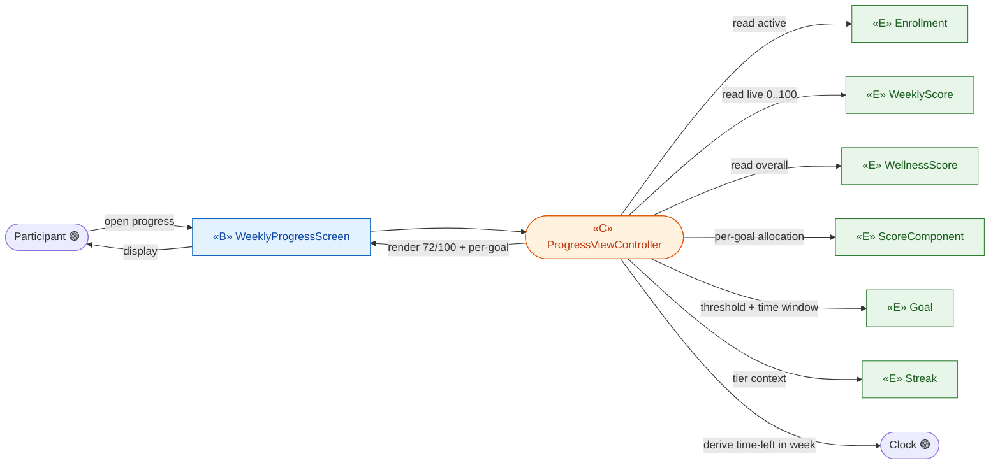
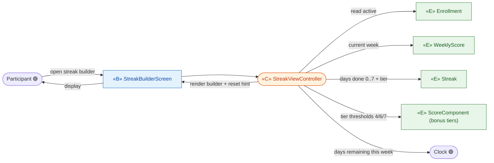
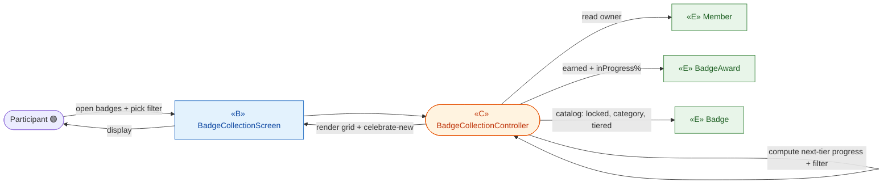
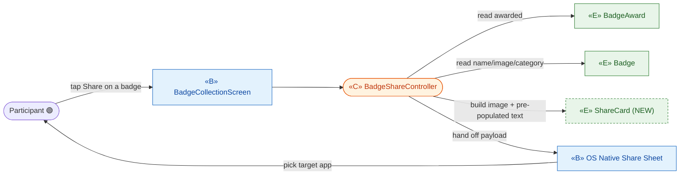
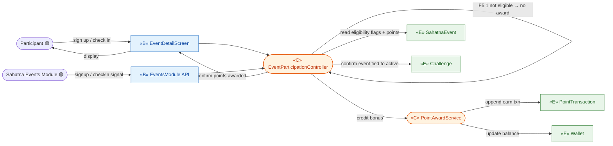
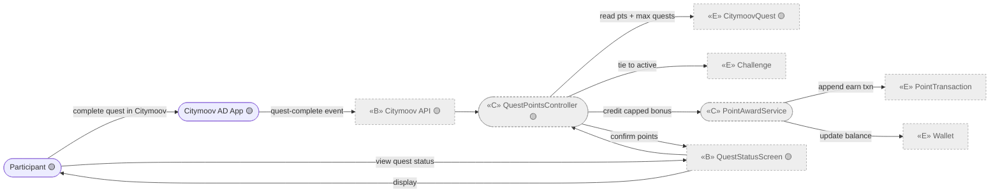

# ICONIX Step 2 — Robustness Analysis

## Package F — Track & Engage (`track-engage`, P1)

**Process**: ICONIX (Rosenberg). Robustness analysis bridges Step-1 use cases to Step-3 sequence
diagrams. Each object is classified **BOUNDARY** «B» (screens / APIs the actor touches),
**CONTROL** «C» (verbs / logic / the controllers that will own behaviour), or **ENTITY** «E»
(domain classes drawn from `02-domain-model.md`).

**ICONIX robustness rules enforced here**:
1. Actors talk only to **boundary** objects.
2. **Boundary** and **entity** objects never talk to each other directly — only through a **control**.
3. Nouns → entity; verbs/logic → control.
4. Boundaries may invoke other boundaries only via a control (no boundary→boundary line).

**Phase discipline**: UC-F1…F6 are 🟢 P1 (individual scope). **UC-F7 (Citymoov Quest) is 🟡 P2** and is
tagged accordingly; its `CitymoovQuest` entity, `QuestPointsController`, and the `Citymoov AD App`
actor are out of P1 build scope and shown greyed/tagged for forward-traceability only.

**Traceability**: every robustness object below carries forward to a Step-3 sequence message and
backward to a Step-1 use-case sentence + a `02-domain-model` class (or a declared NEW class).

---

### Controllers identified for this package

| Controller (CONTROL «C») | Owns behaviour for | Phase |
|---|---|---|
| **ProgressViewController** | UC-F1 — assemble weekly score + per-goal progress + time-remaining view | 🟢 P1 |
| **StreakViewController** | UC-F2 — assemble streak-builder view (days done/remaining, tier target) | 🟢 P1 |
| **BadgeCollectionController** | UC-F3 — assemble earned/locked badge grid + in-progress percentages | 🟢 P1 |
| **BadgeShareController** | UC-F4 — build share payload, hand off to OS share sheet | 🟢 P1 |
| **EventParticipationController** | UC-F5 — validate event eligibility, award sign-up/check-in bonus points | 🟢 P1 |
| **ScreeningPointsController** | UC-F6 — validate screening-in-window, award screening bonus points | 🟢 P1 |
| **QuestPointsController** | UC-F7 — validate quest, award capped quest points (**P2**) | 🟡 P2 |

A shared **PointAwardService** «C» is factored out (F5/F6/F7 all "credit a capped bonus
`PointTransaction` to the `Wallet`"); it is the single writer of bonus `PointTransaction` rows, keeping
the per-use-case controllers thin and honouring DRY for Step-3 sequencing.

---

## UC-F1 — View Weekly Score & Goal Progress 🟢 P1
*realizes P1-7, §Score Visibility, §Goal Visibility*

**Reconciliation note**: read-only assembly over existing entities — no new entity. `Goal.threshold`
and `Goal.frequency` (time window) plus live `WeeklyScore.componentBreakdown` and per-goal pending vs
completed are read; "time remaining in week" is derived by the controller from `WeeklyScore.weekEnd`
and the Clock (no stored attribute). Alt F1.1 (personalized-goal label) is 🟡 P2 — boundary shows a
"calculated from past activity" flag without exposing the formula.



---

## UC-F2 — View Streak Builder 🟢 P1
*realizes P1-7, §Streak Builder UX*

**Reconciliation note**: read-only over `Streak` (`successfulDays 0..7`, `tier`, `resetsWeekly`) and the
parent `WeeklyScore`/`Enrollment`. "Days remaining" and "tier progressing toward" are controller-derived
from `Streak.successfulDays` + Clock + the bonus tiers held in `ScoreComponent.isConsistencyBonus`. No
new entity.



---

## UC-F3 — View Badge Collection 🟢 P1
*realizes P1-16, §Badge UX*

**Reconciliation note**: read-only over `BadgeAward` (earned, `inProgressPercent`, `tierLevel`) and its
template `Badge` (`category`, `tiered_flag`). "Locked badges with progress to next tier" and category
filter are controller logic over those attributes. "Celebratory moment on new award" is a transient UI
event raised by the controller when a fresh `BadgeAward` is detected — handled by the boundary, not a
new entity. No new entity.



---

## UC-F4 — Share Badge 🟢 P1
*realizes P1-17*

**Reconciliation note**: NEW entity required. The use case says "native phone share with pre-populated
text" — the *content* of that share (image ref + templated caption + optional deep link) is a domain
artifact not present in `02-domain-model`. Introduced **ShareCard** «E». The native OS share sheet is an
external boundary the participant touches. `BadgeShareController` builds the `ShareCard` from the chosen
`BadgeAward`/`Badge` and hands it to the share sheet.



---

## UC-F5 — Sign Up / Check-in for Bonus-Point Event 🟢 P1
*realizes P1-9, P1-10, §Event Participation*

**Reconciliation note**: no new entity. `SahatnaEvent` (`signupPoints`, `checkinPoints`,
`eligibleForSignup_flag`, `eligibleForCheckin_flag`) and `PointTransaction`/`Wallet` exist. The
**Sahatna Events Module** is the secondary system actor that signals sign-up/check-in. Alt F5.1
(not configured-eligible → no points) and F5.2 (cancelled event → earned points preserved) are control
branches in `EventParticipationController`. Bonus credit is written through the shared
`PointAwardService`.



---

## UC-F6 — Complete Screening for Points 🟢 P1
*realizes §Goals (IFHAS), §Reward Points (Additional Avenues)*

**Reconciliation note**: no new entity. `Screening` (`type_IFHAS`, `pointsPerInstance`,
`maxRewardedInstances`) and `PointTransaction`/`Wallet` exist. The **Sahatna IFHAS Module** is the
system actor signalling completion. Alt F6.1 (screening outside challenge window → no points) is a
control branch; the window comes from `Challenge.start/endDateTime`. Bonus credit via shared
`PointAwardService` (also enforces `maxRewardedInstances` cap).

```mermaid
graph LR
  classDef b fill:#e3f2fd,stroke:#1565c0,color:#0d47a1;
  classDef c fill:#fff3e0,stroke:#e65100,color:#bf360c;
  classDef e fill:#e8f5e9,stroke:#2e7d32,color:#1b5e20;

  PART([Participant 🟢]):::actor
  IFHAS([Sahatna IFHAS Module 🟢]):::actor
  ScrScreen["«B» ScreeningStatusScreen"]:::b
  ScrApi["«B» IFHASModule API"]:::b
  ScrCtl(["«C» ScreeningPointsController"]):::c
  AwardSvc(["«C» PointAwardService"]):::c
  E_Scr["«E» Screening"]:::e
  E_Chal["«E» Challenge"]:::e
  E_Wallet["«E» Wallet"]:::e
  E_Txn["«E» PointTransaction"]:::e

  PART -->|complete screening| ScrScreen
  IFHAS -->|completion signal| ScrApi
  ScrScreen --> ScrCtl
  ScrApi --> ScrCtl
  ScrCtl -->|read points + max instances| E_Scr
  ScrCtl -->|F6.1 in challenge window?| E_Chal
  ScrCtl -->|credit bonus (cap-checked)| AwardSvc
  AwardSvc -->|append earn txn| E_Txn
  AwardSvc -->|update balance| E_Wallet
  ScrCtl -->|confirm points| ScrScreen
  ScrScreen -->|display| PART
```

---

## UC-F7 — Complete Citymoov Quest for Points 🟡 **P2**
*realizes P2-2, §Citymoov Quest Integration* — **OUT OF P1 BUILD SCOPE; shown for forward-traceability**

**Reconciliation note**: no new entity. `CitymoovQuest` (`pointsPerCompletion`, `maxRewardedQuests`) is
already a P2-tagged class in `02-domain-model`. The **Citymoov AD App** is an external system actor
integrated via API; completion arrives over that API boundary. The "capped count per challenge" rule is
enforced by `QuestPointsController` via `PointAwardService` (`maxRewardedQuests`). Greyed/dashed below to
mark P2.



---

## New entity classes introduced (delta vs `02-domain-model.md`)

| New «E» class | Use case | Why the existing model was insufficient | Suggested attributes |
|---|---|---|---|
| **ShareCard** | UC-F4 | The shareable artifact (rendered image ref + pre-populated caption + optional deep link) is a domain object the use case requires for "native phone share with pre-populated text"; no class in `02-domain-model` represents share content. Transient/derived from a `BadgeAward` + `Badge`. | shareCardId, badgeAwardRef, imageRef, prefilledText, deepLink, generatedAt |

No other new entities were required: F1/F2/F3 are read-only assemblies over existing classes
(`WeeklyScore`, `WellnessScore`, `ScoreComponent`, `Goal`, `Streak`, `BadgeAward`, `Badge`); F5/F6/F7
reuse `SahatnaEvent` / `Screening` / `CitymoovQuest` and the `Wallet` ◇ `PointTransaction` ledger.

## Robustness-rule sanity check (per diagram)
- Actor→boundary only: ✅ Participant and all system actors (Events/IFHAS/Citymoov Modules, Clock) touch
  screens/APIs, never entities or controllers-as-data.
- Boundary↔entity always via control: ✅ every screen/API routes through its `*Controller`; no direct
  boundary→entity edge exists.
- Boundary↔boundary only via control: ✅ F4 `BadgeCollectionScreen`→`OS Share Sheet` is mediated by
  `BadgeShareController`.
- Nouns→entity, verbs→control: ✅ "view/share/sign-up/check-in/complete/award/credit" all live on
  controllers; nouns (Score, Streak, Badge, Event, Screening, Quest, Wallet, Transaction, ShareCard)
  are entities.
