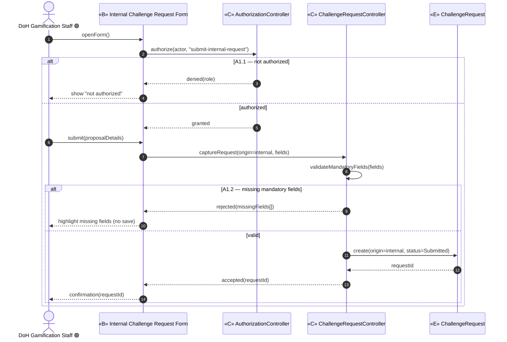
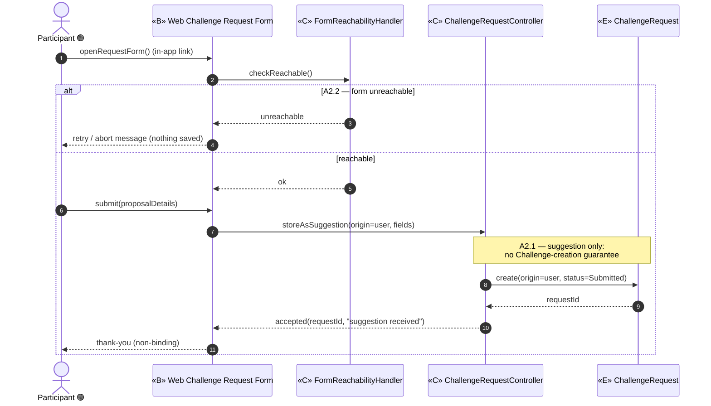
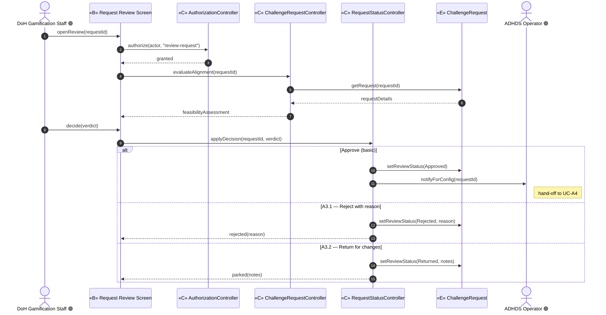
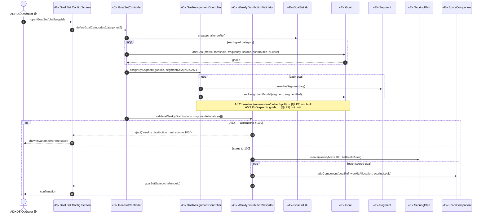
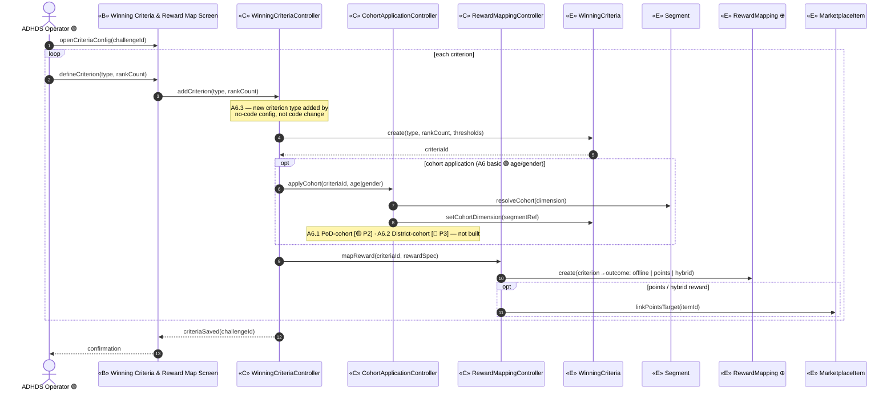
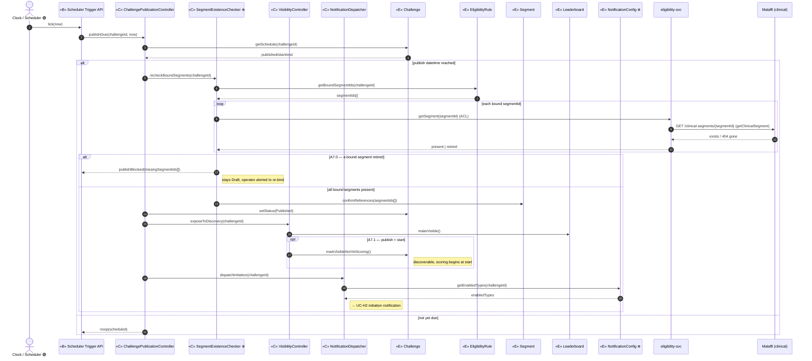
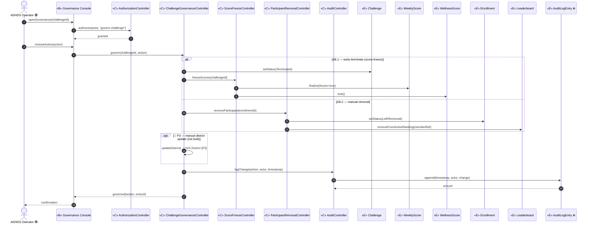
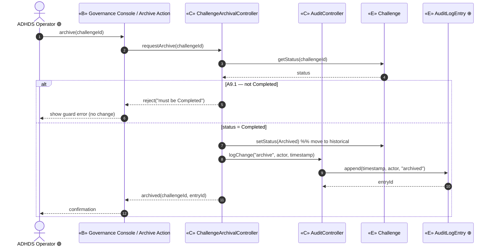

# ICONIX Step 3 — Sequence Diagrams

## Package A — Challenge Authoring & Lifecycle (`challenge-authoring`) · 🟢 P1

**Process**: ICONIX (Rosenberg), use-case-driven and milestone-driven. This is the Step-3 deliverable
for the `challenge-authoring` package. Each use case UC-A1…UC-A9 — already classified into
boundary/control/entity in [`03-robustness/challenge-authoring.md`](../03-robustness/challenge-authoring.md)
against the domain classes in [`02-domain-model.md`](../02-domain-model.md) — is here expanded into a
**Mermaid `sequenceDiagram`**.

**Method allocation rule (ICONIX Step 4 discipline)**: the **control** objects from the robustness
diagram become the *senders* (the application-layer services); each **operation is allocated to the
entity that owns the data** it reads/writes (the "information expert" pattern). Boundary and entity
objects never message each other directly — every hop is mediated by a control, preserving the four
robustness invariants. The **Basic Course** is the un-fragmented spine; **Alternate Courses** are
`alt` / `opt` / `loop` fragments.

**Traceability chain**: `UC ⇄ domain class ⇄ robustness object ⇄ sequence message`. Every message
carries a backward link to its use-case step (A_n_._x_) in the per-diagram **Message → UC trace**
table that follows each diagram.

**Phase scope**: Package A is built for 🟢 **P1 — individual-based challenges only**. Team config
(A4.1 🟡 P2), baseline-personalized goals (A5.2 🟡 P2), PoD-cohort mapping (A6.1 🟡 P2) and
District branches (A4.2 / A6.2 / A8 manual-district 🔵 P3) are shown **only** as tagged `opt`/note
fragments for forward/backward traceability — **no P2/P3 behaviour is built**. Titles are not in this
package.

**New entities** introduced by this package's robustness analysis (§0 of the robustness doc, to be
back-propagated into `02-domain-model.md`): `NotificationConfig`, `RewardMapping`, `AudienceTarget`,
`Whitelist`, `AuditLogEntry`, `GoalSet`, and `ContentAsset` (architecture enhancement E1). Marked
**⊕new** at first use.

**Participants** (carried verbatim from the robustness diagrams):

| Stereotype | Objects |
|---|---|
| Actor | DoH Gamification Staff 🟢, Participant 🟢, ADHDS Operator 🟢, Clock / Scheduler 🟢 |
| «B» Boundary | Internal Challenge Request Form, Web Challenge Request Form, Request Review Screen, Challenge Config Console, Content Authoring / Upload screen ⊕, Segment Catalogue Browser ⊕ (admin), Goal Set Config Screen, Winning Criteria & Reward Map Screen, Scheduler Trigger API, Governance Console |
| «C» Control | AuthorizationController, ChallengeRequestController, FormReachabilityHandler, RequestStatusController, ChallengeConfigController, ContentAssetController ⊕, SegmentCatalogProvider ⊕, SegmentBindingController ⊕, AudienceBindingController, RedemptionConfigController, GoalSetController, GoalAssignmentController, WeeklyDistributionValidator, WinningCriteriaController, CohortApplicationController, RewardMappingController, ChallengePublicationController, VisibilityController, NotificationDispatcher, SegmentExistenceChecker ⊕, ChallengeGovernanceController, ScoreFreezeController, ParticipantRemovalController, AuditController, ChallengeArchivalController |
| «E» Entity | ChallengeRequest, Challenge, ContentAsset ⊕, AudienceTarget ⊕, Whitelist ⊕, EligibilityRule, NotificationConfig ⊕, Segment, GoalSet ⊕, Goal, ScoringPlan, ScoreComponent, WinningCriteria, RewardMapping ⊕, MarketplaceItem, Leaderboard, WeeklyScore, WellnessScore, Enrollment, AuditLogEntry ⊕ |
| External | challenge-content-store (object bucket), eligibility-svc, Malaffi (clinical) |

---

## UC-A1 — Submit Internal Challenge Request 🟢 P1

> *realizes Req4 §Challenge Request Submission · downstream of UC-A3 (review) → UC-A4 (config)*

**Basic Course**: DoH Gamification Staff opens the internal request form; `AuthorizationController`
gates the action (A1.1), `ChallengeRequestController` captures and validates the mandatory fields
(A1.2), then persists a `ChallengeRequest` with `origin=internal, status=Submitted`.
**Alternate Courses**: **A1.1** caller not an authorized staff role → reject before any write;
**A1.2** one or more mandatory fields missing → return the form with field errors, no persistence.

**Message → UC trace**

| # / message | Owner entity | UC step |
|---|---|---|
| `authorize(...)` | — (control) | A1.1 authorization gate |
| `captureRequest(...)` → `validateMandatoryFields(...)` | — (control) | A1 basic + A1.2 validation |
| `EREQ.create(origin=internal, status=Submitted)` | ChallengeRequest | A1 basic course (persist suggestion) |
| `rejected(missingFields)` | — | A1.2 alternate |

---

## UC-A2 — Submit User Challenge Request 🟢 P1

> *realizes Req4 §Challenge Request Submission · A2.1 = suggestion-only, no creation guarantee*

**Basic Course**: a Participant follows the in-app link to the web request form;
`FormReachabilityHandler` confirms the form is reachable (A2.2), `ChallengeRequestController` stores
the submission **as a suggestion only** (A2.1, `origin=user, status=Submitted`) — explicitly no
guarantee that a `Challenge` is ever created.
**Alternate Courses**: **A2.2** form unreachable → retry, then abort with a user message (nothing
persisted). **A2.1** is a control flag, not an error branch — every user request is non-binding.

**Message → UC trace**

| # / message | Owner entity | UC step |
|---|---|---|
| `checkReachable()` / `unreachable` | — (control) | A2.2 reachability/retry/abort |
| `storeAsSuggestion(origin=user)` | — (control) | A2.1 suggestion-only flag |
| `EREQ.create(origin=user, status=Submitted)` | ChallengeRequest | A2 basic course |

---

## UC-A3 — Review & Approve Challenge Request 🟢 P1

> *realizes Req4 §Request Review · consumes UC-A1/UC-A2 output · approval hands off to UC-A4 (ADHDS Operator)*

**Basic Course**: DoH Gamification Staff opens the review screen; `AuthorizationController` gates,
`ChallengeRequestController` evaluates alignment/feasibility against program goals, then
`RequestStatusController` records the decision on `ChallengeRequest.reviewStatus`. On **Approve** the
ADHDS Operator is notified to begin configuration (UC-A4).
**Alternate Courses**: **A3.1** Reject — capture reason on the request, notify submitter, no
configuration follow-on; **A3.2** Return-for-changes — park the request (status returned) so the
submitter can revise and resubmit.

**Message → UC trace**

| # / message | Owner entity | UC step |
|---|---|---|
| `authorize(...)` | — (control) | A3 authorization gate (A1.1 reuse) |
| `evaluateAlignment(...)` / `getRequest(...)` | ChallengeRequest | A3 basic — alignment/feasibility |
| `setReviewStatus(Approved)` + `notifyForConfig` | ChallengeRequest | A3 basic — approve → UC-A4 |
| `setReviewStatus(Rejected, reason)` | ChallengeRequest | A3.1 reject-with-reason |
| `setReviewStatus(Returned, notes)` | ChallengeRequest | A3.2 return-for-changes |

---

## UC-A4 — Configure Challenge ⚪ XC / 🟢 P1

> *realizes Req1,3,14 §Challenge Structure & Audience Targeting · downstream of UC-A3 approval · feeds UC-A5/A6/A7*

**Basic Course**: ADHDS Operator opens the no-code config console; `AuthorizationController` gates;
`ChallengeConfigController` sets the core `Challenge` attributes (type, published/start/end dates,
description, reward description) as `status=Draft`; `AudienceBindingController` authors the
`AudienceTarget` ⊕ and binds `Segment`s / `EligibilityRule`; `ChallengeConfigController` records the
`NotificationConfig` ⊕ (enabled types); `RedemptionConfigController` sets the redemption method.
**Architecture enhancement (E1)** — content + author-time clinical link: the operator also uploads
challenge content on the **Content Authoring / Upload screen** ⊕; `ContentAssetController` ⊕ writes the
binaries (image / icon / localized AR-EN media) to the **`challenge-content-store`** object bucket and
persists only the `ContentAsset` ⊕ **metadata + asset URIs** (refs, not blobs) to `challenge-db`. **Audience
binding (browse-and-bind, E1):** segmentation is a **separate, upstream concern** — the admin does **not**
send criteria to validate. Instead, on the **Segment Catalogue Browser** ⊕, `SegmentCatalogProvider` ⊕ calls
`eligibility-svc.listSegments()` (ACL → `Malaffi GET /clinical-segments` for clinical, local-segment store for
local) and returns the **catalogue of `Segment` descriptions** (`segmentId`, name, type — metadata only, **no
membership**). The admin **browses and manually selects** the matching segment(s), and `SegmentBindingController`
⊕ writes the chosen **`segmentId` references** onto the `EligibilityRule` via `challenge-svc` — **never raw
criteria**. Validity is **implicit** (you can only bind from the live catalogue), so there is **no separate
validate call**; a publish-time existence re-check (UC-A7) guards against retirement between authoring and go-live.
**Alternate Courses**: **A4.3** whitelist target → also create/bind a `Whitelist` ⊕ (only whitelisted
members may later see/enroll); **A4.4** hybrid redemption → offline **and** points both set;
**A4.1** Team-size + mode (🟡 P2) and **A4.2** District affiliation/reassignment (🔵 P3) shown as
tagged `opt` notes — not built.

```mermaid
sequenceDiagram
    autonumber
    actor ADHDS as ADHDS Operator 🟢
    participant BCON as «B» Challenge Config Console
    participant BUP as «B» Content Authoring / Upload screen ⊕
    participant BSCB as «B» Segment Catalogue Browser ⊕ (admin)
    participant CAUTH as «C» AuthorizationController
    participant CCFG as «C» ChallengeConfigController
    participant CCA as «C» ContentAssetController ⊕
    participant CAUD as «C» AudienceBindingController
    participant CSCP as «C» SegmentCatalogProvider ⊕
    participant CSBIND as «C» SegmentBindingController ⊕
    participant CRED as «C» RedemptionConfigController
    participant ECHAL as «E» Challenge
    participant ECA as «E» ContentAsset ⊕
    participant EAT as «E» AudienceTarget ⊕
    participant EWL as «E» Whitelist ⊕
    participant EELIG as «E» EligibilityRule
    participant ESEG as «E» Segment
    participant ENC as «E» NotificationConfig ⊕
    participant CSTORE as challenge-content-store (object bucket)
    participant ELIGS as eligibility-svc
    participant MAL as Malaffi (clinical)

    ADHDS->>BCON: openConfig(challengeDraft)
    BCON->>CAUTH: authorize(actor, "configure-challenge")
    CAUTH-->>BCON: granted

    ADHDS->>BUP: uploadContent(images, icons, AR/EN media)
    BUP->>CCA: putContentAssets(challengeId, files)
    CCA->>CSTORE: store blobs (image/icon/localized media)
    CSTORE-->>CCA: assetURIs[]
    CCA->>ECA: create(metadata + assetURIs)
    Note over CCA,ECA: E1 — blobs in challenge-content-store,<br/>metadata + URIs (refs, not blobs) in challenge-db

    BCON->>CCFG: setCoreAttributes(type=Individual, dates, description, rewardDesc)
    CCFG->>ECHAL: create/update(type, published/start/end, status=Draft)
    Note over CCFG,ECHAL: A4.1 max-team-size + mode → Team [🟡 P2] (not built)<br/>A4.2 district affiliation/reassign → District [🔵 P3] (not built)

    CCFG->>CAUD: bindAudience(challengeId, audienceSpec)
    Note over BSCB,MAL: E1 — browse-and-bind, segmentation is a separate upstream concern,<br/>admin lists the live catalogue and manually binds segmentId refs (no raw criteria)
    ADHDS->>BSCB: openSegmentCatalogue()
    BSCB->>CSCP: listSegments()
    CSCP->>ELIGS: listSegments() (ACL)
    ELIGS->>MAL: GET /clinical-segments (listClinicalSegments, metadata only, no membership)
    MAL-->>ELIGS: clinical segment descriptions
    Note over ELIGS: local segments from platform local-segment store (type=local)
    ELIGS-->>CSCP: segment catalogue (segmentId, name, type=clinical|local)
    CSCP-->>BSCB: catalogue (metadata only, no membership)
    BSCB-->>ADHDS: show segment catalogue
    ADHDS->>BSCB: selectSegments(chosenSegmentIds[])
    BSCB->>CSBIND: bindSegments(challengeId, chosenSegmentIds[])
    CAUD->>EAT: create(age/gender selection)
    CSBIND->>ESEG: referenceById(segmentId)
    CSBIND->>EELIG: writeRule(segmentIds[], visibility)
    Note over CSBIND,EELIG: EligibilityRule holds segmentId references, not raw criteria,<br/>validity is implicit (bound only from the live catalogue)
    opt A4.3 — whitelist target
        CAUD->>EWL: create(memberRefs[])
        CAUD->>EELIG: setWhitelistedAudience(whitelistId)
    end

    CCFG->>ENC: setEnabledTypes(notificationTypes)

    CCFG->>CRED: configureRedemption(method)
    alt A4.4 — hybrid
        CRED->>ECHAL: setRedemptionMethod(hybrid: offline+points)
    else offline-only / points-only
        CRED->>ECHAL: setRedemptionMethod(offline | points)
    end
    CCFG-->>BCON: configSaved(challengeId, status=Draft)
    BCON-->>ADHDS: confirmation
```

**Message → UC trace**

| # / message | Owner entity | UC step |
|---|---|---|
| `authorize(...)` | — (control) | A4 authorization gate |
| `putContentAssets(...)` → `CSTORE.store blobs` / `ECA.create(metadata + URIs)` | ContentAsset ⊕ | E1 — content assets to bucket, URIs to challenge-db |
| `setCoreAttributes(...)` → `ECHAL.create/update(status=Draft)` | Challenge | A4 basic — core attribute authoring |
| `listSegments()` → `ELIGS.listSegments` → `MAL GET /clinical-segments` | — (control → eligibility-svc → Malaffi) | E1 — browse catalogue (ACL, metadata only, no membership) |
| `selectSegments` → `bindSegments` → `ESEG.referenceById` / `EELIG.writeRule(segmentIds[])` | Segment (referenced by id), EligibilityRule | E1 — manual bind of segmentId refs (no raw criteria) |
| `bindAudience` → `EAT.create` | AudienceTarget | A4 basic — audience targeting |
| `EWL.create` + `setWhitelistedAudience` | Whitelist, EligibilityRule | A4.3 whitelist binding |
| `ENC.setEnabledTypes(...)` | NotificationConfig | A4 basic — notification types |
| `setRedemptionMethod(hybrid)` | Challenge | A4.4 hybrid redemption |
| Team / District notes | Team [P2] / District [P3] | A4.1 🟡 / A4.2 🔵 (not built) |

---

## UC-A5 — Configure Goal Set & Assignment 🟢 P1

> *realizes Req2a,5 §Goals & Scoring · per-challenge · A5.4 weekly-distribution = 100 invariant*

**Basic Course**: ADHDS Operator opens the goal-set screen; `GoalSetController` defines the
`GoalSet` ⊕ and its member `Goal`s (metric/threshold/frequency/source/score-contribution flags);
`GoalAssignmentController` keys each goal to a `Segment` (A5.1 segment-based); then
`WeeklyDistributionValidator` enforces that the weekly score allocations across `ScoreComponent`s sum
to exactly 100 (A5.4) before writing the `ScoringPlan`.
**Alternate Courses**: **A5.4** if the weekly distribution ≠ 100 → reject the config, no
`ScoringPlan` write; **A5.2** baseline-personalized goals (min-window / outlier / uplift) tagged
🟡 P2 — not built; **A5.3** PoD-specific goals 🟡 P2 — not built.

**Message → UC trace**

| # / message | Owner entity | UC step |
|---|---|---|
| `defineGoalCategories` → `EGS.create` / `EGOAL.addGoal` | GoalSet, Goal | A5 basic — goal-category definition |
| `assignBySegment` → `setAssignmentModel(segment)` | Goal | A5.1 segment-based assignment |
| `validateWeeklyDistribution(...)` | — (control) | A5.4 = 100 invariant |
| `reject("…sum to 100")` | — | A5.4 alternate |
| `ESP.create(weeklyMax=100)` / `ESC.addComponent` | ScoringPlan, ScoreComponent | A5 basic — scoring plan write |
| baseline / PoD notes | Goal(baseline) [P2] | A5.2 / A5.3 🟡 (not built) |

---

## UC-A6 — Configure Winning Criteria & Reward Mapping 🟢 P1

> *realizes Req12 §Winning Criteria & Reward Mapping · per-challenge · feeds Settlement UC-I4*

**Basic Course**: ADHDS Operator opens the criteria/reward screen; `WinningCriteriaController`
authors one or more `WinningCriteria` (Highest Score, Most Balanced Days, Wellness-Pillar Champion,
Consistent Engagement, Score Maintenance) with ranker counts; `CohortApplicationController` optionally
keys criteria to an age/gender `Segment` cohort (A6 basic 🟢); `RewardMappingController` maps each
criterion → reward via `RewardMapping` ⊕ (offline and/or points, the points target being a
`MarketplaceItem`).
**Alternate Courses**: **A6.1** PoD-cohort 🟡 P2 and **A6.2** District-cohort 🔵 P3 shown as tagged
`opt` notes — not built; **A6.3** extensibility = no-code config rule on the controller (a new
criterion type is added by configuration, not code) — represented as a config note, not a branch.

**Message → UC trace**

| # / message | Owner entity | UC step |
|---|---|---|
| `addCriterion(type, rankCount)` → `EWC.create` | WinningCriteria | A6 basic — criteria + ranker counts |
| `applyCohort(age\|gender)` → `EWC.setCohortDimension` | WinningCriteria / Segment | A6 basic — age/gender cohort 🟢 |
| `mapReward` → `ERM.create` | RewardMapping | A6 basic — criterion → reward map |
| `linkPointsTarget(itemId)` | MarketplaceItem | A6 basic — points reward target |
| A6.3 no-code note | — (controller config) | A6.3 extensibility |
| PoD / District cohort notes | Segment [P2]/[P3] | A6.1 🟡 / A6.2 🔵 (not built) |

---

## UC-A7 — Publish Challenge ⚪ XC / 🟢 P1

> *realizes §Challenge Lifecycle · time-triggered · includes UC-H2 initiation notification*

**Basic Course**: the Clock / Scheduler fires at the configured publish datetime via the Scheduler
Trigger API; `ChallengePublicationController` confirms the publish datetime is reached; before exposing
the challenge, `SegmentExistenceChecker` ⊕ **re-checks every bound `segmentId`** on the `EligibilityRule`
still exists in the live catalogue via `eligibility-svc.getSegment(id)` (ACL → `Malaffi GET
/clinical-segments/{segmentId}`) — catching a segment retired between authoring and go-live; on success it
flips `Challenge.status → Published`; `VisibilityController` exposes the challenge (and its `Leaderboard`)
to discovery; `NotificationDispatcher` reads the armed `NotificationConfig` ⊕ and emits the initiation
notification (hand-off to UC-H2).
**Alternate Courses**: **A7.0** a bound segment no longer exists at publish → fail/flag publish, do not
expose (`Challenge.status` stays Draft, operator alerted to re-bind); **A7.1** publish datetime < start
datetime → challenge is made **visible-but-not-yet-scoring** (exposed to discovery, but scoring does not
begin until start).

**Message → UC trace**

| # / message | Owner entity | UC step |
|---|---|---|
| `publishDue(...)` / `getSchedule(...)` | Challenge | A7 basic — publish-datetime check |
| `recheckBoundSegments` → `EELIG.getBoundSegmentIds` → `ELIGS.getSegment(id)` → `MAL GET /clinical-segments/{segmentId}` | EligibilityRule, Segment (referenced) | A7 basic — publish-time segment existence re-check (ACL) |
| `publishBlocked(missingSegmentIds[])` | — (control) | A7.0 — bound segment retired → fail/flag publish |
| `ECHAL.setStatus(Published)` | Challenge | A7 basic — visibility flip |
| `exposeToDiscovery` / `ELB.makeVisible()` | Leaderboard | A7 basic — expose to discovery |
| `markVisibleNotYetScoring()` | Challenge | A7.1 pre-start visibility |
| `dispatchInitiation` / `ENC.getEnabledTypes` | NotificationConfig | A7 basic — initiation notif → UC-H2 |

---

## UC-A8 — Early-Terminate / Govern Challenge 🟢 P1

> *realizes §Lifecycle Governance · operator action on active challenge · every change → AuditLogEntry*

**Basic Course**: ADHDS Operator opens the governance console; `AuthorizationController` gates;
`ChallengeGovernanceController` dispatches the governance action. On **early-terminate** (A8.1) it
invokes `ScoreFreezeController` to lock `WeeklyScore` / `WellnessScore`; on **manual removal** (A8.2)
it invokes `ParticipantRemovalController` to exit the participant from active ranking
(`Enrollment.status → Left/Removed`, `Leaderboard` updated). In all paths `AuditController` writes an
immutable `AuditLogEntry` ⊕ (timestamp + actor + change).
**Alternate Courses**: **A8.1** early-terminate → score-freeze rule; **A8.2** manual removal → exit
active ranking; manual **district update** 🔵 P3 shown as a tagged `opt` note — not built.

**Message → UC trace**

| # / message | Owner entity | UC step |
|---|---|---|
| `authorize(...)` | — (control) | A8 authorization gate |
| `setStatus(Terminated)` + `freezeScores` → `EWS.finalize` / `EWN.lock` | Challenge, WeeklyScore, WellnessScore | A8.1 early-terminate + score-freeze |
| `removeParticipant` → `EENR.setStatus(Left/Removed)` / `ELB.removeFromActiveRanking` | Enrollment, Leaderboard | A8.2 manual removal |
| `logChange` → `EALE.append(...)` | AuditLogEntry | A8 basic — audit every structural change |
| `updateDistrict(...)` note | District [P3] | A8 🔵 manual district update (not built) |

---

## UC-A9 — Archive Challenge 🟢 P1

> *realizes §Lifecycle · terminal transition on a completed challenge · audited*

**Basic Course**: ADHDS Operator (or the system) triggers archive from the governance console;
`ChallengeArchivalController` requires `status=Completed`, flips `Challenge.status → Archived`
(moving it to the historical section), and `AuditController` writes the structural change to
`AuditLogEntry` ⊕.
**Alternate Course**: **A9.1** challenge not yet Completed → reject archive, no status change
(guard on the controller precondition).

**Message → UC trace**

| # / message | Owner entity | UC step |
|---|---|---|
| `requestArchive` / `getStatus` | Challenge | A9 basic — require Completed |
| `reject("must be Completed")` | — | A9.1 precondition guard |
| `ECHAL.setStatus(Archived)` | Challenge | A9 basic — archive to historical |
| `logChange` → `EALE.append(...)` | AuditLogEntry | A9 basic — audit structural change |

---

## Traceability summary (backward + forward)

| UC | Controllers exercised | Owning entities (message targets) | New entities (⊕) | Phase |
|---|---|---|---|---|
| A1 | AuthorizationController, ChallengeRequestController | ChallengeRequest | — | 🟢 P1 |
| A2 | FormReachabilityHandler, ChallengeRequestController | ChallengeRequest | — | 🟢 P1 |
| A3 | AuthorizationController, ChallengeRequestController, RequestStatusController | ChallengeRequest | — | 🟢 P1 |
| A4 | AuthorizationController, ChallengeConfigController, ContentAssetController ⊕, SegmentCatalogProvider ⊕, SegmentBindingController ⊕, AudienceBindingController, RedemptionConfigController | Challenge, ContentAsset ⊕, EligibilityRule, Segment (referenced by id) | AudienceTarget, Whitelist, NotificationConfig, ContentAsset (E1) | 🟢 P1 (A4.1🟡/A4.2🔵 tagged; E1 content + browse-and-bind) |
| A5 | GoalSetController, GoalAssignmentController, WeeklyDistributionValidator | Goal, ScoringPlan, ScoreComponent, Segment | GoalSet | 🟢 P1 (A5.2/A5.3🟡 tagged) |
| A6 | WinningCriteriaController, CohortApplicationController, RewardMappingController | WinningCriteria, Segment, MarketplaceItem | RewardMapping | 🟢 P1 (A6.1🟡/A6.2🔵 tagged) |
| A7 | ChallengePublicationController, SegmentExistenceChecker ⊕, VisibilityController, NotificationDispatcher | Challenge, EligibilityRule, Segment (referenced), Leaderboard | NotificationConfig | 🟢 P1 → UC-H2 (A7.0 publish-time existence re-check) |
| A8 | AuthorizationController, ChallengeGovernanceController, ScoreFreezeController, ParticipantRemovalController, AuditController | Challenge, WeeklyScore, WellnessScore, Enrollment, Leaderboard | AuditLogEntry | 🟢 P1 (district🔵 tagged) |
| A9 | ChallengeArchivalController, AuditController | Challenge | AuditLogEntry | 🟢 P1 |

**Forward link (Step 4)**: each controller above becomes an application-layer service; each
`«C»→«E»` message becomes a method on the owning entity's repository/aggregate. **Backward link**:
every message resolves to a UC-A_n_._x_ step (tables above) and every entity to a `02-domain-model.md`
class or a ⊕new class declared in §0 of `03-robustness/challenge-authoring.md`. No P2/P3 behaviour is
sequenced — Team/District/baseline/PoD branches appear only as tagged notes for traceability.
