# ICONIX Step 3 — Sequence Diagrams: Package D "Earn / Scoring" (`earn-scoring`)

> **Process**: ICONIX (Rosenberg) — use-case-driven, milestone-driven. This is the Step-3 sequence
> deliverable for the **Earn / Scoring** package. Each sequence diagram is allocated directly from its
> Step-2 robustness diagram (`03-robustness/earn-scoring.md`): the **boundary** and **entity** objects
> become lifelines, and each **control** object's responsibilities become concrete **messages**
> allocated to the entity that *owns the data* (Rosenberg's allocation-of-behaviour rule). Lifeline
> stereotypes carry through as `«B»`, `«C»`, `«E»`.
>
> **Allocation rule applied**: a controller is not a "god object." Where an operation reads/writes a
> single entity, the method is **placed on that entity** and the controller merely orchestrates the
> call sequence. Pure cross-entity logic (cap clamp, averaging, tie-break ordering) stays on the
> controller because no single entity owns it.
>
> **Traceability**: every diagram has a *Backward trace* table mapping each message back to its
> use-case basic/alternate course and to the robustness object it came from. Forward links to design
> (Step 4) are the operations now allocated to each entity class.
>
> **Phase tags**: 🟢 P1 in-scope · 🟡 P2 deferred · 🔵 P3 deferred. Deferred use cases (UC-D8/D9/D10)
> are drawn for forward-traceability and tagged; they are **not** in the Phase-1 build.

---

## UC-D1 — Ingest Goal Performance Data 🟢 P1

**Basic course**: a data-source actor POSTs a metric to the Ingestion API → controller tags it to the
Goal + time window, dedupe-checks, persists `Activity`, writes the `IngestionLog` audit row.
**Alternates**: D1.1 duplicate-in-window → reject but still log; D1.2 late device sync → accept within
the Goal's late-sync window and log the decision.

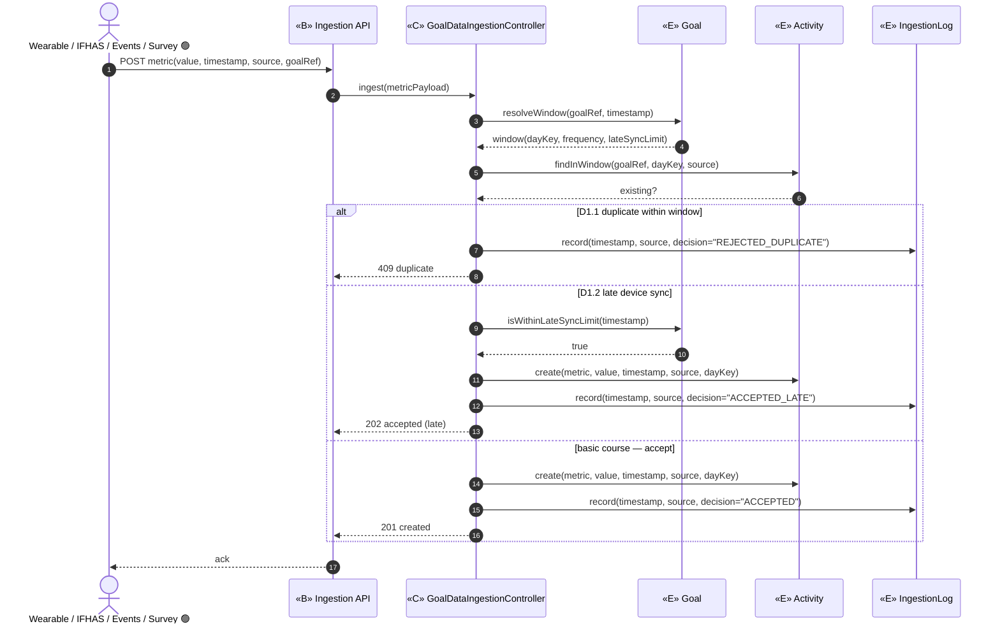

**Backward trace — UC-D1**

| # | Message → owner | Use-case course | Robustness object |
|---|-----------------|-----------------|-------------------|
| ingest | `GoalDataIngestionController.ingest` | D1 basic (ingest) | `«C» GoalDataIngestionController` |
| resolveWindow / isWithinLateSyncLimit | `Goal` | D1 (tag-to-goal+window) / D1.2 (late-sync check) | `«E» Goal` |
| findInWindow | `Activity` | D1.1 (dedupe-check) | `«E» Activity` |
| create | `Activity` | D1 basic / D1.2 | `«E» Activity` |
| record | `IngestionLog` | D1 (log every update), D1.1, D1.2 | `«E» IngestionLog (new)` |

---

## UC-D1a — Stream Wearable Telemetry (Health Connect SDK) 🟢 P1 ⊕

**Basic course (E2)**: the member's **on-device** `Health Connect SDK` reads Apple Health / Google Fit and
**streams** telemetry async through APIM-north → BFF Wearable Ingest → APIM-south → ingestion-svc.
ingestion-svc verifies, dedupe-checks against the Goal window, persists `Activity` (+ `IngestionLog`), and emits
`activity.verified`. This is a frontend stream, **not** a server-side wearables-cloud pull.
**Alternates**: D1a.1 duplicate-in-window → reject but still log; D1a.2 late device sync → accept within the
Goal's late-sync window and log the decision.

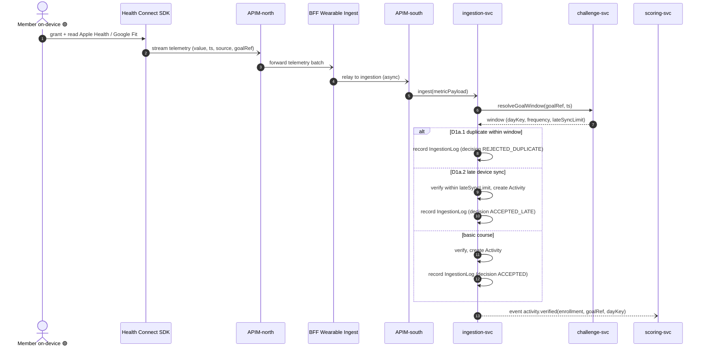

**Backward trace — UC-D1a ⊕**

| # | Message → owner | Use-case course | Robustness object |
|---|-----------------|-----------------|-------------------|
| stream telemetry | `Health Connect SDK` → `BFF Wearable Ingest` | D1a basic (on-device frontend stream) | `«B» Health Connect SDK`, `«B» BFF Wearable Ingest` |
| ingest | `WearableIngestController` (ingestion-svc) | D1a basic (verify) | `«C» WearableIngestController` + `«B» Ingestion API` |
| resolveGoalWindow | `Goal` | D1a (tag-to-goal+window) / D1a.2 | `«E» Goal` |
| create Activity | `Activity` | D1a basic / D1a.2 | `«E» Activity` |
| record IngestionLog | `IngestionLog` | D1a, D1a.1, D1a.2 | `«E» IngestionLog (new)` |
| activity.verified | `WearableIngestController` | D1a (emit verified event) | `«C» WearableIngestController` |

---

## UC-D1b — Submit Survey / Check-in Response 🟢 P1 ⊕

**Basic course (E3)**: the member's **on-device** `Surveys / Check-ins` screen fetches **survey info**
(definitions/questions) **sync** from the `Sahatna Survey API`, then **submits** a response. The `SurveyResponse`
**streams the SAME way as wearables** — async through APIM-north → Sahatna Survey API → APIM-south →
ingestion-svc — where it is ingested as **self-reported activity** (a check-in), feeding scoring like a verified
wearable metric.
**Alternates**: D1b.1 survey-info read is sync (no ingestion); D1b.2 duplicate check-in in window → reject but
still log.

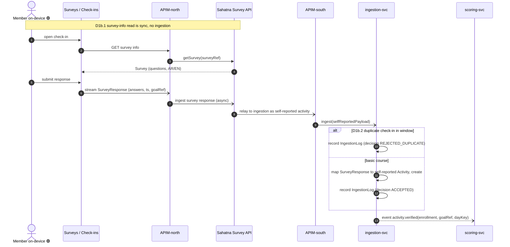

**Backward trace — UC-D1b ⊕**

| # | Message → owner | Use-case course | Robustness object |
|---|-----------------|-----------------|-------------------|
| getSurvey | `Sahatna Survey API` → `Survey` | D1b.1 (sync survey-info read) | `«B» Sahatna Survey API`, `«E» Survey (new)` |
| stream SurveyResponse | `Surveys / Check-ins` → `Sahatna Survey API` | D1b basic (async submit) | `«B» Surveys / Check-ins`, `«B» Sahatna Survey API` |
| ingest (self-reported) | `SurveyResponseController` (ingestion-svc) | D1b basic (ingest as activity) | `«C» SurveyResponseController` + `«B» Ingestion API` |
| map to Activity / create | `SurveyResponse` → `Activity` | D1b basic (self-reported activity) | `«E» SurveyResponse (new)`, `«E» Activity` |
| record IngestionLog | `IngestionLog` | D1b, D1b.2 | `«E» IngestionLog (new)` |
| activity.verified | `SurveyResponseController` | D1b (feed scoring) | `«C» SurveyResponseController` |

---

## UC-D2 — Evaluate Daily Goal Success 🟢 P1

**Basic course**: at day-close the Clock fires the Day-Close Trigger → controller, per enrollment,
evaluates each daily Goal's threshold against the day's Activity, writes `DailyResult`
(`isSuccessfulDay = ≥1 daily goal met`), and feeds the `Streak` counter.
**Alternates**: D2.1 only fires after day-close (no mid-day path); D2.2 mid-week enrollment → days prior
to `enrollmentDate` yield empty `DailyResult`.

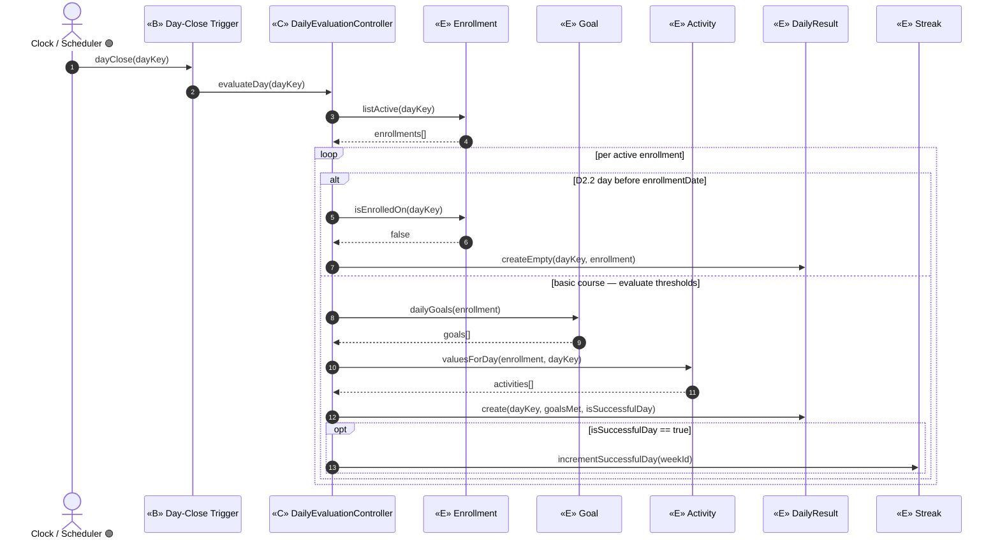

> **D2.1** is enforced structurally: the only inbound boundary is `Day-Close Trigger`; the controller has
> no mid-day entry point. `isSuccessfulDay` (= ≥1 daily goal met) is computed by the controller across
> goals and persisted on `DailyResult`.

**Backward trace — UC-D2**

| # | Message → owner | Use-case course | Robustness object |
|---|-----------------|-----------------|-------------------|
| evaluateDay | `DailyEvaluationController` | D2 basic (after day-close) / D2.1 | `«C» DailyEvaluationController` + `«B» Day-Close Trigger` |
| listActive / isEnrolledOn | `Enrollment` | D2 (scope per participant) / D2.2 | `«E» Enrollment` |
| dailyGoals | `Goal` | D2 (read threshold) | `«E» Goal` |
| valuesForDay | `Activity` | D2 (read metric) | `«E» Activity` |
| create / createEmpty | `DailyResult` | D2 (mark successful-day) / D2.2 (empty prior days) | `«E» DailyResult` |
| incrementSuccessfulDay | `Streak` | D2 (feed streak) | `«E» Streak` |

---

## UC-D3 — Compute Weekly Score 🟢 P1

**Basic course**: a `Goal-Met Event` (raised by D2's evaluation) drives a dynamic recompute → controller
sums each goal's weighted contribution from the `ScoringPlan` / `ScoreComponent`, clamps to the 100-cap,
and writes `WeeklyScore`.
**Alternates**: D3.1 no goals met → score 0; D3.2 the 100-cap is never exceeded (cap invariant).

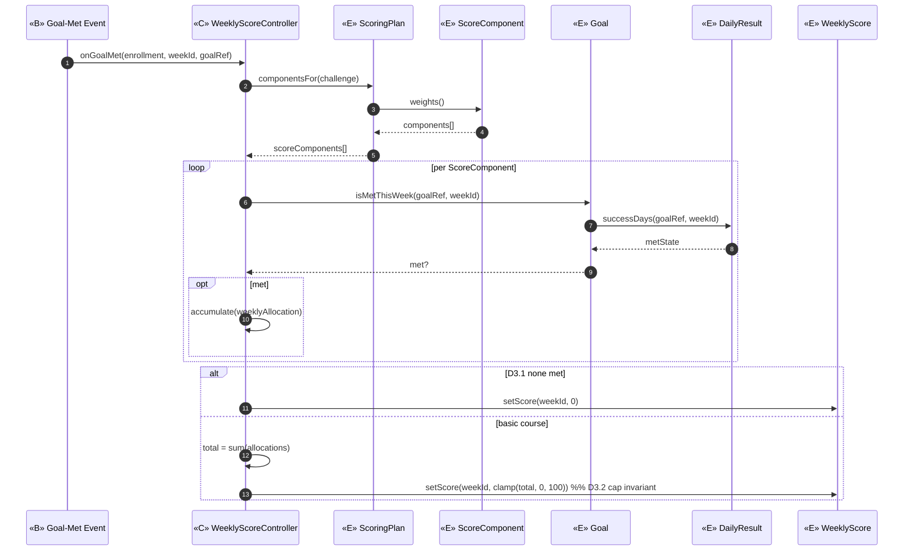

> **D3.2** the cap (`clamp(..,0,100)`) is controller logic — no single entity owns it — but the clamped
> value is written to `WeeklyScore.scoreValue`. The `Goal-Met Event` boundary is raised by UC-D2's
> controller, not a human actor (Package D is system-driven).

**Backward trace — UC-D3**

| # | Message → owner | Use-case course | Robustness object |
|---|-----------------|-----------------|-------------------|
| onGoalMet | `WeeklyScoreController` | D3 basic (dynamic update) | `«C» WeeklyScoreController` + `«B» Goal-Met Event` |
| componentsFor / weights | `ScoringPlan` / `ScoreComponent` | D3 (weighted contribution) | `«E» ScoringPlan`, `«E» ScoreComponent` |
| isMetThisWeek / successDays | `Goal` / `DailyResult` | D3 (per-goal contribution) | `«E» Goal`, `«E» DailyResult` |
| accumulate / total / clamp | `WeeklyScoreController` | D3 (sum) / D3.2 (cap) | `«C» WeeklyScoreController` |
| setScore | `WeeklyScore` | D3 / D3.1 (zero) / D3.2 (≤100) | `«E» WeeklyScore` |

---

## UC-D4 — Award Streak / Consistency Bonus 🟢 P1

**Basic course**: within-week (Streak-Update) and at week-close (Clock), the controller counts
successful days (cap 7), resolves the tier (Bronze 4/7, Silver 6/7, Gold 7/7), and folds the configured
consistency bonus into the `WeeklyScore` via the `isConsistencyBonus` `ScoreComponent`.
**Alternates**: D4.1 bonus is embedded inside the 100 total; D4.2 streak resets each week — no carryover.

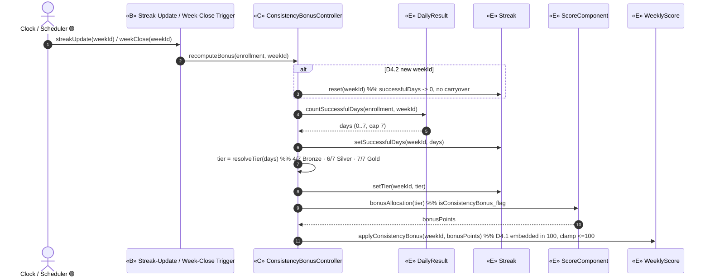

> **D4.1** the bonus is delivered through the `isConsistencyBonus_flag` `ScoreComponent`, so
> `WeeklyScore.applyConsistencyBonus` keeps the total ≤100 (same cap invariant as D3.2).
> **D4.2** `Streak.reset` zeroes `successfulDays` on each new `weekId` (`resetsWeekly`).

**Backward trace — UC-D4**

| # | Message → owner | Use-case course | Robustness object |
|---|-----------------|-----------------|-------------------|
| recomputeBonus | `ConsistencyBonusController` | D4 basic | `«C» ConsistencyBonusController` + `«B» Streak-Update / Week-Close Trigger` |
| countSuccessfulDays | `DailyResult` | D4 (count successful days) | `«E» DailyResult` |
| reset / setSuccessfulDays / setTier | `Streak` | D4 (write tier/days) / D4.2 (reset) | `«E» Streak` |
| resolveTier | `ConsistencyBonusController` | D4 (resolve tier) | `«C» ConsistencyBonusController` |
| bonusAllocation | `ScoreComponent` | D4 (configured bonus weight) | `«E» ScoreComponent` |
| applyConsistencyBonus | `WeeklyScore` | D4.1 (embedded in 100) | `«E» WeeklyScore` |

---

## UC-D5 — Finalize Weekly Score 🟢 P1

**Basic course**: at week-close the Clock fires → controller finalizes `WeeklyScore` (sets
`finalized_flag` + `finalizedTimestamp`), locks it immutable with a traceability link to the day data,
and emits the downstream triggers: reward-point accrual (G1), weekly summary (H4), and Title progression
(D8 🟡).
**Alternates**: D5.1 late data cannot change a finalized score; D5.2 a partial week is extrapolated to /100
before lock.

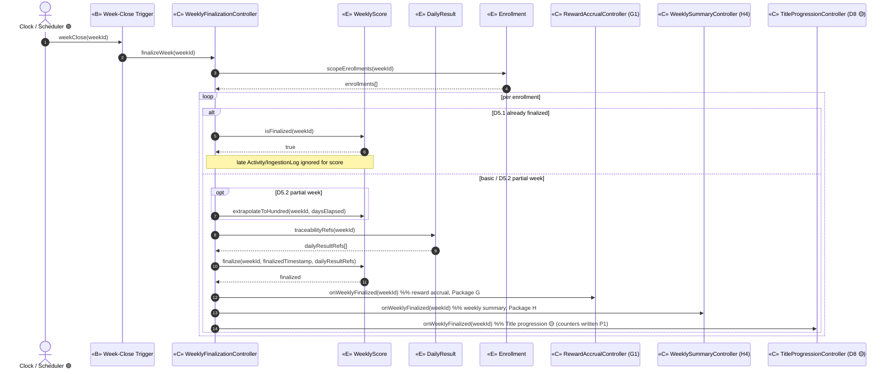

> **D5.1** `WeeklyScore.finalize` is idempotent: once `finalized_flag=true` the controller refuses
> mutation. Downstream controllers (G1/H4/D8) are collaborators owned by other packages — shown here only
> to record the trigger edges; their internals are not re-detailed in Package D.

**Backward trace — UC-D5**

| # | Message → owner | Use-case course | Robustness object |
|---|-----------------|-----------------|-------------------|
| finalizeWeek | `WeeklyFinalizationController` | D5 basic | `«C» WeeklyFinalizationController` + `«B» Week-Close Trigger` |
| scopeEnrollments | `Enrollment` | D5 (scope) | `«E» Enrollment` |
| isFinalized | `WeeklyScore` | D5.1 (no late change) | `«E» WeeklyScore` |
| extrapolateToHundred | `WeeklyScore` | D5.2 (partial week /100) | `«E» WeeklyScore` |
| traceabilityRefs | `DailyResult` | D5 (traceable to goal data) | `«E» DailyResult` |
| finalize | `WeeklyScore` | D5 (finalize + lock immutable) | `«E» WeeklyScore` |
| onWeeklyFinalized ×3 | `RewardAccrualController` / `WeeklySummaryController` / `TitleProgressionController` | D5 (emit downstream triggers G1/H4/D8) | `«C» CG1`, `«C» CH4`, `«C» CD8 🟡` |

---

## UC-D6 — Compute Final Wellness Score & Tie-Break 🟢 P1

**Basic course**: at challenge-end the Clock fires → `FinalScoreController` averages the completed,
finalized weekly scores (equal weight; late enrollment averages from its enrollment week), writes and
locks `WellnessScore`; then `TieBreakController` orders competitors into the finalized `Ranking`, applying
the `ScoringPlan.tieBreakRules` (more weeks above threshold; then lower variance).
**Alternates**: D6.1 no updates after finalization; D6.2 a membership change must not retroactively alter
finalized weekly scores.

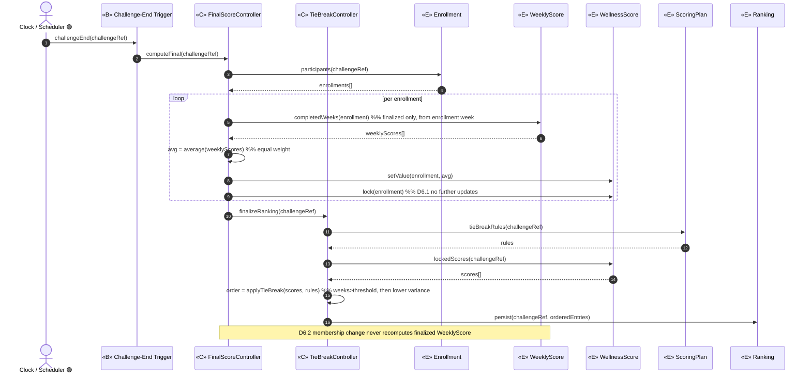

> `Ranking` is the **scoring-side** finalized order; the Package-E `Leaderboard` later *reflects* it as a
> read-only view. Averaging and tie-break ordering are controller logic (cross-entity), but their results
> are persisted to `WellnessScore` and the new `Ranking` entity.

**Backward trace — UC-D6**

| # | Message → owner | Use-case course | Robustness object |
|---|-----------------|-----------------|-------------------|
| computeFinal / average | `FinalScoreController` | D6 basic (average completed weeks) | `«C» FinalScoreController` + `«B» Challenge-End Trigger` |
| participants | `Enrollment` | D6 (scope; from enrollment week) | `«E» Enrollment` |
| completedWeeks | `WeeklyScore` | D6 (read finalized weeks) / D6.2 (never recompute) | `«E» WeeklyScore` |
| setValue / lock / lockedScores | `WellnessScore` | D6 (write+lock) / D6.1 (no updates) | `«E» WellnessScore` |
| finalizeRanking / applyTieBreak | `TieBreakController` | D6 (finalize rankings + tie-break) | `«C» TieBreakController` |
| tieBreakRules | `ScoringPlan` | D6 (tie-break rules) | `«E» ScoringPlan` |
| persist | `Ranking` | D6 (finalized ordered result) | `«E» Ranking (new)` |

---

## UC-D7 — Award Badge 🟢 P1

**Basic course**: a `Badge-Trigger Event` (raised by D2/D3/D4/D5 evaluations or a participation event)
arrives → controller evaluates the trigger against the `Badge` template, awards or advances the
`BadgeAward`, and attaches it to the `Member`; in-progress badges are tracked with a percent.
**Alternates**: D7.1 tiered advance (bump tier when a higher threshold is crossed); D7.2 team/district
badge categories deferred 🟡🔵; D7.3 badges persist across challenges (attach to `Member`, not `Enrollment`).

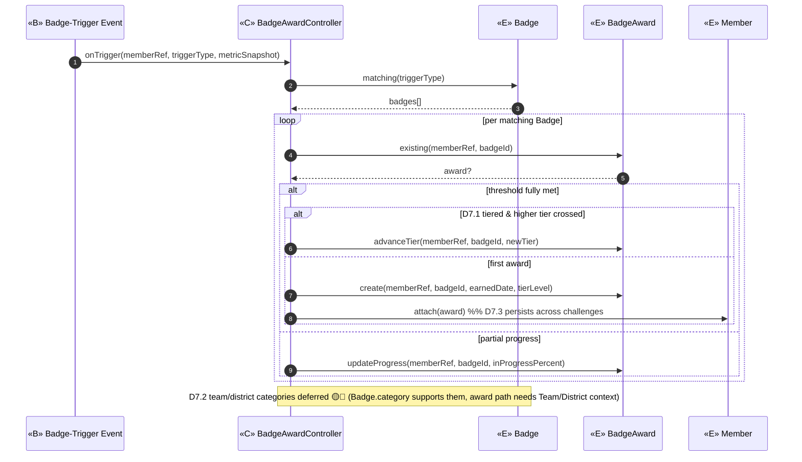

> **D7.3** `BadgeAward` attaches to `Member` (not `Enrollment`), so badges persist across challenges.
> **D7.2** is structurally present in `Badge.category` but the award path for team/district context is out
> of Phase-1 scope.

**Backward trace — UC-D7**

| # | Message → owner | Use-case course | Robustness object |
|---|-----------------|-----------------|-------------------|
| onTrigger | `BadgeAwardController` | D7 basic (evaluate trigger) | `«C» BadgeAwardController` + `«B» Badge-Trigger Event` |
| matching | `Badge` | D7 (template + triggerType) | `«E» Badge` |
| existing / create / advanceTier / updateProgress | `BadgeAward` | D7 (award) / D7.1 (tiered advance) / D7 (in-progress) | `«E» BadgeAward` |
| attach | `Member` | D7.3 (persist across challenges) | `«E» Member` |

---

## UC-D8 — Award / Advance Title 🟡 P2 (deferred — modelled for traceability)

**Basic course**: on a Weekly-Finalized event (from D5), the controller increments the lifetime
`MemberProgression` counters (`totalCompletedWeeks`, and `totalPerfectWeeks` when the week was perfect),
then advances `Title` to the highest unlocked level per thresholds.
**Alternates**: D8.1 disenroll before finalization → that week is not counted; D8.2 counters never change
retroactively.

> **P1 note**: the **counters** are written by Phase-1 scoring (forward-traceability); the **Title**
> read-out is the P2 user-facing feature — hence the `🟡` lifelines/messages below.

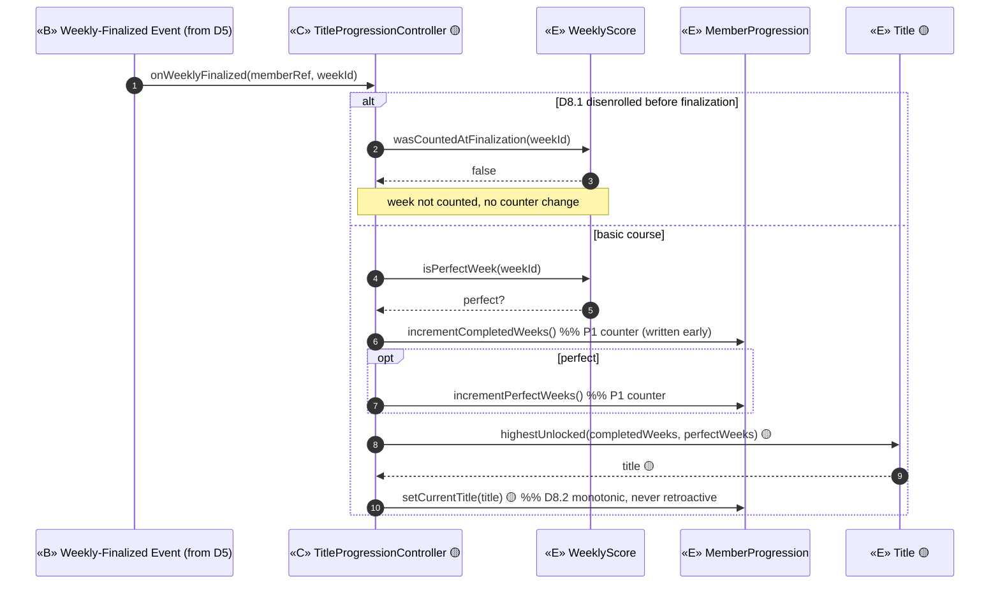

**Backward trace — UC-D8 🟡**

| # | Message → owner | Use-case course | Robustness object |
|---|-----------------|-----------------|-------------------|
| onWeeklyFinalized | `TitleProgressionController 🟡` | D8 basic | `«C» TitleProgressionController 🟡` + `«B» Weekly-Finalized Event` |
| wasCountedAtFinalization / isPerfectWeek | `WeeklyScore` | D8.1 (disenroll) / D8 (perfect-week) | `«E» WeeklyScore` |
| incrementCompletedWeeks / incrementPerfectWeeks / setCurrentTitle | `MemberProgression` | D8 (counters P1) / D8.2 (no retroactive) | `«E» MemberProgression` |
| highestUnlocked | `Title 🟡` | D8 (advance highest unlocked) | `«E» Title 🟡` |

---

## UC-D9 — Aggregate Team Score 🟡 P2 (deferred — modelled for traceability)

**Basic course**: on a Team-Score Recalc event, the controller averages member `WellnessScore`s, writes
the team average (materialised as a `WellnessScore` via the existing `Team→WellnessScore` association),
and updates the team's place in `Ranking`.
**Alternate**: D9.1 member add/remove → average recalculated *forward* only.

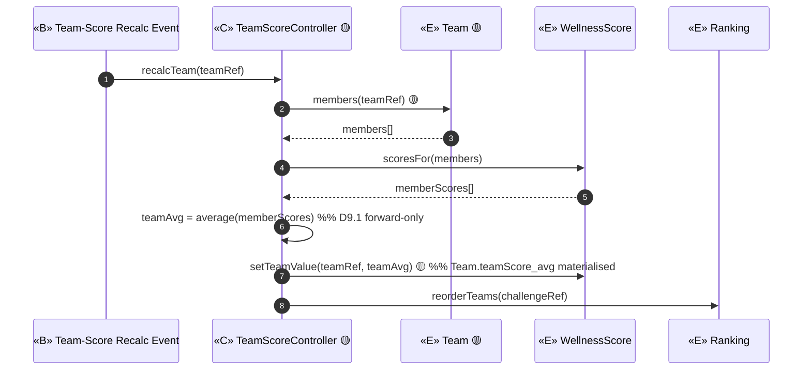

> `TeamScore` reuses `Team.teamScore_avg` (a `WellnessScore` via `Team→WellnessScore`) — **no new class**.

**Backward trace — UC-D9 🟡**

| # | Message → owner | Use-case course | Robustness object |
|---|-----------------|-----------------|-------------------|
| recalcTeam / teamAvg | `TeamScoreController 🟡` | D9 basic / D9.1 (forward recalc) | `«C» TeamScoreController 🟡` + `«B» Team-Score Recalc Event` |
| members | `Team 🟡` | D9 (team membership) | `«E» Team 🟡` |
| scoresFor / setTeamValue | `WellnessScore` | D9 (average of member scores) | `«E» WellnessScore` |
| reorderTeams | `Ranking` | D9 (teams ranked) | `«E» Ranking (new)` |

---

## UC-D10 — Aggregate District Score 🔵 P3 (deferred — modelled for traceability)

**Basic course**: on a District-Score Recalc event, the controller averages participating users'
`WellnessScore`s, writes the district average (materialised as a `WellnessScore` via
`District→WellnessScore`), and updates the district's place in `Ranking`.
**Alternate**: D10.1 a user cannot change district mid-challenge.

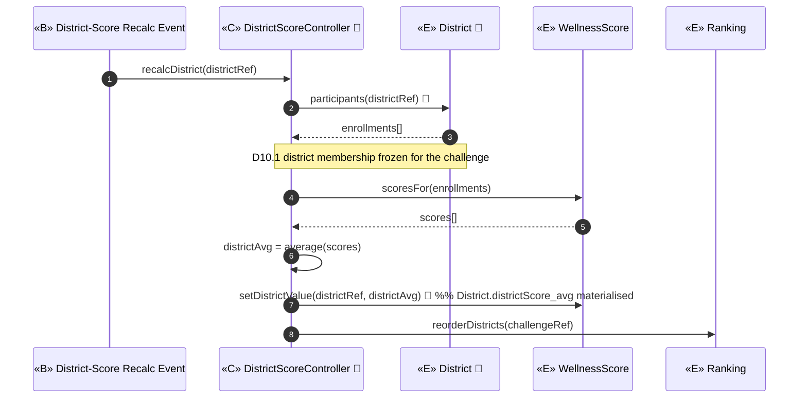

> `DistrictScore` reuses `District.districtScore_avg` (a `WellnessScore` via `District→WellnessScore`) — **no new class**.

**Backward trace — UC-D10 🔵**

| # | Message → owner | Use-case course | Robustness object |
|---|-----------------|-----------------|-------------------|
| recalcDistrict / districtAvg | `DistrictScoreController 🔵` | D10 basic | `«C» DistrictScoreController 🔵` + `«B» District-Score Recalc Event` |
| participants | `District 🔵` | D10 (one district per user) / D10.1 (frozen) | `«E» District 🔵` |
| scoresFor / setDistrictValue | `WellnessScore` | D10 (average of user scores) | `«E» WellnessScore` |
| reorderDistricts | `Ranking` | D10 (districts ranked) | `«E» Ranking (new)` |

---

## Operation Allocation Summary (forward link → Step 4 Design)

Each message above is now a method on the entity that owns the data. These are the operations the
domain classes (`02-domain-model.md`) must expose at design time:

| Entity | Allocated operations (from this step) | From UCs |
|--------|---------------------------------------|----------|
| `Goal` | resolveWindow, isWithinLateSyncLimit, dailyGoals, isMetThisWeek | D1, D2, D3 |
| `Activity` | findInWindow, create, valuesForDay | D1, D2 |
| `IngestionLog` (new) | record | D1 |
| `Enrollment` | listActive, isEnrolledOn, scopeEnrollments, participants | D2, D5, D6 |
| `DailyResult` | create, createEmpty, successDays, countSuccessfulDays, traceabilityRefs | D2, D3, D4, D5 |
| `Streak` | incrementSuccessfulDay, reset, setSuccessfulDays, setTier | D2, D4 |
| `ScoringPlan` | componentsFor, tieBreakRules | D3, D6 |
| `ScoreComponent` | weights, bonusAllocation | D3, D4 |
| `WeeklyScore` | setScore, applyConsistencyBonus, isFinalized, extrapolateToHundred, finalize, completedWeeks, isPerfectWeek, wasCountedAtFinalization | D3, D4, D5, D6, D8 |
| `WellnessScore` | setValue, lock, lockedScores, scoresFor, setTeamValue 🟡, setDistrictValue 🔵 | D6, D9, D10 |
| `Ranking` (new) | persist, reorderTeams 🟡, reorderDistricts 🔵 | D6, D9, D10 |
| `Badge` | matching | D7 |
| `BadgeAward` | existing, create, advanceTier, updateProgress | D7 |
| `Member` | attach (badge) | D7 |
| `MemberProgression` | incrementCompletedWeeks, incrementPerfectWeeks, setCurrentTitle 🟡 | D8 |
| `Title 🟡` | highestUnlocked | D8 |
| `Team 🟡` | members | D9 |
| `District 🔵` | participants | D10 |

**Controller-resident logic** (cross-entity, not owned by any single entity): cap-clamp (D3.2/D4.1),
weekly averaging (D6), tie-break ordering (D6), tier resolution (D4), team/district averaging (D9/D10).
These stay on their controllers per Rosenberg's allocation rule and become application-layer services in
Step 4.
