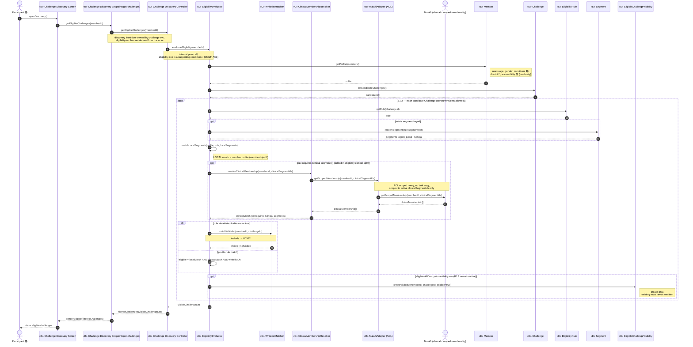
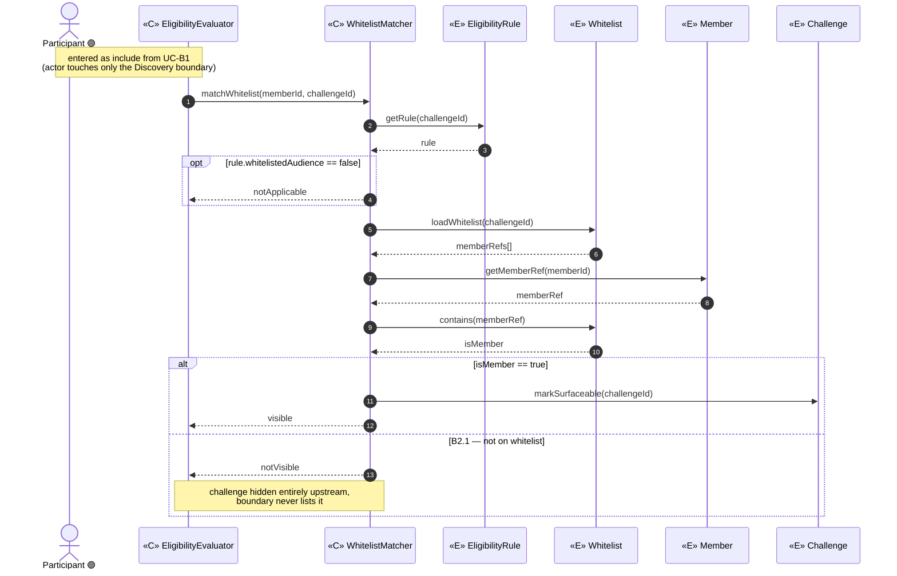
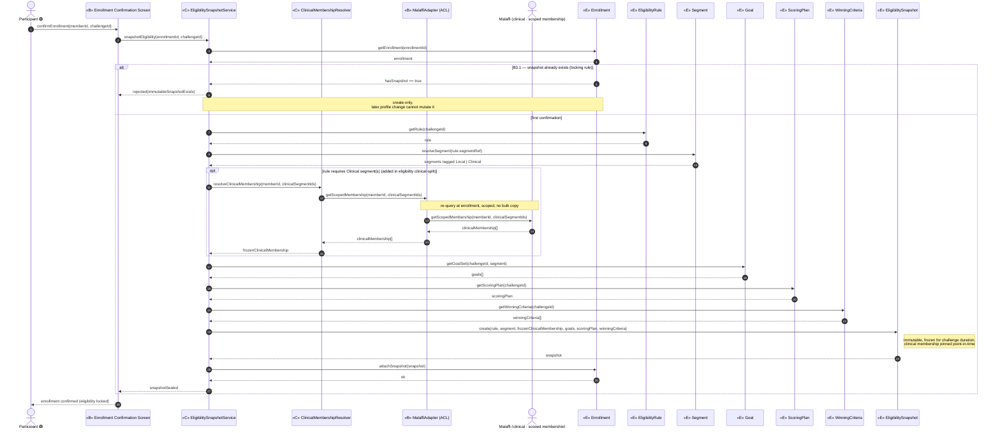

# ICONIX Step 3 — Sequence Diagrams

## Package B — Eligibility & Audience Targeting (`eligibility`) · 🟢 P1

**Process**: ICONIX (Rosenberg), use-case-driven. This is the Step-3 deliverable for the
`eligibility` package. Each use case from [`01-use-cases.md`](../01-use-cases.md) §Package B —
already classified into boundary/control/entity in
[`03-robustness/eligibility.md`](../03-robustness/eligibility.md) — is here expanded into a
**Mermaid `sequenceDiagram`**.

**Method allocation rule (ICONIX Step 4 discipline)**: the **control** objects from the robustness
diagram become the *senders*; each **operation is allocated to the entity that owns the data** it
reads/writes (the "expert" pattern). Boundary and entity objects never message each other directly —
every hop is mediated by a control, preserving the robustness invariants.

**Traceability chain**: `UC ⇄ domain class ⇄ robustness object ⇄ sequence message`. Every message
carries a backward link to its use-case step (B1.x / B2.x / B3.x) in the per-diagram **Message →
UC trace** table that follows each diagram.

**Phase scope**: Package B is entirely 🟢 **P1** (individual-based). District (🔵 P3) and
accessibility/PoD (🟡 P2) appear only as *read attributes* on `Member` / `EligibilityRule` /
`Segment` and are tagged inline; **no P2/P3 behaviour is sequenced**. Teams / Districts /
baseline-personalized goals / Titles are out of build scope for this package.

**Participants** (carried verbatim from the robustness diagrams):

| Stereotype | Objects |
|---|---|
| Actor | Participant 🟢, Malaffi (external · clinical · scoped membership, ACL) (added in eligibility clinical-split) |
| «B» Boundary | Challenge Discovery Screen, Challenge Discovery Endpoint (get-challenges, discovery front door owned by challenge-svc — replaces the directly-exposed Eligibility API), Enrollment Confirmation Screen, MalaffiAdapter (ACL boundary to Malaffi) (added in eligibility clinical-split) |
| «C» Control | Challenge Discovery Controller (challenge-svc — invokes eligibility internally), EligibilityEvaluator, WhitelistMatcher, EligibilitySnapshotService, ClinicalMembershipResolver (added in eligibility clinical-split) |
| «E» Entity | Member, Challenge, EligibilityRule, Segment (abstract → LocalSegment / ClinicalSegment, added in eligibility clinical-split), Whitelist (NEW), EligibleChallengeVisibility (NEW), Enrollment, Goal, ScoringPlan, WinningCriteria, EligibilitySnapshot (NEW, immutable) |

> **Naming (C4 `solution-c4.drawio`)**: the entities/controls above are realized at runtime by
> `eligibility-svc` (hosts EligibilityEvaluator / WhitelistMatcher / ClinicalMembershipResolver /
> MalaffiAdapter), `eligibility-cache`, `membership-db` (Member profile = LOCAL segments),
> `enrolment-svc`, `challenge-svc`/`challenge-db`, `domain-event-log`, and the external `Malaffi`
> system (CLINICAL segment membership, scoped-membership ACL query — no bulk copy).
> **Discovery exposure**: the discovery front door (get-challenges) is owned by `challenge-svc`,
> which invokes `eligibility-svc` (EligibilityEvaluator) internally as a peer call — `eligibility-svc`
> is an internal supporting read-model (CohortScope projection + Malaffi ACL) with **no APIM-south
> inbound** and is never a citizen front door. Snapshot is reached internally from `enrolment-svc`.

---

## UC-B1 — Evaluate Challenge Eligibility 🟢 P1

> *realizes P1-3a, §Eligibility & Audience Targeting · included by UC-C3 Enroll · includes UC-B2*

**Basic Course**: the Participant opens the Challenge Discovery surface and calls the **Challenge
discovery endpoint** (`getEligibleChallenges`, the discovery front door owned by `challenge-svc`);
that **Challenge discovery controller** invokes `EligibilityEvaluator` **internally** (there is no
directly-exposed Eligibility API to the actor — `eligibility-svc` is an internal supporting read-model
reached only as a peer call). `EligibilityEvaluator`
reads the member profile and each candidate challenge's rule (resolving `Segment` for segment-keyed
rules — each candidate segment tagged **Local** or **Clinical**), **includes** `WhitelistMatcher`
for whitelist-gated challenges, writes the per-member `EligibleChallengeVisibility` set, and the
boundary renders it. **Clinical branch (added in eligibility clinical-split)**: where the rule
requires one or more `ClinicalSegment`s, the evaluator delegates to `ClinicalMembershipResolver`,
which calls `Malaffi` via the `MalaffiAdapter` ACL —
`getScopedMembership(memberId, clinicalSegmentIds)`, scoped to the active clinical segment ids only
(data minimisation, **no membership copied/stored** locally). A member is eligible **iff** the
profile matches **all** required LOCAL segments **AND** Malaffi confirms **all** required CLINICAL
segments **AND** any whitelist gate passes (UC-B2).
**Alternate Courses**: **B1.1** mid-challenge profile change must NOT retroactively alter eligibility
(evaluator is read-only against `Member`, never rewrites existing visibility) → `opt` guard;
**B1.2** a member eligible for several challenges may join all concurrently, each getting its own
goal set later → `loop` over the candidate set, each visibility row independent.

**Message → UC trace** (backward traceability)

| # | Message | Owner entity / control | UC step |
|---|---|---|---|
| openDiscovery / getEligibleChallenges | actor → Challenge Discovery Endpoint → Challenge Discovery Controller (discovery front door, challenge-svc) | UC-B1 Basic (entry boundary owned by Challenge) |
| evaluateEligibility | Challenge Discovery Controller → EligibilityEvaluator (internal peer call, no exposed Eligibility API) | UC-B1 Basic |
| getProfile | Member | UC-B1 Basic (profile read) |
| listCandidateChallenges / getRule | Challenge / EligibilityRule | UC-B1 Basic (rule match) |
| resolveSegment (tag Local / Clinical) | Segment (LocalSegment / ClinicalSegment) | UC-B1 Basic (segment-keyed rules) |
| matchLocalSegments | EligibilityEvaluator | UC-B1 Basic (LOCAL match vs membership-db profile) |
| resolveClinicalMembership / getScopedMembership | ClinicalMembershipResolver / MalaffiAdapter (ACL) → Malaffi | UC-B1 Basic (CLINICAL match, scoped membership, no bulk copy) |
| matchWhitelist | WhitelistMatcher | **UC-B2** (include) |
| eligible = localMatch AND clinicalMatch AND whitelistOk | EligibilityEvaluator | UC-B1 Basic (combined LOCAL AND CLINICAL AND whitelist) |
| createVisibility (create-only) | EligibleChallengeVisibility | **B1.1** no-retroactive guard |
| loop over candidates | — | **B1.2** concurrent joins |
| filteredChallenges / renderEligible | Challenge Discovery Controller → Challenge Discovery Endpoint → Challenge Discovery Screen (challenge-svc returns the filtered set) | UC-B1 Basic |

---

## UC-B2 — Match Whitelisted Audience 🟢 P1

> *realizes P1-3b · included by UC-B1*

**Basic Course**: for a whitelist-targeted challenge, `WhitelistMatcher` reads the rule's
`whitelistedAudience` flag and the back-end `Whitelist` (NEW — list of permitted `Member`
references) and decides membership; on match the challenge is allowed to surface.
**Alternate Course**: **B2.1** member not on the whitelist → matcher returns `notVisible` to the
calling `EligibilityEvaluator`, which **hides the challenge entirely** (the boundary never lists it).

**Message → UC trace** (backward traceability)

| Message | Owner entity / control | UC step |
|---|---|---|
| matchWhitelist | WhitelistMatcher | UC-B2 Basic (entry, included by B1) |
| getRule | EligibilityRule | UC-B2 Basic (whitelistedAudience flag) |
| loadWhitelist / contains | Whitelist (NEW) | UC-B2 Basic (membership decision) |
| getMemberRef | Member | UC-B2 Basic (member reference) |
| markSurfaceable / `visible` | Challenge / WhitelistMatcher | UC-B2 Basic (match → surface) |
| `notVisible` (hide entirely) | WhitelistMatcher | **B2.1** not-on-whitelist guard |

---

## UC-B3 — Snapshot Eligibility at Enrollment 🟢 P1

> *realizes §General Enrollment Flow (snapshot) · included by UC-C3 Enroll on confirm*

**Basic Course**: on enrollment confirmation the Participant confirms via the Enrollment
Confirmation Screen; `EligibilitySnapshotService` reads the resolved `EligibilityRule`, matching
`Segment`, configured `Goal` set, `ScoringPlan` and `WinningCriteria`, and writes an immutable
`EligibilitySnapshot` (NEW) attached to the `Enrollment`. **Clinical freeze (added in eligibility
clinical-split)**: where the challenge's rule requires `ClinicalSegment`s, the service
**re-queries** Malaffi scoped membership via `ClinicalMembershipResolver` →`MalaffiAdapter` ACL
(`getScopedMembership(memberId, clinicalSegmentIds)`) and **freezes** that point-in-time clinical
result inside the immutable snapshot alongside the local match — so the participant's eligibility is
pinned and unaffected by later Malaffi/profile changes.
**Alternate Course**: **B3.1** a later profile change leaves the snapshot unaffected — the service
only ever **creates**, never updates, a snapshot (mirrors the B1.1 no-retroactive rule) → guarded
so re-confirmation on an enrollment that already has a snapshot is rejected.

**Message → UC trace** (backward traceability)

| Message | Owner entity / control | UC step |
|---|---|---|
| confirmEnrollment / snapshotEligibility | boundary → EligibilitySnapshotService | UC-B3 Basic (entry, included by C3) |
| getEnrollment / attachSnapshot | Enrollment | UC-B3 Basic (snapshot attached to enrollment) |
| getRule | EligibilityRule | UC-B3 Basic (resolved eligibility) |
| resolveSegment (tag Local / Clinical) | Segment (LocalSegment / ClinicalSegment) | UC-B3 Basic (matching segment) |
| resolveClinicalMembership / getScopedMembership (re-query + freeze) | ClinicalMembershipResolver / MalaffiAdapter (ACL) → Malaffi | UC-B3 Basic (clinical membership frozen in snapshot, scoped, no bulk copy) |
| getGoalSet | Goal | UC-B3 Basic (configured goal set) |
| getScoringPlan | ScoringPlan | UC-B3 Basic (config params) |
| getWinningCriteria | WinningCriteria | UC-B3 Basic (config params) |
| create (immutable, freezes clinical membership) / `snapshotSealed` | EligibilitySnapshot (NEW) | UC-B3 Basic (immutable capture, clinical membership pinned) |
| `rejected(immutableSnapshotExists)` | EligibilitySnapshotService | **B3.1** locking / no-retroactive guard |

---

## Step-3 reconciliation & forward anchors

- **Control → method allocation**: `EligibilityEvaluator.evaluateEligibility` /
  `WhitelistMatcher.matchWhitelist` / `EligibilitySnapshotService.snapshotEligibility` are the three
  controller entry methods surfaced in Step-2; each delegates reads to the data-owning entity
  (Member, Challenge, EligibilityRule, Segment, Whitelist, Goal, ScoringPlan, WinningCriteria) and
  the create-only writes to the three NEW entities (EligibleChallengeVisibility, EligibilitySnapshot)
  / surfacing decision (Whitelist).
- **Rule guards realized as message-level fragments**: B1.1 / B3.1 no-retroactive + locking →
  `opt` / `alt` guards making `createVisibility` and `EligibilitySnapshot.create` **create-only**;
  B2.1 hide-entirely → `WhitelistMatcher` returning `notVisible` upstream; B1.2 concurrent joins →
  the per-candidate `loop`.
- **Cross-package includes carried as message sends**: UC-B1 → UC-B2 (`matchWhitelist`); UC-C3
  (`enrolment`) → UC-B1 (`evaluateEligibility`) and → UC-B3 (`snapshotEligibility`). These will be
  the call sites when the `enrolment` package's UC-C3 sequence is drawn.
- **Backward traceability intact**: every message above resolves to a UC step (B1.x/B2.x/B3.x) via
  the per-diagram trace tables, and to a domain class via the Step-2 robustness traceability tables.

### Open back-port action (unchanged from Step 2)
`Whitelist`, `EligibleChallengeVisibility`, `EligibilitySnapshot` and their associations still need
back-porting into [`02-domain-model.md`](../02-domain-model.md) so the entity lifelines used above
trace to first-class domain classes.
