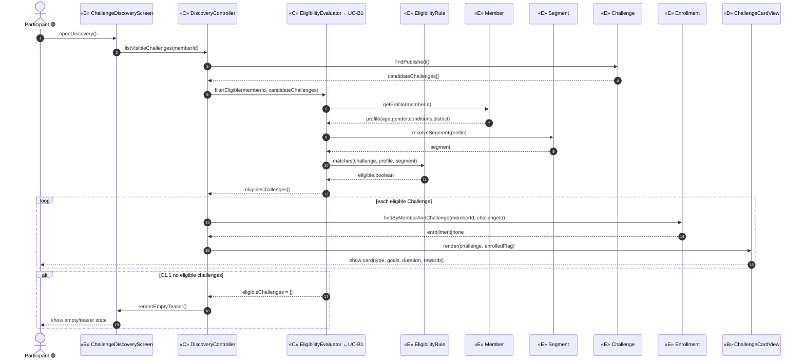
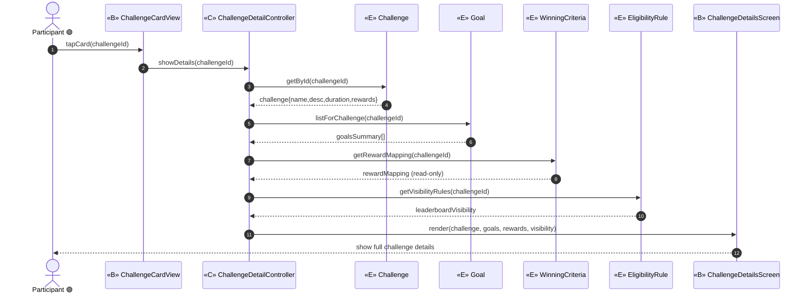
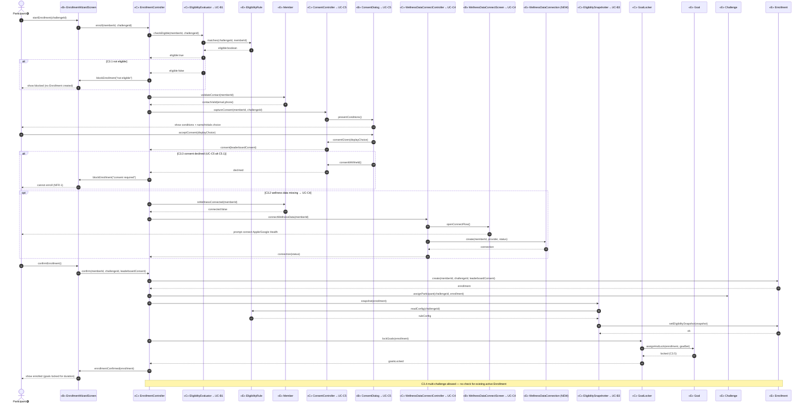
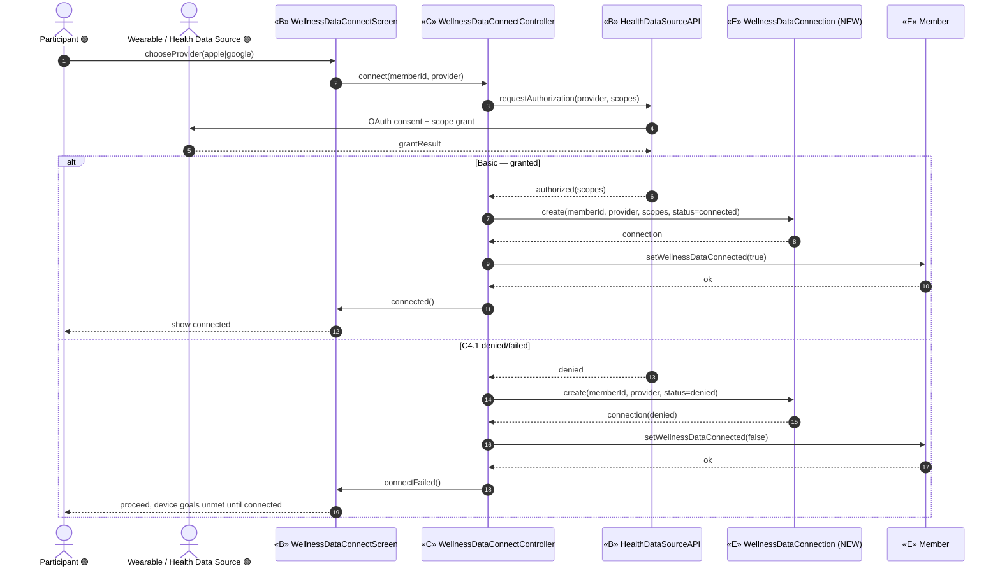
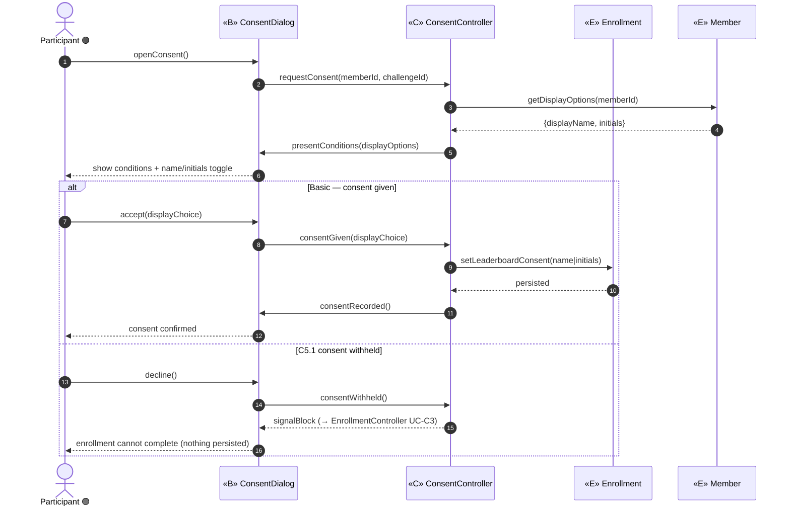
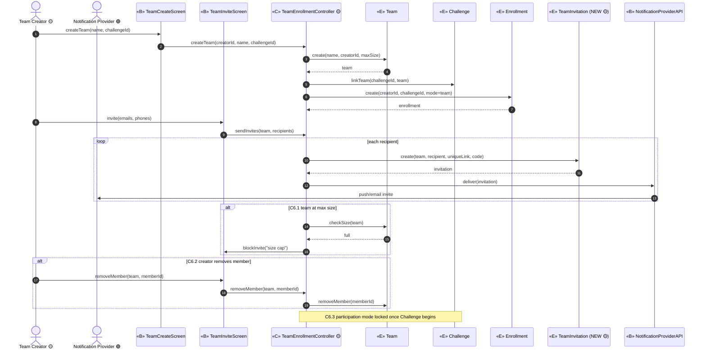
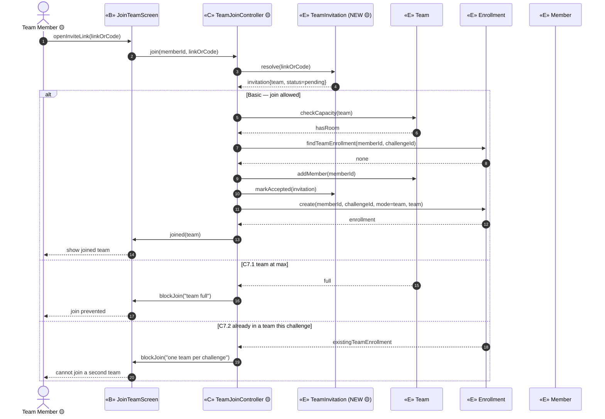
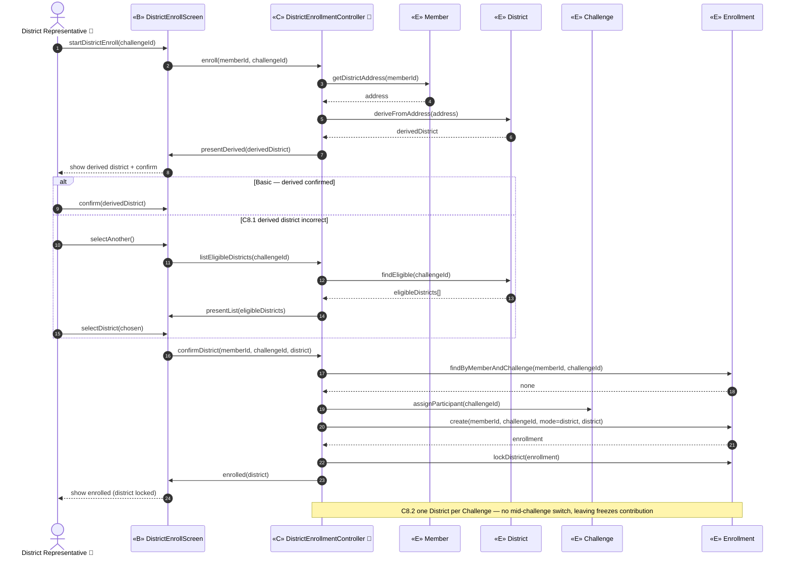

# ICONIX Step 3 — Sequence Diagrams: Package C "Discovery & Enrolment" (`enrolment`)

> **Process**: ICONIX (Rosenberg), use-case-driven. This is the **Step-3 sequence** deliverable for
> package **C. Discovery & Enrolment** (id `enrolment`, dominant phase 🟢 P1).
>
> **Step-3 allocation rules** (Rosenberg "design closure"):
> 1. **Participants** are the **«B» boundary**, **«C» control** and **«E» entity** objects lifted directly from
>    the `03-robustness/enrolment.md` diagrams — nothing new is invented.
> 2. **Controllers become messages**: every «C» control verb from robustness is realised here as a concrete method
>    call. The control object remains the orchestrator; the **operation is allocated to the «E» entity that owns the
>    data** it reads/writes (information-expert / "data owner" allocation).
> 3. **Basic Course** = the main solid-arrow flow. **Alternate Courses** = `alt` / `opt` fragments.
> 4. Actor edges terminate on «B» only; «B»↔«E» never direct — a «C» control always mediates (carried over from Step 2).
>
> **Traceability**: each diagram is followed by a **message → use-case** map (backward link) so every sequence
> message traces to the use-case sentence and the robustness object it came from. Use-case IDs from `01-use-cases.md`;
> entities from `02-domain-model.md`; objects from `03-robustness/enrolment.md`.
>
> **Phase discipline**: UC-C1..C5 are 🟢 **P1 in scope**. UC-C6/C7 are 🟡 **P2**, UC-C8 is 🔵 **P3** — sequences are
> included for forward-traceability but **tagged out of build scope**.
>
> **Method-ownership legend**: `Entity.method()` = operation allocated to the data-owning entity; `Control.method()`
> = pure orchestration step that owns no entity state.

---

## UC-C1 Discover Challenges 🟢 P1

**Basic Course**: Participant opens dashboard/Wellness module → `DiscoveryController` asks `EligibilityEvaluator`
(←UC-B1) to filter the catalogue against the member profile/segment, marks already-enrolled cards from `Enrollment`,
and renders a `ChallengeCardView` per visible `Challenge`.
**Alt C1.1**: zero eligible challenges → empty/teaser state, no entity write.

**Backward traceability (message → UC / robustness object)**

| Message | Use case | Robustness origin |
|---|---|---|
| `openDiscovery()` | UC-C1 "sees enrolled + new Challenges on dashboard/Wellness module" | actor→`ChallengeDiscoveryScreen` |
| `listVisibleChallenges()` | UC-C1 discover verb | `DiscoveryController` |
| `Challenge.findPublished()` | UC-C1 "new Challenges featured" | «E» `Challenge` |
| `filterEligible()` + `Member/Segment/EligibilityRule` reads | UC-C1 `«include»` UC-B1 eligibility | `EligibilityEvaluator`(←B1) |
| `Enrollment.findByMemberAndChallenge()` | UC-C1 "mark already-enrolled cards" | «E» `Enrollment` |
| `ChallengeCardView.render()` | UC-C1 "each card shows type/goals/duration/rewards" | «B» `ChallengeCardView` |
| `renderEmptyTeaser()` | **Alt C1.1** no eligible challenges | `DiscoveryController`/`ChallengeDiscoveryScreen` |

---

## UC-C2 View Challenge Details 🟢 P1

**Basic Course**: Participant taps a `ChallengeCardView` → `ChallengeDetailController` loads the full `Challenge`,
its `Goal` summary, the `WinningCriteria` reward mapping (read-only) and `EligibilityRule`, and renders
`ChallengeDetailsScreen`.

**Backward traceability**

| Message | Use case | Robustness origin |
|---|---|---|
| `tapCard()` | UC-C2 "taps a Challenge Card" | actor→`ChallengeCardView` |
| `showDetails()` | UC-C2 view-details verb | `ChallengeDetailController` |
| `Challenge.getById()` | UC-C2 "view full details before enrolling" | «E» `Challenge` |
| `Goal.listForChallenge()` | UC-C2 "goals summary" | «E» `Goal` |
| `WinningCriteria.getRewardMapping()` | UC-C2 "rewards mapping shown read-only" | «E» `WinningCriteria` |
| `EligibilityRule.getVisibilityRules()` | UC-C2 leaderboard-visibility preview | «E» `EligibilityRule` |
| `ChallengeDetailsScreen.render()` | UC-C2 details screen | «B» `ChallengeDetailsScreen` |

---

## UC-C3 Enroll (Individual) 🟢 P1 — the package keystone

**Basic Course**: Participant opts in on `EnrollmentWizardScreen`. `EnrollmentController` orchestrates:
(1) re-check eligibility via `EligibilityEvaluator` (←UC-B1); (2) validate contact/email on `Member`; (3) capture
name/initials consent via `ConsentController` (←UC-C5); (4) if wellness data missing, route to
`WellnessDataConnectController` (←UC-C4); (5) on confirm, create the `Enrollment`, snapshot eligibility + config via
`EligibilitySnapshotter` (←UC-B3), and `GoalLocker` locks the goal set. Strictly **opt-in** (NFR-1).
**Alts**: C3.1 not eligible → blocked; C3.2 no wellness data → route to UC-C4; C3.3 consent declined → cannot
enroll; C3.4 multi-challenge allowed (no active-enrollment check); C3.5 goals locked on confirm.

**Backward traceability**

| Message | Use case | Robustness origin |
|---|---|---|
| `startEnrollment()` / `enroll()` | UC-C3 "elects to enroll (strictly opt-in)" | `EnrollmentWizardScreen` / `EnrollmentController` |
| `checkEligible()` + `EligibilityRule.matches()` | UC-C3 `«include»` UC-B1 | `EligibilityEvaluator`(←B1) |
| `blockEnrollment("not eligible")` | **Alt C3.1** | `EnrollmentController` |
| `Member.validateContact()` | UC-C3 "validate contact + email" | «E» `Member` |
| `captureConsent()` / `presentConditions()` / `consentGiven()` | UC-C3 `«include»` UC-C5 (name/initials) | `ConsentController`/`ConsentDialog`(←C5) |
| `blockEnrollment("consent required")` | **Alt C3.3** (= UC-C5 alt C5.1) | `EnrollmentController` |
| `Member.isWellnessConnected()` / `connectWellnessData()` | **Alt C3.2** route to UC-C4 | «E» `Member` / `WellnessDataConnectController`(←C4) |
| `Enrollment.create()` / `Challenge.assignParticipant()` | UC-C3 "on confirm: assigned to Challenge" | «E» `Enrollment` / «E» `Challenge` |
| `snapshot()` / `Enrollment.setEligibilitySnapshot()` | UC-C3 `«include»` UC-B3 snapshot | `EligibilitySnapshotter`(←B3) |
| `lockGoals()` / `Goal.assignAndLock()` | **Alt C3.5** "goals locked" | `GoalLocker` / «E» `Goal` |
| `note` multi-challenge | **Alt C3.4** | `EnrollmentController` |

---

## UC-C4 Connect Wellness Data 🟢 P1

**Basic Course**: Participant connects a Health Data Source on `WellnessDataConnectScreen`;
`WellnessDataConnectController` calls the external `HealthDataSourceAPI` (Apple/Google Health), persists a
`WellnessDataConnection` (NEW) owned by `Member`, and flips `Member.wellnessDataConnected = true`.
**Alt C4.1**: connection denied/failed → record `status = denied`, leave the flag false; UC-C3 still proceeds
(device-dependent goals unmet until connected).

**Backward traceability**

| Message | Use case | Robustness origin |
|---|---|---|
| `chooseProvider()` / `connect()` | UC-C4 "connects Wearable/Health Data Source" | `WellnessDataConnectScreen` / `WellnessDataConnectController` |
| `HealthDataSourceAPI.requestAuthorization()` | UC-C4 "Apple/Google Health link" | «B» `HealthDataSourceAPI` (external façade) |
| `WellnessDataConnection.create(connected)` | UC-C4 "so goal metrics can be ingested" | «E» `WellnessDataConnection` (NEW P1) |
| `Member.setWellnessDataConnected(true)` | UC-C4 connected state | «E» `Member` |
| `create(denied)` / `setWellnessDataConnected(false)` | **Alt C4.1** denied/failed | «E» `WellnessDataConnection` / «E» `Member` |

---

## UC-C5 Provide Participation Consent 🟢 P1

**Basic Course**: `ConsentController` presents conditions and the leaderboard display choice (full name OR initials)
on `ConsentDialog`; on accept it persists `Enrollment.leaderboardConsent` and reads display fields from `Member`.
**Alt C5.1**: consent withheld → signal `EnrollmentController` (UC-C3) to block; nothing persisted.

**Backward traceability**

| Message | Use case | Robustness origin |
|---|---|---|
| `openConsent()` / `requestConsent()` | UC-C5 "records consent to competition conditions" | `ConsentDialog` / `ConsentController` |
| `Member.getDisplayOptions()` | UC-C5 "full name OR initials only" source | «E» `Member` |
| `presentConditions()` | UC-C5 conditions + display choice | `ConsentController`/`ConsentDialog` |
| `Enrollment.setLeaderboardConsent()` | UC-C5 persists name/initials choice | «E» `Enrollment` |
| `consentWithheld()` / `signalBlock` | **Alt C5.1** (feeds UC-C3 C3.3) | `ConsentController` |

---

## UC-C6 Enroll as / Create Team 🟡 P2 *(out of P1 build scope — forward-traceability only)*

**Basic Course**: Team Creator names a `Team` (becomes creator) → `TeamEnrollmentController` creates the `Team`,
links it to the `Challenge`, and per invitee creates a `TeamInvitation` (NEW P2: unique link + code) delivered via
`NotificationProviderAPI`. Team active once ≥1 member enrolled.
**Alts**: C6.1 size cap; C6.2 creator removes member; C6.3 participation mode locked once challenge begins.

**Backward traceability**

| Message | Use case | Robustness origin |
|---|---|---|
| `createTeam()` | UC-C6 "creates a Team, names it, becomes Team Creator" | `TeamCreateScreen`/`TeamEnrollmentController` |
| `Team.create()` / `Challenge.linkTeam()` | UC-C6 team creation | «E» `Team` / «E» `Challenge` |
| `Enrollment.create(mode=team)` | UC-C6 "team active once ≥1 member enrolled" | «E» `Enrollment` |
| `TeamInvitation.create(uniqueLink, code)` | UC-C6 "invites via push/email (unique link + code)" | «E» `TeamInvitation` (NEW P2) |
| `NotificationProviderAPI.deliver()` | UC-C6 push/email delivery | «B» `NotificationProviderAPI` |
| `Team.checkSize()` / `removeMember()` / `note` | **Alts C6.1 / C6.2 / C6.3** | `TeamEnrollmentController` / «E» `Team` |

---

## UC-C7 Join Existing Team 🟡 P2 *(out of P1 build scope — forward-traceability only)*

**Basic Course**: Team Member opens the invite link or enters the code on `JoinTeamScreen` →
`TeamJoinController` resolves the `TeamInvitation`, joins the `Team`, and creates a team-mode `Enrollment`.
**Alts**: C7.1 team at max → join prevented; C7.2 already in a team for this challenge → second join blocked.

**Backward traceability**

| Message | Use case | Robustness origin |
|---|---|---|
| `openInviteLink()` / `join()` | UC-C7 "opens invite link or enters code during enrollment" | `JoinTeamScreen`/`TeamJoinController` |
| `TeamInvitation.resolve()` / `markAccepted()` | UC-C7 invite resolution | «E» `TeamInvitation` (NEW P2) |
| `Team.checkCapacity()` / `addMember()` | UC-C7 join Team | «E» `Team` |
| `Enrollment.create(mode=team)` | UC-C7 team enrollment | «E» `Enrollment` |
| `blockJoin("team full")` | **Alt C7.1** `Team.maxSize` reached | `TeamJoinController` |
| `findTeamEnrollment()` → `blockJoin("one team…")` | **Alt C7.2** one-team rule | `TeamJoinController` / «E» `Enrollment` |

---

## UC-C8 Enroll Representing District 🔵 P3 *(out of P1 build scope — forward-traceability only)*

**Basic Course**: District Representative enrolls on `DistrictEnrollScreen`; `DistrictEnrollmentController` derives
a `District` from `Member.districtAddress` (displayed + confirmed) or accepts a user-selected district from the
eligible list, then creates a district-mode `Enrollment` and **locks** the selection.
**Alts**: C8.1 derived district incorrect → select another; C8.2 one district per challenge, no mid-challenge
switch (leaving freezes contribution).

**Backward traceability**

| Message | Use case | Robustness origin |
|---|---|---|
| `startDistrictEnroll()` / `enroll()` | UC-C8 "enrolls assigning a District" | `DistrictEnrollScreen`/`DistrictEnrollmentController` |
| `Member.getDistrictAddress()` / `District.deriveFromAddress()` | UC-C8 "address-derived (displayed + confirmed)" | «E» `Member` / «E» `District` |
| `District.findEligible()` / `selectDistrict()` | **Alt C8.1** "select another from eligible list" | «E» `District` / `DistrictEnrollmentController` |
| `Enrollment.create(mode=district)` | UC-C8 district enrollment | «E» `Enrollment` |
| `Enrollment.lockDistrict()` / `note` | **Alt C8.2** "selection locked; one per challenge" | «E» `Enrollment` |

---

## Sequence-allocation self-audit

| Rule | Result |
|---|---|
| Participants lifted from robustness only | PASS — every «B»/«C»/«E» participant appears in `03-robustness/enrolment.md`. |
| Controllers realised as messages | PASS — Discover/Detail/Enroll/Consent/Connect/Snapshot/Lock/Join/DistrictEnroll all appear as control method calls. |
| Operations allocated to owning entity | PASS — `Challenge.findPublished`, `Enrollment.create`, `Goal.assignAndLock`, `Member.validateContact`, `WellnessDataConnection.create`, etc. allocated to the data owner; controls only orchestrate. |
| Basic = main flow, Alts = alt/opt fragments | PASS — every robustness alt course (C1.1, C3.1–C3.5, C4.1, C5.1, C6.1–C6.3, C7.1/C7.2, C8.1/C8.2) is an `alt`/`opt`/`note` fragment. |
| Backward traceability per message | PASS — each diagram carries a message→UC→robustness-object map. |
| Phase tags preserved | PASS — C1–C5 🟢 P1; C6/C7 🟡 P2; C8 🔵 P3, each labelled and using only its phase's objects. |

## Backward-traceability actions (carried from Step 2 into `02-domain-model.md`)
1. **`WellnessDataConnection`** [P1] — methods surfaced here (`create`, status transitions) confirm it must be a
   first-class entity owned by `Member`, replacing the bare `Member.wellnessDataConnected` boolean (UC-C3/C4, UC-D1 ingestion anchor).
2. **`TeamInvitation`** [P2] — methods `create(uniqueLink, code)` / `resolve` / `markAccepted` confirm the per-invitee
   artifact UC-C6/C7 require beyond `Team.inviteCode`.
