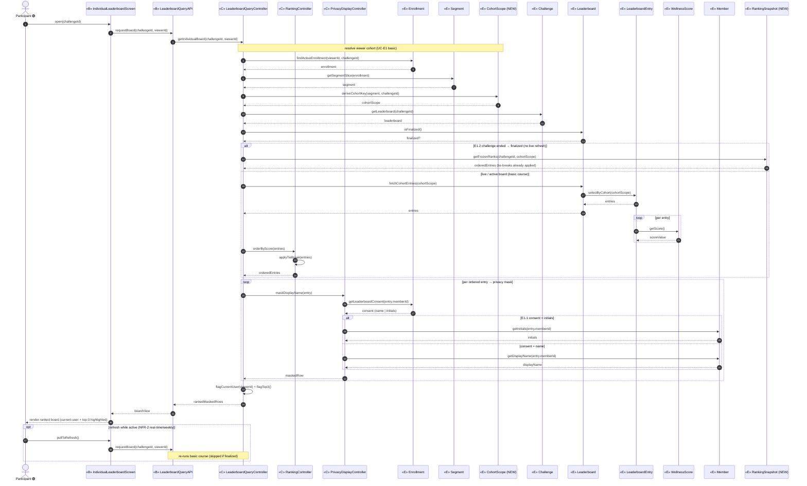
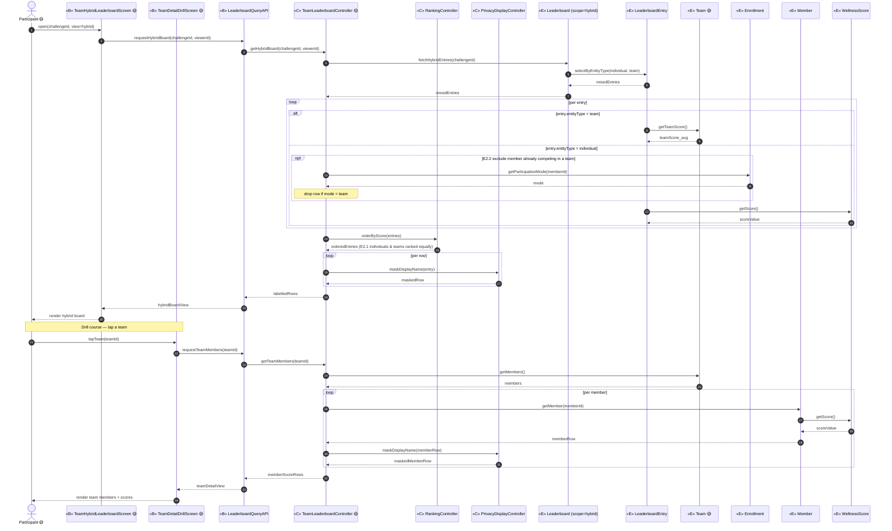
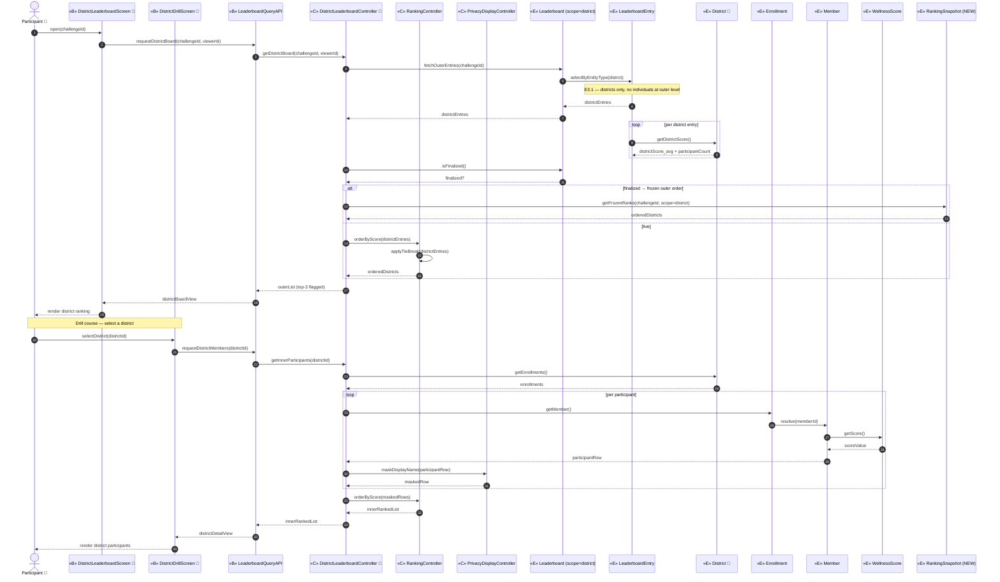
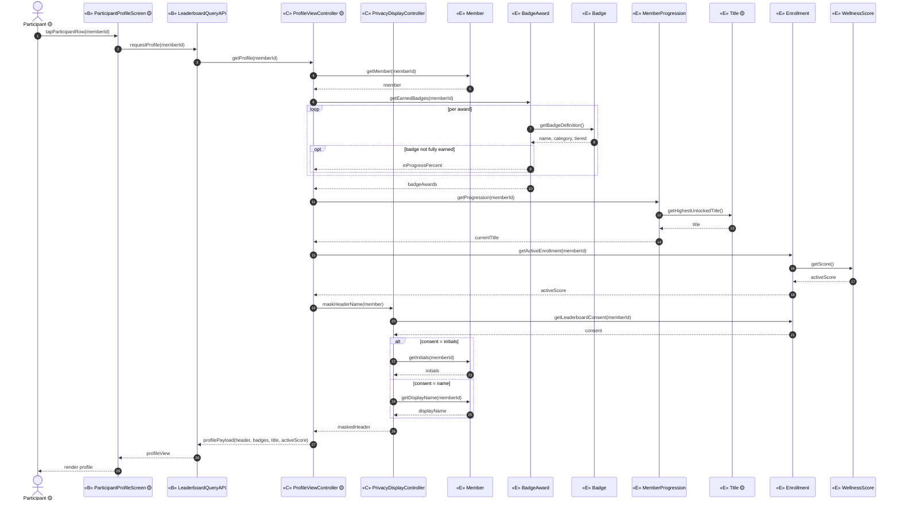

# ICONIX Step 3 — Sequence Diagrams: **E. Leaderboard** (`leaderboard`)

**Process**: ICONIX (Rosenberg), use-case-driven, milestone-driven.
**Package**: E. Leaderboard (id `leaderboard`).
**Inputs reconciled**: `03-robustness/leaderboard.md` (robustness diagrams UC-E1…E4) ⇄ `02-domain-model.md` (entity classes & their attributes/associations).
**Phase scope**: 🟢 **P1 = UC-E1 only** (individual-based). 🟡 UC-E2, UC-E4 = P2. 🔵 UC-E3 = P3. P2/P3 sequences are drawn for forward-traceability and tagged; they are **not** in the P1 build set.

> **ICONIX sequence-diagram rules enforced**
> 1. The robustness **controls become the messages** (verbs/methods); each control allocates work to the entity that **owns the data**.
> 2. Behaviour (operations) is **allocated to entities** — a sequence diagram is where the domain classes acquire methods.
> 3. Actors talk only to boundary; boundary delegates to controllers; controllers orchestrate entities; entities expose finder/read/compute methods.
> 4. **Basic Course** is the main top-to-bottom flow; **Alternate / rule courses** are `alt` / `opt` fragments.
> 5. Every message is traced back to its use-case step (backward traceability note under each diagram).
>
> **Participant stereotypes**: `«B»` boundary · `«C»` control · `«E»` entity. Method names are concrete and become the candidate operations on the owning class (fed forward into the class diagram method compartments).

---

## UC-E1 View Individual Leaderboard 🟢 P1 — realizes P1-8, §Individual Leaderboard, NFR-2

**Basic course**: Participant opens the leaderboard screen → `LeaderboardQueryController` resolves the viewer's cohort from their `Enrollment`/`Segment` slice → fetches that `Challenge`'s `Leaderboard` entries limited to the cohort → `RankingController` orders by `WellnessScore` → `PrivacyDisplayController` masks each row per consent → flags current-user row + top-3 → returns ranked, masked rows to the screen.
**Alternate / rule courses**: **E1.1** consent = `initials` → render initials instead of full name. **E1.2** challenge end → board is finalized → serve the immutable `RankingSnapshot` with tie-breaks applied, **no** live refresh.

**Backward traceability (UC-E1)**

| Message | Owning class (acquires method) | Use-case step realized |
|---|---|---|
| `requestBoard` / `getIndividualBoard` | API / LeaderboardQueryController | UC-E1 basic — open board |
| `findActiveEnrollment`, `getSegmentSlice`, `deriveCohortKey` | Enrollment, Segment, **CohortScope** | UC-E1 basic — resolve cohort (NFR-2 cohort-limited) |
| `getLeaderboard`, `fetchCohortEntries`, `selectByCohort` | Challenge, Leaderboard, LeaderboardEntry | UC-E1 basic — fetch cohort entries |
| `getScore` | WellnessScore | UC-E1 basic — entry reflects score |
| `orderByScore`, `applyTieBreak` | RankingController | UC-E1 basic / E1.2 — ranking |
| `isFinalized`, `getFrozenRanks` | Leaderboard, **RankingSnapshot** | **E1.2** finalized read, no live refresh |
| `maskDisplayName`, `getLeaderboardConsent`, `getInitials`/`getDisplayName` | PrivacyDisplayController, Enrollment, Member | **E1.1** consent masking (name vs initials) |
| `flagCurrentUser`, `flagTop3` | LeaderboardQueryController | UC-E1 basic — highlight rows |
| `pullToRefresh` | IndividualLeaderboardScreen | NFR-2 real-time/weekly refresh |

---

## UC-E2 View Team / Hybrid Leaderboard 🟡 P2 — realizes P2-9, §Team-Based & Hybrid Leaderboard

**Basic course**: Participant opens the team/hybrid board → `TeamLeaderboardController` builds rows where each `LeaderboardEntry` is an individual **or** a team (E2.1 ranked equally by their respective `WellnessScore`) → enforces E2.2 (a member competing in a team must **not** also appear as an individual) → reuses `RankingController` + `PrivacyDisplayController` → returns labelled rows. On tap-team, drills to `Team` members each with their `WellnessScore`.
**Alternate / rule courses**: **E2.2** exclude member-as-individual when already in a team. **Drill** (separate trigger) → team detail.

**Backward traceability (UC-E2)**

| Message | Owning class | Use-case step |
|---|---|---|
| `requestHybridBoard` / `getHybridBoard` | API / TeamLeaderboardController | UC-E2 basic — open hybrid board |
| `fetchHybridEntries`, `selectByEntityType` | Leaderboard, LeaderboardEntry | UC-E2 basic — mixed individual/team rows |
| `getTeamScore`, `getScore` | Team, WellnessScore | **E2.1** rank individuals & teams equally |
| `getParticipationMode` (+ drop row) | Enrollment / TeamLeaderboardController | **E2.2** member-in-team not shown as individual |
| `orderByScore`, `maskDisplayName` | RankingController, PrivacyDisplayController | reused from UC-E1 |
| `tapTeam` / `requestTeamMembers` / `getMembers` | TeamDetailDrillScreen, Team | UC-E2 drill — team detail |

---

## UC-E3 View District Leaderboard 🔵 P3 — realizes P3-2, §District-Based Leaderboard

**Basic course**: Participant opens the district board → `DistrictLeaderboardController` builds the **outer** ranked list of `District` entries (rank, name, district avg `WellnessScore`, participantCount, top-3) → E3.1 individuals are **never** shown at the outer level → on selecting a district, drills to the **inner** ranked participant list (each participant's `WellnessScore`, privacy-masked). Outer cohort is district-wide (`CohortScope`); finalized ordering via `RankingSnapshot`.
**Alternate / rule courses**: **E3.1** outer level = districts only. **Finalized** outer order served from `RankingSnapshot`. **Drill** → inner participant list.

**Backward traceability (UC-E3)**

| Message | Owning class | Use-case step |
|---|---|---|
| `requestDistrictBoard` / `getDistrictBoard` | API / DistrictLeaderboardController | UC-E3 basic — open district board |
| `fetchOuterEntries`, `selectByEntityType(district)` | Leaderboard, LeaderboardEntry | **E3.1** outer = districts only |
| `getDistrictScore` | District | UC-E3 basic — district avg + participantCount |
| `isFinalized`, `getFrozenRanks` | Leaderboard, **RankingSnapshot** | finalized outer ordering |
| `orderByScore`, `applyTieBreak` | RankingController | UC-E3 basic — rank districts |
| `selectDistrict` / `requestDistrictMembers` / `getEnrollments` / `getMember` | DistrictDrillScreen, District, Enrollment | UC-E3 drill — inner participant list |
| `getScore`, `maskDisplayName` | WellnessScore, PrivacyDisplayController | UC-E3 drill — masked inner rows |

---

## UC-E4 View Participant Profile (badges & title) 🟡 P2 — realizes P2-11

**Basic course**: Participant taps another participant's row on a leaderboard → `ProfileViewController` loads that `Member`'s earned `BadgeAward`s (each instance-of a `Badge`), their current `Title` (via `MemberProgression`, highest unlocked), and their current active-challenge `WellnessScore` (via that member's active `Enrollment`) → returns the profile payload. Privacy masking reused (initials-only consent still hides the full name on the profile header).
**Alternate / rule courses**: **header consent = initials** → mask the profile header name. **opt** badge in-progress percent shown when not yet fully earned.

**Backward traceability (UC-E4)**

| Message | Owning class | Use-case step |
|---|---|---|
| `tapParticipantRow` / `requestProfile` / `getProfile` | ParticipantProfileScreen, API, ProfileViewController | UC-E4 basic — open profile |
| `getEarnedBadges`, `getBadgeDefinition`, `inProgressPercent` | BadgeAward, Badge | UC-E4 basic — badges (opt in-progress) |
| `getProgression`, `getHighestUnlockedTitle` | MemberProgression, Title | UC-E4 basic — current title (P2) |
| `getActiveEnrollment`, `getScore` | Enrollment, WellnessScore | UC-E4 basic — active-challenge score |
| `maskHeaderName`, `getLeaderboardConsent`, `getInitials`/`getDisplayName` | PrivacyDisplayController, Enrollment, Member | header consent masking (reused) |

---

## Operation allocation summary (forward-feed into class diagram)

Operations discovered here are allocated to the entity that **owns the data** (ICONIX: sequence diagrams give domain classes their methods). Candidate methods to back-propagate into `02-domain-model.md` method compartments:

| Entity | Operations allocated (from this step) | Phase |
|---|---|---|
| **Enrollment** | `findActiveEnrollment()`, `getSegmentSlice()`, `getLeaderboardConsent()`, `getParticipationMode()`, `getActiveEnrollment()`, `getMember()` | 🟢 P1 (team/district reads 🟡🔵) |
| **Segment** | `getSegmentSlice()` result source | 🟢 P1 |
| **CohortScope (NEW)** | `deriveCohortKey()` | 🟢 P1 |
| **Challenge** | `getLeaderboard()` | 🟢 P1 |
| **Leaderboard** | `isFinalized()`, `fetchCohortEntries()`, `fetchHybridEntries()` 🟡, `fetchOuterEntries()` 🔵 | 🟢 P1 (+P2/P3) |
| **LeaderboardEntry** | `selectByCohort()`, `selectByEntityType()`, `getScore()` (delegates) | 🟢 P1 (+P2/P3) |
| **WellnessScore** | `getScore()` | 🟢 P1 |
| **Member** | `getDisplayName()`, `getInitials()`, `getMember()`/`resolve()` | 🟢 P1 |
| **RankingSnapshot (NEW)** | `getFrozenRanks()` | 🟢 P1 (also P3 outer) |
| **Team 🟡** | `getTeamScore()`, `getMembers()` | 🟡 P2 |
| **District 🔵** | `getDistrictScore()`, `getEnrollments()` | 🔵 P3 |
| **BadgeAward 🟡** | `getEarnedBadges()`, `inProgressPercent` | 🟡 P2 |
| **Badge 🟡** | `getBadgeDefinition()` | 🟡 P2 |
| **MemberProgression 🟡** | `getProgression()` | P1 counters / 🟡 P2 title surface |
| **Title 🟡** | `getHighestUnlockedTitle()` | 🟡 P2 |

> **Controllers** (`LeaderboardQueryController`, `RankingController`, `PrivacyDisplayController`, `TeamLeaderboardController` 🟡, `DistrictLeaderboardController` 🔵, `ProfileViewController` 🟡) hold the **orchestration verbs** (`orderByScore`, `applyTieBreak`, `maskDisplayName`, `flagCurrentUser`, `flagTop3`) — these are controller-to-be operations, not domain-entity data methods.

## Sanity check (golden thread)
- **Forward**: every UC-E1…E4 robustness control surfaced as a message; every robustness entity received at least one allocated operation. ✅
- **Backward**: every message maps to a use-case step / alternate course in the per-diagram trace tables. ✅
- **Phase guard**: only **UC-E1** is in the P1 build set; UC-E2/E4 (🟡 P2) and UC-E3 (🔵 P3) are drawn for forward-traceability and tagged. ✅
- **NEW classes** `CohortScope` and `RankingSnapshot` carry methods (`deriveCohortKey`, `getFrozenRanks`) and remain flagged for back-propagation into `02-domain-model.md` (still absent there). ⚠️
