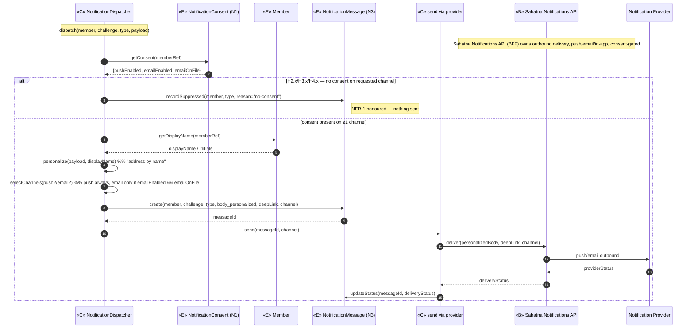
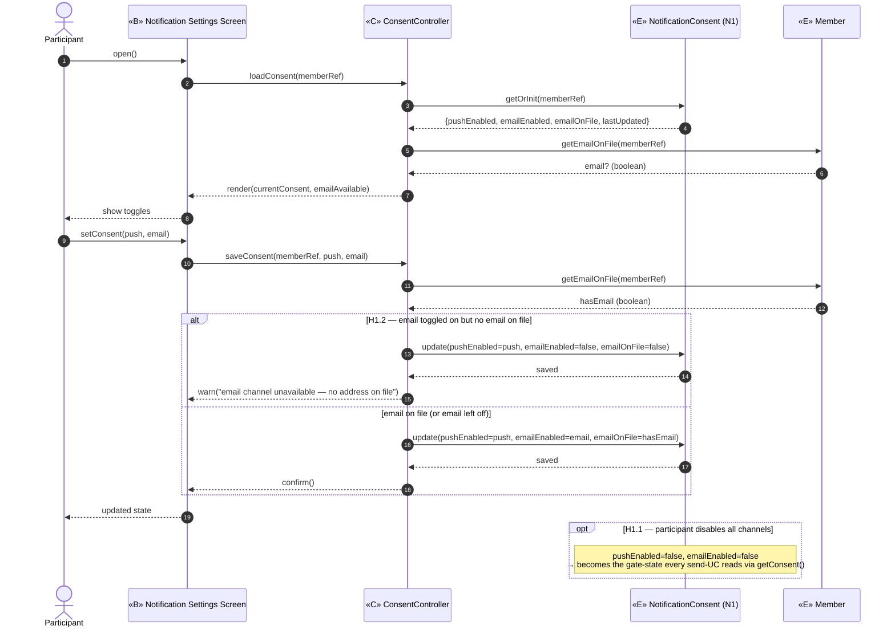
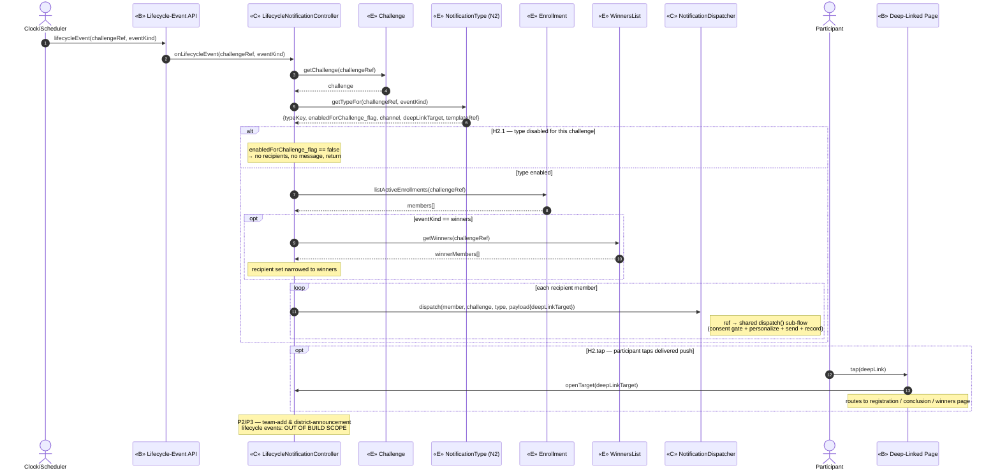
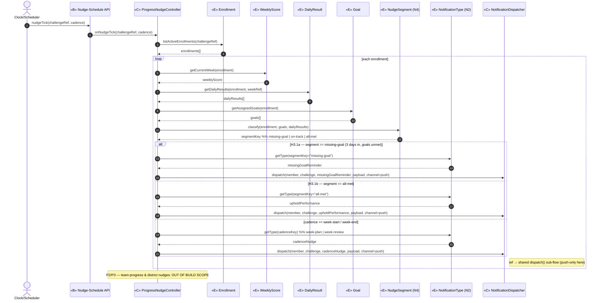
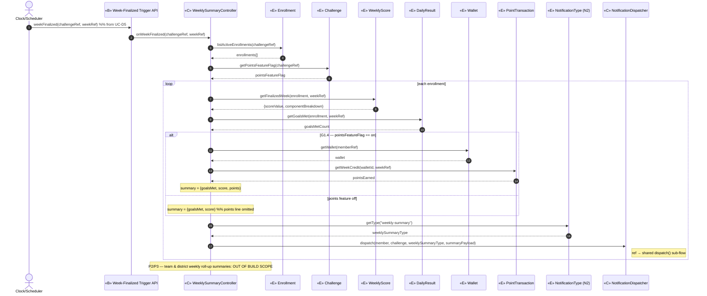
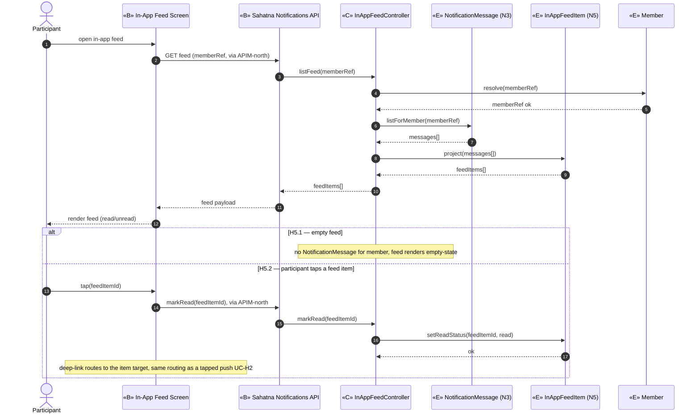

# ICONIX Step 3 — Sequence Diagrams: Package H — Notification & Nudges (`notification`)

**Process**: ICONIX (Rosenberg) — use-case-driven, milestone-driven. This is the **Step-3**
deliverable for the cross-cutting (`⚪ XC`) Notification package, realizing the **robustness diagrams**
in `03-robustness/notification.md` against the **domain model** in `02-domain-model.md`.

**How to read these**: each robustness **control** node (`«C»` verb) becomes one or more **messages**.
Per Rosenberg's allocation rule, each operation is allocated to the **entity that owns the data** it
reads/writes — so `read consent` lives on `NotificationConsent`, `assemble summary` reads `WeeklyScore`,
etc. Controllers orchestrate; entities answer. The **Basic Course** is the main top-to-bottom flow;
**Alternate Courses** are `alt` / `opt` fragments.

**Phase scope**: All four UCs are `🟢 P1` (cross-cutting). Phase-2/3 fan-out (team-add notifications,
district announcements, title-unlock nudges) is **out of build scope** and tagged inline where it touches
a message.

**New entities consumed** (back-ported from Step-2 robustness — must exist in `02-domain-model.md`):
`NotificationConsent` (N1), `NotificationType` (N2), `NotificationMessage` (N3), `NudgeSegment` (N4).

**Shared convergence point**: `NotificationDispatcher` is modelled **once** below and reused (by
reference) in H2/H3/H4 — the single place the consent gate (NFR-1) and the by-name rule are enforced.

---

## Shared sub-flow — `NotificationDispatcher.dispatch(...)` (the consent + by-name gate)

Funnelled through by **UC-H2, UC-H3, UC-H4**. Modelled once; each send-UC below `ref`s it.

**Backward traceability (this sub-flow):**
- `getConsent` ⇐ robustness `C_DISP — gate consent`, UC-H1's persisted `NotificationConsent` (N1).
- `personalize` ⇐ `C_DISP — personalize` ("address by name", NFR-1 / §Communication Enablement).
- `recordSuppressed` / `create` / `updateStatus` ⇐ `E_MSG NotificationMessage` (N3) audit-trail requirement.
- `send` → `deliver` ⇐ `C_SEND` → `«B» Sahatna Notifications API` (BFF, owns outbound delivery, E4) →
  **Notification Provider** actor. The `«B» Notification Provider Gateway` robustness node is realized
  by the `Sahatna Notifications API` outbound surface.

---

## UC-H1 — Manage Notification Consent 🟢 P1
*Realizes P1-11, NFR-1, §Communication Enablement · Actor: **Participant***
*Robustness source: `03-robustness/notification.md` UC-H1.*

**Basic Course**: Participant opens settings → controller loads current consent → Participant toggles
push/email → controller validates email-on-file → consent persisted.

**Backward traceability (UC-H1):**
- `loadConsent` / `getOrInit` ⇐ `C_LOAD` + `E_CONSENT` (N1).
- `getEmailOnFile` ⇐ `C_LOAD`/`C_VALID` reading `E_Member`.
- `saveConsent` / `update` ⇐ `C_SAVE` + `E_CONSENT` (N1).
- `validate email-on-file` ⇐ `C_VALID`; H1.2 sets `emailOnFile=false` (alt-course object).
- H1.1 all-off ⇐ robustness note "gate-state every other UC reads".

---

## UC-H2 — Send Challenge-Lifecycle Notification 🟢 P1
*Realizes P1-11, P1-12, §Nudges, §Challenge Conclusion · Triggered by UC-A7 / UC-I1 / UC-I3 via Clock.*
*Robustness source: `03-robustness/notification.md` UC-H2.*

**Basic Course**: Clock fires a lifecycle event (initiation / mid / end / winners) → controller maps
event → enabled `NotificationType` → resolves recipient set from `Enrollment` (+ `WinnersList` for the
winners event) → for each recipient funnels through the shared `NotificationDispatcher`.

**Backward traceability (UC-H2):**
- `onLifecycleEvent` ⇐ `C_LIFE map lifecycle event → enabled type`, from `B_EVT` ← Clock.
- `getChallenge` / `getTypeFor` ⇐ `C_LIFE` reading `E_CHAL` + `E_TYPE` (N2).
- `listActiveEnrollments` ⇐ `C_RECIP resolve recipient set` reading `E_ENR` (+ `E_MEMBER`).
- `getWinners` ⇐ `C_RECIP` reading `E_WIN WinnersList` (winners event only).
- `dispatch(...)` ⇐ `C_DISP` + `C_SEND` → shared sub-flow (writes `E_MSG` N3, reads `E_CONSENT` N1).
- H2.1 disabled-type alt ⇐ robustness alt-course `C_LIFE` reads `enabledForChallenge_flag`.
- tap → `openTarget` ⇐ `B_PAGE` re-entering via `C_LIFE`'s deep-link target.

---

## UC-H3 — Send Progress Nudge 🟢 P1
*Realizes P1-11, §Nudges (Challenge progress) · Clock weekly cadence + 3-days-in reminder · push-only.*
*Robustness source: `03-robustness/notification.md` UC-H3.*

**Basic Course**: Clock fires the nudge schedule → controller evaluates each participant's goal status
from `WeeklyScore`/`DailyResult`/`Goal` → resolves the `NudgeSegment` (missing-goal vs all-met) →
picks the matching `NotificationType` → dispatches (push channel) via the shared dispatcher.

**Backward traceability (UC-H3):**
- `onNudgeTick` ⇐ `C_EVAL evaluate goal status`, from `B_SCHED` ← Clock.
- `getCurrentWeek` / `getDailyResults` / `getAssignedGoals` ⇐ `C_EVAL` reading `E_WS`, `E_DR`, `E_GOAL`.
- `classify` ⇐ `C_SEG resolve NudgeSegment` writing/deriving `E_SEG NudgeSegment` (N4).
- `getType(segmentKey/cadenceKey)` ⇐ `C_PICK pick nudge` reading `E_TYPE` (N2).
- `dispatch(...)` ⇐ `C_DISP` + `C_SEND` → shared sub-flow (push channel).
- H3.1 missing-goal vs uphold alt ⇐ robustness alt-course `C_EVAL → C_SEG → C_PICK`.

---

## UC-H4 — Send Weekly Summary 🟢 P1
*Realizes P1-6, §Nudges · Trigger: **UC-D5 Finalize Weekly Score** (← Clock at week-close).*
*Robustness source: `03-robustness/notification.md` UC-H4.*

**Basic Course**: UC-D5 finalizes the week and fires the trigger → controller assembles each member's
summary (goals met, score, and — if the points feature is on — points earned) from `WeeklyScore` /
`DailyResult` / `Wallet` / `PointTransaction` → dispatches the weekly-summary message.

**Backward traceability (UC-H4):**
- `onWeekFinalized` ⇐ `C_ASSEM assemble summary`, from `B_FIN` ← UC-D5 / Clock.
- `getFinalizedWeek` / `getGoalsMet` ⇐ `C_ASSEM` reading `E_WS WeeklyScore` + `E_DR DailyResult`.
- `getWallet` / `getWeekCredit` ⇐ `C_ASSEM` reading `E_WALLET` + `E_TXN` (points line).
- `getType("weekly-summary")` ⇐ `C_ASSEM` reading `E_TYPE` (N2).
- `dispatch(...)` ⇐ `C_DISP` + `C_SEND` → shared sub-flow.
- G1.4 points-flag alt ⇐ robustness alt-course `C_ASSEM` gates `Wallet`/`PointTransaction` reads on
  `Challenge.pointsFeatureFlag`.

---

## UC-H5 — Read In-App Notification Feed 🟢 P1  *(added in architecture enhancements — E4)*
*Realizes P1-11, §Communication Enablement (in-app feed) · Actor: **Participant***
*Robustness source: `03-robustness/notification.md` UC-H5.*

**Basic Course**: Participant opens the in-app feed → the `Sahatna Notifications API` (read-side, via
APIM-north) lists the member's notifications from the `NotificationMessage` log as `InAppFeedItem`
projections → Participant taps an item to mark it read and deep-link into the relevant page.

**Backward traceability (UC-H5):**
- `listFeed` / `listForMember` ⇐ `C_LIST list in-app feed` reading `E_MSG NotificationMessage` (N3).
- `project` ⇐ `C_LIST` deriving `E_FEED InAppFeedItem` (N5) read-model projection.
- `markRead` / `setReadStatus` ⇐ `C_READ mark item read` writing `E_FEED InAppFeedItem` (N5).
- `Sahatna Notifications API` boundary ⇐ E4 notifications-API read surface, `Mobile → APIM-north →
  Sahatna Notifications API`.

---

## Step-3 traceability & invariant check (per Rosenberg)

| Check | Status |
|------|--------|
| Every robustness `«C»` verb maps to ≥1 sequence message | ✅ load/save/validate (H1), map/resolve/dispatch/send (H2), evaluate/resolve-segment/pick/dispatch (H3), assemble/dispatch (H4) |
| Every operation allocated to the **entity that owns the data** | ✅ consent→NotificationConsent, name→Member, summary reads→WeeklyScore/DailyResult/Wallet/PointTransaction, type→NotificationType, audit→NotificationMessage |
| No sequence message references an orphan class | ✅ N1–N4 declared as participants; all reused entities exist in `02-domain-model.md` |
| Shared consent gate modelled once, reused | ✅ `NotificationDispatcher.dispatch(...)` sub-flow `ref`d by H2/H3/H4 |
| Basic course = main flow; alternates as alt/opt | ✅ H1.1/H1.2, H2.1/tap, H3.1, G1.4 all rendered as `alt`/`opt` fragments |
| Phase-2/3 fan-out tagged out of scope | ✅ team/district notes on H2/H3/H4 |
| Actors touch only boundary | ✅ Participant→Screen/Page/Feed, Clock→Event/Schedule/Trigger API, Provider→Sahatna Notifications API |
| E4 — Sahatna Notifications API owns outbound + exposes in-app feed read | ✅ dispatch sub-flow delivers via Sahatna Notifications API → Notification Provider, UC-H5 reads feed via Sahatna Notifications API (APIM-north) |

**Backward-traceability gap reminder (from Step-2):** entities **N1–N4** must be present in
`02-domain-model.md` for these sequence messages to be non-orphan. If not yet back-ported, add
`NotificationConsent`, `NotificationType`, `NotificationMessage`, `NudgeSegment` (all `[P1]`) before
sign-off.
