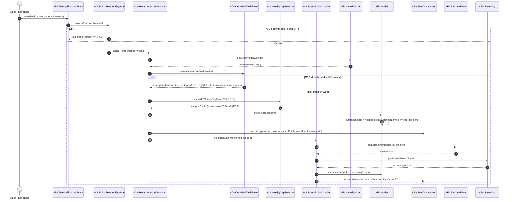
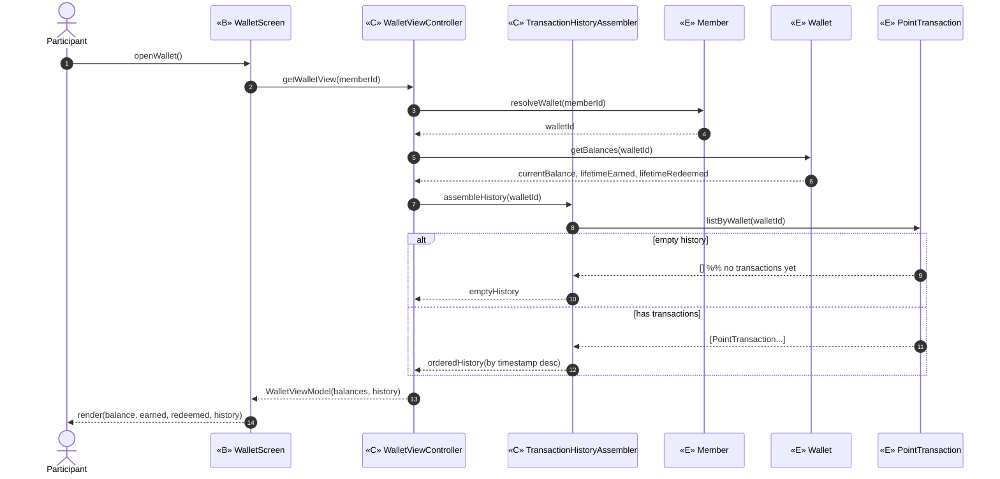
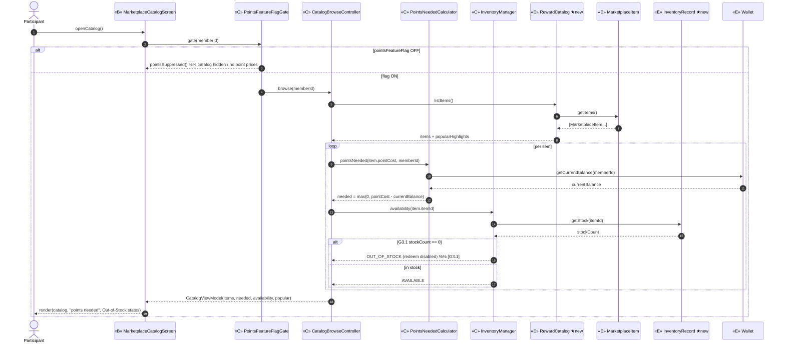
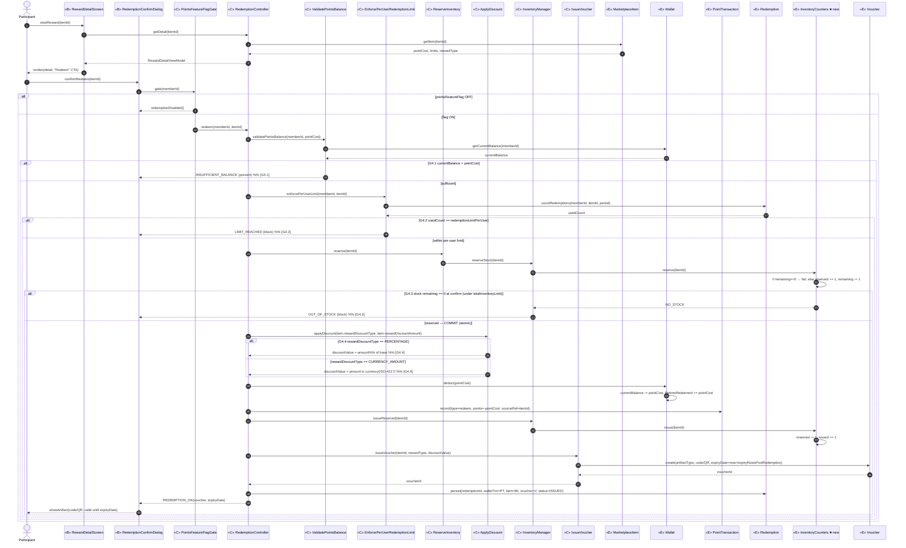
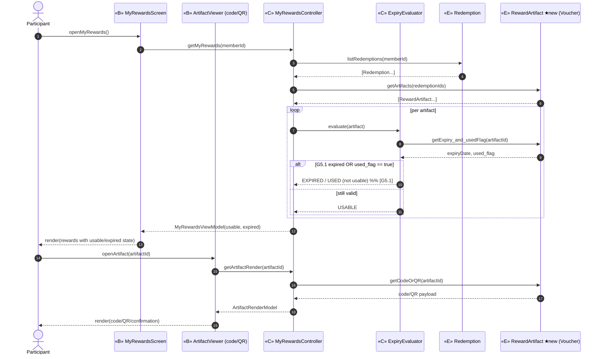
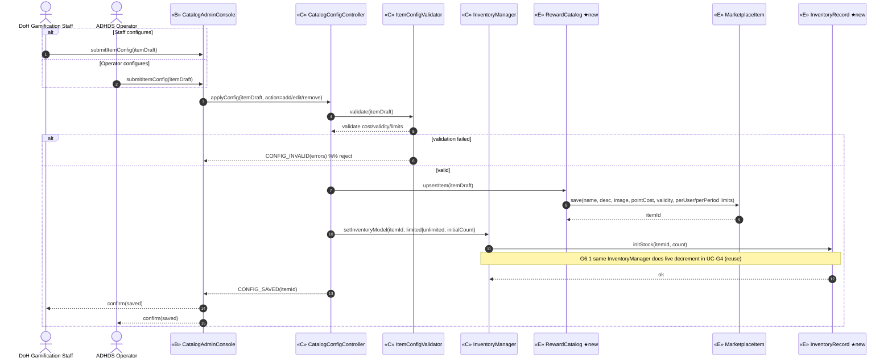
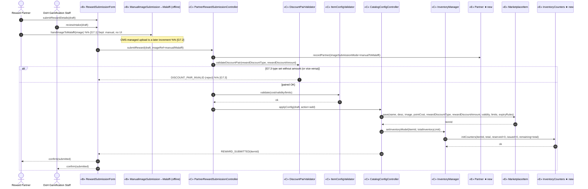

# ICONIX Step 3 — Sequence Diagrams

## Package G — Redeem / Marketplace (`redeem-marketplace`)  🟢 P1 (feature-flagged)

**Process**: ICONIX (Rosenberg) — Sequence diagrams (the third leg: use case → robustness → **sequence**). The robustness diagram's **controllers became the messages/methods**; each operation is **allocated to the entity that owns the data** it touches. Boundary objects appear as participants; the actor talks only to boundaries; controllers appear as orchestrating participants and the operation arrows they send.

**Source robustness**: `03-robustness/redeem-marketplace.md` (UC-G1…UC-G6).
**Source domain model**: `02-domain-model.md` — entities Member, Wallet, PointTransaction, MarketplaceItem, Redemption, Voucher, WeeklyScore, SahatnaEvent, Screening + ★new analysis entities RewardCatalog, RewardArtifact, InventoryRecord (back-propagation pending).

**Scope**: All six use cases are Phase-1 (`🟢 P1`), gated behind the **points feature flag** (BRD: points suppressed for the Sept-2026 launch). No Team/District/Title/baseline-goal concepts appear — so **no P2/P3 fragments** in this package.

**Allocation principle (operation → owning entity)**: e.g. `currentBalance`/`lifetimeEarned`/`lifetimeRedeemed` live on **Wallet** → balance/credit/debit operations are messages **to Wallet**; live stock count lives on **InventoryRecord** → read/decrement messages go **to InventoryRecord** (via `InventoryManager`); expiry lives on **RewardArtifact/Voucher** → expiry checks read it there.

> **Traceability convention**: every message is suffixed/noted with its originating **use-case step id** (e.g. `[G4.1]`), giving backward traceability sequence → robustness alt-course → use case. A per-diagram backward-trace table closes the loop.

---

## UC-G1 — Accrue Reward Points 🟢 P1 (feature-flagged)

*Trigger actor*: **Clock / Scheduler** (time-actor; fires on week finalization ← UC-D5). Boundary is the event `WeeklyFinalizedEvent`.
*Basic Course*: on week finalization, gate the flag → compute `points = weeklyScore × 10` → once-per-week idempotency → weekly cap → credit Wallet + write earn PointTransaction → credit bonus (winner/event/screening) points.
*Alternate Courses*: G1.4 flag OFF (suppress accrual); G1.1 already credited this week (stop); G1.2 retroactive score change (idempotent — no re-credit); G1.3 cap exceeded (clamp).

**Backward traceability (UC-G1)**

| Message | Robustness object | Use-case step |
|---|---|---|
| `onWeekFinalized` / `suppressAccrual` | PointsFeatureFlagGate | G1.4 |
| `getScoreValue` | WeeklyScore (entity owns scoreValue) | G1 basic |
| `assertNotYetCredited` / `alreadyCredited` | OncePerWeekGuard | G1.1, G1.2 (idempotent) |
| `clampToWeeklyCap` | WeeklyCapEnforcer | G1.3 |
| `credit` / `currentBalance +=` | Wallet (owns balance) | G1 basic |
| `record(type=earn…)` | PointTransaction (owns ledger row) | G1 basic / audit |
| `creditBonus` + Sahatna/Scr reads | BonusPointsCrediter → SahatnaEvent, Screening | G1 bonus (winner/event/screening) |

---

## UC-G2 — View Reward Points Wallet 🟢 P1

*Actor*: **Participant**. *Basic Course*: open WalletScreen → resolve wallet ownership via Member → read balance + lifetime earned/redeemed from Wallet → assemble transaction history from PointTransaction → render.
*Alternate Course*: empty history (no transactions yet → show empty-state).

**Backward traceability (UC-G2)**

| Message | Robustness object | Use-case step |
|---|---|---|
| `getWalletView` | WalletViewController | G2 basic |
| `resolveWallet` | Member (owns membership→wallet link) | G2 ownership |
| `getBalances` | Wallet (owns balances) | G2 basic |
| `assembleHistory` / `listByWallet` | TransactionHistoryAssembler → PointTransaction | G2 history |

---

## UC-G3 — Browse Marketplace Catalog 🟢 P1 (feature-flagged)

*Actor*: **Participant**. *Basic Course*: open catalog → flag gate → list items from RewardCatalog → compute "points needed" per locked item against Wallet balance → resolve live availability per item from InventoryRecord → flag popular → render.
*Alternate Courses*: G3.1 stock = 0 → "Out of Stock", redeem disabled; flag OFF → catalog hidden/points suppressed.

**Backward traceability (UC-G3)**

| Message | Robustness object | Use-case step |
|---|---|---|
| `gate` / `pointsSuppressed` | PointsFeatureFlagGate | G3 flag gate |
| `listItems` / `getItems` / `popularHighlights` | CatalogBrowseController → RewardCatalog → MarketplaceItem | G3 basic |
| `pointsNeeded` / `getCurrentBalance` | PointsNeededCalculator → Wallet | G3 affordability |
| `availability` / `getStock` / `OUT_OF_STOCK` | InventoryManager → InventoryRecord | G3.1 |

---

## UC-G4 — Redeem Reward 🟢 P1 (feature-flagged) — transactional heart

*Actor*: **Participant**. *Basic Course*: open reward detail → confirm → flag gate → validate points balance → enforce per-user redemption limit → **reserve** stock against the total-inventory limit → apply discount (branch by type) → **atomically** deduct points (Wallet + redeem PointTransaction), **issue** the reserved stock (InventoryCounters reserved→issued), issue Voucher with post-redemption expiry, persist Redemption linking them → return voucher.
*Alternate Courses*: G4.1 insufficient balance → prevent; G4.2 per-user redemption limit reached → block; G4.3 out of stock at confirm (remaining=0 under totalInventoryLimit) → block; G4.4 discount-type branch PERCENTAGE vs CURRENCY_AMOUNT; flag OFF → redemption disabled.

**Backward traceability (UC-G4)**

| Message | Robustness object | Use-case step |
|---|---|---|
| `gate` / `redemptionDisabled` | PointsFeatureFlagGate | G4 flag gate |
| `getDetail` / `getItem` | RedemptionController → MarketplaceItem | G4 basic |
| `validatePointsBalance` / `getCurrentBalance` / `INSUFFICIENT_BALANCE` | ValidatePointsBalance → Wallet | G4.1 |
| `enforcePerUserLimit` / `countRedemptions` / `LIMIT_REACHED` | EnforcePerUserRedemptionLimit → Redemption | G4.2 |
| `reserveStock` / `reserve` / `OUT_OF_STOCK` | ReserveInventory → InventoryManager → InventoryCounters (under totalInventoryLimit) | G4.3 |
| `applyDiscount(type, amount)` (PERCENTAGE vs CURRENCY_AMOUNT branch) | ApplyDiscount → MarketplaceItem.rewardDiscountType/Amount | G4.4 |
| `deduct` / `currentBalance -=` | Wallet (owns balance) | G4 commit |
| `record(type=redeem…)` | PointTransaction (owns ledger row) | G4 commit / audit |
| `issueReserved` / `issue` (reserved→issued) | InventoryManager → InventoryCounters | G4 commit |
| `issueVoucher` / `create(expiryDate=now+expiryRulesPostRedemption)` | IssueVoucher → Voucher (post-redemption expiry) | G4 commit |
| `persist(...)` | Redemption (links wallet txn, item, voucher) | G4 commit |

---

## UC-G5 — View "My Rewards" / Reward Artifact 🟢 P1

*Actor*: **Participant**. *Basic Course*: open My Rewards → list redemptions → load artifacts → evaluate usable-vs-expired per artifact → render list; on tap, open ArtifactViewer to render code/QR.
*Alternate Course*: G5.1 artifact expired or `used_flag` set → marked not usable.

**Backward traceability (UC-G5)**

| Message | Robustness object | Use-case step |
|---|---|---|
| `getMyRewards` / `listRedemptions` | MyRewardsController → Redemption | G5 basic |
| `getArtifacts` / `getCodeOrQR` | RewardArtifact/Voucher (owns code/QR) | G5 basic / viewer |
| `evaluate` / `getExpiry_and_usedFlag` / `EXPIRED/USED` | ExpiryEvaluator → RewardArtifact | G5.1 |

---

## UC-G6 — Configure Reward Catalog & Inventory 🟢 P1

*Actors*: **DoH Gamification Staff**, **ADHDS Operator** (same admin boundary). *Basic Course*: open admin console → submit item config (add/edit/remove) → validate cost/validity/limits → upsert MarketplaceItem under RewardCatalog → set inventory model (limited/unlimited) via InventoryRecord → confirm. All config-driven ("without development").
*Alternate Course*: validation failure (invalid cost/validity/limits) → reject, return errors.

**Backward traceability (UC-G6)**

| Message | Robustness object | Use-case step |
|---|---|---|
| `applyConfig` | CatalogConfigController | G6 basic |
| `validate` / `CONFIG_INVALID` | ItemConfigValidator | G6 validation |
| `upsertItem` / `save` | RewardCatalog → MarketplaceItem | G6 add/edit/remove |
| `setInventoryModel` / `initStock` | InventoryManager → InventoryRecord | G6.1 limited/unlimited + reuse in G4 |

---

## UC-G7 — Submit Reward 🟢 P1 *(added in marketplace supplement)*

*Actors*: **Reward Partner**, **DoH Gamification Staff** (intake). *Basic Course*: partner submits reward details (incl. **rewardDiscountType + rewardDiscountAmount** as two fields) and the **reward image** — for the **September Challenge** the image goes **manually to the Malaffi team** (offline, no upload UI) → record Partner (imageSubmissionMode=manualToMalaffi) → validate discount pair + config → hand off to catalog config (→ UC-G6) to upsert MarketplaceItem + init InventoryCounters.
*Alternate Courses*: G7.1 manual image path (Sept); G7.2 CMS upload (later increment, deferred); G7.3 discount type/amount not paired → reject.

**Backward traceability (UC-G7)**

| Message | Robustness object | Use-case step |
|---|---|---|
| `handImageToMalaffi` / Note CMS later | ManualImageSubmission→Malaffi boundary | G7.1, G7.2 |
| `submitReward` / `recordPartner` | PartnerRewardSubmissionController → Partner | G7 basic |
| `validateDiscountPair` / `DISCOUNT_PAIR_INVALID` | DiscountPairValidator → MarketplaceItem (rewardDiscountType/Amount) | G7.3 |
| `applyConfig` / `save` | CatalogConfigController → MarketplaceItem | G7 → G6 |
| `setInventoryModel` / `initCounters` | InventoryManager → InventoryCounters | G7 inventory |

---

## Cross-diagram traceability summary (sequence ⇄ robustness ⇄ use case)

| Use case | Boundary participants | Controllers→messages | Entities that own operations |
|---|---|---|---|
| UC-G1 | WeeklyFinalizedEvent | PointsFeatureFlagGate, RewardAccrualController, OncePerWeekGuard, WeeklyCapEnforcer, BonusPointsCrediter | WeeklyScore(getScoreValue), Wallet(credit), PointTransaction(record), SahatnaEvent/Screening(getEarnedPoints) |
| UC-G2 | WalletScreen | WalletViewController, TransactionHistoryAssembler | Member(resolveWallet), Wallet(getBalances), PointTransaction(listByWallet) |
| UC-G3 | MarketplaceCatalogScreen | PointsFeatureFlagGate, CatalogBrowseController, PointsNeededCalculator, InventoryManager | RewardCatalog/MarketplaceItem(listItems), Wallet(getCurrentBalance), InventoryRecord(getStock) |
| UC-G4 | RewardDetailScreen, RedemptionConfirmDialog | PointsFeatureFlagGate, RedemptionController, ValidatePointsBalance, EnforcePerUserRedemptionLimit, ReserveInventory, ApplyDiscount(type,amount), InventoryManager, IssueVoucher | MarketplaceItem(getItem/discount), Wallet(deduct), PointTransaction(record), Redemption(countRedemptions/persist), InventoryCounters(reserve/issue), Voucher(create+expiry) |
| UC-G5 | MyRewardsScreen, ArtifactViewer | MyRewardsController, ExpiryEvaluator | Redemption(listRedemptions), RewardArtifact(getExpiry/getCodeOrQR) |
| UC-G6 | CatalogAdminConsole | CatalogConfigController, ItemConfigValidator, InventoryManager | RewardCatalog/MarketplaceItem(upsert/save), InventoryRecord/InventoryCounters(initStock) |
| UC-G7 ★supp | RewardSubmissionForm, ManualImageSubmission→Malaffi (offline) | PartnerRewardSubmissionController, DiscountPairValidator, ItemConfigValidator, CatalogConfigController, InventoryManager | Partner(recordPartner), MarketplaceItem(save discount fields), InventoryCounters(initCounters) |

**Invariant check (sequence layer)**
- ✅ Each robustness **controller** appears either as a participant or as the message it owns; no behaviour leaked into entities — entity messages are data getters/mutators on their own attributes (Wallet balance, InventoryRecord stock, RewardArtifact expiry, PointTransaction ledger).
- ✅ Every robustness **alternate course** (G1.1–G1.4, G3.1, G4.1–G4.3, G5.1, G6 validation) appears as an `alt`/`opt` fragment.
- ✅ Actors message only boundaries; boundaries message only controllers; entities are reached only via controllers — ICONIX rules preserved into Step-3.
- ✅ Phase scope: all six use cases P1, feature-flag fragments retained on G1/G3/G4; no P2/P3 (Team/District/Title/baseline-goal) messages introduced.
