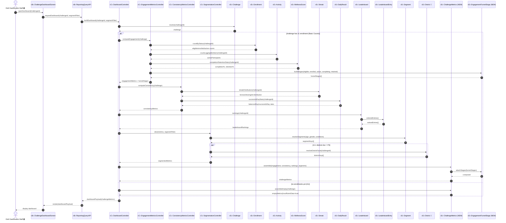
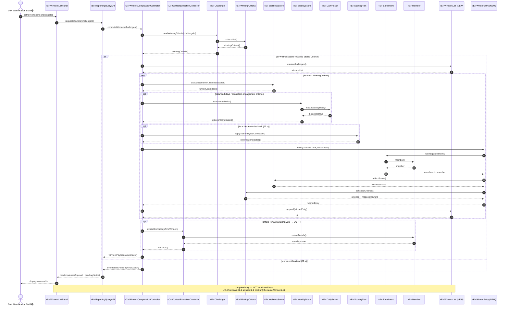

# ICONIX Step 3 — Sequence Diagrams: **J. Reporting & Analytics** (`reporting`)

**Process**: ICONIX (Rosenberg), use-case-driven, milestone-driven.
**Package**: J. Reporting & Analytics (id `reporting`).
**Inputs reconciled**: `03-robustness/reporting.md` (UC-J1, UC-J2 robustness objects) ⇄ `02-domain-model.md` (entity classes + multiplicities).
**Phase scope**: 🟢 **P1 = both UC-J1 and UC-J2** (individual-based). District-segmented community-impact metrics (J1.1) are 🔵 **P3** and shown as an `opt` fragment, tagged inline. Teams/Districts/baseline-personalized goals/Titles are not referenced by these reads.
**Milestone**: J sits in **M4** (badges + reporting). UC-J2 is the read that gates Settlement (`J2 -. include .-> I2`).

> **ICONIX Step-3 allocation rules enforced**
> 1. Participants are exactly the **boundary / control / entity** objects from the robustness diagram (no new objects invented).
> 2. Controllers become **messages/operations**, not data holders — every operation is allocated to the **entity that owns the data** it reads/writes (e.g. `readWinningCriteria()` lands on `Challenge`, `extractContact()` lands on `Member`).
> 3. Actor (DoH Gamification Staff) sends messages **only** to boundary objects; boundary and entity **never** message each other directly — always via a control.
> 4. **Basic Course** = the main top-to-bottom flow; **Alternate / Rule Courses** = `alt` / `opt` fragments.
> 5. Each message carries a backward-trace note to the use-case step it realizes.

**Legend**: «B» boundary · «C» control · «E» entity · **(NEW)** = class introduced in robustness Step 2, flagged for back-prop into `02-domain-model.md`.

---

## UC-J1 — View Challenge Dashboard 🟢 P1
*realizes P1-13, §Performance Metrics · robustness: `03-robustness/reporting.md` §UC-J1*

**Basic Course**: DoH Gamification Staff opens the dashboard for a `Challenge`. `DashboardController` resolves the challenge, then dispatches engagement, consistency and leaderboard reads; `EngagementMetricsController` builds the adoption/engagement funnel + participation/completion/retention; `ConsistencyMetricsController` builds streak-distribution; rankings come from the existing `Leaderboard`/`LeaderboardEntry`. `SegmentationController` slices every metric by demographic `Segment`. The results are assembled into a `ChallengeMetrics` snapshot (composed of ordered `EngagementFunnelStage` rows) and returned to the screen.

**Alternate / Rule Courses**:
- **J1.1 — district facet** 🔵 P3: `SegmentationController` adds the `District` slice **only when districts are live**; P1 slices age/gender/conditions only → modelled as an `opt` fragment.
- **A1 — no enrollments yet**: the challenge resolves but has zero `Enrollment` rows → controllers return empty/zeroed metrics; the screen renders an "insufficient data" dashboard → `alt` fragment.

**Backward traceability — message → use-case step (UC-J1)**

| Message | Owns the data | Realizes (UC-J1 step / robustness edge) |
|---|---|---|
| `openDashboard` / `requestDashboard` / `buildDashboard` | boundary → control | UC-J1 Basic "opens the dashboard screen for a Challenge" → `DOH→SCR→API→DC` |
| `CHAL.resolve(challengeId)` | Challenge | "DashboardController resolves the challenge" → `DC -->|resolve challenge| CHAL` |
| `ENR.countByStatus`, `ACT.countLoggingMembers`, `WS.completionRetentionStats` | Enrollment / Activity / WellnessScore | "participation/completion/retention from Enrollment, Activity and WellnessScore" → `EMC -->|enrollments/activity/completion| ...` |
| `FUN.buildStages` / `CM.attachStages` | EngagementFunnelStage / ChallengeMetrics | "adoption/engagement funnel (EngagementFunnelStage rows)" + `CM ◇— FUN` aggregation |
| `STK.streakDistribution`, `DR.successfulDayStats` | Streak / DailyResult | "behavioural-consistency from Streak + DailyResult" → `CMC -->|streak distribution / successful-day data|` |
| `LB.rankings` → `LBE.orderedEntries` | Leaderboard / LeaderboardEntry | "leaderboard rankings read from existing Leaderboard/LeaderboardEntry" → `DC -->|leaderboard rankings| LB --> LBE` |
| `SEGC.slice` → `SEG.resolveSegments` | Segment | "slices every metric by demographic Segment" → `SEGC -->|segment key| SEG` |
| `DIST.resolveDistrictFacet` (opt) | District 🔵 | Rule branch J1.1 "district facet only when districts are live" → `SEGC -->|district facet 🔵| DIST` |
| `CM.assemble` | ChallengeMetrics (NEW) | "assembled into a ChallengeMetrics snapshot and returned" → `DC -->|assemble snapshot| CM` |
| `CM.assembleEmpty` (alt A1) | ChallengeMetrics (NEW) | derived alternate course — empty dashboard when no `Enrollment` exists |

---

## UC-J2 — Retrieve Winners List 🟢 P1
*realizes P1-13, §Challenge Conclusion · robustness: `03-robustness/reporting.md` §UC-J2 · `J2 -. include .-> I2`*

**Basic Course**: DoH Gamification Staff requests the winners list for a concluded `Challenge`. `WinnersComputationController` reads the challenge's `WinningCriteria`, evaluates each criterion over finalized `WellnessScore` (and `WeeklyScore`/`DailyResult` for balanced-days / consistent-engagement criteria), applies per-criterion `rankCount` and the `ScoringPlan` tie-break, and materializes a ranked `WinnersList` of `WinnerEntry` rows. Each `WinnerEntry` ties a winning `Member`/`Enrollment` to the satisfied `WinningCriteria`, its rank, its `WellnessScore` and the mapped reward. For offline-reward winners, `ContactExtractionController` surfaces `Member.email`/`phone`. The list is returned to the winners panel and becomes the artifact UC-I2 reviews/confirms.

**Alternate / Rule Courses**:
- **J2.a — scores not finalized**: if any `WellnessScore.locked_flag` is false the challenge isn't concluded → controller refuses to compute and the panel shows "results pending finalization" → `alt` fragment.
- **J2.b — tie at the rank boundary**: when two enrollments tie for the last rewarded rank, `WinnersComputationController` applies `ScoringPlan.tieBreakRules` → `opt` fragment inside the per-criterion loop.
- **J2.c — offline reward**: contact extraction runs **only** for winners whose `WinningCriteria.mappedReward` is an offline reward (feeds UC-I4) → `opt` fragment.
- **Not-confirmed-here note**: the list is *computed* but **not** confirmed; confirmation (I2.2) and adjustment (I2.1) mutate the same `WinnersList` downstream in UC-I2.

**Backward traceability — message → use-case step (UC-J2)**

| Message | Owns the data | Realizes (UC-J2 step / robustness edge) |
|---|---|---|
| `retrieveWinners` / `requestWinners` / `computeWinners` | boundary → control | UC-J2 Basic "requests the winners list for a concluded Challenge" → `DOH→PANEL→API→WCC` |
| `CHAL.readWinningCriteria` → `WC.criteriaSet` | Challenge / WinningCriteria | "reads the challenge's WinningCriteria" → `WCC -->|criteria for challenge| CHAL --> WC` |
| `WS.evaluate(criterion, finalizedScores)` | WellnessScore | "evaluates each criterion over finalized WellnessScore" → `WCC -->|evaluate over finalized scores| WS` |
| `WKS.evaluate` → `DR.balancedDayData` | WeeklyScore / DailyResult | "WeeklyScore/DailyResult for Most-Balanced-Days / Consistent-Engagement" → `WCC -->|balanced/consistency criteria| WKS --> DR` |
| `SP.applyTieBreak` (opt J2.b) | ScoringPlan | "applies … the ScoringPlan tie-break" → tie-break per criterion |
| `WE.build` + `WL.append` | WinnerEntry / WinnersList (NEW) | "materializes a ranked WinnersList of WinnerEntry rows" → `WCC -->|rank + tie-break per criterion| WE`; `WL ◇— WE` |
| `ENR.winningEnrollment` → `MEM.member` | Enrollment / Member | "tying a winning Member/Enrollment" → `WE -->|winning enrollment| ENR -->|member| MEM` |
| `WE.reflectScore` / `WE.satisfiedCriterion` | WellnessScore / WinningCriteria | each row carries provenance → `WE -->|reflects| WS`, `WE -->|satisfied criterion| WC` |
| `CEC.extractContacts` → `MEM.contactDetails` (opt J2.c) | Member | "offline-reward winners … surfaces Member.email/phone" → `WCC -->|offline contact details| CEC -->|email/phone| MEM` (feeds UC-I4) |
| `error(resultsPendingFinalization)` (alt J2.a) | — | derived alternate course — refuse compute until `WellnessScore.locked_flag` set |
| `note: NOT confirmed here` | WinnersList (NEW) | `J2 -. include .-> I2` — confirmation/adjustment is the UC-I2 gate, not UC-J2 |

---

## Step-3 sanity check (golden thread)

- **No object invented**: every participant above appears in `03-robustness/reporting.md` (boundary/control/entity inventory §0).
- **Operations allocated by data ownership**: criteria-read lands on `Challenge`/`WinningCriteria`; score evaluation on `WellnessScore`/`WeeklyScore`; tie-break on `ScoringPlan`; contact extraction on `Member`; list materialization on the NEW `WinnersList`/`WinnerEntry`; funnel on the NEW `EngagementFunnelStage`/`ChallengeMetrics`. Controllers carry **only** behaviour, no state.
- **ICONIX connectivity**: actor messages only boundary; boundary↔entity always mediated by a control; entities are read by controls (with read-only `LeaderboardEntry`/`DailyResult`/`Member` navigation off their owning entity).
- **Aggregations honoured**: `ChallengeMetrics ◇— EngagementFunnelStage` (`attachStages`) and `WinnersList ◇— WinnerEntry` (`append`) — parts created/owned by their whole.
- **Forward links preserved**: UC-J2 `winnersList` is the artifact UC-I2 reviews/confirms (`include`); `ContactExtractionController` output feeds UC-I4 Distribute Rewards; the UC-J1 dashboard is the read UC-I2 also reviews.
- **Phase tags**: 🟢 P1 for both flows; the only 🔵 P3 element is the `District` segmentation facet (J1.1), isolated in an `opt`. No Team/Title/baseline-goal message appears — those stay out of P1 reads.
