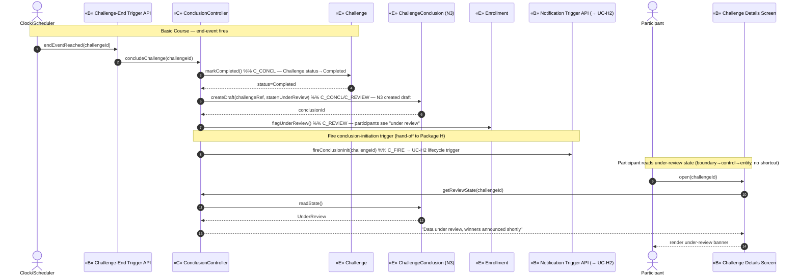
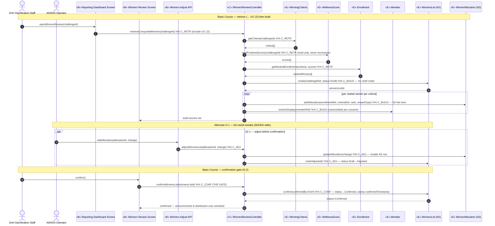
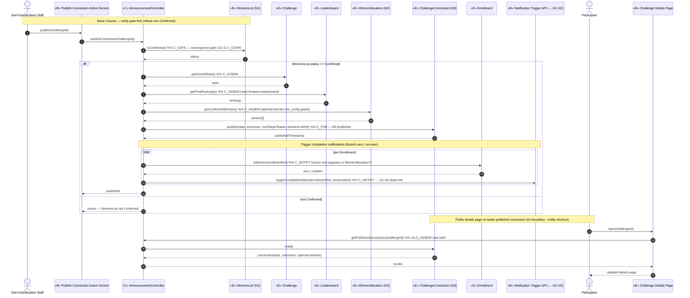
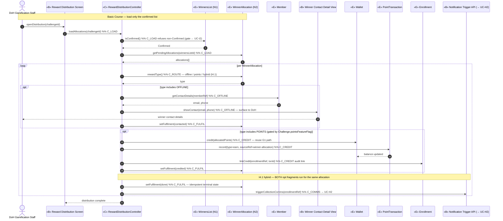
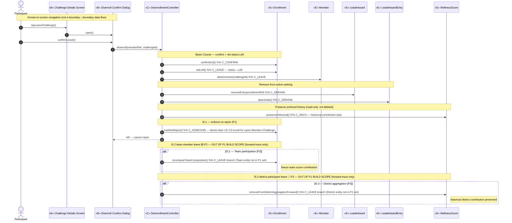

# ICONIX Step 3 — Sequence Diagrams: Package I — Settlement / Conclusion (`settlement`)

**Process**: ICONIX (Rosenberg) — use-case-driven, milestone-driven. This is the **Step-3**
deliverable for the **Settlement / Conclusion** package (id `settlement`). Each use case from
[03-robustness/settlement.md](../03-robustness/settlement.md) is realized as a Mermaid `sequenceDiagram`.

**Method allocation rule (Rosenberg)**: the robustness `«C»` control verbs become **messages**, and
each operation is **allocated to the entity that owns the data it mutates/reads**. Controllers remain as
participants (they own orchestration), but data-touching behaviour is pushed onto the entity classes
from [02-domain-model.md](../02-domain-model.md) — so `WinnersList.confirm()`, not a free-floating verb.

**Traceability spine**: `use case ⇄ domain class ⇄ robustness object ⇄ sequence message`. Every
message below carries a **back-trace note** to its originating `«C»` node and UC.

**Phase scope**: All five UCs are `🟢 P1` (individual settlement). Team/District branches (I5.2, I5.3)
are shown as **tagged `opt` fragments**, modelled for forward-traceability only — **out of P1 build scope**.

**Participant legend**: `«B»` boundary · `«C»` controller · `«E»` entity. New entities introduced in
Step-2 and back-ported to the domain model: **WinnersList (N1)**, **WinnerAllocation (N2)**,
**ChallengeConclusion (N3)**.

**Convergence gate**: `WinnersList.confirm()` (UC-I2 `C_CONF`) is modelled once here and **referenced**
(precondition guard) by the UC-I3 and UC-I4 sequences — neither acts on a non-`Confirmed` list.

---

## UC-I1 — Conclude Challenge 🟢 P1

*Realizes P1-12, §Challenge Conclusion · Actor: **Clock/Scheduler** (end-event). Triggers UC-H2.*
*Precondition: UC-D6 has locked `WellnessScore`; UC-E1.2 has finalized `Leaderboard` (read-only).*

**Back-trace map (message ⇄ robustness `«C»` ⇄ UC)**:

| Message | Robustness control node | UC |
|---|---|---|
| `Challenge.markCompleted()` | `C_CONCL` (transition → Completed) | UC-I1 |
| `ChallengeConclusion.createDraft()` | `C_CONCL`+`C_REVIEW` (N3 draft, under-review) | UC-I1 |
| `Enrollment.flagUnderReview()` | `C_REVIEW` (set UI state) | UC-I1 |
| `fireConclusionInit()` | `C_FIRE` (notification trigger) | UC-I1 → UC-H2 |

**Alternate course**: none branching in I1. Precondition guard — if `WellnessScore.locked=false` or
`Leaderboard.finalized=false`, `concludeChallenge` aborts (data not settled); modelled as precondition,
not a recompute. Notification content lives in Package H (UC-H2).

---

## UC-I2 — Review & Confirm Winners 🟢 P1

*Realizes P1-12, P1-13, §Challenge Conclusion · Actor: **DoH Gamification Staff** (+ **ADHDS Operator**
for I2.1). Includes UC-J2 (retrieve computed winners). `WinnersList.confirm()` is the convergence gate.*

**Back-trace map (message ⇄ robustness `«C»` ⇄ UC)**:

| Message | Robustness control node | UC |
|---|---|---|
| `retrieveComputedWinners()` / `WinningCriteria.getCriteria()` / `WellnessScore.readFinalizedScores()` / `Enrollment.getRankedEnrollments()` | `C_RETR` (include point) | UC-I2 ⊃ UC-J2 |
| `WinnersList.create()` / `WinnerAllocation.addAllocation()` / `Member.resolveDisplay()` | `C_BUILD` | UC-I2 |
| `WinnerAllocation.updateAllocation()` / `WinnersList.markAdjusted()` | `C_ADJ` | UC-I2 / I2.1 |
| `WinnersList.confirm()` | `C_CONF` (gate) | UC-I2 / I2.2 |

**Alternate courses**: **I2.1** (`opt`) — only **ADHDS Operator** touches `B_ADJ`; mutates `N2`/`N1`
pre-confirmation. **I2.2** — `WinnersList.confirm()` sets `status=Confirmed`; this single message is the
**convergence gate** referenced by UC-I3 and UC-I4 below. `WellnessScore` is read-only — settlement
never recomputes scores.

---

## UC-I3 — Announce Winners & Publish Conclusion 🟢 P1

*Realizes P1-12, §Challenge Conclusion · Actor: **DoH Gamification Staff** / system. **Precondition:
UC-I2 `WinnersList.confirm()`**. Triggers UC-H2 won/not-won completion notifications.*

**Back-trace map (message ⇄ robustness `«C»` ⇄ UC)**:

| Message | Robustness control node | UC |
|---|---|---|
| `WinnersList.isConfirmed()` | `C_GATE` (refuse non-Confirmed) | UC-I3 (gate ← UC-I2) |
| `Challenge.getOverallStats()` / `Leaderboard.getFinalRankings()` / `WinnerAllocation.getConfirmedWinners()` | `C_ASSEM` | UC-I3 |
| `ChallengeConclusion.publish()` | `C_PUB` | UC-I3 |
| `Enrollment.isWinner()` + `triggerCompletionNotice()` | `C_NOTIFY` (won/not-won branch) | UC-I3 → UC-H2 |
| `ChallengeConclusion.read()` (page re-read) | `C_ASSEM` read path | UC-I3 |

**Alternate courses**: `alt` on the **confirmation gate** — non-`Confirmed` list ⇒ `refuse` (back-ref to
UC-I2 invariant). `C_NOTIFY` **branches won vs not-won** per `Enrollment` membership in a
`WinnerAllocation`; both branches deep-link via Package H. Optional winners block on `B_PAGE` is
config-gated.

---

## UC-I4 — Distribute Rewards 🟢 P1

*Realizes §Reward Distribution · Actor: **DoH Gamification Staff** (offline) / system (points).
**Precondition: UC-I2 confirmation**. Triggers UC-H2 collection comms. Points leg reuses the
`Wallet`/`PointTransaction` fragment shared with UC-G1 (`sourceRef=winner-allocation`).*

**Back-trace map (message ⇄ robustness `«C»` ⇄ UC)**:

| Message | Robustness control node | UC |
|---|---|---|
| `WinnersList.isConfirmed()` / `WinnerAllocation.getPendingAllocations()` | `C_LOAD` (gate ← UC-I2) | UC-I4 |
| `WinnerAllocation.rewardType()` | `C_ROUTE` (offline/points/hybrid) | UC-I4 / I4.1 |
| `Member.getContactDetails()` + `showContact()` | `C_OFFLINE` | UC-I4 |
| `Wallet.credit()` / `PointTransaction.record()` / `Enrollment.linkCredit()` | `C_CREDIT` (shared w/ UC-G1) | UC-I4 |
| `WinnerAllocation.setFulfilment()` | `C_FULFIL` (pending→contacted/credited→done) | UC-I4 |
| `triggerCollectionComms()` | `C_COMMS` | UC-I4 → UC-H2 |

**Alternate courses**: **I4.1 hybrid** — when `rewardType()` returns hybrid, **both** the OFFLINE and
POINTS `opt` fragments fire for one allocation. The POINTS leg is additionally gated by
`Challenge.pointsFeatureFlag` (off ⇒ skip points, offline still runs). `setFulfilment(done)` makes
distribution **idempotent and auditable**. `PointTransaction.record(sourceRef=winner-allocation)`
distinguishes this from the weekly-score credit but reuses the identical UC-G1 ledger fragment.

---

## UC-I5 — Disenroll / Leave Challenge 🟢 P1

*Realizes §Disenrollment · Actor: **Participant**. I5.1 no-rejoin P1; I5.2 team-freeze 🟡 P2;
I5.3 district-aggregation 🔵 P3 (out of build scope, tagged).*

**Back-trace map (message ⇄ robustness `«C»` ⇄ UC)**:

| Message | Robustness control node | UC | Phase |
|---|---|---|---|
| `Enrollment.confirmExit()` | `C_CONFIRM` | UC-I5 | 🟢 P1 |
| `Enrollment.setLeft()` / `Member.detachActive()` | `C_LEAVE` | UC-I5 | 🟢 P1 |
| `Leaderboard.removeEntry()` / `LeaderboardEntry.deactivate()` | `C_DERANK` | UC-I5 | 🟢 P1 |
| `WellnessScore.preserveHistorical()` | `C_ARCH` | UC-I5 | 🟢 P1 |
| `Enrollment.markNoRejoin()` | `C_NOREJOIN` | UC-I5 / I5.1 | 🟢 P1 |
| `Enrollment.recomputeTeamComposition()` | `C_LEAVE` (team branch) | UC-I5 / I5.2 | 🟡 P2 |
| `WellnessScore.removeFromDistrictAggregationForward()` | `C_LEAVE` (district branch) | UC-I5 / I5.3 | 🔵 P3 |

**Alternate courses**: **I5.1** (P1) — `Enrollment.markNoRejoin()` flags the enrollment so a later
**UC-C3** enroll attempt for the same Member+Challenge is blocked. **I5.2** (🟡 P2 `opt`) and **I5.3**
(🔵 P3 `opt`) branch off `C_LEAVE` but depend on Team/District entities **absent from the P1 build set** —
shown tagged, out-of-build-scope. `B_DET → B_CONF` is screen navigation (actor re-touches `B_CONF`).

---

## Step-3 invariant & traceability check

| Check | Status |
|---|---|
| Every `«C»` robustness verb realized as a sequence message | ✅ all of `C_CONCL`/`C_REVIEW`/`C_FIRE`, `C_RETR`/`C_BUILD`/`C_ADJ`/`C_CONF`, `C_GATE`/`C_ASSEM`/`C_PUB`/`C_NOTIFY`, `C_LOAD`/`C_ROUTE`/`C_OFFLINE`/`C_CREDIT`/`C_FULFIL`/`C_COMMS`, `C_CONFIRM`/`C_LEAVE`/`C_DERANK`/`C_ARCH`/`C_NOREJOIN` mapped |
| Each operation allocated to the owning entity | ✅ data-mutating methods sit on `Challenge`/`ChallengeConclusion`/`WinnersList`/`WinnerAllocation`/`Wallet`/`PointTransaction`/`Enrollment`/`Leaderboard`/`WellnessScore`/`Member` |
| Actors touch only boundary | ✅ Clock→`B_END`, Participant→`B_DET`/`B_PAGE`/`B_CONF`, DoH→`B_DASH`/`B_REV`/`B_PUB`/`B_DIST`, ADHDS→`B_ADJ` |
| Confirmation gate referenced once, reused by I3+I4 | ✅ `WinnersList.confirm()` (I2) ⇒ `isConfirmed()` guards I3 (`alt`) and I4 (`C_LOAD`) |
| Settlement never recomputes scores | ✅ `WellnessScore`/`Leaderboard` accessed via read methods (`readFinalizedScores`, `getFinalRankings`, `preserveHistorical`); only status flags + winner `PointTransaction` written |
| No message references an orphan class | ✅ N1/N2/N3 back-ported to `02-domain-model.md` precondition (Step-2 handoff); all participants exist in domain model |
| Basic Course = main flow, Alternate Courses = alt/opt | ✅ I2.1/I3-gate/I4.1-hybrid/I5.1-I5.3 modelled as `opt`/`alt`/`loop` fragments |

**Forward handoff (to Step 4 / design)**: each entity method above becomes a class operation; the
`WinnersList.confirm()` gate and the shared `Wallet.credit()`/`PointTransaction.record()` fragment
(UC-I4 ⇄ UC-G1) are reuse points to consolidate. Package-H notification triggers
(`fireConclusionInit`, `triggerCompletionNotice`, `triggerCollectionComms`) are the cross-package
seams to UC-H2.
