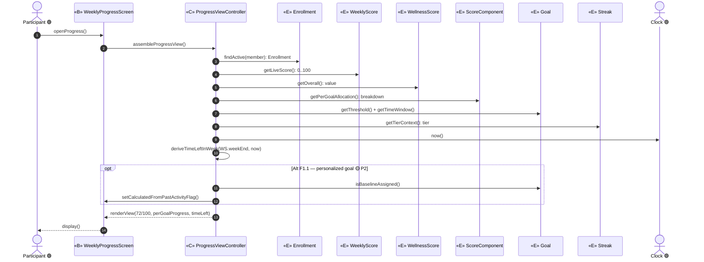
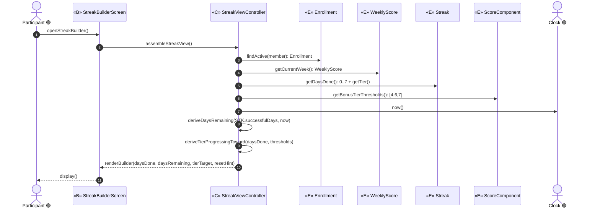
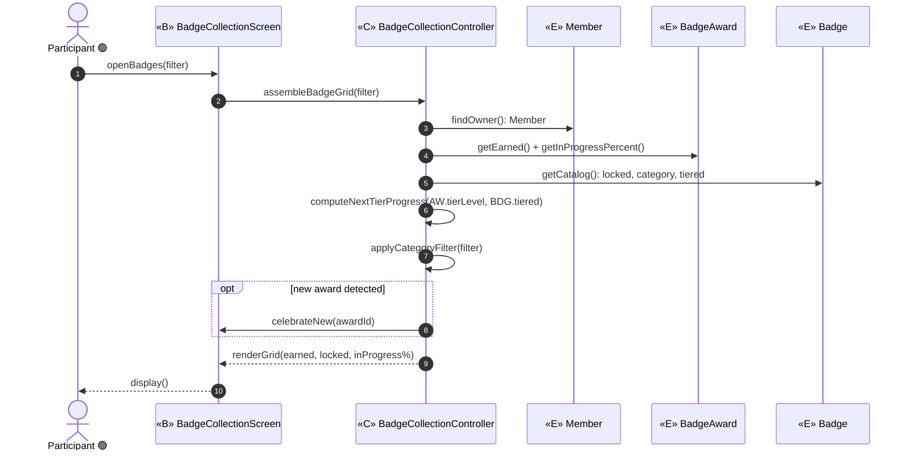
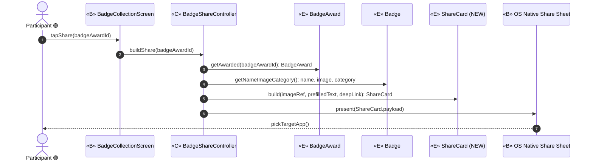
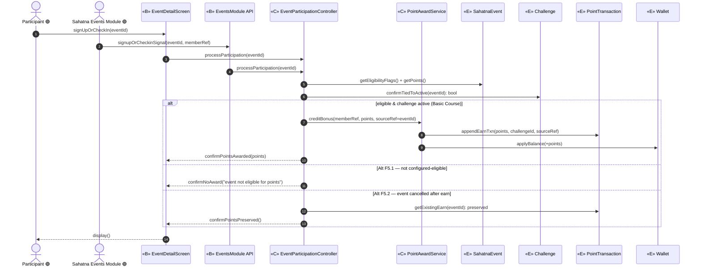
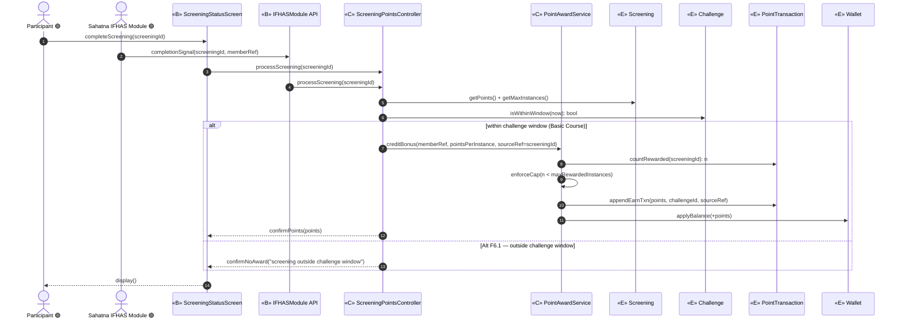
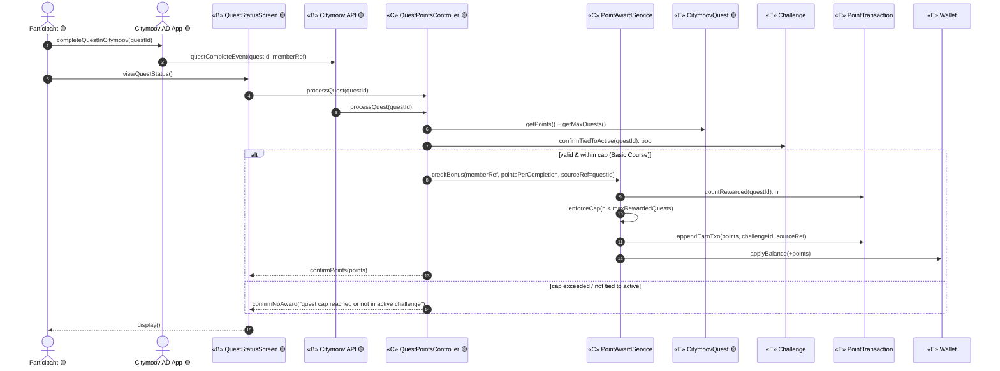

# ICONIX Step 3 — Sequence Diagrams

## Package F — Track & Engage (`track-engage`, P1)

**Process**: ICONIX (Rosenberg), use-case-driven, milestone-driven. Step 3 turns each Step-2
robustness diagram into an interaction. **Boundary** «B» and **entity** «E» objects become the
participants; every **control** «C» from the robustness diagram becomes a lifeline that *owns the
verbs* — the operations it invokes are allocated to the **entity that owns the data** (e.g. a
balance update lands on `Wallet`, a ledger append lands on `PointTransaction`). This is the
expansion-and-allocation step Rosenberg requires: nouns→entities (already done in Step 1), verbs→the
controller messages drawn here.

**Forward/backward traceability**: each diagram realizes exactly the robustness objects of its
use case (forward from `03-robustness/track-engage.md`), each message maps back to a use-case
sentence + a `02-domain-model.md` class (backward; see the per-diagram "Traceability" notes), and
Alternate Courses appear as `alt`/`opt` fragments tied to the named Alt-course IDs (F5.1, F5.2,
F6.1, F1.1).

**Phase discipline**: **UC-F1…F6 are 🟢 P1** (individual scope). **UC-F7 (Citymoov Quest) is 🟡 P2**
and is drawn for forward-traceability only — its `QuestPointsController`, `CitymoovQuest` entity,
`Citymoov API`/`QuestStatusScreen` boundaries, and `Citymoov AD App` actor are **out of P1 build
scope**. The shared **PointAwardService** «C» (single writer of bonus `PointTransaction` rows,
factored out of F5/F6/F7) is reused across diagrams to honour DRY.

**Allocation rule applied throughout**: read-only assemblies (F1/F2/F3) allocate `get*()` accessors
to the owning entity; write paths (F5/F6/F7) allocate `appendEarnTxn()` to `PointTransaction` and
`applyBalance()` to `Wallet`, both driven by `PointAwardService` so the per-use-case controllers stay
thin.

---

## UC-F1 — View Weekly Score & Goal Progress 🟢 P1
*realizes P1-7, §Score Visibility, §Goal Visibility — robustness UC-F1*

Read-only assembly. `ProgressViewController` reads live `WeeklyScore`, overall `WellnessScore`,
per-goal `ScoreComponent` allocations, `Goal` threshold + time-window, and `Streak` tier context,
then derives "time left in week" from `WeeklyScore.weekEnd` against the `Clock`. **Alt F1.1**
(personalized-goal label) is 🟡 **P2** — shown as an `opt` that only sets a "calculated from past
activity" flag without exposing the formula.

**Traceability (backward)**:
- `openProgress` / `display` → P1-7 "view weekly score & per-goal progress" → «B» WeeklyProgressScreen.
- `getLiveScore` → §Score Visibility → `WeeklyScore.scoreValue_0_100`.
- `getOverall` → §Score Visibility → `WellnessScore.value`.
- `getPerGoalAllocation` → §Goal Visibility → `ScoreComponent.weeklyAllocation`.
- `getThreshold`/`getTimeWindow` → §Goal Visibility → `Goal.threshold` / `Goal.frequency`.
- `getTierContext` → §Streak Builder context → `Streak.tier`.
- `deriveTimeLeftInWeek` → controller-derived (no stored attribute), from `WeeklyScore.weekEnd` + Clock.
- `opt Alt F1.1` → P2 baseline-personalized goal → `Goal.assignmentModel=baseline` (forward-trace only).

---

## UC-F2 — View Streak Builder 🟢 P1
*realizes P1-7, §Streak Builder UX — robustness UC-F2*

Read-only over `Streak` (`successfulDays 0..7`, `tier`, `resetsWeekly`) and the parent
`WeeklyScore`/`Enrollment`. "Days remaining" and "tier progressing toward" are controller-derived
from `Streak.successfulDays` + `Clock` + the bonus tiers held on `ScoreComponent.isConsistencyBonus`.

**Traceability (backward)**:
- `openStreakBuilder` / `display` → P1-7 + §Streak Builder UX → «B» StreakBuilderScreen.
- `getDaysDone`/`getTier` → §Streak Builder UX → `Streak.successfulDays_0_7` / `Streak.tier`.
- `getBonusTierThresholds` → §Consistency Allocation → `ScoreComponent.isConsistencyBonus`.
- `getCurrentWeek` → §Streak Builder UX (parent week) → `WeeklyScore`.
- `deriveDaysRemaining` / `deriveTierProgressingToward` → controller-derived (no stored attribute); reset hint from `Streak.resetsWeekly`.

---

## UC-F3 — View Badge Collection 🟢 P1
*realizes P1-16, §Badge UX — robustness UC-F3*

Read-only over `BadgeAward` (earned, `inProgressPercent`, `tierLevel`) and the template `Badge`
(`category`, `tiered_flag`). Next-tier progress and category filter are controller logic. A fresh
`BadgeAward` raises a transient "celebrate-new" UI event handled by the boundary (no new entity).

**Traceability (backward)**:
- `openBadges(filter)` / `display` → P1-16 + §Badge UX → «B» BadgeCollectionScreen.
- `findOwner` → §Badge UX ownership → `Member`.
- `getEarned`/`getInProgressPercent` → P1-16 in-progress tracking → `BadgeAward.inProgressPercent` / `BadgeAward.tierLevel`.
- `getCatalog` → §Badge UX (locked + category) → `Badge.category` / `Badge.tiered_flag`.
- `computeNextTierProgress` / `applyCategoryFilter` → controller logic over those attributes.
- `opt celebrateNew` → §Badge UX "celebratory moment on new award" → transient boundary event (no new entity).

---

## UC-F4 — Share Badge 🟢 P1
*realizes P1-17 — robustness UC-F4*

`BadgeShareController` builds a **ShareCard** (NEW «E»: image ref + pre-populated caption + optional
deep link) from the chosen `BadgeAward`/`Badge`, then hands the payload to the OS Native Share Sheet
(an external boundary the participant touches). Boundary→boundary is mediated by the controller.

**Traceability (backward)**:
- `tapShare` → P1-17 "native phone share" → «B» BadgeCollectionScreen.
- `getAwarded` → P1-17 chosen badge → `BadgeAward`.
- `getNameImageCategory` → P1-17 caption content → `Badge.name` / image / `category`.
- `build(...)` → P1-17 "pre-populated text" → **ShareCard (NEW «E»)** `imageRef`/`prefilledText`/`deepLink`.
- `present` / `pickTargetApp` → P1-17 native OS share → «B» OS Native Share Sheet (boundary→boundary via controller).

---

## UC-F5 — Sign Up / Check-in for Bonus-Point Event 🟢 P1
*realizes P1-9, P1-10, §Event Participation — robustness UC-F5*

`EventParticipationController` validates eligibility against `SahatnaEvent` flags + ties the event to
an active `Challenge`, then credits the bonus through the shared `PointAwardService` (the single
writer of bonus `PointTransaction` rows). **Alt F5.1** (not configured-eligible → no points) and
**Alt F5.2** (cancelled event → already-earned points preserved) are control branches.

**Traceability (backward)**:
- `signUpOrCheckIn` / `signupOrCheckinSignal` → P1-9 (sign-up) + P1-10 (check-in) → «B» EventDetailScreen / «B» EventsModule API + actor Sahatna Events Module.
- `getEligibilityFlags`/`getPoints` → §Event Participation config → `SahatnaEvent.eligibleForSignup_flag`/`eligibleForCheckin_flag`/`signupPoints`/`checkinPoints`.
- `confirmTiedToActive` → §Event Participation (event bound to challenge) → `Challenge`.
- `creditBonus`→`appendEarnTxn`→`applyBalance` → P1-9/P1-10 award → `PointAwardService` writes `PointTransaction` (type=earn) + updates `Wallet.currentBalance`.
- `alt Alt F5.1` → Alt course F5.1 "not configured-eligible → no points".
- `else Alt F5.2` → Alt course F5.2 "cancelled event → earned points preserved" → read-only over `PointTransaction`.

---

## UC-F6 — Complete Screening for Points 🟢 P1
*realizes §Goals (IFHAS), §Reward Points (Additional Avenues) — robustness UC-F6*

`ScreeningPointsController` validates the screening fell inside the challenge window
(`Challenge.start/endDateTime`) and credits via the shared `PointAwardService`, which also enforces
`Screening.maxRewardedInstances`. **Alt F6.1** (screening outside challenge window → no points) is a
control branch.

**Traceability (backward)**:
- `completeScreening` / `completionSignal` → §Goals (IFHAS) → «B» ScreeningStatusScreen / «B» IFHASModule API + actor Sahatna IFHAS Module.
- `getPoints`/`getMaxInstances` → §Reward Points (Additional Avenues) → `Screening.pointsPerInstance` / `Screening.maxRewardedInstances`.
- `isWithinWindow` → Alt F6.1 gate → `Challenge.startDateTime`/`endDateTime`.
- `countRewarded`→`enforceCap`→`appendEarnTxn`→`applyBalance` → cap-checked award → `PointAwardService` over `PointTransaction` + `Wallet`.
- `else Alt F6.1` → Alt course F6.1 "screening outside challenge window → no points".

---

## UC-F7 — Complete Citymoov Quest for Points 🟡 **P2**
*realizes P2-2, §Citymoov Quest Integration — robustness UC-F7* — **OUT OF P1 BUILD SCOPE; shown for forward-traceability**

`QuestPointsController` (🟡 P2) validates the quest, ties it to an active `Challenge`, and credits a
capped bonus via the shared `PointAwardService` (`CitymoovQuest.maxRewardedQuests`). Completion
arrives over the external `Citymoov API` from the `Citymoov AD App` actor. Everything quest-specific
is **P2** — drawn only so the P2 requirement is not orphaned. Note `PointAwardService` is the same
shared writer reused from F5/F6 (so it is **not** itself P2).

**Traceability (backward)**:
- `completeQuestInCitymoov` / `questCompleteEvent` → P2-2 + §Citymoov Quest Integration → «B» Citymoov API + actor Citymoov AD App (🟡 P2).
- `viewQuestStatus` → §Citymoov Quest Integration → «B» QuestStatusScreen (🟡 P2).
- `getPoints`/`getMaxQuests` → §Citymoov Quest Integration → `CitymoovQuest.pointsPerCompletion` / `maxRewardedQuests` (🟡 P2 class).
- `confirmTiedToActive` → §Citymoov Quest Integration → `Challenge`.
- `creditBonus`→cap-check→`appendEarnTxn`→`applyBalance` → capped award → **shared** `PointAwardService` over `PointTransaction` + `Wallet` (reused, not P2).

---

## Cross-diagram allocation & traceability summary

| Use case | Boundary «B» | Control «C» (verbs) | Owning entity for each write/read | Alt courses shown | Phase |
|---|---|---|---|---|---|
| UC-F1 | WeeklyProgressScreen | ProgressViewController | WeeklyScore/WellnessScore/ScoreComponent/Goal/Streak (reads); time-left derived | opt F1.1 | 🟢 P1 (F1.1 → 🟡 P2) |
| UC-F2 | StreakBuilderScreen | StreakViewController | Streak/WeeklyScore/ScoreComponent (reads); days-left + tier derived | — | 🟢 P1 |
| UC-F3 | BadgeCollectionScreen | BadgeCollectionController | BadgeAward/Badge/Member (reads); next-tier + filter computed | opt celebrate-new | 🟢 P1 |
| UC-F4 | BadgeCollectionScreen + OS Native Share Sheet | BadgeShareController | **ShareCard (NEW)** build; BadgeAward/Badge reads | — | 🟢 P1 |
| UC-F5 | EventDetailScreen + EventsModule API | EventParticipationController + **PointAwardService** | PointTransaction.appendEarnTxn + Wallet.applyBalance | alt F5.1, F5.2 | 🟢 P1 |
| UC-F6 | ScreeningStatusScreen + IFHASModule API | ScreeningPointsController + **PointAwardService** | PointTransaction (+cap) + Wallet | alt F6.1 | 🟢 P1 |
| UC-F7 | QuestStatusScreen + Citymoov API | QuestPointsController + **PointAwardService** | PointTransaction (+cap) + Wallet | alt cap/not-active | 🟡 **P2** |

**ICONIX completeness check**: every «B»/«C»/«E» object in `03-robustness/track-engage.md` appears
as a participant or a message origin/target above (forward); every message carries a backward note to
a use-case sentence + a `02-domain-model.md` class (or the declared NEW `ShareCard`). The shared
`PointAwardService` is the single writer of bonus `PointTransaction` rows across F5/F6/F7 (DRY).
Phase tags (🟢 P1 / 🟡 P2) are preserved so no P2 requirement (F1.1 personalized goal, F7 Citymoov)
is orphaned and none leaks into P1 build scope.
