# 00 — Architecture Index (Top-Down Solution Structure)

> **What this is.** The **top-down structural complement** to the bottom-up ICONIX *behavioural*
> analysis of the Wellness Gamification (Sahatna) platform. ICONIX worked *up* from use cases →
> robustness diagrams → sequences (behaviour). This architecture set works *down* from that behaviour
> into a deployable **structure**: three interface surfaces → API Gateway → 11 microservices (bounded
> contexts) → database-per-service datastores → external systems. Every structural element traces back
> to a robustness object (`«B»` boundary / `«C»` control / `«E»` entity) or a use case.
>
> **Phase discipline.** 🟢 **P1 = individual-only**. Teams / Districts / Titles / baseline-personalized
> goals are 🟡 P2 / 🔵 P3 — modelled for forward-traceability and tagged, **never** in the P1 build set.

## Artifact map (top-down ↔ bottom-up)

| Layer | Top-down structure (this set) | ← derived from bottom-up ICONIX behaviour |
|---|---|---|
| Interface | [`01-interface-layer.md`](01-interface-layer.md) — 3 surfaces | `«B»` boundary objects in [`../03-robustness/*.md`](../03-robustness) |
| Logic | [`02-logic-bounded-contexts.md`](02-logic-bounded-contexts.md) — 11 contexts | `«C»` control objects in `../03-robustness/*.md` + [`../01-use-cases.md`](../01-use-cases.md) (10 pkgs / 59 UCs) |
| Data | [`03-datastores.md`](03-datastores.md) — 16 stores + event log | `«E»` entity objects + the 43 classes in [`../02-domain-model.md`](../02-domain-model.md) |
| Dynamics | [`sequences/*.md`](sequences) — 10 application-level packages | low-level [`../04-sequences/*.md`](../04-sequences) |
| Supplement | reward/marketplace specifics | [`../BRD-SUPPLEMENT-marketplace-reward.md`](../BRD-SUPPLEMENT-marketplace-reward.md) |

---

## 1. Master Component Diagram

```mermaid
flowchart TB
  classDef surf fill:#e8f5e9,stroke:#2e7d32,color:#1b5e20;
  classDef gw fill:#ede7f6,stroke:#4527a0,color:#311b92;
  classDef svc fill:#e3f2fd,stroke:#1565c0,color:#0d47a1;
  classDef store fill:#fff8e1,stroke:#f9a825,color:#795548;
  classDef ext fill:#fce4ec,stroke:#ad1457,color:#880e4f;
  classDef p2 fill:#fff3e0,stroke:#e65100,stroke-dasharray:4 3,color:#e65100;

  subgraph SURF["Interface Surfaces"]
    MOB["📱 Mobile (Sahatna App)"]:::surf
    ADM["🖥️ Admin Portal (DoH/ADHDS)"]:::surf
    APIS["🔌 API (systems · partners · clock)"]:::surf
  end

  GW["API Gateway"]:::gw
  SURF --> GW

  subgraph SVCS["Microservices (Bounded Contexts)"]
    CH["challenge-svc"]:::svc
    EL["eligibility-svc"]:::svc
    EN["enrolment-svc"]:::svc
    IN["ingestion-svc"]:::svc
    SC["scoring-svc"]:::svc
    LB["leaderboard-svc"]:::svc
    RC["recognition-svc"]:::svc
    RW["rewards-svc"]:::svc
    ST["settlement-svc"]:::svc
    NT["notification-svc"]:::svc
    RP["reporting-svc"]:::svc
  end
  GW --> CH & EL & EN & IN & SC & LB & RC & RW & ST & NT & RP

  subgraph DS["Datastores (DB-per-service)"]
    chDB[("challenge-db")]:::store
    elC[("eligibility-cache")]:::store
    memDB[("membership-db")]:::store
    actLog[("activity-log")]:::store
    scDB[("scoring-db")]:::store
    lbC[("leaderboard-cache")]:::store
    lbS[("leaderboard-snapshots")]:::store
    recDB[("recognition-db")]:::store
    scStore[("sharecard-store")]:::store
    ledger[("points-ledger")]:::store
    mktDB[("marketplace-db")]:::store
    imgStore[("reward-image-store")]:::store
    setDB[("settlement-db")]:::store
    notDB[("notification-db")]:::store
    anaDB[("analytics-db")]:::store
  end
  CH-->chDB
  EL-->elC
  EN-->memDB
  IN-->actLog
  SC-->scDB
  LB-->lbC & lbS
  RC-->recDB & scStore
  RW-->ledger & mktDB & imgStore
  ST-->setDB
  NT-->notDB
  RP-->anaDB

  EVTBUS{{"domain-event-log (integration backbone)"}}:::gw
  CH & EN & IN & SC & LB & RC & RW & ST -.publish/subscribe.-> EVTBUS

  subgraph EXT["External Systems (each behind an ACL)"]
    MAL(["Malaffi / DoH-ADHDS"]):::ext
    WEAR(["Wearables: Apple Health / Google Fit"]):::ext
    IFHAS(["IFHAS Screening Module"]):::ext
    SAH(["Sahatna Events"]):::ext
    PROV(["Notification Provider: push/email"]):::ext
    PART(["Reward Partners"]):::ext
    CITY(["Citymoov [P2]"]):::p2
  end

  WEAR -. "ACL: metric sync → Activity Ingestion" .-> IN
  IFHAS -. "ACL: screening events" .-> IN
  SAH -. "ACL: event sign-up/check-in bonus points" .-> RW
  PART -. "ACL: partner reward + image submission" .-> RW
  MAL -. "ACL: manual reward-image intake" .-> RW
  ST -. "ACL: offline-winner contact handoff + winner confirm gate" .-> MAL
  NT -. "gateway/ACL: delivery (downstream of consent gate)" .-> PROV
  CITY -. "ACL: quest completion points [P2]" .-> RW
```

---

## 2. Bounded-Context Map (summary)

| # | Context → microservice | Surfaces it serves | Datastore(s) | Upstream of | Downstream of | Phase |
|---|---|---|---|---|---|---|
| C1 | Challenge Authoring → `challenge-svc` | Admin, API | challenge-db | Eligibility, Enrolment, Scoring, Settlement, Notification | — (pure supplier) | 🟢 P1 |
| C2 | Eligibility & Audience → `eligibility-svc` | Mobile, API | eligibility-cache | Enrolment, Leaderboard | Authoring, member-kernel | 🟢 P1 |
| C3 | Enrolment & Membership → `enrolment-svc` *(owns member-identity kernel)* | Mobile, Admin | membership-db | Scoring, Ingestion, all (kernel) | Authoring, Eligibility | 🟢 P1 |
| C4 | Activity Ingestion → `ingestion-svc` | API | activity-log | Scoring | Enrolment; ACL Wearables/IFHAS | 🟢 P1 |
| C5 | Scoring & Progression → `scoring-svc` | API (clock/events) | scoring-db | Leaderboard, Rewards, Recognition, Settlement, Reporting | Ingestion, Enrolment | 🟢 P1 |
| C6 | Leaderboard & Ranking → `leaderboard-svc` | Mobile, API | leaderboard-cache + leaderboard-snapshots | Settlement, Reporting | Scoring, Eligibility, kernel | 🟢 P1 |
| C7 | Recognition & Engagement → `recognition-svc` | Mobile | recognition-db + sharecard-store | Notification, Rewards | Scoring; ACL Sahatna/IFHAS | 🟢 P1 |
| C8 | Rewards, Wallet & Marketplace → `rewards-svc` | Mobile, Admin, API | points-ledger + marketplace-db + reward-image-store | Partners (issue) | Scoring, Recognition, Settlement; ACL Partners/Malaffi/Citymoov[P2] | 🟢 P1 (points flag-gated) |
| C9 | Settlement & Conclusion → `settlement-svc` | Admin, API | settlement-db | Rewards, Notification | Scoring, Leaderboard, Authoring, Reporting; ACL Malaffi | 🟢 P1 |
| C10 | Notification → `notification-svc` | Mobile, API | notification-db | — (terminal sender) | nearly everyone; gateway Provider | 🟢 P1 |
| C11 | Reporting & Analytics → `reporting-svc` | Admin | analytics-db | Settlement (WinnersComputation) | Enrolment, Scoring, Leaderboard | 🟢 P1 |
| — | **domain-event-log** | — | event stream | all | all | platform |

**Integration patterns**: Customer-Supplier (published-contract edges), **Anti-Corruption Layer** for every external system, and a tiny read-only **Shared Kernel** (`member-identity`: memberId/displayName/initials/consent) owned by C3 and replicated read-only to C5/C6/C7/C8/C9/C10/C11.

---

## 3. Traceability

### 3a. Microservice ← controllers / UCs that realize it

| Microservice | Realizing `«C»` controllers (robustness) | Use cases |
|---|---|---|
| `challenge-svc` | ChallengeRequest, ChallengeConfig, GoalSet, WinningCriteria, ChallengePublication, ChallengeGovernance, ChallengeArchival, Authorization | UC-A1…A9 |
| `eligibility-svc` | EligibilityEvaluation / Visibility / CohortScope (inline), WhitelistMatcher | UC-B1 |
| `enrolment-svc` | Discovery, ChallengeDetail, Enrollment, Consent, WellnessDataConnect (+P2 Team*, +P3 District*) | UC-C1…C5 (+C6/C7 P2, C8 P3) |
| `ingestion-svc` | GoalDataIngestion | UC-D1 |
| `scoring-svc` | DailyEvaluation, WeeklyScore, ConsistencyBonus, WeeklyFinalization, FinalScore, TieBreak, BadgeAward, TitleProgression (+P2 TeamScore, +P3 DistrictScore) | UC-D2…D8 (+D9/D10 P2/P3) |
| `leaderboard-svc` | LeaderboardQuery, Ranking, PrivacyDisplay (+P2 Team/Profile, +P3 District) | UC-E1 (+E2/E4 P2, E3 P3) |
| `recognition-svc` | ProgressView, StreakView, BadgeCollection, BadgeShare, EventParticipation, ScreeningPoints (+P2 Quest) | UC-F1…F6 (+F7 P2) |
| `rewards-svc` | RewardAccrual, WalletView, CatalogBrowse, Redemption, MyRewards, CatalogConfig, PartnerRewardSubmission | UC-G1…G7 |
| `settlement-svc` | Conclusion, WinnersReview, Announcement, RewardDistribution, Disenrollment (+WinnersComputation/ContactExtraction compute-side) | UC-I1…I5 |
| `notification-svc` | Consent, LifecycleNotification, ProgressNudge, WeeklySummary, NotificationDispatcher | UC-H1…H4 |
| `reporting-svc` | Dashboard, EngagementMetrics, ConsistencyMetrics, Segmentation, WinnersComputation, ContactExtraction | UC-J1, UC-J2 |

### 3b. Datastore ← aggregates persisted

| Datastore | Type | Aggregate roots / key entities | Owner |
|---|---|---|---|
| challenge-db | PostgreSQL | Challenge, ChallengeRequest (+EligibilityRule, WinningCriteria, ScoringPlan, ScoreComponent, Goal-def, Segment, NotificationType) | `challenge-svc` |
| eligibility-cache | Redis read-model | CohortScope | `eligibility-svc` |
| membership-db | PostgreSQL | Member (kernel), Enrollment, WellnessDataConnection, Goal-locked (+P2 Team/TeamInvitation, P3 District) | `enrolment-svc` |
| activity-log | Append-only log | Activity, IngestionLog | `ingestion-svc` |
| scoring-db | PostgreSQL | DailyResult, WeeklyScore, Streak, WellnessScore, Ranking, MemberProgression (+P2 Title) | `scoring-svc` |
| leaderboard-cache | Redis sorted-set | Leaderboard, LeaderboardEntry | `leaderboard-svc` |
| leaderboard-snapshots | PostgreSQL | RankingSnapshot | `leaderboard-svc` |
| recognition-db | PostgreSQL | Badge, BadgeAward, ShareCard (meta) | `recognition-svc` |
| sharecard-store | Object storage | ShareCard images | `recognition-svc` |
| points-ledger | Append-only ledger | Wallet, PointTransaction | `rewards-svc` |
| marketplace-db | PostgreSQL | MarketplaceItem, InventoryCounters, Redemption, Voucher, Partner, SahatnaEvent/Screening config (+P2 CitymoovQuest) | `rewards-svc` |
| reward-image-store | Object storage | partner reward images | `rewards-svc` |
| settlement-db | PostgreSQL | WinnersList, WinnerEntry/WinnerAllocation, ChallengeConclusion | `settlement-svc` |
| notification-db | PostgreSQL | NotificationConsent, NotificationMessage | `notification-svc` |
| analytics-db | PostgreSQL (OLAP read-model) | ChallengeMetrics, EngagementFunnelStage | `reporting-svc` |
| domain-event-log | Event stream | all cross-context domain events | platform |

---

## 4. Layer-Coverage Check

| Check | Result |
|---|---|
| Every `«B»` boundary object → a surface | ✅ All boundary objects in `01-interface-layer.md` assigned to Mobile / Admin / API; the one non-screen path (UC-G7 Sept reward image → Malaffi) is explicitly modelled as an **Offline/Manual** surface, not silently dropped. |
| Every aggregate root → a datastore | ✅ All 43 domain classes + 4 robustness/notification additions persisted in exactly one owning store (`03-datastores.md` §3). Cross-context refs by **id only**. Goal split definition (challenge-db) vs locked-instance (membership-db) by lifecycle — intentional, not an orphan. |
| Every `«C»` controller → one owning context | ✅ `02-logic-bounded-contexts.md` §3 — no orphan controllers; cross-context triggers are events, not shared ownership. Two deliberate re-cuts (Ingestion split from Scoring; RewardAccrual to Rewards) documented. |
| Every UC package → a high-level sequence | ✅ 10 packages (A–J) ↔ 10 application-level sequence files: A=challenge-authoring, B=eligibility, C=enrolment, D=earn-scoring, E=leaderboard, F=track-engage, G=redeem-marketplace, H=notification, I=settlement, J=reporting. |
| Every external system → an ACL | ✅ Malaffi, Wearables, IFHAS, Sahatna, Notification Provider, Partners, Citymoov[P2] all wrapped — no foreign schema reaches a domain model. |

**Gaps / notes (declared, not silent):**
- **G1 (modelling, not a defect)** — `Goal` is intentionally persisted twice by lifecycle stage (definition in challenge-db, locked instance in membership-db). Tracked, not an orphan.
- **G2** — `eligibility-cache`, `leaderboard-cache`, `analytics-db` are **derived read-models** (no system-of-record); recoverability depends on event-replay from `domain-event-log` — an operational concern to validate, not a coverage gap.
- **G3** — UC-G7 Sept reward-image path is **offline/manual to Malaffi** (no portal upload UI); CMS-managed upload is a deferred increment. Modelled as Offline surface so traceability is intact.
- **G4** — P2/P3 controllers/entities (Team/District/Title) carry **no P1 write path** but占 storage rows in their P1-owning store; tagged throughout, by design.

---

## Verdict

- **Interface surfaces**: **3** (Mobile · Admin Portal · API) + 1 explicit Offline/Manual surface (Malaffi reward-image hand-off).
- **Bounded contexts / microservices**: **11** (C1–C11).
- **Datastores**: **15** service stores (16 store instances incl. leaderboard's cache+snapshot split) + **1** shared `domain-event-log` integration backbone.
- **High-level (application-level) sequence packages**: **10** (A–J), each tracing to its bottom-up `04-sequences/*` counterpart.
- **Gaps**: none silent — 4 declared modelling/operational notes (G1–G4: Goal dual-persistence, derived read-model recoverability, Sept offline reward image, P2/P3 zero-write-path rows). Full layer coverage confirmed: every boundary→surface, every aggregate→store, every controller→context, every package→sequence, every external→ACL.
