# 01 — Interface Layer (Solution Structure)

> **Top-down derivation from bottom-up ICONIX.** Every `«B»` boundary object swept from
> `03-robustness/*.md` is de-duplicated and assigned to **exactly one** of three delivery surfaces:
>
> | Surface | Audience | Nature |
> |---|---|---|
> | **Mobile** | Participant / citizen | The **Sahatna** app (screens, dialogs, OS share sheet) |
> | **Admin Portal** | DoH Gamification Staff + ADHDS Operator | Back-office consoles, dashboards, review/config screens |
> | **API** | Systems / integrations / partners / time-actor | Inbound ingest, lifecycle/trigger events, provider gateways, partner submission, inter-service read/write APIs |
>
> **Traceability** is preserved: each row carries its originating UC(s) and the microservice/context
> (the `«C»` controller surfaced in robustness analysis) the boundary talks to.
> **Phase**: 🟢 P1 (individual) in scope · 🟡 P2 · 🔵 P3 deferred (tagged, modelled for forward-traceability only).
> The **September-Challenge reward-image-to-Malaffi** path is an **offline/manual** surface (not a portal screen) — flagged ⚠️ below.

---

## Grouping diagram

```mermaid
flowchart TB
  classDef mob fill:#e8f5e9,stroke:#2e7d32,color:#1b5e20;
  classDef adm fill:#fff3e0,stroke:#e65100,color:#bf360c;
  classDef api fill:#e3f2fd,stroke:#1565c0,color:#0d47a1;
  classDef off fill:#fce4ec,stroke:#ad1457,color:#880e4f,stroke-dasharray:5 3;

  subgraph MOBILE["📱 Mobile — Sahatna Participant App"]
    direction TB
    M_DISC["Challenge Discovery / Card View"]:::mob
    M_DET["Challenge Details Screen"]:::mob
    M_ENR["Enrollment Wizard"]:::mob
    M_CONS["Consent Dialog"]:::mob
    M_WDC["Wellness-Data Connect Screen"]:::mob
    M_ENRCONF["Enrollment Confirmation Screen"]:::mob
    M_NOTSET["Notification Settings Screen"]:::mob
    M_PROG["Weekly Progress Screen"]:::mob
    M_STRK["Streak Builder Screen"]:::mob
    M_BADGE["Badge Collection Screen"]:::mob
    M_SHARE["OS Native Share Sheet"]:::mob
    M_EVT["Event Detail Screen"]:::mob
    M_SCR["Screening Status Screen"]:::mob
    M_LB["Individual Leaderboard Screen"]:::mob
    M_WALLET["Wallet Screen"]:::mob
    M_MKT["Marketplace Catalog Screen"]:::mob
    M_RWD["Reward Detail + Redemption Confirm"]:::mob
    M_MYR["My Rewards / Artifact Viewer"]:::mob
    M_DEEP["Deep-Linked Notification Page"]:::mob
    M_P2["🟡/🔵 Team / District / Profile / Quest (P2/P3)"]:::mob
  end

  subgraph ADMIN["🖥️ Admin Portal — DoH Staff + ADHDS Operator"]
    direction TB
    A_REQF["Internal Challenge Request Form"]:::adm
    A_REV["Request Review Screen"]:::adm
    A_CFG["Challenge Config Console"]:::adm
    A_GOAL["Goal-Set Config Screen"]:::adm
    A_CRIT["Winning-Criteria & Reward-Map Screen"]:::adm
    A_GOV["Governance Console / Archive Action"]:::adm
    A_DASH["Challenge Dashboard Screen"]:::adm
    A_WIN["Winners List Panel / Review Screen"]:::adm
    A_PUB["Publish-Conclusion Action Screen"]:::adm
    A_DIST["Reward Distribution + Winner Contact View"]:::adm
    A_CATADM["Catalog Admin Console"]:::adm
    A_SUBF["Reward Submission Form (partner details)"]:::adm
    A_DETUR["Challenge Details (under-review state)"]:::adm
    A_DISEN["Disenroll Confirm Dialog (P1 individual)"]:::adm
  end

  subgraph API["🔌 API — Systems · Integrations · Partners · Clock"]
    direction TB
    I_WEBF["Web Challenge Request Form (citizen intake)"]:::api
    I_ELIG["Eligibility API"]:::api
    I_INGEST["Ingestion API (wearables / IFHAS / Events / Member)"]:::api
    I_HDS["Health Data Source API"]:::api
    I_EVTAPI["Events Module API"]:::api
    I_IFHAS["IFHAS Module API"]:::api
    I_NOTGW["Notification Provider Gateway"]:::api
    I_LBQ["Leaderboard Query API"]:::api
    I_RPTQ["Reporting Query API"]:::api
    I_WADJ["Winners-Adjust API"]:::api
    I_NOTTRIG["Notification / Lifecycle-Event / Nudge-Schedule / Week-Finalized Trigger APIs"]:::api
    I_SCHED["Scheduler Trigger / Day-Close / Week-Close / Challenge-End Trigger APIs (Clock)"]:::api
    I_EVTBUS["Internal Domain Events (Goal-Met / Streak-Update / Badge-Trigger / Weekly-Finalized / Score-Recalc)"]:::api
    I_NOTINVITE["Notification Provider API (team invite delivery, P2)"]:::api
    I_CITY["🟡 Citymoov API (Quest, P2)"]:::api
  end

  subgraph OFFLINE["✉️ Offline / Manual surface (NOT a portal screen)"]
    O_MAL["⚠️ Manual Image Submission → Malaffi (Sept Challenge)"]:::off
  end
```

---

## Boundary-object → surface table

| Boundary object | Surface | Originating UC(s) | Microservice / context (`«C»` controller) | Phase |
|---|---|---|---|---|
| Challenge Discovery Screen / ChallengeCardView | Mobile | UC-B1, UC-C1 | DiscoveryController, EligibilityEvaluator | 🟢 P1 |
| Challenge Details Screen | Mobile | UC-C2 | ChallengeDetailController | 🟢 P1 |
| Enrollment Wizard Screen | Mobile | UC-C3 | EnrollmentController | 🟢 P1 |
| Consent Dialog | Mobile | UC-C5 (incl. by C3) | ConsentController | 🟢 P1 |
| Wellness-Data Connect Screen | Mobile | UC-C4 (incl. by C3) | WellnessDataConnectController | 🟢 P1 |
| Enrollment Confirmation Screen | Mobile | UC-B3, UC-C3 | EligibilitySnapshotService | 🟢 P1 |
| Notification Settings Screen | Mobile | UC-H1 | ConsentController | 🟢 P1 |
| Weekly Progress Screen | Mobile | UC-F1 | ProgressViewController | 🟢 P1 |
| Streak Builder Screen | Mobile | UC-F2 | StreakViewController | 🟢 P1 |
| Badge Collection Screen | Mobile | UC-F3, UC-F4 | BadgeCollectionController, BadgeShareController | 🟢 P1 |
| OS Native Share Sheet | Mobile | UC-F4 | BadgeShareController (hands off via control) | 🟢 P1 |
| Event Detail Screen | Mobile | UC-F5 | EventParticipationController | 🟢 P1 |
| Screening Status Screen | Mobile | UC-F6 | ScreeningPointsController | 🟢 P1 |
| Individual Leaderboard Screen | Mobile | UC-E1 | LeaderboardQueryController, RankingController, PrivacyDisplayController | 🟢 P1 |
| Wallet Screen | Mobile | UC-G2 | WalletViewController, TransactionHistoryAssembler | 🟢 P1 |
| Marketplace Catalog Screen | Mobile | UC-G3 | CatalogBrowseController, PointsFeatureFlagGate | 🟢 P1 |
| Reward Detail Screen + Redemption Confirm Dialog | Mobile | UC-G4 | RedemptionController (+ ReserveInventory, IssueVoucher) | 🟢 P1 |
| My Rewards Screen + Artifact Viewer (code/QR) | Mobile | UC-G5 | MyRewardsController, ExpiryEvaluator | 🟢 P1 |
| Deep-Linked Page (reg / conclusion / winners) | Mobile | UC-H2 | LifecycleNotificationController (tap-through) | 🟢 P1 |
| Team Create / Team Invite / Join Team Screen | Mobile | UC-C6, UC-C7 | TeamEnrollmentController, TeamJoinController | 🟡 P2 |
| District Enroll Screen | Mobile | UC-C8 | DistrictEnrollmentController | 🔵 P3 |
| Team-Hybrid / Team-Detail-Drill Leaderboard Screen | Mobile | UC-E2 | TeamLeaderboardController | 🟡 P2 |
| District Leaderboard / District-Drill Screen | Mobile | UC-E3 | DistrictLeaderboardController | 🔵 P3 |
| Participant Profile Screen (badges & title) | Mobile | UC-E4 | ProfileViewController | 🟡 P2 |
| Quest Status Screen | Mobile | UC-F7 | QuestPointsController | 🟡 P2 |
| Internal Challenge Request Form | Admin Portal | UC-A1 | ChallengeRequestController | 🟢 P1 |
| Request Review Screen | Admin Portal | UC-A3 | RequestReviewController | 🟢 P1 |
| Challenge Config Console | Admin Portal | UC-A4 | ChallengeConfigController | 🟢 P1 |
| Goal-Set Config Screen | Admin Portal | UC-A5 | GoalSetConfigController | 🟢 P1 |
| Winning-Criteria & Reward-Map Screen | Admin Portal | UC-A6 | RewardMappingController | 🟢 P1 |
| Governance Console / Archive Action | Admin Portal | UC-A8, UC-A9 | GovernanceController, ArchiveController | 🟢 P1 |
| Challenge Dashboard Screen | Admin Portal | UC-J1 | DashboardController, EngagementMetricsController, SegmentationController | 🟢 P1 |
| Winners List Panel | Admin Portal | UC-J2 | WinnersComputationController | 🟢 P1 |
| Reporting Dashboard Screen / Winners Review Screen | Admin Portal | UC-I2 (← J2) | WinnersReviewController | 🟢 P1 |
| Publish-Conclusion Action Screen | Admin Portal | UC-I3 | AnnouncementController | 🟢 P1 |
| Reward Distribution Screen + Winner Contact Detail View | Admin Portal | UC-I4 | RewardDistributionController, ContactExtractionController | 🟢 P1 |
| Catalog Admin Console | Admin Portal | UC-G6 | CatalogConfigController, InventoryManager | 🟢 P1 |
| Reward Submission Form (partner details) | Admin Portal | UC-G7 | PartnerRewardSubmissionController | 🟢 P1 |
| Challenge Details Screen (under-review state) | Admin Portal | UC-I1 | ConclusionController | 🟢 P1 |
| Disenroll Confirm Dialog | Admin Portal | UC-I5 | DisenrollmentController | 🟢 P1 |
| Web Challenge Request Form (in-app citizen link) | API | UC-A2 | ChallengeRequestController (origin=user) | 🟢 P1 |
| Eligibility API | API | UC-B1 | EligibilityEvaluator, WhitelistMatcher | 🟢 P1 |
| Ingestion API | API | UC-D1 | GoalDataIngestionController | 🟢 P1 |
| Health Data Source API | API | UC-C4 | WellnessDataConnectController | 🟢 P1 |
| Events Module API | API | UC-F5 | EventParticipationController | 🟢 P1 |
| IFHAS Module API | API | UC-F6 | ScreeningPointsController | 🟢 P1 |
| Notification Provider Gateway | API | UC-H2, UC-H3, UC-H4 | NotificationDispatcher | 🟢 P1 |
| Leaderboard Query API | API | UC-E1 (/E2/E3/E4) | LeaderboardQueryController | 🟢 P1 |
| Reporting Query API | API | UC-J1, UC-J2 | DashboardController, WinnersComputationController | 🟢 P1 |
| Winners-Adjust API | API | UC-I2 | WinnersReviewController | 🟢 P1 |
| Notification Trigger API | API | UC-I3, UC-I4 (→ H2) | AnnouncementController, RewardDistributionController | 🟢 P1 |
| Lifecycle-Event API | API | UC-H2 (← A7/I1/I3) | LifecycleNotificationController | 🟢 P1 |
| Nudge-Schedule API | API | UC-H3 (← Clock) | ProgressNudgeController | 🟢 P1 |
| Week-Finalized Trigger API | API | UC-H4 (← D5) | WeeklySummaryController | 🟢 P1 |
| Scheduler Trigger API | API | UC-A7 | PublishScheduler | 🟢 P1 |
| Day-Close Trigger | API | UC-D2 (Clock) | DailyEvaluationController | 🟢 P1 |
| Streak-Update / Week-Close Trigger | API | UC-D3, UC-D4, UC-D5 (Clock) | WeeklyScoreController, ConsistencyBonusController, WeeklyFinalizationController | 🟢 P1 |
| Challenge-End Trigger API | API | UC-D6, UC-I1 (Clock) | FinalScoreController, ConclusionController | 🟢 P1 |
| Goal-Met Event | API (internal) | UC-D2 | DailyEvaluationController | 🟢 P1 |
| Badge-Trigger Event | API (internal) | UC-D7 | BadgeAwardController | 🟢 P1 |
| Weekly-Finalized Event | API (internal) | UC-D5 → UC-G1 | RewardAccrualController | 🟢 P1 |
| WeeklyFinalizedEvent (points accrual trigger) | API (internal) | UC-G1 | RewardAccrualController, PointsFeatureFlagGate | 🟢 P1 |
| Team-Score / District-Score Recalc Event | API (internal) | UC-D9, UC-D10 | TeamScoreController, DistrictScoreController | 🟡/🔵 P2/P3 |
| Notification Provider API (team-invite delivery) | API | UC-C6 | TeamEnrollmentController | 🟡 P2 |
| Citymoov API | API | UC-F7 | QuestPointsController | 🟡 P2 |
| **Manual Image Submission → Malaffi** | **Offline / Manual** ⚠️ | UC-G7 | PartnerRewardSubmissionController (`imageSubmissionMode = manualToMalaffi`); actor re-touches it directly — no portal upload UI; CMS-managed upload is a later increment | 🟢 P1 |

---

## ⚠️ Note — September-Challenge Malaffi reward image

`ManualImageSubmission→Malaffi` (UC-G7) is **not** an Admin-Portal screen and **not** an API. For the
September Challenge the reward image is **submitted manually to the Malaffi team** (an offline, human
hand-off) — modelled as an offline boundary the partner/staff actor re-touches directly. The portal
surface for G7 is the **Reward Submission Form** (text/config details only); the image path is offline.
CMS-managed in-portal upload is a deferred later increment.
