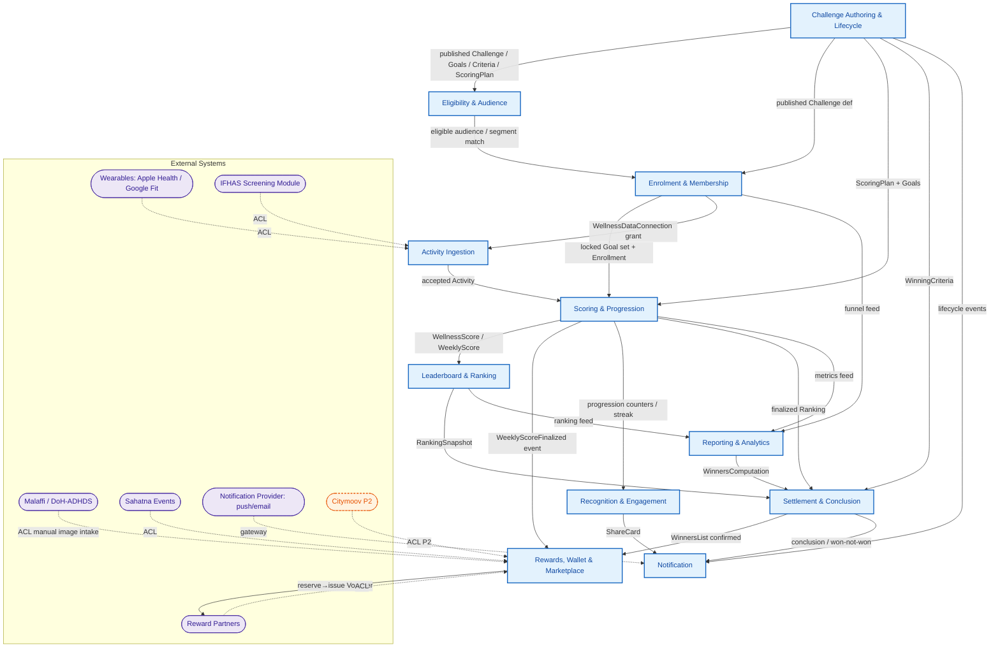

# Solution Structure — Logic Layer: Bounded Contexts (DDD)

**Derivation**: top-down DDD structure derived bottom-up from the ICONIX behavioural analysis.
**Inputs**: control objects in `03-robustness/*.md` (the controllers that own behaviour) + the 43 domain classes in `02-domain-model.md` (the entities) + use-case packages in `01-use-cases.md` + sequences in `04-sequences/*.md` + `BRD-SUPPLEMENT-marketplace-reward.md`.
**Scope**: Phase-1 = **individual-only**. Team/District/Title/baseline-goal logic is tagged `[P2]`/`[P3]` and kept for forward-traceability, but is NOT in the P1 build set. Each context is its own deployable microservice with its own datastore (database-per-service — see `03-datastores.md`).

**Method**: a robustness package ≈ a candidate context boundary, but we re-cut along **invariant ownership** (which controller protects which aggregate's rules), not along UI packaging. Two re-cuts vs the robustness packages:
1. `earn-scoring.md` controllers split into **Scoring** (daily→weekly→final score, the consistency/streak/title-counter math) vs **Activity Ingestion** (the ingest/dedup/audit pipeline), because the ingestion pipeline has a different write profile (high-volume append) and a different upstream (wearables/IFHAS) than the scoring engine.
2. The `redeem-marketplace.md` `RewardAccrualController` (points *earning*) lives in the **Rewards & Wallet** context (it writes the ledger), while the *scoring* that triggers it lives in **Scoring** — the two are connected by an event (`WeeklyScoreFinalized`), not a shared table.

---

## 1. Context Map (Mermaid)

**Relationship legend**
- Solid arrow `U --> D`: **Customer-Supplier** — D (downstream) consumes a published contract from U (upstream). Upstream is conformist-free; downstream conforms.
- `-.ACL.->`: **Anti-Corruption Layer** — the context wraps a foreign model (Malaffi/DoH, wearable providers, IFHAS, Sahatna, partners, Citymoov, notification provider) behind an adapter so the foreign schema never leaks into the domain model.
- **Shared Kernel**: a tiny `member-identity` kernel (`memberId`, `displayName`, `initials`, consent flags) is shared read-only by Enrolment, Scoring, Leaderboard, Rewards, Recognition, Notification, Reporting. Owned by **Enrolment & Membership**; everyone else holds a replicated read-model, not a write path.

---

## 2. Per-Context Detail

Each row maps the **robustness controllers** (logic) onto the **aggregate roots** (data) they protect, names the realizing **microservice**, lists **owned entities**, and states **upstream/downstream** relationships. Phase tags carried through.

### C1 — Challenge Authoring & Lifecycle  `[P1]`
- **Microservice**: `challenge-svc`
- **Robustness source**: `challenge-authoring.md`
- **Controllers (logic)**: ChallengeRequestController, ChallengeConfigController, GoalSetController, WinningCriteriaController, ChallengePublicationController, ChallengeGovernanceController, ChallengeArchivalController, AuthorizationController
- **Aggregate roots**: **Challenge** (root; composes EligibilityRule, WinningCriteria, ScoringPlan, ScoreComponent, Goal *definitions*), **ChallengeRequest**
- **Owned entities**: Challenge, ChallengeRequest, EligibilityRule, WinningCriteria, ScoringPlan, ScoreComponent, Goal (template/definition), Segment (challenge-targeting), NotificationType (per-challenge enable-flags)
- **Datastore**: `challenge-db` (PostgreSQL) **+ `challenge-content-store` (object storage)** for authored content blobs (images, icons, localized AR/EN media); `challenge-db` holds only metadata + asset URIs.
- **Relationships**: upstream to Eligibility, Enrolment, Scoring, Settlement, Notification. Pure supplier — emits `ChallengePublished`, lifecycle events. **Author-time clinical link:** when a challenge targets clinical conditions, `challenge-svc` calls `eligibility-svc` (customer-supplier) to **BROWSE the segment catalogue** (`eligibility-svc.listSegments()` → Malaffi `GET /clinical-segments`, *metadata only, no membership*) and then **BIND the chosen `segmentId` references** onto the `EligibilityRule`. **Segment is REFERENCED not owned** — `challenge-svc` stores `segmentId` refs, never raw criteria; validity is implicit (you can only bind from the live catalogue), and existence is **re-checked at publish** via `getSegment(id)` (→ Malaffi `GET /clinical-segments/{segmentId}`).
- **Cohort & Segmentation (upstream / external):** cohort identification and segmentation are a **separate concern** that authoring only **consumes**. **Clinical** segments and their **membership** live on **Malaffi** (defined/maintained by the clinical team, ahead of and independently from any challenge); **local** segments live in a **platform local-segment store** owned by `eligibility-svc`. Authoring never builds cohorts or resolves membership — it browses the catalogue (`listSegments()`/`getSegment(id)`, metadata only) and binds `segmentId` references. Runtime membership resolution (local → profile, clinical → Malaffi `getScopedMembership(memberId, segmentIds)`) belongs to C2 Eligibility, not here.
- **Invariant owned**: weekly score allocation across ScoreComponents = 100; status lifecycle Draft→Active→Completed→Archived; only authorized staff/operator mutate.

### C2 — Eligibility & Audience  `[P1]` — **Supporting service (read model + Malaffi clinical ACL) — NOT externally exposed**
- **Microservice**: `eligibility-svc`
- **Robustness source**: `eligibility.md`
- **Service classification**: **Supporting** — a **read-model / projection (`CohortScope`) + Malaffi clinical anti-corruption-layer**. It owns **no aggregate / no system-of-record** and has **no citizen front door** (no APIM-south inbound). `CohortScope` is a **projection** (a filtered view of Challenge + Member), rebuildable, not authoritative.
- **Published use cases (external)**: **NONE.** Eligibility is never called directly by the citizen.
- **Consumed internally by**:
  - **Challenge** (C1) — discovery: `challenge-svc.getEligibleChallenges()` invokes `eligibility-svc.resolveVisibility()` as an internal peer call (local-segment store + Malaffi clinical ACL); the visible set is returned to `challenge-svc`, which surfaces the filtered challenges through **its own** get-challenges contract.
  - **Enrolment** (C3) — snapshot: `enrolment-svc.snapshotEligibility()` freezes the point-in-time clinical + local match into the `EligibilitySnapshot`.
- **Exposure principle**: a **read-model / projection is consulted internally** and its data is **surfaced through the OWNING context's contract** (here, Challenge's get-challenges), **not via its own front door**.
- **Controllers (logic)**: EligibilityEvaluationController / VisibilityController (control objects in `eligibility.md`: evaluate profile-vs-rule match, whitelist, accessibility classification, cohort scoping). *(eligibility.md lists controls inline rather than as a named table; logic = match Member profile → EligibilityRule → visibility decision + CohortScope build.)* These are reached as **internal controls** from Challenge (discovery) and Enrolment (snapshot), never from a directly-exposed Eligibility API.
- **Aggregate roots**: **none** — `CohortScope` is a **read-model / projection** (the materialized "who can see / who competes together" slice), not a system-of-record aggregate.
- **Owned entities**: CohortScope *(projection;* references Segment + EligibilityRule by id — does not own them)
- **Datastore**: `eligibility-cache` (Redis read-model) — derived/projected, rebuildable from Challenge + Member; not a system of record.
- **Relationships**: downstream of Authoring (consumes EligibilityRule, Segment) and of member-identity kernel; consulted **internally** by Challenge (discovery: `getEligibleChallenges` → `resolveVisibility`) and Enrolment (snapshot: `snapshotEligibility`); supplies CohortScope to Leaderboard. **No APIM-south inbound — not a front door.**
- **Clinical vs local segment split** (added in eligibility clinical-split): `eligibility-svc` resolves **CLINICAL** segment membership at runtime via a **Malaffi anti-corruption-layer scoped-membership query** (`getScopedMembership(memberId, clinicalSegmentIds)`, scoped to the active clinical segment ids — data minimisation, **no bulk copy / no local store** of clinical membership), while **LOCAL** segments (demographic / telemetry / accessibility) are matched against the `membership-db` member profile (read via `enrolment-svc`). The `EligibilitySnapshot` taken at enrolment (UC-B3) **freezes the clinical membership point-in-time** alongside the local match, so locked eligibility is independent of later Malaffi changes. Author-time, a clinical segment is validated against Malaffi segment *metadata* only (no membership). `eligibility-cache` holds only the derived CohortScope / decision read-model, never clinical membership.
- **Invariant owned**: visibility = profile-match-at-evaluation-time; LOCAL segment = profile match (membership-db), CLINICAL segment = Malaffi scoped-membership match (ACL, point-in-time frozen in the EligibilitySnapshot); whitelist override.

### C3 — Enrolment & Membership  `[P1]` (owns the shared `member-identity` kernel)
- **Microservice**: `enrolment-svc`
- **Robustness source**: `enrolment.md`
- **Controllers (logic)**: DiscoveryController, ChallengeDetailController, EnrollmentController, ConsentController, WellnessDataConnectController; `[P2]` TeamEnrollmentController, TeamJoinController; `[P3]` DistrictEnrollmentController
- **Aggregate roots**: **Member** (kernel root: profile, consents), **Enrollment** (root: snapshotted eligibility, locked goal-set, participation mode, leaderboard consent), **WellnessDataConnection**
- **Owned entities**: Member, Enrollment, WellnessDataConnection, Goal (locked *instance* per enrollment), `[P2]` Team / TeamInvitation, `[P3]` District
- **Datastore**: `membership-db` (PostgreSQL)
- **Relationships**: downstream of Authoring (Challenge def) + Eligibility (eligible decision). Upstream to Scoring (locked Goal set + Enrollment), Ingestion (data-connection grant), and to everyone via the read-only member-identity kernel.
- **Invariant owned**: goal-set locked at enrolment (no retroactive change); snapshot eligibility; disenroll = status `Left`, no rejoin (with Settlement).

### C4 — Activity Ingestion  `[P1]`
- **Microservice**: `ingestion-svc`
- **Robustness source**: `earn-scoring.md` (GoalDataIngestionController split out)
- **Controllers (logic)**: GoalDataIngestionController (ingest, dedup/duplicate-reject, late-sync decision, audit every attempt)
- **Aggregate roots**: **Activity** (accepted metric value, tagged to Goal + dayKey), **IngestionLog** (audit of *every* attempt incl. rejected)
- **Owned entities**: Activity, IngestionLog
- **Datastore**: `activity-log` (append-only event log / time-series — high-volume writes, immutable). IngestionLog is the audit stream; Activity is the accepted projection.
- **Relationships**: **ACL** to Wearables (Apple Health / Google Fit) and IFHAS — adapters normalize foreign metric payloads. Downstream of Enrolment (WellnessDataConnection + locked Goals). Upstream to Scoring (emits `ActivityAccepted`).
- **Invariant owned**: idempotent ingest (duplicate rejection by windowKey); accept/reject decision recorded for audit; raw source never leaks past the adapter.

### C5 — Scoring & Progression  `[P1]`
- **Microservice**: `scoring-svc`
- **Robustness source**: `earn-scoring.md` (scoring controllers)
- **Controllers (logic)**: DailyEvaluationController, WeeklyScoreController, ConsistencyBonusController, WeeklyFinalizationController, FinalScoreController, TieBreakController, BadgeAwardController, TitleProgressionController; `[P2]` TeamScoreController, TitleProgressionController(title-display); `[P3]` DistrictScoreController. (RewardAccrual + WeeklySummary are *triggered from here* but owned by Rewards/Notification.)
- **Aggregate roots**: **DailyResult**, **WeeklyScore** (embeds Streak), **WellnessScore**, **Ranking** (finalized scoring-side ordered result), **MemberProgression** (completed/perfect-week counters; Title display is `[P2]`)
- **Owned entities**: DailyResult, WeeklyScore, Streak, WellnessScore, Ranking, MemberProgression, `[P2]` Title
- **Datastore**: `scoring-db` (PostgreSQL — transactional finalization, immutable once finalized)
- **Relationships**: downstream of Ingestion (Activity), Enrolment (locked Goals + ScoringPlan via Challenge). Upstream to Leaderboard (WellnessScore), Rewards (`WeeklyScoreFinalized` → accrual), Recognition (progression/streak), Settlement (finalized Ranking), Reporting (metrics).
- **Invariant owned**: weeklyMax=100; week finalized once (no retroactive recompute); tie-break deterministic; consistency bonus rules; final = avg of completed weeks.

### C6 — Leaderboard & Ranking  `[P1]`
- **Microservice**: `leaderboard-svc`
- **Robustness source**: `leaderboard.md`
- **Controllers (logic)**: LeaderboardQueryController, RankingController, PrivacyDisplayController; `[P2]` TeamLeaderboardController, ProfileViewController; `[P3]` DistrictLeaderboardController
- **Aggregate roots**: **Leaderboard** (root; composes LeaderboardEntry), **RankingSnapshot** (frozen rows at challenge end)
- **Owned entities**: Leaderboard, LeaderboardEntry, RankingSnapshot
- **Datastore**: `leaderboard-cache` (Redis sorted-set read-model) + `leaderboard-snapshots` (PostgreSQL for the immutable end-of-challenge RankingSnapshot). Live board is a derived read-model; snapshot is the system of record for "final positions".
- **Relationships**: downstream of Scoring (WellnessScore) + Eligibility (CohortScope) + member-identity kernel (display name/initials masking). Upstream to Settlement (snapshot) + Reporting.
- **Invariant owned**: name-vs-initials consent masking per entry (PrivacyDisplay); cohort-limited visibility; positions frozen at challenge end.

### C7 — Recognition & Engagement  `[P1]`
- **Microservice**: `recognition-svc`
- **Robustness source**: `track-engage.md`
- **Controllers (logic)**: ProgressViewController, StreakViewController, BadgeCollectionController, BadgeShareController, EventParticipationController, ScreeningPointsController; `[P2]` QuestPointsController
- **Aggregate roots**: **Badge** (catalog/template), **BadgeAward** (per-member instance + in-progress %), **ShareCard**
- **Owned entities**: Badge, BadgeAward, ShareCard. (SahatnaEvent/Screening eligibility is *checked* here, but the points credit is a `PointsEarned` event into Rewards.)
- **Datastore**: `recognition-db` (PostgreSQL) + `sharecard-store` (object storage for generated share images)
- **Relationships**: downstream of Scoring (progression/streak triggers). Upstream to Notification (ShareCard → OS share / push) and Rewards (event/screening bonus `PointsEarned`). ACL-touch to Sahatna / IFHAS for event/screening validation (the *validation* read; the *award* is an event to Rewards).
- **Invariant owned**: badge tier thresholds; in-progress % monotonic; event/screening points awarded once within window.

### C8 — Rewards, Wallet & Marketplace  `[P1]`
- **Microservice**: `rewards-svc`
- **Robustness source**: `redeem-marketplace.md`
- **Controllers (logic)**: RewardAccrualController, WalletViewController, CatalogBrowseController, RedemptionController, MyRewardsController, CatalogConfigController, PartnerRewardSubmissionController *(supplement)*
- **Aggregate roots**: **Wallet** (root; composes PointTransaction — the ledger), **MarketplaceItem** (root; composes InventoryCounters + Voucher templates), **Redemption** (root; the reserve→issue saga), **Partner**
- **Owned entities**: Wallet, PointTransaction, MarketplaceItem, InventoryCounters, Redemption, Voucher, Partner, SahatnaEvent (point-config), Screening (point-config), `[P2]` CitymoovQuest
- **Datastore**: `points-ledger` (append-only ledger — Wallet/PointTransaction, immutable double-entry) + `marketplace-db` (PostgreSQL — catalog, inventory, redemptions) + `reward-image-store` (object storage for partner reward images)
- **Relationships**: downstream of Scoring (`WeeklyScoreFinalized`→accrual = score×10, once/week, cap ≤1000), Recognition (event/screening bonus), Settlement (points-reward fulfilment). **ACL** to Partners (reward + image submission; Sept = manual image route to **Malaffi**) and `[P2]` Citymoov.
- **Invariant owned**: accrual idempotent + capped + ignores retroactive score change; redemption = validate-balance → check-limits → re-check-stock → deduct → decrement-inventory → issue-voucher (reserve→issue saga under concurrency); ledger append-only (no balance mutation, balance = fold of transactions).

### C9 — Settlement & Conclusion  `[P1]`
- **Microservice**: `settlement-svc`
- **Robustness source**: `settlement.md` (+ WinnersComputation from `reporting.md`)
- **Controllers (logic)**: ConclusionController, WinnersReviewController, AnnouncementController, RewardDistributionController, DisenrollmentController; WinnersComputationController + ContactExtractionController (compute side, from reporting)
- **Aggregate roots**: **WinnersList** (root; composes WinnerEntry/WinnerAllocation), **ChallengeConclusion**
- **Owned entities**: WinnersList, WinnerEntry, ChallengeConclusion. (Reads Ranking/RankingSnapshot, WinningCriteria, Member contact — owns none of them.)
- **Datastore**: `settlement-db` (PostgreSQL — confirmed winners + conclusion are the auditable record of record)
- **Relationships**: downstream of Scoring (Ranking), Leaderboard (RankingSnapshot), Authoring (WinningCriteria), Reporting (WinnersComputation), member-identity kernel (contact extraction). Upstream to Rewards (confirmed WinnersList → fulfilment), Notification (conclusion / won-not-won). **ACL** to Malaffi/DoH-ADHDS for offline-reward winner handoff + DoH edit/confirm gate.
- **Invariant owned**: no announcement before WinnersList confirmed (the gate); reward routing offline-vs-points-vs-hybrid; disenroll = no-rejoin; conclusion immutable after publish.

### C10 — Notification  `[P1]`
- **Microservice**: `notification-svc`
- **Robustness source**: `notification.md`
- **Controllers (logic)**: ConsentController, LifecycleNotificationController, ProgressNudgeController, WeeklySummaryController, NotificationDispatcher (the single consent + email-on-file gate)
- **Aggregate roots**: **NotificationConsent**, **NotificationMessage**
- **Owned entities**: NotificationConsent, NotificationMessage. (NotificationType *enable-flags* are authored in Challenge context; Notification reads them.)
- **Datastore**: `notification-db` (PostgreSQL — consent state + sent-message log)
- **Relationships**: downstream of nearly everyone (Authoring lifecycle events, Scoring week-finalized, Settlement conclusion, Recognition ShareCard). **ACL/Gateway** to the Notification Provider (push/email delivery).
- **Invariant owned**: every send passes the consent gate (push/email enabled + email-on-file); address-by-name personalization rule.

### C11 — Reporting & Analytics  `[P1]`
- **Microservice**: `reporting-svc`
- **Robustness source**: `reporting.md`
- **Controllers (logic)**: DashboardController, EngagementMetricsController, ConsistencyMetricsController, SegmentationController, WinnersComputationController, ContactExtractionController
- **Aggregate roots**: **ChallengeMetrics** (root; composes EngagementFunnelStage)
- **Owned entities**: ChallengeMetrics, EngagementFunnelStage. (Read-only consumer of Enrolment, Scoring, Leaderboard, Streak/DailyResult data.)
- **Datastore**: `analytics-db` (PostgreSQL read-model / OLAP projection — rebuildable, no system-of-record)
- **Relationships**: downstream of Enrolment (funnel), Scoring (consistency/streak metrics), Leaderboard (ranking). Upstream to Settlement (supplies WinnersComputation — the compute lives here, the *confirm* gate lives in Settlement).
- **Invariant owned**: metrics derived (no authoritative writes); segmentation by demographic facet (district facet `[P3]`).

---

## 3. Controller → Context Traceability (coverage check)

| Robustness file | Controllers | → Context |
|---|---|---|
| challenge-authoring.md | ChallengeRequest, ChallengeConfig, GoalSet, WinningCriteria, ChallengePublication, ChallengeGovernance, ChallengeArchival, Authorization | C1 Authoring |
| eligibility.md | EligibilityEvaluation / Visibility / CohortScope (inline controls) | C2 Eligibility |
| enrolment.md | Discovery, ChallengeDetail, Enrollment, Consent, WellnessDataConnect (+P2 Team*, +P3 District*) | C3 Enrolment |
| earn-scoring.md | GoalDataIngestion → **C4**; Daily/Weekly/ConsistencyBonus/WeeklyFinalization/FinalScore/TieBreak/BadgeAward/TitleProgression → **C5**; RewardAccrual → **C8**; WeeklySummary → **C10** | C4/C5 (+C8,C10) |
| leaderboard.md | LeaderboardQuery, Ranking, PrivacyDisplay (+P2 Team/Profile, +P3 District) | C6 Leaderboard |
| track-engage.md | ProgressView, StreakView, BadgeCollection, BadgeShare, EventParticipation, ScreeningPoints (+P2 Quest) | C7 Recognition |
| redeem-marketplace.md | RewardAccrual, WalletView, CatalogBrowse, Redemption, MyRewards, CatalogConfig, PartnerRewardSubmission | C8 Rewards |
| settlement.md | Conclusion, WinnersReview, Announcement, RewardDistribution, Disenrollment | C9 Settlement |
| notification.md | Consent, LifecycleNotification, ProgressNudge, WeeklySummary, NotificationDispatcher | C10 Notification |
| reporting.md | Dashboard, EngagementMetrics, ConsistencyMetrics, Segmentation, WinnersComputation, ContactExtraction | C11 Reporting (WinnersComputation feeds C9) |

Every controller in `03-robustness/*.md` maps to exactly one owning context (cross-context triggers are events, not shared ownership). No orphan controllers; no orphan domain classes (see `03-datastores.md` §coverage).
