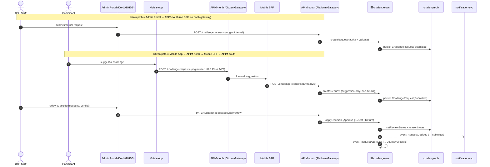
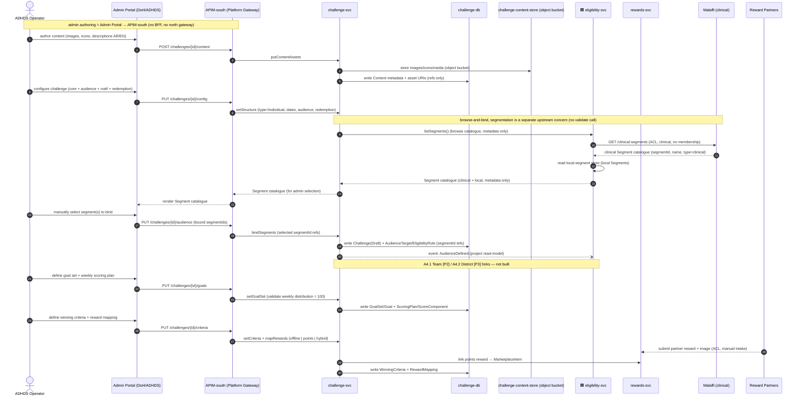
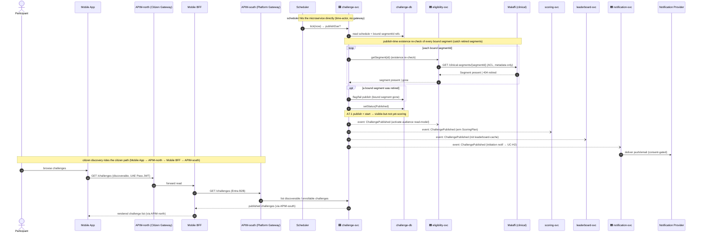
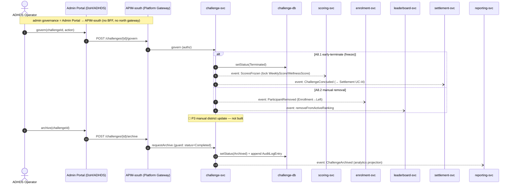

# Application-Level Sequences — Challenge Authoring & Lifecycle (`challenge-svc`, 🟢 P1)

**Top-down abstraction** of the bottom-up ICONIX sequences in
[`../../04-sequences/challenge-authoring.md`](../../04-sequences/challenge-authoring.md). The low-level
boundary/control/entity messages (UC-A1…UC-A9) are collapsed into **application-to-application** calls:
participants are **surfaces, microservices, datastores and external systems** — not controllers or
fine-grained methods. Every low-level controller now lives **inside** its owning microservice; every
`«C»→«E»` hop becomes a coarse service→store call.

**Bounded context owner**: `challenge-svc` [store: **challenge-db** (PostgreSQL)]. This package is the
authoring authority; downstream contexts (eligibility, enrolment, scoring, leaderboard, settlement,
notification) are reached only via **published events** at publish/terminate/archive time.

**Phase scope**: 🟢 **P1 — individual challenges only.** Team (A4.1 🟡P2), baseline-personalized goals
(A5.2 🟡P2), PoD cohorts (A5.3/A6.1 🟡P2) and District branches (A4.2/A6.2/A8 🔵P3) are *not built* —
shown only as tagged notes where a journey would later fork.

**Participant legend** (exact structural names)

| Kind | Participants used here |
|---|---|
| Surface | Mobile App, Admin Portal (DoH/ADHDS) |
| Edge (citizen path) | APIM-north (Citizen Gateway), Mobile BFF, APIM-south (Platform Gateway) |
| Edge (admin path) | APIM-south (Platform Gateway) — **no BFF, no north gateway** |
| Microservices | challenge-svc, eligibility-svc, enrolment-svc, scoring-svc, leaderboard-svc, settlement-svc, notification-svc, reporting-svc |
| Stores | challenge-db, eligibility-cache, scoring-db, leaderboard-cache, leaderboard-snapshots, settlement-db |
| External | Notification Provider (push/email), Reward Partners |

> **Layering** (per `LAYERING-SPEC.md` sequence contract): citizen/mobile flows route
> `Mobile App → APIM-north (Citizen Gateway) → Mobile BFF → APIM-south (Platform Gateway) → <GP svc>`;
> admin/staff (DoH/ADHDS) flows route `Admin Portal → APIM-south → <GP svc>` (no BFF, no north gateway);
> scheduler hits the microservice directly. Reference routing: `earn-scoring.md`, `notification.md`.

---

## Journey 1 — Request → Review → Approve  *(covers UC-A1, UC-A2, UC-A3)*

Both internal (DoH staff, Admin Portal) and user (Participant, Mobile App) requests land in `challenge-svc`
as `ChallengeRequest` rows; user requests are non-binding suggestions. A reviewer evaluates and decides;
**Approve** emits an async event that hands the request off to configuration (Journey 2). Notification of
the decision is delivered through `notification-svc` (consent-gated) downstream.

> **UC trace** — UC-A1 (internal request) · UC-A2 (user suggestion, non-binding) · UC-A3 (review/approve,
> with Reject A3.1 / Return A3.2 alternates). `RequestApproved` is the hand-off into Journey 2.

> 🟥 svc receives from outside GP · 🟦 svc writes to outside GP (microservices only)

---

## Journey 2 — Configure Challenge (structure, goals, criteria, rewards)  *(covers UC-A4, UC-A5, UC-A6)*

ADHDS Operator authors the full `Challenge` aggregate in `challenge-svc` over the no-code console as a
single `Draft`. Authoring has three structural concerns: **(1) content** — images, icons and localized
(AR/EN) descriptions are written to the **`challenge-content-store` object bucket**, with only the metadata +
asset URIs persisted in `challenge-db`; **(2) logic** — core attributes + audience, the goal set + scoring
plan (weekly-distribution = 100 invariant), and winning criteria + reward mapping; **(3) segment link** —
audience targeting is **browse-and-bind**, not validate. Segmentation is a separate upstream concern: clinical
segments live on **Malaffi** and local segments in a platform local-segment store. At the audience step
`challenge-svc` asks `eligibility-svc` to **`listSegments()`** (ACL → Malaffi `GET /clinical-segments` for
clinical, plus the local-segment store for local — segment *metadata* only, no membership). The catalogue is
returned to the admin, who **manually selects** the matching segment(s), and `challenge-svc` writes the bound
**`segmentId` references** into the `EligibilityRule` — not raw criteria. Validity is implicit (you can only
bind from the live catalogue). The audience definition is then **projected** to `eligibility-svc`
(read-model), and points rewards reference marketplace items in `rewards-svc`. Partner reward images arrive
out-of-band from **Reward Partners**.

> **UC trace** — UC-A4 (structure & audience; A4.3 whitelist, A4.4 hybrid redemption) · UC-A5 (goal set &
> scoring; A5.4 sum-to-100 invariant rejects bad config) · UC-A6 (winning criteria & reward mapping; A6.3
> no-code extensibility). Structural seams: content→`challenge-content-store` (object bucket),
> author-time segment **browse-and-bind**→`eligibility-svc.listSegments()`→**Malaffi** `GET /clinical-segments`
> (ACL, metadata only) + local-segment store, admin selects → `EligibilityRule` holds `segmentId` refs,
> audience projection→`eligibility-svc`, points reward→`rewards-svc`.

---

## Journey 3 — Publish Challenge (go-live fan-out)  *(covers UC-A7)*

A scheduler tick drives `challenge-svc` to flip a configured `Draft` to `Published` at its publish
datetime. Before go-live, `challenge-svc` runs a **publish-time existence re-check** of every bound segment
via `eligibility-svc.getSegment(id)` (ACL → Malaffi `GET /clinical-segments/{segmentId}`) to catch a segment
retired between authoring and go-live, flagging/failing publish if a bound segment is gone. Publication then
**fans out** asynchronously: the challenge becomes discoverable on the Mobile App,
`eligibility-svc` activates the audience read-model so members can enrol via `enrolment-svc`,
`scoring-svc` arms the scoring plan, `leaderboard-svc` initialises the (empty) leaderboard, and
`notification-svc` emits the consent-gated initiation notification (→ UC-H2) through the Notification
Provider. The citizen then **discovers** the published challenge over the citizen path
(`Mobile App → APIM-north → Mobile BFF → APIM-south → challenge-svc`).

> **UC trace** — UC-A7 (time-triggered publish; A7.1 pre-start visibility). Publish first runs a
> **segment existence re-check** (`eligibility-svc.getSegment(id)`→**Malaffi** `GET /clinical-segments/{segmentId}`),
> flagging/failing publish if a bound segment was retired since authoring. One authoring event then fans out to
> eligibility / scoring / leaderboard / notification — the structural seam between this package and the
> runtime contexts.

---

## Journey 4 — Govern, Early-Terminate & Archive  *(covers UC-A8, UC-A9)*

Operator actions on a live or completed challenge. **Early-terminate** freezes scores (via `scoring-svc`)
and triggers settlement; **manual removal** exits a participant from active ranking (via `enrolment-svc` +
`leaderboard-svc`); **archive** requires `Completed` and moves the challenge to history. Every structural
change writes an immutable audit entry in `challenge-db` and projects to `reporting-svc`.

> **UC trace** — UC-A8 (governance: A8.1 early-terminate→score-freeze→settlement, A8.2 manual removal) ·
> UC-A9 (archive; A9.1 must-be-Completed guard). All paths audited in `challenge-db`; cross-context to
> `scoring-svc`, `settlement-svc`, `enrolment-svc`, `leaderboard-svc`, `reporting-svc`.

---

## Coverage map (low-level UC → application journey)

| Journey | UCs covered | Primary service | Stores written | Cross-context events |
|---|---|---|---|---|
| 1 Request→Review→Approve | A1, A2, A3 | challenge-svc | challenge-db | →notification-svc; RequestApproved→J2 |
| 2 Configure | A4, A5, A6 | challenge-svc | challenge-db | →eligibility-svc, →rewards-svc; Reward Partners ACL |
| 3 Publish | A7 | challenge-svc | challenge-db | →eligibility / scoring / leaderboard / notification-svc → Notification Provider |
| 4 Govern/Archive | A8, A9 | challenge-svc | challenge-db | →scoring / settlement / enrolment / leaderboard / reporting-svc |

**Traceability**: every message above maps back to a UC-A_n_._x_ step in
[`../../04-sequences/challenge-authoring.md`](../../04-sequences/challenge-authoring.md); controllers from
the robustness diagrams are absorbed into `challenge-svc`; no P2/P3 behaviour is sequenced (tagged notes
only).
