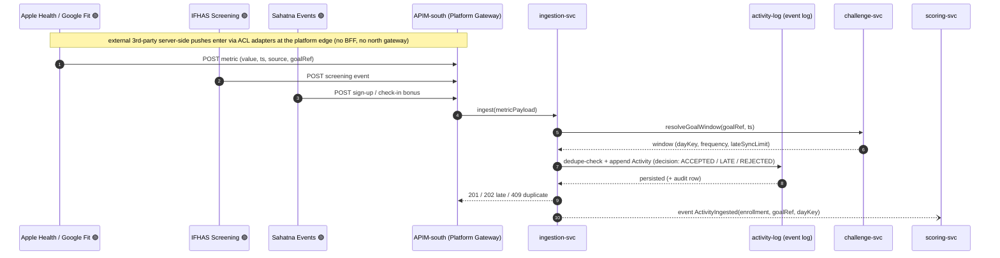
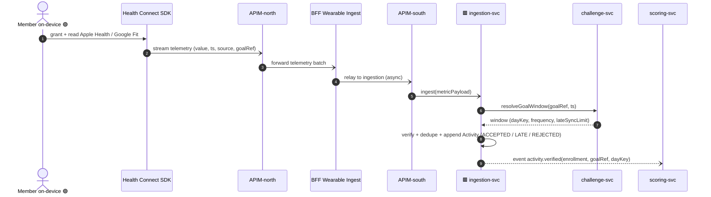
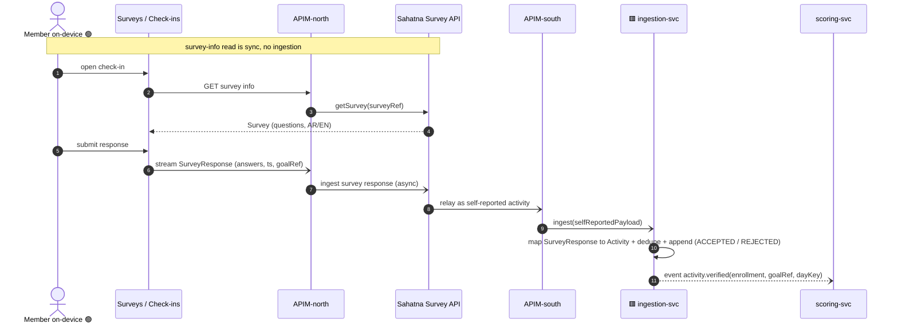
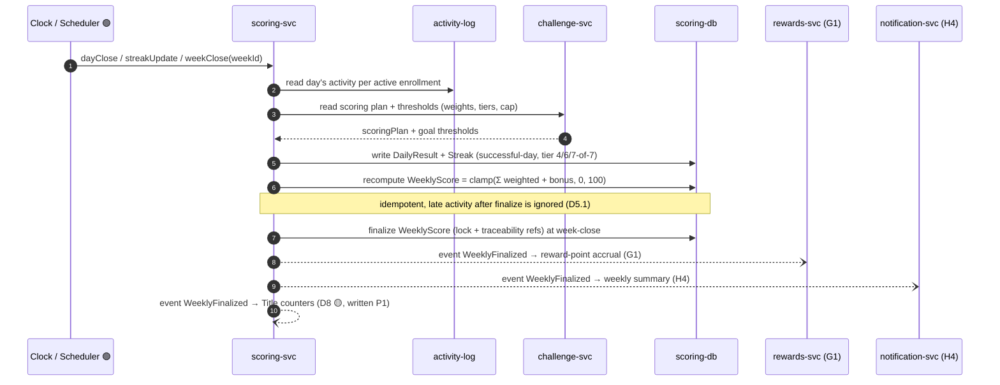
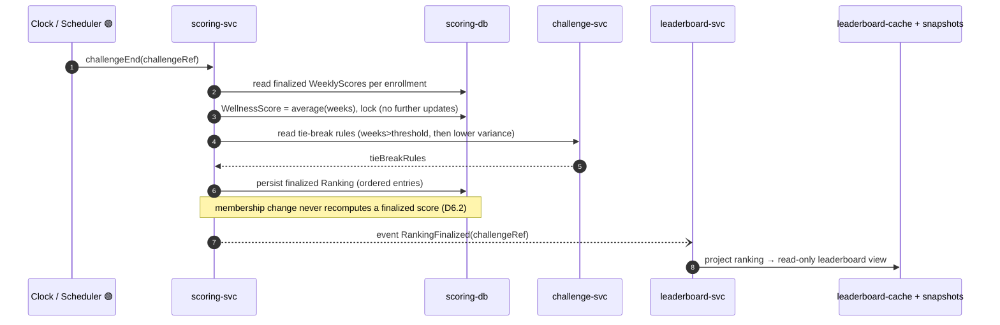
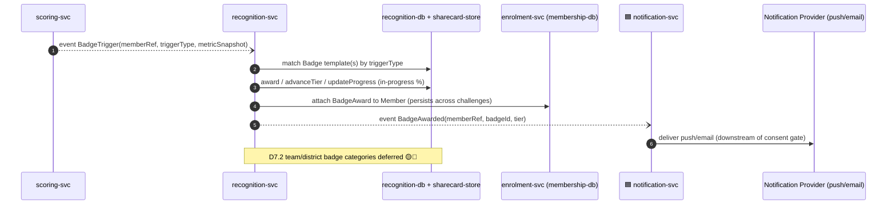

# Application-Level Sequences — Package D "Earn & Scoring (streaks/badges/titles)" (`earn-scoring`, P1)

> **Altitude**: APPLICATION-level. Participants are **applications, microservices, datastores and
> external systems** — not the low-level ICONIX `«B»/«C»/«E»` objects. Each coarse message collapses a
> whole low-level interaction (controller orchestration + entity reads/writes) into one
> application-to-application call.
>
> **Derived from** (bottom-up): `04-sequences/earn-scoring.md` (UC-D1…D10) and its robustness diagrams
> `03-robustness/earn-scoring.md`. Backward-trace notes under each diagram map the high-level flow to the
> covering use cases.
>
> **Owning context**: Scoring & Progression → **scoring-svc** [store: **scoring-db** (PostgreSQL)].
> Earn/Scoring is the system-driven engine that consumes ingested activity and emits finalization,
> reward-accrual and recognition events to neighbouring contexts.
>
> **Phase tags**: 🟢 P1 in-scope · 🟡 P2 deferred · 🔵 P3 deferred. Phase-1 is individual-only; Title (D8),
> Team (D9), District (D10) are tagged and shown for forward-traceability only — their P1 footprint is
> *counters written, read-out deferred*.

---

## Journey D-A — Activity Ingestion 🟢 P1 (covers UC-D1)

A data-source (wearable, screening, event or survey) pushes a metric. Ingestion validates/dedupes against
the goal window, appends to the activity log, and emits an `ActivityIngested` event that wakes the scoring
engine. Apple Health / Google Fit, IFHAS, Sahatna are anti-corruption-layer adapters fronting the same API.

> **Backward trace**: UC-D1 (ingest + dedupe + late-sync window + ingestion audit log). These are external
> 3rd-party server-side pushes that enter the platform via ACL adapters at **APIM-south (Platform Gateway)** —
> no BFF, no north gateway (that mobile-originated path is shown in D-A1 / D-A2). External ACL adapters =
> Wearables / IFHAS / Sahatna. `resolveGoalWindow` is the cross-context call into challenge-svc.

> 🟥 svc receives from outside GP · 🟦 svc writes to outside GP (microservices only)

---

## Journey D-A1 — Wearable Telemetry Stream (Health Connect SDK) 🟢 P1 ⊕ (covers UC-D1a / E2)

Wearable telemetry is a **frontend stream from the on-device `Health Connect SDK`** (Apple Health / Google Fit
reader) — **not** a server-side wearables-cloud pull. The SDK streams telemetry async through APIM-north → BFF
Wearable Ingest → APIM-south → ingestion-svc, which verifies/dedupes against the goal window and emits
`activity.verified` into the same scoring pipeline (Journey D-B).

> **Backward trace**: UC-D1a (E2). The path is `Mobile (Health Connect SDK) → APIM-north → BFF Wearable Ingest
> → APIM-south → ingestion-svc`, async. ingestion-svc verifies and emits `activity.verified` — there is no
> wearables-provider pull.

---

## Journey D-A2 — Survey / Check-in Response Stream (Sahatna Survey API) 🟢 P1 ⊕ (covers UC-D1b / E3)

Survey **info** (definitions/questions) is read **sync** from the `Sahatna Survey API`. Survey **responses**
stream the **SAME way as wearables** — async through APIM-north → Sahatna Survey API → APIM-south →
ingestion-svc — and are ingested as **self-reported activity (check-ins)**, feeding scoring exactly like verified
wearable metrics (cf. BRD mental / nutrition / sleep check-ins).

> **Backward trace**: UC-D1b (E3). Survey-info read is sync (`Mobile → Sahatna Survey API`). Survey-response
> submit is async: `Mobile (Surveys) → APIM-north → Sahatna Survey API → APIM-south → ingestion-svc`. Responses
> are self-reported activity and feed scoring identically to wearable metrics.

---

## Journey D-B — Daily → Weekly Scoring Pipeline 🟢 P1 (covers UC-D2, D3, D4, D5; emits to G/H/D8)

The core system-driven engine. A scheduler drives day-close, streak/week-close. Scoring evaluates daily
success, recomputes the weighted weekly score (100-cap), folds in the consistency-bonus tier, and at
week-close finalizes (immutable) — then fans out async events to rewards (G1), notification (H4) and the
P1 Title counters (D8 🟡). Badge triggers (Journey D-D) ride the same evaluation events.

> **Backward trace**: UC-D2 (daily success → streak), UC-D3 (weighted weekly score + 100-cap), UC-D4
> (consistency-bonus tier embedded in 100), UC-D5 (finalize + lock + emit G1/H4/D8 triggers). All
> intra-`scoring-svc` controller/entity chatter is collapsed into scoring-db writes; cross-context reads go
> to challenge-svc; downstream triggers are async events to rewards-svc / notification-svc.

---

## Journey D-C — Challenge-End: Final Score & Ranking 🟢 P1 (covers UC-D6; feeds leaderboard-svc)

At challenge-end the scheduler fires. Scoring averages the finalized weekly scores per participant, locks
the wellness score, applies tie-break rules into a finalized ranking, then publishes that ranking for the
leaderboard context to reflect as a read-only view.

> **Backward trace**: UC-D6 (average finalized weeks → WellnessScore + tie-break → finalized Ranking).
> The scoring-side Ranking is authoritative; leaderboard-svc only *reflects* it (read model).

---

## Journey D-D — Badge Award 🟢 P1 (covers UC-D7; Title D8 🟡 deferred)

Evaluation/participation events (from the scoring pipeline or activity) raise badge triggers. The
recognition context evaluates them against badge templates, awards or advances tiers, attaches the award to
the member (persists across challenges), and notifies the user via the consent-gated notification path.

> **Backward trace**: UC-D7 (trigger → match template → award/advance/progress → attach to Member →
> notify). UC-D8 (Title award/advance) is 🟡 P2: its lifetime counters are written in Journey D-B at
> WeeklyFinalized, but the user-facing Title read-out is deferred. Team (D9 🟡) / District (D10 🔵)
> aggregation are out of Phase-1 scope.
