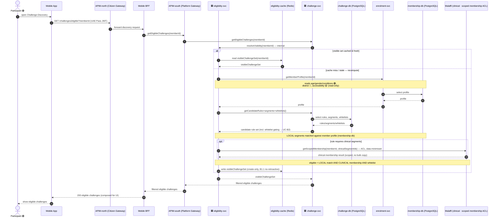
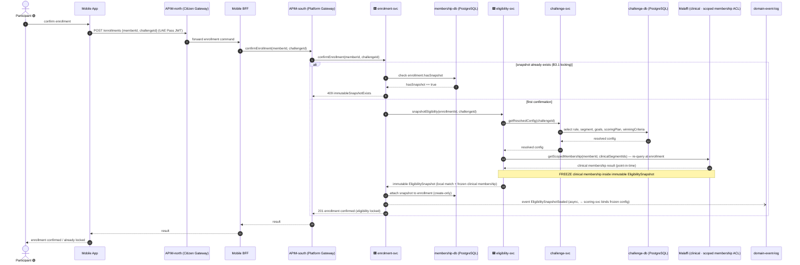

# Application-Level Sequences — Eligibility & Audience Targeting (`eligibility`) · 🟢 P1

**Derivation**: top-down abstraction of the low-level ICONIX Step-3 sequences in
[`../../04-sequences/eligibility.md`](../../04-sequences/eligibility.md). Low-level boundary /
control / entity lifelines (Discovery Screen, Eligibility API, `EligibilityEvaluator`,
`WhitelistMatcher`, `EligibilitySnapshotService`, `Member`, `Challenge`, `EligibilityRule`,
`Segment`, `Whitelist`, `EligibleChallengeVisibility`, `Enrollment`, `Goal`, `ScoringPlan`,
`WinningCriteria`, `EligibilitySnapshot`) are collapsed into **application + store** participants.

**Bounded context**: Eligibility & Audience → **eligibility-svc** [store: **eligibility-cache**
(Redis read-model)]. `eligibility-svc` is an **internal supporting service (read-model + Malaffi
clinical ACL)** — **NOT a citizen front door**: it owns no aggregate (`CohortScope` is a rebuildable
projection, no SoR) and has **no external surface**. Discovery is **published by Challenge**:
`challenge-svc` is the front door and calls `eligibility-svc` internally to resolve the visible set.
The Redis read-model holds the precomputed per-member visible-challenge set and
the resolved-rule / whitelist projections; the authoritative rule, segment, whitelist and snapshot
definitions are owned upstream by **challenge-svc** [challenge-db] and the resulting immutable
snapshot is persisted by **enrolment-svc** [membership-db].

**Phase scope**: entirely 🟢 **P1** (individual). District (🔵 P3) and accessibility/PoD (🟡 P2)
appear only as read attributes carried on the member profile / rule and are tagged inline — no
P2/P3 behaviour is sequenced. Teams / Districts / Titles / baseline-personalized goals are out of
build scope for this package.

**Layering** follows the Sequence layering contract (`../LAYERING-SPEC.md`) and the in-repo
reference pattern (`earn-scoring.md`, `notification.md`). Both journeys are **citizen / mobile-originated
gameplay reads/commands**, so they route `Mobile App → APIM-north (Citizen Gateway) → Mobile BFF →
APIM-south (Platform Gateway) → <GP front-door microservice>`. For **discovery** the GP front door is
**challenge-svc** (`getEligibleChallenges`), which calls `eligibility-svc` **internally**;
`eligibility-svc` has **no inbound from APIM-south**. The **Mobile BFF** is the gameplay BFF (discovery
read + enrollment command). UAE Pass identity is enforced at APIM-north. There are no admin or scheduler
legs in this package, but eligibility now **does** carry a clinical **external-ACL** leg: when a rule
requires clinical segments, `eligibility-svc` resolves clinical membership via a **scoped-membership ACL
query to Malaffi** (data-minimised, no bulk copy). Otherwise it remains a citizen read/command path into
the GP. Eligible = **LOCAL** segment match (membership-db) **AND** **CLINICAL** membership (Malaffi)
**AND** whitelist gating.

---

## Journey 1 — Discover Eligible Challenges (incl. whitelist gating)

> Merges **UC-B1 Evaluate Challenge Eligibility** + **UC-B2 Match Whitelisted Audience**
> (B2 is `included by` B1, at application altitude both resolve inside `eligibility-svc`).

The Mobile App opens discovery. The call rides the citizen chain `Mobile App → APIM-north → Mobile BFF
→ APIM-south → challenge-svc` (front door, `getEligibleChallenges`), which calls `eligibility-svc`
**internally** (`resolveVisibility` / `evaluateEligibility`). `eligibility-svc` serves the precomputed
visible set from
`eligibility-cache` on the hot path, on a cache miss (or staleness) it re-evaluates by reading the
member profile (from `enrolment-svc` / `membership-db`) and the candidate challenges' rules,
segments and whitelists (from `challenge-svc` / `challenge-db`). **Local** segments are matched
against the member profile from `membership-db`, while **clinical** segments are resolved per-user
via a scoped-membership **ACL query to Malaffi** (only when the candidate rule needs clinical
segments). A member is eligible iff it matches all required **LOCAL** segments **AND** all required
**CLINICAL** membership (Malaffi) **AND** the whitelist gating (UC-B2). It then recomputes the
per-member visibility set (create-only — never retroactively rewritten, **B1.1**), and writes it
back to the read-model. `eligibility-svc` returns the visible set to `challenge-svc`, which returns
the filtered challenges back out to the app.

> 🟥 svc receives from outside GP · 🟦 svc writes to outside GP (microservices only)

*Covers UC-B1 (Evaluate Challenge Eligibility) and UC-B2 (Match Whitelisted Audience), whitelist
membership decision and segment resolution are absorbed into the `eligibility-svc` re-evaluation
against `challenge-db`. Citizen path: `Mobile App → APIM-north → Mobile BFF → APIM-south → challenge-svc`
(front door) → (internal) `eligibility-svc`. `eligibility-svc` has no inbound from APIM-south.*

---

## Journey 2 — Snapshot Eligibility at Enrollment

> **UC-B3 Snapshot Eligibility at Enrollment** — `included by` UC-C3 Enroll (enrolment context)
> on confirmation.

On enrollment confirmation the command rides the same citizen chain `Mobile App → APIM-north →
Mobile BFF → APIM-south → enrolment-svc`. `enrolment-svc` asks `eligibility-svc` to freeze eligibility.
`eligibility-svc` reads the resolved rule, matching segment, configured goal set, scoring plan and
winning criteria from `challenge-svc` / `challenge-db`, **re-queries Malaffi** for the challenge's
clinical-segment membership and **freezes that clinical-membership result inside the immutable
`EligibilitySnapshot`** (so locked eligibility is pinned point-in-time and unaffected by later
Malaffi/profile changes), assembles the **immutable** snapshot, and
`enrolment-svc` persists it against the enrollment in `membership-db` (create-only — a second
confirmation on an enrollment that already has a snapshot is rejected, **B3.1**). The sealed
snapshot is emitted as an async event onto the **domain-event-log** so downstream scoring can bind
to the frozen config.

*Covers UC-B3 (Snapshot Eligibility at Enrollment), the immutable-snapshot create-only guard and the
re-confirmation rejection realize alternate course B3.1. The `EligibilitySnapshotSealed` async event
on the `domain-event-log` is the forward anchor consumed by the Scoring & Progression context.*

---

## Cross-context summary

| Flow | Sync calls | Async events | Covering UCs |
|---|---|---|---|
| Discover eligible challenges | Mobile App → APIM-north → Mobile BFF → APIM-south → challenge-svc (front door, getEligibleChallenges) → (internal) eligibility-svc → {eligibility-cache, enrolment-svc/membership-db (LOCAL segments), challenge-svc/challenge-db}, eligibility-svc → Malaffi (CLINICAL scoped-membership ACL, opt) — eligibility-svc is an internal supporting service (read-model + Malaffi ACL), NOT a citizen front door, discovery is published by Challenge, eligibility-svc has no APIM-south inbound | — | UC-B1, UC-B2 |
| Snapshot at enrollment | Mobile App → APIM-north → Mobile BFF → APIM-south → enrolment-svc → eligibility-svc → challenge-svc/challenge-db, eligibility-svc → Malaffi (CLINICAL re-query, frozen in snapshot), enrolment-svc → membership-db | `EligibilitySnapshotSealed` (enrolment-svc → domain-event-log → scoring-svc) | UC-B3 |
