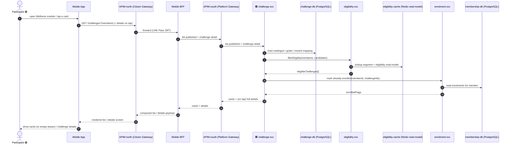
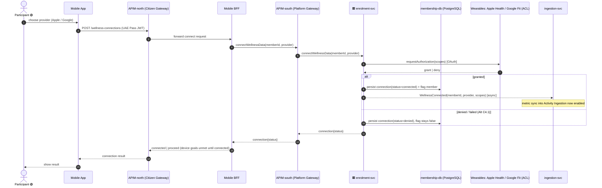
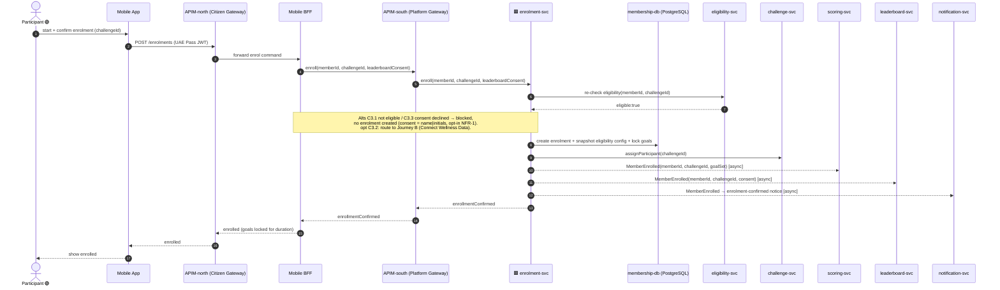
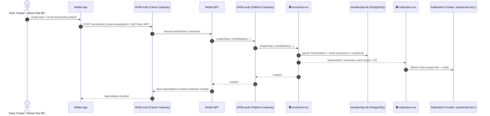

# Application-Level Sequences — "Discovery & Enrolment" package (`enrolment`, 🟢 P1)

> **Top-down abstraction** of the bottom-up ICONIX Step-3 sequences in
> [`../../04-sequences/enrolment.md`](../../04-sequences/enrolment.md). Participants here are **applications and
> stores only** — surfaces (Mobile App / Admin Portal), the **two-leg gateway** (`APIM-north (Citizen Gateway)` ·
> `APIM-south (Platform Gateway)`) and the **Mobile BFF** that drives the citizen surface, named **microservices**,
> their **datastores**, and **external systems**. Low-level «B»/«C»/«E» objects and fine-grained messages are
> collapsed into coarse application-to-application calls. Cross-context calls and async events between microservices
> are shown explicitly.
>
> **Layering contract** (per `architecture/LAYERING-SPEC.md`, matching `earn-scoring.md` / `notification.md`): every
> citizen flow routes `Mobile App → APIM-north (Citizen Gateway) → Mobile BFF → APIM-south (Platform Gateway) →
> <GP microservice>`. The **Mobile BFF** is the chosen BFF for all enrolment journeys (gameplay reads/commands).
> No actor reaches a GP microservice directly; UAE Pass is the citizen IdP at APIM-north.
>
> **Phase discipline**: Journeys A–C cover 🟢 **P1** use cases UC-C1..C5 (individual-only). Team / District enrolment
> (UC-C6/C7 🟡 P2, UC-C8 🔵 P3) are tagged and shown as a single forward-traceability sketch at the end — **out of P1 build scope**.
>
> **Bounded-context ownership in this package**: `enrolment-svc` (membership-db) is the keystone owner; it makes
> cross-context **read** calls into `challenge-svc` (catalogue) and `eligibility-svc` (audience read-model), and emits
> an async **`MemberEnrolled`** domain event consumed downstream by `scoring-svc`, `leaderboard-svc`, `ingestion-svc`
> and `notification-svc`.

---

## Journey A — Discover & View Challenges 🟢 P1

Merges **UC-C1 Discover Challenges** + **UC-C2 View Challenge Details** (read-only browse path; no entity writes).

> 🟥 svc receives from outside GP · 🟦 svc writes to outside GP (microservices only)

**UC coverage**: UC-C1 Discover Challenges (incl. Alt C1.1 empty/teaser), UC-C2 View Challenge Details — both `«include»` UC-B1 eligibility (served from `eligibility-svc` read-model).

---

## Journey B — Connect Wellness Data 🟢 P1

**UC-C4 Connect Wellness Data** — standalone or routed-into from enrolment (Journey C, opt). The wellness connection
is persisted by `enrolment-svc` (Member-owned) and is the **ingestion anchor** for `ingestion-svc`.

**UC coverage**: UC-C4 Connect Wellness Data (incl. Alt C4.1 denied/failed). External ACL = Wearables (Apple Health / Google Fit). Async `WellnessConnected` primes `ingestion-svc`.

---

## Journey C — Enroll (Individual) 🟢 P1 — package keystone

Merges **UC-C3 Enroll (Individual)** + **UC-C5 Provide Participation Consent**, with **UC-C4** reached as an `opt`
route-in. `enrolment-svc` orchestrates: re-check eligibility (cross-context read), capture consent, optionally route
wellness connect, then create the enrolment, snapshot eligibility config, lock goals, and emit `MemberEnrolled`.

**UC coverage**: UC-C3 Enroll (Individual) — incl. Alt C3.1 not-eligible, C3.2 route-to-UC-C4, C3.3 consent-declined,
C3.4 multi-challenge (no active-enrollment check), C3.5 goals-locked — `«include»` UC-B1 (eligibility re-check via
`eligibility-svc`), UC-B3 (eligibility snapshot, persisted in membership-db), and UC-C5 Provide Participation Consent
(name/initials choice captured inline). The async **`MemberEnrolled`** event fans out to `scoring-svc` (open goal
progression), `leaderboard-svc` (admit ranked member with consent display mode), `ingestion-svc` (via the wellness
connection from Journey B), and `notification-svc` (confirmation, downstream of consent gate).

---

## Journey D (sketch) — Team / District Enrolment 🟡 P2 / 🔵 P3 *(out of P1 build scope — forward-traceability only)*

UC-C6 Create Team + UC-C7 Join Team (🟡 P2) and UC-C8 Enroll Representing District (🔵 P3). Same keystone owner
(`enrolment-svc`) with a `mode=team|district` enrolment; team invites fan out via `notification-svc` → Notification
Provider. Shown only for forward traceability; **not built in P1**.

**UC coverage**: UC-C6 🟡 / UC-C7 🟡 / UC-C8 🔵 — tagged out of P1 scope; consume `notification-svc` and the
Notification-Provider ACL for invite delivery.

---

## Abstraction self-audit

| Rule | Result |
|---|---|
| Participants are applications/stores/externals only | PASS — Mobile App, APIM-north (Citizen Gateway), Mobile BFF, APIM-south (Platform Gateway), named `*-svc`, named datastores, Wearables/Notification-Provider ACLs; no «B»/«C»/«E» objects. |
| Layering contract obeyed (citizen path: Mobile → APIM-north → Mobile BFF → APIM-south → svc) | PASS — all four journeys A–D route through the two-leg gateway + Mobile BFF; no bare "API Gateway", no actor reaches a GP microservice directly. |
| Each diagram ≤ ~18 messages | PASS — A=18, B=17, C=18, D=12 (full Mobile→APIM-north→BFF→APIM-south→svc chain shown). |
| Trivial UCs merged per journey | PASS — C1+C2 (A), C3+C5+C4-route (C); C4 standalone (B); C6/C7/C8 (D sketch). |
| Cross-context calls shown | PASS — enrolment-svc → eligibility-svc / challenge-svc reads. |
| Async inter-service events shown | PASS — `MemberEnrolled` fan-out (scoring/leaderboard/ingestion/notification); `WellnessConnected`; `TeamInvited`. |
| Backward UC traceability note per diagram | PASS — one-line UC-coverage note under each journey, tracing to UC-C1..C8 in `01-use-cases.md` and the low-level sequences. |
| Phase tags preserved | PASS — A/B/C 🟢 P1; D 🟡 P2 / 🔵 P3 tagged out of build scope. |
