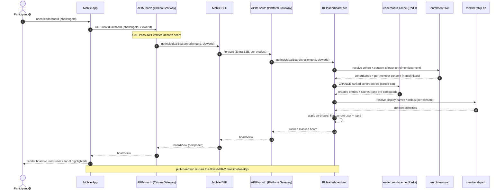
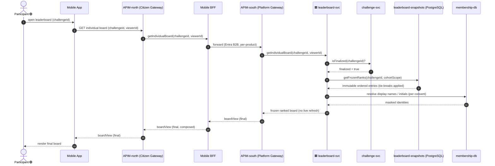
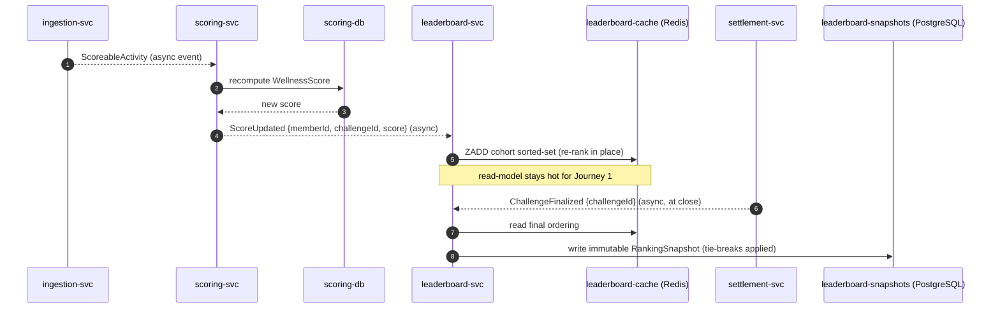

# Application-Level Sequences — **Leaderboard** package (`leaderboard`, P1)

**Altitude**: APPLICATION. Participants are *applications and stores* (surfaces, microservices, datastores, external systems) — **not** the low-level ICONIX boundary/control/entity objects. Each low-level interaction from `04-sequences/leaderboard.md` is collapsed into a coarse application-to-application call.

**Phase scope**: 🟢 **P1 = UC-E1 (individual leaderboard) only**. 🟡 UC-E2 (team/hybrid), UC-E4 (participant profile) and 🔵 UC-E3 (district) are P2/P3 — drawn for forward-traceability, tagged, **not** in the P1 build set.

**Abstraction map** (low-level ⇒ application):
`IndividualLeaderboardScreen` ⇒ **Mobile App**; `LeaderboardQueryAPI` ⇒ the citizen gateway chain **APIM-north (Citizen Gateway) → Mobile BFF → APIM-south (Platform Gateway)** (gameplay read); `LeaderboardQueryController` / `RankingController` / `PrivacyDisplayController` ⇒ **leaderboard-svc**; `Leaderboard` / `LeaderboardEntry` / `RankingSnapshot` / `CohortScope` ⇒ **leaderboard-cache** (Redis sorted-set) + **leaderboard-snapshots** (PostgreSQL); `Enrollment` / `Segment` / consent ⇒ **enrolment-svc** → **membership-db**; `WellnessScore` ⇒ **scoring-svc** → **scoring-db**; `Member` display-name/initials ⇒ **enrolment-svc** → **membership-db**; `Challenge` finalize ⇒ **challenge-svc**.

---

## Journey 1 — View Individual Leaderboard (live / active board) 🟢 P1

Covers **UC-E1 basic course** + **E1.1** (consent masking, name vs initials). Read-path served from the Redis sorted-set; cohort + consent + display-name resolved cross-context, ranking masked and highlighted by `leaderboard-svc`.

> 🟥 svc receives from outside GP · 🟦 svc writes to outside GP (microservices only)

> **UC trace**: UC-E1 basic + E1.1. Scores are pre-aggregated into `leaderboard-cache`; `scoring-svc`/`scoring-db` is *not* on the read path (kept off via the async projection in Journey 3). `challenge-svc` consulted only to test finalized state (see Journey 2).

---

## Journey 2 — View Finalized Leaderboard (challenge ended) 🟢 P1

Covers **UC-E1 / E1.2**: once the challenge ends, the board is immutable. The live sorted-set is bypassed and the frozen, tie-broken `RankingSnapshot` is served from PostgreSQL — no live refresh.

> **UC trace**: UC-E1 / E1.2. Finalization (`isFinalized`) is owned by `challenge-svc`; the snapshot is the system of record for concluded boards. Refresh is suppressed on the surface.

---

## Journey 3 — Leaderboard Projection (async score → ranking) 🟢 P1

The cross-context async event that keeps Journey 1's sorted-set current. Not a UC of its own — it is the *enabler* behind UC-E1's pre-ranked read. When `scoring-svc` recomputes a `WellnessScore`, it publishes; `leaderboard-svc` updates the cohort's Redis sorted-set; at challenge close `settlement-svc`/`challenge-svc` triggers the immutable snapshot write.

> **UC trace**: enabler for UC-E1 basic (live) and E1.2 (finalized). Realizes the NFR-2 freshness contract by keeping ranking off the synchronous read path. Cross-context async: `ingestion-svc → scoring-svc → leaderboard-svc`, and `settlement-svc → leaderboard-svc`.

---

## P2 / P3 forward-traceability (tagged, NOT in P1 build set)

These reuse the same application participants; flows are sketched at one line each — full sequences to be drawn when the phase is scheduled.

- 🟡 **UC-E2 View Team / Hybrid Leaderboard** (P2): `Mobile App → APIM-north (Citizen Gateway) → Mobile BFF → APIM-south (Platform Gateway) → leaderboard-svc → leaderboard-cache` mixing individual + **team** entries (ranked equally), team scores via **enrolment-svc** (membership), drill-to-team-members; excludes a member already competing in a team.
- 🟡 **UC-E4 View Participant Profile** (P2): `Mobile App → APIM-north (Citizen Gateway) → Mobile BFF → APIM-south (Platform Gateway) → leaderboard-svc`, fanning to **recognition-svc** (badges/titles via recognition-db) + **scoring-svc** (active-challenge score) + **enrolment-svc** (consent-masked header).
- 🔵 **UC-E3 View District Leaderboard** (P3): `Mobile App → APIM-north (Citizen Gateway) → Mobile BFF → APIM-south (Platform Gateway) → leaderboard-svc → leaderboard-cache/leaderboard-snapshots`, outer = **districts only**, drill to inner participant list; finalized outer order from `leaderboard-snapshots`.

---

## Sanity check (golden thread)
- **Forward**: every P1 low-level interaction in `04-sequences/leaderboard.md` (cohort resolve, sorted-set fetch, score read, consent mask, finalize/snapshot) is collapsed into an application-to-application call across Journeys 1–3. ✅
- **Backward**: each journey carries a one-line UC map (UC-E1 basic, E1.1, E1.2 + the projection enabler). ✅
- **Phase guard**: only UC-E1 journeys are in the P1 build set; UC-E2/E4/E3 are tagged forward-traceability only. ✅
- **Altitude guard**: participants are surfaces, microservices, datastores and external/async producers — no `«B»/«C»/«E»` objects. ✅
- **Cross-context**: sync (`enrolment-svc`, `challenge-svc`, `membership-db`, `scoring-db`) and async (`ScoreUpdated`, `ChallengeFinalized`) calls shown. ✅
- **Layering**: citizen reads (Journeys 1, 2 + P2/P3 sketches) route `Mobile App → APIM-north (Citizen Gateway) → Mobile BFF → APIM-south (Platform Gateway) → leaderboard-svc` (gameplay-read BFF). Journey 3 is internal/async (scheduler + event backbone) with no gateway leg, per the sequence layering contract. No bare `API Gateway` remains. ✅
