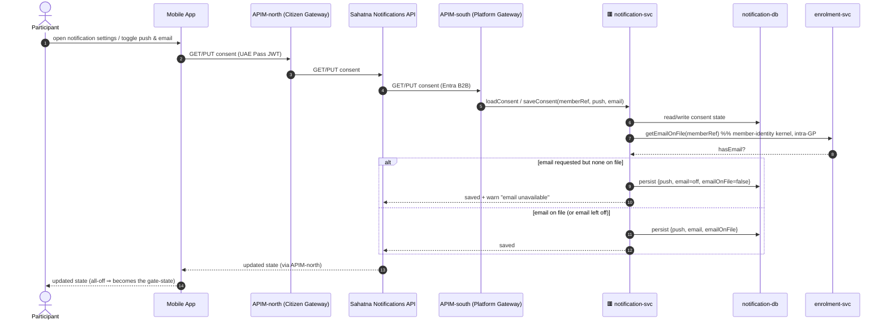
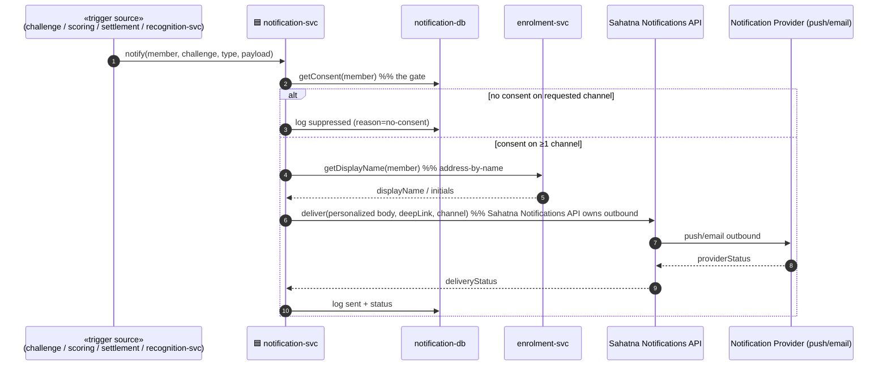
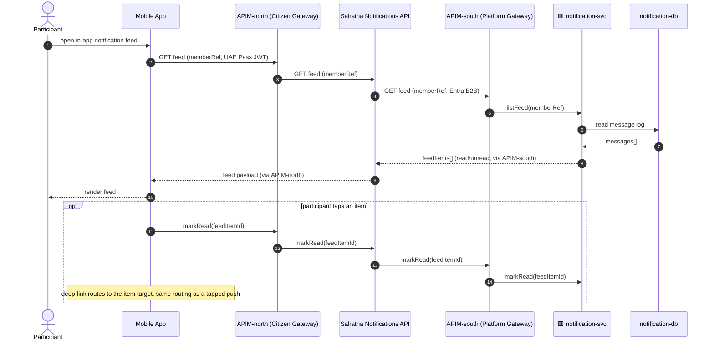
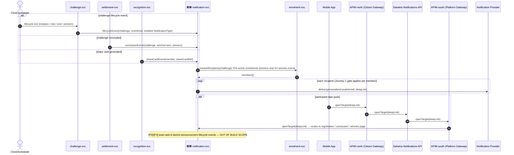
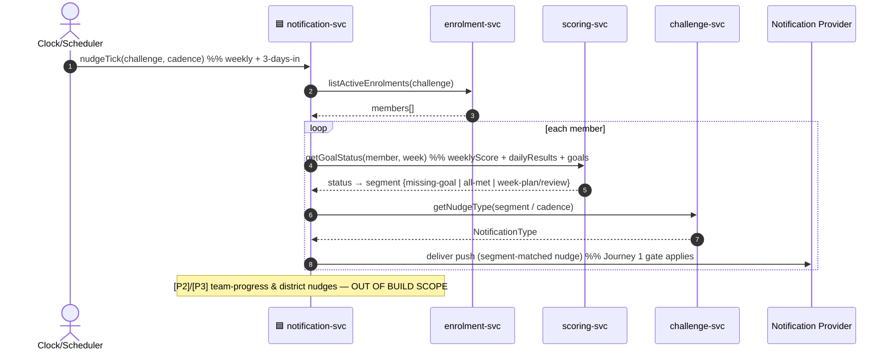
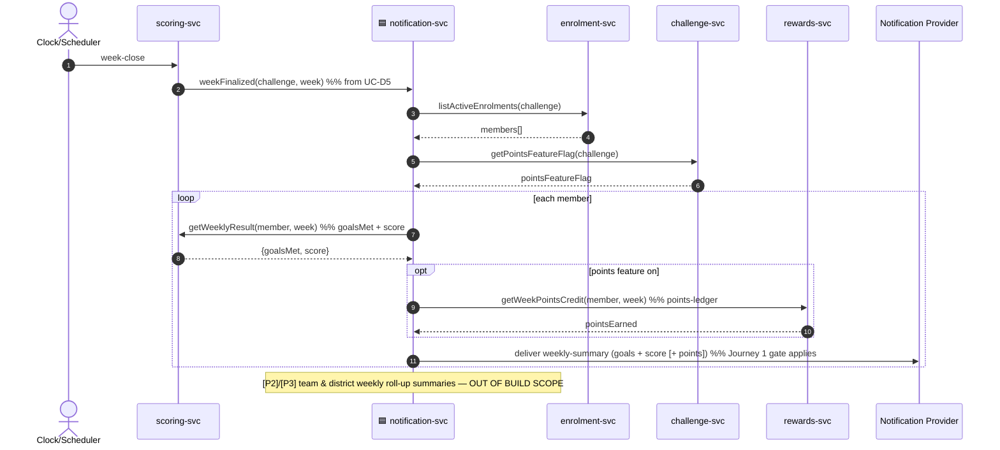

# Application-Level Sequences — Notification Package (`notification`, cross-cutting)

**Derivation**: top-down application sequences abstracted from the low-level ICONIX Step-3 sequences in
`04-sequences/notification.md` (UC-H1..H4 + the shared `NotificationDispatcher.dispatch(...)` sub-flow).
**Abstraction rule**: every low-level robustness `«C»` controller / `«E»` entity / fine-grained message is
collapsed into a coarse **application-to-application** call. Participants are **applications and stores only** —
surfaces (Mobile App, Admin Portal), the two-leg gateway (`APIM-north` / `APIM-south`), the BFF tier
(`Sahatna Notifications API`), the named microservices, their datastores, and external
systems — never controllers (`ConsentController`, `NotificationDispatcher`, …) or per-message verbs.
**Scope**: Phase-1 = **individual-only**. Team-add / district-announcement / title-unlock fan-out is `[P2]`/`[P3]`
and tagged inline, out of the P1 build set.

**Structural reference**: `architecture/02-logic-bounded-contexts.md` C10 (Notification → `notification-svc`,
store `notification-db`), and the context map's cross-context edges (Authoring lifecycle events, Scoring
week-finalized, Settlement conclusion, Recognition ShareCard, Notification Provider gateway).

**Cross-cutting note**: `notification-svc` is downstream of nearly every other context. It owns the **consent +
email-on-file gate** and the **address-by-name** rule. The gate is shown once (Journey 0) and `ref`'d implicitly
by every send-journey — at application level a "deliver via Notification Provider" arrow always implies the gate
already passed inside `notification-svc`. **E4**: outbound delivery is owned by the `Sahatna Notifications API`
(BFF) — `notification-svc` composes the consent-checked message and hands off to it; the same BFF also exposes
the in-app feed read-side (`Mobile → APIM-north → Sahatna Notifications API`, Journey 1b).

---

## Participants (applications & stores)

| Application / Store | Role |
|---|---|
| **Mobile App** | Participant surface — consent toggles, deep-link taps |
| **Admin Portal (DoH/ADHDS)** | operator surface — not a primary actor in notification flows (P1) |
| **APIM-north (Citizen Gateway)** | citizen-facing ingress (UAE Pass JWT) — Mobile App → BFF leg |
| **APIM-south (Platform Gateway)** | platform ingress (Entra B2B) — BFF → GP microservice leg |
| **Sahatna Notifications API** (BFF) | notification BFF surface — **owns outbound delivery** (push / email / in-app, consent-gated) AND **exposes the in-app feed** read-side (`Mobile → APIM-north → Sahatna Notifications API → APIM-south → notification-svc`) *(added in architecture enhancements — E4)* |
| **notification-svc** + `notification-db` | consent state + sent/suppressed message log; owns the gate; composes the message and hands off to the Sahatna Notifications API |
| **challenge-svc** + `challenge-db` | source of lifecycle events + per-challenge `NotificationType` enable-flags |
| **enrolment-svc** + `membership-db` | recipient set (active enrolments) + member-identity kernel (name/email-on-file) |
| **scoring-svc** + `scoring-db` | week-finalized trigger + goal/score/streak read-model for nudges & summaries |
| **rewards-svc** + `points-ledger` | points-earned line for the weekly summary (when points feature on) |
| **settlement-svc** + `settlement-db` | conclusion / won-not-won trigger |
| **recognition-svc** + `sharecard-store` | ShareCard → share/push trigger |
| **Notification Provider** (push/email) | external delivery gateway, downstream of the consent gate |
| **Clock/Scheduler** | fires lifecycle / nudge / week-close ticks |

---

## Journey 0 — Manage Notification Consent  (covers **UC-H1**)

Participant edits push/email consent; `notification-svc` validates email-on-file against the member-identity
kernel and persists the gate-state every later send reads.

> 🟥 svc receives from outside GP · 🟦 svc writes to outside GP (microservices only)

*Maps to: UC-H1 (Manage Notification Consent) — realizes P1-11, NFR-1, §Communication Enablement.*

---

## Journey 1 — Send Notification (the consent-gated send, shared by all triggers)

The single application-level **send pipeline** every trigger funnels through: `notification-svc` reads consent
from `notification-db`, reads display-name from the member-identity kernel (`enrolment-svc`), and — only if a
channel is consented — delivers via the external **Notification Provider**, logging sent/suppressed either way.

*Maps to: shared `NotificationDispatcher.dispatch(...)` sub-flow — the consent + email-on-file gate (NFR-1) and
the address-by-name rule. Referenced implicitly by every send in Journeys 2–4. **E4**: the "deliver" arrow is
realized by the `Sahatna Notifications API` (BFF), which owns outbound delivery to the Notification Provider.*

---

## Journey 1b — Read In-App Notification Feed  (covers **UC-H5**)  *(added in architecture enhancements — E4)*

The read-side of the notification BFF: the Mobile App fetches the member's in-app feed through `APIM-north` to
the `Sahatna Notifications API`, which projects the `notification-svc` message log into feed items. Marking an
item read routes back through the same surface.

*Maps to: UC-H5 (Read In-App Notification Feed) — realizes P1-11, §Communication Enablement (in-app feed). E4:
`Sahatna Notifications API` exposes the notifications API read-side, `Mobile → APIM-north → Sahatna
Notifications API`.*

---

## Journey 2 — Lifecycle, Conclusion & ShareCard Notifications  (covers **UC-H2** + the Settlement/Recognition triggers)

Three event-driven triggers — challenge lifecycle (initiation / mid / end / winners), settlement conclusion
(won / not-won), and recognition ShareCard — all resolve a recipient set and fan out through Journey 1's send
pipeline. The deep-link tap re-enters the relevant surface page.

*Maps to: UC-H2 (Send Challenge-Lifecycle Notification, triggered by UC-A7 / UC-I1 / UC-I3 via Clock) plus the
Settlement conclusion (`won-not-won`) and Recognition ShareCard cross-context triggers — realizes P1-11, P1-12,
§Nudges, §Challenge Conclusion.*

---

## Journey 3 — Progress Nudge (push-only)  (covers **UC-H3**)

Clock fires the nudge cadence; `notification-svc` reads each participant's goal/score status from `scoring-svc`,
classifies the nudge segment (missing-goal vs all-met vs week-plan/review), and sends a **push-only** nudge
through Journey 1's pipeline.

*Maps to: UC-H3 (Send Progress Nudge) — realizes P1-11, §Nudges (challenge progress), push-only, Clock weekly
cadence + 3-days-in reminder.*

---

## Journey 4 — Weekly Summary  (covers **UC-H4**)

At week-close `scoring-svc` finalizes the week and triggers `notification-svc`, which assembles each member's
summary (goals met + score, plus points earned when the points feature is on — read from `rewards-svc`) and
sends via Journey 1's pipeline.

*Maps to: UC-H4 (Send Weekly Summary, triggered by UC-D5 Finalize Weekly Score at week-close) — realizes P1-6,
§Nudges; points line gated on `Challenge.pointsFeatureFlag` (alt-course G1.4).*

---

## Traceability roll-up (low-level UC → application journey)

| Low-level UC (`04-sequences/notification.md`) | Application journey | Cross-context calls abstracted |
|---|---|---|
| UC-H1 Manage Notification Consent | Journey 0 | enrolment-svc (email-on-file kernel read) |
| shared `dispatch(...)` sub-flow | Journey 1 | enrolment-svc (display-name), Sahatna Notifications API → Notification Provider (deliver) |
| UC-H5 Read In-App Notification Feed *(E4)* | Journey 1b | Sahatna Notifications API (in-app feed read via APIM-north), notification-svc message log |
| UC-H2 Lifecycle Notification (+ Settlement conclusion, Recognition ShareCard) | Journey 2 | challenge-svc / settlement-svc / recognition-svc (triggers), enrolment-svc (recipients), Notification Provider |
| UC-H3 Progress Nudge | Journey 3 | scoring-svc (goal status), challenge-svc (nudge type), enrolment-svc (recipients), Notification Provider |
| UC-H4 Weekly Summary | Journey 4 | scoring-svc (week-finalized + results), challenge-svc (points flag), rewards-svc (points credit), Notification Provider |

**Invariant carried up**: every Journey 2–4 "deliver" arrow passes through the Journey 1 consent + email-on-file
gate inside `notification-svc` before reaching the Notification Provider — no surface or peer microservice can
bypass it. Phase-2/3 team/district/title fan-out tagged out of scope on Journeys 2–4.
