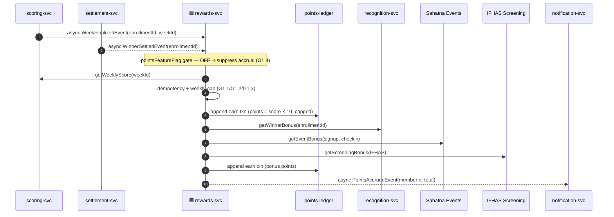
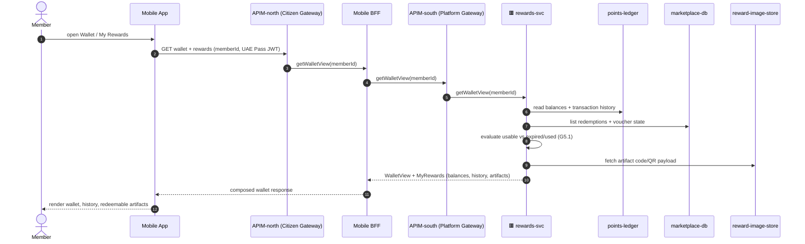
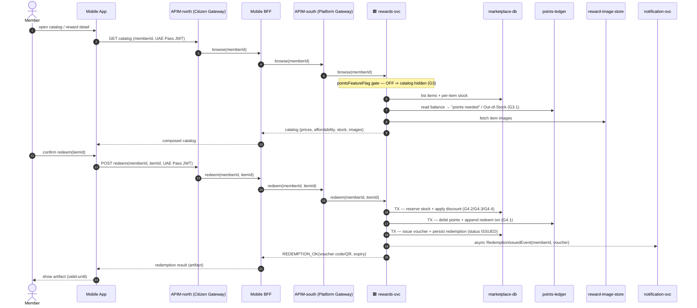
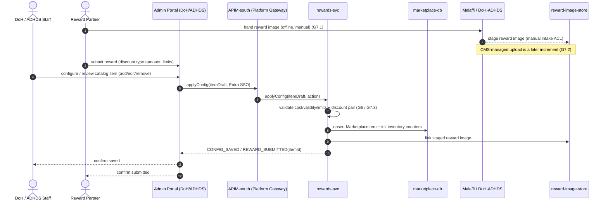

# Application-Level Sequences — Redeem & Marketplace (`redeem-marketplace`) 🟢 P1

**Altitude**: Top-down solution structure, abstracted UP from the bottom-up ICONIX low-level sequences in [`../../04-sequences/redeem-marketplace.md`](../../04-sequences/redeem-marketplace.md). Participants are **applications, microservices, datastores, and external systems** — not robustness controllers or fine-grained messages. Each low-level controller chain collapses into a coarse application-to-application call.

**Bounded context**: Rewards, Wallet & Marketplace → **rewards-svc** [stores: `points-ledger` (append-only), `marketplace-db` (PostgreSQL), `reward-image-store` (object storage)]. Cross-context collaborators: scoring-svc, recognition-svc, ingestion-svc, settlement-svc, notification-svc, reporting-svc.

**Phase scope**: All journeys P1, gated behind the **points feature flag** (BRD: points suppressed for the Sept-2026 launch). No Team/District/Title/baseline concepts → no P2/P3 fragments.

**Flag convention**: every points-bearing journey is wrapped by a `pointsFeatureFlag` gate inside rewards-svc; shown once per diagram rather than per call.

---

## Journey 1 — Accrue Reward Points (covers UC-G1)

Triggered asynchronously when a week is finalized (scoring/settlement). rewards-svc credits the wallet ledger and rolls in bonus points sourced from recognition (winner), Sahatna events, and IFHAS screening — all reached as cross-context reads, not local data.

> 🟥 svc receives from outside GP · 🟦 svc writes to outside GP (microservices only)

> **Trace**: covers **UC-G1** (Accrue Reward Points), alt-courses G1.1–G1.4. Flag gate, once-per-week guard, weekly cap, and bonus crediting all collapse into rewards-svc + cross-context bonus reads (recognition/Sahatna/IFHAS); ledger writes land in `points-ledger`.

---

## Journey 2 — View Wallet & My Rewards (covers UC-G2, UC-G5)

Two read-only member journeys merged: the points wallet/history and the issued reward artifacts. Both are reads against rewards-svc stores; artifact code/QR images come from `reward-image-store`.

> **Trace**: covers **UC-G2** (View Wallet) and **UC-G5** (My Rewards / Artifact). Empty-history and expired/used artifact alternates handled inside rewards-svc; balances/history from `points-ledger`, redemptions from `marketplace-db`, code/QR from `reward-image-store`.

---

## Journey 3 — Browse Catalog & Redeem Reward (covers UC-G3, UC-G4)

The transactional heart. Browse computes affordability and live stock; redeem is an atomic rewards-svc transaction (validate balance → enforce per-user limit → reserve stock → apply discount → debit ledger → issue voucher → persist redemption). All inventory/discount/voucher logic is internal to rewards-svc across `points-ledger` + `marketplace-db`.

> **Trace**: covers **UC-G3** (Browse Catalog) and **UC-G4** (Redeem Reward, transactional). Flag gate, insufficient-balance (G4.1), per-user limit (G4.2), out-of-stock (G4.3), and discount-type branch (G4.4) collapse into a single atomic rewards-svc transaction spanning `marketplace-db` (inventory/voucher/redemption) and `points-ledger` (debit). Async event hands off delivery to notification-svc (downstream of consent gate).

---

## Journey 4 — Configure Catalog & Submit Reward (covers UC-G6, UC-G7)

Admin/partner authoring journeys merged. Partner submission and DoH/ADHDS staff configuration both upsert items into `marketplace-db` and initialize inventory. For the September Challenge the **reward image is handed manually to the Malaffi team** (offline ACL, no upload UI) and later linked into `reward-image-store`.

> **Trace**: covers **UC-G6** (Configure Catalog & Inventory) and **UC-G7** (Submit Reward, marketplace supplement). Validation (G6), manual Malaffi image intake (G7.1), deferred CMS upload (G7.2), and discount-pair check (G7.3) all resolve inside rewards-svc; items + inventory persist to `marketplace-db`, images to `reward-image-store` via the Malaffi manual-intake ACL.

---

## Cross-context call & event summary

| From | To | Kind | Journey |
|---|---|---|---|
| scoring-svc / settlement-svc | rewards-svc | async event (WeekFinalized / WinnerSettled) | J1 |
| rewards-svc | scoring-svc | sync read (weekly score) | J1 |
| rewards-svc | recognition-svc / Sahatna / IFHAS | sync read (bonus points) | J1 |
| rewards-svc | notification-svc | async event (PointsAccrued / RedemptionIssued) | J1, J3 |
| Mobile App → APIM-north → Mobile BFF → APIM-south | rewards-svc | sync request (citizen path) | J2, J3 |
| Admin Portal → APIM-south | rewards-svc | sync request (staff path, Entra SSO, no BFF) | J4 |
| Reward Partner / Malaffi | reward-image-store | manual offline ACL intake | J4 |

**Invariant check (application layer)**
- ✅ Participants are only apps, microservices, datastores, external systems — zero robustness controllers leaked.
- ✅ All redeem-marketplace data ownership stays inside **rewards-svc** stores; cross-context needs (score, bonus, delivery) are explicit sync reads or async events.
- ✅ Each diagram ≤ ~15 messages; trivial UCs merged (G2+G5 reads; G3+G4 catalog/redeem; G6+G7 authoring).
- ✅ Every covering UC (G1–G7) mapped; feature-flag gate retained on points-bearing journeys (J1, J3); no P2/P3 messages.
