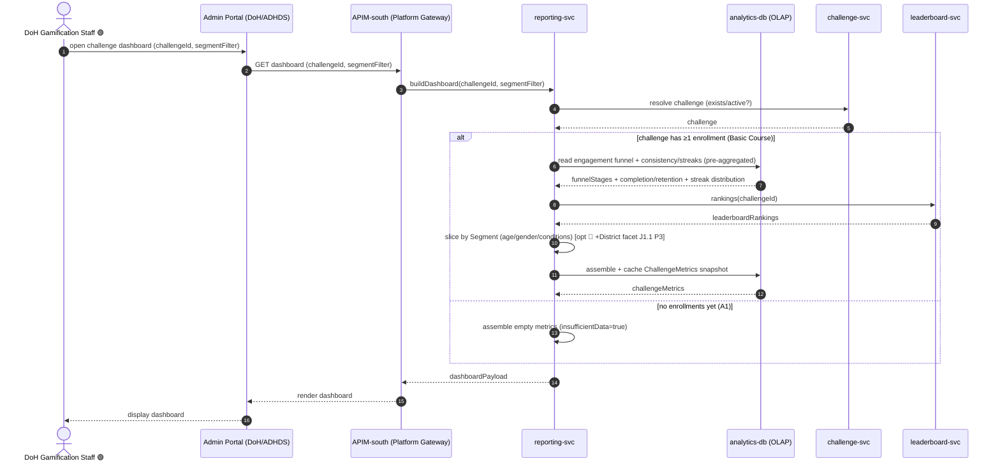
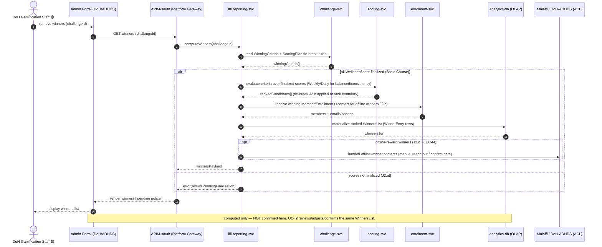
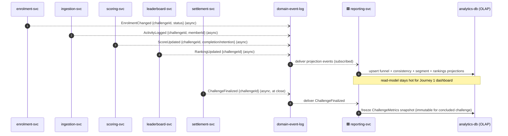

# Application-Level Sequences — **Reporting & Analytics** package (`reporting`, P1)

**Altitude**: APPLICATION. Participants are *applications and stores* (surfaces, microservices, datastores, external systems) — **not** the low-level ICONIX boundary/control/entity objects. Each low-level interaction from `04-sequences/reporting.md` is collapsed into a coarse application-to-application call.

**Surface note**: the reporting consumer is the **DoH Gamification Staff** operating through the **Admin Portal (DoH/ADHDS)** — *not* the Mobile App. Reads are served from `reporting-svc` / `analytics-db`, an OLAP read-model kept current by async domain events from the operational services.

**Phase scope**: 🟢 **P1 = UC-J1 (View Challenge Dashboard) + UC-J2 (Retrieve Winners List)**, both individual-based. 🔵 The `District` segmentation facet (J1.1) is **P3**, shown as an `opt` and tagged inline. UC-J2's winners list is the artifact UC-I2 (Settlement) reviews/confirms (`J2 -. include .-> I2`).

**Routing note**: this is an **admin/staff (DoH · ADHDS) package** — the reporting consumer operates through the **Admin Portal**, which sits **inside** the GP boundary (workforce Entra SSO). Per the layering contract, admin flows route `Admin Portal → APIM-south (Platform Gateway) → microservice` with **NO BFF and NO north (Citizen) gateway** — those are reserved for citizen/mobile flows, of which this package has none. Journey 3 is an internal cross-context async fan-in over the **domain-event-log**.

**Abstraction map** (low-level ⇒ application):
`ChallengeDashboardScreen` / `WinnersListPanel` ⇒ **Admin Portal (DoH/ADHDS)**; `ReportingQueryAPI` ⇒ **APIM-south (Platform Gateway)**; `DashboardController` / `EngagementMetricsController` / `ConsistencyMetricsController` / `SegmentationController` / `WinnersComputationController` / `ContactExtractionController` ⇒ **reporting-svc**; `ChallengeMetrics` / `EngagementFunnelStage` / `WinnersList` / `WinnerEntry` / pre-aggregated metrics ⇒ **analytics-db** (OLAP read-model); winning-criteria authority `Challenge` / `WinningCriteria` / `ScoringPlan` ⇒ **challenge-svc** → **challenge-db**; finalized `WellnessScore` / `WeeklyScore` / `DailyResult` ⇒ **scoring-svc** → **scoring-db**; `Leaderboard` / `LeaderboardEntry` rankings ⇒ **leaderboard-svc**; `Enrollment` / `Member` / `Segment` / contact details ⇒ **enrolment-svc** → **membership-db**; offline-winner contact handoff ⇒ **Malaffi / DoH-ADHDS (ACL)**.

---

## Journey 1 — View Challenge Dashboard 🟢 P1

Covers **UC-J1 basic course** + alt **A1** (no enrollments → insufficient-data dashboard). Engagement funnel, consistency/streaks, leaderboard rankings and demographic segmentation are pre-projected into `analytics-db`; `reporting-svc` assembles a `ChallengeMetrics` snapshot. The 🔵 **District** facet (J1.1, P3) is an `opt`.

> 🟥 svc receives from outside GP · 🟦 svc writes to outside GP (microservices only)

> **UC trace**: UC-J1 basic + J1.1 (🔵 P3 District `opt`) + A1 (empty). Funnel/consistency/segment metrics are served from the `analytics-db` read-model (kept current by Journey 3); `leaderboard-svc` supplies rankings; `challenge-svc` only resolves challenge state. No Team/Title/baseline-goal read appears in P1.

---

## Journey 2 — Retrieve Winners List 🟢 P1

Covers **UC-J2 basic course** + alts **J2.a** (scores not finalized → pending), **J2.b** (tie-break at rank boundary), **J2.c** (offline-reward contact extraction → handoff to UC-I4). `reporting-svc` reads winning criteria from `challenge-svc`, evaluates them over finalized scores from `scoring-svc`, ties each winner to its `Member`/`Enrollment` via `enrolment-svc`, and materializes a ranked `WinnersList` in `analytics-db`. The list is **computed, not confirmed** — UC-I2 confirms it downstream.

> **UC trace**: UC-J2 basic + J2.a (pending), J2.b (tie-break), J2.c (offline contact handoff → UC-I4). Criteria/tie-break owned by `challenge-svc`; finalized score evaluation by `scoring-svc`; member/contact resolution by `enrolment-svc`; the `WinnersList` lands in `analytics-db` as the artifact UC-I2 (`settlement-svc`) confirms. Offline-winner contacts cross the **Malaffi / DoH-ADHDS** ACL for manual reach-out.

---

## Journey 3 — Analytics Projection (async events → OLAP read-model) 🟢 P1

The cross-context async pipeline that keeps Journey 1's `analytics-db` current and seeds Journey 2's finalized evaluation. Not a UC of its own — it is the *enabler* behind the dashboard read. Operational services publish domain events; `reporting-svc` projects them into the pre-aggregated funnel/consistency/segment metrics.

> **UC trace**: enabler for UC-J1 (live dashboard) and the finalized-state read behind UC-J2. Cross-context async fan-in over the **`domain-event-log`**: `enrolment-svc / ingestion-svc / scoring-svc / leaderboard-svc` publish, `reporting-svc` subscribes and projects, and `settlement-svc → domain-event-log → reporting-svc` freezes the snapshot at challenge close — keeping aggregation off the synchronous read path. Per the layering contract, intra-GP context↔context never calls peer microservices directly — it rides the event log.

---

## P2 / P3 forward-traceability (tagged, NOT in P1 build set)

These reuse the same application participants; sketched one line each.

- 🔵 **J1.1 District-segmented community-impact metrics** (P3): same `Admin Portal → APIM-south (Platform Gateway) → reporting-svc → analytics-db` dashboard flow, adding a **District** outer-slice facet to every metric (drawn inline as the `opt` in Journey 1). Activates only when Districts are live.
- 🟡 Team / Title / baseline-personalized-goal facets (P2/P3): explicitly **out of P1 reads** — no message for them appears in these journeys.

---

## Sanity check (golden thread)
- **Forward**: every P1 low-level interaction in `04-sequences/reporting.md` (challenge resolve, engagement funnel, consistency/streaks, leaderboard rankings, segmentation, winners computation, tie-break, contact extraction) is collapsed into an application-to-application call across Journeys 1–3. ✅
- **Backward**: each journey carries a one-line UC map (UC-J1 basic + J1.1 + A1; UC-J2 basic + J2.a/J2.b/J2.c; the projection enabler). ✅
- **Phase guard**: only UC-J1 and UC-J2 are in the P1 build set; the District facet (J1.1) is tagged 🔵 P3, isolated in an `opt`. No Team/Title/baseline-goal read appears. ✅
- **Altitude guard**: participants are surfaces (Admin Portal), microservices, datastores (analytics-db OLAP read-model) and external/async producers — no «B»/«C»/«E» objects. ✅
- **Surface guard**: reporting consumer is the **Admin Portal (DoH/ADHDS)**, not the Mobile App. ✅
- **Layering guard**: admin/staff originator → `Admin Portal → APIM-south (Platform Gateway) → reporting-svc` on both read journeys — **NO BFF, NO north (Citizen) gateway** (this package has no citizen/mobile flow); intra-GP context↔context rides the **`domain-event-log`** (Journey 3); no actor reaches a microservice directly and no generic "API Gateway" remains. ✅
- **Cross-context**: sync (`challenge-svc`, `scoring-svc`, `leaderboard-svc`, `enrolment-svc`) and async via the **`domain-event-log`** (`EnrolmentChanged`, `ActivityLogged`, `ScoreUpdated`, `RankingUpdated`, `ChallengeFinalized`) calls shown; offline-winner handoff crosses the **Malaffi / DoH-ADHDS** ACL (`J2.c → UC-I4`). ✅
